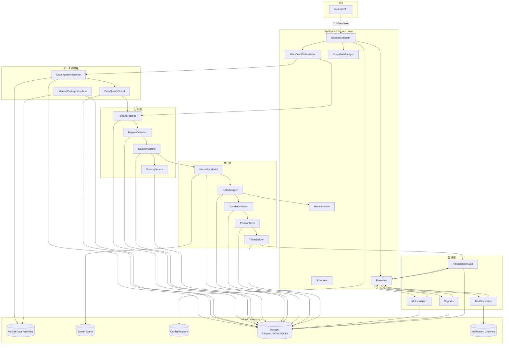
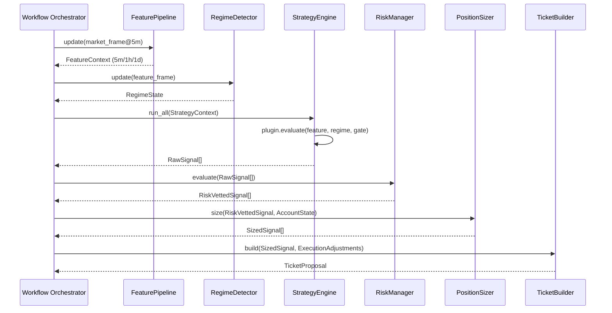

# FXヒューマン・インザループ投資ツール 詳細設計書 v1.10

## 0. 文書情報
- 作成日: 2025-02-20
- 作成者: Codex AI 支援
- 参照文書: 要件定義（テンプレ形式）v_1.md, basic_design_fx_signal_tool_v1.md
- 対象スコープ: マイルストーンM1（Backtest/Paper/Live 共通基盤）。M2以降で有効化される機能は拡張ポイントとして明示し、実装フックと制約を記載する。

### 0.1 改訂履歴
| 版 | 日付 | 改訂概要 |
| --- | --- | --- |
| v1.10 | 2025-02-21 | Codexスプリントパッケージ、RiskDisclosure詳細、Acceptable Degradation実務フロー、トレーダー受入チェックリストを追加。 |
| v1.9 | 2025-02-21 | Codex向けエピック別実装指示セット、レビュー観点テンプレ、トレーダー受入チェックの粒度を拡充。 |
| v1.8 | 2025-02-20 | Codex実装前提の開発オペレーション/プロンプト設計/テストシナリオを体系化。ヒューマン・トレーダー視点の期待KPI/UXと整合させた。 |
| v1.7 | 2025-02-20 | KPI検証/性能モニタリング強化、戦略ガバナンス、データ品質上限対策、運用冗長化を追補し、勝率達成への実効性を高めた。 |
| v1.6 | 2025-02-20 | 運用責任分掌、BCP/DR指針、QAゲート、リスクログ、サポートツール等を追補し、プロジェクト/運用一体の整合を強化。 |
| v1.5 | 2025-02-20 | 運用体制・環境要件・プレフライト/リリース手順・ネットワーク回復設計・ログ分類を追補し、工程連携を強化。 |
| v1.4 | 2025-02-20 | 前提・制約、依存ライブラリ/バージョン管理、重大障害復旧シナリオ、検証環境・エラー通知マッピングを追補。 |
| v1.3 | 2025-02-20 | 状態遷移図・CLI仕様表・設定ガバナンス表・ログ/バックアップ方針・Feature Flag一覧を追補し、運用/拡張観点を強化。 |
| v1.2 | 2025-02-20 | すご腕SEレビュー反映。各レイヤの責務整理、公開API/状態遷移/エラーハンドリングの粒度向上、イベント・スナップショットスキーマ明文化、非機能/テスト/トレーサビリティの整備。 |
| v1.1 | 2025-02-20 | 要件v1.1・基本設計v1.1差分取り込み。Spread Monitor/Execution Model/Funding/Correlation Guard/Config Governance/Health Monitorの詳細を追加。 |
| v1.0 | 2025-02-15 | 初版（M1骨子）。 |

### 0.2 用語
| 用語 | 説明 |
| --- | --- |
| Signal | 戦略プラグインが出力する売買候補。`RawSignal → RankedSignal → RiskVettedSignal → SizedSignal` の順でフィルタされる。 |
| Ticket | ヒューマンに提示する注文チケット。サイズ/SL/TP/TTL/チェックリスト/バッジを含むJSON Linesレコード（FR-07, FR-38）。 |
| GateState | カレンダー、スプレッド、Kill Switch等のブロック条件を統合した状態構造体。 |
| SpreadCooldownState | Spread Monitorが算出する状態。`normal | watch | cooldown | halt`（M1は`normal`/`cooldown`を使用）。 |
| HealthState | リスク/データ/コンフィグ健全性を統合した状態。`ok | degraded | soft_stop | hard_stop`。 |
| BoardMode | Signal Boardの提案挙動。`normal | guarded | halted`。`guarded`はAcceptable Degradation時に主要4ペアのみ承認可、`halted`はKill Switch作動中。 |
| ModeContext | Backtest/Paper/Liveごとの副作用差分を吸収する実行コンテキスト。 |
| PipelineStep | ワークフロー各段階が実装する共通インターフェース。`execute(context) -> context`。 |
| Snapshot | 再起動用ステート（AccountState/OpenTickets/ConfigHash/HealthState/LastBar）。`snapshots/latest/`に保存。 |
| EventBus | DomainEventのpublish/subscribeを担う非同期バス。JSONL永続化を伴う。 |

### 0.3 表記・参照ルール
- FR/AC/NFR番号は要件定義書に準拠する。
- ファイル/クラス名は`src/`からのパスで記載する。
- M2以降の機能は明示的に`(M2+)`ラベルを付与し、M1では無効化フラグまたはダミー実装とする。

### 0.4 対象読者・レビュー体制
| 役割 | 主な責務 | レビュー観点 | サイクル |
| --- | --- | --- | --- |
| プロダクトオーナー | 仕様承認、KPI評価 | KPI整合、運用負荷、HITL UX | 月次（レポート共有後） |
| 開発（Codex + 開発者） | 実装/テスト/CI運用 | 実装可否、技術的負債、テスト網羅 | スプリント毎 |
| 運用担当 | 日次運用、Runbook更新 | アラート対応、プレフライト、ログ監査 | 週次（運用レビュー） |
| セキュリティ/監査（将来） | 監査ログ/アクセス制御 | ログ保持、権限分離、変更管理 | 半期 |

- レビュー結果は`docs/review_log.md`に記録し、重大指摘は`logs/ops/review.log`にも記載する。
- 要件差分は`basic_design_fx_signal_tool_v1.md`を起点にトレースし、受入前にPO＋運用担当のダブルチェックを実施。

### 0.5 文書メンテナンスと変更管理
- 変更要求は`docs/change_requests/`にMarkdownで起票し、PO→開発→運用の順に承認。
- 承認後に`vNext`ブランチへ反映し、リリースタグ作成時に本ドキュメントへ統合。
- 緊急改訂は`logs/ops/hotfix.log`で記録し、24時間以内に正式な更新として追補する。

### 0.6 Codex開発ハンドオフガイド

本プロジェクトでは、実装をAI開発パートナー（Codex）に委任することを前提に、プロンプト設計・成果物レビュー・テスト実行までの一連フローを定義する。HITLトレーダーとしての意思決定品質を担保するため、以下の運用を遵守する。

#### 0.6.1 実装リクエストの標準フォーマット
- **スレッド構成**: Issue/PRには「背景（KPIまたは運用課題）」「期待シナリオ」「受入条件」「関連テレメトリ/ログ」「参考スナップショット」を記載し、Codexへ渡す要約は300〜500字で完結させる。
- **ファイル指定**: 変更対象ファイルは本詳細設計のパス記法に従い列挙し、既存セクション番号を引用（例: `3.1.2 DataIngestionService.fetch_latest`）。
- **I/O契約**: 追加関数・クラスのシグネチャ、例外、戻り値を表形式で記載。可能な限り`typing`注釈と`pydantic`モデル定義を明示する。
- **テスト要件**: `pytest -k <keyword>`単位で実行指示を与え、成功/失敗判定基準と許容する浮動小数誤差を指定する。
- **運用制約**: Spread・ニュース・Kill Switchといったトレーダー観点の制約は必ず背景に紐づけ、レビュー観点（例: 「Acceptable Degradation時でもSpread Guardの閾値を緩めない」）を明記する。
- **スタイル/リンタ基準**: 実装者は`docs/development_style_and_linting.md`を参照し、言語/フレームワーク別のスタイル規約と`ruff`/`black`/`mypy`運用方針に従う。逸脱を認める場合はチケット内で承認プロセス（§0.5）を明記する。

#### 0.6.2 Codex向けプロンプトテンプレート
```
<概要>
  ・機能目的（FR/NFR/AC番号）
  ・想定するヒューマン判断ポイント

<既存設計参照>
  ・本書の該当セクション番号
  ・関連クラス/関数とファイルパス

<変更要求>
  ・追加/更新メソッド（署名 + docstring要件）
  ・入出力例（JSON/CLI例示）
  ・例外/フォールバック動作

<テスト>
  ・必須テストコマンド
  ・Fixturesまたはモック方針

<レビューメモ>
  ・リスク観点（スリッページ/レートリミット/ヒューマン手順）
  ・ログ/監査要件
```
- Codexへ送る冒頭メッセージで「スタイル/リンタは`docs/development_style_and_linting.md`に準拠」と明示し、差分レビュー時にも該当節を引用する。
- プロンプトはGit管理（`docs/prompt_packages/<YYYYMMDD>_<feature>.md`）し、再利用時は差分管理する。
- Codexへ渡すコード断片は**200行以内**に限定し、関連する`dataclass`/`Enum`の定義を先頭に含める。外部依存がある場合はスタブ/型定義を同梱する。
- 反復が必要な場合は「差分モード」を明示し、前回出力との差分レビュー観点を列挙する。

##### プロンプト例（EP-02 Strategy Determinism）
```
<概要>
  ・FR-04/AC-09: シグナル決定論の担保、Backtest/Live一致率 > 99.5%
  ・ヒューマン判断: Guardedモード移行時にヒット率低下を許容するか（Runbook RUN-SIGNAL-02）

<既存設計参照>
  ・§2.3 Workflow Orchestrator, §3.2.4 StrategyRegistry, §15.2 EP-02 Strategy Determinism
  ・`src/strategies/registry.py::StrategyRegistry`, `src/features/pipeline.py::FeaturePipeline`

<変更要求>
  ・`StrategyRegistry.register()`でStrategyManifestの`determinism_key`を検証し、欠落時は`StrategyConfigurationError`
  ・`FeaturePipeline.replay()`に`*, tolerance: float = 1e-6`引数を追加し、許容誤差をパラメータ化
  ・CLI `tradectl benchmark replay` に `--tolerance` オプションを追加（Docstring + ヘルプ更新）

<テスト>
  ・`poetry run pytest tests/unit/test_strategy_registry.py -k determinism`
  ・`poetry run pytest tests/integration/test_feature_replay.py`
  ・CLIスナップショット: `poetry run pytest tests/approval -k benchmark`

<レビューメモ>
  ・Spread Guard閾値を変更しないこと（§5.4）
  ・データ品質低下時は`health_state=degraded`を返し、ログキー`strategy_replay_mismatch`

<スタイル/リンタ>
  ・Python/CLIスタイル: `docs/development_style_and_linting.md`
  ・型未解決時は`mypy.ini`へ一時例外を追加し、Issueに削減予定日を記載
```

##### プロンプト運用の注意点
- Codexへの再依頼時は「差分のみ」要求とともに、前回実装差分に対する評価（良かった点/懸念）を箇条書きで共有する。
- 設計差異を議論する際は、該当セクション番号（例: §3.4.2）と新旧挙動を併記し、判断の根拠となるメトリクスやRunbook手順を明文化する。
- 将来API変更が見込まれる場合は、プロンプト内で拡張ポイント（例: 新しいデータフィード設定キー）とパラメータ化戦略案を先に提示し、スコープ外の作業を抑止する。

#### 0.6.3 実装優先度マトリクス（M1）
| トラック | 主担当モジュール | Codex作業エピック | 期待成果物 | 受入基準 |
| --- | --- | --- | --- | --- |
| データSLA | `src/data/service.py`, `src/data/quality.py` | `EP-01 DataLag Mitigation` | Fetch/Processing遅延計測・フォールバック導線強化 | `metrics/data_ingestion_sla.jsonl`のp95が閾値内、`tests/integration/test_data_pipeline.py`合格 |
| シグナル | `src/features/pipeline.py`, `src/strategies/registry.py` | `EP-02 Strategy Determinism` | 特徴量リプレイ一致、戦略プラグインの決定論テスト | Backtest/Liveで同一入力→同一出力、`pytest -k strategy_determinism`合格 |
| リスク/ヘルス | `src/core/health.py`, `src/risk/manager.py` | `EP-03 Guardrails` | Kill Switch/Board Mode遷移ロジック、リスクアラート配線 | 状態遷移テスト（`tests/unit/test_health_state.py`）合格、CLI `tradectl status`に理由表示 |
| チケットUX | `src/ticket/builder.py`, `src/interfaces/cli/board.py` | `EP-04 Ticket Clarity` | チケットJSON整形、チェックリスト/バッジ表示、監査ログ項目 | `pytest -k ticket_builder`合格、サンプルCLIスナップショット承認 |
| レポート/監査 | `src/reporter/generator.py`, `src/persistence/audit.py` | `EP-05 Weekly Review` | KPI算出テンプレ、監査トレーサビリティ | `tradectl report weekly --dry-run`でMarkdown生成、監査ログ整合 |

優先度はデータSLA > リスク/ヘルス > シグナル > チケットUX > レポート。Codexへは同時並行を避け、1エピックずつ完了させる。

#### 0.6.4 Codex出力レビューの観点
- **差分検証**: `git diff --stat`で対象ファイルが設計指定内に収まっているか確認する。想定外ファイル更新は即座に差戻し。`poetry lock`変更は明示的な承認を得る。
- **静的チェック**: `ruff`, `mypy`（M1 optional）を`pre-commit`で実行。Codex出力に余計な`print`/`TODO`が含まれていないかを確認する。
- **取引リスク**: Spread/Kill Switch関連の閾値が設計値から逸脱していないか、例外時にヒューマンへ十分な情報が届くかをレビューする。
- **ログ/監査**: `logger`メッセージはRunbook検索性の高いキーワード（例: `data_latency_fetch`, `kill_switch_manual_ack`）を含める。監査ログは`AuditRecord` schema準拠であること。
- **テスト**: Codex出力に対して指定テストが実行されたことをCIログまたはローカル証跡で確認。未実行の場合は必ず差戻し。

#### 0.6.5 ヒューマン・トレーダー観点のKPIリンク
- ヒット率、平均RR、週次ドローダウンなどのKPIは`reports/kpi/dashboard.md`に集約し、Codexが手を入れる際には関連KPIの期待変化を記述する。
- Acceptable Degradation状態での運用負荷を軽減するため、開発チケットには「オペレータが何分短縮されるか」「どのRunbookステップが省略/自動化されるか」を必ず盛り込み、実装後に`logs/ops/workload.log`で効果を定量化する。
- トレーダー視点でのUX課題（例: チケット承認時にSpread理由が不明瞭）は`docs/ux_feedback.md`で管理し、Codex改善タスクには該当行を参照させる。

#### 0.6.6 Codexフィードバックループ
1. Codex出力をレビュー後、`docs/prompt_packages/<date>_<feature>.md`に「良かった点」「改善要望」「想定外差分」を追記し、次回プロンプトの改善に反映する。
2. リリース後7日間は該当機能のメトリクスを重点監視し、異常時は`feedback_loop.md`に記録。Codexへの再依頼時はこのログを添付する。
3. KPIが改善した場合は`reports/weekly/<YYYYWW>.md`に成果を記載し、反対に悪化した場合はリスクレビュー（`docs/risk_review/<YYYYMMDD>.md`）で原因と暫定対応をまとめる。

#### 0.6.7 Codexスプリント計画とレビューゲート
- **スプリント粒度**: 1スプリント=5営業日。エピック単位（§0.6.3）を`Implementation Packet`に分解し、1 PacketでCodex作業→ヒューマンレビュー→Ops影響確認まで完了させる。
- **Packet構造**: `docs/implementation_packets/<YYYYMMDD>_<epic>_<packet>.md`を作成し、(1) 目的/KPIリンク、(2) 対象ファイル/セクション引用、(3) テスト指示、(4) トレーダー受入チェックリスト、(5) Rollback手順を記載。Codexへはこのファイルと要約を同梱する。
- **Funding Packet特記事項**: Fundingロジックを変更するPacketでは§3.12.1と§5.15.1の運用手順を引用し、`tradectl funding sync/status`の証跡（CLIログ、`funding_state.json`, `reports/validation_log/AC-09_funding_<date>.md`）を`/evidence`配下に添付する。Runbook `RUN-FUND-01/02`の更新要否とOps/Risk/POのサイン有無もチェックリストに追加すること。
- **レビューゲート**:
  1. *設計整合チェック*: プロダクトオーナー/トレーダーがPacket内容と本書該当節を照合。逸脱時は`docs/change_requests/`で再承認。
  2. *Codex出力レビュー*: Diff/テスト/ログ確認に加え、`ops_worklog`への影響推定をコメントする。未確認の場合は`ops_review_pending`ラベルを付与。
  3. *トレーダー承認*: CLIスクリーンショット・テレメトリサマリを確認し、`docs/trader_signoff/<packet>.md`へ署名。署名前にRunbook該当手順を実施する。
- **WIP制限**: Codex作業中Packetは最大2件まで。Spread/Catch-up/Health関連（高リスクPacket）は単独で進行し、他Packetを一時停止する。
- **メトリクス**: Packet完了までのリードタイムを`metrics/implementation_packets.jsonl`に記録し、週次レビューでボトルネック（レビュー待ち時間>2日など）を分析する。

### 0.7 M1 Core機能トレーサビリティ表

| 機能 | 要件定義参照 | 基本設計参照 | 入力データ | 出力/副作用 | 稼働条件 | 外部API/サービス依存 | 要確認事項 |
| --- | --- | --- | --- | --- | --- | --- | --- |
| FR-01/FR-02 データ取得・品質監視 | §3 FR-01, FR-02, §3.1 M1 Core | §1.1 M1 Coreガードレール, §2 コンポーネント表 (Data Ingestion Service, Data Quality Guard), §3.2 ユースケース①②, §0.6.6 | yfinance 5分足, Dukascopy HTTPバースト, manual_fallback双子CSV, `config/sla_thresholds/*.yaml` | 正規化済みバーを`bar_ready_queue`へ供給, `metrics/data_ingestion_sla.jsonl`/`metrics/rate_limit_window.jsonl`出力, `health.changed(reason=...)`推奨アクション, manual CSVハッシュ監査 | 常時4並列フェッチ（Catch-up時6）、30分以内Catch-up達成、Acceptable Degradation時はBoardMode=guardedで運用、Runbook `RUN-DATA-05/06`準拠で手動フェイルオーバー | yfinance, Dukascopy, 将来有償フィード（M1.2+）, Runbookテンプレート | **M1 CoreではRateLimitGuardのステージ昇格/ロールバックを自動化せず、`metrics/rate_limit_window.jsonl`の`stage_eval`記録とRunbook `RUN-DATA-05`承認（Ops＋POダブルサイン）を根拠に手動判断し、`degraded_ack`イベントを必須化。M1.1以降で自動化再評価。** |
| FR-03 特徴量パイプライン | §3 FR-03, §3.3 戦略ロードマップ | §2 コンポーネント表 (Feature Engine), §3.2 ユースケース⑨, §3.2 処理シーケンス② | 正規化バー、マルチTF指標設定（5m: SMA20/EMA21-55/RSI14/BB20-2, 1h: EMA55傾き/ATR14/MACD12-26-9, 1d: Donchian20/Zスコア20） | `FeatureFrame`更新, 指標キャッシュ, `metrics/pipeline.jsonl`へのCPU/遅延記録 | 5分バー到着毎に差分再計算、ThreadPoolExecutorでCPUタスクをオフロード、Feature FlagでM2以降機能を無効化 | pandas, pandas-ta, Asyncスレッドプール | M1 Coreは上記指標を既定ONで提供し、`config/feature_pipeline.yaml::indicators.<name>.enabled`でMACD/ボリンジャー/ドンチャン/Zスコアを個別無効化可能。`tests/integration/test_feature_pipeline.py`でON/OFFの回帰テストを実施し、SMA/EMA/RSI/ATRは常時有効とする。 |
| FR-04 シグナルエンジン | §3 FR-04, Feature Flagスタブ方針 | §2 コンポーネント表 (Signal Engine), §3.2 ユースケース⑪, §3.3 チケット状態遷移 | `FeatureFrame`, `GateState`, Strategyプラグイン, `board_mode`/Health情報 | `signal.generated`イベント, ガードモード時のブロック, `badges`やScore反映 | BoardMode=guarded時は新規提案抑止、Feature Flagでガバナンス機構無効化、`strategy_manifest.yaml`と整合 | Strategyプラグイン群, Config Registry | 戦略プラグインの優先順位/重み設定の保存先を`strategy_manifest.yaml`/設定ファイルのどちらで統一するか未記載のため要確認。 |
| FR-05 リスクマネージャ | §3 FR-05, Kill Switch解除条件 | §2 コンポーネント表 (Risk Manager), §3.2 ユースケース⑮, §3.2 Health Monitor, §3.2 CLI | `AccountState`, `FundingCurve`, Spread/Correlationメトリクス, `risk_policy.yaml` | `risk.decision`イベント, Kill Switch推奨, `health.changed`でdegraded通知, BoardMode切替推奨 | 0.75%/2.5%/5%閾値遵守, Acceptable Degradation期間はReduce-Only限定, 手動Kill Switch操作とRunbookチェック必須 | ローカルポリシーYAML, metrics JSONL | なし |
| FR-06 ポジションサイジング | §3 FR-06, §3.2 戦略仕様(OCO推奨) | §2 コンポーネント表 (Position Sizer), §3.2 ユースケース⑰ | `AccountState`, `BrokerSpecs`, ATR派生値, Protect幅設定 | ロットサイズ/OCO値提案, `oco_recommendation`をTicket Builderへ送信 | Fixed Fractional 0.75%リスク、Broker最小ロット/距離順守、Marketable Limit保護幅適用 | `risk_policy.yaml`, `broker_rules.yaml` | なし |
| FR-07 注文チケット/HITL | §3 FR-07, FR-30, FR-39 | §2 コンポーネント表 (Ticket Builder), §3.2 ユースケース⑱⑲, §3.3 チケット遷移, §3.2 CLI board/ticket | SizedSignal, `BrokerSpecs`, Risk Disclosureステータス, TTL/Spread情報 | チケットJSON Lines出力, ヒューマンエラーチェック/バッジ, `audit`ログ生成 | BoardMode=guarded時はReduce-Onlyのみ表示, TTL監視と未入力警告, リスク承諾状況をヘッダ表示 | ローカルイベントログ, CLI (`tradectl board/ticket`) | `HumanErrorChecklist`は`spread_window_clear`→`double_entry_confirmed`→`sl_tp_verified`→`lot_round_ok`→`price_decimals_ok`→`oco_ack_received`→`manual_comment_logged`の順で必須化し、CLI表示・監査ログとも同一英字ラベルを使用する。 |
| FR-08 モード切替 | §3 FR-08, §3.1 M1 Core範囲 | §1 システム概要, §2 コンポーネント表 (Mode Controller, Account Service), §3.2 ユースケース①⑦ | プロファイル設定, ModeContext, モード別データソース（Backtest台帳/Paperレポート/Live CSV） | ModeContext遷移, I/O差分ハンドラ, CLI起動モード決定 | 全モードでHITLフロー共通化、`tradectl start --profile`で選択、Resync後にConsistencyチェック | ローカルファイル/CSV、将来ブローカーAPI | なし |
| FR-10 週次レポート | §3 FR-10 (M1縮小範囲) | §2 コンポーネント表 (Reporter), §3.2 ユースケース⑭・⑲・ステップ24, §7.6 KPI評価ガイド | `reports/kpi_snapshots/*.json`, `metrics/data_ingestion_sla.jsonl`, `risk_summary`, `reports/weekly/templates/m1_core.md` | 週次Markdown生成, KPI単点値出力, `reports/performance/<mode>/`更新 | Sharpe/最大DD/WinRate/累積Rのみ出力, Paper90日ウォームアップ時はmetric_state=provisional扱い | ローカルテンプレート/レポート, `MarketRatesFetcher` | 週次コメント欄（A/Bテスト結果・次週ToDo）の入力責務と提出締切をドキュメント間で統一する必要あり。 |
| FR-16/FR-18 Resync & Snapshot | §3 FR-16, FR-18 | §2 コンポーネント表 (Snapshot Manager, Session Manager), §3.2 ユースケース①④⑯, §3.2 処理シーケンス④, §4 データ構造 | `snapshots/latest/*.json`, `resync_queue`, Catch-upメトリクス | Resyncジョブ投入, `catch_up_lag_minutes`記録, Snapshot更新, `ResyncCompleted`イベント | 20分遅延でwarning/30分でdegraded, Runbook承認後に復旧、再起動時はSnapshot整合チェック | ローカルスナップショット/Parquet, metrics JSONL | なし |
| FR-28 Funding Service | §3 FR-28, §3.1 M1 Core例外 | §2 コンポーネント表 (Funding Service), §3.2 ユースケース⑥⑭, §4 データ構造（swap_rates.csv）, §6 Funding Service | `config/swap_rates.csv`, `broker_rules.yaml`, Calendarイベント, Paper/Liveポジション | `FundingCurve`生成, `swap_penalty`供給, `tradectl funding sync/status` CLI, スワップ計算をAccount/Reporterへ反映 | 日次更新（祝日三倍日補正）, Calendar連携で倍率補正, 取得失敗時はRunbook指示で手動CSV更新 | 手入力/公開CSV, Calendar Service, 将来ブローカーフィード | 手入力CSVの更新頻度・責任者とレビュー手順（Validation Data Playbookへの記録方法含む）が要件側で定量化されていないため、運用プロセスを確定する必要あり。 |

## 1. アーキテクチャ概要

本システムはヒューマン・インザ・ループ（HITL）運用を前提としたPython 3.11アプリケーションであり、データ取得からシグナル生成・リスク制御・チケット発行・監査記録までをイベント駆動で統合する。Backtest/Paper/Liveの各モードは同一ドメインロジックを共有し、I/Oと副作用はインフラ層で抽象化することでトレーサビリティと再現性（AC-13, FR-08）を担保する。

### 1.1 システム構成
```
┌──────────────────────────────────────────────┐
│ CLI (tradectl) / 将来: GUI (React+Tauri)      │
└───────────────┬──────────────────────────────┘
                │Command/API (Typer/Rich)
┌───────────────┴──────────────────────────────┐
│ Application Service Layer                    │
│  SessionManager / ModeController             │
│  Workflow Orchestrator & Async Scheduler     │
│  EventBus / SnapshotManager / HealthMonitor  │
└───────────────┬──────────────────────────────┘
                │Domain Events (JSONL stream)
┌───────────────┴──────────────────────────────┐
│ Domain Core Layer                            │
│  DataIngestion → FeaturePipeline → Regime    │
│  → StrategyEngine → ExecutionModel → Scoring │
│  → RiskManager → CorrelationGuard → Sizer    │
│  → TicketBuilder → Reporter → Persistence    │
└───────────────┬──────────────────────────────┘
                │Repositories / External APIs
┌───────────────┴──────────────────────────────┐
│ Infrastructure Layer                         │
│  Providers (yfinance/dukascopy/CSV)          │
│  Storage (Parquet/SQLite/JSONL)              │
│  Config/Secrets (.yaml/.env/Keychain)        │
│  Notification (SMTP, Slack future)           │
└──────────────────────────────────────────────┘
```
- **1.1.1 コンポーネント図**


- **M1 Coreスコープガード**: 上記ディレクトリのうち`scoreboard/`, `ideas/`, `ops_readiness/`, `governance/`, `reconciliation/`はM1 Coreでは最小スタブのみ配置し、必要なIFは`src/domain/governance/contracts.py`などの軽量スタブに限定する。Feature Flag `governance.alpha_scoreboard`等は`False`を既定とし、スタブは`pass`実装＋`logging.getLogger(__name__).info('noop')`に留める。将来有効化時は本設計書に追補する。


### 1.2 レイヤー構成

| レイヤ | 主な責務 | 代表コンポーネント | 入出力 | 監視/制約 |
| --- | --- | --- | --- | --- |
| データ取得層 | 市場データの取得・整形・品質担保。遅延/欠損の検知とフォールバック誘導を担当。 | DataIngestionService, DataQualityGuard, ManualCsvIngestionTask | 外部プロバイダ→正規化済みMarketFrame、Qualityレポート、Fallback指示イベント | `metrics/data_ingestion_sla.jsonl`、Runbook `RUN-DATA-05/06`、プロバイダレート制限 |
| 分析層 | 特徴量生成・レジーム判定・戦略評価・スコアリング。決定論的出力でシグナルを抽出。 | FeaturePipeline, RegimeDetector, StrategyEngine, ScoringService | MarketFrame/FeatureFrame→RawSignal/RankedSignal/RegimeState | `tests/integration/test_strategy_determinism.py`、Feature FlagでM2機能を遮断 |
| 執行層 | シグナルのリスク評価・ポジションサイジング・チケット構築。Spread監視とKill Switch連携。 | ExecutionModel, SpreadMonitor, RiskManager, CorrelationGuard, PositionSizer, TicketBuilder | SizedSignal/TicketPayload、Kill Switch操作、BoardMode推奨 | `metrics/risk.jsonl`、Kill Switch Runbook、BoardMode手動切替要件 |
| 監視層 | メトリクス収集・監査ログ・レポート生成・通知。運用イベントと承認証跡を保持。 | MetricsWriter, Reporter, AuditWriter, AlertDispatcher, SnapshotManager | 各処理段階のメトリクス/イベント/レポート/スナップショット | `logs/audit/*.jsonl`、`reports/weekly/*.md`、Acceptable Degradation監視 |
| アプリケーションサービス層 | セッション管理、ワークフロー実行、スケジューリング、モード制御、ヘルス監視。 | SessionManager, Workflow Orchestrator, Scheduler, HealthMonitor, EventBus, CLI | CLIコマンド/ModeProfile→イベント駆動パイプライン→状態遷移 | Kill Switch/BoardMode手動承認、Snapshot整合チェック |
| インフラ層 | 外部API、永続化ストア、設定/秘密情報、通知チャネルを抽象化。 | ProviderAdapters, ConfigRegistry, StorageAdapters, Secrets, NotificationAdapters | 各レイヤへの依存性解決、I/O抽象 | プロバイダSLA、セキュリティ制約、バックアップポリシー |

- **既存3層表現**（アプリケーションサービス/ドメインコア/インフラ）は上記拡張レイヤに内包される。分析・執行・監視レイヤはドメインコアの責務を細分化し、将来のスケーリング方針（分散処理、追加戦略、Ops自動化）に備えた依存分離を明示する。

### 1.3 ディレクトリ構成（M1）
```
src/
  app/
    main.py              # CLIエントリ / Graceful shutdown
    telemetry.py         # 起動時メトリクス初期化
  interfaces/
    cli/
      __init__.py        # Typerアプリ登録
      board.py           # tradectl board
      tickets.py         # approve/reject/edit
      status.py          # health/snapshot表示
      events.py          # Event tail
      export.py          # CSV/JSON export
      resync.py          # Catch-up操作
      spread.py          # Spread監視補助
    renderers.py        # CLI共通フォーマッタ
  core/
    session.py           # SessionManager, ModeController
    workflow.py          # Pipeline orchestrator
    scheduler.py         # AsyncIntervalJob/OneShotJob
    event_bus.py         # publish/subscribe + JSONL sink
    health.py            # HealthMonitor/KillSwitch state
    snapshot.py          # SnapshotManager
  data/
    service.py           # DataIngestionService
    cache.py             # Parquet/Arrowキャッシュ
    quality.py           # DataQualityGuard
    providers/
      yahoo.py
      dukascopy.py
      csv_loader.py
  features/
    pipeline.py          # FeaturePipeline + multi-TF join
    indicators.py        # インジケータ実装
    regime.py            # RegimeDetector
  strategies/
    base.py              # StrategyProtocol/Context
    registry.py          # Plugin登録/ロード
    ma_rsi.py
    donchian.py
  execution/
    model.py             # ExecutionModel（M1 Core: deterministic baseline実装, M1.1+: 分布拡張）
    spread.py            # SpreadMonitor + cooldown state（M1.1で本稼働、M1 Coreはスタブのみ）
    adjustments.py       # ExecutionAdjustments dataclass（M1 Coreでは参照のみ）
  scoring/
    hybrid.py            # HybridScore（M2+で有効化、M1 Coreではファイル未配置/追加不要）
    stability.py         # 摂動テスト（M2+）
    ranking.py           # ランキング/閾値
  scoreboard/
    service_stub.py      # StrategyScoreboardServiceStub (M1, no-op; M2+本実装は付録G)
    jobs_stub.py         # 週次ジョブスタブ（ログ出力のみ）
    repository_stub.py   # KPIキャッシュ参照スタブ（固定レスポンス）
  risk/
    policy.py            # RiskPolicy構造体
    manager.py           # Kill Switch/制約評価
    correlation_guard.py # 通貨・シンボル相関ガード（M1.1以降）
    sprt.py              # SPRT（M2+でのみ有効、M1 Coreはスタブ）
  account/
    service.py           # 残高/証拠金/ポジション集計
    fx_rates.py          # FX換算レート
    exposure.py          # 通貨バケット/相関用エクスポージャ
  sizing/
    fractional.py        # Fixed fractional sizing
    rounding.py          # ブローカー仕様準拠の丸め
  funding/
    service.py           # FundingCurve
    loaders.py           # swap_rates.csv / APIローダ
  ideas/
    manager_stub.py      # IdeaPipelineManagerStub (M1, ガバナンスAPIスタブ)
    schema_stub.py       # manifest/checklist検証スタブ
    checklist_stub.py    # ステージ別チェックリスト生成スタブ（常にTODO保留）
  calendar/
    service.py           # 経済指標/休日ゲート
    adapters.py          # CSV/外部API同期
  ops_readiness/
    evaluator_stub.py    # OpsReadinessEvaluatorStub (M1, スコア=Not Assessed)
    evidence_stub.py     # 証跡ハッシュ検証スタブ
  governance/
    model_risk_stub.py   # ModelRiskRegisterServiceStub (M1, ギャップ検出無効)
    registry_stub.py     # Register参照スタブ
  reconciliation/
    service_stub.py      # StatementReconciliationServiceStub (M1, 証跡未対応)
    normalizer_stub.py   # ブローカーステートメント正規化スタブ
    matcher_stub.py      # 取引/残高突合スタブ
  ticket/
    builder.py           # TradeTicket構築
    validator.py         # Broker検証/TTL/Drift
    checklist.py         # ヒューマンエラーチェック
  compliance/
    risk_disclosure.py   # RiskDisclosureService（M1.1 enforce、M1はWARNのみ）
  persistence/
    events.py            # DomainイベントJSONL
    audit.py             # HITL監査ログ
    snapshot.py          # Snapshot永続化
  backtest/
    engine.py            # Pipeline replay
    walkforward.py       # Walk-Forward
    optimizer.py         # Grid/Random探索
  reporter/
    generator.py         # 週次/成績レポート
    templates/           # Markdownテンプレート
  infra/
    config.py            # ConfigRegistry + schema検証
    registry.py          # モード別依存性組立
    alert.py             # AlertDispatcher (SMTP)
    metrics.py           # メトリクス集計/Exporterフック

tests/
  conftest.py
  fixtures/
  unit/
  integration/
```

ランタイムディレクトリとして `config/`, `data/`, `logs/`, `snapshots/`, `reports/`, `metrics/` を使用する。

### 1.4 主要コンポーネントサマリ
| コンポーネント | 主責務 | 対応FR | 実装位置 |
| --- | --- | --- | --- |
| SessionManager | 起動/停止、Catch-up制御、モード切替 | FR-08, FR-16 | `core/session.py` |
| Workflow Orchestrator | バー処理パイプラインの実行 | FR-03, FR-04, FR-05 | `core/workflow.py` |
| EventBus & SnapshotManager | イベント配信と再起動整合 | FR-11, FR-18 | `core/event_bus.py`, `core/snapshot.py` |
| DataIngestionService | データ取得・キャッシュ・フォールバック | FR-01, FR-02 | `data/service.py` |
| StrategyEngine | プラグイン戦略実行 | FR-04 | `strategies/registry.py` |
| ExecutionModel & SpreadMonitor | 滑り補正・ヒューマン遅延・Spread制御 | FR-27, FR-39, FR-41 | `execution/` |
| RiskManager & HealthMonitor | リスク制限・Kill Switch | FR-05, FR-36, FR-22 | `risk/manager.py`, `core/health.py` |
| RiskDisclosureService | リスク開示バナー/同意証跡 | FR-53, FR-54 (M1.1) | `compliance/risk_disclosure.py` |
| TicketBuilder | HITLチケット構築・監査 | FR-07, FR-38 | `ticket/builder.py` |
| Reporter | 週次/日次レポートと可視化 | FR-10 | `reporter/generator.py` |
| ConfigRegistry | 設定ガバナンス・ホットリロード | FR-14, FR-33 | `infra/config.py` |

### 1.5 クロスカッティング懸念
- **同期待ち合わせ**: 非同期ジョブは`AsyncIntervalJob`/`AsyncOneShotJob`で管理し、`max_lag_secs`を超えると`EventLagWarning`→`HealthMonitor`へ通知。
- **安全な更新**: 危険パラメータ変更は`NextBarChangeQueue`で遅延適用し、`cfg_hash`を監査ログに刻印。Kill Switch解除には手動確認フローを強制。
- **可観測性**: `metrics/pipeline.jsonl`/`metrics/cli_perf.jsonl`と`logs/events/*.jsonl`でトレーサビリティを確保し、`tradectl metrics report`でRunbook添付用レポートを生成する。Prometheus互換Exporterはインターフェースのみ実装し、HTTP公開はM2で有効化する。
- **再現性**: Backtest/Paper/Liveで共通のExecutionModel/Spread/Fundingロジックを使い、`mode_context.deterministic_seed`で乱数初期化を固定。
- **拡張ポイント**: SPRT、Reduce-Only Advisor、Slack通知などM2+機能はFeature Flagと依存注入で無効化可能にする。

### 1.6 主な前提と制約
| 分類 | 内容 | リスク・備考 |
| --- | --- | --- |
| 運用前提 | PCは平日日中のみ稼働。夜間/週末停止時は次回起動時にResync必須。 | 無通電期間が48h超の場合は手動でバックフィル期間を短く分割。 |
| 市場データ | Dukascopy/yfinance双方の可用性に依存。API仕様変更時は48h以内にパッチ適用。 | API変更監視をRunbookに追加。 |
| 人的リソース | HITL承認は1人運用。緊急停止時は電話/メールで自己通知。 | 代替要員不在のため長期離席時はKill Switch STOPのまま。 |
| セキュリティ | macOSローカル環境でFileVault/画面ロック、ネットは自宅有線/信頼Wi-Fiのみ使用。 | 公共ネットワーク禁止。VPN利用ポリシーはM2検討。 |
| データ保持 | 生データはParquetで1年分を保持。古いティックは再取得可能という前提。 | Dukascopy停止時はバックアップCSVへの切替を手順化。 |
| バージョン管理 | main/devブランチ運用。Poetryで依存固定。 | ランタイム差異回避のため`poetry lock`更新時はCIで再検証。 |
| SLA | FR KPI達成が主目的。Alert応答はMAJOR:10分、CRITICAL:5分以内。 | 応答遅延時は自己レビューをRunbookに記録。 |
| 将来拡張 | M2でAPI発注/Slack通知/Tauri GUIを追加予定。M1でフック実装済み。 | M2機能を有効化する際はFeature Flagと回帰テストが必須。 |

### 1.7 システム環境・リソース要件
| 項目 | 要件 | 備考 |
| --- | --- | --- |
| ハードウェア | Apple Silicon (M1/M2) or Intel i7 同等、RAM 16GB、SSD空き 20GB以上 | バックテスト並列時は4コア以上推奨。 |
| OS | macOS 13 Ventura 以降 | Python 3.11動作検証済み。将来Linux移植予定。 |
| Python | 3.11.x (pyenv or system) | `python --version`で起動時チェック。 |
| タイムゾーン/NTP | システムTZ=JST。時計誤差±2秒以内を維持（目視確認推奨） | 日次起動前にRunbook `RUN-TIME-01`で`systemsetup`等を確認、`tradectl preflight`はWARNログで支援。 |
| ネットワーク | 下り20Mbps以上、HTTPS(80/443) outbound許可 | Dukascopy/yfinance両方のエンドポイントへ疎通確認。 |
| SMTP | StartTLS対応サーバ（Gmail等） | `.env`で資格情報管理し、試験送信を週次実施。 |
| ストレージ配置 | `~/development/codex_invest/{data,logs,snapshots,metrics}` | バックアップ先は外部SSD/NAS。 |
| 依存ツール | `poetry`, `git`, `make`(任意), `gnu-sed`, `rg` | セットアップは`poetry install`で完結。 |
| 監査バックアップ | 週次フルバックアップ(外部デバイス) + 日次増分 | 復元テストを月次実施。 |

- 起動スクリプトはプレフライトでPython/Poetryバージョン、ディスク残量、SMTP疎通を必須検査とし、NG項目があれば`HealthState=degraded(preflight)`を設定する。NTP同期は推奨検査として実施し、失敗時はWARNログとRunbook参照を案内する。
- `TimeSyncGuard`は`tradectl preflight`内で`systemsetup -getnetworktimeserver`設定をチェックし、未設定の場合は`config.time.ntp_server`を案内する。NTP疎通は`/usr/sbin/sntp -sS <server>`のdry-runで確認し、`clock_drift_ms`が500ms超の場合はWARNログと`health.suggest_guarded(clock_out_of_sync)`イベントを発行する。結果は`metrics/time_sync.jsonl`に追記し、偏差が1500ms/3000msでWARN→MAJORへレベルを引き上げるが、自動ガードは行わない。
- ランタイムでは`AsyncIntervalJob`（10分間隔）が同じ検査を実施し、偏差が閾値内に戻った場合は`health.suggest_resume(clock_out_of_sync)`イベントを出す。復帰条件は`clock_drift_ms<200ms`かつ直近30分のNTP応答率100%を満たしたことをWARNログで示し、最終判断はオペレータが行う。
- Manual CSV取込では`utc_iso`列のタイムゾーンを`pandas.to_datetime(..., utc=True)`で強制し、`ManualCsvReconciler`が`timezone != UTC`を検出した場合は`ManualCsvError(code='clock_mismatch')`で拒否する。拒否ログは`reports/validation_log/AC-45_sla_<date>.md`と`metrics/time_sync.jsonl`へ記録し、再入力要求にはRunbook `RUN-TIME-01`を参照させる。
- VPN/テザリング使用時はSpread遅延が見込まれるため、`config.provider.timeout_sec`や`retry`値を引き上げ、`AlertDispatcher`でWARNを送信する。

### 1.8 運用体制・RACI
| 活動 | R (実行) | A (責任) | C (協議) | I (報告) |
| --- | --- | --- | --- | --- |
| 日次プレフライト/運用 | 運用担当 | プロダクトオーナー | 開発 | セキュリティ |
| 設定変更レビュー | 開発 | プロダクトオーナー | 運用 | セキュリティ |
| アラート対応 (MAJOR) | 運用 | プロダクトオーナー | 開発 | セキュリティ |
| アラート対応 (CRITICAL) | 運用+開発 | プロダクトオーナー | セキュリティ | 全員 |
| リリース判定 | プロダクトオーナー | プロダクトオーナー | 開発・運用 | セキュリティ |
| バックアップ/復旧ドリル | 運用 | プロダクトオーナー | 開発 | セキュリティ |
| Runbook改訂 | 運用 | プロダクトオーナー | 開発 | セキュリティ |
| KPIレビュー | プロダクトオーナー | プロダクトオーナー | 運用・開発 | セキュリティ |

- 代替要員が不在の場合、`runbook/contingency.md`に従って計画休暇・不在時のKill Switch手順を事前申請する。
- 重大障害時は運用→開発→PO→セキュリティの順で通知し、`logs/ops/incident.log`へ時系列を記録する。

### 1.9 将来拡張ポイントとパラメータ化戦略

M2以降で変更が見込まれる領域について、実装/運用負荷を最小化するための拡張ポイントとパラメータ化指針を以下に整理する。Codexへ作業を依頼する際は該当項目を引用し、拡張性要件を共有する。

#### 1.9.1 データソース/フェッチャ
- `DataIngestionService`（§2.2, `src/data/service.py`）は`ProviderAdapter`プロトコルをDI経由で受け取る。新規フィードは`providers/<name>.py`に`fetch_bars(symbol, start, end, granularity)`を実装し、`config/data_sources/<name>.yaml`でエンドポイント/レート制限/バックフィル上限を宣言する。
- プロバイダ選択ロジックは`config/provider_priority.yaml`で優先度テーブル化し、Acceptable Degradation時の自動切替は`fallback.priority_override`キーで制御する。Codexには閾値の可変化方針（例: `spread_guard.max_bps`）を明示する。
- バッファサイズや並列度は`DataIngestionTuning`構造体でパラメータ化し、環境差異（macOSローカル vs. CI）に応じて`config/profiles/<profile>.yaml`で上書きする。

#### 1.9.2 特徴量/戦略プラグイン
- `StrategyRegistry`（§3.2, `src/strategies/registry.py`）は`strategy_manifest.yaml`でロード順とFeature Flagを制御する。将来のプラグイン追加では、`manifest`に`compat.min_data_revision`/`requires_feature`を追記し、旧バージョンのフォールバックは`StrategyCompatibilityAdapter`で切り替える。
- `FeaturePipeline`（`src/features/pipeline.py`）の各ステージは`PipelineStep`インターフェースを実装する。新しい指標は`pipeline_steps/<name>.py`に追加し、`config/pipeline/<mode>.yaml`の`steps`配列で順序とパラメータ（窓長・閾値）を指定する。Codexには「デフォルト値」「許容レンジ」「バックテストで検証すべきシナリオ」を合わせて提示する。
- 決定論テストを維持するため、追加パラメータは`FeatureReplayConfig`に集約し、CLI `tradectl benchmark replay` から`--config overrides.yaml`形式で読み込めるようにする。

#### 1.9.3 リスク/ガードレール
- `risk_policy.yaml`で最大許容リスク・ドローダウン・Kill Switch条件を定義し、値は`RiskPolicy`モデル（§5.2, `src/risk/policy.py`）で検証する。パラメータ追加時は`schema_version`を更新し、`upgrade_policy_v<old>_to_<new>()`マイグレーションを用意する。
- Board ModeやGuarded閾値は`config/board_modes.yaml`に定義し、将来GUI連携を想定して`display.copywriting`や`ops_ack_required`などUI/運用要素をパラメータ化する。Codex依頼では閾値変更とヒューマン手順（Runbook該当行）をセットで共有する。
- Spread/Kill Switchの拡張は`RiskSignal`イベントで`extra_params`フィールドを許容し、未対応クライアントは無視できるよう後方互換を確保する。

#### 1.9.4 CLI/オペレーション機能
- `tradectl`コマンドの追加は`src/interfaces/cli/__init__.py`でLazyロードするサブアプリにまとめ、Feature Flag (`config/feature_flags.yaml`) で有効/無効を切り替える。新規サブコマンドは`CLICommandSpec`に`requires_profile`/`dangerous`フラグを設定し、プレフライトで露出制御する。
- CLI出力の文言は`docs/i18n/cli_messages.yaml`（M2予定）へ切り出す計画のため、現時点から`CLI_TEXT`定数を1か所に集約しておく。Codexには追加文言をこの定数経由で管理するよう依頼する。
- 将来GUI化を見据え、CLIが返すJSON Linesは`version`, `payload`, `meta`の3要素を固定フォーマットとし、`meta`にCLI固有パラメータ（例: `tolerance`, `limit_reason`）を付加する。新たなキーを導入する場合は`docs/change_requests/`でスキーマ差分をレビューする。

#### 1.9.5 レポート/監査トレース
- 週次レポートのKPI計算は`Reporter`（§7.6, `src/reporter/generator.py`）に`MetricCalculator`プラグインを追加できるよう`registry`化する。将来メトリクスは`config/reports/kpi.yaml`でON/OFFと閾値を設定する。
- 監査ログ (`persistence/audit.py`) のフィールド拡張は`AuditRecord.schema_version`と`extras: Dict[str, Any]`に集約し、未既知キーは`extras`に収納する。Codexには新規必須フィールドを追加する場合、旧ログ互換性と再生スクリプト（`tools/replay_audit.py`）への影響評価を求める。

- これら拡張ポイントの更新では、必ず`docs/development_style_and_linting.md`で定義したリンターコマンドをCI実行対象に含め、テスト命令はプロンプト内`<テスト>`セクションへ明示する。

## 2. アプリケーションサービス層

### 2.1 SessionManager & ModeController (`src/core/session.py`)
- **主要クラス**: `SessionManager`, `ModeController`, `SessionHandle`。
- **公開API**: `start(profile, mode)`, `catch_up(from_ts=None)`, `shutdown(graceful=True)`, `status()`, `reset_kill_switch()`。
- **状態管理**: `SessionState`に`mode`, `health`, `active_jobs`, `cfg_hash`, `last_bar_ts`を保持。`ModeController`は`ModeContext`（バックテスト: in-memory fill, Paper: 仮想 fills, Live: ユーザー入力CSV）を提供。
- **Catch-up**: `resync_queue`へ`BackfillJob`を投入し、欠損ウィンドウの長さと影響ティッカー数から`priority ∈ {critical, high, normal}`を決定して登録。主要4ペアで30分超欠損が発生した場合は自動的に`critical`を付与し、`provider_priority`を`{cache > dukascopy > yfinance}`へ強制切替する。処理中は`metrics/data_ingestion_sla.jsonl`へ`catch_up_lag_minutes`を追記し、30分超で`HealthMonitor.raise(level='critical', reason='data_latency_catch_up')`を発火。`BackfillJob`が連続3回失敗した場合は24時間ウィンドウを最大4時間単位に分割し直し、再投入前に`ManualCsvIngestionTask`へ手動CSV要求フラグを設定する。完了時は`ResyncCompleted(catch_up_elapsed_sec, recovered_symbols, failover_used)`イベントを発行し、Runbookチェックリストに承認者IDと代替ソース解除時刻を記録する（FR-16, AC-04）。
- **エラーハンドリング**: 重大例外は`HealthMonitor.raise("hard_stop", reason)`を経由しKill Switchを`STOP`に遷移。`graceful=False`でshutdownした場合、再起動時に`soft_stop(manual_review)`から開始。
- **設定依存**: `config.profile_<name>.yaml`と`cfg.schema.json`。Profile切替時は`cfg_hash`を再計算し監査ログへ出力。

#### APIインターフェース一覧
| API/関数 | 入力 | 処理 | 出力 | 異常系 |
| --- | --- | --- | --- | --- |
| `SessionManager.start(profile, mode)` | プロファイルID、モード（Backtest/Paper/Live）、CLI起動引数、`ModeContextFactory` | プロファイル検証→`ModeController.attach(mode)`→`Workflow`起動→`HealthMonitor.reset_soft_stop` | `SessionHandle`（ジョブID、mode、cfg_hash） | プロファイル不正: `ProfileValidationError`。起動失敗: `SessionStartError`→Kill Switch `hard_stop(startup)` |
| `SessionManager.catch_up(from_ts=None)` | 欠損開始時刻、省略時は`Snapshot.last_bar_ts`、対象シンボル集合 | `BackfillJob`生成→`resync_queue`投入→進捗監視→完了時イベント発火 | `ResyncCompleted`イベントID、`catch_up_elapsed_sec` | プロバイダ失敗3連続: `CatchUpFailed`（Kill Switch `soft_stop(data_latency)`）。スナップショット差異: `DataMismatchError` |
| `SessionManager.shutdown(graceful=True)` | `graceful`フラグ、呼出元（CLI/自動化） | ジョブキャンセル→`Workflow.stop()`→`SnapshotManager.persist()`→EventBusクローズ | `ShutdownReport`（停止時刻、残ジョブ数） | `persist()`失敗: `SnapshotPersistError`（`hard_stop(recovery)`）。強制停止時は`ShutdownForcedWarning`をAudit記録 |
| `SessionManager.status()` | なし（内部状態のみ） | `SessionState`参照→`ModeController.describe()`→Health/Kill Switch統合 | `SessionStatus`（mode、board_mode、health_state、lag指標） | `SessionState`欠落: `SessionNotInitializedError` |
| `SessionManager.reset_kill_switch(reason, actor)` | 理由文字列、実行者ID | Kill Switch確認→`HealthMonitor.clear(reason)`→`audit.record_kill_switch_reset` | Kill Switch新状態 (`RUNNING`) | `HealthMonitor`未承認状態: `KillSwitchResetDenied`。Audit書込失敗: `AuditWriteError` |
| `ModeController.switch(profile, mode)` | 新プロファイル、新モード、`ModeDiffPolicy` | 現在セッションのcfg差分計算→`cfg_hash`更新→依存サービス再構築 | `ModeContext`（データソース、I/Oスタブ） | cfg差分矛盾: `ModeSwitchError`。依存初期化失敗: `DependencyInitError` |

### 2.2 Workflow Orchestrator (`src/core/workflow.py`)
- **役割**: トリガー時間足（M1:5分）に同期したバー処理ループの進行。`PipelineStep`の連鎖を構築し、各ステップの処理時間をメトリクスに記録。
- **実装**: `asyncio`ベースで`AsyncIntervalJob`としてスケジュール。Catch-up時は`fast_forward`モードで順次処理し、途中で`HealthMonitor`ステータスをチェック。
- **例外処理**: 各`PipelineStep`は`PipelineError`を投げ、オーケストレータが`HealthMonitor`へ通知。`retry_policy`を設定可能（既定は1回リトライ後soft_stop）。
- **Backpressure**: `max_concurrent_steps`で同時実行数を制御し、過負荷時は`WorkflowLag`イベントを発生させKill Switchの判断材料とする。

#### APIインターフェース一覧
| API/関数 | 入力 | 処理 | 出力 | 異常系 |
| --- | --- | --- | --- | --- |
| `WorkflowOrchestrator.start(interval_sec)` | 実行間隔、`PipelineStep`連鎖、`Scheduler`インスタンス | Intervalジョブ登録→初回`execute_cycle()`呼出→EventBusへ`workflow.started` | ジョブID、次回実行予定時刻 | Scheduler登録失敗: `WorkflowScheduleError`。初回実行例外: `PipelineError`伝播→`HealthMonitor.soft_stop` |
| `WorkflowOrchestrator.execute_cycle(context)` | `ModeContext`, 現在バー時刻, `PipelineStep`配列 | 各ステップ順次実行→処理時間計測→メトリクス記録→シグナル/リスク処理 | 更新済み`context`（FeatureFrame, Signals, Tickets） | ステップ例外: `PipelineError`→`handle_failure()`。タイムアウト: `WorkflowTimeoutError` |
| `WorkflowOrchestrator.fast_forward(range)` | 欠損範囲、`catch_up=True`フラグ | Catch-upモードで過去バーを連続処理、`max_concurrent_steps`調整 | Catch-up統計（処理バー数、平均レイテンシ） | 途中中断: `CatchUpAborted`（Kill Switchへ通知）。入力期間不正: `InvalidCatchUpRange` |
| `WorkflowOrchestrator.register_step(step)` | `PipelineStep`実装、依存タグ | ステップDI→順序検証→`step.initialize()` | 登録済みステップ一覧 | 依存未解決: `PipelineConfigurationError` |
| `WorkflowOrchestrator.handle_failure(step, error)` | 失敗ステップ、例外オブジェクト、再試行ポリシー | リトライ判定→`Scheduler.defer_retry`→`HealthMonitor.raise`→Audit記録 | `FailureResolution`（retry/defer/abort） | リトライ不可: `WorkflowAbortError`。Audit書込失敗: `AuditWriteError` |

### 2.3 Scheduler (`src/core/scheduler.py`)
- **コンポーネント**: `AsyncIntervalJob`, `AsyncOneShotJob`, `JobRegistry`。
- **責務**: Intervalジョブ（バー処理、Spread監視、Funding更新）とOneShotジョブ（Resync、レポート生成、バックテスト）を統合管理。ジョブのキャンセル/再スケジュールをサポート。
- **監視**: `metrics/scheduler.jsonl`へ`enqueue_ts`, `start_ts`, `end_ts`, `status`を記録。遅延が`config.scheduler.lag_warn_sec`を超えると`SchedulerLagWarning`イベントを発火。

#### APIインターフェース一覧
| API/関数 | 入力 | 処理 | 出力 | 異常系 |
| --- | --- | --- | --- | --- |
| `JobRegistry.register(job)` | `AsyncIntervalJob`または`AsyncOneShotJob`、優先度、再試行ポリシー | 重複チェック→イベントループへ登録→監査ログ | `JobHandle`（id、type、next_run） | ID重複: `JobRegistrationError`。イベントループ未初期化: `SchedulerNotReady` |
| `AsyncIntervalJob.start()` | 実行間隔、`coroutine_fn`, `jitter`, `max_skips` | 次回実行計算→`Scheduler`へスケジュール→完了後再エンキュー | 実行履歴（start/end/duration） | コールバック例外: `JobExecutionError`→`retry_policy`適用。閾値超過遅延: `SchedulerLagWarning` |
| `AsyncOneShotJob.run()` | 実行時刻、依存ジョブID、`timeout_sec` | 単発タスクを即時/指定時刻に実行→結果通知 | `JobResult`（status、payload） | 期限超過: `JobTimeoutError`。依存未完了: `DependencyNotMet` |
| `Scheduler.cancel(job_id)` | ジョブID、キャンセル理由 | イベントループからジョブ削除→状態更新→Audit記録 | `CancellationReceipt` | 未登録ID: `JobNotFoundError`。キャンセル禁止状態: `JobCancelDenied` |
| `Scheduler.defer_retry(job, delay)` | ジョブインスタンス、遅延秒数、最大再試行回数 | リトライ回数更新→遅延付き再登録 | `RetryHandle`（remaining_attempts） | 最大試行超過: `RetryExhaustedError` |

### 2.4 EventBus & SnapshotManager (`src/core/event_bus.py`, `src/core/snapshot.py`)
- **EventBus**
  - `publish(event)`でdataclass → `orjson` → `logs/events/YYYYMMDD.jsonl`へ追記。同時に`asyncio.Queue`にpushしCLI/Reporterがsubscribe。
  - `subscribe(event_type, filter_fn=None)`は非同期ジェネレータ。購読解除は`async with`文で保証。
  - 書き込み遅延>500msで`EventLagWarning`。ファイルハンドラは日跨ぎでローテーション。
- **SnapshotManager**
  - `persist(snapshot)`は`tmp`ファイル経由でアトミックに保存。`cfg_hash`と`data_hash`を付与。
  - `restore()`は最終スナップショットを読み込み、`health.status in {soft_stop, hard_stop}`の場合は`Paused`状態で起動しCLIに復旧手順を提示。
  - `compare_hash(data_hash)`でResync後のデータ整合性を検証し、差異があれば`DataMismatch`イベントを発行（FR-32）。

#### APIインターフェース一覧
| API/関数 | 入力 | 処理 | 出力 | 異常系 |
| --- | --- | --- | --- | --- |
| `EventBus.publish(event)` | `DomainEvent` dataclass、`context_metadata`、`persist=True/False` | `orjson`シリアライズ→JSONL追記→AsyncQueue配送 | 配信件数、ファイルオフセット | ファイル書込失敗: `EventWriteError`（リトライ3回後`hard_stop(audit)`）。Queue満杯: `EventBackpressure` |
| `EventBus.subscribe(event_type, filter_fn)` | イベント型、フィルタ関数、`backlog_mode` | 購読ID発行→既存バッファ再生→Asyncジェネレータ提供 | `AsyncIterator[DomainEvent]` | イベント型未登録: `UnknownEventType`。購読解除失敗: `SubscriptionReleaseError` |
| `EventBus.replay(from_ts)` | `from_ts`, `to_ts?`, `event_types` | JSONLファイルスキャン→条件一致イベントを順次yield | `Iterator[DomainEvent]` | ファイル欠損: `EventLogNotFound`。整合性NG: `EventLogCorrupted` |
| `SnapshotManager.persist(snapshot)` | `SnapshotState`, `cfg_hash`, `data_hash`, `actor` | テンポラリ書込→fsync→アトミックrename→Audit記録 | `SnapshotPersistResult`（path, checksum） | 書込失敗: `SnapshotPersistError`。整合性計算失敗: `SnapshotHashError` |
| `SnapshotManager.restore()` | 復旧モード、ロード対象パス | JSONL/Parquet読み込み→`SnapshotState`復元→`HealthMonitor`へ初期状態通知 | `SnapshotRestoreResult`（state, warnings） | ファイル欠損: `SnapshotNotFoundError`。ハッシュ不一致: `SnapshotCorruptedError` |
| `SnapshotManager.compare_hash(data_hash)` | Resync後データハッシュ、期待ハッシュ | ハッシュ比較→差分検知→`DataMismatch`イベント送出 | `HashComparisonReport` | 差分あり: `DataMismatchDetected`（Kill Switch判断材料）。計算不能: `HashComputationError` |

### 2.5 HealthMonitor / Kill Switch (`src/core/health.py`)
- **状態遷移**: `ok → degraded → soft_stop → hard_stop`。戻り条件はRunbookで管理し、Kill Switchは`RUNNING | STOP`を保持する。M1 Coreでは遷移判定をログ出力に留め、Opsが手動で状態を確定する。
- **BoardMode遷移**: `normal`（既定）→`guarded`→`halted`のシーケンスをサポートするが、M1 Coreは`HealthMonitor`が`HealthState`とNTP逸脱を監視して`health.suggest_guarded`/`health.suggest_resume`イベントを発行し、オペレータが`tradectl board --guarded`/`--normal`で反映する。自動復帰はM1.1で有効化予定。`guarded`状態の証跡として承認ログに`degraded_ack`が必須。
- **入力イベント**: `RiskAlert`, `DataQualityAlert`, `SpreadCooldown`, `ConfigRejected`, `SnapshotCorrupted`, `HeartbeatTimeout`。
- **出力**: `HealthStateChanged`（手動反映結果）、`KillSwitchChanged`（手動操作）、`AlertEvent`。
- **SPRT (M2+)**: `SPRTAlert`受信時に`soft_stop`へ移行しReduce-Onlyを発動。
- **運用対応**: CLI `tradectl status`で理由/解除条件を表示。`--ack <id>`で承認ログを取った後Kill Switch解除可能。`tradectl board --guarded`/`tradectl kill-switch set --mode <state>`で手動操作し、`audit`に承認者を記録する。
- **Acceptable Degradation管理**: `health.status=degraded`発生時に`health.suggest_guarded`イベントを出力し、OpsチームがRunbook `RUN-DATA-05`/`RUN-DATA-06`に従って`BoardMode=guarded`へ手動切替・代替ソース選択・`degraded_ack`登録を行う。`health.status=degraded`が**連続3営業日**または**ローリング30日で2回**発生した場合は`health.escalate`イベントでレビューを通知し、**5営業日**超継続または週次KPIレビュー2回未解消の場合はKill Switch `hard_stop`昇格を手動判断する。復帰時は`catch_up_lag_minutes<30`、`metrics/data_ingestion_sla.jsonl`で`fetch_p95`/`processing_p95`が目標以内、`tradectl benchmark validate-manual`結果一致、PO/Opsダブルサインを`reports/validation_log/AC-45_sla_<date>.md`へ記録する。Kill Switch自動昇格はM1.1で再評価する。

#### APIインターフェース一覧
| API/関数 | 入力 | 処理 | 出力 | 異常系 |
| --- | --- | --- | --- | --- |
| `HealthMonitor.raise(level, reason, metadata)` | レベル（`ok/degraded/soft_stop/hard_stop`）、理由コード、付帯メタデータ | 現状態と比較→遷移検証→EventBusへ`HealthStateChanged`→Kill Switch提案 | 新しい`HealthState`、`escalation_required`フラグ | 遷移禁止: `InvalidHealthTransition`。EventBus失敗: `EventWriteError` |
| `HealthMonitor.clear(reason, actor)` | 解除理由、承認者ID、Runbook参照 | 承認ログ検証→`health.status`を`ok`へ→Audit追記→BoardMode復帰推奨 | `HealthClearanceResult`（status、notes） | 未承認: `HealthClearDenied`。Audit失敗: `AuditWriteError` |
| `KillSwitch.set(mode, actor)` | `RUNNING/STOP`、操作ユーザ、チケットID | 現在モード検証→状態更新→EventBus通知→CLI/監査へ反映 | `KillSwitchState`（mode, updated_at） | 不許可状態: `KillSwitchOperationDenied`。通知失敗: `KillSwitchNotificationError` |
| `HealthMonitor.suggest_guarded(reason)` | 理由コード、トリガーデータ（Spread、Latencyなど） | BoardMode推奨イベント生成→Ops Runbookリンク提示 | `BoardModeSuggestion`（`guarded`/`resume`） | 推奨条件不足: `SuggestionSuppressed` |
| `HealthMonitor.register_source(source_id, heartbeat_fn)` | 健全性ソースID、ハートビート関数、タイムアウト閾値 | ソース状態登録→定期ハートビート監視→タイムアウトでWARN発火 | ソース監視ハンドル | 重複ID: `HealthSourceRegistrationError`。ハートビート失敗: `HeartbeatTimeout` |

### 2.6 CLI (`src/interfaces/cli/*.py`)
- `tradectl board`: EventBus購読でTicket表示。`--filter`, `--view`, `--format json`（将来）を提供。TTL/ドリフトをリアルタイム更新し、Spreadクールダウンやニュースブロック理由をバッジ表示。`RiskMetricsSnapshot`を購読し、`R_eff`超過時はヘッダに赤バナー（`R_eff=2.8 (>2.5)`等）と通貨バケット別エクスポージャ表を表示する。Acceptable Degradation中は`BoardMode=guarded`を手動選択できるよう橙色バナーと代替ソース（dukascopy/yfinance/manual_fallback）バッジ、ダブルチェック入力を提示し、承認操作時に`degraded_ack`イベント記録とRunbookリンクを表示する（自動切替は行わない）。将来のCorrelation Guard本体と整合させるため`correlation_snapshot`ペイロードをそのまま`board`へ受け渡すIFを先行実装し、M1.1ではReduce-Only提案リンクを追加するだけで済む構造とする。
  - **リスク開示分岐**: `RiskDisclosureService.fetch_state()`で承諾状況を取得。M1 Coreでは`state.status in {'pending','expired'}`の際にヘッダへ警告バナーと承諾誘導リンクを表示し、`board_mode='read_only'`で承認/却下コマンドに`warn_only`フラグを付与する。M1.1以降は同条件でCLIを一時停止し、`RiskDisclosureService.prompt()`が同意ダイアログを起動。承諾完了まで`BoardRenderer`は`render_locked()`で「同意待ち」画面を表示し、高リスク操作（Approve/Kill Switch/Emergency）は`ConsentRequiredError`でブロックする。
- `tradectl data ...`（`src/interfaces/cli/data.py`）: 手動フォールバックオペレーションの専用CLI。`ManualCsvIngestionTask`/`ManualCsvReconciler`と直結し、Acceptable Degradation時のRunbook `RUN-DATA-05`/`RUN-DATA-06`の各手順をCLI内で誘導する。サブコマンドは以下の通り。
  - `manual-template --provider <name> --symbol <pair> --date <YYYY-MM-DD> --timeframe {m5,h1}`: 双子CSV雛形（`fallback_<provider>_<symbol>_<tf>_<YYYYMMDD>_{op,review}.csv`）を`data/manual_fallback/<provider>/<symbol>/<YYYYMMDD>/`へ生成し、UTC/JSTヘッダを自動記入。5分足の場合は`HH:MM`が5分刻みで昇順となるスケルトンを出力する。生成時に`RunbookStepCompleted(task="RUN-DATA-05.step2")`イベントを記録し、`metrics/rate_limit_window.jsonl`へ手動切替タイムスタンプを追記する。
  - `validate-csv --path <dir> [--provider <name>] [--symbol <pair>] [--date <YYYY-MM-DD>]`: `ManualCsvReconciler`を呼び出し、(a) UTC/JST相互変換の整合、(b) 5分足/1時間足境界チェック（先頭バーが`00/05/10...`、タイムゾーン境界で欠損なし）、(c) `low ≤ open,close ≤ high`、(d) 双子CSV（`op`/`review`）のSHA256ハッシュ一致を検証。`ManualCsvIngestionTask`が`bar_ready_queue`へ投入する前提条件としてExit code 0を要求し、不一致はExit code 120で`RUN-DATA-06.step4`を未完に設定する。結果サマリは`reports/validation_log/manual_csv_<provider>_<symbol>_<YYYYMMDD>.md`にMarkdownで追記し、ハッシュ値は`logs/ops/manual_csv.log`と`metrics/rate_limit_window.jsonl`へ同期書込する。
  - `jobs --pending/--all`: `ManualCsvIngestionTask`キューの状態を表示し、`ManualCsvReconciler`が未完了のシグナル（`status=pending_review`）を強調。Runbook `RUN-DATA-05.step3`で要求される「手動補填中の通貨ペア一覧」をCLI出力から転記できるよう、`--export-json`で`reports/validation_log/manual_jobs_<date>.json`を生成する。
  - `manual-report --date <YYYY-MM-DD> [--provider <name>] [--symbol <pair>] [--attach <path>]`: `ManualCsvReconciler.generate_report()`を呼び出し、`ManualCsvIngestionTask`のレビュー履歴と検証結果を集約したMarkdownを`reports/validation_log/manual_summary_<YYYYMMDD>.md`へ作成。Runbook `RUN-DATA-06.step6`のチェックボックスと、Opsワークロードログ（`ops_worklog.jsonl`）へ`{"task":"manual_fallback_review","duration_min":<入力値>}`を追記する。`--attach`で外部根拠ファイルを`reports/validation_log/attachments/`にコピーし、パスをレポート末尾に挿入する。
  - `hash --path <dir>`: 双子CSVのSHA256ダイジェストと、時刻/価格列の差分サマリを表示。`ManualCsvReconciler.compute_hash_pair()`を直接実行し、`ManualCsvIngestionTask`が参照する`manual_hash.json`を更新。`RUN-DATA-06.step3`完了時にCLIが`reports/validation_log/hash_audit_<provider>_<symbol>_<YYYYMMDD>.json`を保存し、Runbookチェックリストへ添付すべきファイルパスを標準出力へ明示する。
- `tradectl ticket approve|reject|edit`: `TicketAction`イベントと監査ログ追記。`edit`は複数フィールド同時更新を許可し、バリデーションエラー時は差分と原因を表示。
- `tradectl status`: HealthState, Kill Switch, Snapshot Hash, SpreadCooldown, 未処理リスクフlagを表示。
- `tradectl events tail`: event_type絞り込みと`--since`指定。
- `tradectl export`, `tradectl resync`, `tradectl spread inspect`: 運用補助。`resync`は進行状況をProgress Bar表示。

#### APIインターフェース一覧
| API/関数 | 入力 | 処理 | 出力 | 異常系 |
| --- | --- | --- | --- | --- |
| `cli.board(filter, view, format, guard_toggle)` | フィルタ条件、表示テンプレ、出力形式、BoardMode切替フラグ | EventBus購読→Ticketレンダリング→リスク/Spreadバッジ合成→人間操作受付 | Richテーブル/JSON表示、承認コマンド、`degraded_ack`リンク | EventBus接続失敗: `BoardStreamError`。承認時検証失敗: `TicketValidationError` |
| `cli.ticket approve|reject|edit(ticket_id, payload)` | チケットID、操作ペイロード、承認者ID、コメント | TicketBuilder検証→`TicketAction`イベント送信→Audit書込→Board更新 | 操作結果サマリ、監査ID | `AuditWriteError`、`ConsentRequiredError`、入力不備: `TicketActionInvalid` |
| `cli.status(detail, ack_id)` | 詳細表示フラグ、承認ID | `SessionManager.status()`呼出→Health/Kill Switch整合→承認登録 | 状態表、未承認アラート一覧 | Kill Switch操作拒否: `KillSwitchOperationDenied`。承認ID不正: `AckNotFoundError` |
| `cli.resync(from_ts, symbols, dry_run)` | 再同期開始時刻、対象シンボル、ドライラン | `SessionManager.catch_up()`キック→進捗UI表示→結果まとめ | `ResyncSummary`（lag, failover, warnings） | Catch-up失敗: `CatchUpFailed`。CLI割込み: `UserAbortError` |
| `cli.data manual-template/validate/...` | サブコマンド別パラメータ、ファイルパス、プロバイダ | Manual CSVテンプレ生成・検証・ハッシュ算出→Runbook進捗記録 | ファイル出力、検証レポート、ハッシュJSON | 入力ディレクトリ不正: `ManualCsvPathError`。検証NG: `ManualCsvValidationError` |
| `cli.metrics report(window, output)` | 集計対象ウィンドウ、出力形式（md/json）、保存先 | `metrics/*.jsonl`読み込み→集計→テンプレレンダリング | Markdown/JSONレポート、ファイルパス | メトリクス欠落: `MetricsDataNotFound`。出力失敗: `MetricsReportError` |

### 2.7 プレフライト & ランタイムモニタ (`src/app/telemetry.py`, `src/core/health.py`)
- **プレフライトチェック** (`tradectl preflight`, 起動時自動実行)
  1. Python/Poetryバージョン整合 (`python3 --version`, `poetry --version`)
  2. ディスク残容量 (`threshold=5GB`) と書込権限確認
  3. NTP同期状態（推奨チェック: `systemsetup -getnetworktimeserver`, `/usr/sbin/sntp -sS <server>`のdry-run）
  4. SMTP疎通テスト（メール送信ドライラン）
  5. `config/profile`と`cfg.schema.json`の整合検査
  6. 直近バックアップ日付 (`logs/ops/backup.log`) の検証
  -> 必須項目（1,2,4,5,6）が失敗した場合は`HealthState=degraded(preflight)`とし、CLI/メールで通知。NTP推奨チェック（3）は失敗時にWARNログとRunbook `RUN-TIME-01`参照を提示する。
- **ランタイムモニタ**
  - `telemetry.HeartbeatTask`: 30秒ごとに処理遅延/CPU/メモリを`metrics/pipeline.jsonl`へ記録。
  - `PreflightReminder`: プレフライト未実施状態で`tradectl start`した場合、初回バー処理前に警告。
  - `BackupReminder`: `logs/ops/backup.log`の最終更新から7日超過でWARNを発行。
- **手動実行**: `tradectl preflight --silent`で結果をJSON, `tradectl preflight --export path`で報告書を出力。

#### APIインターフェース一覧
| API/関数 | 入力 | 処理 | 出力 | 異常系 |
| --- | --- | --- | --- | --- |
| `PreflightRunner.execute(profile, checks)` | プロファイル、実行対象チェックID集合、`--silent/--export`オプション | 各チェック関数を順次実行→結果集計→重大度判定→レポート生成 | `PreflightReport`（items, status, generated_at） | チェック失敗: `PreflightCheckError`（severity付）。レポート出力失敗: `PreflightReportWriteError` |
| `HeartbeatTask.poll()` | 監視対象メトリクス定義、Interval秒数 | CPU/メモリ/ワークフロー遅延測定→`metrics/pipeline.jsonl`追記 | `HeartbeatSample` | メトリクス書込失敗: `MetricsWriteError`。取得失敗: `SystemMetricReadError` |
| `BackupReminder.check()` | `logs/ops/backup.log`最終更新時刻、閾値日数 | 最終更新差分計算→閾値超過でWARNイベント発火 | `ReminderStatus` | ログファイル欠落: `BackupLogNotFound` |
| `PreflightReminder.notify()` | 最終プレフライト実行時刻、起動中セッション情報 | 起動時に未実施チェック→CLI WARN表示→Audit記録 | 通知結果、必要アクション | 状態取得失敗: `PreflightStatusUnknown` |

## 3. ドメインサービス詳細

以下、主要サービスごとに公開API・入力/出力・主アルゴリズム・エラーハンドリング・設定項目を記載する。

### 3.1 DataIngestionService (`src/data/service.py`)
- **公開API**: `fetch_latest(symbols, timeframe)`, `backfill(symbols, timeframe, start, end)`, `warm_cache()`に加え、起動/停止時に`spawn_provider_workers()`/`drain_buffers()`を呼び出す。
- **入力**: `MarketRequest`（symbol, timeframe, start, end, provider_priority）、`config.provider.*`、`config.ingestion.buffer_maxsize`、`config.ingestion.buffer_timeout_sec`。
- **出力**: `MarketFrame`（5分/1時間）。1時間足は5分足を集約して生成し、**整合済みバーのみ**が`Workflow Orchestrator`の`bar_ready_queue`へ投入される。
- **アルゴリズム**: symbol×provider単位で`asyncio.Queue(maxsize>1)`を保持し、`ProviderFetchWorker`がAPI取得→生データをキューへ投入。`ProviderParseWorker`が内部`AsyncBuffer`で整形・UTC整列し、`DataQualityGuard`チェック合格までバッファに保持する。`BufferCoordinator`が`Queue.get()`にタイムアウトを付与し、取得/パースが滞留した場合は`fetch_delay`と`processing_delay`を分離記録する。フォールバックは`ProviderFallbackPolicy`が**再試行間隔と手動CSV移行をそれぞれ`FallbackRetryTask`/`ManualCsvIngestionTask`へ委譲**し、メインパイプラインから分離する。
- **ManualCsvIngestionTask**: `data/manual_fallback/<provider>/<symbol>/<YYYYMMDD>/fallback_<provider>_<symbol>_<tf>_<YYYYMMDD>_{op,review}.csv`の双子入力を必須とし、`ManualCsvReconciler`が差分チェック・SHA256ハッシュ生成・承認者イニシャル検証を実施。ハッシュ一致とRunbook `RUN-DATA-06`の承認チェックが完了するまで`bar_ready_queue`への投入をブロックし、`reports/benchmark/manual_log_signoff/<YYYYMMDD>.md`と`logs/ops/manual_csv.log`へ証跡を残す。CLI `tradectl benchmark validate-manual --path data/manual_fallback/<provider>/<symbol>/<YYYYMMDD>/`が検証コマンドとして実装され、非一致時はExit code 120でKPI更新を抑止する。
- **内部バッファ**: `AsyncBufferSlot`は最新バーと`quality_flag`を保持し、Quality Guardで`status=reconciled`となったものだけが`bar_ready_queue`へコミットされる。未整合バーは`AsyncBuffer`内で再検証するため、シグナル側での欠損判定は不要。
- **エラーハンドリング**: Provider失敗で`ProviderError`→`FallbackRetryTask`が指数バックオフで再取得をスケジュール。全失敗で`DataSourceDown`→`HealthMonitor.degraded(fetch_delay)`。パース失敗やQuality Guard不合格は`processing_delay`として記録され、`processing_timeout`超過時にのみKill Switchへ伝搬する。
- **設定**: `config.cache.ttl_hours`, `config.provider.retry`, `config.provider.timeout_sec`, `config.ingestion.buffer_maxsize`, `config.ingestion.fetch_timeout_sec`, `config.ingestion.processing_timeout_sec`。
- **遅延メトリクス**: `fetch_delay_sec = (queue_enqueue_ts - request_ts)`、`processing_delay_sec = (bar_ready_ts - queue_enqueue_ts)`を算出し、`metrics/data_ingestion_sla.jsonl`に`phase=fetch|processing`ラベルで記録。閾値（既定: fetch≤18秒、processing≤12秒）は`config.ingestion.sla.fetch_p95_sec`/`config.ingestion.sla.processing_p95_sec`で制御し、超過時は`HealthMonitor.raise('degraded','data_latency_fetch|process')`を行う。Prometheus Exporterでは`data_ingestion_delay_seconds{phase,symbol,provider}`として公開。
- **Runbook連携**: 遅延アラート発生時はEventBusで`ingestion.latency_exceeded`を発火し、Runbook手順`RUN-DATA-05`（フォールバック調整）/`RUN-DATA-06`（手動補填）を通知。`FallbackRetryTask`/`ManualCsvIngestionTask`の完了を`tradectl data jobs --pending`で確認し、二重入力CSVは`tradectl benchmark validate-manual`の結果（ハッシュ一致・承認サイン）をRunbookチェックリストへ添付する。`make sla-report`出力（`reports/validation_log/AC-45_sla_<date>.md`）と合わせて`RUN-POST-03`に従い事後レビュー（原因/再発防止）を`logs/ops/review.log`へ追記する。

#### 3.1.1 レート制限ステージ評価ワークフロー（M1 Core手動運用）
1. **観測と記録**: Ops担当は`tradectl data status --providers yfinance --log-stage-eval`（自動テストでは`pytest -k data_status_cli`でカバレッジ）を実行し、直近60分の`429_rate`/`tokens_remaining`サマリを`metrics/rate_limit_window.jsonl`へ追記する。このとき`stage_eval`オブジェクト（`stage`, `decision=hold|promote|rollback`, `sample_window_min`, `429_rate`, `approver_stub`)とRunbook参照（`runbook_ref="RUN-DATA-05.step3"`）を必ず含める。
2. **Runbook審査**: `RUN-DATA-05`のステージ評価セクションでOpsリードが閾値（429発生率≤1.0%/≥1.5%など）と`RateLimitGuard`設定を確認し、候補ステージを手動選定する。ロールバック候補発生時は`RUN-DATA-06`の手動補填準備チェックと連動させ、`reports/validation_log/rate_limit_stage_eval_<date>.md`へ測定ログと判断理由を貼り付ける。
3. **承認と切替**: Stage昇格/ロールバックを実施する場合はOpsリード＋POのダブルサインをRunbookチェックリストに取得し、`tradectl data failover --to <provider> --log-stage-change promote|rollback`で設定値を反映する。同コマンドは`metrics/rate_limit_window.jsonl`へ`stage_eval.decision`を更新し、`HealthMonitor.ack`経由で`degraded_ack`イベントに`{"source":"rate_limit_guard","stage_after":...}`を付与して監査ログへ残す。
4. **監査フック**: すべての判断結果は`reports/validation_log/AC-45_sla_<date>.md`と`logs/ops/stage_change.log`に転記し、四半期レビュー時にComplianceがRunbook添付資料と`stage_eval`/`degraded_ack`イベントIDを照合する。M1 Coreでは自動昇格/ロールバックは無効化され、これらの手順完了をもってのみステージ変更を許可する。

#### APIインターフェース一覧
| API/関数 | 入力 | 処理 | 出力 | 異常系 |
| --- | --- | --- | --- | --- |
| `DataIngestionService.fetch_latest(symbols, timeframe)` | シンボルリスト、タイムフレーム、優先プロバイダ、`ModeContext` | プロバイダ順に非同期取得→正規化→Quality Guard検証→`bar_ready_queue`へpush | `MarketFrame`、遅延メトリクス | プロバイダ失敗: `ProviderError`→フォールバック。品質不合格: `DataQualityError` |
| `DataIngestionService.backfill(symbols, timeframe, start, end)` | シンボル、期間、開始/終了時刻、優先度 | Catch-upジョブ生成→履歴データ取得→欠損補完→`ResyncCompleted`通知 | 処理件数、catch_up統計 | 期間不正: `BackfillRangeError`。完全失敗: `BackfillFailed` |
| `DataIngestionService.warm_cache()` | キャッシュTTL、対象シンボル | 起動時に最新バーを取得→`AsyncBuffer`初期化 | キャッシュ構築ステータス | 取得失敗: `CacheWarmupError` |
| `DataIngestionService.spawn_provider_workers()` | プロバイダ設定、同時実行数 | Fetch/Parseワーカー生成→イベントループ登録 | ワーカーハンドル一覧 | ワーカー起動失敗: `WorkerSpawnError` |
| `DataIngestionService.drain_buffers()` | 終了シグナル | 残バッファフラッシュ→未処理バーを`quarantine`へ移送 | ドレイン統計 | バッファ破損: `BufferDrainError` |
| `ManualCsvIngestionTask.enqueue(request)` | プロバイダ、シンボル、日付、レビュアID、CSVパス | 双子CSV検証→Hash生成→`bar_ready_queue`へ挿入→Runbook進捗記録 | `ManualIngestionResult`（hash, reviewer, inserted_rows） | ハッシュ不一致: `ManualCsvMismatchError`。検証未完了: `ManualCsvPendingReview` |

### 3.2 DataQualityGuard (`src/data/quality.py`)
- **公開API**: `validate(frame)`, `report()`, `compare(reference_series)`。
- **ルール**: 連続欠損>1バーまたは欠損率>0.5%で`DataQualityAlert`。Z-score>5、スプライン乖離>3σで`quality_flag`=1し除外。外れ値は`anomaly_log`へ出力。
- **補正/隔離**: 軽微欠損はforward-fill後`quality_flag`=2。重大欠損は`KillSwitch`を`soft_stop(data_quality)`へ遷移し、当該区間を`quarantine`ラベルで隔離。
- **ドリフト検知**: 5分/1時間足でヒストリカル平均からの乖離が`config.data_quality.drift_ppm`超過した場合に`DataDriftAlert`を発火。連続3回で`HealthMonitor`が`soft_stop(data_quality)`に遷移しニュース/Spreadガードを強化。
- **イベントアノテーション**: 介入・災害など特異イベントは`data/annotations/<date>_<event>.yaml`に記録し、バックテスト時に該当期間を除外または重み調整。
- **レポート**: `reports/data_quality/<date>.md`に欠損率/外れ値/ドリフト統計を出力し、週次QAレビューで確認。

#### APIインターフェース一覧
| API/関数 | 入力 | 処理 | 出力 | 異常系 |
| --- | --- | --- | --- | --- |
| `DataQualityGuard.validate(frame)` | `MarketFrame`, シンボル、タイムフレーム、品質閾値設定 | 欠損率測定→外れ値/ドリフト検知→`quality_flag`更新→アラート生成 | `QualityResult`（status, issues, recommended_action） | 欠損過多: `DataQualityAlert`。データ破損: `FrameIntegrityError` |
| `DataQualityGuard.report()` | 期間、集計粒度、出力先 | 品質統計集約→Markdown/JSON生成 | レポートファイルパス | ファイル出力失敗: `QualityReportError` |
| `DataQualityGuard.compare(reference_series)` | 参照系列、許容乖離閾値 | 差分計算→Z-score/スプライン比較→差異タグ付け | `QualityComparison`（diff_stats, drift_detected） | 参照不足: `ReferenceDataMissing` |
| `DataQualityGuard.annotate(event)` | イベントメタデータ、期間 | 指定期間に`annotations`を追加→FeaturePipelineへ共有 | 更新済みアノテーション | ファイル更新失敗: `AnnotationWriteError` |

### 3.3 FeaturePipeline (`src/features/pipeline.py`)
- **公開API**: `update(market_frame)`, `rebuild_range(symbols, start, end)`, `get_feature_frame(symbol)`。
- **処理**: `resample`でマルチTF生成→`IndicatorSet`計算（MA/EMA/RSI/MACD/ATR/BB/Donchian）。差分更新で最新バーのみ再計算し、バックフィル時は指定範囲を再生成。
- **最適化**: pandas rolling共有、Numba optional。GPUサポートはM3候補。
- **エラーハンドリング**: 指標計算失敗で`IndicatorError`発生→リトライ後も失敗なら`HealthMonitor.hard_stop(indicator)`。

#### APIインターフェース一覧
| API/関数 | 入力 | 処理 | 出力 | 異常系 |
| --- | --- | --- | --- | --- |
| `FeaturePipeline.update(market_frame)` | 最新`MarketFrame`, 対象シンボル、再計算フラグ | 差分更新→各IndicatorSet計算→FeatureFrameマージ→キャッシュ更新 | 更新済み`FeatureFrame` | 指標計算エラー: `IndicatorError`。欠損多発: `FeatureInsufficientData` |
| `FeaturePipeline.rebuild_range(symbols, start, end)` | シンボル集合、再計算期間、再サンプリング設定 | 指定期間の履歴再ロード→全指標再計算→キャッシュ差し替え | `RebuildReport`（bars_processed, duration） | 期間不整合: `FeatureRebuildError` |
| `FeaturePipeline.get_feature_frame(symbol)` | シンボル、必要指標一覧、タイムフレーム | Featureキャッシュ読み出し→整形→`FeatureContext`へ提供 | `FeatureFrameView` | 未生成: `FeatureNotReadyError` |
| `FeaturePipeline.register_indicator(indicator)` | 指標プラグイン、依存列情報 | Indicatorセットへ登録→依存関係検証→初期化 | 登録結果、`indicator_id` | 依存不足: `IndicatorDependencyError` |

#### 3.3.1 マルチタイムフレーム指標計算式

| タイムフレーム | 指標 | 計算式 | 備考 |
| --- | --- | --- | --- |
| 5分足 (`tf=5m`) | 単純移動平均 (SMA) | SMA_n(t) = (1/n) * Σ_{i=0}^{n-1} Close(t-i) | 既定窓は n=20。差分更新により最新バーの差し替えのみ実施。 |
| 5分足 (`tf=5m`) | 指数移動平均 (EMA) | EMA_n(t) = α * Close(t) + (1-α) * EMA_n(t-1), α = 2/(n+1) | 戦略プラグインへは `ema_fast`, `ema_slow` として供給。 |
| 5分足 (`tf=5m`) | RSI | RSI_n(t) = 100 - 100 / (1 + AvgGain_n(t) / AvgLoss_n(t)) | Welles Wilder 平滑。欠損はQuality Guardで隔離済み前提。 |
| 5分足 (`tf=5m`) | ボリンジャーバンド (BB) | Middle_n(t) = SMA_n(t), Upper_n(t) = Middle_n(t) + k·σ_n(t), Lower_n(t) = Middle_n(t) - k·σ_n(t) | 既定は n=20, k=2。ボラ拡張検知と押し戻し検証に使用。 |
| 1時間足 (`tf=1h`) | ATR | ATR_n(t) = (1/n) * Σ_{i=0}^{n-1} TR(t-i) , TR(t) = max{H_t-L_t, |H_t-C_{t-1}|, |L_t-C_{t-1}|} | 5分足を集約後に算出。サイジングで `stop_level_pips` の上限に利用。 |
| 1時間足 (`tf=1h`) | EMA55傾き | slope(t) = EMA55(t) - EMA55(t-1) | `ema55_slope`として5分足ストラテジのフィルタに提供。 |
| 1時間足 (`tf=1h`) | MACD | MACD(t) = EMA_12(t) - EMA_26(t), Signal(t) = EMA_9(MACD(t)) | レジーム判定および Donchian ブレイクアウトのフィルタに使用。 |
| 日足 (`tf=1d`) | Donchian Channel | Upper_n(t) = max_{0<=i<n} High(t-i), Lower_n(t) = min_{0<=i<n} Low(t-i) | ブレイクアウト閾値。日足更新時のみ再計算。 |
| 日足 (`tf=1d`) | Zスコア | Z(t) = (Close(t) - μ_n) / σ_n, μ_n = (1/n)*Σ_{i=0}^{n-1} Close(t-i), σ_n = sqrt{(1/n)*Σ_{i=0}^{n-1}(Close(t-i)-μ_n)^2} | レバレッジ調整とスコアリング補正に使用。 |

- タイムフレーム間の参照は`FeatureContext.lookup(symbol, feature_name, timeframe)`で明示し、Strategy側は依存タイムフレームを`metadata.required_features`に列挙する。
- 欠損バーが混入した場合は`DataQualityGuard`が隔離済みである前提だが、再サンプリング後の窓不足 (k < n) では`nan_policy='propagate'`を採用し、StrategyEngineが例外ケースでフォールバック動作を選択できるようにする。
- Feature Flagは`config/feature_pipeline.yaml`で管理し、`indicators.macd.enabled`や`indicators.bollinger.enabled`などのキーで個別にON/OFFを切り替える。`tests/integration/test_feature_pipeline.py`はFlag切替時の再計算結果とキャッシュ整合を検証し、SMA/EMA/RSI/ATR/EMA傾きは常時Trueとする。

### 3.4 RegimeDetector (`src/features/regime.py`)
- **公開API**: `update(feature_frame)`, `current_state()`。
- **アルゴリズム**: ADX, TrueRange, 標準偏差, 自己相関, 平均リターンを0-1正規化→重み付き合算→Softmax。ヒステリシスにより急峻な切替を抑制。
- **出力**: `RegimeState`（mode, volatility, score, history）。変化時は`RegimeChanged`イベントを出す。

#### APIインターフェース一覧
| API/関数 | 入力 | 処理 | 出力 | 異常系 |
| --- | --- | --- | --- | --- |
| `RegimeDetector.update(feature_frame)` | 最新FeatureFrame、シンボル、評価ウィンドウ設定 | 指標正規化→重み付け→Softmax→ヒステリシス適用 | 更新済み`RegimeState` | 入力不足: `RegimeInsufficientData` |
| `RegimeDetector.current_state()` | なし（内部キャッシュ） | 最新`RegimeState`を返却 | `RegimeState` | 未計算: `RegimeStateUnavailable` |
| `RegimeDetector.configure(weights, thresholds)` | 指標重み、ボラ閾値、ヒステリシス設定 | コンフィグ検証→内部パラメータ更新→Audit記録 | 適用結果、旧値とのDiff | 検証失敗: `RegimeConfigError` |

### 3.5 StrategyEngine (`src/strategies/registry.py`)
- **公開API**: `run_all(strategy_context)`, `register_plugin`（デコレータ）
- **入出力**: `StrategyContext`（FeatureContext, RegimeState, GateState, AccountState, Config）→`Iterable[RawSignal]`。
- **プラグイン**: M1で`ma_rsi`, `donchian_breakout`。`metadata.required_features`でFeature不足を検知。`cooldown_bars`で連続エントリーを抑止。
- **安全性**: 戦略から返却されたシグナルは`SignalSchema`で検証。レジーム不一致やGateStateブロック時は自動Reject。

#### APIインターフェース一覧
| API/関数 | 入力 | 処理 | 出力 | 異常系 |
| --- | --- | --- | --- | --- |
| `StrategyEngine.run_all(strategy_context)` | `StrategyContext`（Feature, Regime, Gate, Account, Config） | 登録戦略を順次実行→`SignalSchema`検証→GateState適用→スコアリングへ受け渡し | `Iterable[RawSignal]` | 戦略例外: `StrategyExecutionError`。検証失敗: `SignalValidationError` |
| `StrategyRegistry.register_plugin(fn)` | 戦略関数、メタデータ、必須Feature | デコレータ経由でプラグイン登録→重複チェック→Manifest反映 | 登録済み戦略リスト | 重複ID: `StrategyRegistrationError` |
| `StrategyEngine.load_manifest(manifest_path)` | `strategy_manifest.yaml`パス、環境識別子 | YAML読み込み→パラメータ検証→戦略有効/無効切替 | `StrategyManifest`オブジェクト | YAML不備: `ManifestParseError`。整合性NG: `ManifestValidationError` |
| `StrategyEngine.evaluate_single(strategy_id, context)` | 戦略ID、`StrategyContext` | 指定戦略のみ実行→ログ記録→テスト/デバッグ用途 | `RawSignal`または`None` | 戦略不在: `StrategyNotFound` |

**`strategy_manifest.yaml`構造**
- ルートキー`strategies`配下に戦略IDごとのオブジェクトを保持し、`enabled`/`priority`/`weight`/`feature_flags`を定義する。優先度は数値が小さいほど先に評価され、同値の場合は`weight`でスコアリングサービスが正規化を行う。`enabled=false`の戦略はロード時に除外される。
- `priority`は`int`（0〜255、欠落時は`ManifestValidationError`）、`weight`は`float`（0.0〜1.0、累積1.0以内）、`enabled`は`bool`。`feature_flags`は任意の`str->bool`辞書で、StrategyEngineは`True`のキーのみをプラグインへ伝播する。
- 設定変更時は§6.7「戦略ガバナンスと縮退手順（Config Governance）」を参照し、Manifestが戦略順序の単一情報源であることをIssue/PRで明示する。

```yaml
version: 1
strategies:
  m1_baseline_ma_rsi:
    enabled: true
    priority: 10      # 小さいほど先にrun_allで評価
    weight: 1.0       # ScoringServiceで正規化
    feature_flags:
      sprt_guard_opt_in: false
  donchian_breakout:
    enabled: false    # Config Governanceで停止中
    priority: 20
    weight: 0.6
```

#### 3.5.1 シグナル判定フロー（シーケンス図）



#### 3.5.2 シグナル判定疑似コード

```python
def run_signal_cycle(bar: MarketBar, ctx: ModeContext) -> list[TicketProposal]:
    feature_frame = FeaturePipeline.update(bar)
    regime_state = RegimeDetector.update(feature_frame)
    gate_state = GateAggregator.snapshot()
    strategy_ctx = StrategyContext(
        features=feature_frame.lookup_ctx(),
        regime=regime_state,
        gate=gate_state,
        account=AccountService.refresh_state(ctx),
        config=ConfigRegistry.snapshot(),
    )

    performance_stats = PerformanceRepository.load(symbols=strategy_ctx.watchlist)
    penalties = PenaltyRegistry.snapshot(now=bar.ts)

    raw_signals = []
    for plugin in StrategyRegistry.active_plugins():
        if not plugin.metadata.is_applicable(strategy_ctx):
            continue
        raw_signals.extend(plugin.evaluate(strategy_ctx))

    ranked = ScoringService.rank(raw_signals, performance_stats, penalties)
    risk_vetted = RiskManager.evaluate(ranked, strategy_ctx)
    sized = [
        PositionSizer.size(sig, strategy_ctx.account, BrokerSpecs.load())
        for sig in risk_vetted
    ]
    tickets = [TicketBuilder.build(sig, ExecutionModel.apply(sig)) for sig in sized]
    return [t for t in tickets if t.is_actionable()]
```

#### 3.5.3 運用制約と計算式

- **取引コスト（トータルスプレッド換算）**
  - cost_pips = spread_pips(t) + 2 * commission_per_lot_pips。
  - cost_R = (cost_pips * pip_value) / stop_distance_quote、ここで stop_distance_quote = |entry - stop|。
  - `ScoringService`は`spread_penalty = cost_R`、`RiskManager`は`cost_pips`を`RiskMetrics`へ記録する。
- **スリッページ補正**
  - slippage_pips(t) = mu_slip(symbol, regime) + k * sigma_slip （M1は k=0 で平均値固定）。
  - 実効約定価格: P_eff = P_close(t) + direction * (0.5 * spread_pips + slippage_pips) * pip_size。
  - `ExecutionModel`は`expected_slippage`として返却し、`TicketBuilder`がTTL・指値幅を設定。
- **最大ポジションサイズ**
  - lot_risk = (equity * r_per_trade) / (ATR_pips * pip_value)。
  - lot_bucket = bucket_limit_currency / stop_distance_pips。
  - lot_margin = available_margin / (contract_size * margin_rate)。
  - lot_max = min(lot_risk, lot_bucket, lot_margin, broker_max_lot)。`PositionSizer`はこの値を`lot_step`で丸める。
- **同時ポジション上限**
  - `RiskPolicy.concurrent_positions_max`を超える提案は`RiskManager`が`risk_flags=['max_positions']`でReject。
  - エクスポージャ比率: exposure_ratio = sum(|position_notional|) / equity が `config.risk.max_exposure_ratio` を上回る場合、新規提案を抑止。

#### 3.5.4 例外処理ケース一覧

| ケース | トリガー条件 | フェイルセーフ動作 | Runbook/ログ |
| --- | --- | --- | --- |
| データ欠損 | `FeaturePipeline`で`nan_policy`が発動し窓サイズ不足 | 該当シグナルを`plugin.skip(reason='feature_gap')`で棄却、`data.feature_gap`イベントを発火 | `logs/ops/data_gaps.log`、Runbook `RUN-DATA-06` |
| 急変動（スプレッド拡大） | `SpreadMonitor`が`spread_state`を`halt`または`p95`超過に設定 | `GateState.spread_block=True`で全戦略抑止、`tradectl board --guarded`を推奨 | `health_state_transitions.jsonl`、Runbook `RUN-RISK-02` |
| 急変動（価格ギャップ） | `RegimeDetector.volatility`が閾値超過、または`|bar.return|>config.execution.max_gap` | `ExecutionModel`が`expected_slippage`へギャップ分を上乗せし、許容超過でシグナル除外 | `logs/execution/gap_reject.log`、Runbook `RUN-RISK-03` |
| 外部イベント遮断 | `CalendarService.is_blocked(symbol)`が真 | `StrategyEngine`が`gate_state.calendar_block`を検出して即時Reject | `calendar/block_events.jsonl`、Runbook `RUN-OPS-04` |
| 指標計算異常 | `IndicatorError`が発生しリトライ失敗 | `HealthMonitor.hard_stop('indicator')`→Kill Switchレビュー、`tradectl resync --since`で再計算 | `logs/errors/indicator.log`、Runbook `RUN-DATA-08` |
| アカウント情報遅延 | `AccountService.refresh_state`が`stale_ts`を返却 | `RiskManager`が`account_stale`でReject、`health.raise('degraded','account_state_stale')` | `logs/account/stale.log`、Runbook `RUN-OPS-06` |

### 3.6 ExecutionModel & SpreadMonitor (`src/execution/model.py`, `src/execution/spread.py`)
- **公開API**: `ExecutionModel.apply(raw_signal, market_snapshot, spread_state)`, `SpreadMonitor.update(spread_frame)`。
- **入力**: `execution_model.yaml`, `SpreadMetrics`, `RegimeState`, `config.execution.*`。
- **アルゴリズム**:
  - **M1 Core**ではヒューマン遅延Δtと滑り補正を`execution_model.yaml`および`config.execution.*`に保持した平均値（例: `execution.human_delay_secs`, `execution.slippage_mean_pips`）で決定し、`MarketFrame`終値を基準に`expected_entry`と`expected_slippage`を算出する。Marketable Limit保護は`protection_pips`定数で指値/TTLを決定し、`ttl_seconds`は`execution.human_delay_secs + execution.ttl_buffer_sec`として決定論的に返す。
  - **M1.1以降**はヒューマン遅延を`distribution.human_delay`から抽出し、滑り補正をシンボル×レジーム毎のp10/p50/p90から補間する拡張に差し替える。
  - SpreadMonitorはローリング分位で`SpreadCooldownState`を算出し、`gate_state.spread_cooldown`を更新。
- **出力**: `ExecutionAdjustments`（expected_entry, expected_slippage, fill_style, ttl_seconds, drift_guard_R）、`SpreadState`。
- **M1 Core整合性**: `ExecutionAdjustments`の全フィールドを決定論的に供給し、Risk Manager/PositionSizer/Scoringが`expected_entry`/`ttl_seconds`を必須前提として参照できるようにする。M1.1で確率分布化する際も同じAPIシグネチャを維持する。
- **エラーハンドリング**: Spreadデータ欠損で`SpreadDataDegraded`→`HealthMonitor.degraded`。Market snapshot不足は該当シグナルを拒否。

#### APIインターフェース一覧
| API/関数 | 入力 | 処理 | 出力 | 異常系 |
| --- | --- | --- | --- | --- |
| `ExecutionModel.apply(raw_signal, market_snapshot, spread_state)` | `RawSignal`, 市場スナップショット（価格、ボラ指標）、Spread状態、実行設定 | 遅延・滑り補正計算→TTL/保護幅決定→`ExecutionAdjustments`生成 | `ExecutionAdjustments`, `SizedSignal`候補 | 市場データ欠落: `ExecutionModelInputError`。ブローカー制約違反: `ExecutionRuleViolation` |
| `ExecutionModel.validate_config(config)` | `execution_model.yaml`, 許容範囲設定 | 設定スキーマ検証→危険値（遅延>90s等）を警告→監査記録 | `ValidationReport` | スキーマ不正: `ExecutionConfigError` |
| `SpreadMonitor.update(spread_frame)` | `SpreadMetrics`（最新スプレッド、分位、時間）、閾値設定 | ローリング統計更新→`cooldown_state`遷移→EventBus通知 | `SpreadCooldownState` | データ欠落: `SpreadDataDegraded` |
| `SpreadMonitor.sample(symbol)` | シンボル、ウィンドウ長 | 現在状態と履歴サマリを返却 | `SpreadSample`（state, p95, p99, duration） | シンボル未登録: `SpreadMonitorNotFound` |

### 3.7 ScoringService (`src/scoring/basic.py`, `src/scoring/hybrid.py`, `src/scoring/stability.py`, `src/scoring/ranking.py`)
- **公開API**: `rank(raw_signals, performance_stats, penalties)`。
- **アルゴリズム（M1）**: `base_score = α·expected_R + β·PF_all − δ·drawdown_penalty − ε·spread_penalty`。既定係数は`α=0.6, β=0.4, δ=0.1, ε=0.05`。`drawdown_penalty`はバックテスト統計の最大DDから算出し、`spread_penalty`はSpread Monitorから供給。
- **アルゴリズム（M2+）**: `hybrid_score = w_recency·PF_recent + w_global·PF_all − λ·DD_all − γ·(1-Stability) − δ·swap_penalty − ε·spread_penalty`。`Stability`は±10%パラメータ摂動で再計算し、`stability_cache.parquet`に保持。Feature Flag `scoring.hybrid_enabled`が真の時のみ適用。
- **制約**: `config.scoring.max_signals_per_symbol`で上限管理。スコア閾値未満は`RejectedSignal(low_score)`として破棄。ハイブリッド有効時は`RankedSignal.hybrid_components`を監査ログへ出力し、M1では`base_components`のみ出力。
- **モニタリング**: M1は`metrics/scoring_base.jsonl`にランキング結果と係数を記録。M2+では`metrics/scoring_hybrid.jsonl`へ構成要素を出力し、AC-07〜AC-09/AC-16用の統計値（PF_recent, PF_all, Stability Score, ランク反転率）をダッシュボードへ提供。

#### APIインターフェース一覧
| API/関数 | 入力 | 処理 | 出力 | 異常系 |
| --- | --- | --- | --- | --- |
| `ScoringService.rank(raw_signals, performance_stats, penalties)` | RawSignal一覧、過去PF/WinRate統計、Spread/Fundingペナルティ、BoardMode | 基本スコア算出→閾値適用→シンボル上限制御→`RankedSignal`生成 | `RankedSignal[]`, `RejectedSignal[]` | 入力統計欠落: `ScoringInputError`。スコア計算失敗: `ScoreComputationError` |
| `BaseScoring.calculate_components(signal, stats, penalties)` | シグナル、戦略統計、Spread/Swap/遅延ペナルティ | 各コンポーネント（expected_R, PF_all, drawdown_penalty, spread_penalty）を算出 | `ScoreComponents` | データ不足: `ScoreComponentMissing` |
| `RankingEngine.apply_thresholds(signals, config)` | `RankedSignal[]`, 閾値設定 (`min_score`, `max_per_symbol`, `max_drawdown`) | フィルタリング→順位調整→ボード表示順決定 | フィルタ済み`RankedSignal[]` | 設定矛盾: `RankingConfigError` |
| `StabilityScoring.score(signal_history, perturbation)` | 戦略別履歴、摂動幅、`lookback_bars` | ±摂動でリプレイ→変動率をスコア化→`stability_flag`付与 | `StabilityScore` | 履歴不足: `StabilityDataError` |

### 3.8 RiskManager (`src/risk/manager.py`)
- **公開API**: `evaluate(ranked_signals, context)`, `kill_switch_state()`, `capture_snapshot()`。
- **内部状態**: `CurrencyBucketExposure`（`{bucket, gross_R, net_R, position_count}`）、`CorrelationMatrix`（30日ローリング）、`RiskMetrics`（`r_eff`, `max_bucket`, `drawdown`, `margin_buffer`）。`capture_snapshot()`は`data/correlation/<YYYYMMDD>/risk_snapshot.parquet`へ書き出し、最新行を`data/correlation/latest.parquet`へハードリンクする。
- **チェック順序**:
  1. `GateState`（ニュース/祝日/Spread/ReduceOnly）。
  2. Kill Switchが`STOP`ならReject。
  3. `AccountState.running_pnl_daily/weeky`で閾値判定（日次-2.5%, 週次-5%）。
  4. `AccountExposureCache.rebuild()`で通貨バケット別エクスポージャを算出し、`config.correlation.bucket_limits`と比較。
  5. `CorrelationMatrixBuilder.compute(exposures, history_window=30d)`でシンボル相関行列を更新し、`EffectiveRiskCalculator.calculate(ranked_signals, exposures, correlation_matrix)`から`R_eff`を取得。閾値（既定2.5）を超えたら`RiskAlert(type='r_eff')`と`RiskMetricsSnapshot`イベントを発火し、Signal Boardへ通知する。M1 Coreでも`CorrelationGuard`未導入時はRisk Managerが簡易的にR抑止（`signal.blocked_reason='r_eff'`）を付与する。
  6. `SpreadMetrics`と`RiskPolicy.spread_max_pips`比較。
  7. `margin_estimate` vs `available_margin`。
  8. SPRT（M2+）。
- **出力**: `RiskVettedSignal`、`RiskAlert`（`drawdown`, `bucket_limit`, `r_eff`, `margin`）、`RiskMetricsSnapshot`（`bucket_exposures`, `correlation_matrix_hash`, `r_eff`, `ts`）。Reject理由は`risk_flags`に列挙し、Signal Boardがインラインで表示できるよう`ui_hints`（`severity`, `bucket`, `r_eff_delta`）を添付する。
- **Kill Switch**: 連続ドローダウンで`soft_stop(drawdown)`→Spread/CorrelationによるReduce-Only提案（M2+）を指示。`r_eff`逸脱が継続する場合はKill Switchへ`reason='r_eff_guard'`を伝搬し、解除時は`RiskMetricsSnapshot`の`r_eff<=threshold`が2バー連続で確認できたことを条件とする。
- **資本整合性チェック**: `RiskPolicy`に`base_capital_jpy`と`trade_frequency_estimate`を保持し、月次ジョブ`RiskSimulationJob`（CLI: `tradectl risk simulate --trials 10000 --horizon 252d`）が最新Paper実績（勝率/平均R/相関）をサンプルしてモンテカルロ試算を実行する。`Prob(max_drawdown>15%)`と`Prob(equity<0.8·base_capital)`を計算し、閾値（0.25/0.05）を超えた場合は`health.raise('degraded','risk_capital_gap')`→Kill Switchレビューをトリガーする。結果は`reports/risk/capital_adequacy/<YYYYMM>.md`へMarkdown出力し、PO＋Ops ManagerがRunbook `RUN-RISK-01`の月次レビュー節でサインする。

#### APIインターフェース一覧
| API/関数 | 入力 | 処理 | 出力 | 異常系 |
| --- | --- | --- | --- | --- |
| `RiskManager.evaluate(ranked_signals, context)` | `RankedSignal[]`, `AccountState`, `GateState`, `RiskPolicy`, `SpreadMetrics`, `CorrelationSnapshot` | ガードチェック→Kill Switch状態確認→エクスポージャ計算→R_eff評価→マージン/ドローダウン制約適用 | `RiskVettedSignal[]`, `RiskAlert[]`, `RiskMetricsSnapshot` | アカウント情報欠落: `AccountStateStale`. 相関計算失敗: `CorrelationMatrixError` |
| `RiskManager.capture_snapshot()` | `timestamp`, `account_state`, `ranked_signals` | リスク指標算出→Parquet保存→EventBus通知 | `RiskSnapshot`（path, correlation_hash） | 保存失敗: `RiskSnapshotPersistError` |
| `RiskManager.kill_switch_state()` | なし | Kill Switch現在状態と理由一覧を返却 | `KillSwitchStatus` | 状態未初期化: `KillSwitchStateError` |
| `RiskSimulationJob.run(trials, horizon)` | シミュレーション試行回数、期間、勝率/平均Rサンプル、相関行列 | モンテカルロ試算→リスク指標（maxDD, ruin確率）算出→レポート生成 | `RiskSimulationReport` | 入力統計欠落: `RiskSimulationInputError` |

### 3.9 HealthMonitor (`src/core/health.py`)
- **公開API**: `raise(level, reason)`, `snapshot()`, `ack(alert_id)`。
- **入力**: Risk/Data/Config/Spread/Funding/Heartbeat/Manual。`alert_id`を生成しCLIで承認。
- **出力**: `HealthStateChanged`, `AlertEvent`（メール/Slack送信対象）。`AlertEvent`には`severity`, `recommended_action`, `runbook_ref`, `ack_required`, `metric_snapshot`（`metric`, `observed`, `threshold`, `lookback`）を含め、CLIの`tradectl health ack --alert <id>`で承認者IDとRunbook記録先を入力する。
- **運用ポリシー**: `data_latency_fetch`, `data_latency_processing`, `catch_up_lag_minutes`, `fetch_gap_sec`などのメトリクスを独立評価し、**HealthMonitorは計測と推奨アクション提示に限定する**。`board_mode`変更やKill Switch操作はRunbook承認後に人間がCLIで実行し、Health Monitorはその判断を補助する証跡（推奨アクション・メトリクス・Runbook参照）を提供するのみとする。
  - `fetch_delay_p95>config.ingestion.sla.fetch_p95_sec`を検出した際は`HealthState.reasons`へ`code='data_latency_fetch'`と`recommended_action='runbook:RUN-DATA-05#enter_guarded'`を追加し、`AlertEvent`でOpsチャンネルへ通知する。オペレータはRunbook `RUN-DATA-05`のチェックリストで`tradectl board --guarded`実行可否を判断し、承認後に手動実行し、チケットID/承認者/計測値/根拠RunbookステップIDを`reports/validation_log/AC-45_sla_<date>.md`へ追記する。
  - `processing_delay_p95`や`processing_timeout_sec`の逸脱は`code='data_latency_processing'`で記録し、推奨アクションとして`runbook:RUN-DATA-05#processing_fallback`と`notify:ops`を付与する。`ManualCsvIngestionTask`や再処理はRunbook承認後に実行し、解除も`tradectl board --normal`を人手で行う。
  - データ取得が停止し`fetch_gap_sec>config.ingestion.fetch_timeout_sec`の場合は`severity='critical'`, `recommended_action='runbook:RUN-DATA-05#kill_switch_review'`で`AlertEvent`を生成し、Ops/POがRunbook `RUN-RISK-01`の審査手順で`tradectl kill-switch engage --reason data_feed_unavailable`実行可否を判断する。自動でKill Switchへ伝搬しない。
  - `catch_up_lag_minutes>config.ingestion.catch_up_warn_minutes`で`warn`レベルの`AlertEvent`を発行し、20分超過では`recommended_action`に`notify:ops`を、30分超過では追加で`pager:ingestion`, `runbook:RUN-DATA-06#guarded_checklist`を設定する。オペレータはRunbook記録に測定値、代替ソース実施状況、承認者サイン、手動実行した`tradectl board --guarded`/`tradectl board --normal`コマンドのログを必須項目として追記する。`catch_up_lag_minutes<30`が連続3回確認できた場合にのみ`degraded_recovered`イベントへ測定スナップショットとRunbook参照を添付して手動解除する。
  - `health.status=degraded`が`business_days_since(last_ok)≥3`または`rolling_30d_degraded_count≥2`を満たした際は`health.escalate`イベントを`runbook:RUN-DATA-05#escalation_review`付きで出力し、Ops Manager主導のレビュー会議を要求する。`business_days_since(last_ok)≥5`または週次KPIレビュー2回連続で`degraded`が解消されない場合でもKill Switch/Board Guard遷移は自動化せず、レビュー結果を踏まえて人間がコマンドを実行する。
- **メトリクス**: `health_state_transitions.jsonl`に`reason`, `phase`, `prev_state`, `next_state`, `trigger_metric`, `recommended_action`, `ack_user`, `ack_ts`, `runbook_ref`, `manual_command_log`を記録し、`make sla-report`がData Ingestion遅延メトリクスとRunbookログを突合して手動対応が証跡化されているか検証する。Kill Switch操作は`kill_switch_events.jsonl`と監査イベント（`audit.kill_switch_engaged`）をセットで出力し、人手レビューと承認サインの必須記録フィールド（承認者、実行コマンド、計測値、判断根拠）をRunbookで照合できるようにする。

### 3.10 CorrelationGuard (`src/risk/correlation_guard.py`, `src/account/exposure.py`)
- **公開API**: `filter(signals, account_state, correlation_snapshot)`。
- **入力**: Risk Managerが生成した`CorrelationSnapshot`（`bucket_exposures`, `correlation_matrix`, `r_eff`, `ts`）。M1 Coreでは`correlation_guard`が無効なため、Risk ManagerがR抑止を担当するが、Signal Boardへ渡すインターフェースは同一構造を使用しM1.1で差し替え可能にする。
- **アルゴリズム**: 通貨バケット別にRを集計し、`config.correlation.bucket_limits`を超える場合は信号を抑制。シンボル相関>閾値（既定0.7）で同方向ポジションを抑制し、`CorrelationSnapshot.ui_hints`をSignal Boardへ引き渡す。
- **出力**: `CorrelationFilteredSignals`, `CorrelationAlert`（M2+でReduce-Only候補に利用）。

#### APIインターフェース一覧
| API/関数 | 入力 | 処理 | 出力 | 異常系 |
| --- | --- | --- | --- | --- |
| `CorrelationGuard.filter(signals, account_state, correlation_snapshot)` | シグナル一覧、口座状態、相関スナップショット、ポリシー設定 | 通貨バケットごとにR集計→相関閾値適用→制約違反を除外 | `CorrelationFilteredSignals`, `CorrelationAlert[]` | スナップショット欠落: `CorrelationSnapshotMissing`。計算失敗: `CorrelationComputationError` |
| `ExposureAnalyzer.rebuild(account_state)` | ポジション一覧、口座残高、換算レート | 通貨別エクスポージャ計算→`ExposureByCurrency`生成 | `ExposureByCurrency` | 為替レート欠落: `FxRateMissingError` |

### 3.11 PositionSizer (`src/sizing/fractional.py`, `src/sizing/rounding.py`)
- **公開API**: `size(signal, account_state, broker_specs, execution_adjustments)`。
- **アルゴリズム**: `lot = per_trade * equity / (ATR_pips * pip_value)`でサイズ算出→`lot_step`丸め→`stop_level_pips`超過を検証。必要に応じてSL/TPを補正。
- **出力**: `SizedSignal`（size, risk_R, margin_estimate, ttl_factor）。丸め誤差は`checklist.lot_round_ok`に反映。

#### APIインターフェース一覧
| API/関数 | 入力 | 処理 | 出力 | 異常系 |
| --- | --- | --- | --- | --- |
| `PositionSizer.size(signal, account_state, broker_specs, execution_adjustments)` | `RiskVettedSignal`, 口座状態、ブローカー仕様、Execution補正 | リスク許容計算→ロット上限比較→丸め→サイジング結果生成 | `SizedSignal`（lot, risk_R, margin_estimate） | 許容超過: `PositionSizeLimitError`。ブローカー仕様未定義: `BrokerSpecNotFound` |
| `PositionSizer.validate(signal, sized_signal)` | 元シグナル、算出結果、許容乖離閾値 | サイズとATR/Stop距離をチェック→乖離があればWARN付与 | `SizeValidationResult` | 乖離過大: `SizeValidationError` |
| `RoundingPolicy.round(lot, broker_specs)` | 提案ロット、ブローカー`lot_step`/最小/最大 | 仕様に合わせ丸め→残差を記録 | `RoundedLot`（value, residual） | 丸め不可: `RoundingOutOfRange` |

### 3.12 FundingService (`src/funding/service.py`)
> **マイルストーン注記**: FundingServiceはPaper損益の正確性を確保するためM1 Coreへ「コア例外」として含め、`swap_rates.csv`手動更新＋Calendar連携までを必須化する。ブローカーAPI自動同期はM2で拡張する。
- **公開API**: `update_forecast(account_positions)`, `apply_daily_swap(now)`, `status()`。
- **依存モジュール**: `ConfigRegistry`（`config/swap_rates.csv`, `funding.triple_day_shift`）、`CalendarService`（祝日・三倍日補正）、`AccountService`（`AccountState.swap_realized`反映）、`ScoringService`（`swap_penalty`入力）。
- **データ源**: `config/swap_rates.csv`（ユーザー管理）、`CalendarService`。M2以降で`broker_api`アダプタを追加。
- **アルゴリズム**: 保持期間推定×スワップで`swap_penalty`を算出しScoringへ提供。ロールオーバー時刻に`swap_realized`をAccountStateへ反映。祝日シフトは`triple_day`とカレンダーで補正。
- **運用要件**: `tradectl funding sync`でCSVを読み込み、更新結果を`funding_state.json`へ記録。M1ではCSVのハッシュと更新者を`reports/validation_log/AC-09_funding_<date>.md`に残し、IT-FUND-01統合テストで祝日前後の三倍日処理を検証する。
- **エラーハンドリング**: データ欠損で`FundingDegraded`イベント→`HealthMonitor.degraded`。Fallbackで前回値保持。3営業日連続で更新が無い場合は`health.raise('degraded','funding_data_gap')`を発火し、Acceptable Degradation手順で手動CSV確認を要求。

#### 3.12.1 手動CSV運用体制
- **責任分掌**: オペレーション担当（Ops）が`config/swap_rates.csv`のドラフトを作成し、リスクレビュー担当（Risk）が独立入力した`reports/funding/swap_rates_shadow.csv`と突合する。Risk承認後にプロダクトオーナー（PO）が`tradectl funding sync`の完了メッセージへ電子サイン（イニシャル入力）し、同日の`reports/validation_log/AC-09_funding_<date>.md`へOps/Risk/POの署名とハッシュ値を残す。
- **更新頻度**: 原則、ロールオーバー前営業日（JST 17:00）までに翌営業日分を更新する。祝日前後やブローカーの三倍日判定は`CalendarService`の`triple_day`情報を参照し、祝前営業日には追加でレビュー（Ops→Risk→PO）を走らせる。`funding_state.json.last_synced_at`が48時間を超過した場合は自動で`FundingDegraded`を発火する。
- **双子ファイル突合**: Opsが`config/swap_rates.csv`を編集後、Riskは`reports/funding/swap_rates_shadow.csv`に同じ日付行を手入力し、`tradectl funding sync --shadow reports/funding/swap_rates_shadow.csv`で差分チェックを実行する。CLIは双方のCSVを正規化し、通貨ペアごとにレート一致を検証。ミスマッチ時は同期処理を中断し、`reports/validation_log/AC-09_funding_<date>.md`へ「shadow mismatch」項目を追記して再レビューを要求する。
- **監査ファイル**: `tradectl funding sync`成功時は`funding_state.json`に`{"last_synced_at","csv_sha256","shadow_sha256","prepared_by","reviewed_by"}`を上書きし、同値を`reports/validation_log/AC-09_funding_<date>.md`へMarkdownテーブルで転記する。署名済みログは週次で`docs/runbooks/RUN-FUND-01.md`に添付指定された場所へ保管する。

```console
$ tradectl funding sync --shadow reports/funding/swap_rates_shadow.csv
> Prepared by (Ops initials):    TK
> Reviewed by (Risk initials):   MY
> Approved by (PO initials):     HS
> Detected triple-day pairs:     AUDJPY, GBPUSD
> CSV sha256 (config/swap_rates.csv):   4f1c9...
> Shadow sha256 (reports/funding/swap_rates_shadow.csv): 4f1c9...
Sync OK — funding_state.json updated, log appended to reports/validation_log/AC-09_funding_20240112.md

$ tradectl funding status
Last synced at: 2024-01-12T08:05:11Z (sha256=4f1c9...)
Prepared/Reviewed/Approved: TK / MY / HS
Shadow reconciliation: PASS (reports/funding/swap_rates_shadow.csv)
Runbook references: RUN-FUND-01 (daily update), RUN-FUND-02 (degraded ops)
```

#### APIインターフェース一覧
| API/関数 | 入力 | 処理 | 出力 | 異常系 |
| --- | --- | --- | --- | --- |
| `FundingService.update_forecast(account_positions)` | 口座ポジション、`swap_rates.csv`, Calendar情報 | 保持期間推定→スワップコスト計算→`swap_penalty`算出 | `FundingForecast`（per_symbol_penalty, triple_day_flags） | CSV欠損: `SwapRateNotFound`。計算失敗: `FundingComputationError` |
| `FundingService.apply_daily_swap(now)` | 現在時刻、ポジション、`swap_rates` | ロールオーバー対象判定→`AccountState.swap_realized`更新→イベント発火 | `SwapApplicationResult` | 曜日判定失敗: `TripleDayCalculationError` |
| `FundingService.status()` | なし | 最新CSV更新時刻、適用状態、警告フラグを返却 | `FundingStatus` | 状態未初期化: `FundingStatusUnavailable` |
| `SwapRatesLoader.load(path)` | CSVパス、必須列、検証ルール | CSV読み込み→スキーマ検証→正規化 | `SwapRateTable` | スキーマ不一致: `SwapRateSchemaError` |

### 3.13 CalendarService (`src/calendar/service.py`)
- **公開API**: `update(now)`, `is_blocked(symbol)`, `reload()`。
- **入力**: `calendar/high_impact_events.csv`, `calendar/holidays.csv`, `config.trading_timezone`。
- **処理**: UTC→ローカル変換→重要度別に±15/30分ブロック。祝日/週末ロールオーバーで`GateState.holiday_block`を設定。解除時は`CalendarWindowCleared`。
- **拡張**: M2で外部API同期（adapters）がイベント強度を自動更新。

#### APIインターフェース一覧
| API/関数 | 入力 | 処理 | 出力 | 異常系 |
| --- | --- | --- | --- | --- |
| `CalendarService.update(now)` | 現在時刻、カレンダーデータ、タイムゾーン設定 | 新規イベントロード→ローカル時刻変換→ブロックウィンドウ生成 | `CalendarSnapshot`（blocked_symbols, window) | データ欠損: `CalendarDataMissing` |
| `CalendarService.is_blocked(symbol)` | シンボル、モード（news/holiday）、`now` | 現在ウィンドウを参照してブロック可否判定 | `bool`, `BlockReason` | キャッシュ未更新: `CalendarNotReadyError` |
| `CalendarService.reload()` | 強制リロードフラグ、ファイルパス | CSV再読み込み→スキーマ検証→差分適用 | `ReloadResult` | スキーマ不正: `CalendarSchemaError` |
| `CalendarAdapters.fetch_external(source)` | 外部API識別子、認証情報 | API呼出→イベント正規化→`CalendarService`へ反映 | `FetchedEvents` | API失敗: `CalendarFetchError` |

### 3.14 AccountService & FxRateCache (`src/account/service.py`, `src/account/fx_rates.py`)
- **公開API**: `refresh_state(mode_context)`, `apply_ticket_action(action)`, `sync_from_csv(path)`。
- **データソース**: Backtest=仮想 fills、Paper=Paper Logs、Live=ユーザーCSV（`data/account/live_account.csv`）。`fx_rates.parquet`で口座通貨換算（FR-31）。
- **出力**: `AccountState`（balance, equity, margin, running_pnl, swap_realized, open_positions[]）。
- **Live取込要件**: CSVヘッダに`ticket_id, signal_id, fill_ts, fill_price, quantity, pnl, comment`を最低限含める。`sync_from_csv`は必須列を検証し、不足時は`AccountSyncError`をraise。
- **突合処理**: `TicketRepository`（監査ログ由来の承認済チケット）と`ticket_id`/`signal_id`でJoinし、（1）未承認チケットの実績→`WARN account.unmatched_ticket`、（2）承認済だがCSV未掲載→`WARN account.missing_fill`としてアラート。整合済レコードには`proposed_entry`と比較したスリッページ、実際の`fill_ts`と承認時刻差分を算出。
- **監査イベント**: 正常に取り込んだレコードごとに`actual_fill_imported`イベントを生成し`logs/audit/live.jsonl`へ追記。メタデータとして`slippage_pips`, `fill_delay_sec`, `reconciled=true/false`, `csv_hash`を記録する。
- **相関用エクスポージャ**: `ExposureByCurrency`で通貨別Rを保持し`CorrelationGuard`へ提供。
- **エラーハンドリング**: CSV整合性NGで`AccountSyncError`→`HealthMonitor.soft_stop(account)`。監査書き込み失敗時は`AuditWriterError`を再throwしKill Switch=hard_stop。

#### APIインターフェース一覧
| API/関数 | 入力 | 処理 | 出力 | 異常系 |
| --- | --- | --- | --- | --- |
| `AccountService.refresh_state(mode_context)` | モード別データソース、Snapshot、`fx_rates` | 最新残高/証拠金計算→ポジション集計→Exposure算出 | `AccountState` | データ欠落: `AccountStateUnavailable`。換算失敗: `FxRateMissingError` |
| `AccountService.apply_ticket_action(action)` | `TicketAction`イベント、Fill情報、`AccountState` | 承認/拒否/修正に応じたポジション更新→監査イベント発行 | 更新済み`AccountState`、`AuditRecord` | 整合性NG: `AccountActionConflict` |
| `AccountService.sync_from_csv(path)` | CSVパス、必須列定義、バリデーションポリシー | CSV読込→検証→承認チケットと突合→`actual_fill_imported`イベント生成 | `AccountSyncResult`（processed, unmatched, hash） | スキーマ不一致: `AccountSyncError`。監査書込失敗: `AuditWriteError` |
| `FxRateCache.load()` | `fx_rates.parquet`, 更新時刻 | パリティ通貨換算レート読み込み→キャッシュ化 | `FxRateTable` | ファイル欠損: `FxRateNotFound` |
| `FxRateCache.refresh(from_provider)` | 外部レートソース、Fallback CSV | レート取得→検証→`fx_rates.parquet`更新 | `FxRateRefreshResult` | API失敗: `FxRateFetchError` |

#### 3.14.1 Trade Journal（Live実績CSV）
1. CLIまたはスケジュールジョブから`AccountService.sync_from_csv('data/account/live_account.csv')`を起動。
2. CSV読込→ヘッダ検証→`ticket_id`/`signal_id`/`fill_ts`/`fill_price`の欠損チェック。NG時は即座に`AccountSyncError`をraiseし、監査ログへ`actual_fill_import_failed`を書き込む。
3. `TicketRepository.fetch_approved(range=csv.fill_ts_span)`で承認済チケットを取得し、`ticket_id`/`signal_id`キーで突合。未一致レコードは`unmatched_rows`リストに保持し`WARN account.unmatched_ticket`を発行。
4. 突合成功レコードに対し、`slippage = fill_price - proposed_entry`（買いは正方向、売りは逆符号）と`fill_delay = fill_ts - approved_ts`を算出。スリッページ統計を`TradeJournalStats`に集計（p50/p90, 平均R換算）。
5. `AccountState`を更新し、`actual_fill_imported`イベントをレコード単位でAuditWriterへ送信。イベントには`ticket_id`, `signal_id`, `fill_ts`, `fill_price`, `quantity`, `pnl`, `slippage_pips`, `fill_delay_sec`, `reconciled`フラグを含める。
6. 集計結果を`logs/audit/live.jsonl`にサマリイベント（`actual_fill_import_summary`）として追記し、Reporterが週次レポートへ差し替える（FR-10）。

### 3.15 SnapshotManager & Resync (`src/core/snapshot.py`)
- **公開API**: `persist(context)`, `restore()`, `maybe_persist(last_bar_ts)`。
- **SnapshotModel**: `{account_state, open_tickets, gate_state, health_state, cfg_hash, last_bar_ts}`。
- **Resync手順**: `last_bar_ts`から現時刻までのバーを`fast_forward`処理し、チケットTTL/ドリフト再計算。期限切れは`TicketExpired`としてイベント化。
- **遅延補正メトリクス**: Resync完了後に`resync_latency_sec = (resync_completed_ts - last_bar_ts)`を記録し、`resync_latency_ratio = resync_latency_sec / timeframe_sec`で評価。`ratio>24`の場合は`HealthMonitor.raise('degraded','resync_lag')`を行い、Runbookフォローアップを要求する。
- **Runbook連携**: Resync開始時に`RUN-DATA-05`（手動再取得）ステップIDをEventBusへ通知し、完了後は`RUN-POST-03`に沿って事後レビュー（遅延原因、再発防止策、Kill Switch解除判断）を`logs/ops/review.log`へ追記。レビュー承認が完了するまで`HealthMonitor.ack`を保留する。M2+ではEmergency Orchestratorが`data_latency`シナリオを監視し、必要に応じてRunbookチェックリストを自動実行する。

#### APIインターフェース一覧
| API/関数 | 入力 | 処理 | 出力 | 異常系 |
| --- | --- | --- | --- | --- |
| `SnapshotManager.persist(context)` | `SnapshotModel`, `cfg_hash`, `data_hash`, `reason` | アトミック書込→ハッシュ計算→メタデータ保存 | `SnapshotPersistResult` | 書込失敗: `SnapshotPersistError` |
| `SnapshotManager.restore()` | 復旧モード、パス | 最新スナップショット読込→整合性検証→`ModeContext`再初期化 | `SnapshotRestoreResult` | ファイル欠損: `SnapshotNotFoundError` |
| `SnapshotManager.maybe_persist(last_bar_ts)` | 最終バー時刻、閾値 | 閾値超過時に差分スナップショットを保存 | `Optional[SnapshotPersistResult]` | ディスク不足: `SnapshotStorageError` |
| `ResyncCoordinator.enqueue(from_ts, symbols)` | 開始時刻、対象シンボル、優先度 | `resync_queue`へジョブ追加→Catch-up実行 | `ResyncJobId` | キュー満杯: `ResyncQueueError` |

### 3.16 TicketBuilder (`src/ticket/builder.py`, `src/ticket/validator.py`, `src/ticket/checklist.py`)
- **公開API**: `build(sized_signal, execution_adjustments, gate_state)`。
- **処理**: 価格丸め→距離検証→TTL計算→Checklist生成（必須項目は下表参照）→`TicketProposal`組立。
- **入力順序と表示統一**: `ChecklistBuilder.generate()`は`HumanErrorChecklist`を必ず `spread_window_clear`→`double_entry_confirmed`→`sl_tp_verified`→`lot_round_ok`→`price_decimals_ok`→`oco_ack_received`→`manual_comment_logged` の順で整列し、`label`/`field`をCLI表示（`tradectl board/ticket`) と監査ログ (`audit_writer`) の両方で同一の英字表記に固定する。CLIは番号付きリストを同順序で表示し、監査ログの`extras.checklist[].field`にも同じフィールド名が書き込まれる。
- **チェックリスト定義**: 下表の項目は全て`mandatory=true`で、検証ロジック/Runbook紐づけを固定する。`ChecklistBuilder`は順序崩れやラベル改変を検知した場合`ChecklistInvariantError`（新設予定の例外）を送出し、監査ログとCLI双方の整合を守る。

| フィールド名 (`checklist[].field`) | CLI表示ラベル | 必須 | 検証ルール | Runbook/検証スクリプト連携 |
| --- | --- | --- | --- | --- |
| `spread_window_clear` | `Spread & news window clear` | ✅ | `SpreadMonitor.latest()`が`gates.spread_max_pips`以下かつ`news_blackout.active=False`。Signal Board上のSpreadバッジと同期。 | `RUN-HITL-01` §1-2（Board確認）、`RUN-SPREAD-03`参照、AC-02補助 |
| `double_entry_confirmed` | `Double-entry confirmed` | ✅ | 2名目承認者（`secondary_operator_id`）が`TicketBuilder.build()`に渡された`gate_state.human.double_entry_required=True`時にACKを記録。CLI `tradectl ticket approve --double-entry <user_id>`が`RUN-HITL-01`手順3-1/3-2で実行される。 | `RUN-HITL-01` §3 人的エラーチェックリスト、AC-10 `tradectl ticket checklist --id <ticket_id>` |
| `sl_tp_verified` | `SL/TP distances verified` | ✅ | `ticket.payload.tp_price`と`sl_price`が`SizedSignal`推奨値±`broker_rules.slop_pips`内。`tradectl ticket inspect`出力と突合する。 | `RUN-HITL-01` §2-2、AC-02/AC-10 `tradectl ticket inspect --id <ticket_id>` |
| `lot_round_ok` | `Lot & quantity rounding OK` | ✅ | `TicketValidator.validate()`が`broker_rules.min_lot`/`lot_step`を満たす。`tradectl ticket check-size`によるバッチ検証を同期。 | `RUN-HITL-01` §4-1/§4-3、AC-10/AC-11スクリプト |
| `price_decimals_ok` | `Price precision OK` | ✅ | `ticket.payload.entry_price`/`sl_price`/`tp_price`が`broker_rules.precision`桁と一致。 | `RUN-HITL-01` §4-2、AC-11 `tradectl ticket check-batch --csv` |
| `oco_ack_received` | `OCO acknowledged` | ✅ | `EventBus`に`ticket.oco_ack`イベントが届き`latency_ms<=120000`。CLI `tradectl ticket monitor --watch 120`が結果を検証。 | `RUN-HITL-01` §2-3、AC-02スクリプト |
| `manual_comment_logged` | `Manual comment recorded` | ✅ | `ticket.payload.manual_comment`が非空で、`tradectl ticket approve --comment`により`len(comment)>=12`を満たす。 | `RUN-HITL-01` §3-3、AC-10 `reports/validation_log/AC-10_<date>.md` 更新手順 |

- **レンダリング例**:

```json
{
  "ticket_id": "TCK-20250308-001",
  "checklist": [
    {"field": "spread_window_clear", "label": "Spread & news window clear", "mandatory": true, "status": "warn", "validation": "spread <= 1.5 pips"},
    {"field": "double_entry_confirmed", "label": "Double-entry confirmed", "mandatory": true, "status": "pending", "validation": "requires secondary_operator_id"},
    {"field": "sl_tp_verified", "label": "SL/TP distances verified", "mandatory": true, "status": "pending", "validation": "tp/sl within tolerance"},
    {"field": "lot_round_ok", "label": "Lot & quantity rounding OK", "mandatory": true, "status": "ok", "validation": "min_lot/step satisfied"},
    {"field": "price_decimals_ok", "label": "Price precision OK", "mandatory": true, "status": "ok", "validation": "precision matches broker"},
    {"field": "oco_ack_received", "label": "OCO acknowledged", "mandatory": true, "status": "pending", "validation": "oco_ack latency <= 120s"},
    {"field": "manual_comment_logged", "label": "Manual comment recorded", "mandatory": true, "status": "pending", "validation": "comment length >= 12"}
  ]
}
```

```text
Checklist (mandatory items marked with *):
  1. * Spread & news window clear ........ [WARN] – monitor RUN-SPREAD-03 escalations
  2. * Double-entry confirmed ............ [PENDING] – requires secondary_operator_id (RUN-HITL-01 §3)
  3. * SL/TP distances verified .......... [PENDING] – tp/sl within tolerance (AC-02/AC-10)
  4. * Lot & quantity rounding OK ........ [OK]
  5. * Price precision OK ................ [OK]
  6. * OCO acknowledged .................. [PENDING] – oco_ack latency <= 120s (RUN-HITL-01 §2)
  7. * Manual comment recorded ........... [PENDING] – comment length >= 12 chars (AC-10)
```

- **監査**: `TicketIssued`イベントと`logs/audit/*.jsonl`へ書き込み。`cfg_hash`, `data_hash`, `hybrid_components`を添付し、各チェックリストACKで`ticket.checklist.ack`イベント（`event_key='ticket.checklist.<field>'`）を発行。ACKは`audit_id`（`AUD-<timestamp>-<ticket_id>`）で`audit_writer.append()`へ格納し、`ack_actor`, `ack_ts`, `cli_command`, `runbook_ref`を`extras.checklist`配下に保存する。
- **エラーハンドリング**: バリデーションNGで`TicketValidationError`→SignalをReject。ユーザー編集時も同じバリデーションを実施。

#### APIインターフェース一覧
| API/関数 | 入力 | 処理 | 出力 | 異常系 |
| --- | --- | --- | --- | --- |
| `TicketBuilder.build(sized_signal, execution_adjustments, gate_state)` | `SizedSignal`, Execution補正、`GateState`, BoardMode, RiskDisclosure状態 | 価格丸め→TTL/SL/TP設定→チェックリスト生成→Ticket JSON組立 | `TicketProposal`（payload, badges, checklist) | バリデーション失敗: `TicketValidationError`。GateState遮断: `TicketBlockedError` |
| `TicketValidator.validate(ticket)` | Ticket構造、ブローカー仕様、`RiskPolicy` | サイズ/価格/TTL/Spread検証→違反時にエラー化 | `ValidationResult` | ブローカー仕様不一致: `TicketBrokerRuleError` |
| `ChecklistBuilder.generate(ticket, context)` | Ticket、BoardMode、Runbook要件 | 必須チェック項目生成→HITL項目（ダブルチェック等）割当 | `Checklist` | コンテキスト不足: `ChecklistContextError` |
| `TicketRenderer.render(ticket, format)` | Ticket JSON、表示形式（CLI/JSON） | CLI表示用テーブル生成→承認操作ハンドラ付与 | レンダリング文字列/構造 | テンプレ不正: `TicketRenderError` |

### 3.17 Backtest & Optimizer (`src/backtest/engine.py`, `src/backtest/walkforward.py`, `src/backtest/optimizer.py`)
- **Backtest**: Workflowと同じパイプラインを同期実行し、ExecutionModel統計値でFill判定。`PerformanceStats`にPF/Sharpe/DD/Stabilityを集計。
- **Walk-Forward**: `(train_start, train_end, test_end)`スケジューラを処理。`config.optimizer.walkforward`でウィンドウ指定。
- **Optimizer**: グリッド/ランダム探索。目的関数は`HybridScore`、制約として`MaxDD <= threshold`。結果は`reports/optimizer/<timestamp>.json`。

#### APIインターフェース一覧
| API/関数 | 入力 | 処理 | 出力 | 異常系 |
| --- | --- | --- | --- | --- |
| `BacktestEngine.run(profile, date_range, strategies)` | プロファイル、期間、戦略セット、初期資本 | 過去データ再生→パイプライン実行→Fill判定→パフォーマンス集計 | `BacktestReport`（performance_stats, trades, metrics） | データ欠損: `BacktestDataError`。戦略失敗: `BacktestStrategyError` |
| `WalkForwardScheduler.execute(config)` | ウィンドウ設定、戦略、評価指標 | トレーニング/テスト期間を順次実行→指標比較 | `WalkForwardResult` | 設定不整合: `WalkForwardConfigError` |
| `Optimizer.optimize(search_space, objective, constraints)` | パラメータ空間、目的関数、制約 | グリッド/ランダム探索→評価→最適パラメータ抽出 | `OptimizationResult` | 収束失敗: `OptimizationError` |
| `BenchmarkLoader.load(feed, range)` | ベンチマーク識別子、期間 | 外部フィード取得→整形→Backtest比較用に供給 | `BenchmarkSeries` | フィード欠落: `BenchmarkDataError` |

### 3.18 Reporter (`src/reporter/generator.py`)
- **公開API**: `generate_weekly(profile)`, `generate_daily(date)`, `emit_summary()`。
- **M1 Core出力範囲**: `PerformanceStats`からSharpe/最大DD/WinRate/累積Rを抽出し、`primary_comment`（主要イベント1件の短文）と共にMarkdownを生成する。テンプレートは`docs/templates/reports/weekly_m1_core.md`（週次）と`docs/templates/reports/daily_m1_core.md`を使用し、欠損メトリクスは`status=pending`で表示する。`emit_summary()`は同じ4指標をJSONで返し、Signal Boardヘッダに埋め込む（FR-10）。
- **拡張要素の段階的有効化**: Spread統計、Correlationガード履歴、Resync/StressTest/Journal要約、Kill Switchログ、Config差分はFeature Flag `feature_flags.reporter.enable_extended_blocks`配下で管理し、既定`False`（M1 Core）とする。M1.1以降で同FlagをON、または派生Flag（例:`reporter.enable_spread_block`, `reporter.enable_kill_switch_block`）を用意して順次解放する。Flagが無効の場合は対応ブロックをスキップし、テンプレートには`<!-- deferred:M1.1 -->`コメントを残すのみとする。
- **依存**: M1 Coreでは`PerformanceStats`、`reports/performance/paper|live/*.parquet`、`logs/events`（主要コメント抽出のみ）に限定する。Feature Flag有効時にのみ`metrics/pipeline.jsonl`、`kill_switch_events.jsonl`、`config/diff/`を追加読み込みする。
- **リスク概要/キルスイッチ連携**: `RiskSummaryBuilder`はM1.1で有効化し、Flag無効時は`RiskSummaryStub`が`None`を返す。M1.1では`risk_policy.yaml`の閾値と`kill_switch_events.jsonl`を集計し、逸脱時に`[ALERT]`バッジを付与、閾値変更は`reports/risk/threshold_change_<date>.md`へのリンクを付ける。
- **同期メタデータ**: `kpi_snapshot_version`のみをM1 Coreで記録し、Feature Flagが有効化された際に`threshold_version`や`extended_block_version`を追加する。`tradectl risk status`はメタデータ齟齬を監視し、Flag無効時は拡張フィールドを`not_applicable`表示とする。

#### APIインターフェース一覧
| API/関数 | 入力 | 処理 | 出力 | 異常系 |
| --- | --- | --- | --- | --- |
| `Reporter.generate_weekly(profile)` | プロファイル、期間、`PerformanceStats`, `metrics` | KPI抽出→テンプレ適用→Markdown生成→保存 | `WeeklyReport`（path, summary) | データ欠落: `ReportDataMissing`。テンプレ適用失敗: `ReportRenderError` |
| `Reporter.generate_daily(date)` | 日付、Paper/Live統計 | 日次KPI算出→Markdownテンプレ適用 | `DailyReport` | データ不足: `ReportDataMissing` |
| `Reporter.emit_summary()` | 最新統計、Feature Flag状態 | サマリJSON組立→Signal Board/CLI向けに返却 | `ReportSummary`（metrics, status） | 集計失敗: `ReportSummaryError` |
| `BenchmarkMonitor.sync(feed_source)` | 外部ベンチマーク設定、取得期間 | フィード取得→キャッシュ保存→Reporterへ連携 | `BenchmarkSyncResult` | API失敗: `BenchmarkSyncError` |
| `BenchmarkCLI.compare(profile, range)` | CLI引数（基準、期間、フォーマット） | ベンチマークと戦略成績比較→CLI出力 | 表形式/JSON出力 | 比較対象欠落: `BenchmarkCompareError` |

#### 3.18.1 Benchmark Monitor & Feed Loader (`src/reporter/benchmark.py`, `src/interfaces/cli/benchmark.py`)
- **目的**: 市販シグナルツールとの比較KPIを算出し、`reports/benchmark/<YYYYWW>.md`および`reports/governance/benchmark_review/<YYYYQ>.md`へ自動反映する。
- **データ取り込み**: `BenchmarkFeedLoader`がTradingView ICS/CSV（`--provider tradingview`）とMyfxbook CSV（`--provider myfxbook`）を受け取り、時刻→UTC、価格→口座通貨換算を行った上で`benchmark_runs/raw/<provider>/<YYYYMMDD>.parquet`へ保存する。CLI `tradectl benchmark ingest --provider <name> --file <path>`がエントリーポイントで、ヘッダ検証・重複除去・欠損補完を実施。取得不可区間は`data/manual_fallback/<provider>/<symbol>/<YYYYMMDD>/fallback_<provider>_<symbol>_<tf>_<YYYYMMDD>_{op,review}.csv`としてOps ManagerとPOが双子入力し、`tradectl benchmark validate-manual --path data/manual_fallback/<provider>/<symbol>/<YYYYMMDD>/`を実行する。検証が一致した場合のみ週次ジョブが手入力値を正規化してParquetへマージし、ハッシュと承認サインを`reports/benchmark/manual_log_signoff/<YYYYMMDD>.md`へ保存する。不一致時はExit code 120でKPI更新と比較処理を停止する。
- **比較処理**: `BenchmarkComparator.compare(window='90d', mode='paper')`がPaper/Liveのエクイティとベンチマーク信号を同一期間に揃え、Sharpe/最大DD/HitRate/提案レイテンシ差分を算出。結果は`benchmark_runs/normalized/<YYYYMMDD>.parquet`にキャッシュし、ReporterはFeature Flag有効時（M1.1以降想定）に週次レポートへ組み込む。四半期レビュー用にはローリング252営業日分を別途算出し、`reports/benchmark/rolling_252d.md`へ出力する。
- **CLI**: `tradectl benchmark compare --window 90d --mode paper --provider tradingview,myfxbook`で最新データに対する差分を表示。`--export`オプションでMarkdownを生成し、`--fail-on-gap`で欠損率>10%時に非ゼロ終了コードを返す。`tradectl benchmark ingest --email <mbox>`は将来拡張（M2+）としてメール添付パースを想定し、M1では未実装の警告を返す。
- **監査/Runbook**: 取り込みログは`logs/benchmark/ingest.jsonl`、比較結果は`logs/benchmark/compare.jsonl`へ出力し、Runbook `GOV-BENCHMARK-01`のチェックリストにリンク。欠損率や差分閾値超過時は`benchmark_gap`イベントを発行し、Health Monitorへ`reason='benchmark_gap'`を追加する。

### 3.19 Configuration Governance & Alert Dispatcher (`src/infra/config.py`, `src/infra/alert.py`)
- **ConfigRegistry**: `load(profile)`, `apply_patch(diff)`, `validate(config)`。`safe_keys`はホットリロード、`dangerous_keys`は`NextBarChangeQueue`経由で遅延適用。
- **監査**: Config差分は`ConfigChanged`イベントと`logs/audit`に記録。`cfg_hash`をSnapshotに反映。
- **AlertDispatcher**: SMTP設定を`.env`から読み込み、`AlertEvent`をメール送信。将来Slack/Webhookに備え`Dispatcher`インターフェースを用意。

#### APIインターフェース一覧
| API/関数 | 入力 | 処理 | 出力 | 異常系 |
| --- | --- | --- | --- | --- |
| `ConfigRegistry.load(profile)` | プロファイル名、設定ファイルパス、スキーマ定義 | YAML読み込み→スキーマ検証→`cfg_hash`算出 | `ConfigSnapshot`（values, hash, dangerous_keys） | スキーマ違反: `ConfigValidationError` |
| `ConfigRegistry.apply_patch(diff)` | 差分YAML、承認メタデータ、`NextBarChangeQueue` | 差分適用→危険キーを遅延キューへ送出→Audit記録 | `ConfigApplyResult`（status, next_effective_at） | 未承認: `ConfigChangeDenied` |
| `ConfigRegistry.validate(config)` | 新設定、既存スナップショット | 制約チェック→危険キー警告生成 | `ValidationReport` | 危険キー閾値超過: `DangerousConfigError` |
| `AlertDispatcher.dispatch(alert)` | `AlertEvent`, 通知チャネル設定 | SMTPメッセージ生成→送信→リトライ管理 | `AlertDispatchResult` | SMTP失敗: `AlertSendError`。テンプレ不備: `AlertTemplateError` |
| `AlertDispatcher.test_channel(channel)` | チャネルID、テスト宛先 | テスト通知送信→レスポンス検証→結果記録 | `ChannelTestResult` | 設定不足: `AlertChannelConfigError` |

#### 3.19.1 設定パラメータ分類
| 設定キー例 | 既定値 (profile\_live) | 区分 | 反映方式 | 備考 |
| --- | --- | --- | --- | --- |
| `risk.per_trade` | `0.0075` | dangerous | 次バー適用 (`NextBarChangeQueue`) | M1上限0.75%。変更時は監査ノート必須。 |
| `risk.daily_loss`, `risk.weekly_loss` | `-0.025`, `-0.05` | dangerous | 次バー適用 | Kill Switch閾値。解除には手動承認が必要。 |
| `gates.spread_max_pips` | `1.5` | dangerous | 次バー適用 | Spread guardの即時停止を防ぐため遅延適用。 |
| `strategies[].weight` | `0.6/0.4` | safe | 即時反映 | 変更は`StrategyRegistry`へbroadcast。 |
| `strategies[].params` | 戦略依存 | safe | 即時反映 | 変更履歴は`ConfigChanged`に記録。 |
| `execution.human_delay_secs` | `45` | safe | 即時反映 | ExecutionModelが次バーで自動適用。 |
| `execution.slippage_mean_pips` | `0.4` | safe | 即時反映 | M1 Coreの滑り平均。シンボル別は`execution_model.yaml`で上書き。 |
| `execution.ttl_buffer_sec` | `30` | safe | 即時反映 | `ttl_seconds = human_delay + buffer`算出に利用。 |
| `spread.cooldown_percentile` | `0.9` | dangerous | 次バー適用 | Spread guardの安定性確保。 |
| `funding.triple_day_shift` | `Wed` | safe | 即時反映 | FundingServiceが次ロールで利用。 |
| `correlation.bucket_limits.JPY` | `2.5R` | dangerous | 次バー適用 | 相関制約緩和には運用承認が必要。 |
| `notifications.email.enabled` | `true` | safe | 即時反映 | メール停止時は監査コメント必須。 |
| `feature_flags.*` | 各Feature | safe/dangerous (後述) | Flag定義に従う | 付録B参照。 |

- `dangerous`キーは`tradectl cfg diff`(将来)で強調表示し、CLIが確認プロンプトを要求する。
- ロールバックは`SnapshotManager`の`cfg_hash`と`logs/audit`を参照し、`ConfigRegistry.rollback(hash)`（M2計画）で対応予定。M1では手動復元。

### 3.20 Persistence & Audit (`src/persistence/*.py`)
- **EventsWriter**: DomainEvent→`logs/events/YYYYMMDD.jsonl`。書込失敗で`EventWriteError`をリトライ3回。その後`hard_stop(audit)`。
- **AuditWriter**: HITL操作を`logs/audit/YYYYMMDD.jsonl`へ。`ticket_id`, `action`, `user`, `delta`, `note`, `cfg_hash`。Live実績取込時は`actual_fill_imported`/`actual_fill_import_summary`イベントを受け取り、`slippage_pips`や`reconciled`フラグを含めて永続化する。
- **SQLite (拡張)**: `logs/audit.db`にテーブルを保持（M1 optional, M2+で強化）。

#### 3.20.1 スキーマ/インデックス/更新ポリシー
| ストア | スキーマ定義 | インデックス/パーティション | 更新ポリシー |
| --- | --- | --- | --- |
| イベントログ (`logs/events/YYYYMMDD.jsonl`) | JSON Lines。共通フィールド: `ts`, `event_type`, `version`, `payload`, `context`（`mode`, `board_mode`, `cfg_hash`, `data_hash`）。`payload`は§16.1参照。 | 日別ファイル分割。CLI `tradectl events tail --since`は日別読み込み。`ts`でソート済み、追加インデックス不要。将来SQLiteへインポートする際は`(event_type, ts)`複合インデックスを追加。 | 追記専用。日跨ぎで新ファイルを作成し、旧ファイルは7日ローテーション（圧縮アーカイブ）。削除禁止。 |
| 監査ログ (`logs/audit/YYYYMMDD.jsonl`) | JSON Lines。フィールド: `ts`, `record_type`, `ticket_id`, `action`, `actor`, `delta`, `board_mode`, `spread_state`, `health_state`, `consent_reference_id`, `notes`, `cfg_hash`, `data_hash`. `delta`はbefore/after差分を含む。 | 日別ファイル。承認追跡用に`ticket_id`でgrep可能にするため`ticket_id`を先頭に固定。M2+でSQLite `audit_records`テーブルを作成し、`ticket_id`, `action`, `ts`インデックスを付与。 | 追記専用。監査ログは90日保管後にアーカイブし、`logs/audit/archive/`へ移動。手動削除禁止。 |
| スナップショット (`snapshots/latest/*.json`) | JSON。構造体: `account_state`, `open_tickets[]`, `gate_state`, `health_state`, `cfg_hash`, `data_hash`, `last_bar_ts`, `version`. `account_state`内は`balance`, `equity`, `margin`, `open_positions[]`, `swap_realized`. | 最新のみ保持し、世代管理 (`snapshots/history/YYYYMMDDHHMM.json`) をオプションで保存。ファイル名に時刻を含め疑似インデックス。復旧時は`last_bar_ts`でソート。 | `SnapshotManager.persist()`が`ttl_minutes`ごと、または重大イベント後に更新。履歴世代は14件まで保持し、それ以上は最古を削除（監査除外）。 |
| メトリクス (`metrics/*.jsonl`) | JSON Lines。共通フィールド: `ts`, `metric`, `value`, `labels`. 例: `metric='data_ingestion_delay_sec'`, `labels={'phase':'fetch','provider':'yfinance','symbol':'EURUSD'}`。 | ファイル別にメトリクス種別を分割 (`pipeline`, `data_ingestion_sla`, `scheduler`, `risk`). 集計用にPrometheus Exporterへ転送する際は`metric+label`でインメモリインデックス。 | 24時間ごとにローテーション。`tradectl metrics purge --days N`で古いファイルをアーカイブ。 |
| SQLite (`logs/audit.db`) | テーブル例: `audit_records(id INTEGER PRIMARY KEY, ts TEXT, ticket_id TEXT, action TEXT, actor TEXT, delta JSON, consent_reference_id TEXT, board_mode TEXT, spread_state TEXT, health_state TEXT, cfg_hash TEXT, data_hash TEXT)`. | `CREATE INDEX idx_audit_ticket_ts ON audit_records(ticket_id, ts)`、`idx_audit_actor_ts(actor, ts)`。 | M1はオプション。利用時は`AuditWriter`がJSONLと二重書込。VACUUMは週次ジョブで実行。 |

#### 3.20.2 APIインターフェース一覧
| API/関数 | 入力 | 処理 | 出力 | 異常系 |
| --- | --- | --- | --- | --- |
| `EventsWriter.append(event)` | `DomainEvent`, ファイルハンドル、`persist=True/False` | JSONシリアライズ→日別ファイルへ追記→バッファフラッシュ | 書き込みバイト数、ファイルオフセット | 書込失敗: `EventWriteError`（3回リトライ後`hard_stop(audit)`) |
| `EventsWriter.replay(from_ts, to_ts, filter)` | 時刻範囲、イベントタイプ集合 | 対象ファイル読み込み→フィルタ適用→イテレータ返却 | `Iterator[DomainEvent]` | ファイル欠損: `EventLogNotFound` |
| `AuditWriter.record_ticket_action(record)` | `AuditRecord`, `cfg_hash`, `data_hash`, `diff` | JSONL追記→必要に応じSQLiteへ二重書込→`audit`イベント発行 | `AuditWriteResult`（path, seq_no) | 書込失敗: `AuditWriteError`。検証失敗: `AuditRecordInvalid` |
| `AuditWriter.flush()` | なし | バッファフラッシュ→ファイルシンク | `FlushResult` | IO失敗: `AuditFlushError` |
| `SnapshotStore.rotate(history_limit)` | 履歴保存ディレクトリ、上限数 | 最新スナップショットを履歴へコピー→上限超過分を削除 | `RotationReport` | ファイル操作失敗: `SnapshotRotateError` |

### 3.21 Metrics & Telemetry (`src/infra/metrics.py`)
- **収集対象**: パイプライン処理時間、SpreadCooldown滞留時間、Kill Switch遷移、CLIレスポンス、**Data Ingestionのfetch/processing遅延**。
- **フォーマット**: JSON Lines (`metrics/pipeline.jsonl`, `metrics/cli_perf.jsonl`, `metrics/data_ingestion_sla.jsonl`)でローリング1日ごとにローテーション。レコードは`ts, metric, value, labels`を共通スキーマとし、Data Ingestionは`metric=data_ingestion_delay_sec`、`labels={phase,provider,symbol}`を付与する。
- **M1出力経路**: `JSONLMetricsWriter`がバックグラウンドワーカーで書き込み、`tradectl metrics report --window 24h`がJSONLから集計してMarkdown/JSONサマリーを`reports/metrics/<timestamp>/summary.{md,json}`へ出力（Runbook添付用）。
- **Exporterインターフェース**: `PrometheusExporter`クラスを定義し`register_histogram/register_gauge`でメトリクスを登録できるようにするが、M1では`start_http()`はFeature Flag無効時にNo-OpとなりHTTPサーバを起動しない。M2で`127.0.0.1:9108/metrics`を公開する実装を追加予定。
- **アラート**: 閾値（pipeline p95>250ms, spread mismatch>5%, fetch_delay_p95>fetch目標, processing_delay_p95>processing目標）超過で`AlertDispatcher`へ通知し、CLIにもWARNを表示する。

#### APIインターフェース一覧
| API/関数 | 入力 | 処理 | 出力 | 異常系 |
| --- | --- | --- | --- | --- |
| `MetricsWriter.write(metric, value, labels)` | メトリクス名、値、ラベル辞書、タイムスタンプ | JSONレコード生成→対象ファイルへ追記→バッファ管理 | `MetricsWriteResult` | IO失敗: `MetricsWriteError` |
| `MetricsReporter.aggregate(window, metric)` | 時間ウィンドウ、メトリクス名、集計関数 | JSONL読み込み→フィルタ→統計計算→サマリ生成 | `MetricsSummary` | データ欠落: `MetricsDataNotFound` |
| `PrometheusExporter.register_histogram(name, labels)` | メトリクス名、ラベル定義、バケット設定 | ヒストグラム作成→内部レジストリ追加 | `HistogramHandle` | 重複登録: `MetricsRegistrationError` |
| `PrometheusExporter.start_http()` | ポート、バインドアドレス、Feature Flag | HTTPサーバ起動→エンドポイント公開 | サーバ起動結果 | ポート占有: `MetricsServerBindError` |

### 3.22 依存ライブラリとバージョン管理
- **パッケージ管理**: Poetry (Python 3.11)。`pyproject.toml`に厳格バージョンとハッシュ (`poetry.lock`) を保持し、`poetry install --no-root`を標準化。
- **主要依存**:
  - `pandas`, `numpy`, `pyarrow`, `pandas-ta` (データ/指標)
  - `typer`, `rich` (CLI)
  - `pydantic`, `jsonschema` (設定検証)
  - `orjson`, `python-json-logger` (高速シリアライズ/ログ)
  - `pytest`, `pytest-mock`, `pytest-approvaltests`, `hypothesis` (テスト)
- **アップグレード方針**: セマンティックバージョンに従い、パッチ更新は月次、マイナー更新は四半期、メジャー更新は専用スプリントで実施。`poetry update <package>`後に`pytest -m "m1 or m2plus"`とバックテスト回帰を必須化。
- **互換性検証**: pandas/pyarrowなどABI影響のある依存は`tests/integration/test_data_pipeline.py`で再計算差異を確認。CLIは`pytest-approvaltests`で出力差分をチェック。
- **CI/CD**: GitHub Actions（想定）で`poetry export --with dev`→`pip install --require-hashes`を実行。M1はローカルCI、M2でクラウドCI導入予定。
- **OS依存**: macOS 13+で動作確認。Linux移植はM2+課題としてDockerfile整備を予定。

### 3.23 ネットワーク/レートリミット耐性
- **リトライポリシー**: `ProviderAdapter`は指数バックオフ(初期1s, 最大30s, 試行3回)を使用。連続失敗時は`DataSourceDown`イベントを発行し、フォールバックプロバイダへ切替。
- **レートリミット**:
  - yfinance: API呼び出し間隔>=1秒を保持し、`RateLimitTokenBucket`で制御。
  - Dukascopy: 1リクエスト/0.5秒、日次ダウンロードは時間帯分散。403/429検出時は60秒クールダウン。
- **プロキシ/VPN検出**: プロキシ利用時は`config.provider.proxy`を設定。未設定で疎通不可ならWARNを出力。
- **ネットワーク障害時の保護**: 連続失敗閾値到達で`HealthMonitor`が`soft_stop(network)`へ遷移し、新規シグナルを停止。再接続後に自動`Resync`を実施。
- **監視**: `metrics/network.jsonl`に遅延、エラー率、フォールバック発生回数を記録。閾値(エラー率>10%/5分)でメールWARN。
- **テスト**: `tests/integration/test_network_resilience.py`でHTTP 429/500/timeoutシナリオをモックし、フォールバック動作を確認。

### 3.24 サポートツール/スクリプト
| ツール | パス | 用途 | 備考 |
| --- | --- | --- | --- |
| `tools/gen_fixture.py` | テストデータ生成 | 30日分OHLCV疑似データを生成し`tests/fixtures/market/`へ配置 | PR時に再生成推奨 |
| `tools/replay_signals.py` | シグナルリプレイ | 監査ログを読み込みCLIボード動作を再現 | 運用教育用 |
| `tools/redact_logs.py` | ログマスキング | 個人情報をマスクした監査ログを出力 | 外部共有時に使用 |
| `scripts/backup.sh` | バックアップ | `data/`と`logs/events/`を外部ストレージへ同期 | LaunchAgent化予定 |
| `scripts/restore_snapshot.sh` | 復旧 | 指定スナップショットを復元し`tradectl resync`を実行 | ドリルトレーニングで利用 |
| `scripts/preflight.sh` | プレフライト | 起動前にチェック項目を実行し結果をJSONで出力 | `tradectl preflight`から呼び出し |
| `docs/templates/incident_report.md` | 事故レポート | 障害対応後の振り返り | Runbook付録参照 |
| `docs/templates/config_change.md` | 設定変更計画 | 危険設定変更時の計画書 | Configレビューで必須 |

- 各スクリプトには`--dry-run`オプションを持たせ、運用前に影響を確認できるようにする。
- ドキュメントテンプレートはリポジトリに保存し、Pull Requestテンプレート(`.github/PULL_REQUEST_TEMPLATE.md`)から参照する。

#### ガバナンス系サービスのM1スコープガード
- `src/scoreboard/`, `src/ideas/`, `src/ops_readiness/`, `src/governance/`, `src/reconciliation/`配下のサービスはM1ではスタブとしてのみ配置する。
- 共通ポリシー: ①公開APIは存在するが戻り値は`None`や`NotAssessed`等の安全な定数、②EventBus publish/subscribeは無効化、③設定ファイルは`config/*.yaml`の存在チェックのみ行い内容参照はしない、④ログに`logger.info("<service> noop (M1)")`を残す。
- 依存箇所（Workflow OrchestratorやCLIコマンド）はFeature Flag `governance.enable_<service>`が`True`の場合のみ本実装をDIし、M1では既定`False`で`*Stub`が注入される。
- テストベースライン: M1ではスタブが副作用を発生させないこと、呼び出し側が安全なデフォルトハンドリングを行うことを確認するユニットテストのみを実施する。FR-61/62/63/64およびAC-49/51/53はM2+承認後に有効化。

### 3.25 Strategy Scoreboard Service Stub (M2+)
- **M1実装**: `StrategyScoreboardServiceStub`（`src/scoreboard/service_stub.py`）。
  - `generate_weekly_snapshot(week_ending)`は`None`を返し、`logger.info("scoreboard.generate noop (M1)")`のみ出力。
  - `get_latest()`は`StrategyScoreboardSnapshot(status="not_available", generated_at=None, metrics=[])`等の固定値を返す。
  - `trigger_watchlist(strategy_id)`はEventBusを呼ばず`False`を返却。
- **イベント/連携**: すべて無効化。`EventBus.publish`は呼び出さないことをユニットテストで保証する。
- **依存関係**: `core/workflow.py`からの呼び出しはFeature Flag `governance.enable_scoreboard`にラップし、M1ではスタブのみ解決される。Reporter/Model Risk連携も未配線。
- **M2+実装**: KPI算出・watchlist連携などの完全ロジックは付録G.1を参照。M2+承認後に`service.py`へ実装し、スタブは残置して再現性を担保する。

### 3.26 Idea Pipeline Manager Stub (M2+)
- **M1実装**: `IdeaPipelineManagerStub`（`src/ideas/manager_stub.py`）。
  - `load_manifest(idea_id)`は`IdeaManifestStub(status="not_applicable")`を返却し、ファイルアクセスは行わない。
  - `transition_stage(...)`は`IdeaStageResult(accepted=False, reason="governance_disabled")`を返す。
  - `validate_evidence(idea_id)`は`IdeaEvidenceStatus(not_assessed=True)`を返し、欠損イベントを発火しない。
- **イベント/連携**: `stage.changed`等のEventBus発火は実施しない。Reporter/Scoreboard/ModelRiskとの連携呼び出しもログ出力のみに留める。
- **依存関係**: CLI `tradectl research stage`はFeature Flag `governance.enable_ideas`が有効な場合のみ有効化し、M1ではヘルプ表示に`(M2+)`を追加して案内する。
- **M2+実装**: ステージ遷移や証跡検証の詳細は付録G.2に移設。M2+承認までは本節のスタブ仕様に従う。

### 3.27 Ops Readiness Evaluator Stub (M2+)
- **M1実装**: `OpsReadinessEvaluatorStub`（`src/ops_readiness/evaluator_stub.py`）。
  - `evaluate(period)`は`OpsReadinessScore(status="not_assessed", score=None)`を返す。
  - `explain(period)`は空の`OpsReadinessBreakdown(entries=[])`を返す。
  - `record_override(...)`は`False`を返しEventBusへ通知しない。
- **イベント/連携**: 健全性変更やScoreboard連携は行わない。Kill SwitchやReporterとの連携もスタブ。
- **依存関係**: Scheduler登録は`jobs_stub.py`で`logger.info("ops_readiness job skipped (M1)")`を出力するのみ。HealthMonitorはこのスコアを参照しない。
- **M2+実装**: 証跡評価やKill Switch連携のロジックは付録G.3を参照。

### 3.28 Model Risk Register Service Stub (M2+)
- **M1実装**: `ModelRiskRegisterServiceStub`（`src/governance/model_risk_stub.py`）。
  - `scan_register()`は空リストを返す。
  - `open_gap(...)`/`resolve_gap(...)`はどちらも`False`を返し、副作用なし。
- **イベント/連携**: `model_risk.*`イベントは発火しない。Kill Switch条件やScoreboard watchlist同期も行わない。
- **依存関係**: Ops Readinessとの連携、CLI `tradectl model risk ...`はFeature Flag `governance.enable_model_risk`を前提にM2+まで無効化。
- **M2+実装**: Register解析・ギャップ管理の詳細は付録G.4へ移設。

### 3.29 Statement Reconciliation Service Stub (M2+)
- **M1実装**: `StatementReconciliationServiceStub`（`src/reconciliation/service_stub.py`）。
  - `reconcile(...)`は`StatementReconciliationResult(status="not_available")`を返し、ファイル読み込みを行わない。
  - `load_statement(path)`は`None`を返し、IO例外を握りつぶさない。
  - `export_summary(result)`は`logger.info("reconciliation summary noop (M1)")`を出力するのみ。
- **イベント/連携**: `reconciliation.completed`/`discrepancy`等のイベントは発火しない。Ops ReadinessやHealthMonitorとの接続は未配線。
- **依存関係**: CLI `tradectl reconcile statements`はM1では`Feature disabled (M2+)`メッセージを返し、Schedulerにも登録しない。
- **M2+実装**: ステートメント突合やKill Switch連携の詳細は付録G.5を参照。

### 3.30 RiskDisclosureService (`src/compliance/risk_disclosure.py`)
- **目的**: 重要事項説明の承諾状況を管理し、未承諾時にSignal Board操作を制限。FR-53/FR-54 (M1.1) を満たすため、M1 CoreでWARN運用→M1.1で強制停止に拡張できる構造とする。
- **主要データモデル**:
  - `RiskDisclosureState`: `status ∈ {'accepted','pending','expired'}`, `accepted_at`, `expires_at`, `version`, `ack_user`, `source`（`manual`, `cli`, `import`）。
  - `RiskDisclosureNotice`: CLIへ表示する文言/リンク。`id`, `title`, `body`, `action_url`, `required`。
  - `RiskDisclosureAudit`: 承諾時のチェックリスト（`ip`, `device`, `note`, `document_hash`）。`audit_writer`へ同時記録。
- **公開API**:
  - `fetch_state() -> RiskDisclosureState`: `data/compliance/risk_disclosure_state.json`（pydantic検証）を読み込む。未存在時は`pending`初期化。
  - `record_consent(user, note, evidence_path=None) -> RiskDisclosureState`: CLIまたはGUIから承諾を登録。`document_hash`は`hashlib.sha256`で算出し、`logs/audit`へ`RiskDisclosureAccepted`イベントを出力。
  - `refresh_from_profile(profile)`: `config/compliance/risk_disclosure_<profile>.yaml`から最新版の文書ハッシュ/有効期限を取得し、バージョン差分があれば`status='expired'`に遷移。
  - `prompt(mode: Literal['warn','enforce'], renderer)` (M1.1+): CLIへRichプロンプトを表示し、承諾完了まで`renderer.render_locked()`を繰り返す。M1 Coreでは`mode='warn'`のみ呼び出され、バナー表示に留める。
- **状態遷移**:
  1. `pending` → `accepted`: `record_consent`成功時。`expires_at`が過去の場合は承諾不可で`RiskDisclosureExpiredError`。
  2. `accepted` → `expired`: `refresh_from_profile`でバージョン更新検知、または`expires_at`経過。CLIは`board_mode='read_only'`で操作を`warn_only`に制限。
  3. `expired` → `pending`: 新バージョン公開時の初期化。Runbook `COMPLIANCE-01`で再承諾手順を実施する。
- **連携**:
  - `BoardRenderer`: `state.status in {'pending','expired'}`のときヘッダに黄色（warn）/赤（expired）バナーと承諾要求リンクを表示。M1.1以降は`expired`でApprove/Rejectをブロックし、`ConsentRequiredError`を返す。
  - `SessionManager`: 起動時に`refresh_from_profile(profile)`を実行し、`status='expired'`なら`HealthMonitor.raise(level='degraded', reason='risk_disclosure_expired')`を発火。`health.reasons['risk_disclosure']`にバージョン差分を記録。
  - `AuditWriter`: `RiskDisclosureAccepted`/`RiskDisclosureRejected`イベントをJSONLへ追記し、署名済PDF等の証跡パスを記録。`ops_worklog`へ承諾作業時間を追加。
- **ファイル配置**:
  - `config/compliance/risk_disclosure_live.yaml`: `version`, `document_url`, `expires_in_days`, `ack_checklist`（Runbook項目ID）。
  - `data/compliance/risk_disclosure_state.json`: 実行環境ごとに保持。暗号化はM2検討。バックアップは`reports/compliance/archive/<YYYYMM>/`へ日次コピー。
- **テスト**:
  - `tests/unit/test_risk_disclosure.py`: `record_consent`が`accepted`へ遷移し、監査ログ出力をモック検証。
  - `tests/integration/test_cli_risk_disclosure.py`: CLIバナー/ロックのスナップショットテスト。`Feature Flag feature_flags.risk_disclosure_enforce`が`True`のときApproveコマンドが`ConsentRequiredError`になることを検証。
- **M1→M1.1移行**: M1 Coreでは`mode='warn'`のみ実装し、`feature_flags.risk_disclosure_enforce`が`False`。M1.1でFlagを`True`に切り替えると`prompt(mode='enforce')`が有効化され、CLIロック＋Kill Switch `soft_stop(compliance)`提案が動作する。移行時はRunbook `COMPLIANCE-01`で承諾状況を確認し、`tradectl status --verbose`に`RiskDisclosure: pending (version x.y)`が表示されるか検証する。
- **トレーダー運用**: 承諾期限7日前から`AlertDispatcher`でリマインダ送信。日次プレフライトで`RiskDisclosureState.status!='accepted'`の場合、運用開始前に承諾再取得を完了させる。承諾実施者と確認者をダブルサインでRunbookへ記録する。
## 4. データモデル

### 4.1 時系列フレーム
| フレーム | 主フィールド | 説明 |
| --- | --- | --- |
| `MarketFrame` | `ts (DatetimeIndex[UTC])`, `symbol`, `open/high/low/close`, `volume`, `provider`, `quality_flag` | 取得した生データ。 |
| `FeatureFrame` | `ts`, `symbol`, `feature_*`, `mask` | インジケータとマルチTF特徴量。欠損は`mask`列で管理。 |
| `SpreadMetrics` | `ts`, `symbol`, `bid`, `ask`, `spread_pips`, `percentile`, `source_tag` | Spread Monitorの入力。 |
| `FxRateFrame` | `ts`, `pair`, `mid`, `source_priority` | 口座通貨換算用。 |

### 4.2 ステートオブジェクト
```python
@dataclass
class AccountState:
    balance: float
    equity: float
    available_margin: float
    used_margin: float
    running_pnl_daily: float
    running_pnl_weekly: float
    swap_realized: float
    swap_forecast: float
    open_positions: list[OpenPosition]
    exposure: ExposureByCurrency
    last_updated: datetime
```
`OpenPosition`には`symbol`, `side`, `size`, `avg_entry`, `sl`, `tp`, `unrealized_R`, `age_bars`, `correlation_bucket`, `regime_at_entry`を含む。

```python
@dataclass
class GateState:
    news_block: bool
    news_reason: Optional[str]
    news_release_ts: Optional[datetime]
    holiday_block: bool
    spread_cooldown: SpreadCooldownState
    spread_reason: Optional[str]
    reduce_only: bool
    reduce_only_reason: Optional[str]
```

`HealthState`は`status`, `reasons: dict[str, str]`, `alerts: list[AlertSummary]`, `last_update`を持つ。

### 4.3 シグナル/チケットパイプライン
| 構造体 | フィールド |
| --- | --- |
| `RawSignal` | `strategy_id`, `symbol`, `side`, `entry_mode`, `entry_price`, `sl_price`, `tp_price`, `rationale`, `badges` |
| `RankedSignal` | `raw`, `score`, `stability`, `swap_penalty`, `spread_penalty`, `rank`, `hybrid_components` |
| `RiskVettedSignal` | `ranked`, `kill_switch_state`, `risk_flags`, `gate_snapshot` |
| `SizedSignal` | `risk_vetted`, `size`, `risk_R`, `margin_estimate`, `ttl_factor`, `expected_fill` |
| `TradeTicket` | `ticket_id`, `symbol`, `side`, `entry`, `size`, `sl`, `tp`, `score`, `ttl_sec`, `drift_guard_R`, `badges`, `checklist`, `cfg_hash`, `expires_at`, `created_ts` |

### 4.4 設定ファイル
- `config/profile_<name>.yaml`主要キー: `provider`, `timeframes.trigger`, `timeframes.regime_ref`, `risk.*`, `gates.*`, `strategies[]`, `execution.*`, `spread.*`, `funding.*`, `correlation.*`, `scheduler.*`。
- `cfg.schema.json`で型/範囲検証。`apply_patch`時は`jsonschema`+独自検査（丸め、閾値相互制約）。
- `strategy_manifest.yaml`のキー構成は下表を参照。Manifestは§6.7 Config Governanceのレビュー対象であり、戦略順序・有効化状態の単一情報源となる。

| キー | 説明 | バリデーション |
| --- | --- | --- |
| `strategies.<id>.enabled` | 戦略を`run_all`へ登録するかどうか | `bool`必須。`true`の戦略が最低1件存在しないと`ManifestValidationError`。
| `strategies.<id>.priority` | 実行順序（小さいほど先） | `int`必須。範囲0〜255。重複は警告ログ、Issue/PRで理由説明必須。
| `strategies.<id>.weight` | スコアリング時の重み | `float`必須。0.0〜1.0。環境ごとの合計は1.0以内。欠落時はデフォルト不可。
| `strategies.<id>.feature_flags` | 戦略固有のFeature Flag群 | `dict[str,bool]`任意。キーは`[a-z0-9_]+`。`true`のみStrategyContextへ伝搬。


### 4.5 イベントスキーマ
| event_type | 主フィールド |
| --- | --- |
| `market_update` | `ts`, `symbols`, `last_bar_ts`, `provider` |
| `signal_generated` | `ts`, `strategy_id`, `symbol`, `score`, `components`, `cfg_hash` |
| `ticket_issued` | `ts`, `ticket_id`, `symbol`, `entry`, `size`, `ttl_sec`, `badges`, `cfg_hash`, `data_hash` |
| `ticket_action` | `ts`, `ticket_id`, `action`, `user`, `delta`, `note` |
| `risk_alert` | `ts`, `type`, `reason`, `severity`, `r_eff`, `bucket`, `signal_ref`, `ui_hints` |
| `risk_metrics_snapshot` | `ts`, `mode`, `r_eff`, `threshold`, `bucket_exposures`, `correlation_matrix_hash`, `ui_hints` |
| `health_state_changed` | `ts`, `from`, `to`, `reason`, `alert_id` |
| `config_changed` | `ts`, `profile`, `diff_summary`, `cfg_hash` |
| `spread_state_changed` | `ts`, `symbol`, `from`, `to`, `threshold`, `cooldown_eta` |
| `resync_completed` | `ts`, `bars_processed`, `data_hash`, `snapshot_hash` |
| `actual_fill_imported` | `ts`, `ticket_id`, `signal_id`, `fill_ts`, `fill_price`, `quantity`, `slippage_pips`, `fill_delay_sec`, `reconciled`, `csv_hash` |
| `actual_fill_import_summary` | `ts`, `imported_count`, `unmatched_count`, `slippage_stats`, `csv_path`, `csv_hash` |
| `actual_fill_import_failed` | `ts`, `csv_path`, `missing_columns`, `error`, `csv_hash` |

### 4.6 リスクスナップショット (`RiskMetricsSnapshot`)
- **スキーマ**: `ts`, `mode`, `r_eff`, `threshold`, `bucket_exposures`（JSON: `{bucket: {gross_R, net_R, position_count}}`）, `correlation_matrix_path`, `correlation_matrix_hash`, `top_pairs`（相関上位3組）, `ui_hints`（Signal Board表示用）。
- **保存先**: `data/correlation/<YYYYMMDD>/risk_snapshot.parquet`（日次追記）と`data/correlation/<YYYYWW>_correlation.parquet`（週次サマリ）。ヒートマップPNGは`data/correlation/<YYYYWW>_heatmap.png`に出力する。
- **初期データセット**: Validation Data Playbook（要件定義§8.2, AC-09行）で指定した対象期間（直近30営業日）と責任者（Risk Manager/Ops Manager）を基に`data/correlation/initial/bootstrap.parquet`を生成し、Paper移行前のレビューでサインオフする。週次更新はRunbook `docs/runbooks/RUN-RISK-01.md`の「通貨バケット・相関データセット更新」節を参照し、更新ログを`reports/validation_log/AC-09_<date>.md`へ追記する。

### 4.7 スナップショットファイル
- `account_state.json`: `AccountState`シリアライズ。
- `open_tickets.json`: 未失効チケット一覧（`ticket_id`, `expires_at`, `drift_guard`, `status`）。
- `gate_state.json`: 最新`GateState`。
- `health.json`: `HealthState`。
- `cfg_hash.txt`, `data_hash.txt`, `last_bar_ts.txt`。
- 整合性チェック: 再起動後に`cfg_hash`差異で`ConfigMismatch`、`data_hash`差異で`DataMismatch`。

## 5. シーケンス / ワークフロー

### 5.0 AC-01〜AC-06 ワークフロー・証跡マップ
| AC | 対応ワークフロー/図 | テレメトリ・Validation Data Playbookデータセット | 監査・Runbook証跡 |
| --- | --- | --- | --- |
| **AC-01**<br>バックテスト再現性 | §5.2 バー処理パイプライン（Figure §3.5.1 シグナル判定シーケンスと同一制御）、§5.7 Backtest/最適化実行 | `metrics/backtest_replay.jsonl`、`reports/research/m1_baseline/metrics_*.json`、Validation Data Playbook要件定義§8.2 AC-01行（`data/research/curated/<symbol>_m5_20210101_20241231.parquet`、`data_manifest.json::m1_baseline_ma_rsi::2024-12-31`ハッシュ） | `docs/runbooks/STRAT-M1-VALIDATION.md`、`tradectl backtest run --strategy m1_baseline_ma_rsi --since 90d --export metrics`実行ログ、`reports/validation_log/AC-01_<date>.md` |
| **AC-02**<br>OCO保護付きPaperトレード | §5.5 Ticketライフサイクル（CLI承認フロー）、§5.3 Kill Switch遷移（Reduce-Only強制手順） | `logs/events/ticket.oco_ack.jsonl`、`reports/performance/paper/sample_orders.parquet`、Validation Data Playbook AC-02行（`reports/performance/paper/sample_orders.parquet`、`journal_entries.db`） | `docs/runbooks/RUN-HITL-01.md`、`tradectl ticket monitor --watch 120` CLIスナップショット、`reports/validation_log/AC-02_<date>.md` |
| **AC-03**<br>ドローダウンKill Switch | §5.3 Kill Switch / Health State遷移、付録A Health/Kill Switch状態遷移図 | `logs/events/risk.kill_switch_*.jsonl`、`metrics/drawdown_guard.jsonl`、Validation Data Playbook AC-03行（`reports/validation_log/AC-03_<date>.md`、`reports/audit/drawdown_guard/<date>.md`） | `docs/runbooks/RUN-RISK-01.md`、`tradectl status --history kill-switch`出力、`tradectl killswitch stop/start`承認ログ |
| **AC-04**<br>Resync/Catch-up整合 | §5.1 起動〜Resyncフロー、§5.2 バー処理パイプライン（Resync後の通常遷移） | `logs/resync/resync_events.jsonl`、`snapshots/session_<ts>.json`、Validation Data Playbook AC-04行（`reports/audit/resync/<date>.md`、`metrics/data_ingestion_sla.jsonl::catch_up_lag_minutes`） | `docs/runbooks/RUN-DATA-05.md` / `docs/runbooks/RUN-DATA-06.md`、`tradectl resync --since <ts>`証跡、`reports/validation_log/AC-04_<date>.md` |
| **AC-05**<br>パイプライン処理遅延 | §5.2 バー処理パイプライン、§5.14 パフォーマンス計測とSLA検証 | `metrics/pipeline.jsonl`、`metrics/data_ingestion_sla.jsonl`（`phase=fetch|processing`）、Validation Data Playbook AC-05行（`reports/validation_log/AC-45_sla_<date>.md`のSLA抜粋、`reports/performance/data_latency/<YYYYMMDD>.md`） | `docs/runbooks/RUN-PERF-01.md`、`docs/runbooks/RUN-DATA-05.md`フェイルオーバードリルログ、`tradectl metrics report --kind latency --window 7d`出力 |
| **AC-06**<br>注文トレーサビリティ | §5.5 Ticketライフサイクル、§5.3 Kill Switch（承認後停止時の証跡要求） | `audit_events.db`、`logs/events/ticket.*.jsonl`、Validation Data Playbook AC-06行（`reports/audit/order_trace/<ticket_id>.md`、`reports/validation_log/AC-06_<date>.md`） | `docs/runbooks/GOV-AUD-01.md`、`tradectl audit trace --order <ticket_id>` CLI出力、`docs/runbooks/RUN-HITL-01.md`チェックリスト |

### 5.1 起動〜Resyncフロー
1. `tradectl start --profile <name>` → `SessionManager.start`。
2. `SnapshotManager.restore`で前回状態読込。`cfg_hash`差異があればResync必須フラグ。
3. `DataIngestionService.backfill`で`last_bar_ts`以降を取得。
4. `FeaturePipeline.rebuild_range`で特徴量再生成。
5. `ExecutionModel`と`RiskManager`がチケットTTL/ドリフトを再評価。期限切れは`TicketExpired`イベント。
6. `ResyncCompleted`イベント発行→`HealthState`を`ok`へ戻す。

### 5.2 バー処理パイプライン（Backtest/Paper/Live共通）
1. `DataIngestionService.fetch_latest`。
2. `DataQualityGuard.validate`。
3. `FeaturePipeline.update`。
4. `RegimeDetector.update`。
5. `SpreadMonitor.update`。
6. `CalendarService.update_gate_state`。
7. `FundingService.update_forecast`。
8. `AccountService.refresh_state`。
9. `StrategyEngine.run_all`。
10. `ExecutionModel.apply_adjustments`。
11. `ScoringService.rank`。
12. `RiskManager.evaluate`（通貨バケットエクスポージャ更新→相関行列算出→`R_eff`評価→`RiskMetricsSnapshot`発行）。
13. `CorrelationGuard.filter`（M1.1で有効化、M1 CoreはRisk ManagerがR抑止を兼務）。
14. `PositionSizer.size`。
15. `TicketBuilder.build`。
16. `EventBus.publish(TicketIssued)`。
17. `Reporter`/`Metrics`が処理時間を記録。
18. `HealthMonitor`が閾値を評価。必要に応じKill Switch遷移。
19. `SnapshotManager.maybe_persist`（`config.snapshot.interval_bars`ごと）。

### 5.3 Kill Switch / Health State遷移
- `ok → degraded`: Spread/Funding欠損、軽微なデータ欠損、NTPドリフト検知。`BoardMode=guarded`で主要4ペアのみ承認継続。
- `degraded → soft_stop`: 日次損失, 連続エラー, Heartbeat断、Manual stopなどリスクイベント。データ遅延のみでは遷移せず、Kill Switchを`STOP`にして新規シグナル停止・Reduce-Only準備。
- `soft_stop → hard_stop`: 監査ログ書込失敗、データ破損など重大障害。全処理停止。
- `解除条件`: 原因解消後にCLIで`ack`しKill Switch `STOP → RUNNING`。`hard_stop`解除は再起動必須。
| from | to | トリガー | 自動アクション | 解除条件 |
| --- | --- | --- | --- | --- |
| ok | degraded | Spreadデータ欠損、軽微なDataQualityAlert、NTPドリフト、SchedulerLagWarning | `HealthState=degraded`, `BoardMode=guarded`, メールWARN, 主要4ペアのみ承認継続 | 自動（回復検知）またはオペレータ確認 |
| degraded | soft_stop | 日次/週次ドローダウン閾値超、SpreadCooldown長期化、HeartbeatTimeout、手動`tradectl killswitch stop` | 新規シグナル停止、Reduce-Only準備、Kill Switch=STOP (`BoardMode=halted`) | CLIで`ack`し原因解消を記録 |
| soft_stop | hard_stop | AuditWriter失敗、Snapshot破損、Config不整合、重大例外 | 全イベント停止、Alert CRITICAL送信、再起動待ち | 原因除去後にプロセス再起動しResync完了 |
| any | ok | 手動`ack` + 状態確認 | 新規シグナル再開、Alert履歴更新 | `HealthMonitor.ack`でアラートクローズ |

ModeController遷移: `BACKTEST ↔ PAPER ↔ LIVE`は`active_jobs=0`かつ未処理チケット無しを前提に実行し、前提未満では`TransitionRejected`イベントで理由（open tickets, pending resync等）を通知する。

### 5.4 Spreadクールダウン判定
1. `spread_pips > spread_max_pips`または分位超過で`SpreadCooldownState=cooldown`。
2. `GateState.spread_cooldown=True`、解除時刻を`cooldown_eta`に保持。
3. Risk/Ticketは理由をバッジ表示し新規提案を抑止。
4. 正常化バー数が`cooldown_release_bars`連続で満たされると解除。

### 5.5 Ticketライフサイクル
1. `TicketIssued` → CLI表示。
2. ユーザー操作（approve/reject/edit）→ `TicketAction` → 監査ログ。
3. `approve`後: `TicketApproved`イベント、`AccountService`がポジション同期を待つ。
4. Liveモード: `tradectl account import --csv data/account/live_account.csv`等で実績CSVを取り込み、`actual_fill_imported`/`actual_fill_import_summary`イベントを生成。承認済チケットと突合し、スリッページ統計と監査ログを更新。
5. TTL経過/Drift超過: `TicketExpired`→CLIで失効表示。
6. Kill Switch `STOP`: 未承認チケットを`TicketForceCancelled`として整理。
7. チェックリスト仕様が変わった場合は`pytest-approvaltests`のCLIスナップショットを更新する。具体的には`tests/approval/cli/board`および`tests/approval/cli/ticket`配下の承認ファイルを`pytest -k "board or ticket" --approve`で再生成し、Runbook `RUN-HITL-01`に記載した手順と一致するかを目視確認してからコミットする。

### 5.6 Config変更フロー
1. `config/profile_<name>.yaml`更新→`ConfigRegistry.apply_patch`。
2. `jsonschema`+独自チェックで検証。NGなら`ConfigRejected`。
3. `safe_keys`: 即時反映。`dangerous_keys`: `NextBarChangeQueue`に登録し次バー確定時に適用。
4. `ConfigChanged`イベントで差分サマリを記録。

### 5.7 Backtest / 最適化実行
1. `tradectl backtest run --profile paper --range 2024-01-01:2024-06-30`（将来コマンド）
2. BacktestEngineがパイプラインを同期実行し`PerformanceStats`出力。
3. WalkForwardRunner/Optimizerが結果を`reports/optimizer`へ。

### 5.8 シャットダウン/復旧
1. `tradectl stop` → `SessionManager.shutdown(graceful=True)`→`SnapshotManager.persist`。
2. 異常停止検出時は次回起動で`hard_stop(unexpected_shutdown)`から開始。`EventBus`が未書込イベントを再書き込み。
3. 復旧完了後`HealthMonitor`に`ack`してKill Switch解除。

### 5.9 重大障害復旧シナリオ
- **AuditWriter失敗 (CRITICAL)**
  1. Alert受信後、CLIで`tradectl status --verbose`を確認。
  2. `logs/audit/retry.log`を点検し、ディスク空き/権限を修復。
  3. `tradectl resync --since <last_success_ts>`で再投入し、問題が再発しないことを確認。
  4. `HealthMonitor.ack`でアラートをクローズ。再発時はM2でSQLite移行を検討。
- **Snapshot破損**
  1. `snapshots/archive/`から直前世代をコピーし、`tradectl resync --force`で再同期。
  2. 差分データを`reports/diff`に吐き出し確認。
  3. 原因（例: ディスク容量不足）をRunbookに記録。
- **Spreadデータ全損**
  1. `tradectl spread inspect`で欠損を確認し、`spread_metrics.parquet`をバックアップから復元。
  2. 復元不可の場合は一時的に`SpreadMonitor`を回避し、`config.gates.spread_max_pips`を厳しめに再設定。
  3. 手動スプレッド取得スクリプトを実行し、再度Spread guardを有効化。
- **Config破損**
  1. `git status`で差分確認→直近コミット/バックアップから`config/profile_*.yaml`を復旧。
  2. `jsonschema`が通るか`tradectl cfg validate`（将来コマンド）で確認。
  3. `ConfigChanged`イベントが整合するか`logs/events`を確認。

各シナリオはRunbook付録Gに詳細手順を記載し、月次でドリルを実施する。

### 5.10 起動前チェックリスト
| 手順 | チェック内容 | コマンド/場所 | 期待結果 |
| --- | --- | --- | --- |
| 1 | プレフライト実行 | `tradectl preflight` | `status: ok`。NG項目は一覧表示。 |
| 2 | バックアップ確認 | `logs/ops/backup.log` | 前日または週次バックアップ記録あり。 |
| 3 | Config差分確認 | `git status config/` | 未コミット差分なし、`cfg_hash`一致。 |
| 4 | Spread/Funding更新 | `data/spread_metrics.parquet`/`config/swap_rates.csv` | 最終更新が24h以内。 |
| 5 | Kill Switch状態 | `tradectl status` | `KillSwitch: RUNNING`。異常時は原因調査。 |
| 6 | SMTPテスト (任意) | `tradectl notify test`(将来) | テストメール受信。 |
| 7 | Runbookサイン | `logs/ops/preflight.log` | チェック者/日時を記録。 |

- チェックが完了したら`logs/ops/preflight.log`にJSON形式で記録し、`EventBus`へ`preflight_completed`イベントを送信。
- 自動起動時はcron/LaunchAgentでプレフライト→アプリ起動の順に実行する。

### 5.11 週次スコアボード更新フロー（AC-49, FR-61）
> **M2+想定**: Appendix G.1に従う本実装フロー。M1では`StrategyScoreboardServiceStub`が即時`noop`で復帰し、本シーケンスは実行されない。
```
Scheduler(job=scoreboard_weekly)
    │ trigger (週次, 月曜 06:00 JST)
    ▼
StrategyScoreboardService.generate_weekly_snapshot()
    │ 1. `returns_24w.parquet`/`kpi_cache.parquet`読み込み
    │ 2. PF/Sharpe/Stability正規化 + `decay_score`回帰
    │ 3. `scoreboard/alpha/<YYYYWW>.json`へ書込
    │ 4. `reports/research/alpha_score/<YYYYWW>.md`レンダリング
    ▼
EventBus.publish(`scoreboard.generated`)
    │ → Reporter/CLIが結果可視化
    │ → ModelRiskRegisterServiceが`watchlist`フラグを監視
    ▼
EventBus.publish(`strategy.watchlist` when score<閾値)
    │ → TicketBuilderが警告バッジ追加
    │ → IdeaPipelineManagerが昇格ゲートを保留
    ▼
HealthMonitor
    │ score<閾値継続時に`soft_stop(strategy_watchlist)`提案（手動確認）
    ▼
Kill Switch条件更新（解除要件に「戦略レビュー完了」追加）
```

### 5.12 Opsレディネス評価→HealthState制御（AC-51, FR-63）
> **M2+想定**: Appendix G.3参照。M1では`OpsReadinessEvaluatorStub`が`status="not_assessed"`を返し、以下のフローはスキップされる。
```
Scheduler(job=ops_readiness_weekly)
    │ trigger (週次, 金曜 19:00 JST)
    ▼
OpsReadinessEvaluator.evaluate(period=週次)
    │ 1. 証跡ファイル存在/ハッシュ検証
    │ 2. バックアップ整合度/演習ログ/Runbook更新率を集計
    │ 3. `ops_readiness_score`算出し`reports/governance/ops_readiness_<YYYYWW>.md`更新
    ▼
EventBus.publish(`ops_readiness.evaluated`)
    │ → ScoreboardServiceがOpsスコアを参照
    │ → Reporterがガバナンスレポートを生成
    ▼
HealthMonitor
    │ score<`min_score` → `health.changed`(reason=`ops_readiness_low`)
    │ `HealthState=degraded` → Kill Switch=STOP, 新規戦略昇格/リリース停止
    ▼
Opsチーム
    │ `tradectl ops readiness --explain`で不足証跡確認
    │ Runbook `OPS-READINESS-01`に沿って証跡補完
    ▼
OpsReadinessEvaluator.re-evaluate()
    │ score回復後 → `health.changed`(reason=`ops_readiness_recovered`)
    ▼
Kill Switch解除 & Scoreboard閾値通常運用へ復帰
```

### 5.13 ステートメント照合→Kill Switch条件（AC-53, FR-64）
### 5.14 パフォーマンス計測とSLA検証（NFR-01/AC-05）
1. **パイプライン計測**: `core/workflow.py`で`perf_counter_ns`を用いて`on_bar_in`→`features_ready`→`signal_ranked`→`ticket_emitted`→`board_render`の区間ごとにメトリクスを取得。`metrics/pipeline.jsonl`へ`{"phase":"bar_to_board","elapsed_ms":...,"board_mode":...}`を追記し、`BoardMode=guarded`時も計測を継続する。
2. **CLI応答計測**: `interfaces/cli/board.py`と`tickets.py`に`@measure_cli_latency`デコレータを実装し、`metrics/cli_perf.jsonl`へ`render_ms`/`fetch_ms`/`persist_ms`を記録。`p95(render_ms)<100ms`, `p99<180ms`、`board_mode=guarded`中は`p95<140ms`を閾値とする。`tools/measure_cli_perf.py`で自動測定し、CIジョブ`perf-check`で週次実行。
3. **テスト**: `tests/perf/test_pipeline_latency.py`がメトリクスJSONLを解析し、直近500サンプルのp95/p99が閾値未満か検証。失敗時は`pytest`失敗とし、`docs/runbooks/RUN-PERF-01.md`に貼り付けるスパークラインを`tools/render_perf_chart.py`で再生成。
4. **レポート生成**: `tradectl metrics report --kind latency --window 7d`が`metrics/pipeline.jsonl`/`metrics/cli_perf.jsonl`を集計し、`reports/performance/pipeline_latency/<YYYYMMDD>.md`へ`board_mode`別統計とSLA逸脱ログを出力。Acceptable Degradation解除時は同コマンドの出力を`degraded_recovered`イベントに添付する。

### 5.15 Acceptable Degradation実務フロー（データ遅延・Spread異常）
1. **検知**: `metrics/data_ingestion_sla.jsonl`または`SpreadCooldownState`が閾値超過→`HealthMonitor.raise(level='degraded', reason='data_latency'|'spread_cooldown')`を発火。
2. **運用宣言**: `tradectl status --verbose`で理由を確認し、CLI `tradectl board --guarded`を実行。Runbook `RUN-DATA-05`/`RUN-RISK-02`に従って`degraded_ack`を登録し、`logs/ops/workload.log`へ開始時刻を記録。
3. **代替ソース投入**: `tradectl data manual-template`で双子CSVを生成→運用担当とレビュアが各自入力→`tradectl data validate-csv`で一致確認。Spread異常時は`config/gates.spread_max_pips`を強化し、`feature_flags.reduce_only_advisor`が無効でも手動でReduce-OnlyチェックをRunbookに沿って実施。
4. **モニタリング**: `tradectl metrics report --window 1h --kind sla`を15分ごとに確認し、`catch_up_lag_minutes`が閾値内へ戻るまでフォロー。CLIボードは主要4ペアのみ承認可。`ops_worklog`へ手動作業時間を追記し、`metrics/ops_workload.json`を更新。
5. **解除判定**: `catch_up_lag_minutes<30`かつ`SpreadCooldownState`が`normal`に戻り、直近3バーの`data_ingestion_delay_sec`が`warning`未満であることを確認。Runbook `RUN-DATA-06`で承認者ダブルサイン→`tradectl board --normal`→`health.ack(reason='data_latency')`を実行。
6. **事後レビュー**: `reports/ops/degradation_log/<YYYYMMDD>.md`に原因・所要時間・使用代替ソース・改善案を記録。Codexへ改善依頼を行う場合は`docs/implementation_packets/`にフィードバックし、`feature_flags.reduce_only_advisor`など将来自動化候補を評価する。
7. **M1.1自動化準備**: Spread/データ双方で解除条件が整った場合、`health.suggest_resume`イベントを自動発火し、CLIに解除提案を表示する。M1 Coreでは手動承認必須だが、メトリクスとRunbook整備によりM1.1での自動解除可否を判断する。

#### 5.15.1 Fundingデータ欠落時の対応（AC-09, FR-28）
1. **検知**: `funding_state.json`の`last_synced_at`が48時間超過、または`tradectl funding status`で`shadow_reconciliation="fail"`が表示された場合に`FundingDegraded`イベントが発火し、`health.raise('degraded','funding_data_gap')`が記録される。監視メトリクスは`funding_state.json`, `reports/validation_log/AC-09_funding_<date>.md`, `logs/health/funding_events.jsonl`の3点を必須とする。
2. **Runbook参照**: OpsはRunbook `RUN-FUND-02`（Fundingデグレ対応）に従い、`tradectl funding status --json`で現状をエクスポートし、`docs/runbooks/RUN-FUND-02.md`のチェックリストへ貼り付ける。影響評価と暫定措置は`RUN-FUND-01`（日次更新）と対になる手順で実施する。
3. **双子ファイル再作成**: Ops/Riskがそれぞれ`config/swap_rates.csv`と`reports/funding/swap_rates_shadow.csv`を更新し、`tradectl funding sync --shadow ...`を再実行。CLIが提示するOps/Risk/POのイニシャルとハッシュ値をRunbook所定欄と`reports/validation_log/AC-09_funding_<date>.md`へ転記する。差分が解消されるまで`status`コマンドの`shadow_reconciliation`が`PASS`になることを確認する。
4. **サインオフ**: 復旧後はPOが`reports/validation_log/AC-09_funding_<date>.md`の「Recovery Sign-off」にイニシャルを追記し、`tradectl funding status`出力を`docs/implementation_packets/<packet>/evidence/`へ保存する。Acceptable Degradation解除時はRunbook `RUN-FUND-02`に定義されたメトリクス（最新`csv_sha256`, `delta_pnl_estimate`)を添付し、`health.ack(reason='funding_data_gap')`を実行する。
5. **事後レビュー**: `reports/ops/degradation_log/<YYYYMMDD>.md`へFundingデグレ期間・原因・影響ペア一覧・復旧担当を記録し、週次OpsレビューでRunbook差分とImplementation Packet改善点を議論する。

> **M2+想定**: Appendix G.5参照。M1では`StatementReconciliationServiceStub`が`status="not_available"`を返し、下記フローは監査用ログのみ残す。
```
Operator or Scheduler(job=reconciliation_daily)
    │ `tradectl reconcile statements --from <date>` / 日次トリガ
    ▼
StatementReconciliationService.reconcile()
    │ 1. ステートメントCSV/PDF→CSVを`normalizer`で整形
    │ 2. `trade_log.parquet`/`account_balances.parquet`と突合
    │ 3. 残高差分/取引突合率を評価しMarkdownサマリ出力
    ▼
EventBus.publish(`reconciliation.completed` or `reconciliation.discrepancy`)
    │ → Ops Readiness Evaluatorが証跡に取り込み
    │ → Reporterが`reports/audit/reconciliation/<date>.md`をリンク
    ▼
HealthMonitor
    │ 差分>閾値 → `HealthState=degraded(statement_gap)`
    │ Kill Switch=STOP, Ticket承認とIdea昇格をブロック
    ▼
Ops/Finance review (Runbook `AUD-REC-02`)
    │ 差分原因調査→`reconciliation_resolution.md`更新
    ▼
StatementReconciliationService.reconcile(retry)
    │ 差分解消で`reconciliation.completed`
    ▼
HealthMonitor.ack()
    │ Kill Switch解除条件: サマリと証跡添付を確認
```

## 6. 外部インターフェース

### 6.1 データプロバイダ
| プロバイダ | プロトコル | 備考 |
| --- | --- | --- |
| YahooFinanceProvider | HTTPS (pandas-datareader) | Intraday保持期間短。`provider_priority`でフォールバック。 |
| DukascopyProvider | HTTPS (`.bi5`バイナリ) | 1分バー→5分へ集約。認証不要。 |
| CsvProvider | ローカルCSV | `timestamp, open, high, low, close, volume?`。
| SpreadFeed | Parquet (`data/spread_metrics.parquet`) | Dukascopyティックから生成。M2でBroker API追加。 |
| SwapRates | `config/swap_rates.csv` | 手動更新。`AlertDispatcher`が古い場合警告。 |

### 6.2 CLI I/O
- CLI出力はRichテーブル/JSON/CSV。`tradectl board`と`tradectl status`は人間可読。`tradectl export`は`reports/export/<date>/`に保存。
- CLIは非同期EventBusを購読し、タイムアウト時は再購読する。

### 6.3 通知
- SMTP設定（`.env`: `SMTP_HOST`, `SMTP_PORT`, `SMTP_USER`, `SMTP_PASSWORD`, `ALERT_RECIPIENTS`）。
- `AlertEvent`受信でメール送信。件名`[tradectl] <severity> <reason>`。
- Slack/Webhookは`Dispatcher`差し替えでM2+対応。

### 6.4 セキュリティ境界
- 対外通信はHTTPSのみ。タイムアウト5秒、リトライ3回。
- `config/`と`.env`は権限600。APIキーはmacOS Keychainから取得可能（M2課題）。
- 監査ログはSHA256ハッシュを`logs/checksums/`に保存し改ざん検知。

### 6.5 CLIコマンド仕様
| コマンド | 主用途 | 主要引数/フラグ | 正常時挙動 | 代表的エラーと対応 |
| --- | --- | --- | --- | --- |
| `tradectl board` | Ticketストリームの監視/操作 | `--filter key=value`, `--view open_tickets`, `--format table|json`(将来) | EventBus購読→Rich Table更新、TTL/ドリフト残を強調表示 | EventBus断: 自動再購読→失敗時`WARN board.stream`。Resync中は`INFO board.catchup`表示。 |
| `tradectl ticket approve|reject|edit` | HITL承認/却下/編集 | `--id`, `--field`(edit), `--note` | `TicketAction`イベントを記録し監査ログ追記。CLIは反映結果を表示 | バリデーションNG: `ERROR ticket.validation`＋失敗理由。監査書込失敗時は自動リトライ→`hard_stop(audit)`。 |
| `tradectl status` | Health/Kill Switch/Snapshot確認 | `--verbose` | `HealthState`, `KillSwitch`, Spread/News gate、Snapshot hashを表示 | Health取得失敗で`WARN status.fetch`。`--verbose`時に内部例外を表示。 |
| `tradectl events tail` | Domain/Auditイベントのリアルタイム追跡 | `--type`, `--since`, `--follow` | JSONL tailをストリーム表示 | ファイル存在なし: `ERROR events.tail`。`--follow`時にファイルローテーションで自動再open。 |
| `tradectl export` | チケット/シグナル/アカウントのエクスポート | `--what`, `--format csv|json`, `--out` | `reports/export/<date>/`に出力しパスを表示 | 出力先書込不可: `ERROR export.write`。リトライ指示を表示。 |
| `tradectl account import` | Live実績CSVの取り込み・突合 | `--csv <path>`, `--dry-run`, `--since` | `AccountService.sync_from_csv`を呼び出し、突合結果とスリッページ統計を表示。成功時は`actual_fill_imported`イベント数と`unmatched`件数をサマリ表示 | 必須列欠落: `ERROR account.csv_missing_columns`。監査書込失敗: `CRITICAL account.audit_failed`でKill Switch=hard_stop。 |
| `tradectl resync` | Catch-up/バックフィル操作 | `--since <ts>`, `--force` | Resyncジョブ投入→進捗バー表示→完了時`ResyncCompleted`イベント確認 | 他ジョブ競合: `WARN resync.busy`。Resync失敗で`ERROR resync.failed`＋再試行提案。 |
| `tradectl spread inspect` | Spreadメトリクス確認/解除条件確認 | `--window`, `--symbol` | `data/spread_metrics.parquet`統計を表示、クールダウン解除条件を提示 | ファイル欠損: `WARN spread.data_missing`→再計測を促す。 |
| `tradectl reduce-only status|release`(M2+) | Reduce-Only提案の管理 | `--id`, `--all` | 対象ポジションと理由を表示/解除 | Reduce-Only未対応時は`INFO reduce_only.disabled`。 |
| `tradectl research stage` (M2+) | Idea Pipeline | `--id`, `--stage`, `--note` | M1: Feature Flag既定`False`→`Feature disabled (M2+)`メッセージのみ。M2+: Appendix G.2記載の`manager.transition_stage`を呼び出し監査ログに記録 | M1: INFOログ`research.disabled`。M2+: バリデーションNGで`IdeaPromotionDenied`、Ops低下時は`IdeaPromotionDenied(ops_readiness_low)` |
| `tradectl ops readiness --explain` (M2+) | Opsヘルス可視化 | `--period`, `--output` | M1: `OpsReadinessEvaluatorStub`が`status=not_assessed`を返し、CLIは`(M2+)`案内のみ表示。M2+: Appendix G.3記載の証跡内訳を表示 | M1: `ops_readiness.disabled`ログ。M2+: 証跡欠損時は`OpsEvidenceMissing`を列挙 |
| `tradectl model risk resolve` (M2+) | モデルリスクギャップ対応 | `--id`, `--evidence` | M1: Feature Flag既定`False`で`Feature disabled (M2+)`のみ出力。M2+: Appendix G.4のギャップ解消フローを実行 | M1: `model_risk.disabled`ログ。M2+: 必須エビデンス欠落で`ModelRiskEvidenceMissing` |
| `tradectl reconcile statements --from <date>` (M2+) | ステートメント突合 | `--to`, `--mode`, `--dry-run` | M1: `StatementReconciliationServiceStub`が`status=not_available`を返し、CLIは`Feature disabled (M2+)`とログのみ。M2+: Appendix G.5の照合処理を実行 | M1: `reconciliation.disabled`情報ログ。M2+: CSV欠損で`StatementImportError`、差分特定不可で`reconciliation.escalated` |

### 6.6 ネットワーク・セキュリティ制約
| 項目 | 要件/制限 | 対応策 |
| --- | --- | --- |
| FW/Proxy | HTTP(S) outboundのみ許可。社内Proxy利用時は`config/provider.proxy`設定 | Preflightで疎通検査、Proxyエラー時はFail-Safe停止。 |
| レートリミット | yfinance: 60 req/min、Dukascopy: 120 req/min想定 | Token bucket制御、超過時はクールダウンとWARN送信。 |
| TLS証明書 | システムCAストア依存。失効/更新時は自動反映 | `requests`が失敗した場合は`ProviderError`で通知。 |
| データ暗号化 | 通信はHTTPS、ローカルデータはFileVault上で保護 | 追加暗号化が必要な場合はM2で`cryptography`導入を検討。 |
| APIキー | SMTP等の資格情報は`.env`/Keychain | Preflightで環境変数の存在を検査。 |
| 時刻同期 | NTP失敗時はSpread/Resync精度に影響 | プレフライトでドリフト検知し、補正完了まで新規シグナル停止。 |

- ネットワーク変更（ISP/ルーター交換等）の際は事前に接続テストを実施し、`logs/ops/network.log`に結果を記録する。
- VPN利用中はIP変動によりAPIブロックの可能性があるため、`ProviderAdapter`が403/429を検出した場合はVPN解除を案内する。

### 6.7 戦略ガバナンスと縮退手順
| 状態 | トリガー | 自動アクション | レビュー/復帰条件 |
| --- | --- | --- | --- |
| 正常運用 | KPI達成、SPRT安定 | 通常提案、Performanceログ更新 | KPI週次レビュー継続 |
| 注意 (Warning) | KPI乖離が閾値前後、SPRT警告域 | 提案頻度50%に縮小（`sprt_guard`）、警告をダッシュボード表示 | KPIが2週連続で回復または改善計画実施 |
| 縮退 (Degraded) | KPI未達 (Sharpe<0.5/MaxDD>15%)、SPRT fail | 戦略Feature Flag OFF、サイズ0、アラートCRITICAL | Backtest/Paperで基準回復＋PO承認 |
| 停止 (Halt) | Kill Switch発動、重大例外 | Kill Switch STOP、全提案停止 | 根本原因解消＋PO/運用/開発の合意 |

- 戦略ごとのPerformance記録を`strategies/<id>/performance.json`で管理し、ON/OFF履歴と理由を監査ログへ出力する。
- Feature Flag切替時は`reports/strategy_review_<id>.md`で評価結果をまとめ、POレビュー後に適用する。
- 新規戦略追加はBacktest→WalkForward→Paper→Liveのゲートを順次通過し、QA/PO/運用の承認を必要とする。

※詳細手順とCLIスクリーンショットはRunbook付録Gと相互参照。

## 7. エラーハンドリング / フェイルセーフ

| ID | シナリオ | 検知 | アクション | 再開条件 |
| --- | --- | --- | --- | --- |
| ERROR-C01 | データ欠損閾値超過 | DataQualityGuard | 欠損区間除外・`soft_stop(data_quality)`・アラート | 再取得成功 or 手動承認 |
| ERROR-C02 | 指標計算失敗 | FeaturePipeline | 直近nバー再計算→失敗で`hard_stop(indicator)` | 計算成功 + ack |
| ERROR-C03 | コンフィグ検証NG | ConfigRegistry | ロールバック・`ConfigRejected`・メール通知 | 修正後再適用 |
| ERROR-C04 | 監査ログ書込失敗 | AuditWriter | リトライ3回→`hard_stop(audit)` | 書込再成功 + ack |
| ERROR-C05 | Spreadデータ欠損 | SpreadMonitor | `HealthState=degraded`, Spread guard無効化警告 | Spreadデータ復旧 |
| ERROR-C06 | Fundingデータ未更新 | FundingService | `swap_penalty=0`, `FundingDegraded` | swap_rates更新 |
| ERROR-C07 | Heartbeat停止 | HealthMonitor | 2分未受信で`soft_stop(heartbeat)` | heartbeat再開 + ack |
| ERROR-C08 | Snapshot破損 | SnapshotManager | `hard_stop(snapshot)`・Resync要求 | 最新バックアップ復元 |
| ERROR-C09 | Account CSV不整合 | AccountService | `soft_stop(account)`・詳細ログ | CSV修正 + 再同期 |
| ERROR-C10 | Scheduler遅延 | Scheduler | `SchedulerLagWarning`→`degraded` | ラグ解消 + ack |

#### 7.1 アラート重大度分類
| 重大度 | 説明 | 主な発火イベント | オペレータ対応目標 | 通知経路 |
| --- | --- | --- | --- | --- |
| INFO | 状態遷移や参考情報 | `ResyncCompleted`, `ConfigChanged(safe)` | 監視のみ | CLIログ |
| WARN | 軽微な劣化。即時停止不要 | `DataQualityAlert`(軽微), `SchedulerLagWarning`, `SpreadDataDegraded` | 30分以内に状況確認 | CLI + メール (件名`[tradectl][WARN]`) |
| MAJOR | 新規シグナル停止またはデータ欠損 | `soft_stop(*)`, `TicketValidationError`連発, `FundingDegraded` | 10分以内に原因分析、必要なら手動再開 | CLI + メール (優先度高) |
| CRITICAL | 処理継続不可。Kill Switch=STOP | `hard_stop(*)`, `AuditWriter failure`, `SnapshotCorrupted` | 即時（5分以内）に運用停止と復旧手順 | CLI + メール + 将来Slack |

重大度は`AlertEvent.severity`としてEventBusに出力され、Reporterは拡張ブロック有効時（M1.1以降）に週次レポートへ集計結果を掲載する。Flagが無効なM1 CoreではオペレータがRunbookの重大度別チェックリストを直接参照し、レポートには手動コメントのみを残す。

#### 7.2 BCP/DR指針
| シナリオ | 目標RTO | 目標RPO | 対応概要 |
| --- | --- | --- | --- |
| macOS端末故障 | 8時間 | 1時間 (最新Snapshot) | 予備端末にPython/Poetry環境を構築→バックアップから`data/logs/snapshots`を復元→`tradectl preflight`→`resync`。 |
| ネットワーク長期断 (>=24h) | 4時間 (接続復旧後) | 5分バー全復元 | オフライン中はKill Switch STOP。復旧後にDukascopyでバックフィル→Spread/Funding手動更新→プレフライト。 |
| データ損失 (Parquet破損) | 6時間 | 15分 | バックアップ/再取得で復旧。損失バーは`data/recovery/`に差分保管し再計算。 |
| 運用者不在 (急病等) | - | - | Kill Switch STOP、ポジションクローズ。Runbook contingencyで代替手順を提示。 |
| 重大コンフィグ誤設定 | 2時間 | 5分 | `ConfigRegistry.rollback`(手動)または`git checkout`で復元後、`resync`と回帰テスト。 |

- BCPテストは四半期ごとに机上演習＋年1回の実機復旧テストを実施し、結果を`docs/bcp_test_<YYYY>.md`に記録する。
- DR対応中は`logs/ops/dr.log`へタイムラインを記録し、再開後にポストモーテムを作成する。

#### 7.3 テスト計画（スコアボード/ガバナンス/照合サービス）
| テストID | 対象サービス | カテゴリ | シナリオ/目的 | 関連FR/AC | 期待結果 |
| --- | --- | --- | --- | --- | --- |
| UT-SCB-Stub-01 | Strategy Scoreboard Stub | 単体 | `generate_weekly_snapshot`が副作用なしで終了することを確認 | M1 Scope Guard | 戻り値`None`、EventBus publish未発火、`logger`に`noop`が記録される |
| UT-IDEA-Stub-01 | Idea Pipeline Stub | 単体 | `transition_stage`が`governance_disabled`理由で拒否することを確認 | M1 Scope Guard | `accepted=False`かつ`reason="governance_disabled"`、監査ログ書込を試みない |
| UT-OPS-Stub-01 | Ops Readiness Stub | 単体 | `evaluate`/`explain`が`status="not_assessed"`を返すことを確認 | M1 Scope Guard | 戻り値が固定値、`HealthMonitor`やEventBusに通知しない |
| UT-MR-Stub-01 | Model Risk Stub | 単体 | `scan_register`が空リストを返し、副作用が無いことを確認 | M1 Scope Guard | `[]`を返し、`model_risk.*`イベントが発火しない |
| UT-REC-Stub-01 | Statement Reconciliation Stub | 単体 | `reconcile`が`status="not_available"`を返しファイルI/Oを行わないことを確認 | M1 Scope Guard | `StatementReconciliationResult.status == "not_available"`、ファイルアクセスがモック検証で0回 |
| IT-GOV-Stub-FF-01 | Feature Flag Integration | 統合 | Feature Flag既定`False`でDIがスタブを注入しCLI/Workflowが`(M2+)`案内を表示することを確認 | M1 Scope Guard | `governance.enable_*`が`False`のとき、依存解決が`*Stub`型になり、CLIヘルプに`(M2+)`ラベルが出力される |

- **M2+テスト**: Appendix G.1〜G.5に記載したシナリオ（FR-61/62/63/64, AC-49/51/53対応）は該当マイルストーン承認後に有効化する。
- **テストデータ**: スタブ検証では軽量モックのみ使用。`tests/fixtures/scoreboard/returns_24w.parquet`等のデータセットはM2+用として保持し、M1ではロードしない。
- **CIフック**: `pytest -k "governance_stub"`をPR必須テストに追加し、副作用ゼロを担保する。M2+テスト用コマンドは`pytest -k "(scoreboard or ideas or ops_readiness or model_risk or reconciliation)"`としてコメントアウト状態で`ci/config.yml`にプレースホルダ記載。
- **回帰ライン**: M1期間中はFeature Flagを`False`で維持することを`docs/governance/feature_flag_register.md`で監査。承認後にFlagを切り替える際はAppendix G記載の統合テストを再実施する。
#### 7.4 運用監視メトリクスとアラート条件
| メトリクス | 定義/収集方法 | WARN閾値 | CRITICAL閾値 | アラート経路 | 主担当/Runbook |
| --- | --- | --- | --- | --- | --- |
| データ取得成功率 (`data_ingestion_success_rate`) | 5分ごとに`fetch_success / total_attempts`を算出し`metrics/data_ingestion_sla.jsonl`へ記録。Mode別・シンボル別にラベル付け。 | 連続2ウィンドウで95%未満 | 90%未満 or 15分連続で0% | CLI WARN + メール | Data担当 / `RUN-DATA-05` |
| APIレイテンシ (`provider_latency_ms`) | `DataIngestionService`の`request_ts`〜レスポンス受信差分をヒストグラム化し`metrics/provider_latency.jsonl`へ記録。 | p95 > 1800msが3回連続 | p99 > 2500msが2回連続 | CLI WARN + メール (高優先度) | Data担当 / `RUN-DATA-06` |
| パイプライン処理遅延 (`pipeline_elapsed_ms`) | `WorkflowOrchestrator`で`bar_to_board`区間を計測し`metrics/pipeline.jsonl`へ書き出し。 | p95 > 1500ms | p99 > 2500ms または連続5回timeout | CLI WARN + メール | 開発 / `RUN-PERF-01` |
| 成功率（シグナル採用率）(`ticket_accept_rate`) | `Signal Board`でHITL承認済みチケット数/提案数を日次で集計し`metrics/board.jsonl`へ記録。 | ローリング7日で40%未満 | ローリング7日で25%未満 or 1日10件連続拒否 | 週次レポート + CLI WARN | トレーダー + PO / `RUN-BOARD-02` |
| ドローダウン (`max_drawdown_pct`) | `PerformanceStats`を日次再計算し、累積リターンの最大下落率を監視。`metrics/performance.jsonl`へ出力。 | 累積DDが10%超過 | 累積DDが15%超過 or 日次DD>5% | CLI WARN + メール + Kill Switch推奨 | リスク担当 / `RUN-RISK-03` |
| APIエラー率 (`provider_error_rate`) | プロバイダ別に429/5xxの件数を集計し`metrics/provider_health.jsonl`へ記録。 | 10分間で5%超 | 10分間で15%超 or 3分連続リトライ枯渇 | CLI WARN + メール + 将来Slack | Data担当 / `RUN-DATA-07` |
| アラート未対応滞留 (`alert_ack_latency_sec`) | `health_state_transitions.jsonl`で`ack_ts - emitted_ts`を計測。 | WARN/MAJORで15分超過 | CRITICALで5分超過 | CLI WARN + メール (エスカレーション) | 運用統括 / `RUN-OPS-01` |
| Kill Switch状態 (`kill_switch_state`) | `risk_manager`が出力する状態を`metrics/risk.jsonl`へ書込。 | `soft_stop`継続>30分 | `hard_stop`発火 | CLI INFO（WARN継続時メール） | リスク担当 / `RUN-RISK-01` |

- すべての閾値は`config/sla_thresholds/active.yaml`で上書き可能とし、変更時は`AlertDispatcher`が`AlertEvent(reason="threshold_update")`を発火する。
- メール通知は`ops@domain`グループへ送付。M2でPrometheus/Slack連携予定。閾値超過イベントはRunbookに沿って対応ログ（開始/完了時刻・担当者）を`logs/ops/alerts.log`へ追記する。

#### 7.5 インシデント対応フローとエスカレーション
1. **検知**: 監視メトリクス閾値超過、CLIアラート、ユーザー報告をトリガーとして`IncidentChannel`（メール件名`[tradectl][INCIDENT]`）を自動生成し、`logs/ops/incident_<timestamp>.md`をテンプレから作成する。
2. **初動評価 (T+5分以内)**: 值番運用担当が影響範囲（モード/シンボル/時間）、重大度（§7.1）を判定。Kill Switch必要時は即時STOP→Runbook記載の確認コマンド（`tradectl status`, `tradectl metrics report --window 15m`）を実行。
3. **封じ込め・復旧**: 根本原因に応じて該当Runbookを起動（データ遅延=`RUN-DATA-05/06`, リスク逸脱=`RUN-RISK-03`, Config異常=`RUN-CFG-02`等）。対応進捗は10分単位でインシデントノートに記録し、必要に応じて代替運用（Paperモード移行、手動チケット停止）を実施。
4. **報告・エスカレーション**: 復旧目標を超過しそうな場合、下表に従い上位者へエスカレート。CRITICALは即時PO/リスク責任者へ電話連絡。外部影響（ブローカー障害等）が疑われる場合はブローカー窓口へ連絡し、連絡記録を添付。
5. **ポストモーテム (24h以内)**: 発生概要、タイムライン、再発防止策、Runbook改訂点を`docs/postmortems/<YYYYMMDD>_<summary>.md`へ記載。改善タスクを`backlog/incidents.md`に登録し、次回運用レビューで承認。

| 重大度 | 1次対応 | エスカレーション先 | 連絡手段 | 応答SLA | 備考 |
| --- | --- | --- | --- | --- | --- |
| WARN | 運用担当 (当番) | - | Slack/メール（M1ではメール） | 30分以内確認 | Runbookで自力対応可能範囲。 |
| MAJOR | 運用担当 → リードエンジニア | リードエンジニア（技術責任者） | 電話 + メール | 15分以内応答 | `RUN-PERF-01`/`RUN-DATA-06`確認、必要に応じて開発支援要請。 |
| CRITICAL | 運用担当 → リードエンジニア → PO/リスク責任者 | プロダクトオーナー、リスク責任者 | 電話（ダイヤル） + インシデントメール | 5分以内応答 | Kill Switch操作・ステークホルダー通知判断。 |
| 長期化 (>2h) | インシデントコマンダー（POまたは指名者） | 経営/法務連絡窓口 | 電話 + レポート共有 | 30分ごとに状況共有 | 顧客・規制報告の要否を判断。 |

- 運用当番表は`docs/ops/rota.xlsx`で管理し、週次レビューで更新。連絡手段のテストは月次`RUN-OPS-02`で検証する。
- エスカレーション記録は`logs/ops/incident_<timestamp>.md`に自動テンプレとして含まれ、Runbook改訂時には当該節番号を更新する。
## 8. 非機能要件への対応

### 8.1 性能 (NFR-07, NFR-08)
- バー処理は1.5秒以内を目標。各`PipelineStep`のp95を`metrics/pipeline.jsonl`に記録し、閾値超過でアラート。
- DataIngestionはキャッシュ差分と並列取得（symbol分割）でパフォーマンス確保。
- Backtestは`pyarrow`メモリマップ + マルチプロセス（将来）。

### 8.2 信頼性・可観測性 (NFR-06, NFR-11)
- Snapshotは`config.snapshot.interval_bars`毎＋Kill Switch発火時に保存。復元テストをRunbookに定義（月1）。
- メトリクス/ログ/監査を分離し、`logs/checksums/`で改ざん検知。Heartbeat30秒周期。
- Alertはメール + CLI表示。将来Prometheus Exporterで外部監視連携。

| データセット | 保持ポリシー | バックアップ/アーカイブ | 備考 |
| --- | --- | --- | --- |
| `logs/events/*.jsonl` | 30日ローカル保持→月次で`archive/events/<YYYYMM>/`へgz圧縮 | 週次rsync (増分) + 月次フル | 改ざん防止に日次SHA256。 |
| `logs/audit/*.jsonl` | 365日保持。月次でgz圧縮し暗号化（M2）予定 | 週次rsync + 四半期オフサイト | 監査要求に備え索引を付与。 |
| `snapshots/latest/*` | 最新3世代を保持 | 日次フル（外部ドライブ） | 復元テスト結果をRunbookへ記録。 |
| `data/raw/<provider>/` | 12ヶ月保持。古いバーは再生成可能なため半年でサマリのみ残す | 月次差分 | 再取得不可データは`immutable/`へ保護。 |
| `data/cache/features/` | 30日保持。再計算可能 | バックアップ対象外 | キャッシュ破損時は再構築。 |
| `reports/export/` | 12ヶ月保持→年次アーカイブ | 月次アーカイブzip | 実運用で共有用。 |
| `metrics/*.jsonl` | 90日保持→月次アーカイブ | バックアップ対象外 | 外部監視導入後はPrometheusに移行想定。 |
| `config/*.yaml` | 履歴がGit管理される | Gitリポジトリバックアップ | 秘密情報は`.env`/Keychain。 |

### 8.3 セキュリティ/アクセス (NFR-04/05)
- APIキーは`.env`またはmacOS Keychain（M2予定）で管理し、`.env`は`chmod 600`をRunbookで徹底。`config/`配下に秘密情報を含めない。
- CLI実行は専用ユーザー権限（標準ユーザー）で行い、`sudo`禁止。CLI操作は`user`フィールド付きで監査ログに記録。
- Kill Switch解除や危険操作はCLIで二段確認（Y/N + `--yes`）。`AlertEvent`の重大度に応じてWebhook（将来）を追加。
- macOS端末はFileVault必須、画面ロック10分以内、共有端末での運用禁止。
- 監査ログを1年保管、月次で圧縮アーカイブ。暗号化保管はM2ロードマップに登録。

### 8.4 運用性・保守性
- CLIコマンドは冪等に設計。`tradectl status`で必須情報を1画面に集約。
- Runbookに日次/週次/障害対応手順を整備。`logs/ops/*.log`に人手操作を記録。
- Runbookは詳細設計開始時点で`RUN-DATA-05`/`RUN-DATA-06`/`RUN-RISK-01`/`GOV-AUD-01`のテンプレート骨子（目的・トリガー・チェックリスト・ダブルサイン欄・証跡リンク欄）を`docs/runbooks/`配下にコミットし、レビュー結果を`reports/governance/runbook_templates/<YYYYMMDD>.md`へ記録する。Pull Requestテンプレートに「Runbook差分確認」項目を追加し、テンプレ更新が無い場合も`N/A`記入を必須とする。
- コードはモジュール境界ごとに`tests/`へユニット/統合テストを配置し、CIで`pytest -m "not m2plus"`を実行。

### 8.5 容量・パフォーマンス見積もり
| コンポーネント | 想定データ量 (1年) | 計算コスト/必要リソース | 備考 |
| --- | --- | --- | --- |
| `data/raw/` 5分足 (4ペア) | 約3.5GB (Parquet圧縮後) | I/O帯域 5MB/s (Catch-up時) | Dukascopy: 再取得用に予備容量+2GB確保。 |
| `data/cache/features/` | 約1.2GB | CPU 1.5コア相当 (rolling計算)、メモリ<1GB | キャッシュ再生成時に追加CPU負荷。 |
| `logs/events/` | 約1.0GB (1日8MB想定) | 追記I/O軽微 | gz圧縮後は~200MB。 |
| `logs/audit/` | 200MB | 追記I/O軽微 | JSONL→SQLite移行時は追加20MB。 |
| `metrics/*.jsonl` | 100MB | --- | 90日保持後ローテーション。 |
| Backtest結果 (`reports/optimizer/`) | セットごとに～50MB | CPU: 4コア想定 (マルチプロセス) | 長期最適化時は外部SSD推奨。 |
| Spread/Funding CSV | 数MB | --- | 手動更新フォルダ。 |

- 推奨ディスク空き: **最低20GB**（データ+アーカイブ+バックアップ一時領域）。
- CPU: MacBook Pro M1クラスでバー処理p95 <1.2s、バックテスト4コア並列で月次走査が2時間以内を目標。
- メモリ: ランタイム2GB以下。大規模Backtest時は4GB程度必要。

### 8.6 Feature Flag管理
| Flag key | 既定値 (M1) | 対象機能 | 切替手順 | 備考 |
| --- | --- | --- | --- | --- |
| `feature_flags.sprt_guard` | `false` | ライブSPRT健全性ガード | `config/profile`でtrueにし、`NextBarChangeQueue`で次バー適用 | M2で有効化想定。dangerous扱い。 |
| `feature_flags.reduce_only_advisor` | `false` | Reduce-Only自動提案 | 同上 | Spread異常時の提案。運用訓練後に有効化。 |
| `feature_flags.slack_alert` | `false` | Slack通知Dispatcher | `.env`設定後にtrue | safeキー。Slack webhook検証必要。 |
| `feature_flags.gui_ws` | `false` | `/ws/signals`とGUIプレビュー | `tradectl cfg patch` (将来) | 実装済みでもM2+で段階的解放。 |

Flag切替時は`ConfigChanged`イベントに`flag_delta`が記録され、ReporterはFeature Flag有効化後に週次レポートへ差分を掲載する（M1 Coreでは`not_applicable`表示）。Runbookは各Flagの前提テストを提示。

### 8.7 検証環境・テストデータ管理
- **ローカル環境**: `poetry shell`で仮想環境作成。`.env.test`にテスト用メール設定を定義し、本番用とは分離。
- **テストデータ**:
  - `tests/fixtures/market/`にローリング30日分の疑似OHLCVを保持。生成スクリプト`tools/gen_fixture.py`で再生成可。
  - Spread/Fundingは`fixtures/spread.csv`, `fixtures/swap_rates.csv`。バージョン管理し、差分をPull Requestでレビュー。
  - コンフィグ差分テスト用に`config/profile_test.yaml`を用意し、CIで利用。
- **CI**: M1ではローカルGit hook (`pre-push`)で`pytest -m "not m2plus"`＋`black --check`（任意）を推奨。M2でGitHub Actions導入時はmacOS runnerを利用し、スナップショットテストの差分承認を自動化。
- **データサニタイズ**: 監査ログ・レポートを共有する際は氏名/メールをマスク。`tools/redact_logs.py`で自動化。
- **負荷テスト**: `tests/load/`（将来）でSignal 100件/日シナリオをリプレイする計画。準備が整い次第CI optionalジョブとして追加。

### 8.8 リリース/デプロイプロセス
| フェーズ | 手順 | 成果物 |
| --- | --- | --- |
| 事前準備 | `git flow`でリリースブランチ作成 (`release/x.y`)。`poetry version`更新。 | リリースノート草案。 |
| 検証 | `pytest -m "m1 or m2plus"`、`tradectl backtest`(基準期間)、`tradectl preflight`。 | テストレポート、Backtest結果。 |
| 承認 | PO+運用担当が`docs/release_checklist.md`を承認。 | 承認サイン（`logs/ops/release.log`）。 |
| デプロイ | `git tag vx.y.z`, `poetry export --format requirements.txt --output requirements.lock`。 | タグ、ロックファイル。 |
| 配布 | Releaseパッケージ（zip）作成→外部ストレージへ配置。 | `dist/tradectl-vx.y.z.zip`。 |
| ポストリリース | 24hモニタリング。異常があれば即ロールバック（タグ戻し＋設定復旧）。 | Postmortemレポート。 |

- バージョニングはSemVer準拠。設定変更は`config/CHANGELOG.md`で別途管理し、アプリバージョンとセットで運用する。
- ロールバック時は最新スナップショット＋`requirements.lock`＋`config`を復元し、`tradectl preflight`→`resync`で整合を取る。
- M2でCI/CD導入後はGitHub Actionsで自動テスト→手動承認→Artifacts配布を実施する計画。

### 8.9 運用スループット計測と自動化準備
- **ワークロードメトリクス**: `ops_worklog.jsonl`を新設し、CLI操作やRunbookステップ完了時に`{"task":"manual_fallback_review","duration_min":37,"owner":"ops","source":"tradectl data manual-report"}`の形式で記録する。Typerコマンドは`--log-duration`オプションで操作時間を入力できるようにし、既定は`config/ops/workload_defaults.yaml`の標準値を採用する。
- **集計ジョブ**: `OpsWorkloadAggregator`を`src/app/telemetry.py`に追加し、毎日24:00に`ops_worklog.jsonl`を読み込んでカテゴリ別の総時間・中央値・標準偏差を計算。結果は`reports/ops/workload_<YYYYMM>.md`と`metrics/ops_workload.json`へ出力し、グラフは`tools/plot_ops_workload.py`で生成する。
- **省力化トラッカー**: 自動化タスクの効果測定のため、`automation_effect.jsonl`に`{"task":"sla_review","before_min":60,"after_min":30,"effective_date":"2025-03-10"}`を記録。`tradectl ops automation log --task sla_review --before 60 --after 30`で更新し、削減時間が30分/週以上のものに`[PRIORITY]`タグを付与してバックログ管理する。
- **アジェンダ生成**: `tradectl ops agenda --date <YYYY-MM-DD>`は`ops_worklog.jsonl`の最新値と未完了Runbook項目を組み合わせ、日次TODO Markdown（`docs/runbooks/daily_agenda/<date>.md`）とCLI出力を同時生成。Acceptable Degradation時は`HealthState`と連動して手動CSVチェックやKill Switchレビューを先頭に挿入する。
- **将来拡張**: M2ではSlack通知へ`ops agenda`を送信できるようWebhook連携を追加し、作業ログ入力のリマインダを実装する。

### 8.10 SLA閾値チューニングファクトリ
- **プロファイル構造**: `config/sla_thresholds/<profile>.yaml`は`provider`×`metric`×`window`の三次元で`target`,`warning`,`critical`を定義し、`profile_version`と`generated_at`をメタデータに含める。`health.threshold_profile`でアクティブなプロファイルを指定し、未設定時は`default`を読み込む。
- **生成スクリプト**: `tools/sla/generate_profile.py`は`metrics/data_ingestion_sla.jsonl`を入力に、(1) p50/p75/p95/p99算出、(2) 外れ値除外（IQR×1.5）、(3) 候補しきい値の提案（`warn = max(p95*1.15, p95+max(2,1σ))`、`critical = max(p99*1.25, p95+max(8,2σ))`）を行う。結果は`reports/ops/sla_review/<YYYYWW>.md`と`config/sla_thresholds/candidate_<YYYYWW>.yaml`として出力する。
- **適用フロー**: `tradectl sla profile apply --file config/sla_thresholds/candidate_<YYYYWW>.yaml`でシンタックス・単調性（`target ≤ warning ≤ critical`）を検証後、`config/sla_thresholds/active.yaml`へコピー。適用時に`health.changed(reason=sla_profile_update)`を発火し、`metrics/data_ingestion_sla.jsonl`へ`profile_version`を追記する。
- **逸脱検知**: `SlaDeviationMonitor`がローリング7日間で`observed_p95`が`warning`を連続3回超過した場合に`health.changed(reason=sla_threshold_mismatch)`を通知。通知には`current_profile_version`と直近のp95/p99値を含め、レビュー用URL（`reports/ops/sla_review/<YYYYWW>.md`）を添付する。
- **将来オートチューニング**: M2ではベイズ更新で`warning`/`critical`を自動調整するために`metrics/data_ingestion_sla.jsonl`に`posterior_mean`/`posterior_std`フィールドを追加し、学習済み値との乖離を監視する。

## 9. テスト計画とカバレッジ

| テストID | 関連AC/FR | 内容 | カテゴリ |
| --- | --- | --- | --- |
| UT-ING-01 | FR-01/FR-02 | DataIngestionが欠損補完・フォールバックする | ユニット |
| UT-FEAT-01 | FR-03 | FeaturePipeline差分更新の正当性 | ユニット |
| UT-STR-01 | FR-04 | 戦略プラグイン出力検証（MA+RSI/Donchian） | ユニット |
| UT-EXEC-01 | FR-27/FR-29 | ExecutionModelが滑り・TTLを補正 | ユニット |
| UT-RISK-01 | FR-05/FR-36 | リスク閾値超過時のReject | ユニット |
| UT-SIZE-01 | FR-06 | サイジング単調性・ロット丸め property | ユニット |
| UT-TKT-01 | FR-07/FR-38 | TicketBuilderチェックリスト生成 | ユニット |
| UT-CFG-01 | FR-14/FR-33 | Configホットリロード/遅延適用 | ユニット |
| IT-PIPE-01 | AC-10 | データ→チケット統合フロー（モックデータ）＋Live実績CSV突合（`actual_fill_imported`/`summary`検証） | 統合 |
| IT-RESYNC-01 | AC-04 | Resync後TTL/ドリフト整合 | 統合 |
| IT-SPREAD-01 | AC-34 | Spread閾値→クールダウン→解除 | 統合 |
| IT-KILL-01 | FR-05/FR-22 | Kill Switch遷移（soft/hard） | 統合 |
| IT-RISK-02 | FR-05/FR-18 | `risk_summary`が`risk_policy`閾値とKill Switchイベントに一致するか検証 (`tradectl report weekly --since 7d`) | 統合 |
| IT-FUND-01 | FR-28 | FundingService三倍日処理（CSV手動更新, 三倍日補正） | 統合 (M1 Core) |
| IT-COR-01 | FR-37 | 相関閾値でシグナル抑制 | 統合 |
| PT-CLI-01 | AC-G1/G2 | `tradectl board`操作100件連続 | CLI |
| PT-BT-01 | AC-13 | Backtest再現性（hash固定） | Property |
| FUT-SPRT-01 | FR-22(M2) | SPRTしきい値で提案停止 | 拡張 |
| FUT-SCORE-01 | AC-07/AC-08 (M2+) | `scoring.hybrid_enabled`時にPF_recent/PF_all/レジーム別PFが閾値を満たすか検証 | 拡張 |
| FUT-SCORE-02 | AC-09/AC-16 (M2+) | Stabilityスコアと±5〜10%摂動時ランク反転率をリグレッションテスト | 拡張 |

### 9.5 AC-01〜AC-06受入テスト
| テストID | 対象AC | コマンド (`poetry run ...`) | 期待結果 | ログ/証跡パス |
| --- | --- | --- | --- | --- |
| AT-AC01 | AC-01 | `tradectl backtest run --strategy m1_baseline_ma_rsi --since 2024-01-01 --export metrics --snapshot reports/research/m1_baseline/validation_$(date +%Y%m%d).md` | 実行完了ステータス0、`metrics/backtest_replay.jsonl`の`replay_diff_bps≤10`、`data_manifest.json::m1_baseline_ma_rsi::2024-12-31.sha256`と一致 | `reports/validation_log/AC-01_$(date +%Y%m%d).md`, `reports/research/m1_baseline/validation_*.md`, Validation Data Playbook AC-01エントリ |
| AT-AC02 | AC-02 | `pytest -k "paper_ticket_oco" && tradectl ticket monitor --watch 120 --export reports/performance/paper/sample_orders.parquet` | `ticket.oco_ack`イベントLatency≤120s、CLIログにOCO常駐確認、pytest成功 | `reports/validation_log/AC-02_$(date +%Y%m%d).md`, `logs/events/ticket.oco_ack.jsonl`, `reports/performance/paper/sample_orders.parquet` |
| AT-AC03 | AC-03 | `pytest -k "drawdown_guard" && tradectl status --history kill-switch --export reports/audit/drawdown_guard/$(date +%Y%m%d).md` | Pytest成功、CLI履歴に`KillSwitch: STOP`→`RUNNING`と承認者記録、`metrics/drawdown_guard.jsonl`に閾値到達イベント | `reports/validation_log/AC-03_$(date +%Y%m%d).md`, `reports/audit/drawdown_guard/*.md`, `logs/events/risk.kill_switch_*.jsonl` |
| AT-AC04 | AC-04 | `tradectl resync --since "2024-01-01T00:00:00Z" --export reports/audit/resync/$(date +%Y%m%d).md && pytest -k "resync_ttl_drift"` | Resync完了後に`logs/resync/resync_events.jsonl`へ`status=success`、pytestでTTL/ドリフト整合、`catch_up_lag_minutes≤30` | `reports/validation_log/AC-04_$(date +%Y%m%d).md`, `logs/resync/resync_events.jsonl`, `snapshots/session_*.json` |
| AT-AC05 | AC-05 | `tradectl metrics report --kind latency --window 7d --export reports/performance/data_latency/$(date +%Y%m%d).md && pytest -k "pipeline_latency"` | CLIレポートに`bar_to_board_p95<100ms`、pytest成功、`metrics/data_ingestion_sla.jsonl`で`workers_active_mean≥4`記録 | `reports/validation_log/AC-45_sla_$(date +%Y%m%d).md`内AC-05節、`metrics/pipeline.jsonl`, `metrics/data_ingestion_sla.jsonl` |
| AT-AC06 | AC-06 | `tradectl audit trace --order <ticket_id> --export reports/audit/order_trace/<ticket_id>.md && pytest -k "audit_chain"` | CLI出力にシグナル→リスク→承認の経路とハッシュを表示、pytest成功、`audit_events.db`に対応イベント存在 | `reports/validation_log/AC-06_$(date +%Y%m%d).md`, `reports/audit/order_trace/<ticket_id>.md`, `audit_events.db` |

### 9.0 機能別テストケースマトリクス
| 機能領域 | 単体テスト (例) | 結合テスト (例) | バックテスト検証 | シミュレーション/リプレイ |
| --- | --- | --- | --- | --- |
| データ取得・品質監視 (FR-01/02) | `UT-ING-01`, `pytest -k data_latency_guard` | `IT-PIPE-01`, `IT-RESYNC-01` | `tradectl backtest --mode ingestion --since 14d`で遅延差分を確認 | `tests/simulation/test_data_failover.py`（擬似429/timeoutを再生） |
| 特徴量パイプライン (FR-03) | `UT-FEAT-01`, `pytest -k feature_joiner` | `IT-PIPE-01` | `tradectl backtest --strategy m1_baseline_ma_rsi --since 90d --metrics feature` | `tools/replay/features.py --window 1d`でオンデマンド再計算 |
| シグナルエンジン/スコアリング (FR-04/FR-33) | `UT-STR-01`, `pytest -k signal_ranker` | `IT-PIPE-01`, `IT-COR-01` | `tradectl backtest --strategy m1_baseline_ma_rsi --since 180d --export signals`で再現性確認 | `tests/simulation/test_signal_replay.py`（ヒストリカルTick→Boardレンダリング） |
| リスクマネージャ/ガードレール (FR-05/FR-22) | `UT-RISK-01`, `pytest -k health_state_transitions` | `IT-KILL-01`, `IT-RISK-02` | `tradectl backtest --strategy m1_baseline_ma_rsi --risk-eval --since 365d` | `tests/simulation/test_drawdown_guard.py`（資産カーブをリプレイ） |
| ポジションサイジング (FR-06) | `UT-SIZE-01`, `pytest -k sizing_fractional` | `IT-PIPE-01` | バックテスト出力の`position_size`統計を`reports/backtest/size_validation.md`で確認 | `tests/simulation/test_position_walk.py`（ATR変動シナリオ） |
| チケット/HITL UX (FR-07/FR-38) | `UT-TKT-01`, `pytest -k ticket_builder` | `IT-PIPE-01`, `PT-CLI-01` | `tradectl backtest --strategy m1_baseline_ma_rsi --export tickets`で差分照合 | `tests/simulation/test_board_cli_flow.py`（Approvalテストを含む） |
| モード切替・Resync (FR-08/FR-16/FR-18) | `pytest -k mode_context`, `pytest -k snapshot_manager` | `IT-RESYNC-01`, `IT-PIPE-01` | `tradectl backtest --mode paper --resume-from snapshots/latest`で整合性確認 | `tests/simulation/test_mode_failover.py` |
| Funding/レポート (FR-10/FR-28) | `pytest -k funding_curve`, `pytest -k reporter_weekly` | `IT-FUND-01`, `IT-RISK-02` | `tradectl backtest --strategy m1_baseline_ma_rsi --funding --since 90d` | `tests/simulation/test_weekly_report_pipeline.py` |

- Backtest/シミュレーション列のコマンドは`poetry run`を前置して実行する。結果は`reports/validation_log/`配下に保存し、CIでは主要シナリオのみスモーク実行（`--since 14d`）とする。
- 追加機能を実装する際は本マトリクスに行を追記し、Runbookおよび`docs/implementation_packets/`のテスト節で参照する。

### 9.1 テストデータ戦略
- `tests/fixtures/market/`に代表的OHLCVサンプル（高ボラ/低ボラ/欠損）を配置。
- Spread/Fundingは`fixtures/spread.csv`, `fixtures/swap_rates.csv`で再現。
- CLIスナップショットは`pytest-approvaltests`で管理し、必要に応じて`--approve`で更新。

### 9.2 QAゲートと品質指標
| ゲート | 適用フェーズ | 基準/メトリクス | 判定責任 | 備考 |
| --- | --- | --- | --- | --- |
| 単体テスト | 各PR | `pytest -m "not m2plus"`成功、カバレッジ>=70% (M1目標) | 開発 | Git hook推奨。 |
| 統合テスト | スプリント末 | IT-PIPE/IT-RESYNC/IT-SPREAD/IT-KILL/IT-FUNDを通過 | 開発+運用 | CIで自動化予定。 |
| 回帰テスト | リリース候補 | Backtest差分±0.1%、CLI snapshot差異なし | 開発 | リリースチェックリスト参照。 |
| プレフライト | 本番起動前 | `tradectl preflight` OK、バックアップ確認、Kill Switch=RUNNING | 運用 | 失敗時は起動不可。 |
| UAT | 主要機能追加時 | Paperモードで2週間評価、指標が基準内 | PO+運用 | KPI (Sharpe/MaxDD)を確認。 |
| ポストリリース | リリース24h後 | 重大アラート0件、処理時間p95<1.5s | 開発+運用 | メトリクスで確認。 |

- QA指標は`metrics/qa.json`に日次で集計し、週次レポートに掲載。達成未満の場合は改善タスクを`backlog/qa_improvements.md`に登録する。

### 9.3 KPI検証とライブトラッキング
| 段階 | KPI | 手法/データ | 判定基準 | 頻度 |
| --- | --- | --- | --- | --- |
| バックテスト | Sharpe, Sortino, 最大DD, WinRate, PF | `backtest/engine.py`で複数期間評価 (全体+直近6-12ヶ月) | Sharpe≥0.8, Sortino≥1.0, MaxDD≤15%, 年率+12% | リリース毎 |
| ウォークフォワード | 同上 + Stability Score | Walk-Forward結果をヒートマップ化 | Stability Score≥0.7, 直近期間のSharpe差±0.2以内 | 四半期 |
| PaperTrade | WinRate, Expected R, Hit Ratio | Paperログ vs Backtestの乖離分析 | WinRate乖離≤5pp, Expected R乖離≤0.2R | 月次 |
| LiveTrade | Sharpe (累積/直近60日), SPRT, 偏差検定 | ライブ fills とバックテスト比較, SPRT閾値 | SPRT警告時は提案縮小、Sharpe<0.5で戦略レビュー | 週次 |
| KPIレビュー会 | KPI総括, 改善Plan | Reporter週次＋ダッシュボード | KPI未達なら改善タスク→Feature Flag調整 | 月次 |

- KPI成績は`metrics/performance.jsonl`と`reports/kpi_snapshot.md`に出力し、PO承認を得る。
- KPI未達時のアクション: `sprt_guard`で提案頻度縮小→戦略OFF→パラメータ調整→Backtest再検証。決定はPO/運用/開発のレビューで確定。
- KPI達成を維持するため、Paper/LIVE乖離が継続する場合は`walkforward`再評価とFeature Flagの切替を実施。
- HITLチケット仕様が変わった場合、`tests/approval/cli/board`と`tests/approval/cli/ticket`のスナップショット差分がKPIレビュー結果に影響するため、§5.5の更新方針に従い`pytest-approvaltests`を再実行し、`reports/validation_log/AC-02_<date>.md`と`RUN-HITL-01`で参照するスクリーンショットも同期させる。

### 9.4 M1ベース戦略データセット/パラメータ参照

#### 9.4.1 データセット一覧
| Dataset ID | パス | TF | 期間 | ソース/備考 | `data_manifest`キー |
| --- | --- | --- | --- | --- | --- |
| `usdjpy_m5_core` | `data/research/curated/usdjpy/usdjpy_m5_20210101_20241231.parquet` | 5m | 2021-01-01〜2024-12-31 | Dukascopyベース、欠損はyfinanceで補完 | `m1_baseline.usdjpy.m5` |
| `eurusd_m5_core` | `data/research/curated/eurusd/eurusd_m5_20210101_20241231.parquet` | 5m | 同上 | Dukascopy+yfinance補完 | `m1_baseline.eurusd.m5` |
| `gbpusd_m5_core` | `data/research/curated/gbpusd/gbpusd_m5_20210101_20241231.parquet` | 5m | 同上 | Dukascopy+yfinance補完 | `m1_baseline.gbpusd.m5` |
| `eurjpy_m5_core` | `data/research/curated/eurjpy/eurjpy_m5_20210101_20241231.parquet` | 5m | 同上 | Dukascopy+yfinance補完 | `m1_baseline.eurjpy.m5` |
| `major_h1_filter` | `data/research/curated/common/majors_h1_20210101_20241231.parquet` | 1h | 2021-01-01〜2024-12-31 | 5m→1h集計済みキャッシュ | `m1_baseline.majors.h1` |
| `daily_bias` | `data/research/curated/common/majors_d1_bias.parquet` | 1d | 2020-01-01〜最新 | 日次終値Zスコア用、週次更新 | `m1_baseline.majors.d1` |
| `spread_hist` | `data/research/curated/common/spread_hist_m5.json` | 5m | 2018-01-01〜2024-12-31 | 公開CSVから生成した分位テーブル | `m1_baseline.spread.hist` |

> **保管ルール**: 生成時に`reports/data_manifest.json`へハッシュ/サイズ/取得コマンドを登録し、`reports/research/m1_baseline/validation_YYYYMMDD.md`へ`dataset_hash`を転載する。トレーダーと実装者は本表を照合して同一データセットで検証・ライブ監視を行う。

#### 9.4.2 パラメータテーブル（`strategy_manifest.yaml::strategies.m1_baseline_ma_rsi.parameters`）
> **PO/Ops合意メモ（2025-02-21）**: M1 Coreは**per-trade=0.75% / 日次=-2.5% / 週次=-5%**を正式基準とする。`risk_policy.yaml`、`config/profiles/*`, Runbook、および検証シナリオは同じ値で初期化し、逸脱時は`reports/governance/risk_policy_changes/`で承認ログを残す。
| パラメータ | 値 | 説明 | 根拠/関連要件 |
| --- | --- | --- | --- |
| `entry_tf` | `5m` | トリガー足 | 要件§3.2, FR-16 |
| `regime_tf` | `1h` | トレンドフィルタ用上位TF | 要件§3.2 |
| `ema_fast` | 21 | 5m EMA(21) | 研究ノート `reports/research/m1_baseline/validation_*.md` |
| `ema_slow` | 55 | 5m EMA(55) | 同上 |
| `ema_slope_window` | 8 | 1h EMA傾き計算バー数 | 遅延ノイズ緩和 |
| `rsi_period` | 14 | RSI基準期間 | 標準設定 |
| `rsi_long_thresholds` | `[45, 55]` | ロング判定: 45→55クロス | 要件§3.2シグナル |
| `rsi_short_thresholds` | `[55, 45]` | ショート判定: 55→45クロス | 同上 |
| `atr_period` | 14 | ATRベースボラ計測 | 要件§3.2, FR-27 |
| `atr_sl_mult` | 1.2 | 初期SL=ATR×1.2 | 要件§3.2リスク |
| `tp_r_multiple` | 2.0 | TP=2R（ATR基準） | 要件§3.2, AC-07 |
| `protect_pips` | 3.0 | Marketable Limit保護幅 | FR-39 |
| `spread_guard_multiplier` | 2.0 | Spread許容=通常分位×2 | 要件§3.2フィルタ |
| `decision_delay_triangular` | `[30,45,75]` | 手動遅延の三角分布(sec) | 要件§3.2, AC-09 |
| `per_trade_risk_pct` | 0.75 | 1トレードリスク（口座残高比） | 要件§3.2リスク |
| `daily_drawdown_stop_pct` | 2.5 | 日次Kill Switch | 要件§3.2 |
| `weekly_drawdown_stop_pct` | 5.0 | 週次Kill Switch | 要件§3.2 |
| `max_concurrent_positions` | `{bucket:2,total:4}` | 通貨バケット/全体上限 | 要件§3.2, AC-09 |
| `r_eff_cap` | 2.5 | 相関合算R上限 | 要件§3.2 |

#### 9.4.3 検証シナリオ（実装者/トレーダー共通）
| Scenario ID | コマンド / ノート | 期待結果 | 対応AC |
| --- | --- | --- | --- |
| `BT-IS` | `tradectl backtest run --strategy m1_baseline_ma_rsi --profile paper-m1-baseline --from 2021-01-01 --to 2023-06-30 --out reports/backtest/m1_baseline/is` | `PF=1.20±0.05`, `Sharpe=0.90±0.05`, 取引数≈260（IS） | AC-07 |
| `BT-OOS` | `tradectl backtest run --strategy m1_baseline_ma_rsi --profile paper-m1-baseline --from 2023-07-01 --to 2024-12-31 --out reports/backtest/m1_baseline/oos` | `PF≥1.10`, `Sharpe=0.88±0.07`, `MaxDD≤13%`, `HitRate=48〜55%` | AC-07 |
| `STRESS-SPREAD+50` | `tradectl backtest run ... --what-if spread=1.5,slip=1.5` | レジーム別PF中央値≥1.0、`MaxDD`増分≤+3% | AC-08 |
| `RISK-DIAG` | `tradectl diagnostics risk --strategy m1_baseline_ma_rsi --from 2023-07-01 --to 2024-12-31 --mode backtest` | `per_trade_R_stdev∈[0.70,0.80]`, `max_concurrent`違反0件、`R_eff_cap`違反0件 | AC-09 |
| `LATENCY-PAPER` | `tradectl metrics latency --mode paper --from 2024-01-01 --to 2024-12-31` | 承認→OCO設定 `median≤60s`, `p90≤120s`, 遅延サンプル>200 | AC-09 |

> **シナリオ運用メモ**: 各シナリオで生成された`metrics.json`/`stress_tests.json`/`latency_stats.json`は`reports/research/m1_baseline/validation_YYYYMMDD/`配下に保存し、週次レビューで`reports/weekly/<YYYY-WW>.md`へ転載する。閾値逸脱時は`strategy.watchlist`を付与し、再検証チケット（`tickets/strategy_revalidation/<date>.md`）を起票する。

#### 9.4.4 データ品質・ガード連携
- `multi_tf_joiner`はIS/OOS区間の欠損率・再計算範囲を`reports/research/m1_baseline/data_quality.json`へ出力し、欠損率>0.5%/日でAC-22のアラートテストを再実行する。
- Spread分位テーブルは`reports/research/m1_baseline/spread_verification.md`に直近90営業日のp50/p95/p99を記録し、Spread Guard閾値2.0×が適切かを四半期レビューで確認する。
- 手動遅延ログ（Paper/Live）は`logs/hitl/latency_samples.jsonl`に追記し、月次で`reports/performance/<mode>/latency_stats.json`へ集計する。90パーセンタイルが閾値を超えた場合はRunbook `HITL-LATENCY`の改善アクションを実施する。

## 10. 要件トレーサビリティ

| 要件ID | 関連AC | 本書記載箇所（図・表含む） |
| --- | --- | --- |
| FR-01, FR-02 | AC-01, AC-04, AC-05 | §3.1, §3.2, §4.1, §5.0, §5.1, §5.2, §9.5 |
| FR-03 | AC-01, AC-05 | §3.3, §5.0, §5.2, §5.14, §9.5 |
| FR-04 | AC-01, AC-06 | §3.5, §5.0, §5.2, §5.5, §5.7, §9.5 |
| FR-05 | AC-03, AC-05 | §3.8, §3.9, §5.0, §5.3, §5.14, §7, §9.5 |
| FR-06 | AC-02, AC-06 | §3.11, §5.0, §5.2, §5.5, §9.5 |
| FR-07, FR-38 | AC-02, AC-06 | §3.16, §4.3, §5.0, §5.5, §9.5 |
| FR-08 | AC-04 | §2.1, §2.2, §5.0, §5.1, §5.2, §9.5 |
| FR-09 | AC-01 | §3.17, §5.0, §5.7, §9.5 |
| FR-10 | AC-06 | §3.18, §5.0, §5.5, §9.5 |
| FR-11 | AC-06 | §2.4, §3.20, §4.5, §5.0, §5.5, §9.5 |
| FR-12 | AC-03 | §3.9, §3.19, §5.0, §5.3, §7, §9.5 |
| FR-13 | AC-01, AC-04 | §3.13, §5.0, §5.1, §5.2, §9.5 |
| FR-14, FR-33 | AC-06 | §3.19, §4.4, §5.0, §5.6, §9.5 |
| FR-15 | AC-05 | §3.13, §5.0, §5.14, §9.5 |
| FR-16, FR-18 | AC-04 | §2.1, §2.4, §3.15, §5.0, §5.1, §5.2, §9.5 |
| FR-17 | AC-02 | §3.16, §5.0, §5.5, §9.5 |
| FR-19, FR-21 | AC-03 (M1.1以降) | §3.7（M2+ハイブリッド設計）, §3.17, §5.0, 付録A |
| FR-20 | AC-06 | §3.4, §5.0, §5.5 |
| FR-22 | AC-03, AC-05 | §3.8, §3.9, §5.0, §5.3, §5.14, §7 |
| FR-23 | AC-02 | §3.19, §5.0, §5.6, §9.5 |
| FR-24 | AC-01 | §3.11, §4.4, §5.0, §5.7 |
| FR-25 | AC-03, AC-05 | §8, §5.0, §5.3, §5.14 |
| FR-26 | AC-04, AC-05 | §3.13, §5.0, §5.1, §5.2, §5.14 |
| FR-27 | AC-02, AC-05 | §3.6, §5.0, §5.2, §5.5, §5.14 |
| FR-28 | AC-05 (SLA), AC-06 (監査) | §3.12, §5.0, §5.14, §5.15.1, §9.5 |
| FR-29 | AC-02 | §3.6, §5.0, §5.5 |
| FR-30 | AC-02, AC-06 | §3.16, §5.0, §5.5, §9.5 |
| FR-31 | AC-04 | §3.14, §4.1, §5.0, §5.1 |
| FR-32 | AC-04 | §2.4, §3.1, §5.0, §5.1 |
| FR-34 | AC-02, AC-05 | §3.6, §5.0, §5.4, §5.5, §5.14 |
| FR-35 | AC-03 | §3.16, §3.17, §5.0, §5.3 |
| FR-36 | AC-03, AC-05 | §3.8, §5.0, §5.3, §5.14 |
| FR-37 | AC-02, AC-03 | §3.10, §5.0, §5.3, §5.5 |
| FR-39 | AC-02 | §3.6, §3.16, §5.0, §5.5 |
| FR-40 | AC-06 | §3.13, §5.0, §5.5 |
| FR-41 | AC-02 | §3.6, §5.0, §5.4, §5.5 |
| FR-42 | AC-03 | §3.10 (M2+), §5.0, §5.3 |
| FR-61 | AC-05 | §1.3, §3.25, §5.0, §5.11, §5.14, §7.3 |
| FR-62 | AC-05 | §1.3, §3.26, §3.28, §5.0, §5.11, §5.14, §7.3 |
| FR-63 | AC-03, AC-05 | §1.3, §3.27, §5.0, §5.12, §5.14, §7.3 |
| FR-64 | AC-03, AC-06 | §1.3, §3.29, §5.0, §5.13, §5.5, §7.3 |
| AC-01 | - | §5.0, §5.2, §5.7, §9.5 |
| AC-02 | - | §5.0, §5.3, §5.5, §9.5 |
| AC-03 | - | §5.0, §5.3, 付録A, §9.5 |
| AC-04 | - | §5.0, §5.1, §5.2, §9.5 |
| AC-05 | - | §5.0, §5.2, §5.14, §9.5 |
| AC-06 | - | §5.0, §5.3, §5.5, §9.5 |
| AC-G1/G2 | - | §2.6, §5.5 |
| NFR-04/05/06/07/08/11 | - | §8 |

## 11. リスクと未解決課題

### 11.1 技術的リスク
- **執行モデルの実績データ不足**: ブローカーAPI未連携のため、滑り・ヒューマン遅延パラメータの検証が限定的。Paper/LIVE実績から`execution_model.yaml`を半月ごとに更新する運用手順をRunbookに追記予定。
- **Reduce-Only運用負荷**: Spread/相関異常時に提案が集中する可能性。M1では手動レビューだが、M2で優先度キューとバッチ操作UIを設計する。
- **SPRTチューニング**: 戦略追加時にSPRT閾値が不安定。ウォームアップ期間とベイズ更新をM2バックログに登録。
- **データ供給レイテンシ**: macOSローカル運用でネットワーク品質が不安定な場合、Catch-up時間が延びる。`provider.timeout`と`retry`を調整し、長時間停止時はバックフィルを分割する。

### 11.2 運用課題
- Spread/Funding CSVの手動更新頻度が高い場合、Human Errorが発生しやすい。将来的に自動取得スクリプトを追加し、`logs/ops`へ自動記録する計画。
- Snapshot破損や`hard_stop`後の復旧訓練を四半期ごとに実施し、Runbookの精度を高める必要がある。
- `tradectl` CLIのUX向上（検索/絞り込み）とGUI化（M2）を段階的に検討。

### 11.3 リスクログ (2025-02時点)
| ID | リスク概要 | 影響 | 発生確率 | 緩和策 | ステータス |
| --- | --- | --- | --- | --- | --- |
| R-01 | API仕様変更によるデータ取得停止 | 中 | 中 | API監視/代替CSV準備 | 監視中 |
| R-02 | 運用者不在時のアラート未対応 | 高 | 中 | RACI整備、代替手順、Kill Switch STOP | 対策中 |
| R-03 | ローカル端末故障で運用停止 | 高 | 低 | 予備端末準備、バックアップ/BCPテスト | 監視中 |
| R-04 | コンフィグ誤編集 | 中 | 中 | Configレビュー、dangerousキー遅延適用 | 監視中 |
| R-05 | 監査ログ肥大化 | 低 | 中 | 週次アーカイブ、自動圧縮 | 対策中 |
| R-06 | セキュリティインシデント（端末盗難） | 高 | 低 | FileVault, 画面ロック, Keychain管理 | 監視中 |
| R-07 | KPI未達（Sharpe/MaxDD） | 中 | 中 | 戦略評価会、最適化、Feature Flag | 監視中 |

- リスクログは月次レビュー時に更新し、閾値を超えたリスクはIssue Trackerへ登録する。

---

本詳細設計は要件定義・基本設計に基づき、M1リリースの実装に必要なインターフェース・データモデル・フロー・テスト計画を整備した。拡張機能はFeature Flagとガバナンス手順を通じて安全に段階導入できるよう設計している。

## 12. Codex実装パッケージ（M1 Sprint-Alpha）

### 12.1 Packetバックログ概要（Sprint-Alpha〜Sprint-1）
| Packet ID | Epic | 範囲 | 依存セクション | 必須テスト | トレーダー確認ポイント |
| --- | --- | --- | --- | --- | --- |
| EP01-P1 | EP-01 DataLag Mitigation | `DataIngestionService.fetch_latest`の遅延計測、`metrics/data_ingestion_sla.jsonl`出力整備 | §3.1, §3.20, §5.15 | `pytest -k data_ingestion`、`tests/integration/test_data_pipeline.py` | `tradectl metrics report --kind sla`のp95値、`health.reasons`表示 |
| EP01-P2 | EP-01 DataLag Mitigation | 手動CSVフォールバックCLI (`tradectl data manual-*`)、`ManualCsvReconciler` | §2.1, §3.1, §5.15 | `pytest -k manual_csv`, CLIスナップショット | Runbook `RUN-DATA-05`手順がCLIに反映、`ops_worklog`追記 |
| EP03-P1 | EP-03 Guardrails | `HealthMonitor`拡張（`suggest_guarded/resume`イベント、Acceptable Degradation運用ログ） | §2.5, §5.15, §8.10 | `tests/unit/test_health_state.py`, `pytest -k health_monitor` | `tradectl status`で理由/解除条件が明示、Kill Switchログ |
| EP04-P1 | EP-04 Ticket Clarity | `TicketBuilder` JSON整形、`RiskDisclosure` WARNバナー対応 | §3.16, §3.30, §5.5 | `pytest -k ticket_builder`, `pytest-approvaltests` | CLIチケット表示、RiskDisclosure pending時の文言 |
| EP04-P2 | EP-04 Ticket Clarity | CLI承認コマンドの監査ログ強化、`ops_worklog`連携 | §2.6, §3.20, §8.9 | `pytest -k ticket_cli`, CLI手動試験 | 監査ログ`cfg_hash`、手動承認時間入力 |
| EP05-P1 | EP-05 Weekly Review | Reporter週次テンプレ更新、`RiskDisclosure`状態表示 | §3.18, §3.30, §9.3 | `tradectl report weekly --dry-run` | Markdown出力に承諾バナー/リンク、POレビュー用コメント欄 |

- **Packet採番**: `EP<epic>-P<sequence>`。Issue/PRタイトルにも同番号を付与（例: `[EP03-P1] HealthMonitor suggest_guarded`）。
- **依存管理**: P1→P2の順で完了させる。`EP03-P1`は`EP01-P1`完了後（メトリクスが揃った状態）で着手する。

### 12.2 Packetチェックリスト（Codex向け共通テンプレ）
- **設計整合**: 対象セクション引用、I/O契約、例外、Feature Flag初期値をIssue本文にコピペ。差分がある場合は本書更新→再レビュー。
- **テスト指示**: `pytest`コマンド、CLIスナップショット、必要なダミーデータ生成コマンドを列挙。Codexが実行困難な外部依存（SMTP等）は`--skip-smtp`等のオプションを用意し、テスト結果に`SKIP`が出る想定を明示する。
- **戦略マニフェスト**: 戦略の有効化/順序/重みを変更するPacketは`strategy_manifest.yaml`差分を明記し、`strategies.<id>.enabled|priority|weight|feature_flags`の更新値と§3.5/§4.4/§6.7（Config Governance）参照先をPR本文に記載する。CodexはManifestを単一情報源とみなし、他ファイルへの重複定義を禁止。
- **監査ログ検証**: `pytest -k audit_snapshot`など監査ログをファイル比較するテストを定義し、Codexには出力例を提供する。`git diff logs/audit`があれば差戻し。
- **UX確認**: トレーダーはCLIスクリーンショットと`tradectl status`出力をレビュー。`docs/trader_signoff/<packet>.md`テンプレに沿って(1) 画面キャプチャ、(2) 操作所要時間、(3) コメントを記入する。
- **Rollback手順**: 各Packetで変更した設定/Flag/データを明記。例: `cfg change: config/profile_live.yaml (feature_flags.risk_disclosure_enforce)` → `git checkout -- config/profile_live.yaml`で戻す。データ生成の場合は削除コマンドも記載。

### 12.3 トレーダー受入試験テンプレ
| チェック項目 | 詳細 | 実施者 | 証跡 |
| --- | --- | --- | --- |
| A1 CLIレンダリング | `tradectl board --guarded`表示をスクリーンショット化し、RiskDisclosureバナー/Spreadバッジを確認 | トレーダー | `docs/trader_signoff/EP04-P1.md`に画像貼付 |
| A2 Ops Worklog | 新コマンド実行後に`ops_worklog.jsonl`へ記録されているか確認 | 運用担当 | JSON抜粋をテンプレへ添付 |
| A3 メトリクス整合 | `tradectl metrics report --window 1h --kind sla`にPacket変更が反映（新ラベル等）されているか | トレーダー | Markdown抜粋 |
| A4 Rollback試行 | Rollback手順を試し、元の挙動へ戻ることを確認 | 開発補佐 | 実行ログ/コマンド履歴 |
| A5 Runbook更新 | 対応するRunbook箇所が更新され、手順に差異が無いか確認 | 運用担当 | `git diff docs/runbooks`添付 |

- 受入完了後に`tradectl ops agenda --date <翌営業日>`を実行し、当日のTODOへ新手順が反映されているか確認する。反映されない場合は`docs/prompt_packages/`の改善事項へ記録。
- Packetごとに`ops_worklog`へ`{"task":"packet_review","packet_id":"EP04-P1","duration_min":15}`を追記し、WIP制限の効果を分析する。

### 12.4 Codexレビューフィードバックフォーマット
```
Packet: EP04-P1
Diff summary: ticket.builder + interfaces/cli/board
Tests: pytest -k ticket_builder (pass), approvaltests (updated snapshot)
Trader notes: Spread badge OK, RiskDisclosure pending banner text request
Follow-up: Update copywriting (docs/implementation_packets/20250222_ep04_p1.md#todo)
```
- フィードバックはPRマージ前に`docs/prompt_packages/`へ追記し、次Packetのプロンプトに引用。Codexへは改善要望を3件以内に絞り、優先度を`{must,should,nice}`でタグ付けする。

## 13. 付録

### 付録A: Health/Kill Switch状態遷移簡易図
```
ok ──(spread degrade / data warn)──▶ degraded
▲                                   │
│  (auto recovery)                  │ (drawdown / heartbeat timeout / manual stop)
└──────────────▶ soft_stop ──(audit failure / snapshot corruption)──▶ hard_stop
                                   │                                     │
                                   └────(cause resolved + ack)───────────┘
```
- 各遷移は`HealthStateChanged`イベントでログに残り、`alert_id`でRunbookと紐付く。

### 付録B: Feature Flag導入チェックリスト
| Flag | 有効化前提テスト | ロールバック手順 |
| --- | --- | --- |
| `sprt_guard` | IT-KILL-01, FUT-SPRT-01, Paperモードで2営業日連続稼働 | Flagをfalseに戻し、`HealthMonitor.reset_kill_switch()`後Resync。 |
| `reduce_only_advisor` | Spread異常シナリオ再現、Runbookトレーニング完了 | Flagをfalseに、Reduce-Onlyキューを手動クリア。 |
| `slack_alert` | SMTP併用試験、Webhook疎通テスト | Flag false、`Dispatcher`をSMTPへ戻す。 |
| `gui_ws` | `/ws/signals`負荷テスト、GUI利用トライアル | Flag false、CLIのみで運用。 |

### 付録C: CLI操作例
```
$ tradectl board --filter symbol=USDJPY
[12:05:00][ticket_issued] id=TK-20250220-001 score=84.2 TTL=14:59 spread_ok✓ news_ok✓

$ tradectl ticket approve --id TK-20250220-001 --note "追随"
[INFO] ticket.approve: Ticket TK-20250220-001 approved, audit logged.

$ tradectl status --verbose
Mode: LIVE | Health: degraded(data_quality) | KillSwitch: STOP
SpreadCooldown: cooldown (ETA 12:15) | Snapshot hash: a1c3...
```
- エラー時ログは`logs/ops/cli.log`に二重化し、Runbookのトラブルシュート手順と連携する。


### 付録D: エラーコードと通知マッピング
| エラーコード | 重大度 | 発火元 | 通知チャネル | Runbook参照 |
| --- | --- | --- | --- | --- |
| ERROR-C01 (データ欠損) | WARN/MAJOR | DataQualityGuard | CLI + メール(WARN) | Runbook §2.1 |
| ERROR-C02 (指標計算失敗) | CRITICAL | FeaturePipeline | CLI + メール(CRITICAL) | Runbook §2.2 |
| ERROR-C03 (Config検証NG) | WARN | ConfigRegistry | CLI | Runbook §3.1 |
| ERROR-C04 (監査ログ書込失敗) | CRITICAL | AuditWriter | CLI + メール(CRITICAL) | Runbook §4.3 |
| ERROR-C05 (Spread欠損) | WARN | SpreadMonitor | CLI + メール(WARN) | Runbook §2.3 |
| ERROR-C06 (Funding未更新) | WARN | FundingService | CLI | Runbook §2.4 |
| ERROR-C07 (Heartbeat停止) | MAJOR | HealthMonitor | CLI + メール(MAJOR) | Runbook §5.1 |
| ERROR-C08 (Snapshot破損) | CRITICAL | SnapshotManager | CLI + メール(CRITICAL) | Runbook §4.1 |
| ERROR-C09 (Account CSV不整合) | MAJOR | AccountService | CLI + メール(MAJOR) | Runbook §3.2 |
| ERROR-C10 (Scheduler遅延) | WARN | Scheduler | CLI | Runbook §1.4 |

- `AlertDispatcher`は重大度ごとに件名 `[tradectl][<SEVERITY>] <reason>` を付与する。Slack/Webhook有効時は同じpayloadを送信。
- Runbook参照欄は対応手順を示し、アフターアクションレビューで更新する。

#### 付録D.1 トレーダー受入チェックシナリオ
| シナリオID | Packet/機能 | 事前条件 | 手順 | 期待結果 | 記録先 |
| --- | --- | --- | --- | --- | --- |
| TR-01 | EP01-P1 データ遅延計測 | `feature_flags.reduce_only_advisor=false`, `metrics/data_ingestion_sla.jsonl`を空に初期化 | 1. `poetry run tradectl start --profile paper` 2. 疑似データ投入(`tools/gen_fixture.py --inject-lag 45`) 3. `tradectl metrics report --kind sla --window 1h` | `data_ingestion_delay_sec`が閾値超過、`HealthState`が`degraded(data_latency)`、`board_mode=guarded`提案 | `docs/trader_signoff/EP01-P1.md` |
| TR-02 | EP01-P2 手動CSVフォールバック | TR-01継続状態 | 1. `tradectl data manual-template --provider dukascopy --symbol USDJPY --date <today>` 2. 双子入力→`tradectl data validate-csv --path ...` 3. `tradectl resync --since <ts>` | `ManualCsvValidated`イベント記録、`catch_up_lag_minutes`が30未満に回復、`board_mode=guarded`解除提案 | `reports/ops/degradation_log/<date>.md` |
| TR-03 | EP03-P1 Guardrails | TR-02後、`HealthState=degraded` | 1. `tradectl status --verbose`確認 2. `tradectl board --guarded`で承認制限を体感 3. `tradectl board --normal`後、`health.ack` | `status`出力に理由・解除条件表示、`KillSwitch`変化なし、`ops_worklog`へ操作時間が記録 | `docs/trader_signoff/EP03-P1.md` |
| TR-04 | EP04-P1 Ticket UX | RiskDisclosure `status=pending` | 1. `tradectl board`表示確認 2. `tradectl ticket approve --id <pending>` 3. `RiskDisclosureService.record_consent`実行 4. 再度`approve` | 初回はWARN表示で承認可能、承諾後はバナー消失、監査ログに承諾イベント | `docs/trader_signoff/EP04-P1.md` |
| TR-05 | EP05-P1 Reporter | 上記Packet完了後 | 1. `tradectl report weekly --profile paper --dry-run` 2. Markdown出力確認 3. `RiskDisclosure`セクションが最新バージョンを表示 | レポートに`RiskDisclosure`ステータスが反映、`kpi_snapshot`と矛盾なし | `reports/weekly/<YYYYWW>.md` |

- 各シナリオは`poetry run`コマンドで実施し、終了後に`poetry run tradectl stop`でクリーンアップ。`snapshots/`にテスト用スナップショットが残る場合は`tools/cleanup_snapshots.py --older-than 1d`で削除する。
- 受入完了後は`docs/trader_signoff/index.md`にPacket ID、実施日、所要時間、改善メモを追記し、次回Sprint計画に反映する。
### 付録E: ログ/メトリクスタグ規約
| タグ | 対象ログ | 意味 | 例 |
| --- | --- | --- | --- |
| `signal.*` | `logs/events` | シグナル生成/評価プロセス | `signal.generated`, `signal.rejected.low_score` |
| `risk.*` | `logs/events` | リスク評価/Kill Switch関連 | `risk.reject.margin`, `risk.kill_switch.soft_stop` |
| `report.generated` | `reports/` | レポート生成 | `weekly_report` |
| `governance.action_item` | `reports/meetings/` | アクションアイテム | `ops_automation` |
| `validation.playbook` | `reports/validation_log/` | Validation Data Playbookエントリ | `AC-45_20250301` |

### 付録F: Validation Data Playbookテンプレート
```
---
id: AC-XX-<YYYYMMDD>
requirement: <FR/AC番号>
dataset: <データセット名 or ファイルパス>
hash: <SHA256>
source: <取得元URL/Runbook手順>
owner: <記録者>
reviewer: <サイン者>
due_date: <YYYY-MM-DD>
status: pending | provisional | confirmed
fallback_applied: true | false
fallback_reason: <欠損補完理由>
linked_runbook: docs/runbooks/RUN-XXXX-YY.md
---

## 1. 受け入れ条件
- [ ] データ期間: <例: 2024-01-01〜2024-01-31>
- [ ] 欠損率 ≤ <閾値>
- [ ] 二重入力ハッシュ一致

## 2. 検証ログ
| チェック | 実施者 | 実施日時 | 結果 | 証跡 |
| --- | --- | --- | --- | --- |
| レコード件数検証 |  |  |  |  |
| スキーマ検証 (`tools/validate_schema.py`) |  |  |  |  |
| ハッシュ再計算 (`tradectl data hash`) |  |  |  |  |

## 3. コメント
-

## 4. サインオフ
- 運用者: <署名/日時>
- PO: <署名/日時>

```
- テンプレートは`reports/validation_log/templates/playbook_entry.md`として保管し、`tradectl validation new`が本雛形をもとにエントリを生成する。`due_date`超過で`status∈{pending,provisional}`の場合は`tradectl validation audit`が`severity=warn`イベントを発行する。
| `ticket.*` | `logs/audit` | HITL操作 | `ticket.approve`, `ticket.edit.sl` |
| `cfg.*` | `logs/events` | 設定変更/検証 | `cfg.change.safe`, `cfg.reject.schema` |
| `spread.*` | `metrics/network.jsonl` | スプレッド監視 | `spread.cooldown.start`, `spread.cooldown.clear` |
| `preflight.*` | `logs/ops/preflight.log` | プレフライト結果 | `preflight.fail.ntp` |
| `backup.*` | `logs/ops/backup.log` | バックアップ実行情報 | `backup.weekly.ok` |
| `perf.*` | `metrics/pipeline.jsonl` | パフォーマンス指標 | `perf.step.feature_update` |
| `alert.*` | `logs/events`, メール | アラート通知 | `alert.warn.network`, `alert.critical.audit` |

- ログは`orjson`で出力し、`tag`フィールドを必須化。タグプレフィックスでフィルタリングを容易にする。
- メトリクスはJSONLのほか、M2でPrometheus Exporterを実装する際に同タグをラベルに使用する。

### 3.30 RiskDisclosureService (`src/compliance/risk_disclosure.py`)
- **公開API**: `fetch_state()`（最新承諾ステータス取得）、`prompt(current_state)`（CLI対話の起動）、`record_consent(decision, metadata)`（承諾/拒否イベントの保存）、`link_event(consent_id, event_payload)`（監査イベントへの紐付けヘルパ）。
- **データモデル**: `ConsentState`は`status∈{accepted,pending,expired,warning}`、`consent_version_hash`, `accepted_at`, `expires_at`, `device_fingerprint`, `last_prompted_at`を保持。永続化は`consent_state.json`（ローカル）と`logs/audit/risk_consent_*.jsonl`（イベント）。
- **M1 Core実装**: `fetch_state()`で期限切れ/未承諾の場合は`status=pending`を返し、Signal Boardは読み取り専用モードへ切り替える。`prompt()`は承諾文面を表示せずRunbookリンクとTODOを出すのみで、ユーザーが`--ack`オプションで暫定承諾時刻を記録できる。`record_consent()`は`consent_state.json`更新と`audit`イベントへ`consent_warning=true`フラグを付与するが、高リスク操作はブロックしない。`link_event()`は`consent_reference_id=None`のまま警告を残す。
- **M1.1以降の拡張**: `prompt()`がMarkdownダイアログ（投資助言禁止・主要リスク・損失可能性・利用範囲・約款リンク・前回承諾ログ）を描画し、承諾完了までは`ConsentRequiredError`を発生させてCLI制御を停止。`record_consent()`は`audit`イベントストアへ`risk_consent`エントリをWORM保存し、`consent_reference_id`と`consent_version_hash`を返却。`link_event()`は各操作イベントへ上記IDを付与し、週次ガバナンスレポートと`tradectl audit export --type risk_consent`に連携する。拒否時は`status=warning`を維持し、Signal Boardは高リスク操作を不可・低リスク閲覧もロックする。
- **異常系**: `consent_state.json`破損→`ConsentStateCorrupted`例外で`BoardMode=halted(consent)`へ遷移。`audit`書き込み失敗時はM1 CoreではWARNログのみ、M1.1では`HealthMonitor.soft_stop(consent_audit)`でKill Switchを保持し再承諾を禁止する。
- **設定**: `config/compliance/risk_disclosure.yaml`に承諾有効期間（日数）、文面ファイルパス、端末識別子算出方式（シリアル+MACハッシュ）、四半期レビュー週定義、Runbookリンクを定義。M1 Coreでは`enforce=false`、M1.1以降は`enforce=true`として同一コードパスで切り替える。

### 付録G: ガバナンスサービス（M2+実装ガイド）

#### 付録G.1 Strategy Scoreboard Service (`src/scoreboard/service.py`)
- **公開API**: `generate_weekly_snapshot(week_ending)`, `get_latest()`, `trigger_watchlist(strategy_id)`。
- **入力データ**: `data/returns/returns_24w.parquet`, `metrics/kpi_cache.parquet`, `reports/research/alpha_score/<YYYYWW>.md`, 戦略ごとの`reports/strategy_review_<id>.md`。
- **主要ロジック**: KPIキャッシュからPF/Sharpe/Stabilityを標準化→`decay_score`は24週リニア回帰から傾きを算出。`alpha_score`<`config.scoreboard.alpha_threshold`または`decay_score`>`config.scoreboard.decay_threshold`で`strategy.watchlist`イベントをEventBusへ送信（AC-49, FR-61）。
- **イベント/連携**: `scoreboard.generated`でJSONサマリを`scoreboard/alpha/<YYYYWW>.json`と`reports/research/alpha_score/<YYYYWW>.md`へ書き込み。`strategy.watchlist`受信時にTicketBuilderへウォーニングバッジを追加、Model Risk Register Serviceへ`watchlist=true`を通知。
- **異常系**: KPI計算失敗→`ScoreboardComputationFailed`イベント→`HealthMonitor.degraded(scoreboard)`。証跡Markdown欠損時は`evidence_missing`フラグを立て、Ops Readiness Evaluatorにも不足として反映。
- **設定ファイル**: `config/scoreboard.yaml`（閾値、重み、対象戦略リスト、runbookリンク）。週次ジョブは`config.scheduler.jobs.scoreboard`で定義し、SessionManager起動時に`AsyncOneShotJob`として登録。

#### 付録G.2 Idea Pipeline Manager (`src/ideas/manager.py`)
- **公開API**: `load_manifest(idea_id)`, `transition_stage(idea_id, target_stage, actor)`, `validate_evidence(idea_id)`。
- **入力データ**: `ideas/<id>/manifest.yaml`, `ideas/<id>/evidence/*.md`, `ideas/<id>/metrics/*.json`, チェックリストテンプレート`ideas/templates/checklists/<stage>.md`。
- **主要ロジック**: `manifest`を`schema.py`で検証し、`stage`遷移要求ごとにチェックリスト完了率とPaper整合ログを評価。Paper移行には4週連続で`consistency_score`>=`config.ideas.paper_gate.min_consistency`を要求し、未達時は`stage.blocked`イベントを返却し`ideas/<id>/actions.md`へTODOを追記（FR-62, AC-49）。
- **イベント/連携**: `stage.changed`でReporterに通知し、Strategy Scoreboard Serviceへ新規戦略登録を要求。Model Risk Register Serviceは`stage=live_candidate`到達時に初回評価タスクを起票。
- **異常系**: 必須ファイル欠損→`IdeaEvidenceMissing`で`HealthMonitor.degraded(idea_pipeline)`、Ops Readiness Evaluatorにも不足が反映。`manifest`スキーマ違反は`ConfigRejected`同様に扱い、ステージはロールバック。
- **設定ファイル**: `config/ideas.yaml`（ステージ順序、必須証跡種別、整合度閾値、Runbook ID）。CLI `tradectl research stage`は`manager.transition_stage`を呼び出し監査ログに記録。

#### 付録G.3 Ops Readiness Evaluator (`src/ops_readiness/evaluator.py`)
- **公開API**: `evaluate(period)`, `explain(period)`, `record_override(reason, actor)`。
- **入力データ**: `reports/governance/ops_readiness_<YYYYWW>.md`, `logs/ops/backup.log`, `docs/runbook/*.md`, `ops_readiness/evidence/*.json`, バックアップ検証結果`reports/drill/*.md`。
- **主要ロジック**: 証跡ファイルの存在・ハッシュを`evidence.py`で検証し、バックアップ整合度/Runbook更新率/演習完遂率/緊急プロトコル検証スコアを加重平均。`ops_readiness_score`<`config.ops_readiness.min_score`で`health.changed(status=degraded, reason="ops_readiness_low")`を発火しKill Switchを`soft_stop`へ誘導（FR-63, AC-51）。
- **イベント/連携**: `ops_readiness.evaluated`でスコアと欠損証跡リストをEventBusに出力。ScoreboardジョブはOpsスコア<閾値の場合に`alpha_score`を最大70へクリップしリリースを防止。Idea Pipeline ManagerはOps低下中に新規Paper昇格を保留。
- **異常系**: 証跡が404またはハッシュ不一致→該当項目スコア0かつ`OpsEvidenceMissing`イベント。評価実行中にIO例外が連続した場合は`health.changed(reason="ops_readiness_blocked")`でKill Switchを維持し、手動確認をRunbook `OPS-READINESS-01`に記録。
- **設定ファイル**: `config/ops_readiness.yaml`（重み、閾値、必須証跡パス、Runbook ID、評価スケジュール）。週次自動実行ジョブをSchedulerに登録し、CLI `tradectl ops readiness --explain`で内訳を取得。

#### 付録G.4 Model Risk Register Service (`src/governance/model_risk.py`)
- **公開API**: `scan_register()`, `open_gap(strategy_id, reason)`, `resolve_gap(gap_id, evidence_paths)`。
- **入力データ**: `model_risk_register.md`, `reports/model_risk/<strategy>.md`, `tickets/model_revalidate/*.md`, Scoreboardの`watchlist`フラグ。
- **主要ロジック**: `scan_register`が`model_risk_register.md`をAST解析し、各戦略の最終評価日/担当/エビデンスリンクを抽出。未更新>90日、Explainability添付欠落、`watchlist=true`でタスク未完了の場合は`model_risk_gap`を生成しEventBusへ通知（FR-62, AC-49）。
- **イベント/連携**: `model_risk.gap_opened`でOps Readiness Evaluatorへ通知しOpsスコアからペナルティ。`resolve_gap`完了時は`model_risk.gap_resolved`を発火し、Scoreboardへ解除を通知。Kill Switch解除条件に`gap_status=closed`が追加される。
- **異常系**: Registerファイル解析失敗→`ModelRiskRegisterCorrupted`で`HealthMonitor.soft_stop(model_risk)`。証跡リンク無効時は`OpsEvidenceMissing`と同じ扱いでOpsスコアを強制減点。
- **設定ファイル**: `config/model_risk.yaml`（評価周期、必須ドキュメント、担当者マッピング、ギャップ閾値）。CLI `tradectl model risk resolve <id>`は`resolve_gap`を呼び出し監査ログにエビデンスハッシュを記録。

#### 付録G.5 Statement Reconciliation Service (`src/reconciliation/service.py`)
- **公開API**: `reconcile(from_date, to_date, mode)`, `load_statement(path)`, `export_summary(result)`。
- **入力データ**: ブローカーステートメント（CSV/PDF→CSV）、`logs/audit/*.jsonl`, `reports/audit/trade_log.parquet`, `account/balances.parquet`, Idea/Ticket履歴。
- **主要ロジック**: `normalizer.py`でステートメント形式を標準化し、`matcher.py`でLive/Paperログと突合。残高差分> `config.reconciliation.max_balance_delta_r`または取引突合率<`config.reconciliation.min_match_pct`で`HealthMonitor.degraded(statement_gap)`および`reconciliation.discrepancy`イベントを発火（FR-64, AC-53）。
- **イベント/連携**: 正常終了時は`reconciliation.completed`でOps Readiness Evaluatorへスコア加点、Reporterが`reports/audit/reconciliation/<date>.md`を生成。差分時はKill Switchを`soft_stop`に遷移し、Idea Pipeline Managerが新規昇格を停止。
- **異常系**: ステートメントファイル欠損/解析失敗→`StatementImportError`でリトライ案内。差分特定不可の場合は`reconciliation.escalated`を発火しRunbook `AUD-REC-02`手順へ誘導。証跡出力失敗はOps Readiness Evaluatorの証跡欠損として扱う。
- **設定ファイル**: `config/reconciliation.yaml`（ブローカー別カラムマッピング、差分閾値、フェイルセーフ条件、Kill Switchハンドリング）。CLI `tradectl reconcile statements --from <date>`が`reconcile`を呼び出し監査に結果を追記。

## 12. Codex実装オーケストレーションガイド

Codexに安全かつ高品質な実装を委任するため、エピック→タスク→指示テンプレートの分解規約と、出力レビュー/受入のダブルチェック手順を定義する。本節の適用により、ヒューマンレビュー工数を削減しながらもトレーダー観点の精度と再現性を担保する。

### 12.1 エピック分解と優先度キュー
| エピック | 完了条件 | 分割単位 | Codexハンドオフ手順 | 先行依存 | 備考 |
| --- | --- | --- | --- | --- | --- |
| EP-01 DataLag Mitigation | `metrics/data_ingestion_sla.jsonl`p95達成、IT-PIPE-01/IT-RESYNC-01合格 | `data.service`フェッチ改善、`quality`ガード強化、Catch-up Job改修 | 1) `data.service.fetch_latest`の実装差分、2) テストケース、3) CLI `tradectl resync`ログ改善を順番に渡す。 | `core/session`, `core/workflow` | Acceptable Degradation解除条件を事前共有。 |
| EP-02 Strategy Determinism | Backtest=Paper=Liveの出力一致、`pytest -k strategy_determinism`合格 | `features.pipeline`, `strategies.registry`, `execution.model`の決定論化 | 乱数初期化とCacheバージョンハッシュの実装→Strategy登録→差分テストの順で着手させる。 | `infra/config`, `core/session` | データセットバージョン固定化指示を添付。 |
| EP-03 Guardrails | Kill Switch/Spread/NTPシグナルの整合、`IT-KILL-01`/`IT-SPREAD-01`合格 | `core/health`, `risk.manager`, `execution.spread` | Health→Risk→Spreadの順で小粒度PRを依頼し、各段階でCLIスナップショットを要求。 | `infra/metrics` | `Acceptable Degradation`のRunbookリンクを併記。 |
| EP-04 Ticket Clarity | CLIボードのUX向上、`pytest -k ticket_builder`合格 | `ticket.builder`, `interfaces/cli/board`, `persistence.audit` | Ticket JSON→CLIレンダラ→監査ログ出力の3段階。各段階でサンプルデータを渡す。 | `core/event_bus` | `RiskDisclosureService`連携を先に説明。 |
| EP-05 Weekly Review | Reporter/Benchmark整合、`tradectl report weekly --dry-run`成功 | `reporter.generator`, `reporter.benchmark`, テンプレート更新 | Reporter本体→テンプレ→Benchmark連携。差分確認用に承認済サンプルを添付。 | `infra/config`, `persistence.events` | スタブからの切替時はFeature Flag操作手順を同梱。 |

- 優先度は常に`EP-01`→`EP-03`→`EP-02`→`EP-04`→`EP-05`の順で進め、複数エピックを同時進行させない。例外は緊急Hotfixのみ。
- 各タスクは**最大4ファイル**・**300行以内**の差分で収まるよう切り出し、必要であればPRを段階分割する。
- Codexへのハンドオフ前に、依頼対象ファイルに該当する本設計書の節番号を明記し、レビュー観点（KPI・リスク・UX）を箇条書きする。

### 12.2 コード/テスト提示テンプレート
Codexへ渡すコード断片は以下のテンプレートに従う。特に`dataclass`/`Enum`の定義と、代表的なテストフィクスチャを同梱することで、余計な推測を防ぐ。

```
<context>
  - 対象: src/<path>::<Class/Function>
  - 目的: (FR/NFR/AC番号)
  - 依存: <他クラス/設定/Feature Flag>

<現行実装>
```python
<抜粋(<=120行)>
```

<変更要求>
  - 追加/更新メソッド署名
  - docstring要件（ユーザー向けメトリクス/リスク警告）
  - 例外/フォールバック

<テスト>
```python
@pytest.mark.<marker>
def test_<case>(...):
    ...
```
  - CLI/コマンド例 (`tradectl ...`)

<レビューポイント>
  - Spread/NTP/Kill Switch連携 など
```

- `poetry run pytest -k <keyword>`や`tradectl ... --dry-run`など、実行コマンドはそのままコピーペースト可能な形で記述する。
- 大量の既存コードを引用する場合は`rg`による該当行番号を示し、必要最小限の抜粋で留める。
- スタブ→本実装切替時は「スタブの残置」「Feature Flag初期値」「M1/M1.1差分」などを明記し、後続のPRが適切に差分認識できるようにする。

### 12.3 Codex出力レビュー/受入チェックリスト
| ステップ | 実施者 | 内容 | エビデンス | コメント |
| --- | --- | --- | --- | --- |
| 1. 仕様差分確認 | 依頼者 | `git diff --stat`で対象ファイルが設計指定内か検証。想定外変更は即差戻し。 | Diffスクリーンショットorログ | |
| 2. 静的チェック | 依頼者 | `poetry run ruff check`/`poetry run mypy`（必要時）を実行。 | CIログ or ローカルログ | `mypy`は型警告をレビュー。 |
| 3. 単体テスト | 依頼者 | 依頼時指定の`pytest -k ...`を実施し成功を確認。 | テストログ | 失敗時は原因分類（設計/実装/環境）をメモ。 |
| 4. UX確認 | トレーダー | CLIスナップショット/JSONサンプルをレビューし、Runbook整合をチェック。 | `reports/snapshots/<feature>/` | Spread/Kill Switchバナーの文言確認。 |
| 5. KPI影響記録 | トレーダー | `metrics/performance.jsonl`や`reports/kpi_snapshot.md`に期待影響を追記。 | KPIログリンク | Acceptable Degradation時は特に厳守。 |
| 6. ドキュメント更新 | 依頼者 | 本設計書/Runbook/リリースノート更新の有無を判断。必要なら同PRで更新。 | コミットログ | 未更新の場合はTODO記録。 |

- 受入判定後は`docs/prompt_packages/<date>_<feature>.md`へ結果を記録し、良かった点/改善点/次回注意事項を追記。Codexへのフィードバックは次回依頼時の冒頭で引用する。
- 差戻し時は必ず「設計逸脱」「要件未達」「テスト未実施」「UX不整合」「リスク未考慮」のいずれかに分類し、再実装時の観点を明記する。

### 12.4 リグレッション/再現性ガード
- **スナップショット比較**: Codex出力がSnapshotスキーマに触れる場合は`tests/integration/test_snapshot_regression.py`を必須実行。`snapshot.compare_hash`差分はPRコメントで添付し、差異が期待どおりかヒューマンが判断する。
- **Backtest Diff**: Strategy関連変更は`tools/replay_signals.py --since <date>`で差分を可視化し、PF/Sharpeの変化を`reports/backtest/diff_<timestamp>.md`にまとめる。Codexに差分まとめを依頼しても良いが、ヒューマンが最終確認する。
- **CLI Snapshot**: `pytest-approvaltests`で保護されたCLI出力に変更がある場合は、Codexへ承認済みスナップショットを添付し`--approve`結果を提示させる。差分説明がない場合は差戻し。
- **データバージョン**: データセット更新が伴う場合は`reports/data_manifest.json`の該当エントリとハッシュを必ず更新する。Codexへハッシュ算出コマンド（`shasum -a 256 <file>`）を明示する。

### 12.5 Codex質問対応プロトコル
1. Codexから追加質問が来た場合、**質問受付ログ**を`docs/prompt_packages/<date>_<feature>.md`へ追記し、回答までのSLAを明記（通常6h以内）。
2. 回答は可能な限り`Q/A`形式で、設計書の該当節番号・Runbookリンク・依存Feature Flagを引用する。判断が必要な場合はPO/運用へエスカレーション。
3. 質問回答により設計変更が必要と判明した場合は、本書の該当箇所を更新し、コミットメッセージに`docs: update detailed design (Q&A <id>)`を含めて記録する。
4. Codexが設計逸脱の提案をする場合は、**受け入れるなら**基本設計/要件の差分承認を取得し、本書に`[CHANGE REQUEST <id>]`注記を追加。**却下するなら**理由と代替案を回答ログに残す。

### 12.6 ヒューマン・トレーダー運用との整合
- Acceptable Degradation中の開発依頼は、運用負荷を最小化する観点から以下を必須とする。
  - PR説明に「当面の運用ハック」「解除条件」「Runbook変更点」を記載。
  - CLI文言変更は`ops_worklog.jsonl`の省力化フラグに影響するため、変更前後の操作時間を記録する。
  - リスク/KPIに関わる閾値変更は`reports/governance/risk_policy_changes/`へ差分Markdownを自動生成し、Codex出力にも添付させる。
- トレーダーが週次レビューで利用する`reports/weekly/<YYYY-WW>.md`には、Codex実装直後の「想定KPI/実績KPI」「Spread監視結果」「Kill Switchアクション」を追記する欄を設け、レビュー時に乖離を特定しやすくする。

## 13. リリース・運用準備計画

### 13.1 マイルストーン別ゲート
| マイルストーン | 対応機能 | 必須達成条件 | 承認者 | 備考 |
| --- | --- | --- | --- | --- |
| M1 Core | Backtest/Paper共通パイプライン、HITLボード、リスクガード | FR/NFR必須項目達成、`pytest -m "not m2plus"`合格、Backtest再現性証跡 (`reports/backtest/m1_baseline/*`) | PO + 運用 | Liveモードはβ。 |
| M1.1 | Spread Monitor本稼働、RiskDisclosure enforce、Acceptable Degradation自動化 | Spread Cooldown自動解除、Consent強制モード、`IT-SPREAD-01`/`IT-KILL-01`再実施 | PO + トレーダー | Feature Flag切替Runbook必須。 |
| M1.2 | Correlation Guard、Ops Workload自動集計 | `correlation_guard`テスト合格、`ops_worklog`ダッシュボード稼働 | PO + 運用 | Ops負荷軽減を評価。 |
| M2 | Scoreboard/Idea/Ops/Governance統合、Slack通知 | Appendix G実装、CI/CD導入、`tradectl` GUI PoC | PO + 運用 + セキュリティ | 外部連携前に監査レビュー。 |

- 各ゲート通過時に`docs/release_checklist/milestone_<id>.md`を更新し、未完了項目は`status=pending`で残す。Codex実装後にゲート条件が変動した場合は本設計書とチェックリスト双方を更新。

### 13.2 リリースタグ運用
- リリースタグは`release/<YYYYMMDD>_m1_core`形式。タグ時点の`cfg_hash`, `data_manifest_hash`, `snapshots/latest`ハッシュを`docs/releases/<tag>.md`へ記録する。
- タグ作成手順:
  1. `git checkout main && git pull`
  2. `poetry run pytest -m "not m2plus"`
  3. `tradectl preflight --mode dry-run`
  4. `tradectl report weekly --dry-run`
  5. `git tag release/<date>_m1_core`
  6. `git push origin release/<date>_m1_core`
- タグ後に緊急修正が必要な場合は`hotfix/<issue>`ブランチを切り、`docs/change_requests/`へホットフィックス票を作成。適用後はタグを再発行せず、`docs/releases/<tag>.md`に差分を追記する。

### 13.3 デプロイ/起動手順整合
- **Paperモード**:
  1. `poetry install --sync`
  2. `poetry run tradectl preflight`
  3. `poetry run tradectl start --profile paper`
  4. Acceptable Degradationが出た場合は`tradectl board --guarded`
  5. 終了時に`tradectl stop`
- **Liveモードβ**:
  1. 上記に加え`tradectl account import --csv <broker_log>`で初期残高を同期
  2. RiskDisclosureが`pending`の場合はRunbook `COMPLIANCE-01`に従い承諾ログを取得
  3. Live中はSpread/NTPジョブを監視し、異常時は`Kill Switch STOP`
  4. 日次終了後に`tradectl report daily <date>`を生成
- Codexが起動スクリプトを変更する場合は、上記手順との差異をドキュメント化し、Runbookをセットで更新させる。

### 13.4 BCP/DRテーブル更新
| シナリオ | RTO | RPO | 担当 | 手順 | 訓練頻度 |
| --- | --- | --- | --- | --- | --- |
| 端末故障 | 4h | 12h | 運用 | 予備端末へバックアップ復元→`tradectl resync --force` | 半期 |
| データ汚染 | 8h | 2h | 開発 | `git checkout`で前回タグへ戻し`data_manifest`照合→`tradectl replay`で再評価 | 四半期 |
| SMTP障害 | 24h | 1h | 運用 | `.env`切替→Gmail代替→Runbook `ALERT-FAILOVER`実施 | 年次 |
| ネットワーク断 | 2h | 15m | 運用 | 予備回線へ切替→`tradectl preflight --network-only`→Spread guard確認 | 四半期 |
- 訓練結果は`reports/drill/<YYYYMMDD>_<scenario>.md`に記録し、Ops Readiness Evaluatorが参照する。Codexが関連コード（例: `scripts/restore_snapshot.sh`）を更新した場合は本テーブルも同期更新する。

### 13.5 KPI可視化・レビューカレンダー
- **週次 (毎週月曜09:00 JST)**: `tradectl report weekly --dry-run`出力をPO/トレーダーがレビュー。Spread/Kill Switchアラート、手動CSV件数を確認し、必要に応じて改善タスクを起票。
- **月次 (第1営業日夜)**: KPIスナップショットと`ops_worklog`サマリを突合。Codexが関与した変更の効果測定を実施し、`automation_effect.jsonl`に差分を記録。
- **四半期 (最終営業週)**: Backtest再評価とSLAプロファイル更新。`tools/sla/generate_profile.py`の結果をレビューし、必要なら閾値適用を決定。
- 各レビュー結果は`docs/review_log.md`へ転記し、未解決課題は`docs/risk_review/<date>.md`でフォローアップ。

### 13.6 監査・証跡統合
- `AuditWriter`が吐き出すログに`consent_reference_id`, `cfg_hash`, `board_mode`を必須フィールドとして追加する（既存差分なし）。Codexがログスキーマを変更する場合は`docs/schema/audit_event.md`の更新を伴わせる。
- 監査ログ圧縮は`logs/audit/YYYYMMDD.jsonl.zst`形式。Codexに圧縮コマンド (`zstd -T0`) を実装させる場合は、圧縮後のハッシュと既存Runbook `AUD-ARCHIVE-01`のステップを照合させる。
- 監査抽出CLI `tradectl audit export --type risk_consent`(M1.1計画)の仕様はAppendix Hで追補予定。Codexが下準備する際はFeature Flag `audit.enable_consent_export`を用意し、既定Falseとする。

### 13.7 リリースコミュニケーション
- リリース前日までにPO→トレーダー→運用で告知テンプレート（`docs/templates/release_announcement.md`）を更新し、Spread/KPI/Runbookの要点を共有する。
- Codexが大きなUI変更を実装した場合は、デモ動画またはCLIリプレイ (`tools/replay_signals.py`) のスクリプトを`docs/releases/<tag>/demo.md`へ添付させる。
- リリース後24hは`EventBus`/`metrics`/`logs/ops`を重点監視し、異常時は`feedback_loop.md`に記録。CodexにHotfixを依頼する際は、本設計書§12のテンプレートに則って迅速に依頼する。

## 14. 参考プロンプト/PRメッセージテンプレート

### 14.1 Pull Request テンプレート（Codex向け）
```
## Summary
- (必須) 何を/なぜ
- (リスク) Spread/Kill Switch/Consentへの影響
- (運用) Runbook/手動手順の変化

## Testing
- [ ] poetry run pytest -k <keyword>
- [ ] tradectl <command>
- [ ] その他

## Screenshots / Artifacts
- CLIスナップショット or レポートパス

## Rollback Plan
- スナップショット/Configロールバック手順

## Checklist
- [ ] Feature Flag初期値確認
- [ ] docs/runbooks 更新
- [ ] KPI影響記録
```
- CodexにはPR本文を上記形式で提出させ、チェックボックスは実行済み項目のみ`[x]`にする。実行できない項目は理由をPRコメントで説明させる。

### 14.2 Promptパッケージ保管ルール
- `docs/prompt_packages/<YYYYMMDD>_<feature>.md`の冒頭に以下メタデータを記載:
  - `feature_id`, `epic`, `status(draft|sent|accepted|rejected)`, `codex_version` (任意)、`reviewers`
  - `related_kpi`, `runbook_refs`, `data_manifest_refs`
- 本文末尾に`## Review Feedback`セクションを必須とし、差戻し理由/改善点/次回の留意事項を箇条書き。Codexからのフィードバックも同じファイルに追記し、学習サイクルを短縮。
- 旧バージョンを再利用する場合は`---`区切り線で過去ログを残し、変更点は`diff`形式で明示する。

### 14.3 Codexレビューメモ例
```
### Review Notes (2025-02-20 / EP-01 data.service)
- 👍 Resyncログの`failover_used`がRunbookと一致。
- ✅ pytest -k data_pipeline OK (ログ添付あり)。
- ⚠️ SpreadCooldown解除文言がRunbook表現とズレ → 次回PRで共通化タスクを起票。
- 📌 KPIログ `metrics/data_ingestion_sla.jsonl` でp95=178s。目標<180sギリギリのため、M1.1で追加改善を検討。
```
- レビューメモは`docs/review_log.md`へ日付順に追記する。トレーダーはこのログをもとに運用改善メモを作成する。

## 15. Codexエピック別実装指示セット

Codexへ依頼する際にそのまま転記できる粒度で、各エピックを構成するタスク/期待I/O/テスト/レビュー観点を整理する。表の「Codexプロンプト要点」は`docs/prompt_packages/`に記載する箇条書きの最小セットであり、追加事項があれば本節を更新してから依頼する。すべてのタスクで`docstring`は**目的・入力・副作用・例外・監査ログ**を明記し、ログタグは§付録Eの規約に従う。

### 15.1 EP-01 DataLag Mitigation（データSLA）
- **目的/KPI**: `metrics/data_ingestion_sla.jsonl`の`fetch_delay_p95≤180s`・`processing_delay_p95≤120s`を維持し、Catch-up時の`ResyncCompleted.failover_used`がRunbook手順と一致すること。
- **前提**: `config/sla_thresholds/active.yaml`と`RUN-DATA-05/06`が最新であることを事前確認する。

| タスクID | 対象コンポーネント | 変更指示 | テスト/証跡 | Codexプロンプト要点 |
| --- | --- | --- | --- | --- |
| EP01-T1 | `src/data/service.py::DataIngestionService.fetch_latest` | `provider_priority`をシンボル優先度と連動させ、`FallbackRetryTask`へ連鎖する非同期フック（`await fallback_queue.enqueue(...)`）を追加。成功/失敗を`logger.info("data.fetch", extra={...})`で記録。 | `pytest -k data_ingestion_fetch`、`tradectl resync --since -3h`（ダミーデータ） | 失敗時イベント名`data.fetch_failed`、`failover_used`算出ロジック、`DataFrameHasher`再利用要否 |
| EP01-T2 | `src/data/quality.py::DataQualityGuard.evaluate` | 欠損比率とNTPドリフトを同時評価し`DataLatencyAlert`へ`clock_drift_ms`を添付。`ManualCsvIngestionTask`のブロック条件を`quality.failed & provider=primary`に限定。 | `pytest -k data_quality`、`tradectl data validate-csv --path tests/fixtures/manual_good` | NTP逸脱時WARN文言、`AlertDispatcher`重大度、`metrics/data_ingestion_sla.jsonl`追記例 |
| EP01-T3 | `src/interfaces/cli/resync.py` / `src/core/session.py` | `--failover-report`フラグを追加し、`ResyncCompleted.failover_used`/`manual_csv_required`を表形式で表示。Resync完了時に`health.suggest_resume`を自動発火。 | `pytest-approvaltests`でCLIスナップショット、`tradectl resync --since -30m --failover-report` | CLI列順、`health.suggest_resume`発火条件、`logs/ops/manual_csv.log`整合 |

- **レビュー観点**: Catch-up優先度、Failoverキュー容量、`ManualCsvIngestionTask`連携。`ops_worklog.jsonl`へ所要時間を追記する場合はOpsと事前調整。

### 15.2 EP-02 Strategy Determinism（シグナル決定論）
- **目的/KPI**: Backtest/Paper/Liveのシグナル/サイズを完全一致させ、`pytest -k strategy_determinism`が乱数固定後に安定成功すること。
- **前提**: `data_manifest`で参照するParquetハッシュを要件と突合し、`ModeContext.deterministic_seed`の既存利用箇所を確認しておく。
- **Manifest整合**: 戦略の順序やON/OFFを調整する場合は`strategy_manifest.yaml`の`strategies.<id>.priority`/`weight`/`enabled`/`feature_flags`を更新し、PRでは§3.5・§4.4・§6.7（Config Governance）の参照を明記する。Config Governanceレビュー結果をチケットへ貼付。

| タスクID | 対象コンポーネント | 変更指示 | テスト/証跡 | Codexプロンプト要点 |
| --- | --- | --- | --- | --- |
| EP02-T1 | `src/features/pipeline.py::FeaturePipeline.run` | `deterministic_seed`から`numpy.random.Generator`を生成し、欠損補完/特徴量生成を決定論化。Cacheキーへ`feature_version`を付与し`metrics/feature_cache.jsonl`へヒット率を記録。 | `pytest -k feature_pipeline`、`tools/replay_signals.py --since 2024-01-01 --mode backtest,paper` | Seedのスコープ、`feature_version`算出方法、Cacheミスマッチ時ログ |
| EP02-T2 | `src/strategies/registry.py::StrategyRegistry.execute_all` | `StrategyContext(seed=...)`を用意して乱数を戦略に供給し、結果に`deterministic_hash`を添付。`strategy.determinism`イベントをEventBusへ送出。 | `pytest -k strategy_registry`、`tradectl board --view diagnostics` | `deterministic_hash`計算対象、イベントフィールド、診断ビュー列構成 |
| EP02-T3 | `src/execution/model.py::ExecutionModel.apply_human_delay` | 人手遅延三角分布を`ModeContext`のジェネレータで再現し、Paper/Liveの時間丸めを共通化。`execution_model.yaml`へ`seed_offset`設定を追加。 | `pytest -k execution_model`、`tradectl metrics report --kind latency --window 1d` | `seed_offset`初期値、遅延ログ追記内容、TTL算出整合 |

- **レビュー観点**: Backtest差分、`deterministic_hash`可視化、PaperログとLive実績の突合（`reports/backtest/diff_*.md`）。

### 15.3 EP-03 Guardrails（リスク/ヘルス）
- **目的/KPI**: Kill Switch/Spread/NTP連携を安定化させ、`IT-KILL-01`/`IT-SPREAD-01`/`IT-RESYNC-01`を通過。`Acceptable Degradation`解除条件を自動イベント化。

| タスクID | 対象コンポーネント | 変更指示 | テスト/証跡 | Codexプロンプト要点 |
| --- | --- | --- | --- | --- |
| EP03-T1 | `src/core/health.py::HealthMonitor` | `suggest_guarded`/`suggest_resume`をキュー化し、CLI承認時に`reason`/`evidence`を監査ログへ記録。`kill_switch_state`へ`auto_ack_required`フラグを追加。 | `pytest -k health_state`、`tradectl status --verbose --json` | `auto_ack_required`初期値、監査フィールド、`health.escalate`との整合 |
| EP03-T2 | `src/execution/spread.py::SpreadMonitor` | Spread分位とNTP/ニュースを組み合わせた`SpreadCooldownState`を返却。`cooldown_reason`文字列を追加し、`metrics/network.jsonl`へ滞留時間を書き込む。 | `pytest -k spread_monitor`、`tradectl spread inspect --window 30m` | `cooldown_reason`文言、メトリクス例、Degradation時挙動 |
| EP03-T3 | `src/risk/manager.py::RiskManager.evaluate_ticket` | Kill Switch状態に応じた`TicketForceCancelled`と`RiskMetricsSnapshot`更新。`reduce_only`推奨フック（既定No-Op）を追加。 | `pytest -k risk_manager`、`tradectl board --guarded` | `RiskMetricsSnapshot`項目、`reduce_only`条件、CLIバナー文言 |

- **レビュー観点**: Kill Switch通知メール、監査ログ整合、`ops_worklog.jsonl`記録。`health.status`遷移がRunbook `RUN-RISK-02`と一致しているかを確認。

### 15.4 EP-04 Ticket Clarity（HITL UX）
- **目的/KPI**: チケットUXと監査完全性を向上し、`pytest -k ticket_builder`とCLIスナップショットが合格。Paper運用でレビュー時間中央値を10%短縮。

| タスクID | 対象コンポーネント | 変更指示 | テスト/証跡 | Codexプロンプト要点 |
| --- | --- | --- | --- | --- |
| EP04-T1 | `src/ticket/builder.py::TicketBuilder.build` | `risk_summary`/`spread_badge`/`regime_context`/`checklist`を構造化し、`ttl_seconds`算出をExecutionModelへ委譲。 | `pytest -k ticket_builder`、`tradectl board --filter symbol=USDJPY` | JSONフィールド名、チェックリスト順序、TTL委譲方法 |
| EP04-T2 | `src/interfaces/cli/board.py::BoardRenderer.render_ticket` | Richテーブルにバッジ/バナーを表示し、`RiskDisclosure`未承諾時はロックバナー。承認コマンドへ確認ダイアログを追加。 | `pytest-approvaltests`、`tradectl board --guarded --yes` | バナー配色文言、RiskDisclosure挙動、CLI引数互換性 |
| EP04-T3 | `src/persistence/audit.py::AuditWriter.record_ticket_action` | `diff_before_after`と`consent_reference_id`を必須化し、`board_mode`/`spread_state`/`health_status`を追加。 | `pytest -k audit_writer`、`tradectl ticket approve --id <sample>` | `diff_before_after`形式、監査整合チェック、リトライ戦略 |

- **レビュー観点**: CLIスクリーンショット、監査ログJSON、`RiskDisclosure`連携、`ops_worklog`メトリクスへの影響。

### 15.5 EP-05 Weekly Review（レポート/監査）
- **目的/KPI**: 週次レポートとベンチマーク比較を自動化し、`tradectl report weekly --dry-run`でMarkdown生成、`benchmark compare`で欠損検知が機能すること。

| タスクID | 対象コンポーネント | 変更指示 | テスト/証跡 | Codexプロンプト要点 |
| --- | --- | --- | --- | --- |
| EP05-T1 | `src/reporter/generator.py::generate_weekly` | `PerformanceStats`/`RiskSummaryStub`/`ManualCsvSummary`を結合し、テンプレへ差し込む。Flag無効時も崩れない構造に。 | `pytest -k reporter_weekly`、`tradectl report weekly --dry-run --out /tmp/report.md` | テンプレ変数、`ManualCsvSummary`形式、Flag無効時挙動 |
| EP05-T2 | `src/reporter/benchmark.py::BenchmarkComparator.compare` | 欠損率>10%で`BenchmarkGapError`を返し、`benchmark_gap`イベント発火。指標を`Sharpe/MaxDD/HitRate/Latency`に固定。 | `pytest -k benchmark`、`tradectl benchmark compare --window 90d --mode paper` | 欠損率計算、イベントフィールド、CLI exit code |
| EP05-T3 | `docs/templates/reports/weekly_m1_core.md` | `Manual CSV`/`Kill Switch`/`Spread`セクションとサイン欄、`ops_worklog`抜粋を追加。`<!-- deferred: -->`コメントは維持。 | `poetry run pytest -k reporter_template` | サイン欄形式、Flag条件、Markdown整形ルール |

- **レビュー観点**: 週次レポート差分、`reports/benchmark/manual_log_signoff`リンク整合、`alert`通知との重複防止。

### 15.6 共通レビュー/サインオフ手順
- **ドキュメント整備**: Runbook/テンプレが陳腐化する場合は同PRで更新する。更新不要ならPRコメントで理由を明記。
- **テスト証跡**: テスト結果はPR本文`## Testing`に貼り、CLIスナップショットは`reports/snapshots/<feature>/`へ保存。添付が無い場合は受入不可。
- **KPI影響記録**: KPIへ影響する変更（EP-01, EP-05等）は`reports/kpi_snapshot.md`と`metrics/performance.jsonl`へ追記し、POレビュー前にトレーダーが確認。
- **フォールバック計画**: 高リスク変更は`docs/runbooks/ROLLBACK-<feature>.md`を事前整備し、PRで参照を明示。未整備なら先にRunbookを起票する。

## 16. ドメインイベント & データ契約カタログ

Codex実装で差異が生じやすいイベント/監査/メトリクスのスキーマを明文化し、テストダブル作成やJSON整形時に迷いが出ないようにする。本節の定義は`pydantic`モデルまたは`dataclasses`として実装し、テストでは`schema_version`とハッシュを検証する。変更時は`docs/change_requests/`に「データ契約変更」カテゴリで起票し、PO+運用承認を必須とする。

### 16.1 DomainEvent共通スキーマ
- ベースクラス: `src/core/event_bus.py::DomainEvent`。
- 直列化方式: `orjson.dumps(event.dict(by_alias=True))`（`DomainEvent`が`pydantic.BaseModel`化された場合）または`asdict + orjson`（現行dataclass）。
- 必須フィールド:
  | フィールド | 型 | 説明 | 設計ノート |
  | --- | --- | --- | --- |
  | `event` | `str` | `snake.case`イベント名。 | `EventBus.publish`でログタグにも使用。 |
  | `ts` | `datetime` (UTC, ISO8601) | 発火時刻。 | `datetime.now(tz=UTC)`で統一。 |
  | `source` | `Literal['core','data','strategy','execution','risk','ticket','reporter','infra','ops','governance']` | イベント起点。 | 増やす場合は付録Eタグ規約更新。 |
  | `payload` | `Mapping[str, Any]` | イベント固有データ。 | 下記16.2で詳細定義。 |
  | `schema_version` | `str` (SemVer) | 互換性管理。初期は`"1.0.0"`。 | 変更時はマイナー or メジャー更新。 |
  | `id` | `str` | `uuid4`。 | 重複検知に使用。 |
  | `correlation_id` | `Optional[str]` | 元イベント追跡用。 | CLI操作やRunbook手順IDと紐付け。 |
- JSONL出力: 1行1イベント。`orjson.OPT_APPEND_NEWLINE`で終端改行を確保。

### 16.2 主要イベントの契約
| Event | dataclass/Model | `payload`フィールド | 生成元 (`publish`位置) | 主な購読者/検証ポイント |
| --- | --- | --- | --- | --- |
| `resync.completed` | `src/core/session.py::ResyncCompleted` | `catch_up_elapsed_sec:int`, `recovered_symbols:list[str]`, `failover_used:list[str]`, `manual_csv_required:bool`, `data_hash:str`, `cfg_hash:str` | `SessionManager.catch_up`完了時 | CLI `tradectl resync`, Reporter(週次), Opsレビュー。`tests/integration/test_resync.py`でJSON整合検証。 |
| `health.changed` | `src/core/health.py::HealthStateChanged` | `from_state:str`, `to_state:str`, `reasons:list[str]`, `ack_required:bool`, `suggested_board_mode:Literal['normal','guarded','halted']`, `auto_ack_required:bool` | `HealthMonitor._transition` | CLI `status`, AlertDispatcher, Runbook。ユニットテスト`test_health_state_transitions`で`schema_version`確認。 |
| `ticket.issued` | `src/ticket/builder.py::TicketIssued` | `ticket_id:str`, `symbol:str`, `side:Literal['long','short']`, `score:float`, `ttl_seconds:int`, `checklist:list[str]`, `risk_summary:dict`, `board_mode:str`, `consent_required:bool`, `degraded_reason:Optional[str]` | `TicketBuilder.build` | CLI Board, AuditWriter, Snapshot。`pytest -k ticket_builder`で`orjson.loads`比較。 |
| `ticket.action` | `src/persistence/audit.py::TicketActionLogged` | `ticket_id`, `action:Literal['approve','reject','edit','expire']`, `actor`, `delta:dict`, `consent_reference_id:Optional[str]`, `board_mode`, `spread_state`, `health_state`, `notes:str` | `AuditWriter.record_ticket_action` | `logs/audit`, Reporter、KPI分析。`tests/integration/test_audit_log.py`でタイムゾーン/ハッシュ確認。 |
| `data.latency_alert` | `src/data/quality.py::DataLatencyAlert` | `symbol`, `provider`, `lag_seconds:float`, `clock_drift_ms:int`, `severity:Literal['warn','major','critical']`, `manual_csv_required:bool` | `DataQualityGuard.evaluate` | HealthMonitor, AlertDispatcher, Ops Agenda。テスト`test_data_quality_alert_payload`で閾値別期待値確認。 |
| `benchmark_gap` | `src/reporter/benchmark.py::BenchmarkGapEvent` | `provider`, `window`, `missing_ratio:float`, `mode:Literal['paper','live']`, `action_url:str` | `BenchmarkComparator.compare` | HealthMonitor (M1.1+), Reporter, Ops Readiness。`pytest -k benchmark`で生成。 |
| `risk.consent_warning` | `src/compliance/risk_disclosure.py::RiskDisclosureEvent` | `status`, `version`, `expires_at`, `required_action`, `renderer_hint`, `ack_user:Optional[str]` | `RiskDisclosureService.prompt/record_consent` | CLI Board、AuditWriter、Reporter。`tests/unit/test_risk_disclosure_service.py`でバナー文言整合。 |
| `ops_worklog.recorded` | `src/app/telemetry.py::OpsWorklogRecorded` | `task`, `duration_min`, `owner`, `source`, `notes` | `OpsWorkloadAggregator` | Reporter、Ops Agenda。`tests/unit/test_ops_worklog.py`で必須フィールド検証。 |

- **実装指針**: Codexは各イベントに`schema_version`定数を付与し、変更時に`CHANGELOG`へ記録する。テストでは`orjson.loads`→`assert payload.keys()=={...}`で明示的に検証する。

### 16.3 監査レコード (`logs/audit/*.jsonl`)
- データモデル: `src/persistence/audit.py::AuditRecord`（`pydantic.BaseModel`化を想定）。
- フィールド仕様:
  | フィールド | 型 | 必須 | 説明 | 追加メモ |
  | --- | --- | --- | --- | --- |
  | `ts` | `datetime` (UTC) | ✓ | 操作時刻。 | イベントIDと同一にする場合は`audit_id`共有。 |
  | `audit_id` | `str` | ✓ | `uuid4`。 | CLIで参照。 |
  | `user` | `str` | ✓ | 操作ユーザーID。 | CLI `--user`省略時は環境変数`TRADECTL_USER`。 |
  | `action` | `Literal['ticket.approve','ticket.reject','ticket.edit','config.apply','risk.consent','ops.runbook','benchmark.ingest']` | ✓ | 操作種別。 | 追加時は付録Eタグ更新。 |
  | `context` | `dict[str, Any]` | ✓ | `ticket_id`, `cfg_hash`, `board_mode`, `kill_switch_state`等。 | 重要フィールドは列挙: `ticket_id`, `symbol`, `before`, `after`, `diff`。 |
  | `consent_reference_id` | `Optional[str]` | (EP04-T3以降) | RiskDisclosure紐付け。 | 未承諾時は`null`。 |
  | `notes` | `str` | 任意 | 補足コメント。 | CLI `--note`と一致。 |
- 書き込み: `AuditWriter.record`で`fsync`、エラー時は`retry`3回→`AuditWriterError`→`HealthMonitor.soft_stop('audit_writer')`（M1.1予定）。
- テスト: `tests/unit/test_audit_writer.py`で`AuditRecord.schema()`検証、`tests/integration/test_audit_tail.py`でTailer動作確認。

### 16.4 メトリクスレコード
- 共通構造 (`src/infra/metrics.py::MetricsRecord`): `{ "ts": iso8601, "metric": str, "value": float, "labels": dict[str,str], "schema_version": "1.0.0" }`。
- 代表メトリクス:
  | Metric | ラベル | 生成箇所 | 目的 | テスト |
  | --- | --- | --- | --- | --- |
  | `data_ingestion_delay_sec` | `phase∈{'fetch','processing'}`, `provider`, `symbol` | `DataIngestionService.fetch_latest`後 | Acceptable Degradation判定 | `tests/perf/test_data_ingestion_metrics.py`で閾値評価。 |
  | `pipeline_step_elapsed_ms` | `step`, `board_mode` | `Workflow Orchestrator` | ボトルネック計測 | `pytest -k workflow_metrics`。 |
  | `cli_render_ms` | `command`, `mode` | `interfaces/cli/_decorators.py` | UX SLA | `tests/perf/test_cli_latency.py`。 |
  | `spread_cooldown_duration_sec` | `symbol`, `reason` | `SpreadMonitor` | Guard滞留監視 | `tests/unit/test_spread_monitor_metrics.py`。 |
  | `ops_manual_minutes` | `task`, `owner` | `OpsWorkloadAggregator` | 自動化効果追跡 | `tests/unit/test_ops_workload_metrics.py`。 |
- `MetricsWriter.flush_interval_sec`は60秒既定。Codexが新規メトリクスを追加する際は表へ追補し、`metrics/<metric>.jsonl`ファイル名も明示すること。

### 16.5 JSON Schemaリファレンス
- `docs/schemas/`配下に以下のJSON Schemaを配置し、Codexは更新時に`pytest -k json_schema_validation`を追加実行する。
  | Schemaファイル | 対象 | バリデーション対象コマンド |
  | --- | --- | --- |
  | `event_resync_completed.schema.json` | `resync.completed`イベント | `tradectl resync --since ... --schema-check`（将来） |
  | `audit_ticket_action.schema.json` | `ticket.action`レコード | `tools/replay_signals.py --validate` |
  | `metrics_pipeline.schema.json` | `pipeline_step_elapsed_ms`メトリクス | `tradectl metrics report --validate` |
  | `risk_disclosure_state.schema.json` | `consent_state.json` | `tradectl compliance status` |
- Schema変更のGitフロー: `docs/change_requests/`に起票→`schemas/`更新→`tests/schema/test_*.py`追加→Codexへ共有。

### 16.6 Codex実装チェックリスト
- 変更対象がイベント/監査/メトリクスを追加・更新する場合、PRテンプレートに以下のチェックボックスを追加で使用する。
  - [ ] `schema_version`更新済み（該当イベント名: ____）
  - [ ] JSON Schema差分を`tests/schema/`で検証した証跡を添付
  - [ ] `docs/schemas/CHANGELOG.md`へ記録
  - [ ] 受入Runbook更新不要の場合は理由をPRコメントに記載
- トレーダー受入では`tradectl audit tail --since -1h --json`を実行し、イベント/監査/メトリクスのサンプルを3件以上確認すること。`docs/trader_signoff/<packet>.md`の「データ契約」セクションに貼り付ける。

---

本節以降の更新は`v1.10`で予定されている追加機能（Spread自動解除、RiskDisclosure強制、Correlation Guard本番化等）の詳細を反映予定。Codexへ依頼する際は、本書該当箇所を最新版と照合し、差分がある場合は事前に更新してから依頼すること。
## 17. CLIコマンド契約カタログ

CodexがCLI層を安全に実装・改修できるよう、`tradectl`コマンド群のI/O契約・副作用・テスト要求を明文化する。各コマンドはTyperエントリ（§2.6, `src/interfaces/cli/*.py`）として実装し、出力はRichテーブル/Markdown/JSON Linesのいずれかに統一する。凡例:

- **実装位置**: 主要関数とファイルパス。非同期ハンドラは`async`指定を明記する。
- **主要引数**: CLIオプション（必須/任意/将来フラグ）。`--json`はM1で準備のみ。
- **副作用**: EventBus発火、監査ログ、メトリクス追記、Runbook連携。
- **テスト**: 必須`pytest`キーワードとApprovalテスト有無。CLIスナップショットは`tests/approval/cli/`で管理。

### 17.1 `tradectl board`
- **実装位置**: `src/interfaces/cli/board.py::board`。
- **主要引数**: `--filter key=value [複数指定可]`, `--view {tickets,diagnostics,summary}`, `--guarded/--normal`, `--json`(M1.1以降)。
- **副作用**:
  - EventBusサブスクライブで`ticket.issued`/`ticket.action`/`health.changed`を取得。
  - `--guarded`/`--normal`時は`AuditWriter`に`BoardModeChanged`イベントを書き込み（§5.3）。
  - `ops_worklog.jsonl`へ`{"task":"board_review","duration_min":<入力 or 既定>}`を追記（§8.9）。
- **出力仕様**:
  - チケット行: `id`, `symbol`, `side`, `score`, `ttl`, `spread`, `regime`, `risk_badge`, `consent`。
  - Diagnosticsビューは`RiskMetricsSnapshot`、`deterministic_hash`, `spread_state`を縦並びで表示。
- **テスト**: `pytest -k board_cli_snapshot`（Approval）, `pytest -k board_guarded_toggle`。
- **Runbook**: `RUN-DATA-05`(Acceptable Degradation)と`RUN-RISK-02`(Kill Switch)のステップIDをバナーに表示。

### 17.2 `tradectl ticket` サブコマンド
- **実装位置**: `src/interfaces/cli/tickets.py` (`approve`, `reject`, `edit`, `snooze`(M1.1+準備)、`list`).
- **主要引数**:
  - `approve --id <ticket_id> [--note <str>] [--user <id>] [--force-consent]`。
  - `reject --id <ticket_id> [--reason <code>]`。
  - `edit --id <ticket_id> --field {size,sl,tp,ttl} --value <float|duration>`。
- **副作用**:
  - `TicketAction`イベント（§16.2）をEventBusへ発火。
  - `AuditWriter.record_ticket_action`で`consent_reference_id`、`board_mode`、`spread_state`を記録。
  - `AccountService`へ`TicketApproved`通知、`ops_worklog.jsonl`へ`ticket_action`タスクを追記。
- **バリデーション**: `TicketValidator`(§3.16)を同期呼出し、NG時はExit code 70 (`os.EX_SOFTWARE`)。
- **テスト**: `pytest -k ticket_actions`, `pytest -k audit_writer`。
- **Runbook**: `RUN-HITL-01`(承認手順)、`RUN-HITL-02`(OCO設定確認)。拒否理由はRunbook内の理由コード辞書に一致させる。

### 17.3 `tradectl status`
- **実装位置**: `src/interfaces/cli/status.py::status`。
- **主要引数**: `--verbose`, `--json`, `--ack <alert_id>`, `--kill-switch {running,stop}`(手動操作), `--board {normal,guarded,halted}`。
- **副作用**:
  - `--ack`時に`HealthMonitor.ack`を呼び監査ログへ`alert_acknowledged`記録。
  - `--kill-switch`/`--board`で`KillSwitchChanged`/`BoardModeChanged`イベントを発火。
- **出力**: 主要セクション（Mode/Health/KillSwitch, GateState, Pending Alerts, Snapshot hash, Manual CSV pending）。`--json`は`json.dumps(status.dict())`で返却。
- **テスト**: `pytest -k status_cli`, `pytest -k health_state_transitions`。
- **Runbook**: `RUN-TIME-01`（起動前チェック）と`RUN-RISK-02`（Kill Switch）にCLI出力例を添付。

### 17.4 `tradectl resync`
- **実装位置**: `src/interfaces/cli/resync.py::resync`。
- **主要引数**: `--since <ISO8601|relative>`, `--symbol <pair>[, ...]`, `--force`, `--failover-report`, `--dry-run`。
- **副作用**:
  - `SessionManager.catch_up`呼出し→`ResyncRequested`/`ResyncCompleted`イベント。
  - `--failover-report`でFailover履歴をRich Table表示し`reports/validation_log/resync_<ts>.md`保存。
  - `metrics/data_ingestion_sla.jsonl`へ`resync_latency_sec`を追記。
- **エラー**: Catch-up未実行時はExit code 112 (`manual_csv_required`)。
- **テスト**: `pytest -k resync_cli`, `pytest -k data_pipeline`(統合)。Approval: `tests/approval/cli/resync_failover.approved.txt`。
- **Runbook**: `RUN-DATA-05`/`RUN-DATA-06`で使用。`--dry-run`はRunbook手順のシミュレーション用。

### 17.5 `tradectl preflight`
- **実装位置**: `src/interfaces/cli/preflight.py`（M1 Coreで骨組み）。
- **主要引数**: `--profile <name>`, `--json`, `--ntp-check/--no-ntp`, `--smtp-check`。
- **副作用**:
  - `scripts/preflight.sh`を呼び、結果JSONを`logs/ops/preflight.log`へ追記。
  - `HealthMonitor.raise('degraded','preflight')`（NG項目存在時）。
- **出力**: チェックリスト表（項目/結果/備考）。`--json`時は同JSONを出力。
- **テスト**: `pytest -k preflight_cli`（モック利用）。
- **Runbook**: `RUN-TIME-01`の自動化手順。NG項目はRunbookTODOに追記。

### 17.6 `tradectl data` サブコマンド
- **実装位置**: `src/interfaces/cli/data.py`。
- **主要サブコマンド**:
  | コマンド | 主引数 | 機能 | 出力/イベント |
  | --- | --- | --- | --- |
  | `status` | `--providers`, `--watch`, `--log-stage-eval` | 取得ワーカー/429統計/ステージ候補の確認 | `RateLimitSnapshot`表示、`metrics/rate_limit_window.jsonl`へ`stage_eval`追記、`logs/ops/stage_change.log`更新 |
  | `failover` | `--to <provider|cache|manual>`, `--mode manual`, `--log-stage-change` | Runbook承認後の手動切替 | 切替結果と`stage_eval.decision`、`degraded_ack`イベントIDを表示し、`reports/validation_log/rate_limit_stage_eval_<date>.md`へ追記 |
  | `manual-template` | `--provider`, `--symbol`, `--date`, `--tf` | 双子CSVテンプレ生成 | `data/manual_fallback/...`へファイル作成、`ManualCsvTemplateCreated`イベント |
  | `validate-csv` | `--path` | `ManualCsvReconciler`で検証 | 結果表＋Exit code 0/120、`ManualCsvValidated`イベント |
  | `jobs` | `--pending/--all`, `--export-json` | 手動CSV/フェイルオーバーキュー表示 | `ManualCsvJobSnapshot`をJSON保存 |
  | `manual-report` | `--date`, `--provider?`, `--symbol?`, `--attach` | Markdownレポート生成 | `reports/validation_log/`へ保存、`ManualCsvReportGenerated`イベント |
  | `hash` | `--path` | 双子CSVハッシュ計算 | `manual_hash.json`更新、`ManualCsvHashUpdated`イベント |
- **副作用**: `logs/ops/manual_csv.log`追記、`ops_worklog`タスク`manual_csv_review`。
- **テスト**: `pytest -k manual_csv_cli`, Approval: `tests/approval/cli/manual_csv_validate.approved.txt`。
- **Runbook**: `RUN-DATA-05`/`RUN-DATA-06`必須。CLI出力をRunbookチェックリストに貼り付ける。

### 17.7 `tradectl spread`
- **実装位置**: `src/interfaces/cli/spread.py::inspect`。
- **主要引数**: `--symbol`, `--window <duration>`, `--percentile {50,75,90,95}`, `--fail-on-gap`, `--export <path>`。
- **副作用**:
  - `SpreadMonitor`から状態をpullし、`spread.cooldown.inspect`イベントを生成。
  - `--fail-on-gap`で閾値逸脱時Exit code 121。
  - `metrics/network.jsonl`へ`spread_cli_ms`を追加（UX測定）。
- **テスト**: `pytest -k spread_cli`, Approval: `tests/approval/cli/spread_inspect.approved.txt`。
- **Runbook**: `RUN-RISK-03`（Spread異常対応）にスクリーンショットを添付。

### 17.8 `tradectl metrics report`
- **実装位置**: `src/interfaces/cli/metrics.py::report`。
- **主要引数**: `--kind {sla,latency,pipeline,ops}`, `--window <duration>`, `--mode <profile>`, `--out <path>`, `--validate`。
- **副作用**:
  - `JSONLMetricsReader`でデータ読み込み、Markdown/JSON出力。
  - `--validate`時は`docs/schemas/metrics_*.schema.json`と突合。
  - 出力パス指定時に`reports/metrics/<timestamp>/`配下へ保存。
- **テスト**: `pytest -k metrics_report_cli`, `pytest -k json_schema_validation`。
- **Runbook**: Acceptable Degradation解除判定（§5.15）で添付必須。`--kind ops`はOpsアジェンダ生成（§8.9）と連携。

### 17.9 `tradectl report`
- **実装位置**: `src/interfaces/cli/report.py`。
- **主要サブコマンド**:
  - `weekly --profile <name> [--since <weeks>] [--dry-run] [--out <path>]`。
  - `daily --date <YYYY-MM-DD> [--profile]`(M1.1)。
- **副作用**:
  - ReporterがMarkdown生成→`reports/weekly/<YYYYWW>.md`保存。
  - `ManualCsvSummary`/`RiskDisclosure`状態をテンプレへ挿入、`ReportGenerated`イベントを発火。
  - `ops_worklog`へ`report_generation`タスクを追記。
- **テスト**: `pytest -k reporter_weekly`, Approval: `tests/approval/reports/weekly_m1_core.approved.md`。
- **Runbook**: `RUN-POST-03`（週次レビュー）。`--dry-run`出力を議事録に添付。

### 17.10 `tradectl benchmark`
- **実装位置**: `src/interfaces/cli/benchmark.py`。
- **主要サブコマンド**:
  | コマンド | 主引数 | 機能 | Exit code |
  | --- | --- | --- | --- |
  | `ingest` | `--provider`, `--file`, `--mode <paper|live>`, `--symbol?`, `--email?` | ベンチマークCSV/ICS取り込み | 正常:0, 検証NG:120 |
  | `compare` | `--window <duration>`, `--mode`, `--provider list`, `--export`, `--fail-on-gap` | KPI比較 | 欠損>閾値:122 |
  | `validate-manual` | `--path` | 双子CSV突合 | 不一致:120 |
- **副作用**: `logs/benchmark/*.jsonl`記録、`benchmark_gap`イベント（§3.18.1）。`reports/benchmark/manual_log_signoff/`更新。
- **テスト**: `pytest -k benchmark_cli`, Approval: `tests/approval/cli/benchmark_compare.approved.txt`。
- **Runbook**: `GOV-BENCHMARK-01`。

### 17.11 `tradectl ops` 系
- **実装位置**: `src/interfaces/cli/ops.py`。
- **主要サブコマンド**:
  - `readiness --explain [--period weekly]`: Ops Readiness Evaluatorの最新スコア詳細。
  - `agenda --date <YYYY-MM-DD> [--out <path>]`: Ops Agenda生成（§8.9）。
  - `automation log --task <name> --before <min> --after <min>`: `automation_effect.jsonl`更新。
- **副作用**: `ops_worklog`/`automation_effect.jsonl`更新、`ops_readiness.evaluated`イベント購読。
- **テスト**: `pytest -k ops_cli`。
- **Runbook**: `OPS-READINESS-01`, `OPS-AUTOMATION-01`。

### 17.12 `tradectl compliance`
- **実装位置**: `src/interfaces/cli/compliance.py` (M1 Core: WARN表示のみ)。
- **主要サブコマンド**:
  - `status`: RiskDisclosureState表示、`consent_version`, `expires_at`, `required_action`。
  - `ack --note <str> [--user <id>] [--force]`: 暫定承諾記録（M1 CoreはWARNのみ）。
  - `refresh`: `RiskDisclosureService.refresh_from_profile`を起動。
- **副作用**: `RiskDisclosureEvent`（§3.30）、`audit`ログ追記。
- **テスト**: `pytest -k compliance_cli`。
- **Runbook**: `COMPLIANCE-01`。

### 17.13 `tradectl audit`
- **実装位置**: `src/interfaces/cli/events.py`または`audit.py`。
- **主要サブコマンド**:
  - `tail --since <duration> [--event <filter>] [--json]`: `logs/audit/*.jsonl`のTail表示。
  - `export --type {ticket,risk_consent} --from <date> --to <date> --out <path>`。
- **副作用**: `AuditTailSessionStarted`イベント、`reports/audit/exports/`へファイル保存。
- **テスト**: `pytest -k audit_cli`。
- **Runbook**: `GOV-AUD-01`, `RUN-POST-03`で監査証跡添付。

### 17.14 共通ガイドライン
- すべてのCLIは`logger.info("cli.<command>", extra={...})`で操作ログを残し、`extra`には`user`, `mode`, `duration_ms`, `exit_code`を含める。
- `--json`出力は`json.dumps(obj, indent=2, ensure_ascii=False)`を既定とし、`schema_version`を明示する。
- Typerコールバックで`asyncio.run`を重複呼び出ししない。既存イベントループがある場合は`anyio.from_thread.run`を使用。
- Exit codeはPOSIX規約に合わせ、再試行可能エラーは70〜79、バリデーション系は120台、未実装は`EX_UNAVAILABLE (69)`。
- ドキュメント更新: 新コマンド追加時は本節、Runbook、テストケース、`docs/templates/cli_reference.md`を同時更新。
- Codex向けPRでは`## CLI`セクションに変更コマンド・オプション・出力差分を記載し、Approvalテストを添付すること。
