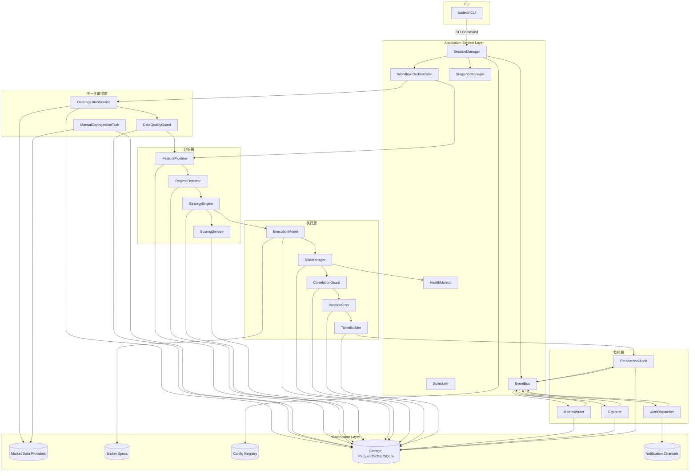
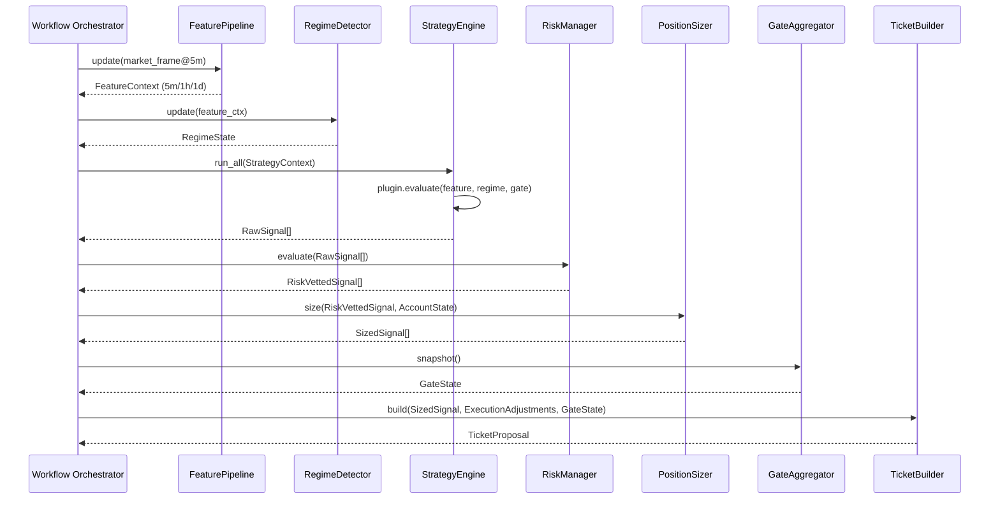
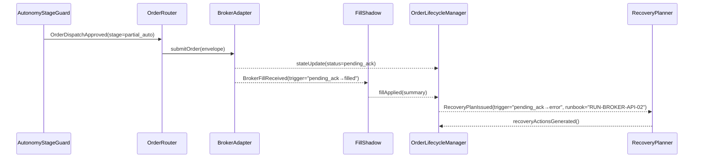

# FXヒューマン・インザループ投資ツール 詳細設計書 v1.31

## 0. 文書情報
- 作成日: 2025-02-20
- 作成者: Codex AI 支援
- 参照文書: 要件定義（テンプレ形式）v_1.md, basic_design_fx_signal_tool_v1.md
- 対象スコープ: マイルストーンM1（Backtest/Paper/Live 共通基盤）。M2以降で有効化される機能は拡張ポイントとして明示し、実装フックと制約を記載する。

### 0.1 改訂履歴
| 版 | 日付 | 改訂概要 |
| --- | --- | --- |
| v1.31 | 2025-03-15 | GateStateを`market`/`risk`/`human`サブ構造体へ分割し、Humanダブルエントリーフィールドを定義。§3.16チェックリスト、§3.5.4例外表、GateStateスキーマ参照を更新。 |
| v1.30 | 2025-03-14 | GateStateフィールドを再整理し、`calendar_block`/`spread_cooldown`命名に統一。§3.5.4例外表・Spreadクールダウン節・Reporter Feature Flag表記・Codexハンドオフチェックリストを更新し、監査用語と整合。レビュー履歴を追加。 |
| v1.29 | 2025-03-12 | すご腕SEレビュー反映。§0.6.11を新設しレビュー結果/フォローアップを整理。§3.5にStrategy Plugin契約/コンテキスト仕様を追記し、シグナル疑似コードをExecutionModel/SpreadMonitorの実APIと整合。Codex向けチェックリストと監査リンクを更新。 |
| v1.28 | 2025-03-10 | §87でSignal Streaming Gateway & Offline Sync設計（FR-12/FR-47, NFR-02/NFR-11/NFR-18, M3準備）を新設し、Shadow Session多重接続/バックプレッシャ/再送/オフラインキャッシュ設計、信頼性/レイテンシ指標、Validation Data Playbook/Runbook/Feature Flag/テスト運用を定義。 |
| v1.27 | 2025-03-09 | §86でSignal Board Tauri GUI/HITLインタラクション（FR-12/FR-47/FR-48, NFR-11/NFR-15, M3準備）を追加し、コンポーネント分割/状態遷移/エラー通知、CLI/Shadow APIとの契約、Telemetry・監査・Runbook手順、Codex Packetとテスト計画を定義。 |
| v1.26 | 2025-03-08 | §84でAPI注文ライフサイクル/エラー回復設計（FR-07/FR-39/FR-58, AC-03/AC-06/AC-32/AC-41, NFR-02/NFR-05/NFR-19）を追加し、`OrderLifecycleManager`/`OrderStateStore`/Runbook連携/CLI/Telemetry/テストパケットを定義。§85でAPIフォールトインジェクション&演習ラボ（FR-47/FR-63, AC-34/AC-43, NFR-02/NFR-28）を新設し、StageGuard/FillShadow/DocOps統合とCodex Packet/証跡運用を設計。 |
| v1.25 | 2025-03-07 | §78でBacktest回帰CI/データボリューム制御（AC-01/AC-13, NFR-06/NFR-12）を追加し、`make regression-backtest`とGitHub Actions統合、Evidence運用を設計。§79でブローカーAPI接続準備/サンドボックス統合（FR-07/FR-39/FR-58, AC-03/AC-06, NFR-02/NFR-17, M3準備）を定義し、Feature Flag/Runbook/監査フローを追補。Codex Packetとテスト計画を更新。 |
| v1.24 | 2025-03-06 | §71でHardening検証ハーネス/診断ラボ群（AC-12/AC-14/AC-15/AC-17/AC-18/AC-19/AC-20/AC-21/AC-23/AC-24/AC-25/AC-29/AC-30, NFR-02/NFR-03/NFR-09/NFR-10）を新設し、§72〜§77でPaper-Liveパリティ、流動性ストレス、Pre-Trade強化、Fault Injection、時刻整合、署名管理を追加。Codex Packet/CLI/テレメトリ/テスト計画を更新。 |
| v1.23 | 2025-03-05 | §67でリスク開示ハードエンフォースメント/デバイスバインディング設計（FR-53/FR-54, AC-44, NFR-17）を追加。§68で研究昇格ゲート/チェックリスト自動化（FR-55/FR-62, AC-46, NFR-21）を詳細化し、Codex PacketとValidation連携を定義。 |
| v1.22 | 2025-03-04 | §64でマージン・相関ストレスラボとリスクエンベロープ調整（FR-36/FR-37/FR-51, AC-32）を追記。§65でトレーダーワークフローテレメトリ/コーチング基盤（FR-44/FR-48, NFR-11/28）を設計。§66でAcceptable Degradationプレイブック自動化（FR-47, NFR-14/28, AC-34/AC-43）を追加し、Codex Packetとテスト計画を整備。 |
| v1.21 | 2025-03-03 | §60でSignal Board Shadow/SlackブリッジとGUI準備（FR-12/FR-47, M2準備）を追加。§61でStop/Freeze検証・キャピタルガード回帰ハーネス（AC-31/AC-41, FR-50/FR-51連携）を整理し、Codex向けテスト/Packetを提示。 |
| v1.20 | 2025-03-02 | §49〜§50にリアルタイムフィード評価/ライセンスガバナンス（M1.2準備, NFR-05/17, AC-45拡張）を追加し、Data Ingestion/HealthMonitor/BackOfficeとの連携、契約証跡/コスト評価/Runbook整備をCodex Packet化。 |
| v1.19 | 2025-02-28 | §46にモデルリスクレジスタ/Explainability監査（NFR-26, AC-52, FR-55/56連携）を追記し、Scoreboard/Idea Pipeline/Complianceゲートとの連携、証跡テンプレ/CLI/テレメトリ/Packetを整備。 |
| v1.18 | 2025-02-27 | §43〜§45にスケーリング/リソースガバナンス、プロファイル差分署名、Ops証跡管理（NFR-19/25/28）を追加し、Capacity診断/Config署名/証跡リセット制御のCodex Packetを整備。 |
| v1.17 | 2025-02-26 | §41〜§42にオフラインバンドル/サプライチェーン保証設計を追加し、NFR-06/12/18/24およびAC-27/28の実装指針をCodex Packet化。 |
| v1.16 | 2025-02-22 | §23〜§25にストレステスト/流動性監視/ステートメント突合の詳細設計を追加し、FR-43/FR-49/FR-64対応ロードマップをCodex Packet化。 |
| v1.15 | 2025-02-22 | §20にデータプロベナンス/Validation Data Playbook実装設計を追加し、FR-52/FR-62のM1.1準備方針を明文化。 |
| v1.14 | 2025-02-22 | §19にEmergency Orchestrator/Reduce-Only Advisor設計ロードマップを追加し、FR-42/FR-47の下準備を明文化。 |
| v1.13 | 2025-02-22 | §2.7 Telemetryを拡張しOpsワークログ/自動化指標の詳細を追記。§18にツール/自動化スクリプト集を新設し、Codex向け運用補助を体系化。 |
| v1.12 | 2025-02-21 | レポート/監査テンプレート類を整備し、§3.18/§3.20/§3.24/§7.3/§13.6/§13.7を更新。Packetテンプレ資産を拡充し、Codexフィードバック運用手順のテンプレ参照を追記。 |
| v1.11 | 2025-02-21 | §3.30 RiskDisclosureService仕様の統合整理、関連参照を最新化。 |
| v1.10 | 2025-02-21 | Codexスプリントパッケージ、RiskDisclosure詳細、Acceptable Degradation実務フロー、トレーダー受入チェックリストを追加。 |
| v1.9 | 2025-02-21 | Codex向けエピック別実装指示セット、レビュー観点テンプレ、トレーダー受入チェックの粒度を拡充。 |
| v1.8 | 2025-02-20 | Codex実装前提の開発オペレーション/プロンプト設計/テストシナリオを体系化。ヒューマン・トレーダー視点の期待KPI/UXと整合させた。 |
| v1.7 | 2025-02-20 | KPI検証/性能モニタリング強化、戦略ガバナンス、データ品質上限対策、運用冗長化を追補し、勝率達成への実効性を高めた。 |
| v1.6 | 2025-02-20 | 運用責任分掌、BCP/DR指針、QAゲート、リスクログ、サポートツール等を追補し、プロジェクト/運用一体の整合を強化。 |
| v1.5 | 2025-02-20 | 運用体制・環境要件・プレフライト/リリース手順・ネットワーク回復設計・ログ分類を追補し、工程連携を強化。 |
| v1.4 | 2025-02-20 | 前提・制約、依存ライブラリ/バージョン管理、重大障害復旧シナリオ、検証環境・エラー通知マッピングを追補。 |
| v1.3 | 2025-02-20 | 状態遷移図・CLI仕様表・設定ガバナンス表・ログ/バックアップ方針・Feature Flag一覧を追補し、運用/拡張観点を強化。 |
| v1.2 | 2025-02-20 | すご腕SEレビュー反映。各レイヤの責務整理、公開API/状態遷移/エラーハンドリングの粒度向上、イベント・スナップショットスキーマ明文化、非機能/テスト/トレーサビリティの整備。 |
| v1.1 | 2025-02-20 | 要件v1.1・基本設計v1.1差分取り込み。Spread Monitor/Execution Model/Funding/Correlation Guard/Config Governance/Health Monitorの詳細を追加。 |
| v1.0 | 2025-02-15 | 初版（M1骨子）。 |

### 0.2 用語
| 用語 | 説明 |
| --- | --- |
| Signal | 戦略プラグインが出力する売買候補。`RawSignal → RankedSignal → RiskVettedSignal → SizedSignal` の順でフィルタされる。 |
| Ticket | ヒューマンに提示する注文チケット。サイズ/SL/TP/TTL/チェックリスト/バッジを含むJSON Linesレコード（FR-07, FR-38）。 |
| GateState | カレンダー、スプレッド、Kill Switch等のブロック条件を統合した状態構造体。 |
| SpreadCooldownState | Spread Monitorが算出する状態。`normal | watch | cooldown | halt`（M1は`normal`/`cooldown`を使用）。 |
| HealthState | リスク/データ/コンフィグ健全性を統合した状態。`ok | degraded | soft_stop | hard_stop`。 |
| BoardMode | Signal Boardの提案挙動。`normal | guarded | halted`。`guarded`はAcceptable Degradation時に主要4ペアのみ承認可、`halted`はKill Switch作動中。 |
| ModeContext | Backtest/Paper/Liveごとの副作用差分を吸収する実行コンテキスト。 |
| PipelineStep | ワークフロー各段階が実装する共通インターフェース。`execute(context) -> context`。 |
| Snapshot | 再起動用ステート（AccountState/OpenTickets/ConfigHash/HealthState/LastBar）。`snapshots/latest/`に保存。 |
| EventBus | DomainEventのpublish/subscribeを担う非同期バス。JSONL永続化を伴う。 |

### 0.3 表記・参照ルール
- FR/AC/NFR番号は要件定義書に準拠する。
- ファイル/クラス名は`src/`からのパスで記載する。
- M2以降の機能は明示的に`(M2+)`ラベルを付与し、M1では無効化フラグまたはダミー実装とする。

### 0.4 対象読者・レビュー体制
| 役割 | 主な責務 | レビュー観点 | サイクル |
| --- | --- | --- | --- |
| プロダクトオーナー | 仕様承認、KPI評価 | KPI整合、運用負荷、HITL UX | 月次（レポート共有後） |
| 開発（Codex + 開発者） | 実装/テスト/CI運用 | 実装可否、技術的負債、テスト網羅 | スプリント毎 |
| 運用担当 | 日次運用、Runbook更新 | アラート対応、プレフライト、ログ監査 | 週次（運用レビュー） |
| セキュリティ/監査（将来） | 監査ログ/アクセス制御 | ログ保持、権限分離、変更管理 | 半期 |

- レビュー結果は`docs/review_log.md`に記録し、重大指摘は`logs/ops/review.log`にも記載する。
- 要件差分は`basic_design_fx_signal_tool_v1.md`を起点にトレースし、受入前にPO＋運用担当のダブルチェックを実施。

### 0.5 文書メンテナンスと変更管理
- 変更要求は`docs/change_requests/`にMarkdownで起票し、PO→開発→運用の順に承認。
- 承認後に`vNext`ブランチへ反映し、リリースタグ作成時に本ドキュメントへ統合。
- 緊急改訂は`logs/ops/hotfix.log`で記録し、24時間以内に正式な更新として追補する。

### 0.6 Codex開発ハンドオフガイド

本プロジェクトでは、実装をAI開発パートナー（Codex）に委任することを前提に、プロンプト設計・成果物レビュー・テスト実行までの一連フローを定義する。HITLトレーダーとしての意思決定品質を担保するため、以下の運用を遵守する。

#### 0.6.1 実装リクエストの標準フォーマット
- **スレッド構成**: Issue/PRには「背景（KPIまたは運用課題）」「期待シナリオ」「受入条件」「関連テレメトリ/ログ」「参考スナップショット」を記載し、Codexへ渡す要約は300〜500字で完結させる。
- **ファイル指定**: 変更対象ファイルは本詳細設計のパス記法に従い列挙し、既存セクション番号を引用（例: `3.1.2 DataIngestionService.fetch_latest`）。
- **I/O契約**: 追加関数・クラスのシグネチャ、例外、戻り値を表形式で記載。可能な限り`typing`注釈と`pydantic`モデル定義を明示する。
- **テスト要件**: `pytest -k <keyword>`単位で実行指示を与え、成功/失敗判定基準と許容する浮動小数誤差を指定する。
- **運用制約**: Spread・ニュース・Kill Switchといったトレーダー観点の制約は必ず背景に紐づけ、レビュー観点（例: 「Acceptable Degradation時でもSpread Guardの閾値を緩めない」）を明記する。
- **スタイル/リンタ基準**: 実装者は`docs/development_style_and_linting.md`を参照し、言語/フレームワーク別のスタイル規約と`ruff`/`black`/`mypy`運用方針に従う。逸脱を認める場合はチケット内で承認プロセス（§0.5）を明記する。

#### 0.6.2 Codex向けプロンプトテンプレート
```
<概要>
  ・機能目的（FR/NFR/AC番号）
  ・想定するヒューマン判断ポイント

<既存設計参照>
  ・本書の該当セクション番号
  ・関連クラス/関数とファイルパス

<変更要求>
  ・追加/更新メソッド（署名 + docstring要件）
  ・入出力例（JSON/CLI例示）
  ・例外/フォールバック動作

<テスト>
  ・必須テストコマンド
  ・Fixturesまたはモック方針

<レビューメモ>
  ・リスク観点（スリッページ/レートリミット/ヒューマン手順）
  ・ログ/監査要件
```
- CLIコマンドを変更・追加する場合は、対応する`src/interfaces/cli/*.py`スタブと関連テスト（Approvalスナップショット/スキーマ検証を含む）を更新する旨を明記し、Codexが差分を漏れなく実装できるようにする。
- Codexへ送る冒頭メッセージで「スタイル/リンタは`docs/development_style_and_linting.md`に準拠」と明示し、差分レビュー時にも該当節を引用する。
- プロンプトはGit管理（`docs/prompt_packages/<YYYYMMDD>_<feature>.md`）し、再利用時は差分管理する。
- Codexへ渡すコード断片は**200行以内**に限定し、関連する`dataclass`/`Enum`の定義を先頭に含める。外部依存がある場合はスタブ/型定義を同梱する。
- 反復が必要な場合は「差分モード」を明示し、前回出力との差分レビュー観点を列挙する。

##### プロンプト例（EP-02 Strategy Determinism）
```
<概要>
  ・FR-04/AC-09: シグナル決定論の担保、Backtest/Live一致率 > 99.5%
  ・ヒューマン判断: Guardedモード移行時にヒット率低下を許容するか（Runbook RUN-SIGNAL-02）

<既存設計参照>
  ・§2.3 Workflow Orchestrator, §3.2.4 StrategyRegistry, §15.2 EP-02 Strategy Determinism
  ・`src/strategies/registry.py::StrategyRegistry`, `src/features/pipeline.py::FeaturePipeline`

<変更要求>
  ・`StrategyRegistry.register()`でStrategyManifestの`determinism_key`を検証し、欠落時は`StrategyConfigurationError`
  ・`FeaturePipeline.replay()`に`*, tolerance: float = 1e-6`引数を追加し、許容誤差をパラメータ化
  ・CLI `tradectl benchmark replay` に `--tolerance` オプションを追加（Docstring + ヘルプ更新）

<テスト>
  ・`poetry run pytest tests/unit/test_strategy_registry.py -k determinism`
  ・`poetry run pytest tests/integration/test_feature_replay.py`
  ・CLIスナップショット: `poetry run pytest tests/approval -k benchmark`

<レビューメモ>
  ・Spread Guard閾値を変更しないこと（§5.4）
  ・データ品質低下時は`health_state=degraded`を返し、ログキー`strategy_replay_mismatch`

<スタイル/リンタ>
  ・Python/CLIスタイル: `docs/development_style_and_linting.md`
  ・型未解決時は`mypy.ini`へ一時例外を追加し、Issueに削減予定日を記載
```

- **GateAggregator向けテスト観点（Codex指示補足）**:
  - Spread欠損検証: `SpreadMonitor.current_state`が特定シンボルを返さないケースをモックし、`GateAggregatorError(code='spread_state_missing')`でRejectされること。
  - ACKリプレイ: `ticket.checklist.ack`イベントシーケンスを`on_event`へ適用し、`acknowledged_roles`が再構成されることと、重複ACKがWARNログのみで無害化されること。
  - Snapshot再生成: `refresh_from_sources`→`persist_latest`の流れで`schema_version`が保持され、`GateState.validate(...)`に通ること。破損JSONを読み込んだ場合は`schema_mismatch`でFail Fastすること。

##### プロンプト運用の注意点
- Codexへの再依頼時は「差分のみ」要求とともに、前回実装差分に対する評価（良かった点/懸念）を箇条書きで共有する。
- 設計差異を議論する際は、該当セクション番号（例: §3.4.2）と新旧挙動を併記し、判断の根拠となるメトリクスやRunbook手順を明文化する。
- 将来API変更が見込まれる場合は、プロンプト内で拡張ポイント（例: 新しいデータフィード設定キー）とパラメータ化戦略案を先に提示し、スコープ外の作業を抑止する。

#### 0.6.3 実装優先度マトリクス（M1）
| トラック | 主担当モジュール | Codex作業エピック | 期待成果物 | 受入基準 |
| --- | --- | --- | --- | --- |
| データSLA | `src/data/service.py`, `src/data/quality.py` | `EP-01 DataLag Mitigation` | Fetch/Processing遅延計測・フォールバック導線強化 | `metrics/data_ingestion_sla.jsonl`のp95が閾値内、`tests/integration/test_data_pipeline.py`合格 |
| シグナル | `src/features/pipeline.py`, `src/strategies/registry.py` | `EP-02 Strategy Determinism` | 特徴量リプレイ一致、戦略プラグインの決定論テスト | Backtest/Liveで同一入力→同一出力、`pytest -k strategy_determinism`合格 |
| リスク/ヘルス | `src/core/health.py`, `src/risk/manager.py` | `EP-03 Guardrails` | Kill Switch/Board Mode遷移ロジック、リスクアラート配線 | 状態遷移テスト（`tests/unit/test_health_state.py`）合格、CLI `tradectl status`に理由表示 |
| チケットUX | `src/ticket/builder.py`, `src/interfaces/cli/board.py` | `EP-04 Ticket Clarity` | チケットJSON整形、チェックリスト/バッジ表示、監査ログ項目 | `pytest -k ticket_builder`合格、サンプルCLIスナップショット承認 |
| レポート/監査 | `src/reporter/generator.py`, `src/persistence/audit.py` | `EP-05 Weekly Review` | KPI算出テンプレ、監査トレーサビリティ | `tradectl report weekly --dry-run`でMarkdown生成、監査ログ整合 |

優先度はデータSLA > リスク/ヘルス > シグナル > チケットUX > レポート。Codexへは同時並行を避け、1エピックずつ完了させる。

#### 0.6.4 Codex出力レビューの観点
- **差分検証**: `git diff --stat`で対象ファイルが設計指定内に収まっているか確認する。想定外ファイル更新は即座に差戻し。`poetry lock`変更は明示的な承認を得る。
- **静的チェック**: `ruff`, `mypy`（M1 optional）を`pre-commit`で実行。Codex出力に余計な`print`/`TODO`が含まれていないかを確認する。
- **取引リスク**: Spread/Kill Switch関連の閾値が設計値から逸脱していないか、例外時にヒューマンへ十分な情報が届くかをレビューする。
- **API契約**: `ExecutionModel.apply`の戻り値が`ExecutionAdjustments`単体であることを確認し、Spread状態や`SizedSignal`を返すような差分が紛れ込んでいないかチェックする（§3.6, PositionSizerが後段で消費）。Diffレビューでは`return`文がタプル/辞書追加になっていないか、呼び出し側が複数値アンパックしていないかも確認する。
- **ログ/監査**: `logger`メッセージはRunbook検索性の高いキーワード（例: `data_latency_fetch`, `kill_switch_manual_ack`）を含める。監査ログは`AuditRecord` schema準拠であること。
- **テスト**: Codex出力に対して指定テストが実行されたことをCIログまたはローカル証跡で確認。未実行の場合は必ず差戻し。

#### 0.6.5 ヒューマン・トレーダー観点のKPIリンク
- ヒット率、平均RR、週次ドローダウンなどのKPIは`reports/kpi/dashboard.md`に集約し、Codexが手を入れる際には関連KPIの期待変化を記述する。
- Acceptable Degradation状態での運用負荷を軽減するため、開発チケットには「オペレータが何分短縮されるか」「どのRunbookステップが省略/自動化されるか」を必ず盛り込み、実装後に`logs/ops/workload.log`で効果を定量化する。
- トレーダー視点でのUX課題（例: チケット承認時にSpread理由が不明瞭）は`docs/ux_feedback.md`で管理し、Codex改善タスクには該当行を参照させる。

#### 0.6.6 Codexフィードバックループ
1. Codex出力をレビュー後、`docs/prompt_packages/<date>_<feature>.md`に「良かった点」「改善要望」「想定外差分」を追記し、次回プロンプトの改善に反映する。
2. リリース後7日間は該当機能のメトリクスを重点監視し、異常時は`feedback_loop.md`に記録。Codexへの再依頼時はこのログを添付する。
3. KPIが改善した場合は`reports/weekly/<YYYYWW>.md`に成果を記載し、反対に悪化した場合はリスクレビュー（`docs/risk_review/<YYYYMMDD>.md`）で原因と暫定対応をまとめる。
- **初期テンプレート位置と保守責任**: プロンプト記録は`docs/prompt_packages/TEMPLATE.md`（保守: Codex Liaison）、実装Packetは`docs/implementation_packets/TEMPLATE.md`（保守: Ops Manager＋Codex Liaison）、トレーダー受入記録は`docs/trader_signoff/TEMPLATE.md`（保守: Trader Lead）がそれぞれ起点となる。テンプレ改訂は§0.5の変更管理フローに従う。

#### 0.6.7 Codexスプリント計画とレビューゲート
- **スプリント粒度**: 1スプリント=5営業日。エピック単位（§0.6.3）を`Implementation Packet`に分解し、1 PacketでCodex作業→ヒューマンレビュー→Ops影響確認まで完了させる。
- **Packet構造**: `docs/implementation_packets/<YYYYMMDD>_<epic>_<packet>.md`を作成し、(1) 目的/KPIリンク、(2) 対象ファイル/セクション引用、(3) テスト指示、(4) トレーダー受入チェックリスト、(5) Rollback手順を記載。Codexへはこのファイルと要約を同梱する。
- **Funding Packet特記事項**: Fundingロジックを変更するPacketでは§3.12.1と§5.15.1の運用手順を引用し、`tradectl funding sync/status`の証跡（CLIログ、`funding_state.json`, `reports/validation_log/AC-09_funding_<date>.md`）を`/evidence`配下に添付する。Runbook `RUN-FUND-01/02`の更新要否とOps/Risk/POのサイン有無もチェックリストに追加すること。
- **レビューゲート**:
  1. *設計整合チェック*: プロダクトオーナー/トレーダーがPacket内容と本書該当節を照合。逸脱時は`docs/change_requests/`で再承認。
  2. *Codex出力レビュー*: Diff/テスト/ログ確認に加え、`ops_worklog`への影響推定をコメントする。未確認の場合は`ops_review_pending`ラベルを付与。
  3. *トレーダー承認*: CLIスクリーンショット・テレメトリサマリを確認し、`docs/trader_signoff/<packet>.md`へ署名。署名前にRunbook該当手順を実施する。
- **WIP制限**: Codex作業中Packetは最大2件まで。Spread/Catch-up/Health関連（高リスクPacket）は単独で進行し、他Packetを一時停止する。
- **メトリクス**: Packet完了までのリードタイムを`metrics/implementation_packets.jsonl`に記録し、週次レビューでボトルネック（レビュー待ち時間>2日など）を分析する。

#### 0.6.8 Codexキックオフレビュー是正事項

すご腕SE・トレーダー観点での初回レビューにより、現状のリポジトリと本詳細設計とのギャップを以下の通り整理した。Codexへ実装を依頼する前に、必ず是正またはチケット化する。

| # | 指摘内容 | 影響 | 是正状況（解決日 / Packet / ファイルパス） |
| --- | --- | --- | --- |
| 1 | `pyproject.toml`/`poetry.lock`が未配置で、§1.7・§3.22の依存管理方針と乖離。 | 依存解決が属人的になり、Codexが環境を再現できない。 | ✅ 2025-03-14 / `PKG-BOOT-01`: リポジトリ直下に`pyproject.toml`・`poetry.lock`を配置し、`ci/templates/python_smoke.yml`から`poetry install --no-root`を実行する前提を整備。 |
| 2 | `src/`配下は`brokers/adapter.py`のみで、§1.3のディレクトリ構成に必要なパッケージ雛形が存在しない。 | Codexがクラス配置やインポート方針を誤解し、後続のPR差分が巨大化。 | ✅ 2025-03-14 / `SRC-SCAFF-01`: `src/__init__.py`と`src/app/__init__.py`、`src/core/__init__.py`、`src/infra/__init__.py`などを追加し、詳細設計準拠のパッケージスキャフォールドを構築。 |
| 3 | `tests/`は空で、§0.6.3の受入テスト名が未定義。 | Codexがテストを新設する際の命名/配置が分からず、CI整備に遅延。 | ✅ 2025-03-14 / `TEST-SMOKE-01`: `tests/conftest.py`、`tests/smoke/test_feature_context_contract.py`、`tests/schema/test_json_schema_validation.py`を整備し、`pytest.ini`で`smoke`/`config_schema_smoke`マーカーを宣言。 |
| 4 | §79.1が`FieldMapping`/`RATE_LIMIT_SLA`を要求しているが、`src/brokers/adapter.py`は`EndpointSpec`のみ。 | ブローカー統合時にフィールド整合性テストが欠落し、HITL/Live移行のリスクが増大。 | ⏳ 2025-03-14時点 / Task4 `BROKER-CONTRACT-TEST`: `src/brokers/adapter.py`向けに`tests/unit/test_broker_adapter_contracts.py`を新設し、(a) `FieldMapping`必須キー集合、(b) `RATE_LIMIT_SLA`閾値、(c) dataclass型定義を検証する。必要に応じて`tests/fixtures/broker_adapter.json`でモックマッピングを固定化し、`poetry run pytest tests/unit/test_broker_adapter_contracts.py`（テスト完了）の証跡を残す。 |
| 5 | `docs/review_log.md`に本レビュー結果の記録が未反映。 | 変更履歴と意思決定トレースが断絶し、AC-45/AC-51監査要件に抵触。 | ✅ 2025-03-12 / Packet該当なし（Opsレビュー議事）: `docs/review_log.md`に2025-03-10/11/12レビューのサマリを追記済み。`logs/ops/review.log`は未整備のため、週次Opsレビューでフォローアップ継続。 |
| 6 | `config/`配下の雛形（`risk_policy.yaml`/`strategy_manifest.yaml`/`board_modes.yaml`/`sla_thresholds/*.yaml`等）が存在せず、§4.4やRunbook参照と乖離。 | Codexが設定スキーマを前提に実装できず、テスト/CLIが即時失敗する。 | ✅ 2025-03-13 / `CONFIG-SCAFF-01`: `config/README.md`、`config/risk_policy.yaml`、`config/board_modes.yaml`、`config/strategy_manifest.yaml`、`config/feature_pipeline.yaml`、`config/profiles/{backtest,paper,live}.yaml`、`config/sla_thresholds/{README,default,active}.yaml`を整備し、`pytest -k config_schema_smoke`で検証可能な雛形を配置。 |

上記是正策の進捗は週次Opsレビューで確認し、未完了項目は`OpsAgendaService`（§52.3）にTODOとして登録する。是正完了後、Codexへ渡すPacketには本表の該当番号を「前提条件」として明記すること。

#### 0.6.9 Codex着手前チェックリスト

各項目は`CHK-0.6.9-<番号>`として管理し、Opsアジェンダ（`docs/runbooks/daily_agenda/`）および検証テンプレート（`docs/validation/ModeContext_startup.md`）から相互参照する。Codex Issue/PRチェックリストには同じIDで追記し、証跡ファイルパスまたはCIジョブIDを記録すること。

1. `poetry install --no-root`が成功し、`python -m tradectl --help`（仮スタブ可）が0終了すること（CHK-0.6.9-1）。
2. `pytest -k smoke`が通る最小テストスイートを確立し、CIテンプレ（`ci/templates/python_smoke.yml`）に組み込むこと（CHK-0.6.9-2）。
3. `docs/review_log.md`に本レビュー反映、`docs/prompt_packages/`へPacket下書きを格納済みであること（CHK-0.6.9-3）。週次レビューで参照するOps Agendaは`docs/runbooks/daily_agenda/TEMPLATE.md`を基に作成し、関連エントリからリンクする。
4. Spread/Kill Switch等のリスク閾値ファイル（`config/risk_policy.yaml`など）が`schema/`定義と突合できる形で雛形化され、`GateState`スキーマ（`market.news.blocked`/`market.calendar.blocked`/`market.spread.state`/`risk.reduce_only`/`human.double_entry_required`）と整合していること（CHK-0.6.9-4）。
5. Codexへ渡すIssue/PRテンプレに§0.6.8の番号を引用し、未解決項目がある場合は「受入不可（前提未了）」ラベルを適用してから再依頼すること（CHK-0.6.9-5）。
6. `ModeContext`のフィールド（§3.1 表）を初期化する`ModeContextFactory`/`ModeController`のスタブが揃い、`config/profiles/<mode>.yaml`→`ModeContext.profile`→`SessionManager.start()`の流れで`clock`/`data_feeds`/`execution_profile`/`account_gateway`が埋まることを単体テストまたはドキュメントで確認していること（CHK-0.6.9-6）。証跡は `docs/validation/ModeContext_startup.md` §2 に記録する。
7. `tradectl start --profile backtest`, `tradectl start --profile paper`, `tradectl start --profile live`（各モードはモック実装可）を手動/CIで実行し、`ModeContext`初期化ログ（`ctx.mode`, `ctx.profile.name`, `deterministic_seed`) が`logs/sessions/<session_id>.log`に出力されること。終了時は`tradectl stop`→`SnapshotManager.persist()`までを含むテスト手順を`docs/validation/ModeContext_startup.md` §1に記録し、Ops Agendaの「ModeContext Startup Walkthrough」セクションから参照すること（CHK-0.6.9-7）。

#### 0.6.10 すご腕SEレビュー（2025-03-10）フォローアップ

- **新規指摘**: 設計では`config/`配下に多数の設定YAMLとスキーマ検証が前提となっているが、現リポジトリにはディレクトリ自体が存在しない。CodexがM1 Packetを実装する際にテストを開始できないため、`CONFIG-SCAFF-01`で最低限の雛形とREADME/Schema紐付けを準備する。
- **設計補強**: `SpreadCooldownState`の値域（`normal|watch|cooldown|halt`）をコード化してGateState記述と齟齬が無いよう明文化（§4.2）。
- **ドキュメント整合**: §4.4の設定ファイル記述を更新し、JSON Schemaの配置（`docs/schemas/`）とCodexテスト（`pytest -k config_schema_smoke`）の導線を追記。これにより、設計→実装→テストの経路が一本化される。

#### 0.6.11 すご腕SEレビュー（2025-03-12）所見サマリ

- **レビュー範囲**: §0.6 Codexハンドオフ指針、§3.5 StrategyEngine/Signalパイプライン、§3.6 ExecutionModel連携、§7.6 週次レポート受入条件。
- **主な是正**:
  - Strategy Plugin契約と`StrategyContext`構造が暗黙的だったため、§3.5.5でProtocol/必須フィールド/決定論シード伝播の具体例を明文化。
  - シグナル疑似コード（§3.5.2）がExecutionModel/SpreadMonitor APIと不整合（`ExecutionModel.apply(sig)`呼び出し）だったため、現行IFに合わせて`market_snapshot`/`spread_state`を渡す形へ修正し、Backtest/Paper/Liveの決定論前提が満たされるよう補足。
  - Codexレビュー観点での監査導線が不足していたため、Runbook/レビュー記録のクロスリンクとCLIスナップショット要求を§0.6.11および§7.6に追記。
- **フォローアップ/監査トレーサビリティ**:

| # | 指摘内容 | 対応状況 | フォローアップ/トラッキング | 所管 | 期限 |
| --- | --- | --- | --- | --- | --- |
| 7 | `StrategyPlugin`のProtocol/ベースクラスがリポジトリに存在せず、Codex実装時に署名が揺らぐリスク。 | 2025-03-16: `src/strategies/base.py`へ`StrategyPluginProtocol`/`StrategyMetadata`スタブを実装し、`StrategyRegistry.register()`の`determinism_key`検証と単体テストを整備済。 | Closed `docs/implementation_packets/20250312_strat_plugin_contract.md`（v1.0, 2025-03-16） | 開発/Codex Liaison | 完了 |
| 8 | シグナル検証ログ/CLI証跡のRunbook同期がバラバラ。週次レビューでKPIと突合する導線が弱い。 | 2025-03-16: `docs/templates/validation_log.md`/`reports/validation_log/templates/playbook_entry.md`へ`signal_cycle_snapshot`欄とRunbook IDリンクを追加し、`RUN-DATA-05/06`に反映。 | Closed `DOC-RUNBOOK-ALIGN-02`（Ops Agenda 2025-03-16議事） | Ops Manager | 完了 |
| 9 | Codex PRレビュー時の必須添付物がIssueテンプレに反映されていない。 | 2025-03-16: `docs/templates/codex_issue.md`へ必須添付物チェックリストを追加し、`CHK-0.6.9-*`入力欄・保存先ガイドを追記。 | Jira `OPS-58` → Closed（2025-03-16, Ops Managerサイン） | Ops Manager | 完了 |

- **アクションアイテム**: 各フォローアップは週次Opsレビューで進捗確認し、完了時に`docs/review_log.md`へ「Closed #7」の追記を行う。未完了の場合は`docs/change_requests/`に正式化してからCodex依頼を保留する。

#### 0.6.12 Configスキャフォールト & Schema整合チェック
- **目的**: Codexが即座にテストを実行できるよう、必須設定ファイルの雛形と検証コマンドを標準化する。
- **必須雛形**（`CONFIG-SCAFF-01`パケットで配布）
  - `config/scoring.yaml`（`weights`, `max_pf_drift`, `volatility_cap`, `diagnostics`セクション）
  - `config/risk_live_guard.yaml`（§4.4.3準拠の閾値/ウィンドウ設定）
  - `config/scoreboard.yaml`（付録G.1用の`alpha_threshold`, `decay_threshold`, `watchlist_rules`）
  - `config/ops_readiness.yaml`（証跡パス/重み/Runbook参照）
  - 既存の`config/risk_policy.yaml`, `config/strategy_manifest.yaml`, `config/feature_pipeline.yaml`とともに`config/README.md`へ一覧化し、各ファイルのスキーマIDとRunbookリンクを記載する。
- **スキーマ検証コマンド**

```bash
poetry run schema-validate config --schema docs/schemas/config_bundle.schema.json
poetry run schema-validate config/scoring.yaml --schema docs/schemas/scoring_config.schema.json
poetry run schema-validate config/risk_live_guard.yaml --schema docs/schemas/risk_live_guard.schema.json
poetry run schema-validate config/scoreboard.yaml --schema docs/schemas/scoreboard.schema.json
poetry run schema-validate config/ops_readiness.yaml --schema docs/schemas/ops_readiness.schema.json
```

- **初期化ツール**: `make config-init`（`tools/scripts/config_init.py`）で雛形をコピーし、各ファイルに`TODO:`コメントで調整ポイント（例: `alpha_threshold`, `latency_alert_threshold_sec`）を明示する。Runbook `CONFIG-SCAFF-01`へステップバイステップ手順を追加する。
- **レビュー要件**: 設定変更を含むPRは`pytest -k config_schema_smoke`と上記`schema-validate`ログ添付を必須とし、§0.6.11のPRチェックリストへ「Configスキーマ検証ログ」項目を追記する。

#### 0.6.13 Feature Flagマトリクス & Runbook連携
- `config/feature_flags.yaml`を単一の情報源とし、Backtest/Paper/Liveの既定値とマイルストーンを明示した。設定差分はRunbook `RUN-FEATURE-FLAG-01`で承認・証跡化する。
- CodexはテーブルのRunbook参照IDをPR本文に記載し、`pytest -k config_schema_smoke`と`pytest -k feature_flags`のログを添付すること。

| Flag名 | Default (Backtest/Paper/Live) | 所有者 | 有効条件 | Rollback | Runbook参照ID |
| --- | --- | --- | --- | --- | --- |
| `sprt_guard` | `false / false / false` | Risk Manager | M2到達後、Paper soak ≥10取引日で`metrics/sprt_health.jsonl`の`false_positive=0`を継続 | `tradectl config flags --set sprt_guard=false --profile live`→`pytest -k feature_flags`→`NextBarChangeQueue`確認 | `RUN-FEATURE-FLAG-01 §5.1` |
| `reduce_only_advisor` | `false / false / false` | Ops Manager | M1.1 Spread訓練完了、Paper soak ≥5取引日で提案ログを確認 | `tradectl config flags --set reduce_only_advisor=false --profile <mode>`→Board表示確認 | `RUN-FEATURE-FLAG-01 §5.2` |
| `risk_disclosure_enforce` | `false / false / false` | Compliance/Risk | M1.1 リスク開示手順が`RUN-RISK-01`/`GOV-AUD-01`に従って更新済み、Paperで`ConsentRequiredError`挙動を確認 | `tradectl config flags --set risk_disclosure_enforce=false --profile <mode>`→`risk_consent`監査追記テスト | `RUN-FEATURE-FLAG-01 §5.3` |
| `reporter.enable_extended_blocks` | `false / false / false` | Ops Manager | M1.1 Reporterテンプレのレイアウト検証完了 (`reports/weekly/templates/m1_core.md`) | `defaults.<mode>.reporter.enable_extended_blocks=false`へ戻しテンプレ差分を破棄 | `RUN-FEATURE-FLAG-01 §5.4` |
| `reports.performance.enable` | `false / false / false` | Ops Manager / PO | M1.2 PerformanceSnapshotのCI連続3回成功、ストレージ容量評価完了 | `defaults.<mode>.reports.performance.enable=false`→レポートジョブ停止 | `RUN-FEATURE-FLAG-01 §5.5` |
| `data.paid_feed` | `false / false / false` | PO / Compliance | M1.2 有償フィード契約締結、`RUN-DATA-05/06`再実施、ライセンスチェックリスト完了 | `defaults.live.data.paid_feed=false`→代替フィードへフェイルバック→`metrics/data_ingestion_sla.jsonl`回復確認 | `RUN-FEATURE-FLAG-01 §5.6` |

- `config/feature_flags.yaml`抜粋（Runbookと同期して更新すること）:

```yaml
# config/feature_flags.yaml（一部）
schema_version: "feature_flags.v1"
defaults:
  backtest:
    sprt_guard: false
    reduce_only_advisor: false
    risk_disclosure_enforce: false
    reporter.enable_extended_blocks: false
    reports.performance.enable: false
    data.paid_feed: false
  paper:
    sprt_guard: false
    reduce_only_advisor: false
    risk_disclosure_enforce: false
    reporter.enable_extended_blocks: false
    reports.performance.enable: false
    data.paid_feed: false
  live:
    sprt_guard: false
    reduce_only_advisor: false
    risk_disclosure_enforce: false
    reporter.enable_extended_blocks: false
    reports.performance.enable: false
    data.paid_feed: false
definitions:
  sprt_guard:
    milestone: "M2"
    owner: risk_manager
    category: dangerous
    runbook_ref: "RUN-FEATURE-FLAG-01 §5.1"
    enable_conditions:
      - "Paper soak ≥10取引日、`metrics/sprt_health.jsonl.false_positive=0`継続"
    rollback:
      - "tradectl config flags --set sprt_guard=false --profile live"
      - "poetry run pytest -k feature_flags"
  reduce_only_advisor:
    milestone: "M1.1"
    owner: ops_manager
    category: guarded
    runbook_ref: "RUN-FEATURE-FLAG-01 §5.2"
    enable_conditions:
      - "`RUN-SPREAD-03`完了＋Paper soak ≥5取引日で提案ログ一致"
    rollback:
      - "tradectl config flags --set reduce_only_advisor=false --profile <mode>"
```

- マイルストーン別の有効化タイムライン:
  1. **M1.0**: 全Flag `false`（Backtest/Paper/Live共通）。`pytest -k feature_flags`で整合性のみ検証。
  2. **M1.1**: `reduce_only_advisor`, `risk_disclosure_enforce`, `reporter.enable_extended_blocks`をPaperで有効化→Runbook記録→Live反映。
  3. **M1.2**: `reports.performance.enable`, `data.paid_feed`をPaper→Liveへ段階展開。ストレージ/ライセンス証跡必須。
  4. **M2**: `sprt_guard`をPaper soak後にLive反映。`GateState`/`NextBarChangeQueue`との連携テレメトリを監視。

#### 4.4.4 `config/scoring.yaml`
- **用途**: ScoringService（§3.7）、Strategy Scoreboard（付録G.1）、`tradectl scoring diagnostics`（§6.5）で共通利用する係数と閾値を管理。
- **構成例**:
  ```yaml
  version: 1
  weights:
    expected_r: 0.55
    pf_all: 0.35
    drawdown_penalty: 0.07
    spread_penalty: 0.03
  drift_penalty:
    max_pf_drift: 0.10
    kappa: 0.35
  volatility_cap:
    max_expected_r: 2.5
    regime_weights:
      trend: 1.0
      range: 0.85
      spike: 0.65
  diagnostics:
    report_path: reports/diagnostics
    alert_delta_pf: 0.15
    alert_latency_p75: 150
  ```
- **検証**: `poetry run schema-validate config/scoring.yaml --schema docs/schemas/scoring_config.schema.json`。係数合計やPF drift上限をチェックし、変更時はRunbook `RUN-SCORE-01`で承認を得る。

#### 4.4.5 `config/scoreboard.yaml`
- **用途**: Strategy Scoreboard Service（付録G.1）とReporter週次サマリにおける`alpha_score`/`decay_score`閾値・重みの定義。
- **構成例**:
  ```yaml
  version: 1
  thresholds:
    alpha: 75
    decay: 35
    watchlist_cooldown_weeks: 4
  weights:
    profit_factor: 0.35
    sharpe: 0.30
    stability_index: 0.20
    regime_fit: 0.15
  runbook_refs:
    watchlist: RUN-GOV-BOARD-01
    escalation: RUN-RISK-07
  ```
- **検証**: `poetry run schema-validate config/scoreboard.yaml --schema docs/schemas/scoreboard.schema.json`。閾値が`0〜100`、重み合計が1.0以内であることをCIで確認する。

#### 4.4.6 `config/ops_readiness.yaml`
- **用途**: Ops Readiness評価（§3.27, §5.12, 付録G.3）の重み・証跡パス・Runbookリンクを保持。
- **構成例**:
  ```yaml
  version: 1
  weights:
    backup_integrity: 0.30
    runbook_updates: 0.20
    drills_completed: 0.30
    incident_followup: 0.20
  evidence_paths:
    backups: reports/drill/backup_integrity.md
    runbooks: docs/runbooks/
    incidents: docs/incident_reports/
    agenda: docs/runbooks/daily_agenda/
  thresholds:
    min_score: 80
    warn_score: 85
  runbook_refs:
    review: OPS-READINESS-01
    escalation: RUN-RISK-07
  ```
- **検証**: `poetry run schema-validate config/ops_readiness.yaml --schema docs/schemas/ops_readiness.schema.json`。`make check-ops-readiness`（新設予定）がEvidenceファイルの存在と更新時刻を検証し、Opsレビューでは`ops_worklog`へ結果を記録する。

#### 4.4.7 `config/README.md`
- **目的**: 雛形一覧・スキーマID・Runbook参照・調整責任者をまとめ、初期セットアップ手順（`make config-init && poetry run schema-validate config --schema docs/schemas/config_bundle.schema.json`）を明記する。PRチェックリストに添付すべき証跡（スキーマ検証ログ、設定diff、Runbook更新）を案内する。
- **管理表**:
  | ファイル | 主な設定項目 | JSON Schema | Runbook | 管理責任者 |
  | --- | --- | --- | --- | --- |
  | `config/scoring.yaml` | スコア係数、PFドリフト閾値、ボラ上限、診断設定 | `docs/schemas/scoring_config.schema.json` | `RUN-SCORE-01` | Quant Lead |
  | `config/scoreboard.yaml` | α/Decay閾値、重み、ウォッチリスト制御 | `docs/schemas/scoreboard.schema.json` | `RUN-GOV-BOARD-01`, `RUN-RISK-07` | Product Owner |
  | `config/risk_live_guard.yaml` | Live Guardウィンドウ/閾値/通知設定 | `docs/schemas/risk_live_guard.schema.json` | `RUN-RISK-07` | Risk Manager |
  | `config/ops_readiness.yaml` | Ops評価重み、証跡パス、閾値 | `docs/schemas/ops_readiness.schema.json` | `OPS-READINESS-01` | Ops Manager |
  | `config/risk_policy.yaml` | 損失閾値、Kill Switch基準、バケット設定 | `docs/schemas/risk_policy.schema.json` | `RUN-RISK-01` | Risk Manager |
  | `config/feature_pipeline.yaml` | 指標ON/OFF、窓長、出力キー | `docs/schemas/feature_pipeline.schema.json` | `RUN-DATA-05` | Quant Lead |
  | `config/strategy_manifest.yaml` | 戦略有効化、優先度、重み、Flags | `docs/schemas/strategy_manifest.schema.json` | `GOV-STRAT-01` | Product Owner |
  | `config/sla_thresholds/*.yaml` | データ遅延/Spread SLA閾値 | `docs/schemas/sla_thresholds.schema.json` | `RUN-DATA-05`, `RUN-DATA-06` | Ops Manager |

### 0.7 M1 Core機能トレーサビリティ表

| 機能 | 要件定義参照 | 基本設計参照 | 入力データ | 出力/副作用 | 稼働条件 | 外部API/サービス依存 | 要確認事項 |
| --- | --- | --- | --- | --- | --- | --- | --- |
| FR-01/FR-02 データ取得・品質監視 | §3 FR-01, FR-02, §3.1 M1 Core | §1.1 M1 Coreガードレール, §2 コンポーネント表 (Data Ingestion Service, Data Quality Guard), §3.2 ユースケース①②, §0.6.6 | yfinance 5分足, Dukascopy HTTPバースト, manual_fallback双子CSV, `config/sla_thresholds/*.yaml` | 正規化済みバーを`bar_ready_queue`へ供給, `metrics/data_ingestion_sla.jsonl`/`metrics/rate_limit_window.jsonl`出力, `health.changed(reason=...)`推奨アクション, manual CSVハッシュ監査 | 常時4並列フェッチ（Catch-up時6）、30分以内Catch-up達成、Acceptable Degradation時はBoardMode=guardedで運用、Runbook `RUN-DATA-05/06`準拠で手動フェイルオーバー | yfinance, Dukascopy, 将来有償フィード（M1.2+）, Runbookテンプレート | **M1 CoreではRateLimitGuardのステージ昇格/ロールバックを自動化せず、`metrics/rate_limit_window.jsonl`の`stage_eval`記録とRunbook `RUN-DATA-05`承認（Ops＋POダブルサイン）を根拠に手動判断し、`degraded_ack.registered`イベントを必須化。M1.1以降で自動化再評価。** |
| FR-03 特徴量パイプライン | §3 FR-03, §3.3 戦略ロードマップ | §2 コンポーネント表 (Feature Engine), §3.2 ユースケース⑨, §3.2 処理シーケンス② | 正規化バー、マルチTF指標設定（5m: SMA20/EMA21-55/RSI14/BB20-2, 1h: EMA55傾き/ATR14/MACD12-26-9, 1d: Donchian20/Zスコア20） | `FeatureFrame`更新, 指標キャッシュ, `metrics/pipeline.jsonl`へのCPU/遅延記録 | 5分バー到着毎に差分再計算、ThreadPoolExecutorでCPUタスクをオフロード、Feature FlagでM2以降機能を無効化 | pandas, pandas-ta, Asyncスレッドプール | M1 Coreは上記指標を既定ONで提供し、`config/feature_pipeline.yaml::indicators.<name>.enabled`でMACD/ボリンジャー/ドンチャン/Zスコアを個別無効化可能。`tests/integration/test_feature_pipeline.py`でON/OFFの回帰テストを実施し、SMA/EMA/RSI/ATRは常時有効とする。 |
| FR-04 シグナルエンジン | §3 FR-04, Feature Flagスタブ方針 | §2 コンポーネント表 (Signal Engine), §3.2 ユースケース⑪, §3.3 チケット状態遷移 | `FeatureFrame`, `GateState`, Strategyプラグイン, `board_mode`/Health情報 | `signal.generated`イベント, ガードモード時のブロック, `badges`やScore反映 | BoardMode=guarded時は新規提案抑止、Feature Flagでガバナンス機構無効化、`strategy_manifest.yaml`と整合 | Strategyプラグイン群, Config Registry | 優先度/重み/有効フラグは`config/strategy_manifest.yaml`で一元管理することでPO/Ops/開発が合意。`config/feature_pipeline.yaml`や`risk_policy.yaml`等は指標やリスク閾値のみを保持し、Manifestと重複定義しない。 |
| FR-05 リスクマネージャ | §3 FR-05, Kill Switch解除条件 | §2 コンポーネント表 (Risk Manager), §3.2 ユースケース⑮, §3.2 Health Monitor, §3.2 CLI | `AccountState`, `FundingCurve`, Spread/Correlationメトリクス, `risk_policy.yaml` | `risk.decision`イベント, Kill Switch推奨, `health.changed`でdegraded通知, BoardMode切替推奨 | 0.75%/2.5%/5%閾値遵守, Acceptable Degradation期間はReduce-Only限定, 手動Kill Switch操作とRunbookチェック必須 | ローカルポリシーYAML, metrics JSONL | なし |
| FR-06 ポジションサイジング | §3 FR-06, §3.2 戦略仕様(OCO推奨) | §2 コンポーネント表 (Position Sizer), §3.2 ユースケース⑰ | `AccountState`, `BrokerSpecs`, ATR派生値, Protect幅設定 | ロットサイズ/OCO値提案, `oco_recommendation`をTicket Builderへ送信 | Fixed Fractional 0.75%リスク、Broker最小ロット/距離順守、Marketable Limit保護幅適用 | `risk_policy.yaml`, `broker_rules.yaml` | なし |
| FR-07 注文チケット/HITL | §3 FR-07, FR-30, FR-39 | §2 コンポーネント表 (Ticket Builder), §3.2 ユースケース⑱⑲, §3.3 チケット遷移, §3.2 CLI board/ticket | SizedSignal, `BrokerSpecs`, Risk Disclosureステータス, TTL/Spread情報 | チケットJSON Lines出力, ヒューマンエラーチェック/バッジ, `audit`ログ生成 | BoardMode=guarded時はReduce-Onlyのみ表示, TTL監視と未入力警告, リスク承諾状況をヘッダ表示 | ローカルイベントログ, CLI (`tradectl board/ticket`) | `HumanErrorChecklist`は`spread_window_clear`→`double_entry_confirmed`→`sl_tp_verified`→`lot_round_ok`→`price_decimals_ok`→`oco_ack_received`→`manual_comment_logged`の順で必須化し、CLI表示・監査ログとも同一英字ラベルを使用する。 |
| FR-08 モード切替 | §3 FR-08, §3.1 M1 Core範囲 | §1 システム概要, §2 コンポーネント表 (Mode Controller, Account Service), §3.2 ユースケース①⑦ | プロファイル設定, ModeContext, モード別データソース（Backtest台帳/Paperレポート/Live CSV） | ModeContext遷移, I/O差分ハンドラ, CLI起動モード決定 | 全モードでHITLフロー共通化、`tradectl start --profile`で選択、Resync後にConsistencyチェック | ローカルファイル/CSV、将来ブローカーAPI | なし |
| FR-10 週次レポート | §3 FR-10 (M1縮小範囲) | §2 コンポーネント表 (Reporter), §3.2 ユースケース⑭・⑲・ステップ24, §7.6 KPI評価ガイド | `reports/kpi_snapshots/*.json`, `metrics/data_ingestion_sla.jsonl`, `risk_summary`, `reports/weekly/templates/m1_core.md` | 週次Markdown生成, KPI単点値出力, `reports/performance/<mode>/`更新 | Sharpe/最大DD/WinRate/累積Rのみ出力, Paper90日ウォームアップ時はmetric_state=provisional扱い | ローカルテンプレート/レポート, `MarketRatesFetcher` | コメント欄運用: Quant Leadが日曜18:00 JSTまでにA/Bテスト結果を`docs/review_log.md`(ID:AB-<WW>)へ記録しテンプレへ転記、Ops Managerが月曜08:30 JSTまでにOpsアジェンダと照合した次週ToDoを追記（ID:OPS-<WW>）。Runbook `STRAT-M1-VALIDATION`/`RUN-PERF-01`と同期。 |
| FR-16/FR-18 Resync & Snapshot | §3 FR-16, FR-18 | §2 コンポーネント表 (Snapshot Manager, Session Manager), §3.2 ユースケース①④⑯, §3.2 処理シーケンス④, §4 データ構造 | `snapshots/latest/*.json`, `resync_queue`, Catch-upメトリクス | Resyncジョブ投入, `catch_up_lag_minutes`記録, Snapshot更新, `ResyncCompleted`イベント | 20分遅延でwarning/30分でdegraded, Runbook承認後に復旧、再起動時はSnapshot整合チェック | ローカルスナップショット/Parquet, metrics JSONL | なし |
| FR-28 Funding Service | §3 FR-28, §3.1 M1 Core例外 | §2 コンポーネント表 (Funding Service), §3.2 ユースケース⑥⑭, §4 データ構造（swap_rates.csv）, §6 Funding Service | `config/swap_rates.csv`, `broker_rules.yaml`, Calendarイベント, Paper/Liveポジション | `FundingCurve`生成, `swap_penalty`供給, `tradectl funding sync/status` CLI, スワップ計算をAccount/Reporterへ反映 | 日次更新（祝日三倍日補正）, Calendar連携で倍率補正, 取得失敗時はRunbook指示で手動CSV更新 | 手入力/公開CSV, Calendar Service, 将来ブローカーフィード | OpsがRunbook `RUN-FUND-01`に従い平日15:00 JSTまでに`config/swap_rates.csv`を更新し、Riskがshadow CSVでダブルチェック→POが`tradectl funding sync`/`status`証跡を承認。証跡は`reports/validation_log/templates/funding_daily.md`に基づき`reports/validation_log/AC-09_funding_<date>.md`へ記録し、Validation Data Playbook台帳へ転記する。 |

### 0.8 付録リンク（目次）
- [付録A: Health/Kill Switch状態遷移簡易図](#付録a-healthkill-switch状態遷移簡易図)
- [付録B: Feature Flag導入チェックリスト](#付録b-feature-flag導入チェックリスト)
- [付録C: CLI操作例](#付録c-cli操作例)
- [付録D: エラーコードと通知マッピング](#付録d-エラーコードと通知マッピング)
- [付録E: ログ/メトリクスタグ規約](#付録e-ログメトリクスタグ規約)
- [付録F: Validation Data Playbookテンプレート](#付録f-validation-data-playbookテンプレート)
- [付録G: ガバナンスサービス（M2+実装ガイド）](#付録g-ガバナンスサービスm2実装ガイド)
- [付録H: Risk Consent Export CLI仕様 (`tradectl audit export --type risk_consent`)](#付録h-risk-consent-export-cli仕様-tradectl-audit-export---type-risk_consent)

## 1. アーキテクチャ概要

本システムはヒューマン・インザ・ループ（HITL）運用を前提としたPython 3.11アプリケーションであり、データ取得からシグナル生成・リスク制御・チケット発行・監査記録までをイベント駆動で統合する。Backtest/Paper/Liveの各モードは同一ドメインロジックを共有し、I/Oと副作用はインフラ層で抽象化することでトレーサビリティと再現性（AC-13, FR-08）を担保する。

### 1.1 システム構成
```
┌──────────────────────────────────────────────┐
│ CLI (tradectl) / 将来: GUI (React+Tauri)      │
└───────────────┬──────────────────────────────┘
                │Command/API (Typer/Rich)
┌───────────────┴──────────────────────────────┐
│ Application Service Layer                    │
│  SessionManager / ModeController             │
│  Workflow Orchestrator & Async Scheduler     │
│  EventBus / SnapshotManager / HealthMonitor  │
└───────────────┬──────────────────────────────┘
                │Domain Events (JSONL stream)
┌───────────────┴──────────────────────────────┐
│ Domain Core Layer                            │
│  DataIngestion → FeaturePipeline → Regime    │
│  → StrategyEngine → ExecutionModel → Scoring │
│  → RiskManager → CorrelationGuard → Sizer    │
│  → TicketBuilder → Reporter → Persistence    │
└───────────────┬──────────────────────────────┘
                │Repositories / External APIs
┌───────────────┴──────────────────────────────┐
│ Infrastructure Layer                         │
│  Providers (yfinance/dukascopy/CSV)          │
│  Storage (Parquet/SQLite/JSONL)              │
│  Config/Secrets (.yaml/.env/Keychain)        │
│  Notification (SMTP, Slack future)           │
└──────────────────────────────────────────────┘
```
- **1.1.1 コンポーネント図**


- **M1 Coreスコープガード**: 上記ディレクトリのうち`scoreboard/`, `ideas/`, `ops_readiness/`, `governance/`, `reconciliation/`はM1 Coreでは最小スタブのみ配置し、必要なIFは`src/domain/governance/contracts.py`などの軽量スタブに限定する。Feature Flag `governance.alpha_scoreboard`等は`False`を既定とし、スタブは`pass`実装＋`logging.getLogger(__name__).info('noop')`に留める。将来有効化時は本設計書に追補する。


### 1.2 レイヤー構成

| レイヤ | 主な責務 | 代表コンポーネント | 入出力 | 監視/制約 |
| --- | --- | --- | --- | --- |
| データ取得層 | 市場データの取得・整形・品質担保。遅延/欠損の検知とフォールバック誘導を担当。 | DataIngestionService, DataQualityGuard, ManualCsvIngestionTask | 外部プロバイダ→正規化済みMarketFrame、Qualityレポート、Fallback指示イベント | `metrics/data_ingestion_sla.jsonl`、Runbook `RUN-DATA-05/06`、プロバイダレート制限 |
| 分析層 | 特徴量生成・レジーム判定・戦略評価・スコアリング。決定論的出力でシグナルを抽出。 | FeaturePipeline, RegimeDetector, StrategyEngine, ScoringService | MarketFrame/FeatureFrame→RawSignal/RankedSignal/RegimeState | `tests/integration/test_strategy_determinism.py`、Feature FlagでM2機能を遮断 |
| 執行層 | シグナルのリスク評価・ポジションサイジング・チケット構築。Spread監視とKill Switch連携。 | ExecutionModel, SpreadMonitor, RiskManager, CorrelationGuard, PositionSizer, TicketBuilder | SizedSignal/TicketPayload、Kill Switch操作、BoardMode推奨 | `metrics/risk.jsonl`、Kill Switch Runbook、BoardMode手動切替要件 |
| 監視層 | メトリクス収集・監査ログ・レポート生成・通知。運用イベントと承認証跡を保持。 | MetricsWriter, Reporter, AuditWriter, AlertDispatcher, SnapshotManager | 各処理段階のメトリクス/イベント/レポート/スナップショット | `logs/audit/*.jsonl`、`reports/weekly/*.md`、Acceptable Degradation監視 |
| アプリケーションサービス層 | セッション管理、ワークフロー実行、スケジューリング、モード制御、ヘルス監視。 | SessionManager, Workflow Orchestrator, Scheduler, HealthMonitor, EventBus, CLI | CLIコマンド/ModeProfile→イベント駆動パイプライン→状態遷移 | Kill Switch/BoardMode手動承認、Snapshot整合チェック |
| インフラ層 | 外部API、永続化ストア、設定/秘密情報、通知チャネルを抽象化。 | ProviderAdapters, ConfigRegistry, StorageAdapters, Secrets, NotificationAdapters | 各レイヤへの依存性解決、I/O抽象 | プロバイダSLA、セキュリティ制約、バックアップポリシー |

- **既存3層表現**（アプリケーションサービス/ドメインコア/インフラ）は上記拡張レイヤに内包される。分析・執行・監視レイヤはドメインコアの責務を細分化し、将来のスケーリング方針（分散処理、追加戦略、Ops自動化）に備えた依存分離を明示する。

### 1.3 ディレクトリ構成（M1）
```
src/
  app/
    main.py              # CLIエントリ / Graceful shutdown
    telemetry.py         # 起動時メトリクス初期化
  interfaces/
    cli/
      __init__.py        # Typerアプリ登録
      board.py           # tradectl board
      tickets.py         # approve/reject/edit
      status.py          # health/snapshot表示
      events.py          # Event tail
      export.py          # CSV/JSON export
      resync.py          # Catch-up操作
      spread.py          # Spread監視補助
      broker.py          # tradectl brokerサブコマンド統合（M1.1 Hardeningでサンドボックス操作, M3準備で本稼働）
      broker_orders.py   # API注文/Recovery操作CLI（M1.1演習でdry-run, M3準備でLive運用）
      broker_fault.py    # Fault Injection Lab CLI（M1.1演習, M3準備で恒常化）
      broker_stage.py    # AutonomyStageGuard操作CLI（M3準備, Stage昇格フロー）
    renderers.py        # CLI共通フォーマッタ
  core/
    session.py           # SessionManager, ModeController
    workflow.py          # Pipeline orchestrator
    scheduler.py         # AsyncIntervalJob/OneShotJob
    event_bus.py         # publish/subscribe + JSONL sink
    health.py            # HealthMonitor/KillSwitch state
    snapshot.py          # SnapshotManager
  data/
    service.py           # DataIngestionService
    cache.py             # Parquet/Arrowキャッシュ
    quality.py           # DataQualityGuard
    providers/
      yahoo.py
      dukascopy.py
      csv_loader.py
  features/
    pipeline.py          # FeaturePipeline + multi-TF join
    indicators.py        # インジケータ実装
    regime.py            # RegimeDetector
  strategies/
    base.py              # StrategyProtocol/Context
    registry.py          # Plugin登録/ロード
    ma_rsi.py
    donchian.py
  execution/
    model.py             # ExecutionModel（M1 Core: deterministic baseline実装, M1.1+: 分布拡張）
    spread.py            # SpreadMonitor + cooldown state（M1.1で本稼働、M1 Coreはスタブのみ）
    adjustments.py       # ExecutionAdjustments dataclass（M1 Coreでは参照のみ）
  scoring/
    hybrid.py            # HybridScore（M2+で有効化、M1 Coreではファイル未配置/追加不要）
    stability.py         # 摂動テスト（M2+）
    ranking.py           # ランキング/閾値
  scoreboard/
    service_stub.py      # StrategyScoreboardServiceStub (M1, no-op; M2+本実装は付録G)
    jobs_stub.py         # 週次ジョブスタブ（ログ出力のみ）
    repository_stub.py   # KPIキャッシュ参照スタブ（固定レスポンス）
  risk/
    policy.py            # RiskPolicy構造体
    manager.py           # Kill Switch/制約評価
    correlation_guard.py # 通貨・シンボル相関ガード（M1.1以降）
    sprt.py              # SPRT（M2+でのみ有効、M1 Coreはスタブ）
  account/
    service.py           # 残高/証拠金/ポジション集計
    fx_rates.py          # FX換算レート
    exposure.py          # 通貨バケット/相関用エクスポージャ
  sizing/
    fractional.py        # Fixed fractional sizing
    rounding.py          # ブローカー仕様準拠の丸め
  funding/
    service.py           # FundingCurve
    loaders.py           # swap_rates.csv / APIローダ
  ideas/
    manager_stub.py      # IdeaPipelineManagerStub (M1, ガバナンスAPIスタブ)
    schema_stub.py       # manifest/checklist検証スタブ
    checklist_stub.py    # ステージ別チェックリスト生成スタブ（常にTODO保留）
  calendar/
    service.py           # 経済指標/休日ゲート
    adapters.py          # CSV/外部API同期
  ops_readiness/
    evaluator_stub.py    # OpsReadinessEvaluatorStub (M1, スコア=Not Assessed)
    evidence_stub.py     # 証跡ハッシュ検証スタブ
  governance/
    model_risk_stub.py   # ModelRiskRegisterServiceStub (M1, ギャップ検出無効)
    registry_stub.py     # Register参照スタブ
  reconciliation/
    service_stub.py      # StatementReconciliationServiceStub (M1, 証跡未対応)
    normalizer_stub.py   # ブローカーステートメント正規化スタブ
    matcher_stub.py      # 取引/残高突合スタブ
  ticket/
    builder.py           # TradeTicket構築
    validator.py         # Broker検証/TTL/Drift
    checklist.py         # ヒューマンエラーチェック
  brokers/
    adapter.py           # BrokerAdapter抽象/SandboxAdapter（M1.1 Hardeningで稼働, M3準備でLive API）
    sandbox.py           # サンドボックスブリッジ（M1.1演習, M3準備で本番接続）
    monitor.py           # BrokerApiMonitor/Heartbeat（M1.1演習, M3準備で常時監視）
    policy.py            # BrokerPolicyEnforcer/RateLimitWindow（M1.1演習, M3準備）
    failover.py          # ApiFailoverPlanner（M3準備, Emergency連携）
    certification.py     # BrokerCertificationSuite（M1.1演習, M3準備で承認ゲート）
    stage_guard.py       # AutonomyStageGuard（M3準備, 段階的自動化）
    order_lifecycle.py   # OrderLifecycleManager（M3準備, API注文ライフサイクル）
    order_store.py       # OrderStateStore（M3準備, JSONL永続化）
    recovery.py          # RecoveryPlanner/Runbook連携（M3準備, エラー回復）
    fill_shadow.py       # FillShadowRecorder（M1.1演習, M3準備でLive比較）
    fill_drift.py        # FillDriftDetector（M3準備, 差分アラート）
    fill_replay.py       # FillReplayService（M1.1演習, M3準備）
  compliance/
    risk_disclosure.py   # RiskDisclosureService（M1.1 enforce、M1はWARNのみ）
  persistence/
    events.py            # DomainイベントJSONL
    audit.py             # HITL監査ログ
    snapshot.py          # Snapshot永続化
  backtest/
    engine.py            # Pipeline replay
    walkforward.py       # Walk-Forward
    optimizer.py         # Grid/Random探索
  reporter/
    generator.py         # 週次/成績レポート
    templates/           # Markdownテンプレート
  diagnostics/
    broker/
      api_fault_lab.py   # API Fault Injection Lab（M1.1演習, M3準備で恒常運用）
  infra/
    config.py            # ConfigRegistry + schema検証
    registry.py          # モード別依存性組立
    alert.py             # AlertDispatcher (SMTP)
    metrics.py           # メトリクス集計/Exporterフック

tests/
  conftest.py
  fixtures/
  unit/
  integration/
```
- **現状のリポジトリ差分**: 2025-03-10時点では`src/brokers/adapter.py`のみが実装済みであり、上記ディレクトリの大半は未作成。§0.6.8で整理した`SRC-SCAFF-01` Packetを優先し、空モジュールでも`__init__.py`や型プロトコルを配置したうえでCodexへ委託する。スタブを追加した際は`README.md`や`__all__`で将来機能とFeature Flagの位置づけを明示し、意図しない名前空間の乱立を防ぐ。

ランタイムディレクトリとして `config/`, `data/`, `logs/`, `snapshots/`, `reports/`, `metrics/` を使用する。

### 1.4 主要コンポーネントサマリ
| コンポーネント | 主責務 | 対応FR | 実装位置 |
| --- | --- | --- | --- |
| SessionManager | 起動/停止、Catch-up制御、モード切替 | FR-08, FR-16 | `core/session.py` |
| Workflow Orchestrator | バー処理パイプラインの実行 | FR-03, FR-04, FR-05 | `core/workflow.py` |
| EventBus & SnapshotManager | イベント配信と再起動整合 | FR-11, FR-18 | `core/event_bus.py`, `core/snapshot.py` |
| DataIngestionService | データ取得・キャッシュ・フォールバック | FR-01, FR-02 | `data/service.py` |
| StrategyEngine | プラグイン戦略実行 | FR-04 | `strategies/registry.py` |
| ExecutionModel & SpreadMonitor | 滑り補正・ヒューマン遅延・Spread制御 | FR-27, FR-39, FR-41 | `execution/` |
| GateAggregator | GateState統合・Snapshot永続化 | FR-05, FR-36, NFR-09 | `core/gate.py` |
| RiskManager & HealthMonitor | リスク制限・Kill Switch | FR-05, FR-36, FR-22 | `risk/manager.py`, `core/health.py` |
| RiskDisclosureService | リスク開示バナー/同意証跡 | FR-53, FR-54 (M1.1) | `compliance/risk_disclosure.py` |
| TicketBuilder | HITLチケット構築・監査 | FR-07, FR-38 | `ticket/builder.py` |
| Reporter | 週次/日次レポートと可視化 | FR-10 | `reporter/generator.py` |
| ConfigRegistry | 設定ガバナンス・ホットリロード | FR-14, FR-33 | `infra/config.py` |

### 1.5 クロスカッティング懸念
- **同期待ち合わせ**: 非同期ジョブは`AsyncIntervalJob`/`AsyncOneShotJob`で管理し、`max_lag_secs`を超えると`EventLagWarning`→`HealthMonitor`へ通知。
- **安全な更新**: 危険パラメータ変更は`NextBarChangeQueue`で遅延適用し、`cfg_hash`を監査ログに刻印。Kill Switch解除には手動確認フローを強制。
- **可観測性**: `metrics/pipeline.jsonl`/`metrics/cli_perf.jsonl`と`logs/events/*.jsonl`でトレーサビリティを確保し、`tradectl metrics report`でRunbook添付用レポートを生成する。Prometheus互換Exporterはインターフェースのみ実装し、HTTP公開はM2で有効化する。
- **再現性**: Backtest/Paper/Liveで共通のExecutionModel/Spread/Fundingロジックを使い、`mode_context.deterministic_seed`で乱数初期化を固定。
- **拡張ポイント**: SPRT、Reduce-Only Advisor、Slack通知などM2+機能はFeature Flagと依存注入で無効化可能にする。

### 1.6 主な前提と制約
| 分類 | 内容 | リスク・備考 |
| --- | --- | --- |
| 運用前提 | PCは平日日中のみ稼働。夜間/週末停止時は次回起動時にResync必須。 | 無通電期間が48h超の場合は手動でバックフィル期間を短く分割。 |
| 市場データ | Dukascopy/yfinance双方の可用性に依存。API仕様変更時は48h以内にパッチ適用。 | API変更監視をRunbookに追加。 |
| 人的リソース | HITL承認は1人運用。緊急停止時は電話/メールで自己通知。 | 代替要員不在のため長期離席時はKill Switch STOPのまま。 |
| セキュリティ | macOSローカル環境でFileVault/画面ロック、ネットは自宅有線/信頼Wi-Fiのみ使用。 | 公共ネットワーク禁止。VPN利用ポリシーはM2検討。 |
| データ保持 | 生データはParquetで1年分を保持。古いティックは再取得可能という前提。 | Dukascopy停止時はバックアップCSVへの切替を手順化。 |
| バージョン管理 | main/devブランチ運用。Poetryで依存固定。 | ランタイム差異回避のため`poetry lock`更新時はCIで再検証。 |
| SLA | FR KPI達成が主目的。Alert応答はMAJOR:10分、CRITICAL:5分以内。 | 応答遅延時は自己レビューをRunbookに記録。 |
| 将来拡張 | M2でAPI発注/Slack通知/Tauri GUIを追加予定。M1でフック実装済み。 | M2機能を有効化する際はFeature Flagと回帰テストが必須。 |

### 1.7 システム環境・リソース要件
| 項目 | 要件 | 備考 |
| --- | --- | --- |
| ハードウェア | Apple Silicon (M1/M2) or Intel i7 同等、RAM 16GB、SSD空き 20GB以上 | バックテスト並列時は4コア以上推奨。 |
| OS | macOS 13 Ventura 以降 | Python 3.11動作検証済み。将来Linux移植予定。 |
| Python | 3.11.x (pyenv or system) | `python --version`で起動時チェック。 |
| タイムゾーン/NTP | システムTZ=JST。時計誤差±2秒以内を維持（目視確認推奨） | 日次起動前にRunbook `RUN-TIME-01`で`systemsetup`等を確認、`tradectl preflight`はWARNログで支援。 |
| ネットワーク | 下り20Mbps以上、HTTPS(80/443) outbound許可 | Dukascopy/yfinance両方のエンドポイントへ疎通確認。 |
| SMTP | StartTLS対応サーバ（Gmail等） | `.env`で資格情報管理し、試験送信を週次実施。 |
| ストレージ配置 | `~/development/codex_invest/{data,logs,snapshots,metrics}` | バックアップ先は外部SSD/NAS。 |
| 依存ツール | `poetry`, `git`, `make`(任意), `gnu-sed`, `rg` | セットアップは`poetry install`で完結。 |
| 監査バックアップ | 週次フルバックアップ(外部デバイス) + 日次増分 | 復元テストを月次実施。 |

- 起動スクリプトはプレフライトでPython/Poetryバージョン、ディスク残量、SMTP疎通を必須検査とし、NG項目があれば`HealthState=degraded(preflight)`を設定する。NTP同期は推奨検査として実施し、失敗時はWARNログとRunbook参照を案内する。
- `TimeSyncGuard`は`tradectl preflight`内で`systemsetup -getnetworktimeserver`設定をチェックし、未設定の場合は`config.time.ntp_server`を案内する。NTP疎通は`/usr/sbin/sntp -sS <server>`のdry-runで確認し、`clock_drift_ms`が500ms超の場合はWARNログと`health.suggest_guarded(clock_out_of_sync)`イベントを発行する。結果は`metrics/time_sync.jsonl`に追記し、偏差が1500ms/3000msでWARN→MAJORへレベルを引き上げるが、自動ガードは行わない。
- ランタイムでは`AsyncIntervalJob`（10分間隔）が同じ検査を実施し、偏差が閾値内に戻った場合は`health.suggest_resume(clock_out_of_sync)`イベントを出す。復帰条件は`clock_drift_ms<200ms`かつ直近30分のNTP応答率100%を満たしたことをWARNログで示し、最終判断はオペレータが行う。
- Manual CSV取込では`utc_iso`列のタイムゾーンを`pandas.to_datetime(..., utc=True)`で強制し、`ManualCsvReconciler`が`timezone != UTC`を検出した場合は`ManualCsvError(code='clock_mismatch')`で拒否する。拒否ログは`reports/validation_log/AC-45_sla_<date>.md`と`metrics/time_sync.jsonl`へ記録し、再入力要求にはRunbook `RUN-TIME-01`を参照させる。
- VPN/テザリング使用時はSpread遅延が見込まれるため、`config.provider.timeout_sec`や`retry`値を引き上げ、`AlertDispatcher`でWARNを送信する。

### 1.8 運用体制・RACI
| 活動 | R (実行) | A (責任) | C (協議) | I (報告) |
| --- | --- | --- | --- | --- |
| 日次プレフライト/運用 | 運用担当 | プロダクトオーナー | 開発 | セキュリティ |
| 設定変更レビュー | 開発 | プロダクトオーナー | 運用 | セキュリティ |
| アラート対応 (MAJOR) | 運用 | プロダクトオーナー | 開発 | セキュリティ |
| アラート対応 (CRITICAL) | 運用+開発 | プロダクトオーナー | セキュリティ | 全員 |
| リリース判定 | プロダクトオーナー | プロダクトオーナー | 開発・運用 | セキュリティ |
| バックアップ/復旧ドリル | 運用 | プロダクトオーナー | 開発 | セキュリティ |
| Runbook改訂 | 運用 | プロダクトオーナー | 開発 | セキュリティ |
| KPIレビュー | プロダクトオーナー | プロダクトオーナー | 運用・開発 | セキュリティ |

- 代替要員が不在の場合、`runbook/contingency.md`に従って計画休暇・不在時のKill Switch手順を事前申請する。
- 重大障害時は運用→開発→PO→セキュリティの順で通知し、`logs/ops/incident.log`へ時系列を記録する。

### 1.9 将来拡張ポイントとパラメータ化戦略

M2以降で変更が見込まれる領域について、実装/運用負荷を最小化するための拡張ポイントとパラメータ化指針を以下に整理する。Codexへ作業を依頼する際は該当項目を引用し、拡張性要件を共有する。

#### 1.9.1 データソース/フェッチャ
- `DataIngestionService`（§2.2, `src/data/service.py`）は`ProviderAdapter`プロトコルをDI経由で受け取る。新規フィードは`providers/<name>.py`に`fetch_bars(symbol, start, end, granularity)`を実装し、`config/data_sources/<name>.yaml`でエンドポイント/レート制限/バックフィル上限を宣言する。
- プロバイダ選択ロジックは`config/provider_priority.yaml`で優先度テーブル化し、Acceptable Degradation時の自動切替は`fallback.priority_override`キーで制御する。Codexには閾値の可変化方針（例: `spread_guard.max_bps`）を明示する。
- バッファサイズや並列度は`DataIngestionTuning`構造体でパラメータ化し、環境差異（macOSローカル vs. CI）に応じて`config/profiles/<profile>.yaml`で上書きする。

#### 1.9.2 特徴量/戦略プラグイン
- `StrategyRegistry`（§3.2, `src/strategies/registry.py`）は`strategy_manifest.yaml`でロード順とFeature Flagを制御する。将来のプラグイン追加では、`manifest`に`compat.min_data_revision`/`requires_feature`を追記し、旧バージョンのフォールバックは`StrategyCompatibilityAdapter`で切り替える。
- `FeaturePipeline`（`src/features/pipeline.py`）の各ステージは`PipelineStep`インターフェースを実装する。新しい指標は`pipeline_steps/<name>.py`に追加し、`config/pipeline/<mode>.yaml`の`steps`配列で順序とパラメータ（窓長・閾値）を指定する。Codexには「デフォルト値」「許容レンジ」「バックテストで検証すべきシナリオ」を合わせて提示する。
- 決定論テストを維持するため、追加パラメータは`FeatureReplayConfig`に集約し、CLI `tradectl benchmark replay` から`--config overrides.yaml`形式で読み込めるようにする。

#### 1.9.3 リスク/ガードレール
- `risk_policy.yaml`で最大許容リスク・ドローダウン・Kill Switch条件を定義し、値は`RiskPolicy`モデル（§5.2, `src/risk/policy.py`）で検証する。パラメータ追加時は`schema_version`を更新し、`upgrade_policy_v<old>_to_<new>()`マイグレーションを用意する。
- Board ModeやGuarded閾値は`config/board_modes.yaml`に定義し、将来GUI連携を想定して`display.copywriting`や`ops_ack_required`などUI/運用要素をパラメータ化する。Codex依頼では閾値変更とヒューマン手順（Runbook該当行）をセットで共有する。
- Spread/Kill Switchの拡張は`RiskSignal`イベントで`extra_params`フィールドを許容し、未対応クライアントは無視できるよう後方互換を確保する。

#### 1.9.4 CLI/オペレーション機能
- `tradectl`コマンドの追加は`src/interfaces/cli/__init__.py`でLazyロードするサブアプリにまとめ、Feature Flag (`config/feature_flags.yaml`) で有効/無効を切り替える。新規サブコマンドは`CLICommandSpec`に`requires_profile`/`dangerous`フラグを設定し、プレフライトで露出制御する。
- CLI出力の文言は`docs/i18n/cli_messages.yaml`（M2予定）へ切り出す計画のため、現時点から`CLI_TEXT`定数を1か所に集約しておく。Codexには追加文言をこの定数経由で管理するよう依頼する。
- 将来GUI化を見据え、CLIが返すJSON Linesは`version`, `payload`, `meta`の3要素を固定フォーマットとし、`meta`にCLI固有パラメータ（例: `tolerance`, `limit_reason`）を付加する。新たなキーを導入する場合は`docs/change_requests/`でスキーマ差分をレビューする。

#### 1.9.5 レポート/監査トレース
- 週次レポートのKPI計算は`Reporter`（§7.6, `src/reporter/generator.py`）に`MetricCalculator`プラグインを追加できるよう`registry`化する。将来メトリクスは`config/reports/kpi.yaml`でON/OFFと閾値を設定する。
- 監査ログ (`persistence/audit.py`) のフィールド拡張は`AuditRecord.schema_version`と`extras: Dict[str, Any]`に集約し、未既知キーは`extras`に収納する。Codexには新規必須フィールドを追加する場合、旧ログ互換性と再生スクリプト（`tools/replay_audit.py`）への影響評価を求める。

- これら拡張ポイントの更新では、必ず`docs/development_style_and_linting.md`で定義したリンターコマンドをCI実行対象に含め、テスト命令はプロンプト内`<テスト>`セクションへ明示する。

## 2. アプリケーションサービス層

### 2.1 SessionManager & ModeController (`src/core/session.py`)
- **主要クラス**: `SessionManager`, `ModeController`, `SessionHandle`。
- **公開API**: `start(profile, mode)`, `catch_up(from_ts=None)`, `shutdown(graceful=True)`, `status()`, `reset_kill_switch()`。
- **状態管理**: `SessionState`に`mode`, `health`, `active_jobs`, `cfg_hash`, `last_bar_ts`を保持。`ModeController`は`ModeContext`（バックテスト: in-memory fill, Paper: 仮想 fills, Live: ユーザー入力CSV）を提供。
- **ModeContext初期化**: `ModeContextFactory`が`profile`（`config/profiles/<name>.yaml`）、`clock`（Backtestは`ReplayClock`, Paper/Liveは`UtcMarketClock`）、`data_feeds`（`primary/fallback/manual_bundle`）、`execution_profile`（`execution_model.yaml`＋`profile.execution`差分）を組み立て、`deterministic_seed`を`profile.seed_base ^ session_id`で決定する。`account_gateway`/`audit_channel`はモード専用スタブ（Backtest=メモリ、Paper=シミュレーション、Live=実口座＋WORMログ）を注入し、SessionManagerは生成結果をWorkflow Orchestratorへ透過する。
- **Catch-up**: `resync_queue`へ`BackfillJob`を投入し、欠損ウィンドウの長さと影響ティッカー数から`priority ∈ {critical, high, normal}`を決定して登録。主要4ペアで30分超欠損が発生した場合は自動的に`critical`を付与し、`provider_priority`を`{cache > dukascopy > yfinance}`へ強制切替する。処理中は`metrics/data_ingestion_sla.jsonl`へ`catch_up_lag_minutes`を追記し、30分超で`HealthMonitor.raise(level='critical', reason='data_latency_catch_up')`を発火。`BackfillJob`が連続3回失敗した場合は24時間ウィンドウを最大4時間単位に分割し直し、再投入前に`ManualCsvIngestionTask`へ手動CSV要求フラグを設定する。完了時は`ResyncCompleted(catch_up_elapsed_sec, recovered_symbols, failover_used)`イベントを発行し、Runbookチェックリストに承認者IDと代替ソース解除時刻を記録する（FR-16, AC-04）。
- **エラーハンドリング**: 重大例外は`HealthMonitor.raise("hard_stop", reason)`を経由しKill Switchを`STOP`に遷移。`graceful=False`でshutdownした場合、再起動時に`soft_stop(manual_review)`から開始。
- **設定依存**: `config/profiles/<name>.yaml`と`cfg.schema.json`。Profile切替時は`cfg_hash`を再計算し監査ログへ出力。

#### APIインターフェース一覧
| API/関数 | 入力 | 処理 | 出力 | 異常系 |
| --- | --- | --- | --- | --- |
| `SessionManager.start(profile, mode)` | プロファイルID、モード（Backtest/Paper/Live）、CLI起動引数、`ModeContextFactory` | プロファイル検証→`ModeController.attach(mode)`→`Workflow`起動→`HealthMonitor.reset_soft_stop` | `SessionHandle`（ジョブID、mode、cfg_hash） | プロファイル不正: `ProfileValidationError`。起動失敗: `SessionStartError`→Kill Switch `hard_stop(startup)` |
| `SessionManager.catch_up(from_ts=None)` | 欠損開始時刻、省略時は`Snapshot.last_bar_ts`、対象シンボル集合 | `BackfillJob`生成→`resync_queue`投入→進捗監視→完了時イベント発火 | `ResyncCompleted`イベントID、`catch_up_elapsed_sec` | プロバイダ失敗3連続: `CatchUpFailed`（Kill Switch `soft_stop(data_latency)`）。スナップショット差異: `DataMismatchError` |
| `SessionManager.shutdown(graceful=True)` | `graceful`フラグ、呼出元（CLI/自動化） | ジョブキャンセル→`Workflow.stop()`→`SnapshotManager.persist()`→EventBusクローズ | `ShutdownReport`（停止時刻、残ジョブ数） | `persist()`失敗: `SnapshotPersistError`（`hard_stop(recovery)`）。強制停止時は`ShutdownForcedWarning`をAudit記録 |
| `SessionManager.status()` | なし（内部状態のみ） | `SessionState`参照→`ModeController.describe()`→Health/Kill Switch統合 | `SessionStatus`（mode、board_mode、health_state、lag指標） | `SessionState`欠落: `SessionNotInitializedError` |
| `SessionManager.reset_kill_switch(reason, actor)` | 理由文字列、実行者ID | Kill Switch確認→`HealthMonitor.clear(reason)`→`audit.record_kill_switch_reset` | Kill Switch新状態 (`RUNNING`) | `HealthMonitor`未承認状態: `KillSwitchResetDenied`。Audit書込失敗: `AuditWriteError` |
| `ModeController.switch(profile, mode)` | 新プロファイル、新モード、`ModeDiffPolicy` | 現在セッションのcfg差分計算→`cfg_hash`更新→依存サービス再構築 | `ModeContext`（データソース、I/Oスタブ） | cfg差分矛盾: `ModeSwitchError`。依存初期化失敗: `DependencyInitError` |

### 2.2 Workflow Orchestrator (`src/core/workflow.py`)
- **役割**: トリガー時間足（M1:5分）に同期したバー処理ループの進行。`PipelineStep`の連鎖を構築し、各ステップの処理時間をメトリクスに記録。
- **実装**: `asyncio`ベースで`AsyncIntervalJob`としてスケジュール。Catch-up時は`fast_forward`モードで順次処理し、途中で`HealthMonitor`ステータスをチェック。
- **例外処理**: 各`PipelineStep`は`PipelineError`を投げ、オーケストレータが`HealthMonitor`へ通知。`retry_policy`を設定可能（既定は1回リトライ後soft_stop）。
- **Backpressure**: `max_concurrent_steps`で同時実行数を制御し、過負荷時は`WorkflowLag`イベントを発生させKill Switchの判断材料とする。
- **ModeContext連携**: `execute_cycle()`は`ctx.clock.next_bar_at()`でバー境界を判定し、`ctx.deterministic_seed`を`PipelineStep`へ渡してBacktest/Paper/Liveの決定論を維持する。`ctx.profile.pipeline.enabled_steps`でステップ有効化を切り替え、`ctx.execution_profile.telemetry_tags`をメトリクスへ付与してモード別SLAを区別する。`ctx.audit_channel.workflow`は周期ごとの実行ログを集約し、Snapshot再開時の差分検証に用いる。

#### APIインターフェース一覧
| API/関数 | 入力 | 処理 | 出力 | 異常系 |
| --- | --- | --- | --- | --- |
| `WorkflowOrchestrator.start(interval_sec)` | 実行間隔、`PipelineStep`連鎖、`Scheduler`インスタンス | Intervalジョブ登録→初回`execute_cycle()`呼出→EventBusへ`workflow.started` | ジョブID、次回実行予定時刻 | Scheduler登録失敗: `WorkflowScheduleError`。初回実行例外: `PipelineError`伝播→`HealthMonitor.soft_stop` |
| `WorkflowOrchestrator.execute_cycle(context)` | `ModeContext`, 現在バー時刻, `PipelineStep`配列 | 各ステップ順次実行→処理時間計測→メトリクス記録→シグナル/リスク処理 | 更新済み`context`（FeatureFrame, Signals, Tickets） | ステップ例外: `PipelineError`→`handle_failure()`。タイムアウト: `WorkflowTimeoutError` |
| `WorkflowOrchestrator.fast_forward(range)` | 欠損範囲、`catch_up=True`フラグ | Catch-upモードで過去バーを連続処理、`max_concurrent_steps`調整 | Catch-up統計（処理バー数、平均レイテンシ） | 途中中断: `CatchUpAborted`（Kill Switchへ通知）。入力期間不正: `InvalidCatchUpRange` |
| `WorkflowOrchestrator.register_step(step)` | `PipelineStep`実装、依存タグ | ステップDI→順序検証→`step.initialize()` | 登録済みステップ一覧 | 依存未解決: `PipelineConfigurationError` |
| `WorkflowOrchestrator.handle_failure(step, error)` | 失敗ステップ、例外オブジェクト、再試行ポリシー | リトライ判定→`Scheduler.defer_retry`→`HealthMonitor.raise`→Audit記録 | `FailureResolution`（retry/defer/abort） | リトライ不可: `WorkflowAbortError`。Audit書込失敗: `AuditWriteError` |

### 2.3 Scheduler (`src/core/scheduler.py`)
- **コンポーネント**: `AsyncIntervalJob`, `AsyncOneShotJob`, `JobRegistry`。
- **責務**: Intervalジョブ（バー処理、Spread監視、Funding更新）とOneShotジョブ（Resync、レポート生成、バックテスト）を統合管理。ジョブのキャンセル/再スケジュールをサポート。
- **監視**: `metrics/scheduler.jsonl`へ`enqueue_ts`, `start_ts`, `end_ts`, `status`を記録。遅延が`config.scheduler.lag_warn_sec`を超えると`SchedulerLagWarning`イベントを発火。

#### APIインターフェース一覧
| API/関数 | 入力 | 処理 | 出力 | 異常系 |
| --- | --- | --- | --- | --- |
| `JobRegistry.register(job)` | `AsyncIntervalJob`または`AsyncOneShotJob`、優先度、再試行ポリシー | 重複チェック→イベントループへ登録→監査ログ | `JobHandle`（id、type、next_run） | ID重複: `JobRegistrationError`。イベントループ未初期化: `SchedulerNotReady` |
| `AsyncIntervalJob.start()` | 実行間隔、`coroutine_fn`, `jitter`, `max_skips` | 次回実行計算→`Scheduler`へスケジュール→完了後再エンキュー | 実行履歴（start/end/duration） | コールバック例外: `JobExecutionError`→`retry_policy`適用。閾値超過遅延: `SchedulerLagWarning` |
| `AsyncOneShotJob.run()` | 実行時刻、依存ジョブID、`timeout_sec` | 単発タスクを即時/指定時刻に実行→結果通知 | `JobResult`（status、payload） | 期限超過: `JobTimeoutError`。依存未完了: `DependencyNotMet` |
| `Scheduler.cancel(job_id)` | ジョブID、キャンセル理由 | イベントループからジョブ削除→状態更新→Audit記録 | `CancellationReceipt` | 未登録ID: `JobNotFoundError`。キャンセル禁止状態: `JobCancelDenied` |
| `Scheduler.defer_retry(job, delay)` | ジョブインスタンス、遅延秒数、最大再試行回数 | リトライ回数更新→遅延付き再登録 | `RetryHandle`（remaining_attempts） | 最大試行超過: `RetryExhaustedError` |

### 2.4 EventBus & SnapshotManager (`src/core/event_bus.py`, `src/core/snapshot.py`)
- **EventBus**
  - `EventBusConfig`（`src/core/event_bus.py::EventBusConfig`）で`queue_maxsize:int=512`, `backpressure_policy:Literal['block','drop_oldest','snapshot_replay']`, `retention_days:int=7`, `archive_compression:Literal['gz','zstd']`, `metrics_path:Path='metrics/event_bus_queue.jsonl'`を集中管理する。プロファイル毎に`config/event_bus.yaml`で上書きできるようにし、Codex実装では`EventBus(config: EventBusConfig, *, clock=UTCClock())`コンストラクタへ渡す。M1 Coreの既定は`queue_maxsize=512`, `backpressure_policy='block'`, `retention_days=7`, `archive_compression='gz'`。
  - バックプレッシャ処理: `publish`時に`queue.qsize()/queue_maxsize>=0.8`で`metrics/event_bus_queue.jsonl`へ`{"event_type","queue_depth","policy","ts"}`を追記し、`QueueDepthHigh`警告を`logger.warn`する。`backpressure_policy='block'`は`asyncio.Queue.put`を待機し、`'drop_oldest'`は`queue.get_nowait()`で最古イベントをドロップした上で`DroppedEventWarning`を発火する。`'snapshot_replay'`は購読者ラグを検知した際に`EventReplayTask`へ登録し、JSONLから後追いさせる（`Runbook RUN-EVT-02`参照）。
  - 永続化: `logs/events/YYYYMMDD.jsonl`へ追記後、日次でローテーションし`retention_days`超過ファイルは`archive_compression`指定で`logs/events/archive/`へ移動。アーカイブ作業は`EventLogRotator`（`cron.daily`想定）が行い、失敗時は`event_log.rotation_failed`を発火する。
  - 復旧: `EventBus.recover(state_path='snapshots/latest/event_bus_state.json')`で最後に書き込んだオフセット（JSON `{ "ts", "filename", "line" }`）を読み込み、クラッシュ後にロストしたイベントを`JSONLRecoveryReader`で再生する。Runbook `RUN-DR-04`は`event_bus_state.json`と`logs/events/archive/`を照合し、欠損があれば`replay(from_ts)`を使用して復旧する手順を定義する。
  - `publish(event)`でdataclass → `orjson` → `logs/events/YYYYMMDD.jsonl`へ追記。同時に`asyncio.Queue`にpushしCLI/Reporterがsubscribe。
  - `subscribe(event_type, filter_fn=None)`は非同期ジェネレータ。購読解除は`async with`文で保証。
  - 書き込み遅延>500msで`EventLagWarning`。ファイルハンドラは日跨ぎでローテーション。
- **SnapshotManager**
  - `persist(snapshot)`は`tmp`ファイル経由でアトミックに保存。`cfg_hash`と`data_hash`を付与。
  - `restore()`は最終スナップショットを読み込み、`health.status in {soft_stop, hard_stop}`の場合は`Paused`状態で起動しCLIに復旧手順を提示。
  - `compare_hash(data_hash)`でResync後のデータ整合性を検証し、差異があれば`DataMismatch`イベントを発行（FR-32）。

#### APIインターフェース一覧
| API/関数 | 入力 | 処理 | 出力 | 異常系 |
| --- | --- | --- | --- | --- |
| `EventBus.publish(event)` | `DomainEvent` dataclass、`context_metadata`、`persist=True/False` | `orjson`シリアライズ→JSONL追記（`logs/events/<date>.jsonl`）→AsyncQueue配送。`queue.qsize()>queue_maxsize`時は`backpressure_policy`に従い処理 | 配信件数、ファイルオフセット、`queue_depth` | ファイル書込失敗: `EventWriteError`（リトライ3回後`hard_stop(audit)`）。Queue満杯: `EventBackpressure(policy, dropped_event_id?)` |
| `EventBus.subscribe(event_type, filter_fn)` | イベント型、フィルタ関数、`backlog_mode ∈ {'live','catchup','snapshot'}` | 購読ID発行→`backlog_mode`に応じて`replay`（`catchup`は最新ファイル末尾から、`snapshot`は`EventReplayTask`でJSONL読込）→Asyncジェネレータ提供。遅延検知時は`SubscriptionLagWarning`を発火 | `AsyncIterator[DomainEvent]` | イベント型未登録: `UnknownEventType`。購読解除失敗: `SubscriptionReleaseError`。`snapshot`モードで欠損: `EventSnapshotReplayError` |
| `EventBus.replay(from_ts)` | `from_ts`, `to_ts?`, `event_types`, `*, batch_size:int=256` | JSONLファイルスキャン→条件一致イベントをバッチでyield。再生終了オフセットを`event_bus_state.json`へ保存 | `Iterator[DomainEvent]` | ファイル欠損: `EventLogNotFound`。整合性NG: `EventLogCorrupted`。オフセット保存失敗: `EventReplayPersistError` |
| `SnapshotManager.persist(snapshot)` | `SnapshotState`, `cfg_hash`, `data_hash`, `actor` | テンポラリ書込→fsync→アトミックrename→Audit記録 | `SnapshotPersistResult`（path, checksum） | 書込失敗: `SnapshotPersistError`。整合性計算失敗: `SnapshotHashError` |
| `SnapshotManager.restore()` | 復旧モード、ロード対象パス | JSONL/Parquet読み込み→`SnapshotState`復元→`HealthMonitor`へ初期状態通知 | `SnapshotRestoreResult`（state, warnings） | ファイル欠損: `SnapshotNotFoundError`。ハッシュ不一致: `SnapshotCorruptedError` |
| `SnapshotManager.compare_hash(data_hash)` | Resync後データハッシュ、期待ハッシュ | ハッシュ比較→差分検知→`DataMismatch`イベント送出 | `HashComparisonReport` | 差分あり: `DataMismatchDetected`（Kill Switch判断材料）。計算不能: `HashComputationError` |

### 2.5 HealthMonitor / Kill Switch (`src/core/health.py`)
- **状態遷移**: `ok → degraded → soft_stop → hard_stop`。戻り条件はRunbookで管理し、Kill Switchは`RUNNING | STOP`を保持する。M1 Coreでは遷移判定をログ出力に留め、Opsが手動で状態を確定する。
- **BoardMode遷移**: `normal`（既定）→`guarded`→`halted`のシーケンスをサポートするが、M1 Coreは`HealthMonitor`が`HealthState`とNTP逸脱を監視して`health.suggest_guarded`/`health.suggest_resume`イベントを発行し、オペレータが`tradectl board --guarded`/`--normal`で反映する。自動復帰はM1.1で有効化予定。`guarded`状態の証跡として承認ログに`degraded_ack.registered`が必須。
- **入力イベント**: `RiskAlert`, `DataQualityAlert`, `SpreadCooldown`, `ConfigRejected`, `SnapshotCorrupted`, `HeartbeatTimeout`。
- **出力**: `HealthStateChanged`（手動反映結果）、`KillSwitchChanged`（手動操作）、`AlertEvent`。
- **SPRT (M2+)**: `SPRTAlert`受信時に`soft_stop`へ移行しReduce-Onlyを発動。
- **運用対応**: CLI `tradectl status`で理由/解除条件を表示。`--ack <id>`で承認ログを取った後Kill Switch解除可能。`tradectl board --guarded`/`tradectl kill-switch set --mode <state>`で手動操作し、`audit`に承認者を記録する。
- **Acceptable Degradation管理**: `health.status=degraded`発生時に`health.suggest_guarded`イベントを出力し、OpsチームがRunbook `RUN-DATA-05`/`RUN-DATA-06`に従って`BoardMode=guarded`へ手動切替・代替ソース選択・`degraded_ack.registered`記録を行う。`health.status=degraded`が**連続3営業日**または**ローリング30日で2回**発生した場合は`health.escalate`イベントでレビューを通知し、**5営業日**超継続または週次KPIレビュー2回未解消の場合はKill Switch `hard_stop`昇格を手動判断する。復帰時は`catch_up_lag_minutes<30`、`metrics/data_ingestion_sla.jsonl`で`fetch_p95`/`processing_p95`が目標以内、`tradectl benchmark validate-manual`結果一致、PO/Opsダブルサインを`reports/validation_log/AC-45_sla_<date>.md`へ記録する。Kill Switch自動昇格はM1.1で再評価する。

#### APIインターフェース一覧
| API/関数 | 入力 | 処理 | 出力 | 異常系 |
| --- | --- | --- | --- | --- |
| `HealthMonitor.raise(level, reason, metadata)` | レベル（`ok/degraded/soft_stop/hard_stop`）、理由コード、付帯メタデータ | 現状態と比較→遷移検証→EventBusへ`HealthStateChanged`→Kill Switch提案 | 新しい`HealthState`、`escalation_required`フラグ | 遷移禁止: `InvalidHealthTransition`。EventBus失敗: `EventWriteError` |
| `HealthMonitor.clear(reason, actor)` | 解除理由、承認者ID、Runbook参照 | 承認ログ検証→`health.status`を`ok`へ→Audit追記→BoardMode復帰推奨 | `HealthClearanceResult`（status、notes） | 未承認: `HealthClearDenied`。Audit失敗: `AuditWriteError` |
| `KillSwitch.set(mode, actor)` | `RUNNING/STOP`、操作ユーザ、チケットID | 現在モード検証→状態更新→EventBus通知→CLI/監査へ反映 | `KillSwitchState`（mode, updated_at） | 不許可状態: `KillSwitchOperationDenied`。通知失敗: `KillSwitchNotificationError` |
| `HealthMonitor.suggest_guarded(reason)` | 理由コード、トリガーデータ（Spread、Latencyなど） | BoardMode推奨イベント生成→Ops Runbookリンク提示 | `BoardModeSuggestion`（`guarded`/`resume`） | 推奨条件不足: `SuggestionSuppressed` |
| `HealthMonitor.register_source(source_id, heartbeat_fn)` | 健全性ソースID、ハートビート関数、タイムアウト閾値 | ソース状態登録→定期ハートビート監視→タイムアウトでWARN発火 | ソース監視ハンドル | 重複ID: `HealthSourceRegistrationError`。ハートビート失敗: `HeartbeatTimeout` |

### 2.6 CLI (`src/interfaces/cli/*.py`)
- `tradectl board`: EventBus購読でTicket表示。`--filter`, `--view`, `--format json`（将来）を提供。TTL/ドリフトをリアルタイム更新し、Spreadクールダウンやニュースブロック理由をバッジ表示。`risk.metrics_snapshot`イベントを購読し、`R_eff`超過時はヘッダに赤バナー（`R_eff=2.8 (>2.5)`等）と通貨バケット別エクスポージャ表を表示する。Acceptable Degradation中は`BoardMode=guarded`を手動選択できるよう橙色バナーと代替ソース（dukascopy/yfinance/manual_fallback）バッジ、ダブルチェック入力を提示し、承認操作時に`degraded_ack.registered`イベント記録とRunbookリンクを表示する（自動切替は行わない）。将来のCorrelation Guard本体と整合させるため`correlation_snapshot`ペイロードをそのまま`board`へ受け渡すIFを先行実装し、M1.1ではReduce-Only提案リンクを追加するだけで済む構造とする。
  - **リスク開示分岐**: `RiskDisclosureService.fetch_state()`で承諾状況を取得。M1 Coreでは`state.status in {'pending','warning','expired'}`の際にヘッダへ警告バナーと承諾誘導リンクを表示し、`board_mode='read_only'`で承認/却下コマンドに`warn_only`フラグを付与する。`warning`は拒否/差戻し直後の暫定許可状態を表し、Approve時には`RiskDisclosureService.link_event()`で`consent_reference_id`を付与し監査へ残す。M1.1以降は同条件でCLIを一時停止し、`RiskDisclosureService.prompt()`が同意ダイアログを起動。承諾完了まで`BoardRenderer`は`render_locked()`で「同意待ち」画面を表示し、高リスク操作（Approve/Kill Switch/Emergency）は`ConsentRequiredError`でブロックする。
- `tradectl data ...`（`src/interfaces/cli/data.py`）: 手動フォールバックオペレーションの専用CLI。`ManualCsvIngestionTask`/`ManualCsvReconciler`と直結し、Acceptable Degradation時のRunbook `RUN-DATA-05`/`RUN-DATA-06`の各手順をCLI内で誘導する。サブコマンドは以下の通り。
  - `manual-template --provider <name> --symbol <pair> --date <YYYY-MM-DD> --timeframe {m5,h1}`: 双子CSV雛形（`fallback_<provider>_<symbol>_<tf>_<YYYYMMDD>_{op,review}.csv`）を`data/manual_fallback/<provider>/<symbol>/<YYYYMMDD>/`へ生成し、UTC/JSTヘッダを自動記入。5分足の場合は`HH:MM`が5分刻みで昇順となるスケルトンを出力する。生成時に`RunbookStepCompleted(task="RUN-DATA-05.step2")`イベントを記録し、`metrics/rate_limit_window.jsonl`へ手動切替タイムスタンプを追記する。
  - `validate-csv --path <dir> [--provider <name>] [--symbol <pair>] [--date <YYYY-MM-DD>]`: `ManualCsvReconciler`を呼び出し、(a) UTC/JST相互変換の整合、(b) 5分足/1時間足境界チェック（先頭バーが`00/05/10...`、タイムゾーン境界で欠損なし）、(c) `low ≤ open,close ≤ high`、(d) 双子CSV（`op`/`review`）のSHA256ハッシュ一致を検証。`ManualCsvIngestionTask`が`bar_ready_queue`へ投入する前提条件としてExit code 0を要求し、不一致はExit code 120で`RUN-DATA-06.step4`を未完に設定する。結果サマリは`reports/validation_log/manual_csv_<provider>_<symbol>_<YYYYMMDD>.md`にMarkdownで追記し、ハッシュ値は`logs/ops/manual_csv.log`と`metrics/rate_limit_window.jsonl`へ同期書込する。
  - `jobs --pending/--all`: `ManualCsvIngestionTask`キューの状態を表示し、`ManualCsvReconciler`が未完了のシグナル（`status=pending_review`）を強調。Runbook `RUN-DATA-05.step3`で要求される「手動補填中の通貨ペア一覧」をCLI出力から転記できるよう、`--export-json`で`reports/validation_log/manual_jobs_<date>.json`を生成する。
  - `manual-report --date <YYYY-MM-DD> [--provider <name>] [--symbol <pair>] [--attach <path>]`: `ManualCsvReconciler.generate_report()`を呼び出し、`ManualCsvIngestionTask`のレビュー履歴と検証結果を集約したMarkdownを`reports/validation_log/manual_summary_<YYYYMMDD>.md`へ作成。Runbook `RUN-DATA-06.step6`のチェックボックスと、Opsワークロードログ（`ops_worklog.jsonl`）へ`{"task":"manual_fallback_review","duration_min":<入力値>}`を追記する。`--attach`で外部根拠ファイルを`reports/validation_log/attachments/`にコピーし、パスをレポート末尾に挿入する。
  - `hash --path <dir>`: 双子CSVのSHA256ダイジェストと、時刻/価格列の差分サマリを表示。`ManualCsvReconciler.compute_hash_pair()`を直接実行し、`ManualCsvIngestionTask`が参照する`manual_hash.json`を更新。`RUN-DATA-06.step3`完了時にCLIが`reports/validation_log/hash_audit_<provider>_<symbol>_<YYYYMMDD>.json`を保存し、Runbookチェックリストへ添付すべきファイルパスを標準出力へ明示する。
- `tradectl ticket approve|reject|edit`: `TicketAction`イベントと監査ログ追記。`edit`は複数フィールド同時更新を許可し、バリデーションエラー時は差分と原因を表示。

  | オプション | 必須/任意 | 条件・備考 |
  | --- | --- | --- |
  | `--id <ticket_id>` | 必須 | 承認対象チケット。監査ログ`extras.ticket_id`と一致させる。 |
  | `--double-entry <user_id>` | 条件付き必須 | `gate_state.human.double_entry_required=True`時に二人目承認者を明示。実行時に`TicketChecklist.double_entry_confirmed`へ`ack_actor=<user_id>`が記録される。 |
  | `--comment <text>` | 条件付き必須 | `gate_state.human.comment_min_length>0`または`manual_comment_required=True`のチケットで必須。CLIが最小文字数を検証し、監査ログ`extras.manual_comment`へ同値を格納。 |
  | `--note <text>` | 任意 | Runbook参照や補足を残す。`AuditWriter`は`extras.notes[]`として保存し、`RUN-HITL-01`のチェックリスト転記に利用。 |
  | `--ack-only` | 任意 | チェックリストACKのみを記録し、Execution送信を保留。ダブルエントリーやコメント確認を先行で記録する運用向け。 |
  | `--runbook-ref <id>` | 任意 | Runbook手順との紐付け。監査ログ`extras.runbook_ref`へ転記し、チェックリスト証跡と突合する。 |

- `tradectl status`: HealthState, Kill Switch, Snapshot Hash, SpreadCooldown, 未処理リスクフlagを表示。
- `tradectl events tail`: event_type絞り込みと`--since`指定。
- `tradectl export`, `tradectl resync`, `tradectl spread inspect`: 運用補助。`resync`は進行状況をProgress Bar表示。

#### APIインターフェース一覧
| API/関数 | 入力 | 処理 | 出力 | 異常系 |
| --- | --- | --- | --- | --- |
| `cli.board(filter, view, format, guard_toggle)` | フィルタ条件、表示テンプレ、出力形式、BoardMode切替フラグ | EventBus購読→Ticketレンダリング→リスク/Spreadバッジ合成→人間操作受付 | Richテーブル/JSON表示、承認コマンド、`degraded_ack.registered`リンク | EventBus接続失敗: `BoardStreamError`。承認時検証失敗: `TicketValidationError` |
| `cli.ticket.approve(ticket_id, *, actor_id, double_entry_user=None, comment=None, note=None, ack_only=False, runbook_ref=None)` | `ticket_id`, `actor_id`, `double_entry_user`（`GateState.human.double_entry_required`時に必須）、`comment`（`comment_min_length`以上）、`note`、`ack_only`, `runbook_ref` | `TicketValidator`再実行→チェックリストACK更新→`TicketAction.approve`イベント生成→`AuditWriter.append(cli_command="tradectl ticket approve --id …")`→Board再描画 | `TicketActionResult`（`action_id`, `audit_id`, `checklist_status`, `submitted`） | `TicketActionInvalid`、`DoubleAckMissingError`、`ManualCommentMissingError`、`ConsentRequiredError`、`AuditWriteError` |
| `cli.ticket.reject(ticket_id, *, actor_id, reason_code, note=None, comment=None, runbook_ref=None)` | `ticket_id`, `actor_id`, `reason_code`（Runbook定義と整合）、`note`, `comment`（任意メモ） | Ticket差分検証→`TicketAction.reject`イベント生成→監査記録→`TicketBuilder`へ再通知 | `TicketActionResult`（`action_id`, `audit_id`, `reopened`） | `TicketActionInvalid`、`AuditWriteError`、`ConsentRequiredError` |
| `cli.ticket.edit(ticket_id, *, patch, note=None, runbook_ref=None)` | `ticket_id`, `patch`（`field=value`列挙）、`note`, `runbook_ref` | 差分適用→再バリデーション→`TicketAction.edit`イベント送信→Audit追記 | `TicketEditResult`（`action_id`, `audit_id`, `fields_updated`） | `TicketEditConflict`、`TicketActionInvalid`、`AuditWriteError` |
| `cli.status(detail, ack_id)` | 詳細表示フラグ、承認ID | `SessionManager.status()`呼出→Health/Kill Switch整合→承認登録 | 状態表、未承認アラート一覧 | Kill Switch操作拒否: `KillSwitchOperationDenied`。承認ID不正: `AckNotFoundError` |
| `cli.resync(from_ts, symbols, dry_run)` | 再同期開始時刻、対象シンボル、ドライラン | `SessionManager.catch_up()`キック→進捗UI表示→結果まとめ | `ResyncSummary`（lag, failover, warnings） | Catch-up失敗: `CatchUpFailed`。CLI割込み: `UserAbortError` |
| `cli.data manual-template/validate/...` | サブコマンド別パラメータ、ファイルパス、プロバイダ | Manual CSVテンプレ生成・検証・ハッシュ算出→Runbook進捗記録 | ファイル出力、検証レポート、ハッシュJSON | 入力ディレクトリ不正: `ManualCsvPathError`。検証NG: `ManualCsvValidationError` |
| `cli.metrics report(window, output)` | 集計対象ウィンドウ、出力形式（md/json）、保存先 | `metrics/*.jsonl`読み込み→集計→テンプレレンダリング | Markdown/JSONレポート、ファイルパス | メトリクス欠落: `MetricsDataNotFound`。出力失敗: `MetricsReportError` |

### 2.7 プレフライト & ランタイムモニタ (`src/app/telemetry.py`, `src/core/health.py`)
- **プレフライトチェック** (`tradectl preflight`, 起動時自動実行)
  1. Python/Poetryバージョン整合 (`python3 --version`, `poetry --version`)
  2. ディスク残容量 (`threshold=5GB`) と書込権限確認
  3. NTP同期状態（推奨チェック: `systemsetup -getnetworktimeserver`, `/usr/sbin/sntp -sS <server>`のdry-run）
  4. SMTP疎通テスト（メール送信ドライラン）
  5. `config/profile`と`cfg.schema.json`の整合検査
  6. 直近バックアップ日付 (`logs/ops/backup.log`) の検証
  -> 必須項目（1,2,4,5,6）が失敗した場合は`HealthState=degraded(preflight)`とし、CLI/メールで通知。NTP推奨チェック（3）は失敗時にWARNログとRunbook `RUN-TIME-01`参照を提示する。
- **ランタイムモニタ**
  - `telemetry.HeartbeatTask`: 30秒ごとに処理遅延/CPU/メモリを`metrics/pipeline.jsonl`へ記録。
  - `PreflightReminder`: プレフライト未実施状態で`tradectl start`した場合、初回バー処理前に警告。
  - `BackupReminder`: `logs/ops/backup.log`の最終更新から7日超過でWARNを発行。
- **Opsワークログ/自動化メトリクス**
  - `OpsWorklogRecorder`: CLI層（board/data/report/ops系）から`record(task, duration_min, owner, source, notes)`を受け取り`ops_worklog.jsonl`へ`DomainEvent`として記録。既定時間は`config/ops/workload_defaults.yaml`で定義し、CLIオプション`--log-duration`で上書き。記録フォーマットは`{"task","duration_min","owner","source","notes","ts"}`で、`ops_worklog.recorded`イベントとしてEventBusへも配信する（§16参照）。
  - `OpsWorkloadAggregator`: 毎日24:00 JSTに`ops_worklog.jsonl`を集計し、カテゴリ別の`total_min`,`median_min`,`p90_min`,`samples`を算出。結果を`metrics/ops_workload.json`および`reports/ops/workload_<YYYYMM>.md`へ出力し、`automation_effect.jsonl`と結合して削減時間を算出する。詳細な出力仕様は§18.3/§18.4を参照。
  - `AutomationEffectTracker`: `automation_effect.jsonl`への追記を監視し、Ops Workload集計と差分比較。削減時間が閾値（既定: 30分/週）を超えると`automation.effect_achieved`イベントを発行し、`docs/review_log.md`への記録を促す。CLI `tradectl ops automation log`は本サービスを介して更新する。
  - `TelemetrySyncTask`: `ops_worklog`と`automation_effect`の最新サマリを`tradectl status --metrics`へ提供し、Acceptable Degradation時の作業負荷を即座に把握できるようにする。
- **手動実行**: `tradectl preflight --silent`で結果をJSON, `tradectl preflight --export path`で報告書を出力。

#### APIインターフェース一覧
| API/関数 | 入力 | 処理 | 出力 | 異常系 |
| --- | --- | --- | --- | --- |
| `PreflightRunner.execute(profile, checks)` | プロファイル、実行対象チェックID集合、`--silent/--export`オプション | 各チェック関数を順次実行→結果集計→重大度判定→レポート生成 | `PreflightReport`（items, status, generated_at） | チェック失敗: `PreflightCheckError`（severity付）。レポート出力失敗: `PreflightReportWriteError` |
| `HeartbeatTask.poll()` | 監視対象メトリクス定義、Interval秒数 | CPU/メモリ/ワークフロー遅延測定→`metrics/pipeline.jsonl`追記 | `HeartbeatSample` | メトリクス書込失敗: `MetricsWriteError`。取得失敗: `SystemMetricReadError` |
| `BackupReminder.check()` | `logs/ops/backup.log`最終更新時刻、閾値日数 | 最終更新差分計算→閾値超過でWARNイベント発火 | `ReminderStatus` | ログファイル欠落: `BackupLogNotFound` |
| `PreflightReminder.notify()` | 最終プレフライト実行時刻、起動中セッション情報 | 起動時に未実施チェック→CLI WARN表示→Audit記録 | 通知結果、必要アクション | 状態取得失敗: `PreflightStatusUnknown` |
| `OpsWorklogRecorder.record(entry)` | `task`, `duration_min`, `owner`, `source`, `notes`, `ts?` | 入力を検証（`duration_min>0`/カテゴリ妥当性）→`ops_worklog.jsonl`追記→EventBus発火 | `OpsWorklogRecorded`イベントID、ログオフセット | バリデーションNG: `OpsWorklogValidationError`。書込失敗: `OpsWorklogWriteError` |
| `OpsWorkloadAggregator.run(window)` | 集計対象期間（月単位）、閾値設定 | `ops_worklog.jsonl`と`automation_effect.jsonl`読込→統計計算→ファイル出力→EventBusへ`ops_workload.updated`通知 | `OpsWorkloadSummary`（by_task, totals, automation_gain） | 入力欠損: `OpsWorklogNotFound`。統計失敗: `OpsWorkloadAggregationError` |
| `AutomationEffectTracker.apply(delta)` | `task`, `before_min`, `after_min`, `effective_date` | 差分検証→`automation_effect.jsonl`追記→削減効果を`OpsWorkloadAggregator`へ通知 | `AutomationEffectApplied`（gain_min, status） | フォーマット不備: `AutomationEffectValidationError`。書込失敗: `AutomationEffectWriteError` |

## 3. ドメインサービス詳細

以下、主要サービスごとに公開API・入力/出力・主アルゴリズム・エラーハンドリング・設定項目を記載する。

#### ModeContextデータ構造（共通）

```python
from __future__ import annotations

from dataclasses import dataclass
from typing import Literal


@dataclass(slots=True, frozen=True)
class ModeContext:
    mode: Literal["backtest", "paper", "live"]
    profile: ModeProfile
    clock: MarketClock
    deterministic_seed: int
    data_feeds: DataFeedBundle
    execution_profile: ExecutionProfile
    account_gateway: AccountGateway
    audit_channel: AuditChannel
```

| フィールド | 型 | 主な責務 | モード別挙動/備考 |
| --- | --- | --- | --- |
| `mode` | `Literal["backtest", "paper", "live"]` | 実行系の分岐キー。Snapshot/ログに埋め込み、Runbookの許可フローと突合する。 | Backtestは副作用を抑止し、Paper/LiveはExecutionModelへリアルタイム制約を伝搬。 |
| `profile` | `ModeProfile` | `config/profiles/<name>.yaml`を解決した読み取り専用設定ビュー。Risk/Execution/Data各サービスへ派生値を提供。 | Backtest/Paperは`data.replay_source`や`execution.human_delay_secs`を上書き、Liveは実運用用APIキー/手動ACK設定を含む。 |
| `clock` | `MarketClock` | `now()`/`timeframe`/`trading_calendar`を提供し、Workflow Orchestrator・Telemetryの基準時刻に使用。 | Backtestはリプレイ対象バー時刻を供給、Paper/LiveはリアルタイムUTC時計と祝日カレンダーを参照。 |
| `deterministic_seed` | `int` | Strategy/Executionの疑似乱数を固定化し、Backtest/Paper/Liveで決定論を維持。 | Backtestはジョブ開始時に固定、Paper/Liveは`profile.seed_offset`と`clock.bar_index`で派生し毎バー再現可能。 |
| `data_feeds` | `DataFeedBundle` | プライマリ/フォールバックのデータプロバイダ接続や手動CSV束をカプセル化。`DataIngestionService`が利用。 | BacktestはローカルParquet/シード再生、Paperはキャッシュ優先＋Paperレイテンシ計測、Liveは実プロバイダ資格情報とFailover設定を同梱。 |
| `execution_profile` | `ExecutionProfile` | `execution_model.yaml`とレイテンシ分布、許容スリッページ、ボード制約をまとめた構造体。 | BacktestはFillシミュレータ用、Paperは遅延分布を半固定、Liveはブローカー仕様（IOC/GTD）と手動承認制約を含む。 |
| `account_gateway` | `AccountGateway` | AccountServiceへ口座スナップショット/APIを提供し、Paper/Liveの残高差異を吸収。 | Backtestは仮想口座、Paperはシミュレータ、Liveはブローカー接続と手動CSV突合。 |
| `audit_channel` | `AuditChannel` | Audit/EventBusへの書き込み先。CLI/Runbookと証跡を紐づける。 | BacktestはローカルJSONL、Paper/LiveはWORMストレージとOps承認ログへ反映。 |

`ModeContextFactory`はプロファイル毎に上記フィールドを初期化し、SessionManager経由でWorkflow Orchestratorへ注入する。各サービスは本表を参照し、モード差分をコードから切り離す。

#### 3.1.0 ModeContext構成要素データ構造

##### ModeProfile

| フィールド | 型 | 説明 | モード差分/備考 |
| --- | --- | --- | --- |
| `schema_version` | `str` | `cfg.schema.json`に定義されたリビジョン。 | ModeContextFactoryは`docs/schemas/mode_context.schema.json`と`cfg.schema.json`双方の互換性を検査し、ズレた場合は起動を中断する。 |
| `profile_id` | `str` | CLI引数および監査ログに記録する一意識別子。 | Backtest/Paper/Liveで同一IDを再利用しないこと。 |
| `mode` | `Literal["backtest", "paper", "live"]` | 実行モード宣言。 | `ModeContext.mode`と一致しない場合は即座に例外化。 |
| `metadata.description` | `str` | Runbook/Validationログに出力する説明。 | Liveは監査向けに300字以上推奨。 |
| `metadata.runbook_refs` | `list[str]` | 運用/監査手順の参照。 | Paper/Liveでは少なくともKill Switch関連Runbookを含める。 |
| `metadata.tags` | `list[str]` | `mode=`, `release=`等のタグ。 | Backtestで`release`タグを利用し、最適化実行を識別。 |
| `data_ingestion.provider` | `str` | 主要データソースID。 | Liveは有償API名を設定し、`credentials_ref`を参照。 |
| `data_ingestion.symbols` | `list[str]` | 対象通貨ペア。 | Backtestは自由、Paper/LiveはRunbook指定セットと一致が必須。 |
| `timeframes.trigger` | `str` (`^[0-9]+[mhd]$`) | ワークフロー基準タイムフレーム。 | Backtestでのみ`1m`等を許容。 |
| `risk.policy_id` | `str` | `risk_policy.yaml`エントリ。 | Liveは`RiskDisclosure`とセットで監査。 |
| `gates.board_mode_default` | `Literal['normal','guarded','halted']` | 起動時のBoardMode。 | Paper/Liveは`normal`以外の場合、承認ログ必須。 |
| `gates.required_roles` | `list[str]` | ダブルエントリ必須ロール。 | Backtestは任意、Liveは`risk_officer`を含む。 |
| `execution.slippage_bps` | `Decimal` | 擬似スリッページ閾値。 | Backtestは0許容、Paper/Liveは>0が必須。 |
| `execution.human_delay_secs` | `int` | HITL承認の猶予秒。 | Backtestは0固定、Paper/LiveはRunbook整合。 |
| `spread.cooldown_minutes` | `int` | Spread Guard冷却時間。 | Liveは15以上推奨、Backtestは0〜5。 |
| `funding.apply_swap` | `bool` | スワップ計算の有無。 | Live必須、Backtest/Paperは任意。 |
| `correlation.dataset` | `str` | 相関データセットパス。 | Backtestは`data/correlation/`配下を指す。 |
| `scheduler.session_start` / `session_end` | `str` (HH:MM) | 日次セッション境界。 | Backtestは任意、LiveはJST想定。 |

- **例外契約**:
  - `ModeProfileValidationError(code='schema_version_mismatch')`: `schema_version`が`cfg.schema.json`と整合しない場合に`ModeContextFactory.load_profile()`が送出。
  - `ModeProfileValidationError(code='mode_inconsistent')`: `profile.mode != ctx.mode`で`ModeController.attach()`が送出しKill Switchを`hard_stop(startup)`へ設定。
  - `ModeProfileValidationError(code='runbook_refs_missing')`: Paper/Liveで`metadata.runbook_refs`が空の場合に`ModeContextFactory`が送出。

##### MarketClock

| フィールド | 型 | 説明 | モード差分/備考 |
| --- | --- | --- | --- |
| `name` | `Literal['UtcMarketClock','ReplayClock','SimulatedClock']` | 実装クラス識別。 | Backtestは`ReplayClock`、Paper/Liveは`UtcMarketClock`既定。 |
| `timezone` | `str` (IANA) | システム基準タイムゾーン。 | Liveでは`UTC`固定、Paperは`UTC`または`Europe/London`。 |
| `timeframe` | `str` (`^[0-9]+[mhd]$`) | バー整列間隔。 | Backtestで`1m`など細粒度可。 |
| `trading_calendar.id` | `str` | カレンダーデータセットID。 | Liveでは`global_fx`を参照し祝日ブロックに連動。 |
| `trading_calendar.region` | `str` | 主地域。 | `UTC`または`Asia/Tokyo`。 |
| `trading_calendar.holidays` | `list[str]` (ISO8601日付) | 祝日一覧。 | Backfill時の欠損許容ウィンドウに利用。 |
| `supports_halt_windows` | `bool` | Kill Switch/ニュース停止ウィンドウ対応。 | Backtestのみ`False`許容。 |
| `sync_source` | `str` | NTPまたは市場ソース。 | Paper/Liveは`ntp.pool.org`等、Backtestはリプレイファイル。 |
| `drift_tolerance_ms` | `int` | 許容ドリフト。 | Liveは500ms、Backtestは0。 |
| `bar_alignment.interval_seconds` | `int` | バー開始周期。 | `timeframe`に一致しない場合は例外。 |
| `bar_alignment.phase_offset_seconds` | `int` | バー開始オフセット。 | Backtestでのみ±300秒許容。 |

- **例外契約**:
  - `ClockInitializationError(code='calendar_missing')`: `trading_calendar`がロードできない場合に`MarketClock.bootstrap()`が送出。
  - `ClockDriftExceeded(actual_ms, tolerance_ms)`: Paper/Liveで`drift_tolerance_ms`超過を検出した際に`ModeController.monitor_clock()`が送出し`health.suggest_guarded`を併発。
  - `CalendarWindowError(code='misaligned_bar')`: `bar_alignment`が`timeframe`と一致せず整列できない場合に`ReplayClock.seek()`が送出。

##### DataFeedBundle

| フィールド | 型 | 説明 | モード差分/備考 |
| --- | --- | --- | --- |
| `primary.provider` | `str` | 主要データプロバイダ。 | Liveは有償API識別子、Backtestは`local_parquet`。 |
| `primary.credentials_ref` | `str` | 秘密情報参照キー。 | Backtest/Paperは任意、Liveは必須。 |
| `primary.channel` | `Literal['rest','websocket','file']` | 取得チャネル。 | Backtestは`file`、Paper/Liveは`rest`/`websocket`。 |
| `fallback[]` | `list[DataFeedEndpoint]` | 優先度順フォールバック。 | Paper/Liveで少なくとも1件必須。 |
| `manual_sources[]` | `list[ManualCsvDescriptor]` | 手動CSVテンプレート。 | Backtest省略可。 |
| `ingestion_parallelism` | `int` | 同時フェッチWorker数。 | Backtestは2〜4、Liveは4以上。 |
| `quality_guards.max_gap_minutes` | `int` | 欠損許容。 | Liveは15以内。 |
| `quality_guards.stale_bar_threshold_minutes` | `int` | ステール検知閾値。 | Paper/LiveはTrigger→`HealthMonitor.degraded`連携。 |
| `rate_limit_guard.stage` | `Literal['baseline','heightened','manual_only']` | レートリミット対応段階。 | Acceptable Degradation判定で使用。 |

- **例外契約**:
  - `DataFeedConfigurationError(code='primary_missing')`: `primary.provider`未指定時に`ModeContextFactory.build_feeds()`が送出。
  - `CredentialLookupError(secret_id)`: `credentials_ref`がSecret管理に存在しない場合に`DataIngestionService.spawn_provider_workers()`が送出。
  - `ManualFallbackNotReady(symbol, date)`: `manual_sources`に定義があるが双子CSVが揃わない場合に`ManualCsvIngestionTask`が送出。

##### ExecutionProfile

| フィールド | 型 | 説明 | モード差分/備考 |
| --- | --- | --- | --- |
| `model_id` | `str` | `execution_model.yaml`バージョン。 | Liveは署名付きID必須。 |
| `allowed_entry_modes` | `set[EntryMode]` | 利用可能なエントリ種別。 | Backtestは3種全て、Liveは`limit_requote`必須。 |
| `human_delay_secs` | `int` | 人的承認バッファ。 | Live: Runbook`RUN-HITL-01`と同期。 |
| `latency_distribution_ms.{p50,p95,p99}` | `int` | Fill遅延統計。 | Paperで計測、Live閾値はPaper実績+バッファ。 |
| `slippage_bps` | `Decimal` | 許容スリッページ。 | Backtest/Paperでシミュレーション、LiveでMax⩽5bps。 |
| `max_orders_per_minute` | `int` | 取引レート制限。 | LiveでKill Switch連携。 |
| `kill_switch_policies.reduce_only_on_soft_stop` | `bool` | `soft_stop`時にReduce-Only化。 | Paper/Liveは`True`必須。 |
| `kill_switch_policies.require_double_ack` | `bool` | Kill Switch解除条件。 | Backtestは`False`可。 |
| `staging.paper.stage_guard` | `Literal['manual_only','partial_auto','full_auto']` | StageGuard挙動。 | Backtestは任意、Liveは`partial_auto`以上禁止。 |

- **例外契約**:
  - `ExecutionProfileValidationError(code='unsupported_entry_mode')`: `allowed_entry_modes`に未知値がある場合に`ExecutionModel.configure()`が送出。
  - `ExecutionProfileValidationError(code='latency_distribution_invalid')`: `{p50 < p95 < p99}`を満たさない場合に`ModeController.attach_execution()`が送出。
  - `KillSwitchPolicyError(code='reduce_only_disabled')`: Liveで`reduce_only_on_soft_stop=False`の場合に`HealthMonitor.raise()`が送出し起動停止。

##### AccountGateway

| フィールド | 型 | 説明 | モード差分/備考 |
| --- | --- | --- | --- |
| `type` | `Literal['backtest_memory','paper_simulator','live_broker']` | 実装タイプ。 | Modeごとに既定値固定。 |
| `account_profile_id` | `str` | `accounts_profile.schema.json`参照キー。 | Liveは監査口座ID。 |
| `statement_export.path_glob` | `str` | 口座報告書の収集先。 | Paper/Liveで必須。 |
| `statement_export.frequency` | `Literal['daily','weekly','intraday']` | 取得頻度。 | Backtest任意。 |
| `balance_source` | `Literal['simulated','broker_api','manual_csv']` | 残高取得手段。 | Backtestは`simulated`固定。 |
| `supports_margin` | `bool` | マージン取引対応。 | Paper/LiveでTrue。 |
| `supports_swap` | `bool` | スワップ計算対応。 | LiveはTrue必須。 |
| `latency_budget_ms` | `int` | API往復許容遅延。 | Liveは<=500ms。 |
| `risk_buffer_pct` | `number` | マージン余力バッファ。 | Paper/Liveは0.05以上。 |

- **例外契約**:
  - `AccountGatewayUnavailable(code='provider_down')`: LiveでAPI疎通不可時に`AccountService.sync()`が送出。
  - `AccountProfileNotFound(profile_id)`: `account_profile_id`が存在しない場合に`ModeContextFactory.build_account_gateway()`が送出。
  - `StatementExportError(code='path_missing')`: `statement_export.path_glob`が実在しない場合に`AccountGateway.export_statements()`が送出。

##### AuditChannel

| フィールド | 型 | 説明 | モード差分/備考 |
| --- | --- | --- | --- |
| `stream` | `str` | EventBus/Auditで利用するストリーム名。 | `audit.mode.<mode>`を推奨。 |
| `writer.path` | `str` | JSONL出力先。 | Backtestはローカル、Paper/LiveはWORM領域。 |
| `writer.append_mode` | `Literal['jsonl','parquet']` | 書式。 | Liveは`jsonl`固定。 |
| `retention_days` | `int` | ローカル保持日数。 | Liveは>=90。 |
| `sync_targets` | `list[str]` | 二次保管先（S3等）。 | Liveは>=1必須。 |
| `encryption.enabled` | `bool` | 転送時暗号化。 | Live必須、Backtest任意。 |
| `encryption.key_alias` | `str` | KMSキー名。 | 暗号化有効時は必須。 |
| `redaction_policy` | `Literal['default','pii_strict','none']` | マスキング方針。 | Paper/Liveは`default`以上。 |
| `evidence_tags` | `list[str]` | 証跡検索用タグ。 | `mode=`, `region=`等を含める。 |

- **例外契約**:
  - `AuditWriteError(code='io_failure')`: ファイル書込失敗時に`AuditChannel.record()`が送出。
  - `AuditRetentionMisconfigured(retention_days)`: Paper/Liveで保持期間<90日の場合に`AuditChannel.validate_retention()`が送出。
  - `AuditSyncFailure(target)`: `sync_targets`への転送失敗時に`AuditReplicator.sync()`が送出し、`HealthMonitor.degraded(audit_sync)`へ連携。

##### SessionState

| フィールド | 型 | 説明 | モード差分/備考 |
| --- | --- | --- | --- |
| `mode` | `Literal['backtest','paper','live']` | 実行モード。 | `ModeContext.mode`と一致必須。 |
| `health` | `Literal['ok','degraded','soft_stop','hard_stop']` | 現在のヘルス。 | `HealthMonitor`と双方向同期。 |
| `board_mode` | `Literal['normal','guarded','halted']` | Board表示状態。 | Guarded時はRunbook証跡必須。 |
| `kill_switch` | `Literal['RUNNING','STOP']` | Kill Switch。 | `STOP`時は手動解除のみ。 |
| `active_jobs` | `list[str]` | 進行中ジョブID。 | Backfill/手動補填ジョブを含む。 |
| `cfg_hash` | `str` (`^sha256:[0-9a-f]{64}$`) | Profileハッシュ。 | Snapshotと整合。 |
| `last_bar_ts` | `str` (ISO8601) | 最新バータイムスタンプ。 | Backtestはリプレイ時刻、LiveはUTC実時刻。 |
| `last_resync_at` | `str` (ISO8601) | 直近Resync完了時刻。 | Backtestでは`null`許容。 |
| `snapshot_version` | `str` | スナップショットスキーマ。 | `snapshot.state.v1`等。 |

- **例外契約**:
  - `SessionNotInitializedError`: `SessionState`が欠落したまま`SessionManager.status()`が呼ばれた場合に送出。
  - `SessionStateCorrupted(code='hash_mismatch')`: `cfg_hash`がSnapshotと一致しない場合に`SnapshotManager.restore()`が送出。
  - `SnapshotVersionMismatch(expected, actual)`: `snapshot_version`が対応外の場合に`SessionManager.restore()`が送出。

##### SessionHandle

| フィールド | 型 | 説明 | モード差分/備考 |
| --- | --- | --- | --- |
| `session_id` | `str` | 起動毎の一意ID（`session-<date>-<seq>`）。 | 監査ログキー。 |
| `profile_id` | `str` | 利用プロファイル。 | `ModeProfile.profile_id`と一致必須。 |
| `mode` | `Literal['backtest','paper','live']` | 実行モード。 | ModeContextと一致。 |
| `started_at` | `str` (ISO8601) | 起動時刻。 | Liveは監査で必須。 |
| `cfg_hash` | `str` | 起動時設定ハッシュ。 | `SessionState.cfg_hash`と一致。 |
| `clock_snapshot_ts` | `str` (ISO8601) | 起動時の`clock.now()`結果。 | Backtestはリプレイ開始時刻。 |
| `event_stream_id` | `str` | EventBusストリームキー。 | `ops.session.<mode>.<date>`形式。 |

- **例外契約**:
  - `SessionHandleExpired(session_id)`: 停止済みハンドルを再利用した場合に`SessionManager.start()`が送出。
  - `SessionHandleMismatch(expected_mode)`: CLI引数とハンドルのモードが異なる場合に`ModeController.attach()`が送出。
  - `SessionHandleRevoked(session_id)`: Kill Switch`hard_stop`後に旧ハンドル操作が行われた場合に`SessionManager.shutdown()`が送出。

##### BackfillJob

| フィールド | 型 | 説明 | モード差分/備考 |
| --- | --- | --- | --- |
| `job_id` | `str` | `bf-<YYYYMMDD>-<seq>`形式。 | 監査ログで証跡紐付け。 |
| `mode` | `Literal['backtest','paper','live']` | 実行モード。 | ModeContextと一致。 |
| `symbols` | `list[str]` | 対象シンボル。 | Liveは主要4ペアに限定。 |
| `timeframe` | `str` (`^[0-9]+[mhd]$`) | バックフィル対象TF。 | Backtestで複数並列可。 |
| `start_ts` / `end_ts` | `str` (ISO8601) | 欠損ウィンドウ。 | `start_ts < end_ts`必須。 |
| `priority` | `Literal['critical','high','normal','low']` | 実行優先度。 | 30分超欠損で自動`critical`。 |
| `provider` | `str` | 利用プロバイダ。 | Manual CSV時は`manual_csv`。 |
| `status` | `Literal['queued','running','completed','failed','cancelled']` | 現在状態。 | `failed`は再投入トリガ。 |
| `retry_count` | `int` | 再試行回数。 | 3回超でRunbook`RUN-DATA-06`発火。 |
| `requested_by` | `str` | CLIまたはサービス名。 | 監査用。 |
| `created_at` | `str` (ISO8601) | 登録時刻。 | 監査用。 |
| `last_heartbeat` | `str` (ISO8601) | 最新進捗。 | Backtest任意、Live必須。 |
| `notes` | `str` | Ops補足。 | 任意。 |

- **例外契約**:
  - `BackfillJobRejected(code='window_too_large')`: 24時間を超える要求で`SessionManager.catch_up()`が送出。
  - `BackfillWindowInvalid(start, end)`: `start_ts >= end_ts`の場合に`BackfillScheduler.enqueue()`が送出。
  - `BackfillJobTimeout(job_id)`: `last_heartbeat`が15分超更新されない場合に`CatchUpMonitor`が送出し、Kill Switch`soft_stop(data_latency)`を提案。

### 3.0 tradectl CLIコマンド一覧（M1 Core）

| コマンド | 主要オプション | 入出力 | 担当モジュール |
| --- | --- | --- | --- |
| `tradectl board` | `--filter`, `--view`, `--guarded/--normal`, `--json`(M1.1+) | `SessionManager`/`TicketBuilder`からの`GateState`・`TicketPayload`を読み込み、Richテーブル/ダイアグノスティクスを整形。 | `src/interfaces/cli/board.py::board`, `BoardRenderer` |
| `tradectl ticket *` | `approve --id`, `reject --id`, `edit --field`, `list --status`, `--json`(将来) | `TicketValidator`/`AuditWriter`と連携し、`TicketAction`イベント・監査ログを出力。 | `src/interfaces/cli/tickets.py` |
| `tradectl status` | `--verbose`, `--json`, `--ack`, `--kill-switch`, `--board` | `HealthMonitor`, `SnapshotManager`から状態を集約し、Ack/Kill Switch操作でイベント発火。 | `src/interfaces/cli/status.py::status` |
| `tradectl resync` | `--since`, `--symbol`, `--force`, `--failover-report`, `--dry-run` | `SessionManager.catch_up`を呼び出し`ResyncCompleted`イベントとFailoverレポートを生成。 | `src/interfaces/cli/resync.py::resync` |
| `tradectl preflight` | `--profile`, `--json`, `--ntp-check/--no-ntp`, `--smtp-check` | `scripts/preflight.sh`結果と設定値を突合し、`HealthMonitor`へDegraded通知。 | `src/interfaces/cli/preflight.py` |
| `tradectl data *` | `status`, `failover`, `manual-template`, `validate-csv`, `jobs`, `manual-report`, `hash` 各種オプション | `DataIngestionService`/`ManualCsvIngestionTask`を操作し、ステージ評価やCSV検証ログを生成。 | `src/interfaces/cli/data.py` |
| `tradectl spread` | `--symbol`, `--window`, `--percentile`, `--fail-on-gap`, `--export` | `SpreadMonitor`から分位統計を取得し、閾値逸脱時はExit code 121。 | `src/interfaces/cli/spread.py::inspect` |
| `tradectl metrics report` | `--kind`, `--window`, `--mode`, `--out`, `--validate` | `metrics/*.jsonl`を読み込みMarkdown/JSON出力、スキーマ検証を実施。 | `src/interfaces/cli/metrics.py::report` |
| `tradectl report *` | `weekly --profile/--since/--dry-run/--out`, `daily --date`(M1.1) | `Reporter`から週次/日次Markdownを生成し、`ManualCsvSummary`やRisk Disclosure状態を合成。 | `src/interfaces/cli/report.py` |
| `tradectl benchmark *` | `ingest --provider/--file`, `compare --window/--mode/--export/--fail-on-gap`, `validate-manual --path` | ベンチマークCSV取込やKPI比較を実施し、欠損検出イベントとレポートを出力。 | `src/interfaces/cli/benchmark.py` |
| `tradectl ops *` | `readiness --explain`, `agenda --date/--out`, `automation log --task/--before/--after` | `OpsReadinessService`/`OpsWorklog`を参照しスコア/アジェンダ/自動化ログを更新。 | `src/interfaces/cli/ops.py` |
| `tradectl compliance *` | `status`, `ack --note/--user/--force`, `refresh` | `RiskDisclosureService`の状態を表示・更新し、`RiskDisclosureEvent`と監査証跡を管理。 | `src/interfaces/cli/compliance.py` |
| `tradectl audit *` | `tail --since/--event/--json`, `export --type/--from/--to/--out` | `AuditWriter`ログを追跡し、Tail表示やエクスポートを生成。 | `src/interfaces/cli/audit.py` |

### 3.1 DataIngestionService (`src/data/service.py`)
- **公開API**: `fetch_latest(symbols, timeframe)`, `backfill(symbols, timeframe, start, end)`, `warm_cache()`に加え、起動/停止時に`spawn_provider_workers()`/`drain_buffers()`を呼び出す。
- **入力**: `MarketRequest`（symbol, timeframe, start, end, provider_priority）、`config.provider.*`、`config.ingestion.buffer_maxsize`、`config.ingestion.buffer_timeout_sec`。
- **出力**: `MarketFrame`（5分/1時間）。1時間足は5分足を集約して生成し、**整合済みバーのみ**が`Workflow Orchestrator`の`bar_ready_queue`へ投入される。
- **アルゴリズム**: symbol×provider単位で`asyncio.Queue(maxsize>1)`を保持し、`ProviderFetchWorker`がAPI取得→生データをキューへ投入。`ProviderParseWorker`が内部`AsyncBuffer`で整形・UTC整列し、`DataQualityGuard`チェック合格までバッファに保持する。`BufferCoordinator`が`Queue.get()`にタイムアウトを付与し、取得/パースが滞留した場合は`fetch_delay`と`processing_delay`を分離記録する。フォールバックは`ProviderFallbackPolicy`が**再試行間隔と手動CSV移行をそれぞれ`FallbackRetryTask`/`ManualCsvIngestionTask`へ委譲**し、メインパイプラインから分離する。
- **ManualCsvIngestionTask**: `data/manual_fallback/<provider>/<symbol>/<YYYYMMDD>/fallback_<provider>_<symbol>_<tf>_<YYYYMMDD>_{op,review}.csv`の双子入力を必須とし、`ManualCsvReconciler`が差分チェック・SHA256ハッシュ生成・承認者イニシャル検証を実施。ハッシュ一致とRunbook `RUN-DATA-06`の承認チェックが完了するまで`bar_ready_queue`への投入をブロックし、`reports/benchmark/manual_log_signoff/<YYYYMMDD>.md`と`logs/ops/manual_csv.log`へ証跡を残す。CLI `tradectl benchmark validate-manual --path data/manual_fallback/<provider>/<symbol>/<YYYYMMDD>/`が検証コマンドとして実装され、非一致時はExit code 120でKPI更新を抑止する。
- **内部バッファ**: `AsyncBufferSlot`は最新バーと`quality_flag`を保持し、Quality Guardで`status=reconciled`となったものだけが`bar_ready_queue`へコミットされる。未整合バーは`AsyncBuffer`内で再検証するため、シグナル側での欠損判定は不要。
- **エラーハンドリング**: Provider失敗で`ProviderError`→`FallbackRetryTask`が指数バックオフで再取得をスケジュール。全失敗で`DataSourceDown`→`HealthMonitor.degraded(fetch_delay)`。パース失敗やQuality Guard不合格は`processing_delay`として記録され、`processing_timeout`超過時にのみKill Switchへ伝搬する。
- **設定**: `config.cache.ttl_hours`, `config.provider.retry`, `config.provider.timeout_sec`, `config.ingestion.buffer_maxsize`, `config.ingestion.fetch_timeout_sec`, `config.ingestion.processing_timeout_sec`。
- **遅延メトリクス**: `fetch_delay_sec = (queue_enqueue_ts - request_ts)`、`processing_delay_sec = (bar_ready_ts - queue_enqueue_ts)`を算出し、`metrics/data_ingestion_sla.jsonl`に`phase=fetch|processing`ラベルで記録。閾値（既定: fetch≤18秒、processing≤12秒）は`config.ingestion.sla.fetch_p95_sec`/`config.ingestion.sla.processing_p95_sec`で制御し、超過時は`HealthMonitor.raise('degraded','data_latency_fetch|process')`を行う。Prometheus Exporterでは`data_ingestion_delay_seconds{phase,symbol,provider}`として公開。
- **Runbook連携**: 遅延アラート発生時はEventBusで`ingestion.latency_exceeded`を発火し、Runbook手順`RUN-DATA-05`（フォールバック調整）/`RUN-DATA-06`（手動補填）を通知。`FallbackRetryTask`/`ManualCsvIngestionTask`の完了を`tradectl data jobs --pending`で確認し、二重入力CSVは`tradectl benchmark validate-manual`の結果（ハッシュ一致・承認サイン）をRunbookチェックリストへ添付する。`make sla-report`出力（`reports/validation_log/AC-45_sla_<date>.md`）と合わせて`RUN-POST-03`に従い事後レビュー（原因/再発防止）を`logs/ops/review.log`へ追記する。
- **ModeContext連携**: `ctx.data_feeds.primary`/`fallback`がプロバイダ優先度と資格情報を提供し、`ctx.profile.ingestion.rate_limits`でレート上限と手動CSV閾値を切り替える。`ctx.clock`は遅延算出の基準時刻を供給し、Backtestではリプレイ時刻、Paper/LiveではUTC実時刻を使用する。手動補填時は`ctx.audit_channel`に定義した`manual_ingestion`ストリームへハッシュとレビュアを記録し、Paper/Live移行時の証跡整合を担保する。

#### 3.1.1 レート制限ステージ評価ワークフロー（M1 Core手動運用）
1. **観測と記録**: Ops担当は`tradectl data status --providers yfinance --log-stage-eval`（自動テストでは`pytest -k data_status_cli`でカバレッジ）を実行し、直近60分の`429_rate`/`tokens_remaining`サマリを`metrics/rate_limit_window.jsonl`へ追記する。このとき`stage_eval`オブジェクト（`stage`, `decision=hold|promote|rollback`, `sample_window_min`, `429_rate`, `approver_stub`)とRunbook参照（`runbook_ref="RUN-DATA-05.step3"`）を必ず含める。
2. **Runbook審査**: `RUN-DATA-05`のステージ評価セクションでOpsリードが閾値（429発生率≤1.0%/≥1.5%など）と`RateLimitGuard`設定を確認し、候補ステージを手動選定する。ロールバック候補発生時は`RUN-DATA-06`の手動補填準備チェックと連動させ、`reports/validation_log/rate_limit_stage_eval_<date>.md`へ測定ログと判断理由を貼り付ける。
3. **承認と切替**: Stage昇格/ロールバックを実施する場合はOpsリード＋POのダブルサインをRunbookチェックリストに取得し、`tradectl data failover --to <provider> --log-stage-change promote|rollback`で設定値を反映する。同コマンドは`metrics/rate_limit_window.jsonl`へ`stage_eval.decision`を更新し、`HealthMonitor.ack`経由で`degraded_ack.registered`イベントに`{"source":"rate_limit_guard","stage_after":...}`を付与して監査ログへ残す。
4. **監査フック**: すべての判断結果は`reports/validation_log/AC-45_sla_<date>.md`と`logs/ops/stage_change.log`に転記し、四半期レビュー時にComplianceがRunbook添付資料と`stage_eval`/`degraded_ack.registered`イベントIDを照合する。M1 Coreでは自動昇格/ロールバックは無効化され、これらの手順完了をもってのみステージ変更を許可する。

#### APIインターフェース一覧
| API/関数 | 入力 | 処理 | 出力 | 異常系 |
| --- | --- | --- | --- | --- |
| `DataIngestionService.fetch_latest(symbols, timeframe)` | シンボルリスト、タイムフレーム、優先プロバイダ、`ModeContext` | プロバイダ順に非同期取得→正規化→Quality Guard検証→`bar_ready_queue`へpush | `MarketFrame`、遅延メトリクス | プロバイダ失敗: `ProviderError`→フォールバック。品質不合格: `DataQualityError` |
| `DataIngestionService.backfill(symbols, timeframe, start, end)` | シンボル、期間、開始/終了時刻、優先度 | Catch-upジョブ生成→履歴データ取得→欠損補完→`ResyncCompleted`通知 | 処理件数、catch_up統計 | 期間不正: `BackfillRangeError`。完全失敗: `BackfillFailed` |
| `DataIngestionService.warm_cache()` | キャッシュTTL、対象シンボル | 起動時に最新バーを取得→`AsyncBuffer`初期化 | キャッシュ構築ステータス | 取得失敗: `CacheWarmupError` |
| `DataIngestionService.spawn_provider_workers()` | プロバイダ設定、同時実行数 | Fetch/Parseワーカー生成→イベントループ登録 | ワーカーハンドル一覧 | ワーカー起動失敗: `WorkerSpawnError` |
| `DataIngestionService.drain_buffers()` | 終了シグナル | 残バッファフラッシュ→未処理バーを`quarantine`へ移送 | ドレイン統計 | バッファ破損: `BufferDrainError` |
| `ManualCsvIngestionTask.enqueue(request)` | プロバイダ、シンボル、日付、レビュアID、CSVパス | 双子CSV検証→Hash生成→`bar_ready_queue`へ挿入→Runbook進捗記録 | `ManualIngestionResult`（hash, reviewer, inserted_rows） | ハッシュ不一致: `ManualCsvMismatchError`。検証未完了: `ManualCsvPendingReview` |

### 3.2 DataQualityGuard (`src/data/quality.py`)
- **公開API**: `validate(frame)`, `report()`, `compare(reference_series)`。
- **ルール**: 連続欠損>1バーまたは欠損率>0.5%で`DataQualityAlert`。Z-score>5、スプライン乖離>3σで`quality_flag`=1し除外。外れ値は`anomaly_log`へ出力。
- **補正/隔離**: 軽微欠損はforward-fill後`quality_flag`=2。重大欠損は`KillSwitch`を`soft_stop(data_quality)`へ遷移し、当該区間を`quarantine`ラベルで隔離。
- **ドリフト検知**: 5分/1時間足でヒストリカル平均からの乖離が`config.data_quality.drift_ppm`超過した場合に`DataDriftAlert`を発火。連続3回で`HealthMonitor`が`soft_stop(data_quality)`に遷移しニュース/Spreadガードを強化。
- **イベントアノテーション**: 介入・災害など特異イベントは`data/annotations/<date>_<event>.yaml`に記録し、バックテスト時に該当期間を除外または重み調整。
- **レポート**: `reports/data_quality/<date>.md`に欠損率/外れ値/ドリフト統計を出力し、週次QAレビューで確認。

#### APIインターフェース一覧
| API/関数 | 入力 | 処理 | 出力 | 異常系 |
| --- | --- | --- | --- | --- |
| `DataQualityGuard.validate(frame)` | `MarketFrame`, シンボル、タイムフレーム、品質閾値設定 | 欠損率測定→外れ値/ドリフト検知→`quality_flag`更新→アラート生成 | `QualityResult`（status, issues, recommended_action） | 欠損過多: `DataQualityAlert`。データ破損: `FrameIntegrityError` |
| `DataQualityGuard.report()` | 期間、集計粒度、出力先 | 品質統計集約→Markdown/JSON生成 | レポートファイルパス | ファイル出力失敗: `QualityReportError` |
| `DataQualityGuard.compare(reference_series)` | 参照系列、許容乖離閾値 | 差分計算→Z-score/スプライン比較→差異タグ付け | `QualityComparison`（diff_stats, drift_detected） | 参照不足: `ReferenceDataMissing` |
| `DataQualityGuard.annotate(event)` | イベントメタデータ、期間 | 指定期間に`annotations`を追加→FeaturePipelineへ共有 | 更新済みアノテーション | ファイル更新失敗: `AnnotationWriteError` |

### 3.3 FeaturePipeline (`src/features/pipeline.py`)
- **公開API**: `update(market_frame)`, `rebuild_range(symbols, start, end)`, `get_feature_frame(symbol)`。
- **処理**: `resample`でマルチTF生成→`IndicatorSet`計算（MA/EMA/RSI/MACD/ATR/BB/Donchian）。差分更新で最新バーのみ再計算し、バックフィル時は指定範囲を再生成。
- **最適化**: pandas rolling共有、Numba optional。GPUサポートはM3候補。
- **エラーハンドリング**: 指標計算失敗で`IndicatorError`発生→リトライ後も失敗なら`HealthMonitor.hard_stop(indicator)`。

#### APIインターフェース一覧
| API/関数 | 入力 | 処理 | 出力 | 異常系 |
| --- | --- | --- | --- | --- |
| `FeaturePipeline.update(market_frame)` | 最新`MarketFrame`, 対象シンボル、再計算フラグ | 差分更新→各IndicatorSet計算→FeatureFrameマージ→キャッシュ更新 | 更新済み`FeatureContext` | 指標計算エラー: `IndicatorError`。欠損多発: `FeatureInsufficientData` |
| `FeaturePipeline.rebuild_range(symbols, start, end)` | シンボル集合、再計算期間、再サンプリング設定 | 指定期間の履歴再ロード→全指標再計算→キャッシュ差し替え | `RebuildReport`（bars_processed, duration） | 期間不整合: `FeatureRebuildError` |
| `FeaturePipeline.get_feature_frame(symbol)` | シンボル、必要指標一覧、タイムフレーム | Featureキャッシュ読み出し→整形→`FeatureContext`へ提供 | `FeatureFrameView` | 未生成: `FeatureNotReadyError` |
| `FeaturePipeline.register_indicator(indicator)` | 指標プラグイン、依存列情報 | Indicatorセットへ登録→依存関係検証→初期化 | 登録結果、`indicator_id` | 依存不足: `IndicatorDependencyError` |

#### 3.3.1 マルチタイムフレーム指標計算式

| タイムフレーム | 指標 | 計算式 | 備考 |
| --- | --- | --- | --- |
| 5分足 (`tf=5m`) | 単純移動平均 (SMA) | SMA_n(t) = (1/n) * Σ_{i=0}^{n-1} Close(t-i) | 既定窓は n=20。差分更新により最新バーの差し替えのみ実施。 |
| 5分足 (`tf=5m`) | 指数移動平均 (EMA) | EMA_n(t) = α * Close(t) + (1-α) * EMA_n(t-1), α = 2/(n+1) | 戦略プラグインへは `ema_fast`, `ema_slow` として供給。 |
| 5分足 (`tf=5m`) | RSI | RSI_n(t) = 100 - 100 / (1 + AvgGain_n(t) / AvgLoss_n(t)) | Welles Wilder 平滑。欠損はQuality Guardで隔離済み前提。 |
| 5分足 (`tf=5m`) | ボリンジャーバンド (BB) | Middle_n(t) = SMA_n(t), Upper_n(t) = Middle_n(t) + k·σ_n(t), Lower_n(t) = Middle_n(t) - k·σ_n(t) | 既定は n=20, k=2。ボラ拡張検知と押し戻し検証に使用。 |
| 1時間足 (`tf=1h`) | ATR | ATR_n(t) = (1/n) * Σ_{i=0}^{n-1} TR(t-i) , TR(t) = max{H_t-L_t, |H_t-C_{t-1}|, |L_t-C_{t-1}|} | 5分足を集約後に算出。サイジングで `stop_level_pips` の上限に利用。 |
| 1時間足 (`tf=1h`) | EMA55傾き | slope(t) = EMA55(t) - EMA55(t-1) | `ema55_slope`として5分足ストラテジのフィルタに提供。 |
| 1時間足 (`tf=1h`) | MACD | MACD(t) = EMA_12(t) - EMA_26(t), Signal(t) = EMA_9(MACD(t)) | レジーム判定および Donchian ブレイクアウトのフィルタに使用。 |
| 日足 (`tf=1d`) | Donchian Channel | Upper_n(t) = max_{0<=i<n} High(t-i), Lower_n(t) = min_{0<=i<n} Low(t-i) | ブレイクアウト閾値。日足更新時のみ再計算。 |
| 日足 (`tf=1d`) | Zスコア | Z(t) = (Close(t) - μ_n) / σ_n, μ_n = (1/n)*Σ_{i=0}^{n-1} Close(t-i), σ_n = sqrt{(1/n)*Σ_{i=0}^{n-1}(Close(t-i)-μ_n)^2} | レバレッジ調整とスコアリング補正に使用。 |

- タイムフレーム間の参照は`FeatureContext.lookup(symbol, feature_name, timeframe)`で明示し、Strategy側は依存タイムフレームを`metadata.required_features`に列挙する。
- 欠損バーが混入した場合は`DataQualityGuard`が隔離済みである前提だが、再サンプリング後の窓不足 (k < n) では`nan_policy='propagate'`を採用し、StrategyEngineが例外ケースでフォールバック動作を選択できるようにする。
- Feature Flagは`config/feature_pipeline.yaml`で管理し、`indicators.macd.enabled`や`indicators.bollinger.enabled`などのキーで個別にON/OFFを切り替える。`tests/integration/test_feature_pipeline.py`はFlag切替時の再計算結果とキャッシュ整合を検証し、SMA/EMA/RSI/ATR/EMA傾きは常時Trueとする。

#### 3.3.2 FeatureContext / FeatureFrameView（Strategy層への提供契約）

```python
from __future__ import annotations

from dataclasses import dataclass
from datetime import datetime
from typing import Mapping, Sequence


@dataclass(slots=True, frozen=True)
class FeatureFrameView:
    symbol: str
    timeframe: str  # "5m" | "1h" | "1d"
    columns: tuple[str, ...]
    last_updated: datetime
    values: Mapping[str, Sequence[float]]  # 各キー→最新n本の値（降順）

    def latest(self, key: str) -> float: ...
    def window(self, key: str, length: int) -> Sequence[float]: ...


@dataclass(slots=True)
class FeatureContext:
    symbols: frozenset[str]
    timeframes: Mapping[str, frozenset[str]]  # symbol→利用可能タイムフレーム
    available_keys: frozenset[str]  # "<feature>_<tf>" 形式

    def frame(self, symbol: str, timeframe: str) -> FeatureFrameView: ...
    def lookup(self, symbol: str, feature: str, timeframe: str) -> FeatureFrameView: ...
    def get_latest(self, symbol: str, feature: str, timeframe: str) -> float: ...
```

| 属性/メソッド | 型 | 説明 | 異常系 |
| --- | --- | --- | --- |
| `symbols` | `frozenset[str]` | FeaturePipelineで更新済みのシンボル一覧。 | 未ロードシンボルを`frame`/`lookup`した場合は`FeatureLookupError(symbol, timeframe)`。 |
| `timeframes` | `Mapping[str, frozenset[str]]` | 各シンボルで利用可能なタイムフレーム集合（例: `{ "USDJPY": {"5m", "1h", "1d"} }`）。 | 未サポートTFは`FeatureLookupError`。 |
| `available_keys` | `frozenset[str]` | `feature`と`timeframe`を`_`で結合したキー（例: `ema_fast_5m`）。`metadata.required_features`はこの集合の部分集合である必要がある。 | 存在しないキーを参照すると`FeatureContractError(feature_tf)`をログしてFail-Fast。 |
| `frame(symbol, timeframe)` | `FeatureFrameView` | 指定シンボル/タイムフレームの最新ウィンドウを返却。`FeatureFrameView.columns`は`available_keys`をフィルタしたもの。 | `FeatureLookupError` |
| `lookup(symbol, feature, timeframe)` | `FeatureFrameView` | `feature`と`timeframe`を結合したキーで絞り込んだビューを返す。複数列の`values`を保つ。 | `FeatureLookupError`（キーが存在しない場合）、`FeatureStaleError`（`last_updated`が`config.feature.max_lag_sec`超過）。 |
| `get_latest(symbol, feature, timeframe)` | `float` | 指定Featureの最新値を返却。内部的に`lookup`を利用し`FeatureFrameView.latest`を呼び出す。 | `FeatureLookupError`、`FeatureNaNError`（直近値がNaNの場合）。 |

- `FeatureFrameView.values`は降順（最新→過去）で最大`config.feature_pipeline.window_size`本を保持し、Strategyプラグインが複数バーを参照できるようにする。
- StrategyEngineはプラグイン実行前に`required_features ⊆ FeatureContext.available_keys`を検証し、不足がある場合は`StrategyRegistrationError(code='feature_contract')`でFail-Fastする。
- `available_keys`のフォーマットは**機能名（英小文字+`_`区切り） + `_` + タイムフレーム略称**とする。タイムフレーム略称は`{"5m", "15m", "1h", "4h", "1d"}`を許容し、M1では`5m`/`1h`/`1d`のみを使用する。
- `config/feature_pipeline.yaml`の`indicators.*.output_key`（単一列指標）および`indicators.*.output_keys`（複数列指標）が`pipeline.resample.timeframes`で宣言したタイムフレーム集合と直積され、`FeaturePipeline`は`<output_key>_<tf>`形式に正規化した集合を`FeatureContext.available_keys`へ登録する。例として`indicators.ema_fast`に`timeframes: ["5m"]`を指定すると`available_keys`へ`ema_fast_5m`が追加され、`macd_12_26_9.output_keys.histogram: macd_hist`と`timeframes: ["1h"]`を組み合わせると`macd_hist_1h`が生成される。
- ボリンジャーバンドのような複数列指標では`output_keys`に`{"upper": "bb_upper", "middle": "bb_middle", "lower": "bb_lower"}`を設定し、各列がタイムフレーム別に`bb_upper_5m`等へ展開される。ManifestやStrategyPluginは展開後の文字列のみを参照し、基底の`output_key`名はFeaturePipeline内部の算出ラベルとして利用する。

##### Codex実装向け呼び出し例（FeatureContext）

```python
from typing import Final

market_frame = MarketFrame(symbol="USDJPY", timeframe="5m", bars=latest_bars)
feature_ctx = FeaturePipeline.update(market_frame)

# `FeaturePipeline.update()`は`FeatureContext`を返却し、StrategyEngineへ直接渡せる。
ema_fast_latest: Final[float] = feature_ctx.get_latest("USDJPY", "ema_fast", "5m")
bb_frame = feature_ctx.frame("USDJPY", "5m")
rsi_window = bb_frame.window("rsi_14", length=14)
```

- `FeatureContext`は不変ビューであり、Codex実装は返却値をそのまま`StrategyContext.features`へ引き継ぐ。上記の通り、`get_latest`/`frame`/`window`でアクセスし、辞書/生DataFrameへ直接アクセスしない。

##### テスト観点（FeatureContext契約）

- `poetry run pytest -k "feature_context_contract"`で以下を検証する。
  - `FeaturePipeline.update()`が常に`FeatureContext`を返し、`symbols`/`timeframes`/`available_keys`がManifest・設定ファイルと一致する。
  - `FeatureContext.get_latest`がNaNや欠損を検知した際に`FeatureNaNError`を送出し、StrategyEngineがFail-Fastすること。
  - `FeatureContext.frame(...).last_updated`が`config.feature.max_lag_sec`以内であること。


##### 指標キーと`metadata.required_features`指定一覧

| 指標カテゴリ | 説明 | `metadata.required_features`で指定するキー | タイムフレーム | 備考 |
| --- | --- | --- | --- | --- |
| 移動平均（短期） | EMA21相当の高速線 | `ema_fast_5m` | `5m` | `FeaturePipeline`は`ema_fast`ラベルで窓21を保持。 |
| 移動平均（長期） | EMA55相当の低速線 | `ema_slow_5m` | `5m` | トレンドフォロー系のゴールデンクロス判定に使用。 |
| 単純移動平均 | SMA20 | `sma_20_5m` | `5m` | ボリンジャーバンドのベース列と一致。 |
| RSI | RSI14 | `rsi_14_5m` | `5m` | 0-100スケール、`FeatureFrameView.values`には直近100本を保持。 |
| ボリンジャーバンド（上） | Middle + 2σ | `bb_upper_5m` | `5m` | Middle列は`bb_middle_5m`、下限は`bb_lower_5m`。 |
| ATR | ATR14 | `atr_14_1h` | `1h` | サイジング制御で`stop_level_pips`に適用。 |
| EMA傾き | EMA55の一階差分 | `ema55_slope_1h` | `1h` | レジームフィルタに利用。 |
| MACDライン | EMA12-EMA26 | `macd_line_1h` | `1h` | Signal線/ヒストグラムとセットで提供。 |
| MACDシグナル | MACDのEMA9 | `macd_signal_1h` | `1h` | クロス判定。 |
| MACDヒストグラム | MACD-LineとSignalの差 | `macd_hist_1h` | `1h` | 0クロス監視。 |
| ドンチャン上限 | 20期間高値 | `donchian_upper_1d` | `1d` | ブレイクアウト判定。 |
| ドンチャン下限 | 20期間安値 | `donchian_lower_1d` | `1d` | 損切りトリガ。 |
| ドンチャン中央値 | `(upper+lower)/2` | `donchian_mid_1d` | `1d` | レジーム補助。 |
| Zスコア | Closeの標準化 | `zscore_20_1d` | `1d` | レバレッジ調整に利用。 |

- Strategyプラグインは`metadata.required_features`に上表のキー文字列を列挙する。将来の指標追加時は同形式で命名し、`docs/implementation_packets/20250312_strat_plugin_contract.md`のテーブルも更新すること。
- マルチタイムフレームで同一指標を要求する場合は`ema_fast_5m`と`ema_fast_1h`のようにタイムフレーム別のキーを独立して指定する。`available_keys`にも両方の文字列が含まれ、`get_latest`はタイムフレーム引数で識別する。

### 3.4 RegimeDetector (`src/features/regime.py`)
- **公開API**: `update(feature_frame)`, `current_state()`。
- **アルゴリズム**: ADX, TrueRange, 標準偏差, 自己相関, 平均リターンを0-1正規化→重み付き合算→Softmax。ヒステリシスにより急峻な切替を抑制。
- **出力**: `RegimeState`（mode, volatility, score, history）。変化時は`RegimeChanged`イベントを出す。

#### APIインターフェース一覧
| API/関数 | 入力 | 処理 | 出力 | 異常系 |
| --- | --- | --- | --- | --- |
| `RegimeDetector.update(feature_frame)` | 最新FeatureFrame、シンボル、評価ウィンドウ設定 | 指標正規化→重み付け→Softmax→ヒステリシス適用 | 更新済み`RegimeState` | 入力不足: `RegimeInsufficientData` |
| `RegimeDetector.current_state()` | なし（内部キャッシュ） | 最新`RegimeState`を返却 | `RegimeState` | 未計算: `RegimeStateUnavailable` |
| `RegimeDetector.configure(weights, thresholds)` | 指標重み、ボラ閾値、ヒステリシス設定 | コンフィグ検証→内部パラメータ更新→Audit記録 | 適用結果、旧値とのDiff | 検証失敗: `RegimeConfigError` |

### 3.5 StrategyEngine (`src/strategies/registry.py`)

#### 3.5.0 GateAggregator

| 実装パス | クラス/関数 | 主メソッド | 役割/補足 |
| --- | --- | --- | --- |
| `src/core/gate.py` | `GateAggregator` | `snapshot()`, `persist_latest(...)` | `GateState`をディープコピーで提供し、`snapshots/latest/gate_state.json`に永続化する。Schema Versionを維持しつつ、Workflow/Ticket/監査の全系で同一スナップショットを共有する。 |
| `src/core/gate.py` | `GateAggregator` | `refresh_from_sources(calendar, news, spread, risk, human)` *(M1.1予定)* | `CalendarService.fetch_window(...)`や`SpreadMonitor.current_state(...)`など下位サービスから取得した部分状態をマージし、整合チェックとデフォルト補完を行う。欠損は`GateAggregatorError(code='partial_state_missing')`で検出する。 |
| `src/core/gate.py` | `GateAggregator` | `on_event(event: DomainEvent)` *(予定)* | `ticket.checklist.ack`/`ops.agenda.cleared`等のイベントを適用し、ACKロールやOps期限を再計算する。イベント・リプレイ時には`schema/gate_state.schema.json`との整合を再評価する。 |
| `src/core/gate.py` | `GateAggregator` | `update_{news|calendar|spread|risk|human}(...)`, `clear_symbol(...)` | サービス毎の部分スナップショットを受け取り、グローバル/シンボル粒度のブロック状態を整合的に更新する。Spread欠損時は当該シンボルの`GateBlockState.is_empty()`で自動削除する。 |

- **依存サービスとI/O要件**:
  - `CalendarService`（§3.13）: `get_active_blocks(now)`が`CalendarGateState`を返却。`refresh_from_sources`は`None`を許容し、欠損時はWARNログ＋`calendar_block=false`で復帰。APIエラー時は`CalendarServiceError`をラップした`GateAggregatorError(code='calendar_unavailable')`を送出する。
  - `NewsService`（§3.14）: Breakingニュースを`NewsGateState`で取得。最新ヘッドラインの`event_id`が更新されない場合は前回値を維持し、JSON Schema整合（`docs/schemas/gate_state.schema.json`）を保証する。
  - `SpreadMonitor`（§3.6）: `current_state(symbols=None)`から`dict[str, SpreadGateState]`を受け取る。欠損シンボルは`GateAggregatorError(code='spread_state_missing', symbol=...)`で即時検出し、Workflowは該当シグナルをRejectする。
  - `RiskManager`（§5.3）: `get_gate_flags()`が`reduce_only`/`reason`を返す。通信失敗時は`RiskSnapshotUnavailable`を記録し、最後に成功した値へフォールバック。
  - `OpsAgendaService`（§8.7）: `peek_deadline('ticket_double_ack')`でACK期限を読み出す。締切切れの場合は`on_event`で`clear_deadline(...)`を呼び出し、`AckDeadlineExpired`イベントを生成。

- **エラーハンドリングとJSONスキーマ整合**:
  - 全更新後は`GateState.validate(schema_path='docs/schemas/gate_state.schema.json')`を実行し、バリデーション失敗時は`GateAggregatorError(code='schema_mismatch')`で例外化する。
  - Spread/ニュース/カレンダーの一部が`None`の場合でも`GateState.market.per_symbol[symbol]`構造は保持する。`GateBlockState.is_empty()`が`True`なら自動削除し、空辞書をJSON出力しない。
  - イベントリプレイ時（`on_event`）は監査ログ（`logs/audit/ticket_actions_*.jsonl`）の順序を維持し、ACKロールが設定外の場合はWARNログ＋無視。`ACKReplayMismatch`はCIのリプレイテストで検知する。
  - Snapshot再生成時（`refresh_from_sources`→`persist_latest`）は`GateState.schema_version`を必ず維持し、バージョン変更が必要な場合は`GateAggregator.migrate(version_from, version_to)`を明示的に呼び出す運用とする。

- **公開API**: `run_all(strategy_context)`, `register_plugin`（デコレータ）
- **入出力**: `StrategyContext`（FeatureContext, RegimeState, GateState, AccountState, Config）→`Iterable[RawSignal]`。
- **プラグイン**: M1で`ma_rsi`, `donchian_breakout`。`metadata.required_features`でFeature不足を検知。`cooldown_bars`で連続エントリーを抑止。
- **戦略多様化ロードマップ（SE/Trader合議）**:
  | フェーズ | 追加戦略 | 目的 | 依存データ/機能 | 成功基準 |
  | --- | --- | --- | --- | --- |
  | Sprint-Alpha+2 | `momentum_pullback_m5` | トレンドフォロー寄りの加速局面を捕捉し、PF≥1.35を狙う | `feature_pipeline.yaml`にADX/ROCバンド追加、`latency_profiles.fx_major_high_liquidity` | Backtest PF≥1.40、OOS PF≥1.20、`drawdown_pct≤12%` |
  | Sprint-Alpha+3 | `asia_range_fade_m15` | 東京時間のレンジ逆張りで分散化 | `data/research/raw/sgd_cross/*.parquet`、`CalendarService`祝日精度 | OOS Sharpe≥1.05、HitRate≥55%、Spread Watch発生時の提案抑止率≥95% |
  | Sprint-1 | `news_reversal_scalp_m1`（Feature FlagデフォルトOFF） | 重大ニュース後のリバーサル捕捉。短期だが高RR | `NewsService`低遅延ヘッドライン、`ExecutionLatencyModel` p95補正、`risk_policy.yaml::scalp_limits` | PaperトライアルでPF≥1.25、ライブ検証（週次）でR_eff<1.8を維持 |
  | Sprint-2 | `carry_filter_daily`（長期） | 週次/日次のキャリー調整でドローダウン耐性向上 | `funding_curve.parquet`, `macro_calendar.yaml`, `PositionSizer`週次リバランス | Walk-forward収益率年換算≥12%、MaxDD≤8%、Sharpe≥1.0 |
  - 各戦略は`strategy_manifest.yaml`でFeature Flagを持ち、`GOV-STRAT-01`に沿って承認・リリース。`StrategyRegistry.active_plugins()`はManifest順序とFeature Flagに基づき決定する。
- **安全性**: 戦略から返却されたシグナルは`SignalSchema`で検証。レジーム不一致やGateStateブロック時は自動Reject。
- **コンフィグ責務整理（合意事項）**:
  | ファイル | 一元管理する項目 | 備考 |
  | --- | --- | --- |
  | `config/strategy_manifest.yaml` | `strategies.<id>.enabled`/`priority`/`weight`/`feature_flags`、`datasets[]`、`governance.ticket_id` 等、戦略固有の有効性とメタデータ | Backtest/Paper/Live共通の単一情報源。Gitで版管理し、変更はManifest差分レビューを必須とする。 |
  | `config/feature_pipeline.yaml` | インジケータやFeature計算のON/OFF、窓長などのFeature層パラメータ | 戦略順序や優先度は保持しない。Manifestから参照されるFeature前提条件のみコメントでリンク。 |
  | `risk_policy.yaml` | リスク閾値・Kill Switch基準・`per_trade_risk_pct` | リスク上限の更新時にManifestへ参照ハッシュを記載し、重複定義を避ける。 |
  | `config/profiles/<mode>.yaml` | 環境（Backtest/Paper/Live）固有のリソース設定や外部サービス接続情報 | Manifest値を上書きしない。必要な場合はRunbookで手動Override手順を定義。 |
  | `docs/runbooks/GOV-STRAT-01.md` | Manifest変更の承認手順・記録テンプレート | Configではなくオペレーション手順として利用。PRではRunbook更新要否を明示する。 |

#### APIインターフェース一覧
| API/関数 | 入力 | 処理 | 出力 | 異常系 |
| --- | --- | --- | --- | --- |
| `StrategyEngine.run_all(strategy_context)` | `StrategyContext`（Feature, Regime, Gate, Account, Config） | 登録戦略を順次実行→`SignalSchema`検証→GateState適用→スコアリングへ受け渡し | `Iterable[RawSignal]` | 戦略例外: `StrategyExecutionError`。検証失敗: `SignalValidationError` |
| `StrategyRegistry.register_plugin(fn)` | 戦略関数、メタデータ、必須Feature | デコレータ経由でプラグイン登録→重複チェック→Manifest反映 | 登録済み戦略リスト | 重複ID: `StrategyRegistrationError` |
| `StrategyEngine.load_manifest(manifest_path)` | `strategy_manifest.yaml`パス、環境識別子 | YAML読み込み→パラメータ検証→戦略有効/無効切替 | `StrategyManifest`オブジェクト | YAML不備: `ManifestParseError`。整合性NG: `ManifestValidationError` |
| `StrategyEngine.evaluate_single(strategy_id, context)` | 戦略ID、`StrategyContext` | 指定戦略のみ実行→ログ記録→テスト/デバッグ用途 | `RawSignal`または`None` | 戦略不在: `StrategyNotFound` |

**`strategy_manifest.yaml`構造**
- ルートキー`strategies`配下に戦略IDごとのオブジェクトを保持し、`enabled`/`priority`/`weight`/`feature_flags`を定義する。優先度は数値が小さいほど先に評価され、同値の場合は`weight`でスコアリングサービスが正規化を行う。`enabled=false`の戦略はロード時に除外される。
- `priority`は`int`（0〜255、欠落時は`ManifestValidationError`）、`weight`は`float`（0.0〜1.0、累積1.0以内）、`enabled`は`bool`。`feature_flags`は任意の`str->bool`辞書で、StrategyEngineは`True`のキーのみをプラグインへ伝播する。
- 設定変更時は§6.7「戦略ガバナンスと縮退手順（Config Governance）」を参照し、Manifestが戦略順序の単一情報源であることをIssue/PRで明示する。

```yaml
version: 1
strategies:
  m1_baseline_ma_rsi:
    enabled: true
    priority: 10      # 小さいほど先にrun_allで評価
    weight: 1.0       # ScoringServiceで正規化
    feature_flags:
      sprt_guard_opt_in: false
  donchian_breakout:
    enabled: false    # Config Governanceで停止中
    priority: 20
    weight: 0.6
```

##### Manifest保存先とキー構造
- 正本は`config/strategy_manifest.yaml`に保存し、`ConfigRegistry`が起動時に読み込む。ファイルヘッダの`version`と`schema_revision`で互換性を表す。
- 環境固有の暫定切り替えは`config/profiles/<mode>/overrides/strategy_manifest.override.yaml`に`enabled`の一時上書きのみを記録し、マージ後はRunbookに従って正本へ反映する。重複キーが存在した場合はCIで失敗させる。
- `strategies.<id>`配下には`metadata`（`owner`, `last_validated_at`, `dataset_hash`）、`parameters`、`governance`（`ticket_id`, `decision_log`）を保持し、§9.4.2のパラメータテーブルと相互参照する。

##### Manifest更新フロー（Codex PR/Runbook手順）
1. **変更要求起票**: `docs/runbooks/GOV-STRAT-01.md`テンプレに沿って背景/KPI/承認者を記入し、IssueにRunbookリンクを添付する。
2. **PR作成**: Manifest差分を含むPRを作成し、本文に`§3.5`・`§6.7`参照と`strategies.<id>`の更新概要を箇条書きする。`reports/governance/strategy_board/<date>.md`へレビュー記録を追記する場合は同PRで実施する。
3. **検証**: ローカルまたはCIで `poetry run pytest -k "strategy_manifest"` と `poetry run pytest -k "strategy_registry"` を実行し、Manifest検証・Registryロード手順の自動テストを通過させる。結果ログをPRに貼付する。
4. **レビュー/承認**: PO・OpsがManifest差分とRunbook記録をダブルチェックし、§6.7のConfig Governanceチェックリスト（マニフェスト整合・テストログ・Runbook更新）にサインする。
5. **反映と運用通知**: Merge後に`tradectl config sync --target strategy_manifest`（M1 CLI拡張予定）または手動デプロイ手順に従い反映し、週次レビューで結果を共有する。

#### 3.5.1 シグナル判定フロー（シーケンス図）



#### 3.5.2 シグナル判定疑似コード

```python
import logging
from execution.model import ExecutionModelInputError
from execution.spread import SpreadMonitorNotFound, SpreadMonitorNotInitialized
from execution.latency import ExecutionLatencyModel, LatencyQuantile


def run_signal_cycle(bar: MarketBar, ctx: ModeContext) -> list[TicketProposal]:
    feature_ctx = FeaturePipeline.update(bar)
    regime_state = RegimeDetector.update(feature_ctx)
    gate_state = GateAggregator.snapshot()
    config_snapshot = ConfigRegistry.snapshot()
    watchlist = StrategyManifestResolver.effective_symbols(
        manifest=config_snapshot.strategy_manifest,
        feature_ctx=feature_ctx,
        gate_state=gate_state,
        regime_state=regime_state,
    )
    strategy_ctx = StrategyContext(
        features=feature_ctx,
        regime=regime_state,
        gate=gate_state,
        account=AccountService.refresh_state(ctx),
        config=config_snapshot,
        clock=ctx.clock,
        watchlist=watchlist,
    )

    performance_stats = PerformanceRepository.load(symbols=strategy_ctx.watchlist)
    penalties = PenaltyRegistry.snapshot(now=bar.ts)
    market_snapshot = MarketDataCache.snapshot(symbols=strategy_ctx.watchlist, timeframe=bar.timeframe)
    logger = logging.getLogger("signal_cycle")
    try:
        spread_state = SpreadMonitor.current_state(symbols=strategy_ctx.watchlist)
    except SpreadMonitorNotInitialized as exc:
        logger.error(
            "signal_cycle.spread_state_unavailable",
            extra={"symbols": list(strategy_ctx.watchlist), "mode": ctx.mode},
            exc_info=exc,
        )
        return []
    except SpreadMonitorNotFound as exc:
        logger.warning(
            "signal_cycle.spread_state_symbol_not_found",
            extra={"symbols": list(strategy_ctx.watchlist), "mode": ctx.mode},
            exc_info=exc,
        )
        return []
    # spread_state: dict[str, SpreadState]（§3.6 SpreadStateデータモデル）。キーはシンボル。値は最新スナップショット。

    raw_signals: list[RawSignal] = []
    for plugin in StrategyRegistry.active_plugins():
        if not plugin.metadata.is_applicable(strategy_ctx):
            continue
        raw_signals.extend(plugin.evaluate(strategy_ctx))

    ranked = ScoringService.rank(raw_signals, performance_stats, penalties)
    risk_vetted = RiskManager.evaluate(ranked, strategy_ctx)
    execution_adjustments: dict[str, ExecutionAdjustments] = {}
    eligible_signals: list[RiskVettedSignal] = []
    for sig in risk_vetted:
        try:
            snapshot = market_snapshot[sig.symbol]
        except KeyError:
            logger.warning(
                "signal.reject.market_snapshot_missing",
                extra={"signal_id": sig.signal_id, "symbol": sig.symbol},
            )
            continue
        try:
            spread = spread_state[sig.symbol]
        except KeyError as exc:
            logger.warning(
                "signal.reject.spread_state_missing",
                extra={"signal_id": sig.signal_id, "symbol": sig.symbol},
            )
            continue
        if spread is None:
            logger.error(
                "signal.reject.spread_state_none",
                extra={"signal_id": sig.signal_id, "symbol": sig.symbol},
            )
            continue
        try:
            latency_profile = ExecutionLatencyModel.sample(
                mode=ctx.mode,
                symbol=sig.symbol,
                regime=strategy_ctx.regime.mode,
                trade_size=sig.quantity,
                seed=ctx.deterministic_seed,
            )
            execution_adjustments[sig.signal_id] = ExecutionModel.apply(
                sig,
                market_snapshot=snapshot,
                spread_state=spread,
                mode_context=ctx,
                latency_profile=latency_profile,
                quantile=LatencyQuantile.P75,
            )
        except ExecutionModelInputError as exc:
            logger.warning(
                "signal.reject.execution_input_error",
                extra={"signal_id": sig.signal_id, "symbol": sig.symbol},
                exc_info=exc,
            )
            continue
        eligible_signals.append(sig)

    sized = [
        PositionSizer.size(
            sig,
            strategy_ctx.account,
            BrokerSpecs.load(),
            execution_adjustments[sig.signal_id],
        )
        for sig in eligible_signals
    ]
    tickets: list[TicketProposal] = []
    for sized_sig in sized:
        symbol_gate = gate_state.market.per_symbol.get(sized_sig.symbol)
        # `gate_state`はGateAggregator.snapshot()の結果で、必要に応じてシンボル単位スライスを抽出する
        tickets.append(
            TicketBuilder.build(
                sized_sig,
                execution_adjustments[sized_sig.signal_id],
                symbol_gate if symbol_gate is not None else gate_state,
            )
        )
    return [t for t in tickets if t.is_actionable()]
```

- **ModeContext利用**: `ctx.clock`はStrategyContextへ透過し、`ctx.deterministic_seed`と`StrategyMetadata.seed_offset`で`StrategyPlugin`の乱数源を固定化する。`ctx.profile.strategy.watchlist_max`は`StrategyManifestResolver`が参照する上限値、`AccountService.refresh_state(ctx)`が`ctx.account_gateway`経由でPaper/Live口座残高差異を吸収し、`ctx.audit_channel`の`signal_cycle`ストリームはSpread欠損やResync検知をモード別ログへ区分する。

- `spread_state`は`dict[str, SpreadState]`で、キーはシグナル対象シンボル、値は§3.6「SpreadStateデータモデル」で定義したスナップショット。`SpreadMonitor.current_state()`が`SpreadMonitorNotInitialized`を送出した場合はフェイルセーフで全シグナルを空配列にして終了し、`SpreadMonitorNotFound`/`KeyError`/`None`を検知したシンボルは`signal.reject.spread_state_missing`（または`signal.reject.spread_state_none`）ログを残してRejectし`ExecutionModel.apply`を呼び出さない。
- `ExecutionModel.apply`で`ExecutionModelInputError`がraiseされた場合も同様に`signal.reject.execution_input_error`ログを記録し、該当シグナルを除外して次のシグナル評価へ進む。
- **ExecutionLatencyModel**: `ExecutionLatencyModel.sample(...)`はモード×シンボル×レジーム×数量で条件付けされたトレーダーレイテンシ/約定遅延分布（`latency_profile.p50|p75|p90`）を返し、`ExecutionModel.apply(..., latency_profile, quantile)`が`ttl_seconds`と`expected_slippage`に反映する。分布は`reports/performance/live_fill_stats.parquet`から週次で再推定し、Backtest専用のモンテカルロ（デフォルト512サンプル）でも同一APIを利用する。
- **Codex向けテスト要件（Latency & Slippageモンテカルロ）**:
  - `tests/unit/test_execution_latency_model.py::test_sample_reproducible_with_seed`で`ExecutionLatencyModel.sample(..., seed)`が決定論的に同一`latency_profile`を返すこと。
  - `tests/integration/test_execution_model_latency.py::test_apply_p75_quantile_adjustments`で`ExecutionModel.apply(..., quantile=LatencyQuantile.P75)`が`expected_slippage`/`ttl_seconds`にp75補正を適用し、`LatencyQuantile.P95`指定時は更に厳格になること。
- **Codex向けテスト要件（Spread Fail-Safe）**:
  - `tests/unit/test_spread_monitor.py::test_current_state_missing_symbol`で`SpreadMonitor.current_state(['GBPJPY'])`が`SpreadMonitorNotFound`をraiseし、`logger`が`signal_cycle.spread_state_symbol_not_found`を記録すること。
  - `tests/unit/test_execution_model.py::test_apply_rejects_none_spread_state`で`ExecutionModel.apply(..., spread_state=None, ...)`が`ExecutionModelInputError`をraiseし、呼び出し元が`signal.reject.spread_state_none`ログとともにシグナルをRejectすること。

`StrategyManifestResolver.effective_symbols(...)`は`strategy_manifest.yaml`上で`enabled=True`かつ現在のBoard Modeで許可されたシンボルを列挙し、未指定の場合は`feature_ctx.symbols`（`FeaturePipeline.update()`が返却した`FeatureContext`の集合）をフォールバックに用いる。候補シンボルごとに`GateState.market.per_symbol.get(symbol)`を最優先で参照し、ニュース/カレンダーの個別ブロックが存在する場合は即座に除外する。個別指定が無い場合のみ`GateState.market.news`および`GateState.market.calendar`のグローバル遮断フラグを評価し、最後に`RegimeState`の停止条件を適用する。最終集合を`StrategyContext.watchlist`へ渡すことで、後続コンポーネントが`strategy_ctx.watchlist`を参照すれば常にアクティブな監視対象のみを取得できる。

- **引数の正式型**: `manifest: StrategyManifest`, `feature_ctx: FeatureContext`, `gate_state: GateState`, `regime_state: RegimeState`。
- **戻り値**: `frozenset[str]`（監視対象シンボル集合）。

##### Codex実装向け呼び出し例（StrategyManifestResolver）

```python
strategy_manifest = ConfigRegistry.snapshot().strategy_manifest
watchlist: frozenset[str] = StrategyManifestResolver.effective_symbols(
    manifest=strategy_manifest,
    feature_ctx=feature_ctx,
    gate_state=gate_state,
    regime_state=regime_state,
)
```

- `effective_symbols()`は常に`frozenset[str]`を返すため、Codex実装では`set`への再変換を避け、StrategyContextへそのまま渡す。

`GateAggregator.snapshot()`は`CalendarService`/`NewsService`/`SpreadMonitor`/`RiskManager`等からの部分スナップショットをマージし、`GateState.market.per_symbol`を含む完全な`GateState`を返却する。`MarketGateState`生成時は必ず`per_symbol`へ明示的な`default_factory=dict`を指定し、Codexスタブ実装でも共有辞書を避ける。Workflow Orchestratorはシグナルごとに`symbol_gate = gate_state.market.per_symbol.get(symbol)`を解決し、存在する場合は`symbol_gate.spread or gate_state.market.spread`を`ExecutionModel`と`TicketBuilder`へ伝搬させる。同じオブジェクトを`data/runtime/gate_state.json`や`snapshots/latest/gate_state.json`へシリアライズすることで、再起動時や監査証跡が常に最新スキーマ（§4.2）に一致することを保証する。

#### 3.5.3 運用制約と計算式

- **取引コスト（トータルスプレッド換算）**
  - cost_pips = spread_pips(t) + 2 * commission_per_lot_pips。
  - cost_R = (cost_pips * pip_value) / stop_distance_quote、ここで stop_distance_quote = |entry - stop|。
  - `ScoringService`は`spread_penalty = cost_R`、`RiskManager`は`cost_pips`を`RiskMetrics`へ記録する。
- **スリッページ補正**
  - slippage_pips(t, q) = μ_slip(symbol, regime, session) + z(q) · σ_slip(symbol, regime, session)、ここで`z(q)`は分位`q`の正規化係数（例: p75→0.674、p95→1.645）。分布は`ExecutionLatencyModel`のMonte Carlo結果から推定し、`μ/σ`は週次で再推定する。
  - 実効約定価格: `P_eff = P_close(t) + direction * (0.5 * spread_pips + slippage_pips(t, q)) * pip_size`。
  - `ExecutionModel`は`expected_slippage`として`slippage_pips(t, q)`を返却し、`TicketBuilder`がTTL・指値幅・バッファを設定。`q`は`LatencyQuantile`指定（既定p75）で切り替える。
- **最大ポジションサイズ**
  - lot_risk = (equity * r_per_trade) / (ATR_pips * pip_value)。
  - lot_bucket = bucket_limit_currency / stop_distance_pips。
  - lot_margin = available_margin / (contract_size * margin_rate)。
  - lot_max = min(lot_risk, lot_bucket, lot_margin, broker_max_lot)。`PositionSizer`はこの値を`lot_step`で丸める。
- **同時ポジション上限**
  - `RiskPolicy.concurrent_positions_max`を超える提案は`RiskManager`が`risk_flags=['max_positions']`でReject。
  - エクスポージャ比率: exposure_ratio = sum(|position_notional|) / equity が `config.risk.max_exposure_ratio` を上回る場合、新規提案を抑止。

#### 3.5.4 例外処理ケース一覧

| ケース | トリガー条件 | フェイルセーフ動作 | Runbook/ログ |
| --- | --- | --- | --- |
| データ欠損 | `FeaturePipeline`で`nan_policy`が発動し窓サイズ不足 | 該当シグナルを`plugin.skip(reason='feature_gap')`で棄却、`data.feature_gap`イベントを発火 | `logs/ops/data_gaps.log`、Runbook `RUN-DATA-06` |
| 急変動（スプレッド拡大） | `SpreadMonitor`が`SpreadState.state`（§3.6）を`halt`へ遷移、または`SpreadState.percentile >= 0.95` | `gate_state.market.spread.state != "normal"`で全戦略抑止、`tradectl board --guarded`を推奨 | `health_state_transitions.jsonl`、Runbook `RUN-RISK-02` |
| 急変動（価格ギャップ） | `RegimeDetector.volatility`が閾値超過、または`|bar.return|>config.execution.max_gap` | `ExecutionModel`が`expected_slippage`へギャップ分を上乗せし、許容超過でシグナル除外 | `logs/execution/gap_reject.log`、Runbook `RUN-RISK-03` |
| 外部イベント遮断 | `CalendarService.is_blocked(symbol)`が真 | `StrategyEngine`が`gate_state.market.per_symbol.get(symbol)?.calendar`またはグローバル`gate_state.market.calendar`を参照して即時Reject | `calendar/block_events.jsonl`、Runbook `RUN-OPS-04` |
| 指標計算異常 | `IndicatorError`が発生しリトライ失敗 | `HealthMonitor.hard_stop('indicator')`→Kill Switchレビュー、`tradectl resync --since`で再計算 | `logs/errors/indicator.log`、Runbook `RUN-DATA-08` |
| アカウント情報遅延 | `AccountService.refresh_state`が`stale_ts`を返却 | `RiskManager`が`account_stale`でReject、`health.raise('degraded','account_state_stale')` | `logs/account/stale.log`、Runbook `RUN-OPS-06` |

#### 3.5.5 Strategy Plugin契約・決定論要件

- **StrategyContextフィールド**（StrategyEngineが各プラグインに渡す不変ビュー）

| フィールド | 型 | 説明 | 取得元/備考 |
| --- | --- | --- | --- |
| `features` | `FeatureContext` | シンボル×タイムフレーム毎の指標ビュー。`lookup(symbol, feature, timeframe)`でアクセス。 | `FeaturePipeline.update()`が返した差分コンテキスト。 |
| `regime` | `RegimeState` | ボラティリティ/トレンド判定。`mode ∈ {range, trend, spike}`。 | `RegimeDetector.update()`結果。 |
| `gate` | `GateState` | `market`（ニュース/カレンダー/Spread、`per_symbol`オーバーライド）、`risk.reduce_only`、`human`（ダブルACK/コメント要件）のブロック状態。 | `GateAggregator.snapshot()`、Kill Switchを含む。 |
| `account` | `AccountState` | エクイティ、利用可能証拠金、通貨バケット露出。`stale_ts`付き。 | `AccountService.refresh_state(ctx)`、Paperはシミュレーション口座。 |
| `config` | `ConfigSnapshot` | `risk_policy`, `strategy_manifest`, `board_modes`等のハッシュ付き読み取り専用ビュー。 | `ConfigRegistry.snapshot()`、変更時は`cfg_hash`が更新。 |
| `watchlist` | `frozenset[str]` | StrategyEngineが監視・評価対象とするシンボル集合。ManifestとFeaturePipelineの整合済み。 | `StrategyManifestResolver.effective_symbols(...)`、不足時は`feature_ctx.symbols`から派生。 |
| `clock` | `MarketClock` | `now`, `timeframe`, `trading_calendar`を保持。決定論シードに使用。 | `ModeContext.clock`を透過。 |
| `seed` | `int` | `ModeContext.deterministic_seed ^ strategy_metadata.seed_offset`で算出。 | 各プラグインが乱数を使用する場合に必須。 |

- **StrategyPluginProtocol**（Codex実装が準拠すべきIF）
- 実装パケット: `PKG-STRAT-IFACE-01`（Closed 2025-03-16, §0.6.11 #7参照）

```python
from __future__ import annotations

from dataclasses import dataclass, field
from typing import ClassVar, Iterable, Optional, Protocol, runtime_checkable


@dataclass(slots=True, frozen=True)
class StrategyContext:
    features: FeatureContext
    regime: RegimeState
    gate: GateState
    account: AccountState
    config: ConfigSnapshot
    watchlist: frozenset[str]
    clock: MarketClock
    seed: int


@dataclass(slots=True, frozen=True)
class StrategyMetadata:
    name: str
    version: str
    required_features: frozenset[str]
    tags: frozenset[str] = field(default_factory=frozenset)
    seed_offset: int = 0

    def is_applicable(self, context: StrategyContext) -> bool:
        return self.required_features.issubset(context.features.available_keys)


@runtime_checkable
class StrategyPluginProtocol(Protocol):
    id: ClassVar[str]
    determinism_key: ClassVar[str]
    metadata: StrategyMetadata
    context: Optional[StrategyContext]

    def generate_signals(self, context: StrategyContext) -> Iterable[RawSignal]: ...
    def required_warmup_bars(self) -> int: ...
    def cooldown_bars(self) -> int: ...
    def evaluate(self, context: StrategyContext) -> Iterable[RawSignal]: ...
```

- **FeatureContext利用例（StrategyPluginProtocol内）**

```python
class MaRsiPlugin(StrategyPluginProtocol):
    id = "m1_baseline_ma_rsi"
    metadata = StrategyMetadata(
        name="MA/RSI Baseline",
        version="1.0.0",
        required_features=frozenset({"ema_fast_5m", "ema_slow_5m", "rsi_14_5m"}),
        seed_offset=101,
    )

    def required_warmup_bars(self) -> int:
        return 120

    def cooldown_bars(self) -> int:
        return 4

    def evaluate(self, context: StrategyContext) -> Iterable[RawSignal]:
        fast = context.features.get_latest(symbol="USDJPY", feature="ema_fast", timeframe="5m")
        slow = context.features.get_latest(symbol="USDJPY", feature="ema_slow", timeframe="5m")
        rsi = context.features.get_latest(symbol="USDJPY", feature="rsi_14", timeframe="5m")

        macd_view = context.features.lookup(symbol="USDJPY", feature="macd_signal", timeframe="1h")
        macd_signal = macd_view.latest("macd_signal_1h")

        if fast <= slow or rsi > 70 or macd_signal < 0:
            return []

        return [build_long_signal(context=context, fast=fast, slow=slow, rsi=rsi)]
```

- `FeatureContext.available_keys`は`{"ema_fast_5m", "macd_signal_1h", ...}`のような`<feature>_<tf>`形式を返し、`StrategyMetadata.required_features`はこの文字列集合の部分集合でなければならない。
- `StrategyPluginProtocol.determinism_key`は`strategy_manifest.yaml::strategies[].determinism_key`と一致しなければならず、`StrategyRegistry.register()`は欠落時に`StrategyConfigurationError`を投げる。Manifest更新時はテスト`tests/unit/test_strategy_registry.py::test_register_requires_determinism_key`で検証する。
- `StrategyPluginProtocol.context`は直近の評価で使用した`StrategyContext`を保持し、監査ログやテストで`feature_sample`と`gate_state.schema_version`を追跡できるようにする。Codex実装は`evaluate()`/`generate_signals()`呼び出し前に`self.context = context`をセットする。
- `strategy_manifest.yaml`の`strategies.<id>.required_features`も`FeatureContext.available_keys`と同じ集合を前提に列挙する。例えば`macd_signal_1h`を要求する戦略は、設定ファイル側で`macd_12_26_9.output_keys.signal: macd_signal`と`timeframes: ["1h"]`が有効化されていることを前提にする。FeaturePipelineが新たな`output_key`を追加した場合はManifestとテスト資産を同時更新し、Fail-Fastで不一致を検知する。
- `StrategyContext.watchlist`は`StrategyManifestResolver.effective_symbols(...)`が返す`frozenset[str]`で、Manifestで`enabled=True`かつボードモード・戦略ガードにより許可されたシンボルを起点に構築する。Manifestがウォッチリストを省略する場合は`feature_ctx.symbols`から導出し、Gate/Regimeが遮断したシンボルを除外した結果のみをStrategy Pluginへ渡す。返却集合は常に`frozenset[str]`で不変とし、疑似コード内での`set`変換やインプレース変更を禁止する（Board復旧時にGateState再適用で差分検出するため）。
- `StrategyContext.gate.market.per_symbol`はグローバルなニュース/カレンダー/スプレッド制御をシンボル別にオーバーライドするマップであり、`GateState.schema_version`を含めた互換性チェック結果を`StrategyRegistry`が監査ログ（`strategy.determinism`イベント）へ残す。Gateスキーマが更新された際はManifestとテスト資産を同時更新し、CIの`strategy_plugin_contract`で検出する。
- `StrategyEngine`は`plugin.generate_signals(context)`→`AttributeError`時に`evaluate(context)`へフォールバックする。新規実装は`generate_signals`を実装し、戻り値をイテレータ/シーケンスどちらでも返せるよう`Iterable[RawSignal]`契約に従う。戻り値がジェネレータの場合、スローされた例外は`StrategyExecutionError`としてラップされる。
- `StrategyManifestResolver.effective_symbols`はBoardMode=`halted`の際に空集合を即返却し、`guarded`ではManifest `watchlist.allow_guarded=true`（未設定時はFalse）を持つ戦略のみが`config/board_modes.yaml::modes.guarded.allowed_symbols`に交差するシンボルを得られる。`GateState.market.per_symbol[symbol]`が`halted`/`kill_switch`の場合や`GateState.risk.reduce_only=True`のペアは除外される。
- `FeatureContext.lookup()`/`get_latest()`は対象キーが存在しない、または`FeatureFrameView.last_updated`が`config.feature.max_lag_sec`を超えている場合に`FeatureLookupError`または`FeatureStaleError`を送出し、StrategyEngineは`StrategyExecutionError(cause='feature_missing')`を発生させて当該プラグインの出力を棄却する。
- **決定論/ログ要件**
  - `evaluate()`は`RawSignal`を返す際、`signal_id = f"{self.id}:{context.clock.bar_ts:%Y%m%d%H%M}:{hash_components}"`で生成し、`hash_components`には主要Featureキーと`seed`を含める。
  - 乱数を用いる場合は`random.Random(context.seed)`を利用し、NumPy使用時も`np.random.Generator(np.random.PCG64(context.seed))`で初期化する。
  - `RawSignal.debug_notes`へ`{"feature_sample": {...}, "regime": context.regime.mode, "seed": context.seed}`を格納し、`logs/signals/raw/<YYYYMMDD>.jsonl`に出力する。
  - `StrategyEngine.run_all`は各プラグイン実行前後に`metrics/strategy_execution.jsonl`へ`duration_ms`, `num_signals`, `seed`を記録し、p95が`config.strategy.exec_p95_ms`を超えた場合はWARNログと`ops_worklog`へのTODOを生成する。

- **テスト/受入観点**
  - `pytest -k strategy_plugin_contract`でProtocol準拠（`inspect.signature`/`typing.get_type_hints`）を検証するテストを追加する。
  - `pytest -k "feature_context_contract and smoke"`で`FeatureContext.available_keys`とManifest `required_features`の整合をスモーク検証する。CIの`python-smoke`ジョブに含め、欠落キーは開発段階で即検知する。
  - Backtest決定論: `tradectl benchmark replay --strategy <id> --window 2024-01-01:2024-01-31 --tolerance 1e-9`を2回実行し、`metrics/benchmark_replay.jsonl`のハッシュが一致することをCIで確認。
  - CLIレビュー: Packet受入時は`tradectl board --view strategy --strategy-id <id> --save-snapshot evidence/strategy_board_<id>.json`を取得し、`docs/trader_signoff/<packet>.md`へ添付する。

- **フォールバック/拡張ポイント**
  - (M1) `cooldown_bars`は共有`CooldownRegistry`で管理し、連続エントリー抑止をStrategyEngineが保証。M2以降は`ReduceOnlyAdvisor`と連携する。
  - プラグイン停止時は`strategy_manifest.yaml`の`enabled=false`に加え、`StrategyMetadata.tags`へ`"disabled:<ticket_id>"`を付与し、CLIボードでグレー表示する。
  - 実装がProtocolに適合しない場合は`StrategyRegistrationError(code='contract_violation')`で起動時にFail-Fastし、Runbook `GOV-STRAT-01`の承認を経るまでリトライ禁止とする。
  - 互換性維持のため、既存クラス`Strategy`は`StrategyPluginProtocol`のエイリアスとしてエクスポートし、段階的にリネームする（`PKG-STRAT-IFACE-01`に沿って監視）。

#### 3.5.6 HumanGateState入力源

`GateAggregator.snapshot()`は市場/リスク系スナップショットに加え、ヒューマン承認の状態を次の手順で合成する。`GateState.human`は常に`docs/schemas/gate_state.schema.json`と`schema/gate_state.sample.json`の構造を満たし、Workflow・TicketBuilder双方で同一JSONを共有する。

1. **設定読み込み**: `ConfigRegistry.snapshot()`から`human_gate`セクションを抽出し、`config/reduce_only.yaml::double_ack_roles`（ダブルエントリー必須ロール集合）、`config/profiles/<mode>.yaml::gates.required_roles`（モード別上書き）、`config/profiles/<mode>.yaml::gates.comment_min_length`（最小文字数）をマージする。ボードモードに応じた手動コメント強制は`config/board_modes.yaml::modes[board_mode].manual_ack_required`を参照し、`manual_comment_required`および`comment_min_length`へ反映する。
2. **SLA/締切算出**: `OpsAgendaService.peek_deadline(task="ticket_double_ack", ticket_id=<current>)`を呼び出し、戻り値が存在する場合は`ack_deadline`へセットする。TODOが存在しない場合は`config/sla_thresholds/<profile>.yaml::hitl.double_ack_minutes`（無ければ既定=15分）を`ticket.issued_at`へ加算したUTCを計算する。
3. **ACKロール初期化**: `OpsWorklogService`と`AuditWriter`が保守する`ops_worklog.jsonl`/`logs/audit/ticket_actions_*.jsonl`から直近の`ticket.checklist.ack`イベントを再生し、`required_roles`に含まれるものだけを`acknowledged_roles`へ積み上げる。欠席中のロールは`OpsAgendaService`のシフトメタデータ（`metadata.on_call_roles`) を参照して除外し、Board再開時の誤認防止とする。
4. **ACKイベント反映**: CLI `tradectl ticket approve --double-entry <user>`実行時に生成される`ticket.checklist.ack`イベントをEventBus購読し、`event.payload.role`が`required_roles`に一致したら`acknowledged_roles`へ追加する。全ロール揃った時点で`double_entry_required=False`へ遷移し、スナップショットを`snapshots/latest/gate_state.json`に再書き込み、Workflowへ即時反映する。

> **例: 二重承認完了のシーケンス**
> 1. 主担当が`tradectl ticket approve --double-entry secondary_operator`を実行し、CLIが`ticket.checklist.ack`（`field='double_entry_confirmed'`, `role='secondary_operator'`）をEventBusへpublishする。
> 2. `AuditWriter`がイベントを`logs/audit/ticket_actions_<YYYYMMDD>.jsonl`へ記録し、同時に`OpsWorklogService.record(task='double_ack', duration_min=Runbook計測)`を呼び出す。
> 3. `GateAggregator.on_event(ticket.checklist.ack)`が起動し、イベントから`ack_role`を抽出して`acknowledged_roles`へ追加、`ack_deadline`が過ぎていた場合は`OpsAgendaService.clear_deadline(...)`を通じてTODOを完了させる。
> 4. 次サイクルの`GateAggregator.snapshot()`が更新済みの`HumanGateState`を返却し、TicketBuilderがチェックリスト`double_entry_confirmed`を`ok`へ遷移させる。

#### 3.5.7 StrategyManifestResolver (`src/strategies/manifest_resolver.py`)

| 実装パス | 公開API | 概要 | 例外/ログ |
| --- | --- | --- | --- |
| `src/strategies/manifest_resolver.py` | `load_manifest(path: PathLike, *, schema="docs/schemas/strategy_manifest.schema.json") -> StrategyManifest` | YAMLを読み込み、Schema（§6.7 Config Governance, `docs/schemas/strategy_manifest.schema.json`）で検証して`StrategyManifest`へ変換する。 | `ManifestParseError`（YAML構文不備）、`ManifestValidationError(code="schema_mismatch")`（JSON Schema逸脱時）。ログキー: `strategy_manifest.load_failed`。 |
| `src/strategies/manifest_resolver.py` | `validate_watchlist(manifest, feature_ctx, *, board_mode, max_symbols) -> None` | Manifest `strategies.<id>.watchlist`とFeaturePipelineのシンボル集合を比較し、過不足やBoardMode制約違反をFail-Fast。Runbook `GOV-STRAT-01`の承認チェックリストと連動する。 | `ManifestValidationError(code="watchlist_missing_feature")`（Feature不足）、`ManifestValidationError(code="watchlist_overflow")`（`max_symbols`超過）、WARNログ`strategy_manifest.watchlist_guarded_rejected`（BoardMode=guardedで許可外）。 |
| `src/strategies/manifest_resolver.py` | `effective_symbols(manifest, feature_ctx, gate_state, regime_state, *, board_mode, max_symbols) -> frozenset[str]` | `enabled=True`戦略のウォッチリストをマージし、BoardMode/GateState/RegimeState/Feature整合を適用した最終集合を返却する。`StrategyContext.watchlist`の単一情報源。 | `StrategyManifestError(code="guard_block")`（BoardMode=`halted`で要求有り）、`StrategyManifestError(code="gate_block")`（GateState遮断）、`StrategyManifestError(code="regime_block")`。ログキー: `strategy_manifest.effective_symbols`（INFO）、`strategy_manifest.symbol_filtered`（DEBUG）。 |
| `src/strategies/manifest_resolver.py` | `resolve_context_watchlist(context) -> frozenset[str]` | `StrategyContext`作成時に`effective_symbols`と`validate_watchlist`を統合実行し、決定論シードへ監視集合ハッシュを組み込む。 | `StrategyContextError(code="watchlist_unavailable")`。異常時は`logger.error("strategy_context.watchlist_resolve_failed", extra={...})`でRunbook `RUN-SIGNAL-02`参照を案内。 |

- **BoardMode/GateState/RegimeState連携**: `effective_symbols`はBoardModeを最初に判定し、`halted`なら即`frozenset()`を返却、`guarded`の場合はManifest側の`watchlist.allow_guarded=True`と`config/board_modes.yaml::modes.guarded.allowed_symbols`の積集合のみを残す。次に`GateState.market.per_symbol`に個別ブロックが存在すれば優先適用し、存在しない場合に限りグローバルな`gate_state.market.calendar/news`を評価する。最後に`RegimeState.blocked_symbols`（§3.4）を差し引き、除外シンボルを`strategy_manifest.symbol_filtered`ログへ列挙する。
- **Feature不足・Manifest不整合時の例外/ログ**: `validate_watchlist`は`feature_ctx.available_keys`に対応する`feature_ctx.symbols`を参照し、Manifestが定義したシンボルに必要なFeatureが無ければ`ManifestValidationError(code="watchlist_missing_feature")`を発生させる。同時に`logger.error("strategy_manifest.watchlist_feature_missing", extra={"strategy_id": ..., "symbol": ...})`を出力し、Runbook `GOV-STRAT-01`の「Feature差分是正」手順へ誘導する。マニフェストが`max_symbols`（`config/profiles/<mode>.yaml::strategy.watchlist_max`）を超過した場合は`ManifestValidationError(code="watchlist_overflow")`をraiseし、`RUN-SIGNAL-02`の「ウォッチリスト削減」ステップを参照させる。
- **戻り値不変性**: すべての公開APIは`frozenset[str]`を返却し、呼び出し側がミュータブル操作を行わないことを想定する。StrategyEngine/Workflow疑似コードでは`frozenset`のまま保持し、ガベージ抑制と決定論シード（`hash(strategy_watchlist)`）の安定化を保証する。Codex実装レビューでは`return frozenset(symbols)`の表記があるか確認し、テスト`tests/unit/test_strategy_manifest_resolver.py::test_effective_symbols_returns_frozenset`で検証する。
- **スキーマ/Runbookとの相互リンク**: Resolverは`docs/schemas/strategy_manifest.schema.json`（§6.7）、`docs/schemas/feature_pipeline.schema.json`（§3.4）、`docs/schemas/board_modes.schema.json`（§2.5）へ依存する。Schemaバージョンが更新された場合は`load_manifest`の`schema`引数を更新し、Runbook `GOV-STRAT-01`および`RUN-SIGNAL-02`のチェックリストに追記する（§6.7 Config Governance参照）。

### 3.6 ExecutionModel & SpreadMonitor (`src/execution/model.py`, `src/execution/spread.py`)
```python
EntryMode = Literal["market", "marketable_limit", "limit_requote"]
FillStyle = Literal["ioc", "fok", "gtd"]
```

| EntryMode | Ticket/CLIバッジ表示 | 適用条件 | デフォルト/備考 |
| --- | --- | --- | --- |
| `market` | `Market (IOC)` | Spreadが`config.execution.market_spread_max`以下かつ`RawSignal.entry_price`が`market_snapshot`と±0.5pips以内。緊急クローズや`RUN-HITL-01`手順で即時執行指定されたケース。 | `ExecutionModel`が`fill_style='ioc'`を強制。`Ticket Builder`は`badge.execution_mode`に同一ラベルを表示し、CLI `tradectl board`も同値を出力する。 |
| `marketable_limit` | `Marketable Limit` | 通常ケース。`expected_slippage`が閾値内で、`ttl_seconds`が`execution.ttl_buffer_sec`以上確保できる。 | **既定値**。`RawSignal.entry_mode`未設定時に`ExecutionModel`が採用し、`limit_price = expected_entry ± protection_pips`を算出する。 |
| `limit_requote` | `Limit (Requote)` | `expected_slippage`が`config.execution.limit_requote_slippage_pips`を超過した場合にStrategy側へリクエストを返す。Runbook `RUN-HITL-01`の手動再入力手順に遷移。 | `ExecutionModel.apply`は`fill_style='gtd'`を伴い、Ticketに「再入力待ち」バナーを掲示する。 |

| FillStyle | Ticket/CLIバッジ表示 | 適用条件 | デフォルト/備考 |
| --- | --- | --- | --- |
| `ioc` | `IOC` | `EntryMode='market'`または`ttl_seconds <= 5`。`ExecutionAdjustments`はFill不可時に即Cancel扱い。 | **既定値**。`RawSignal.entry_mode`未指定のMarketable Limitでも、Spreadクールダウン中はIOCへフォールバック。 |
| `fok` | `FOK` | Partial Fill禁止が必要なシナリオ。`config.execution.require_full_fill_symbols`にシンボルが含まれる場合に採用。 | `Ticket Builder`は「Full Fill Required」バッジを追加し、CLIは`fill_policy=fok`を同一表記で出力する。 |
| `gtd` | `GTD` | `limit_requote`や`ttl_seconds > execution.ttl_gtd_threshold_sec`のとき。`OrderLifecycleManager`がGood-Till-Dayで発注。 | Runbook `RUN-HITL-01` Step 5 と Validation Log `AC-02_execution_pipeline.md`の証跡は、この表記に一致する必要がある。 |

<!-- Audit expects the literal strings above for RUN-HITL-01 and Validation Log AC-02. -->
- **公開API**: `ExecutionModel.apply(raw_signal, market_snapshot, spread_state, *, mode_context)`, `SpreadMonitor.update(spread_frame)`, `SpreadMonitor.current_state(symbols: Iterable[str] &#124; None = None)`。
- **入力**: `execution_model.yaml`, `execution_latency.yaml`（サンプル分布/フィット結果）、`SpreadMetrics`, `RegimeState`, `config.execution.*`。
- **アルゴリズム**:
  - **M1 Core**では`ExecutionLatencyModel.sample(...)`がモード×シンボル×レジーム×発注数量で条件付けされた遅延/スリッページ分布（`p50/p75/p90/p95`）を生成し、`ExecutionModel.apply`は指定分位（デフォルトp75）で`ttl_seconds`と`expected_slippage`を決定する。Monte Carlo（既定512サンプル）を併用して`expected_entry`周辺の価格ドリフトを補正し、結果は`execution_adjustments.latency_source='monte_carlo_v2'`として監査に記録する。
  - 分布パラメータは`execution_model.yaml::latency_profiles`および`slippage_profiles`で管理し、`reports/performance/live_fill_stats.parquet`から週次再推定されたパラメータを`poetry run exec-model recalibrate --from reports/performance/live_fill_stats.parquet`で反映する。再推定後は`docs/runbooks/RUN-EXEC-02.md`の承認サインを添付して`cfg_hash`を更新する。
  - SpreadMonitorはローリング分位で`SpreadCooldownState`を算出し、`gate_state.market.spread.state`を更新。Monte Carlo結果が`spread.guard_override`閾値を超える場合は`ExecutionModel.apply`が`ExecutionRuleViolation('slippage_p95_exceeded')`を返し、上流でReduce-Onlyへ遷移する。
- **再キャリブレーションパイプライン**:
  - CLI `tradectl execution recalibrate --from reports/performance/live_fill_stats.parquet --window 30d --out config/execution_model.calib.yaml`が最新ライブfills（`actual_fill_imported`イベント）を集計し、シンボル×レジーム×セッション別の遅延・スリッページ分布を再推定する。
  - キャリブレーション結果は`execution_model.calib.yaml`として保存し、起動時に`ExecutionLatencyModel`が`latency_profiles`へマージする。p95遅延が`config.execution.latency_alert_threshold_sec`を超えた場合は`execution.latency_alert`イベントを発火し、Health Monitorへ`reason='execution_latency_drift'`を通知する。
  - CIジョブ`poetry run exec-model validate --config execution_model.calib.yaml`でモーメントとサンプル数（>=100）を検証し、失敗時は`CalibrationValidationError`をraiseして既存パラメータを維持する。
- **出力**: `ExecutionAdjustments`（expected_entry, expected_slippage, fill_style, ttl_seconds, drift_guard_R）のみを返却し、後段のPositionSizer/TicketBuilderが消費する。
- Spread監視やガード判定が必要な場合は、呼び出し側が`SpreadMonitor.current_state()`を個別に参照し、戻り値に混在させない。
- **データフロー**: `GateAggregator.snapshot()`は`SpreadMonitor.current_state(symbols=None)`を呼び出してGateStateへ`dict[str, SpreadState]`を埋め込み、CLI `tradectl board`は同スナップショット経由でSpreadチェックリスト表示を更新する。監査ログ（`TicketIssued`/`ticket.action`）および`AuditWriter`はGateStateに保持された`spread_state`をそのまま記録し、`SpreadSnapshot`はCLIツールチップ向けに`current_state(symbols=[symbol])`で得た値を整形するだけとする。
- **M1 Core整合性**: `ExecutionAdjustments`の全フィールドを決定論的に供給し、Risk Manager/PositionSizer/Scoringが`expected_entry`/`ttl_seconds`を必須前提として参照できるようにする。M1.1で確率分布化する際も同じAPIシグネチャを維持する。
- **エラーハンドリング**: Spreadデータ欠損で`SpreadDataDegraded`→`HealthMonitor.degraded`。Market snapshot不足は該当シグナルを拒否。
- **ModeContext連携**: `ctx.execution_profile.latency_distribution`と`ctx.execution_profile.broker_rules`を参照して`ttl_seconds`/`fill_style`を決定し、`ctx.deterministic_seed`から生成した`rng`でPaper/Liveの遅延サンプルを固定化する。`ctx.clock.now()`は期待約定時刻のタイムスタンプ源、`ctx.profile.execution.slippage_overrides`はシンボル別スリッページ閾値を切り替える。生成した補正値とログは`ctx.audit_channel.execution`へ書き込み、Backtest再生とLive証跡で同一シードが復元できるようにする。
- **LatencyQuantile定義**: `execution.latency.LatencyQuantile = Literal["P50","P75","P90","P95"]`。`ExecutionModel.apply`は分位ラベルを指定して`ttl_seconds`/`expected_slippage`を決定し、監査ログでは`execution_latency.quantile`として保存する。

#### APIインターフェース一覧
| API/関数 | 入力 | 処理 | 出力 | 異常系 |
| --- | --- | --- | --- | --- |
| `ExecutionModel.apply(raw_signal, market_snapshot, spread_state, *, mode_context)` | `RawSignal`, 市場スナップショット（価格、ボラ指標）、Spread状態、実行設定、`ModeContext` | 遅延・滑り補正計算→TTL/保護幅決定→`ExecutionAdjustments`生成（モード別ログ/乱数シードを考慮） | `ExecutionAdjustments`のみ（後段のPositionSizerが参照） | 市場データ欠落/`spread_state is None`/辞書未登録シンボル: `ExecutionModelInputError`（呼び出し側でFail-FastしRejectログを残す）。ブローカー制約違反: `ExecutionRuleViolation` |
| `ExecutionModel.validate_config(config)` | `execution_model.yaml`, 許容範囲設定 | 設定スキーマ検証→危険値（遅延>90s等）を警告→監査記録 | `ValidationReport` | スキーマ不正: `ExecutionConfigError` |
| `ExecutionLatencyModel.sample(*, mode, symbol, regime, trade_size, seed)` | 運用モード、シンボル、レジーム、発注数量、決定論シード | ティックデータ/ライブ約定統計を基に分布フィット→`LatencyProfile(p50/p75/p90/p95)`生成 | `LatencyProfile` | 分布未学習: `LatencyProfileUnavailable`（Fail-Fastして`ExecutionModel`がReduce-Onlyを返す）、入力範囲外数量: `LatencyProfileOutOfRange` |
| `SpreadMonitor.update(spread_frame)` | `SpreadMetrics`（最新スプレッド、分位、時間）、閾値設定 | ローリング統計更新→`cooldown_state`遷移→EventBus通知 | `SpreadCooldownState` | データ欠落: `SpreadDataDegraded` |
| `SpreadMonitor.current_state(*, symbols: Iterable[str] &#124; None = None)` | 監視対象シンボル（省略時は全シンボル） | 内部キャッシュから最新`SpreadState`辞書を構築し、`symbols`フィルタを適用。戻り値はGateState/CLI/監査ログで共通利用する。 | `dict[str, SpreadState]` | 未初期化: `SpreadMonitorNotInitialized`（上流は全シグナルReject）。欠損シンボル: `SpreadMonitorNotFound`（該当シグナルをRejectし、`signal.reject.spread_state_missing`ログ必須） |
| `SpreadMonitor.sample(symbol)` | シンボル、ウィンドウ長 | 現在状態と履歴サマリを返却 | `SpreadSample`（state, p95, p99, duration） | シンボル未登録: `SpreadMonitorNotFound` |

#### SpreadStateデータモデル
| フィールド | 型 | 説明 | 備考 |
| --- | --- | --- | --- |
| `state` | `Literal["normal", "watch", "cooldown", "halt"]` | ゲート判定用の現在ステータス。 | GateStateの`market.spread.state`と同一語彙を使用。 |
| `spread_pips` | `Decimal` | 直近測定したスプレッド（pips）。 | `SpreadMetrics.latest_spread_pips`を反映。 |
| `percentile` | `float` | ローリング分布内の位置（0.0〜1.0）。 | `SpreadMonitor`内部分位数から算出。 |
| `threshold_pips` | `Decimal` | 遷移判定に用いた閾値。 | `config.execution.spread_thresholds`由来。 |
| `cooldown_eta` | `datetime &#124; None` | `state='cooldown'`以上時の解除予定時刻。 | `SpreadMonitor`が`None`を許容。 |
| `last_updated` | `datetime` | 状態算出タイムスタンプ。 | `SpreadMetrics.ts`を転記。 |
| `lookback_window_sec` | `int` | 分位計算に使用したローリング窓の秒数。 | メトリクス/監査で復元可能にする。 |

`SpreadMonitor.current_state()`および監査ログ・イベント定義で参照する`spread_state`は上記`SpreadState`構造体の辞書（キーはシンボル、値は`SpreadState`）として扱う。`SpreadSnapshot`は単一シンボルの`SpreadState`とシンボル識別子を束ねた軽量ビューで、CLIツールチップやテレメトリ出力向けの簡易参照に利用する。

### 3.7 ScoringService (`src/scoring/basic.py`, `src/scoring/hybrid.py`, `src/scoring/stability.py`, `src/scoring/ranking.py`)
- **公開API**: `rank(raw_signals, performance_stats, penalties)`。
- **アルゴリズム（M1）**: `base_score = α·expected_R + β·PF_all − δ·drawdown_penalty − ε·spread_penalty`。既定係数は`α=0.6, β=0.4, δ=0.1, ε=0.05`。`drawdown_penalty`はバックテスト統計の最大DDから算出し、`spread_penalty`はSpread Monitorから供給。
- **アルゴリズム（M2+）**: `hybrid_score = w_recency·PF_recent + w_global·PF_all − λ·DD_all − γ·(1-Stability) − δ·swap_penalty − ε·spread_penalty`。`Stability`は±10%パラメータ摂動で再計算し、`stability_cache.parquet`に保持。Feature Flag `scoring.hybrid_enabled`が真の時のみ適用。
- **制約**: `config.scoring.max_signals_per_symbol`で上限管理。スコア閾値未満は`RejectedSignal(low_score)`として破棄。ハイブリッド有効時は`RankedSignal.hybrid_components`を監査ログへ出力し、M1では`base_components`のみ出力。
- **モニタリング**: M1は`metrics/scoring_base.jsonl`にランキング結果と係数を記録。M2+では`metrics/scoring_hybrid.jsonl`へ構成要素を出力し、AC-07〜AC-09/AC-16用の統計値（PF_recent, PF_all, Stability Score, ランク反転率）をダッシュボードへ提供。
- **ライブ/バックテスト乖離ガード**: `ScoringService`は`PerformanceLiveGuardStore`（§3.20）から`pf_trailing_live`/`pf_trailing_backtest`を取得し、乖離率`delta_pf = pf_live / pf_backtest`が`config.scoring.max_pf_drift`を超えた場合はスコアに`drift_penalty = κ · |1 - delta_pf|`（既定κ=0.35）を適用。Paper遅延や許容ProjectAlpha調整を反映するため、閾値とκは`config/scoring.yaml`で調整し、逸脱時は`ranked_signal.ui_hints['live_drift']`に差分を記録する。
- **エッジバランサ**: ボラティリティ極端期にスコア偏重が発生しないよう`volatility_score = f(regime_state, realized_vol)`を導入し、`expected_R`へ上限バリア`expected_R_capped = min(expected_R, config.scoring.max_expected_r)`を適用。回帰テスト`tests/unit/test_scoring_expected_r_cap.py`で上限挙動を固定する。
- **Scoreboard連携**: 週次処理で`ScoringService`が`metrics/strategy_scores.jsonl`へ戦略別`alpha_score_prelim`を出力し、付録G.1のStrategy Scoreboard Serviceが同値を取り込み`watchlist`判定に利用する。`alpha_score_prelim`は`RankedSignal`に含まれない集計値だが、`tradectl scoring diagnostics`経由で閲覧できる。Scoreboardが`watchlist`に指定した戦略は`StrategyEngine`へ`strategy_ctx.flags.watchlist=True`として伝播し、リクス審査とReporterコメント欄へ反映される。

#### APIインターフェース一覧
| API/関数 | 入力 | 処理 | 出力 | 異常系 |
| --- | --- | --- | --- | --- |
| `ScoringService.rank(raw_signals, performance_stats, penalties)` | RawSignal一覧、過去PF/WinRate統計、Spread/Fundingペナルティ、BoardMode | 基本スコア算出→閾値適用→シンボル上限制御→`RankedSignal`生成 | `RankedSignal[]`, `RejectedSignal[]` | 入力統計欠落: `ScoringInputError`。スコア計算失敗: `ScoreComputationError` |
| `BaseScoring.calculate_components(signal, stats, penalties)` | シグナル、戦略統計、Spread/Swap/遅延ペナルティ | 各コンポーネント（expected_R, PF_all, drawdown_penalty, spread_penalty）を算出 | `ScoreComponents` | データ不足: `ScoreComponentMissing` |
| `RankingEngine.apply_thresholds(signals, config)` | `RankedSignal[]`, 閾値設定 (`min_score`, `max_per_symbol`, `max_drawdown`) | フィルタリング→順位調整→ボード表示順決定 | フィルタ済み`RankedSignal[]` | 設定矛盾: `RankingConfigError` |
| `StabilityScoring.score(signal_history, perturbation)` | 戦略別履歴、摂動幅、`lookback_bars` | ±摂動でリプレイ→変動率をスコア化→`stability_flag`付与 | `StabilityScore` | 履歴不足: `StabilityDataError` |
| `ScoringDiagnostics.generate(report_window)` | `metrics/scoring_base.jsonl`, `metrics/performance_live_guard.jsonl`, `reports/backtest/*/metrics.json` | ランク反転率、PF乖離、リジェクト理由トップを集計→Markdown生成 | `ScoringDiagnosticsReport`（path, stats） | メトリクス欠損: `ScoringDiagnosticsError` |

- **Codex向けテスト**:
  - `tests/unit/test_scoring_live_drift_penalty.py::test_penalty_applied_when_live_pf_below_threshold`で`delta_pf`が設定閾値未満のとき自動ペナルティが加算され、`ui_hints['live_drift']`に差分が記録されること。
  - `tests/integration/test_scoring_diagnostics.py::test_generate_report_aggregates_metrics`で`ScoringDiagnostics.generate`がPF乖離・Spreadペナルティの集計をMarkdownへ出力すること。

### 3.8 RiskManager (`src/risk/manager.py`)
- **公開API**: `evaluate(ranked_signals, context)`, `kill_switch_state()`, `capture_snapshot()`。
- **内部状態**: `CurrencyBucketExposure`（`{bucket, gross_R, net_R, position_count}`）、`CorrelationMatrix`（30日ローリング）、`RiskMetrics`（`r_eff`, `max_bucket`, `drawdown`, `margin_buffer`）。`capture_snapshot()`は`data/correlation/<YYYYMMDD>/risk_snapshot.parquet`へ書き出し、最新行を`data/correlation/latest.parquet`へハードリンクする。
- **チェック順序**:
  1. `GateState`（`market.news`/`market.calendar`/`market.spread`/`risk.reduce_only`/`human`）。
  2. Kill Switchが`STOP`ならReject。
  3. `AccountState.running_pnl_daily/weeky`で閾値判定（日次-2.5%, 週次-5%）。
  4. `AccountExposureCache.rebuild()`で通貨バケット別エクスポージャを算出し、`config.correlation.bucket_limits`と比較。
  5. `CorrelationMatrixBuilder.compute(exposures, history_window=30d)`でシンボル相関行列を更新し、`EffectiveRiskCalculator.calculate(ranked_signals, exposures, correlation_matrix)`から`R_eff`を取得。閾値（既定2.5）を超えたら`RiskAlert(type='r_eff')`と`risk.metrics_snapshot`イベントを発火し、Signal Boardへ通知する。M1 Coreでも`CorrelationGuard`未導入時はRisk Managerが簡易的にR抑止（`signal.blocked_reason='r_eff'`）を付与する。
  6. `SpreadMetrics`と`RiskPolicy.spread_max_pips`比較。
  7. `margin_estimate` vs `available_margin`。
  8. SPRT（M2+）。
  9. **LivePerformanceGuard**（新設）: `PerformanceRepository.trending_metrics(strategy_id, window=4w)`と`latency_stats.json`を参照し、`PF_trailing`/`Sharpe_trailing`/`latency_p75`が`LATENCY-LIVE-GUARD`シナリオ閾値を下回る場合は`risk_flags=['live_perf_drift']`を付与してReduce-Onlyへ遷移。逸脱が連続2週続いた場合は`KillSwitchReview`イベントを発火し、`BoardModeGuard`へ`recommended_mode='guarded'`を伝搬する（Runbook `RUN-RISK-07`）。
- **出力**: `RiskVettedSignal`、`RiskAlert`（`drawdown`, `bucket_limit`, `r_eff`, `margin`, `live_perf_drift`）、`RiskMetricsSnapshot`（`bucket_exposures`, `correlation_matrix_hash`, `r_eff`, `live_pf`, `live_sharpe`, `latency_p75`, `ts`。EventBusでは`risk.metrics_snapshot`として配信）。Reject理由は`risk_flags`に列挙し、Signal Boardがインラインで表示できるよう`ui_hints`（`severity`, `bucket`, `r_eff_delta`, `live_perf_gap`）を添付する。
- **LivePerformanceGuard依存データ**: `PerformanceRepository.trending_metrics`（週次PF/Sharpe/HitRate/MaxDDトレンド）、`ExecutionLatencyModel.recent_stats`（p50/p75/p95）、`reports/research/m1_baseline/validation_latest/live_guard.json`。構成設定は`risk.live_guard.config.yaml`で管理し、窓長（既定28日）、ウォームアップ取引数（既定30）、閾値（`pf_threshold`, `sharpe_threshold`, `latency_p75_threshold`）を定義する。CLI `tradectl performance live-guard`はこの設定を読み込み、`live_guard.json`と`metrics/performance_live_guard.jsonl`を生成してRisk Managerへ供給する。
- **Codex向けテスト**:
  - `tests/unit/test_live_performance_guard.py::test_reduce_only_on_pf_breach`で`PF_trailing`が閾値未達のケースに`risk_flags=['live_perf_drift']`が付与され、`recommended_mode='guarded'`がSignal Boardへ渡ること。
  - `tests/unit/test_live_performance_guard.py::test_kill_switch_review_after_two_windows`で逸脱が連続2ウィンドウ継続した場合に`KillSwitchReview`イベントと`RiskAlert(type='live_perf_drift')`が発火すること。
  - `tests/integration/test_risk_snapshot_event.py::test_snapshot_includes_live_perf_fields`で`risk.metrics_snapshot`のペイロードに`live_pf`/`live_sharpe`/`latency_p75`が含まれることを検証する。
- **Kill Switch**: 連続ドローダウンで`soft_stop(drawdown)`→Spread/CorrelationによるReduce-Only提案（M2+）を指示。`r_eff`逸脱が継続する場合はKill Switchへ`reason='r_eff_guard'`を伝搬し、解除時は`RiskMetricsSnapshot`（`risk.metrics_snapshot`）の`r_eff<=threshold`が2バー連続で確認できたことを条件とする。
- **資本整合性チェック**: `RiskPolicy`に`base_capital_jpy`と`trade_frequency_estimate`を保持し、月次ジョブ`RiskSimulationJob`（CLI: `tradectl risk simulate --trials 10000 --horizon 252d`）が最新Paper実績（勝率/平均R/相関）をサンプルしてモンテカルロ試算を実行する。`Prob(max_drawdown>15%)`と`Prob(equity<0.8·base_capital)`を計算し、閾値（0.25/0.05）を超えた場合は`health.raise('degraded','risk_capital_gap')`→Kill Switchレビューをトリガーする。結果は`reports/risk/capital_adequacy/<YYYYMM>.md`へMarkdown出力し、PO＋Ops ManagerがRunbook `RUN-RISK-01`の月次レビュー節でサインする。

#### APIインターフェース一覧
| API/関数 | 入力 | 処理 | 出力 | 異常系 |
| --- | --- | --- | --- | --- |
| `RiskManager.evaluate(ranked_signals, context)` | `RankedSignal[]`, `AccountState`, `GateState`, `RiskPolicy`, `SpreadMetrics`, `CorrelationSnapshot` | ガードチェック→Kill Switch状態確認→エクスポージャ計算→R_eff評価→マージン/ドローダウン制約適用 | `RiskVettedSignal[]`, `RiskAlert[]`, `RiskMetricsSnapshot` | アカウント情報欠落: `AccountStateStale`. 相関計算失敗: `CorrelationMatrixError` |
| `RiskManager.capture_snapshot()` | `timestamp`, `account_state`, `ranked_signals` | リスク指標算出→Parquet保存→EventBus通知 | `RiskSnapshot`（path, correlation_hash） | 保存失敗: `RiskSnapshotPersistError` |
| `RiskManager.kill_switch_state()` | なし | Kill Switch現在状態と理由一覧を返却 | `KillSwitchStatus` | 状態未初期化: `KillSwitchStateError` |
| `RiskSimulationJob.run(trials, horizon)` | シミュレーション試行回数、期間、勝率/平均Rサンプル、相関行列 | モンテカルロ試算→リスク指標（maxDD, ruin確率）算出→レポート生成 | `RiskSimulationReport` | 入力統計欠落: `RiskSimulationInputError` |

### 3.9 HealthMonitor (`src/core/health.py`)
- **公開API**: `raise(level, reason)`, `snapshot()`, `ack(alert_id)`。
- **入力**: Risk/Data/Config/Spread/Funding/Heartbeat/Manual。`alert_id`を生成しCLIで承認。
- **出力**: `HealthStateChanged`, `AlertEvent`（メール/Slack送信対象）。`AlertEvent`には`severity`, `recommended_action`, `runbook_ref`, `ack_required`, `metric_snapshot`（`metric`, `observed`, `threshold`, `lookback`）を含め、CLIの`tradectl health ack --alert <id>`で承認者IDとRunbook記録先を入力する。
- **運用ポリシー**: `data_latency_fetch`, `data_latency_processing`, `catch_up_lag_minutes`, `fetch_gap_sec`などのメトリクスを独立評価し、**HealthMonitorは計測と推奨アクション提示に限定する**。`board_mode`変更やKill Switch操作はRunbook承認後に人間がCLIで実行し、Health Monitorはその判断を補助する証跡（推奨アクション・メトリクス・Runbook参照）を提供するのみとする。
  - `fetch_delay_p95>config.ingestion.sla.fetch_p95_sec`を検出した際は`HealthState.reasons`へ`code='data_latency_fetch'`と`recommended_action='runbook:RUN-DATA-05#enter_guarded'`を追加し、`AlertEvent`でOpsチャンネルへ通知する。オペレータはRunbook `RUN-DATA-05`のチェックリストで`tradectl board --guarded`実行可否を判断し、承認後に手動実行し、チケットID/承認者/計測値/根拠RunbookステップIDを`reports/validation_log/AC-45_sla_<date>.md`へ追記する。
  - `processing_delay_p95`や`processing_timeout_sec`の逸脱は`code='data_latency_processing'`で記録し、推奨アクションとして`runbook:RUN-DATA-05#processing_fallback`と`notify:ops`を付与する。`ManualCsvIngestionTask`や再処理はRunbook承認後に実行し、解除も`tradectl board --normal`を人手で行う。
  - データ取得が停止し`fetch_gap_sec>config.ingestion.fetch_timeout_sec`の場合は`severity='critical'`, `recommended_action='runbook:RUN-DATA-05#kill_switch_review'`で`AlertEvent`を生成し、Ops/POがRunbook `RUN-RISK-01`の審査手順で`tradectl kill-switch engage --reason data_feed_unavailable`実行可否を判断する。自動でKill Switchへ伝搬しない。
  - `catch_up_lag_minutes>config.ingestion.catch_up_warn_minutes`で`warn`レベルの`AlertEvent`を発行し、20分超過では`recommended_action`に`notify:ops`を、30分超過では追加で`pager:ingestion`, `runbook:RUN-DATA-06#guarded_checklist`を設定する。オペレータはRunbook記録に測定値、代替ソース実施状況、承認者サイン、手動実行した`tradectl board --guarded`/`tradectl board --normal`コマンドのログを必須項目として追記する。`catch_up_lag_minutes<30`が連続3回確認できた場合にのみ`degraded_recovered`イベントへ測定スナップショットとRunbook参照を添付して手動解除する。
  - `execution.latency_alert`イベント（§3.6）を受信した場合は`code='execution_latency_drift'`で`HealthState=degraded`とし、`recommended_action=['runbook:RUN-EXEC-02#recalibrate','cli:tradectl kill-switch review --reason execution_latency']`を提示。解除は`tradectl execution recalibrate`で新パラメータ適用後、Live Guardが2日連続で閾値内に戻ったことを確認する。
  - `health.status=degraded`が`business_days_since(last_ok)≥3`または`rolling_30d_degraded_count≥2`を満たした際は`health.escalate`イベントを`runbook:RUN-DATA-05#escalation_review`付きで出力し、Ops Manager主導のレビュー会議を要求する。`business_days_since(last_ok)≥5`または週次KPIレビュー2回連続で`degraded`が解消されない場合でもKill Switch/Board Guard遷移は自動化せず、レビュー結果を踏まえて人間がコマンドを実行する。
- **HealthStateStore & BusinessCalendar**:
  - `HealthStateStore`（`src/core/health_store.py`）で`data/health/state.json`（最新状態サマリ）、`data/health/history.jsonl`（全遷移履歴）、`data/health/degraded_ack_ledger.jsonl`（`degraded_ack.registered`イベント承認台帳）を管理する。`state.json`は`{"current_state","last_ok_ts","rolling_30d_degraded_count","business_days_since_last_ok"}`を保持し、`history.jsonl`は`{"ts","from","to","reason","alert_id","runbook_ref"}`を1行ずつ追記する。
  - `HealthStateStore.record_transition(event: HealthStateChanged)`がEventBus購読で呼び出され、`last_ok_ts`を`to_state=='ok'`時に更新し、`degraded_ack.registered`受領時は`ledger`ファイルへ`{"ack_id","actor","source","reason","stage_after","runbook_ref","business_day_seq"}`を追記する。`ledger`更新後に`HealthMonitor.ack`へ`business_day_seq`を返すことで、Acceptable Degradation承認と営業日カウントが整合する。
  - 営業日計算は`BusinessCalendar`（`src/infra/business_calendar.py`）を新設し、`config/calendar/business_days.yaml`（`holidays: ["2025-01-01", ...]`, `half_business_days`, `timezone: "Asia/Tokyo"`）をロードして`is_business_day(date)`, `business_days_between(start, end)`を提供する。Codexは`pandas`非依存のロジック（`dateutil` + `zoneinfo`）で実装し、休日の差し替えはファイル更新のみで可能とする。
  - `HealthEscalationJob`（`src/core/health_jobs.py`）をSchedulerに07:00 JSTで登録し、前営業日までの`history.jsonl`から`rolling_30d_degraded_count`と`business_days_since_last_ok`を再計算する。結果は`HealthStateStore.refresh_counters()`へ書き戻し、`health.escalate`イベントに`{"business_days_since_last_ok","rolling_30d_degraded_count","calendar_version"}`を必ず含める。CLI `tradectl health history --since 30d`は同ファイルを参照し、Runbookレビュー時の証跡として利用する。
- **メトリクス**: `health_state_transitions.jsonl`に`reason`, `phase`, `prev_state`, `next_state`, `trigger_metric`, `recommended_action`, `ack_user`, `ack_ts`, `runbook_ref`, `manual_command_log`を記録し、`make sla-report`がData Ingestion遅延メトリクスとRunbookログを突合して手動対応が証跡化されているか検証する。Kill Switch操作は`kill_switch_events.jsonl`と監査イベント（`audit.kill_switch_engaged`）をセットで出力し、人手レビューと承認サインの必須記録フィールド（承認者、実行コマンド、計測値、判断根拠）をRunbookで照合できるようにする。

### 3.10 CorrelationGuard (`src/risk/correlation_guard.py`, `src/account/exposure.py`)
- **公開API**: `filter(signals, account_state, correlation_snapshot)`。
- **入力**: Risk Managerが生成した`CorrelationSnapshot`（`bucket_exposures`, `correlation_matrix`, `r_eff`, `ts`）。M1 Coreでは`correlation_guard`が無効なため、Risk ManagerがR抑止を担当するが、Signal Boardへ渡すインターフェースは同一構造を使用しM1.1で差し替え可能にする。
- **アルゴリズム**: 通貨バケット別にRを集計し、`config.correlation.bucket_limits`を超える場合は信号を抑制。シンボル相関>閾値（既定0.7）で同方向ポジションを抑制し、`CorrelationSnapshot.ui_hints`をSignal Boardへ引き渡す。
- **出力**: `CorrelationFilteredSignals`, `CorrelationAlert`（M2+でReduce-Only候補に利用）。

#### APIインターフェース一覧
| API/関数 | 入力 | 処理 | 出力 | 異常系 |
| --- | --- | --- | --- | --- |
| `CorrelationGuard.filter(signals, account_state, correlation_snapshot)` | シグナル一覧、口座状態、相関スナップショット、ポリシー設定 | 通貨バケットごとにR集計→相関閾値適用→制約違反を除外 | `CorrelationFilteredSignals`, `CorrelationAlert[]` | スナップショット欠落: `CorrelationSnapshotMissing`。計算失敗: `CorrelationComputationError` |
| `ExposureAnalyzer.rebuild(account_state)` | ポジション一覧、口座残高、換算レート | 通貨別エクスポージャ計算→`ExposureByCurrency`生成 | `ExposureByCurrency` | 為替レート欠落: `FxRateMissingError` |

### 3.11 PositionSizer (`src/sizing/fractional.py`, `src/sizing/rounding.py`)
- **公開API**: `size(signal, account_state, broker_specs, execution_adjustments)`。
- **アルゴリズム**: `lot = per_trade * equity / (ATR_pips * pip_value)`でサイズ算出→`lot_step`丸め→`stop_level_pips`超過を検証。必要に応じてSL/TPを補正。
- **出力**: `SizedSignal`（size, risk_R, margin_estimate, ttl_factor）。丸め誤差は`checklist.lot_round_ok`に反映。

#### APIインターフェース一覧
| API/関数 | 入力 | 処理 | 出力 | 異常系 |
| --- | --- | --- | --- | --- |
| `PositionSizer.size(signal, account_state, broker_specs, execution_adjustments)` | `RiskVettedSignal`, 口座状態、ブローカー仕様、Execution補正 | リスク許容計算→ロット上限比較→丸め→サイジング結果生成 | `SizedSignal`（lot, risk_R, margin_estimate） | 許容超過: `PositionSizeLimitError`。ブローカー仕様未定義: `BrokerSpecNotFound` |
| `PositionSizer.validate(signal, sized_signal)` | 元シグナル、算出結果、許容乖離閾値 | サイズとATR/Stop距離をチェック→乖離があればWARN付与 | `SizeValidationResult` | 乖離過大: `SizeValidationError` |
| `RoundingPolicy.round(lot, broker_specs)` | 提案ロット、ブローカー`lot_step`/最小/最大 | 仕様に合わせ丸め→残差を記録 | `RoundedLot`（value, residual） | 丸め不可: `RoundingOutOfRange` |

### 3.12 FundingService (`src/funding/service.py`)
> **マイルストーン注記**: FundingServiceはPaper損益の正確性を確保するためM1 Coreへ「コア例外」として含め、`swap_rates.csv`手動更新＋Calendar連携までを必須化する。ブローカーAPI自動同期はM2で拡張する。
- **公開API**: `update_forecast(account_positions)`, `apply_daily_swap(now)`, `status()`。
- **依存モジュール**: `ConfigRegistry`（`config/swap_rates.csv`, `funding.triple_day_shift`）、`CalendarService`（祝日・三倍日補正）、`AccountService`（`AccountState.swap_realized`反映）、`ScoringService`（`swap_penalty`入力）。
- **データ源**: `config/swap_rates.csv`（ユーザー管理）、`CalendarService`。M2以降で`broker_api`アダプタを追加。
- **アルゴリズム**: 保持期間推定×スワップで`swap_penalty`を算出しScoringへ提供。ロールオーバー時刻に`swap_realized`をAccountStateへ反映。祝日シフトは`triple_day`とカレンダーで補正。
- **運用要件**: Ops当番が平日15:00 JSTまでに`RUN-FUND-01`に従って`tradectl funding sync --shadow reports/funding/swap_rates_shadow.csv`を実行し、`funding_state.json`へ`last_synced_at`/`csv_sha256`/担当者情報を反映する。祝日前営業日は12:00 JSTへ前倒し。`tradectl funding status --json`の出力とともにCLIログを`docs/implementation_packets/<packet>/evidence/funding/`に保存し、`reports/validation_log/templates/funding_daily.md`を用いて`reports/validation_log/AC-09_funding_<date>.md`へハッシュ・署名・Runbookリンクを追記する。記録後にValidation Data Playbook台帳へ転記し、IT-FUND-01統合テストで祝日前後の三倍日処理を継続検証する。
- **エラーハンドリング**: データ欠損で`FundingDegraded`イベント→`HealthMonitor.degraded`。Fallbackで前回値保持。3営業日連続で更新が無い場合は`health.raise('degraded','funding_data_gap')`を発火し、Acceptable Degradation手順で手動CSV確認を要求。

#### 3.12.1 手動CSV運用体制
- **責任分掌**: オペレーション担当（Ops）が`config/swap_rates.csv`のドラフトを作成し、リスクレビュー担当（Risk）が独立入力した`reports/funding/swap_rates_shadow.csv`と突合する。Risk承認後にプロダクトオーナー（PO）が`tradectl funding sync`の完了メッセージへ電子サイン（イニシャル入力）し、同日の`reports/validation_log/AC-09_funding_<date>.md`へOps/Risk/POの署名とハッシュ値を残す。
- **更新頻度**: 原則、ロールオーバー前営業日（JST 17:00）までに翌営業日分を更新する。祝日前後やブローカーの三倍日判定は`CalendarService`の`triple_day`情報を参照し、祝前営業日には追加でレビュー（Ops→Risk→PO）を走らせる。`funding_state.json.last_synced_at`が48時間を超過した場合は自動で`FundingDegraded`を発火する。
- **双子ファイル突合**: Opsが`config/swap_rates.csv`を編集後、Riskは`reports/funding/swap_rates_shadow.csv`に同じ日付行を手入力し、`tradectl funding sync --shadow reports/funding/swap_rates_shadow.csv`で差分チェックを実行する。CLIは双方のCSVを正規化し、通貨ペアごとにレート一致を検証。ミスマッチ時は同期処理を中断し、`reports/validation_log/AC-09_funding_<date>.md`へ「shadow mismatch」項目を追記して再レビューを要求する。
- **証跡ハブ**: `tradectl funding sync`/`status --json`の生ログと`funding_state.json`スナップショットは`docs/implementation_packets/<packet>/evidence/funding/`または`reports/validation_log/evidence/<YYYYMMDD>/`に保管し、Runbook `RUN-FUND-01`ステップ4から参照できるようにする。保存ファイルには`sha256sum`結果を併記する。
- **監査ファイル**: `tradectl funding sync`成功時は`funding_state.json`に`{"last_synced_at","csv_sha256","shadow_sha256","prepared_by","reviewed_by"}`を上書きし、同値を`reports/validation_log/AC-09_funding_<date>.md`へMarkdownテーブルで転記する。署名済みログは週次で`docs/runbooks/RUN-FUND-01.md`に添付指定された場所へ保管する。
- **Validation Data Playbook転記**: `reports/validation_log/templates/funding_daily.md`を複製し、CLI証跡・ファイルハッシュ・Ops/Risk/PO署名を埋めたうえで`reports/validation_log/AC-09_funding_<date>.md`として保存する。同エントリをValidation Data Playbook台帳（付録Fテンプレート、`reports/validation_log/templates/playbook_entry.md`）へリンクし、`linked_runbook`フィールドに`RUN-FUND-01`/`RUN-FUND-02`を指定する。

```console
$ tradectl funding sync --shadow reports/funding/swap_rates_shadow.csv
> Prepared by (Ops initials):    TK
> Reviewed by (Risk initials):   MY
> Approved by (PO initials):     HS
> Detected triple-day pairs:     AUDJPY, GBPUSD
> CSV sha256 (config/swap_rates.csv):   4f1c9...
> Shadow sha256 (reports/funding/swap_rates_shadow.csv): 4f1c9...
Sync OK — funding_state.json updated, log appended to reports/validation_log/AC-09_funding_20240112.md

$ tradectl funding status
Last synced at: 2024-01-12T08:05:11Z (sha256=4f1c9...)
Prepared/Reviewed/Approved: TK / MY / HS
Shadow reconciliation: PASS (reports/funding/swap_rates_shadow.csv)
Runbook references: RUN-FUND-01 (daily update), RUN-FUND-02 (degraded ops)
```

#### APIインターフェース一覧
| API/関数 | 入力 | 処理 | 出力 | 異常系 |
| --- | --- | --- | --- | --- |
| `FundingService.update_forecast(account_positions)` | 口座ポジション、`swap_rates.csv`, Calendar情報 | 保持期間推定→スワップコスト計算→`swap_penalty`算出 | `FundingForecast`（per_symbol_penalty, triple_day_flags） | CSV欠損: `SwapRateNotFound`。計算失敗: `FundingComputationError` |
| `FundingService.apply_daily_swap(now)` | 現在時刻、ポジション、`swap_rates` | ロールオーバー対象判定→`AccountState.swap_realized`更新→イベント発火 | `SwapApplicationResult` | 曜日判定失敗: `TripleDayCalculationError` |
| `FundingService.status()` | なし | 最新CSV更新時刻、適用状態、警告フラグを返却 | `FundingStatus` | 状態未初期化: `FundingStatusUnavailable` |
| `SwapRatesLoader.load(path)` | CSVパス、必須列、検証ルール | CSV読み込み→スキーマ検証→正規化 | `SwapRateTable` | スキーマ不一致: `SwapRateSchemaError` |

### 3.13 CalendarService (`src/calendar/service.py`)
- **公開API**: `update(now)`, `is_blocked(symbol)`, `reload()`。
- **入力**: `calendar/high_impact_events.csv`, `calendar/holidays.csv`, `config.trading_timezone`。
- **処理**: UTC→ローカル変換→重要度別に±15/30分ブロック。シンボル単位でアクティブなウィンドウを正規化し、`GateState.market.per_symbol[symbol].calendar`へ書き戻す。ウィンドウ未設定のシンボルにはグローバル`GateState.market.calendar`を適用し、祝日/週末ロールオーバーは`holiday_block=True`で上書きする。解除時は`CalendarWindowCleared`とともに該当シンボルのエントリを削除する。
- **拡張**: M2で外部API同期（adapters）がイベント強度を自動更新。

#### APIインターフェース一覧
| API/関数 | 入力 | 処理 | 出力 | 異常系 |
| --- | --- | --- | --- | --- |
| `CalendarService.update(now)` | 現在時刻、カレンダーデータ、タイムゾーン設定 | 新規イベントロード→ローカル時刻変換→ブロックウィンドウ生成→`GateState.market.per_symbol`へ反映 | `CalendarSnapshot`（blocked_symbols, window, per_symbol_overrides) | データ欠損: `CalendarDataMissing` |
| `CalendarService.is_blocked(symbol)` | シンボル、モード（news/holiday）、`now` | `GateState.market.per_symbol.get(symbol)`を優先し、無い場合はグローバル`GateState.market.calendar`/`GateState.market.news`で判定 | `bool`, `BlockReason` | キャッシュ未更新: `CalendarNotReadyError` |
| `CalendarService.reload()` | 強制リロードフラグ、ファイルパス | CSV再読み込み→スキーマ検証→差分適用 | `ReloadResult` | スキーマ不正: `CalendarSchemaError` |
| `CalendarAdapters.fetch_external(source)` | 外部API識別子、認証情報 | API呼出→イベント正規化→`CalendarService`へ反映 | `FetchedEvents` | API失敗: `CalendarFetchError` |

### 3.14 AccountService & FxRateCache (`src/account/service.py`, `src/account/fx_rates.py`)
- **公開API**: `refresh_state(mode_context)`, `apply_ticket_action(action)`, `sync_from_csv(path)`。
- **データソース**: Backtest=仮想 fills、Paper=Paper Logs、Live=ユーザーCSV（`data/account/live_account.csv`）。`fx_rates.parquet`で口座通貨換算（FR-31）。
- **出力**: `AccountState`（balance, equity, margin, running_pnl, swap_realized, open_positions[]）。
- **Live取込要件**: CSVヘッダに`ticket_id, signal_id, fill_ts, fill_price, quantity, pnl, comment`を最低限含める。`sync_from_csv`は必須列を検証し、不足時は`AccountSyncError`をraise。
- **突合処理**: `TicketRepository`（監査ログ由来の承認済チケット）と`ticket_id`/`signal_id`でJoinし、（1）未承認チケットの実績→`WARN account.unmatched_ticket`、（2）承認済だがCSV未掲載→`WARN account.missing_fill`としてアラート。整合済レコードには`proposed_entry`と比較したスリッページ、実際の`fill_ts`と承認時刻差分を算出。
- **監査イベント**: 正常に取り込んだレコードごとに`actual_fill_imported`イベントを生成し`logs/audit/live.jsonl`へ追記。メタデータとして`slippage_pips`, `fill_delay_sec`, `reconciled=true/false`, `csv_hash`を記録する。
- **相関用エクスポージャ**: `ExposureByCurrency`で通貨別Rを保持し`CorrelationGuard`へ提供。
- **エラーハンドリング**: CSV整合性NGで`AccountSyncError`→`HealthMonitor.soft_stop(account)`。監査書き込み失敗時は`AuditWriterError`を再throwしKill Switch=hard_stop。

#### APIインターフェース一覧
| API/関数 | 入力 | 処理 | 出力 | 異常系 |
| --- | --- | --- | --- | --- |
| `AccountService.refresh_state(mode_context)` | モード別データソース、Snapshot、`fx_rates` | 最新残高/証拠金計算→ポジション集計→Exposure算出 | `AccountState` | データ欠落: `AccountStateUnavailable`。換算失敗: `FxRateMissingError` |
| `AccountService.apply_ticket_action(action)` | `TicketAction`イベント、Fill情報、`AccountState` | 承認/拒否/修正に応じたポジション更新→監査イベント発行 | 更新済み`AccountState`、`AuditRecord` | 整合性NG: `AccountActionConflict` |
| `AccountService.sync_from_csv(path)` | CSVパス、必須列定義、バリデーションポリシー | CSV読込→検証→承認チケットと突合→`actual_fill_imported`イベント生成 | `AccountSyncResult`（processed, unmatched, hash） | スキーマ不一致: `AccountSyncError`。監査書込失敗: `AuditWriteError` |
| `FxRateCache.load()` | `fx_rates.parquet`, 更新時刻 | パリティ通貨換算レート読み込み→キャッシュ化 | `FxRateTable` | ファイル欠損: `FxRateNotFound` |
| `FxRateCache.refresh(from_provider)` | 外部レートソース、Fallback CSV | レート取得→検証→`fx_rates.parquet`更新 | `FxRateRefreshResult` | API失敗: `FxRateFetchError` |

#### 3.14.1 Trade Journal（Live実績CSV）
1. CLIまたはスケジュールジョブから`AccountService.sync_from_csv('data/account/live_account.csv')`を起動。
2. CSV読込→ヘッダ検証→`ticket_id`/`signal_id`/`fill_ts`/`fill_price`の欠損チェック。NG時は即座に`AccountSyncError`をraiseし、監査ログへ`actual_fill_import_failed`を書き込む。
3. `TicketRepository.fetch_approved(range=csv.fill_ts_span)`で承認済チケットを取得し、`ticket_id`/`signal_id`キーで突合。未一致レコードは`unmatched_rows`リストに保持し`WARN account.unmatched_ticket`を発行。
4. 突合成功レコードに対し、`slippage = fill_price - proposed_entry`（買いは正方向、売りは逆符号）と`fill_delay = fill_ts - approved_ts`を算出。スリッページ統計を`TradeJournalStats`に集計（p50/p90, 平均R換算）。
5. `AccountState`を更新し、`actual_fill_imported`イベントをレコード単位でAuditWriterへ送信。イベントには`ticket_id`, `signal_id`, `fill_ts`, `fill_price`, `quantity`, `pnl`, `slippage_pips`, `fill_delay_sec`, `reconciled`フラグを含める。
6. 集計結果を`logs/audit/live.jsonl`にサマリイベント（`actual_fill_import_summary`）として追記し、Reporterが週次レポートへ差し替える（FR-10）。

### 3.15 SnapshotManager & Resync (`src/core/snapshot.py`)
- **公開API**: `persist(context)`, `restore()`, `maybe_persist(last_bar_ts)`。
- **SnapshotModel**: `{account_state, open_tickets, gate_state, health_state, cfg_hash, last_bar_ts}`。
- **Resync手順**: `last_bar_ts`から現時刻までのバーを`fast_forward`処理し、チケットTTL/ドリフト再計算。期限切れは`TicketExpired`としてイベント化。
- **遅延補正メトリクス**: Resync完了後に`resync_latency_sec = (resync_completed_ts - last_bar_ts)`を記録し、`resync_latency_ratio = resync_latency_sec / timeframe_sec`で評価。`ratio>24`の場合は`HealthMonitor.raise('degraded','resync_lag')`を行い、Runbookフォローアップを要求する。
- **Runbook連携**: Resync開始時に`RUN-DATA-05`（手動再取得）ステップIDをEventBusへ通知し、完了後は`RUN-POST-03`に沿って事後レビュー（遅延原因、再発防止策、Kill Switch解除判断）を`logs/ops/review.log`へ追記。レビュー承認が完了するまで`HealthMonitor.ack`を保留する。M2+ではEmergency Orchestratorが`data_latency`シナリオを監視し、必要に応じてRunbookチェックリストを自動実行する。
- **ModeContext連携**: `persist()`は`ctx.account_gateway`が持つ口座スナップショットや`ctx.data_feeds`の再開ポインタ、`ctx.execution_profile`のメタデータを含めてモード差分を`SnapshotModel`へ埋め込む。`restore()`は`ctx.profile`と`ctx.mode`を照合して`ModeContextFactory`を再生成し、Backtestでは`ctx.deterministic_seed`と`ctx.clock`のオフセットを復元する。Paper/Live復旧時は`ctx.audit_channel`の`snapshot`ストリームへ復旧開始/完了時刻と実行者を記録し、差分Resyncでは`ctx.profile.resync.max_parallel_jobs`を読み取ってCatch-up並列度を制御する。

#### APIインターフェース一覧
| API/関数 | 入力 | 処理 | 出力 | 異常系 |
| --- | --- | --- | --- | --- |
| `SnapshotManager.persist(context)` | `SnapshotModel`, `cfg_hash`, `data_hash`, `reason` | アトミック書込→ハッシュ計算→メタデータ保存 | `SnapshotPersistResult` | 書込失敗: `SnapshotPersistError` |
| `SnapshotManager.restore()` | 復旧モード、パス | 最新スナップショット読込→整合性検証→`ModeContext`再初期化 | `SnapshotRestoreResult` | ファイル欠損: `SnapshotNotFoundError` |
| `SnapshotManager.maybe_persist(last_bar_ts)` | 最終バー時刻、閾値 | 閾値超過時に差分スナップショットを保存 | `Optional[SnapshotPersistResult]` | ディスク不足: `SnapshotStorageError` |
| `ResyncCoordinator.enqueue(from_ts, symbols)` | 開始時刻、対象シンボル、優先度 | `resync_queue`へジョブ追加→Catch-up実行 | `ResyncJobId` | キュー満杯: `ResyncQueueError` |

### 3.16 TicketBuilder (`src/ticket/builder.py`, `src/ticket/validator.py`, `src/ticket/checklist.py`)
- **公開API**: `build(sized_signal, execution_adjustments, gate_state)`。
- **処理**: 価格丸め→距離検証→TTL計算→Checklist生成（必須項目は下表参照）→`TicketProposal`組立。
- **GateState受け渡し要件**: 呼び出し側は`GateAggregator.snapshot()`で取得した`GateState`を必ず保持し、`gate_state.market.per_symbol.get(sized_signal.symbol)`で得られるシンボル専用スライスを第三引数として優先的に渡す。シンボルスライスが無い場合のみグローバル`GateState`を共有する。`TicketBuilder`は受領したスライスに基づき`reduce_only`/`halt`/`spread.state`/`double_entry_required`/`comment_min_length`などの制約を反映し、グローバル・シンボル両方のブロックが同時に尊重されるようにマージする。`spread_window_clear`検証は`(symbol_gate.spread or gate_state.market.spread)`を参照して判定し、Workflow→Ticketの情報連鎖を保証する。GateStateオブジェクトは不変参照として扱い、`TicketBuilder`内部での更新は禁じる。Codex実装ではWorkflow/Backtest双方で同一スナップショットを共有し、チェックリスト生成・ブロック判定に決定論が保たれることをユニットテストで確認する。
- **入力順序と表示統一**: `ChecklistBuilder.generate()`は`HumanErrorChecklist`を必ず `spread_window_clear`→`double_entry_confirmed`→`sl_tp_verified`→`lot_round_ok`→`price_decimals_ok`→`oco_ack_received`→`manual_comment_logged` の順で整列し、`label`/`field`をCLI表示（`tradectl board/ticket`) と監査ログ (`audit_writer`) の両方で同一の英字表記に固定する。CLIは番号付きリストを同順序で表示し、監査ログの`extras.checklist[].field`にも同じフィールド名が書き込まれる。`ack_deadline`が設定されている場合、CLIは対象行に`(deadline: <ISO8601>)`ラベルを併記し、監査ログにも`deadline_iso`を埋め込む。
- **CLIパラメータ整合**: `tradectl ticket approve`で使用する`--id`/`--double-entry`/`--comment`/`--note`/`--ack-only`/`--runbook-ref`各オプションは`TicketAction`ペイロードの`ticket_id`、`double_entry_user`、`manual_comment`, `notes[]`, `ack_only`, `runbook_ref`と一対一対応する。CLIは受け取ったオプションをそのまま`ticket.checklist.ack`イベントと監査ログ`cli_command`へ引数順序固定で書き出し、チェックリスト項目と突合させる。
- **チェックリスト定義**: 下表の項目は全て`mandatory=true`で、検証ロジック/Runbook紐づけを固定する。`ChecklistBuilder`は順序崩れやラベル改変を検知した場合`ChecklistInvariantError`（新設予定の例外）を送出し、監査ログとCLI双方の整合を守る。`GateState.human`の`double_entry_required`/`required_roles`/`ack_deadline`/`comment_min_length`はChecklist入力へ直接伝播し、CLI・監査ログともに同値で記録される。
- **Spread状態の連鎖**: Workflow Orchestratorは`GateAggregator.snapshot()`で取得した`gate_state.market`に`SpreadMonitor.current_state(symbols=None)`の戻り値を保持し、`TicketBuilder`は`gate_state.market.per_symbol.get(sized_signal.symbol)`を優先、無い場合は`gate_state.market.spread`を参照してSpread判定を行う。CLI `tradectl board`/`ticket inspect`は同じGateStateからSpreadチェックリストを描画し、`AuditWriter`は`TicketIssued`および`ticket.action`イベントに`spread_state`をそのままエンコードして監査ログへ記録する。
- **Reduce-Onlyアドバイザ連携**: `TicketBuilder`は`reduce_only_advisor.evaluate(sized_signal, gate_state, latency_profile)`（M1.1準備）の戻り値を受け取り、`should_reduce_only=True`の場合はチケットに`reduce_only`バッジを付与し、Checklistへ`reduce_only_reason`行を追加。M1 Coreでは`reduce_only_advisor`スタブが常に`False`を返すが、インターフェースを先行定義することでM1.1での自動縮小提案を安全に導入できる。CLIおよび監査ログは`advisor_recommendation`フィールドを出力し、手動判断の証跡とする。
- **Codex向けテスト**: `tests/unit/test_ticket_builder_reduce_only.py::test_advisor_recommendation_applied`でアドバイザがReduce-Onlyを推奨した際にバッジとChecklist項目が追加されること、`tests/approval/cli/board`スナップショットも新バッジ表示を検証する。

| フィールド名 (`checklist[].field`) | CLI表示ラベル | 必須 | 検証ルール | Runbook/検証スクリプト連携 |
| --- | --- | --- | --- | --- |
| `spread_window_clear` | `Spread & news window clear` | ✅ | `SpreadMonitor.current_state(symbols=[sized_signal.symbol])`が`gates.spread_max_pips`以下かつ`news_blackout.active=False`。`(symbol_gate.spread or gate_state.market.spread)`が`state in {'normal','watch'}`の場合のみ`ok`となり、Signal Board上のSpreadバッジと同期。 | `RUN-HITL-01` §1-2（Board確認）、`RUN-SPREAD-03`参照、AC-02補助 |
| `double_entry_confirmed` | `Double-entry confirmed` | ✅ | 2名目承認者（`secondary_operator_id`）が`TicketBuilder.build()`に渡された`gate_state.human.double_entry_required=True`時にACKを記録。`required_roles`に列挙されたロールID全てが`acknowledged_roles`へ移るまでチケットは`pending`表示となる。CLI `tradectl ticket approve --id <ticket_id> --double-entry <user_id>`が`RUN-HITL-01`手順3-1/3-2で実行される。 | `RUN-HITL-01` §3 人的エラーチェックリスト、AC-10 `tradectl ticket checklist --id <ticket_id>` |
| `sl_tp_verified` | `SL/TP distances verified` | ✅ | `ticket.payload.tp_price`と`sl_price`が`SizedSignal`推奨値±`broker_rules.slop_pips`内。`tradectl ticket inspect`出力と突合する。 | `RUN-HITL-01` §2-2、AC-02/AC-10 `tradectl ticket inspect --id <ticket_id>` |
| `lot_round_ok` | `Lot & quantity rounding OK` | ✅ | `TicketValidator.validate()`が`broker_rules.min_lot`/`lot_step`を満たす。`tradectl ticket check-size`によるバッチ検証を同期。 | `RUN-HITL-01` §4-1/§4-3、AC-10/AC-11スクリプト |
| `price_decimals_ok` | `Price precision OK` | ✅ | `ticket.payload.entry_price`/`sl_price`/`tp_price`が`broker_rules.precision`桁と一致。 | `RUN-HITL-01` §4-2、AC-11 `tradectl ticket check-batch --csv` |
| `oco_ack_received` | `OCO acknowledged` | ✅ | `EventBus`に`ticket.oco_ack`イベントが届き`latency_ms<=120000`。CLI `tradectl ticket monitor --watch 120`が結果を検証。 | `RUN-HITL-01` §2-3、AC-02スクリプト |
| `manual_comment_logged` | `Manual comment recorded` | ✅ | `ticket.payload.manual_comment`が非空で、`tradectl ticket approve --id <ticket_id> --comment <text>`により`len(comment)>=gate_state.human.comment_min_length`を満たす。`--note`はRunbook参照（任意）を添付し、`manual_comment_required=False`の場合のみ自動的に`ok`を初期化。 | `RUN-HITL-01` §3-3、AC-10 `reports/validation_log/AC-10_<date>.md` 更新手順 |

- **レンダリング例**:

```json
{
  "ticket_id": "TCK-20250308-001",
  "checklist": [
    {"field": "spread_window_clear", "label": "Spread & news window clear", "mandatory": true, "status": "warn", "validation": "spread <= 1.5 pips"},
    {"field": "double_entry_confirmed", "label": "Double-entry confirmed", "mandatory": true, "status": "pending", "validation": "requires secondary_operator_id"},
    {"field": "sl_tp_verified", "label": "SL/TP distances verified", "mandatory": true, "status": "pending", "validation": "tp/sl within tolerance"},
    {"field": "lot_round_ok", "label": "Lot & quantity rounding OK", "mandatory": true, "status": "ok", "validation": "min_lot/step satisfied"},
    {"field": "price_decimals_ok", "label": "Price precision OK", "mandatory": true, "status": "ok", "validation": "precision matches broker"},
    {"field": "oco_ack_received", "label": "OCO acknowledged", "mandatory": true, "status": "pending", "validation": "oco_ack latency <= 120s"},
    {"field": "manual_comment_logged", "label": "Manual comment recorded", "mandatory": true, "status": "pending", "validation": "comment length >= 12"}
  ]
}
```

```text
Checklist (mandatory items marked with *):
  1. * Spread & news window clear ........ [WARN] – monitor RUN-SPREAD-03 escalations
  2. * Double-entry confirmed ............ [PENDING] – requires secondary_operator_id (RUN-HITL-01 §3)
  3. * SL/TP distances verified .......... [PENDING] – tp/sl within tolerance (AC-02/AC-10)
  4. * Lot & quantity rounding OK ........ [OK]
  5. * Price precision OK ................ [OK]
  6. * OCO acknowledged .................. [PENDING] – oco_ack latency <= 120s (RUN-HITL-01 §2)
  7. * Manual comment recorded ........... [PENDING] – comment length >= 12 chars (AC-10)
```

- **監査**: `TicketIssued`イベントと`logs/audit/*.jsonl`へ書き込み。`cfg_hash`, `data_hash`, `hybrid_components`を添付し、各チェックリストACKで`ticket.checklist.ack`イベント（`event_key='ticket.checklist.<field>'`）を発行。ACKは`audit_id`（`AUD-<timestamp>-<ticket_id>`）で`audit_writer.append()`へ格納し、`ack_actor`, `ack_ts`, `cli_command`, `runbook_ref`を`extras.checklist`配下に保存する。`cli_command`は実際のCLI呼び出し（例: `tradectl ticket approve --id TCK-... --double-entry OPS-2ND --comment "..." --note "RUN-HITL-01#step3"`）と一致させ、監査ログ側の`double_entry_user`/`manual_comment`フィールドと突合できるよう固定する。
- **ACKイベント連携タイムライン**:
  1. `TicketBuilder`が`double_entry_required=True`のチケットを生成すると、Workflowは`GateState.human.required_roles`と`ack_deadline`をChecklistへ埋め込み、CLI表示と監査ログの初期値を揃える。
  2. 承認者が`tradectl ticket approve --id <ticket_id> --double-entry <role_id>`または`tradectl ticket approve --id <ticket_id> --comment "..." [--note "RUN-..."]`を実行すると、CLIは`ticket.checklist.ack`イベントを`role`, `field`, `comment_length`, `ack_ts`付きでEventBusへpublishし、同時に`OpsWorklogService.record(task='double_ack', ...)`で所要時間を記録する。監査ログの`cli_command`はこの呼び出し文字列を正規化した形（引数順序固定）で保存し、Runbook/Checklistとの照合を自動化する。
  3. `AuditWriter`がイベントを`logs/audit/ticket_actions_<date>.jsonl`へ追記し、`GateAggregator.on_event`が`acknowledged_roles`を更新する。全ロールのACK完了で`GateAggregator.snapshot()`が`double_entry_required=False`に遷移させ、最新`GateState`を`snapshots/latest/gate_state.json`へ反映する。
  4. 次回Checklist描画時、Ticket CLIは更新済みの`GateState.human`を再読込し、`double_entry_confirmed`ステータスと`ack_deadline`ラベルを同期。Opsレビューでは`ops_worklog.jsonl`の該当行と監査イベントを突合することで、Gate状態の再構築が可能となる。
- **エラーハンドリング**: バリデーションNGで`TicketValidationError`→SignalをReject。ユーザー編集時も同じバリデーションを実施。

#### APIインターフェース一覧
| API/関数 | 入力 | 処理 | 出力 | 異常系 |
| --- | --- | --- | --- | --- |
| `TicketBuilder.build(sized_signal, execution_adjustments, gate_state)` | `SizedSignal`, Execution補正、`GateState`, BoardMode, RiskDisclosure状態 | 価格丸め→TTL/SL/TP設定→チェックリスト生成→Ticket JSON組立 | `TicketProposal`（payload, badges, checklist) | バリデーション失敗: `TicketValidationError`。GateState遮断: `TicketBlockedError` |
| `TicketValidator.validate(ticket)` | Ticket構造、ブローカー仕様、`RiskPolicy` | サイズ/価格/TTL/Spread検証→違反時にエラー化 | `ValidationResult` | ブローカー仕様不一致: `TicketBrokerRuleError` |
| `ChecklistBuilder.generate(ticket, context)` | Ticket、BoardMode、Runbook要件 | 必須チェック項目生成→HITL項目（ダブルチェック等）割当 | `Checklist` | コンテキスト不足: `ChecklistContextError` |
| `TicketRenderer.render(ticket, format)` | Ticket JSON、表示形式（CLI/JSON） | CLI表示用テーブル生成→承認操作ハンドラ付与 | レンダリング文字列/構造 | テンプレ不正: `TicketRenderError` |

### 3.17 Backtest & Optimizer (`src/backtest/engine.py`, `src/backtest/walkforward.py`, `src/backtest/optimizer.py`)
- **Backtest**: Workflowと同じパイプラインを同期実行し、ExecutionModel統計値でFill判定。`PerformanceStats`にPF/Sharpe/DD/Stabilityを集計。
- **Walk-Forward**: `(train_start, train_end, test_end)`スケジューラを処理。`config.optimizer.walkforward`でウィンドウ指定。
- **Optimizer**: グリッド/ランダム探索。目的関数は`HybridScore`、制約として`MaxDD <= threshold`。結果は`reports/optimizer/<timestamp>.json`。

#### APIインターフェース一覧
| API/関数 | 入力 | 処理 | 出力 | 異常系 |
| --- | --- | --- | --- | --- |
| `BacktestEngine.run(profile, date_range, strategies)` | プロファイル、期間、戦略セット、初期資本 | 過去データ再生→パイプライン実行→Fill判定→パフォーマンス集計 | `BacktestReport`（performance_stats, trades, metrics） | データ欠損: `BacktestDataError`。戦略失敗: `BacktestStrategyError` |
| `WalkForwardScheduler.execute(config)` | ウィンドウ設定、戦略、評価指標 | トレーニング/テスト期間を順次実行→指標比較 | `WalkForwardResult` | 設定不整合: `WalkForwardConfigError` |
| `Optimizer.optimize(search_space, objective, constraints)` | パラメータ空間、目的関数、制約 | グリッド/ランダム探索→評価→最適パラメータ抽出 | `OptimizationResult` | 収束失敗: `OptimizationError` |
| `BenchmarkLoader.load(feed, range)` | ベンチマーク識別子、期間 | 外部フィード取得→整形→Backtest比較用に供給 | `BenchmarkSeries` | フィード欠落: `BenchmarkDataError` |

### 3.18 Reporter (`src/reporter/generator.py`)
- **公開API**: `generate_weekly(profile)`, `generate_daily(date)`, `emit_summary()`。
- **M1 Core出力範囲**: `PerformanceStats`からSharpe/最大DD/WinRate/累積Rを抽出し、`primary_comment`（主要イベント1件の短文）と共にMarkdownを生成する。テンプレートは[docs/templates/reports/weekly_m1_core.md](docs/templates/reports/weekly_m1_core.md)（週次）と[docs/templates/reports/daily_m1_core.md](docs/templates/reports/daily_m1_core.md)（日次）を使用し、欠損メトリクスは`status=pending`で表示する。`emit_summary()`は同じ4指標をJSONで返し、Signal Boardヘッダに埋め込む（FR-10）。
- **拡張要素の段階的有効化**: Spread統計、Correlationガード履歴、Resync/StressTest/Journal要約、Kill Switchログ、Config差分はFeature Flag `feature_flags.reporter.enable_extended_blocks`配下で管理し、既定`False`（M1 Core）とする。M1.1以降で同FlagをON、または派生Flag（例:`reporter.enable_spread_cooldown_block`, `reporter.enable_kill_switch_block`）を用意して順次解放する。Flagが無効の場合は対応ブロックをスキップし、テンプレートには`<!-- deferred:M1.1 -->`コメントを残すのみとする。
- **依存**: M1 Coreでは`PerformanceStats`、`reports/performance/paper|live/*.parquet`、`logs/events`（主要コメント抽出のみ）に限定する。Feature Flag有効時にのみ`metrics/pipeline.jsonl`、`kill_switch_events.jsonl`、`config/diff/`を追加読み込みする。
- **リスク概要/キルスイッチ連携**: `RiskSummaryBuilder`はM1.1で有効化し、Flag無効時は`RiskSummaryStub`が`None`を返す。M1.1では`risk_policy.yaml`の閾値と`kill_switch_events.jsonl`を集計し、逸脱時に`[ALERT]`バッジを付与、閾値変更は`reports/risk/threshold_change_<date>.md`へのリンクを付ける。
- **ライブ性能ガードサマリ**: `generate_weekly`は`PerformanceLiveGuardStore`（§3.20）から直近4週間分の`PF_trailing`/`Sharpe_trailing`/`latency_p75`を取得し、`Live Guard`セクションをMarkdownへ挿入。閾値未達時は`[ACTION REQUIRED] BoardMode=guarded`バナーと`RUN-RISK-07`リンクを表示し、`KillSwitchReview`チケットID（存在する場合）へのハイパーリンクを追加する。
- **トレーダー行動ログ**: `Reporter`は`logs/ops/workload.log`と`ops_worklog.json`を読み出し、HITL操作時間やReduce-Only提案の採用率を`Human-in-the-Loop`節へ追記。スプレッド異常やAcceptable Degradation状態の解除に要した時間も一覧化する。
- **同期メタデータ**: `kpi_snapshot_version`のみをM1 Coreで記録し、Feature Flagが有効化された際に`threshold_version`や`extended_block_version`を追加する。`tradectl risk status`はメタデータ齟齬を監視し、Flag無効時は拡張フィールドを`not_applicable`表示とする。
- **コメント欄入力フロー**: `generate_weekly`は`reports/weekly/templates/m1_core.md`のコメント欄を空で出力する。Quant Leadが日曜18:00 JSTまでに`docs/review_log.md`(AB-<WW>)へA/B結果を記録しMarkdownへ反映、Ops Managerが月曜08:30 JSTまでに`tradectl ops agenda --date <Mon>`の結果とRunbook `RUN-PERF-01`/`RUN-RISK-01`を突合して次週ToDo欄を確定する。締切後の修正はレビュー記録へ`Update:`追記し、Product Ownerが09:00レビューでサインする。

#### APIインターフェース一覧
| API/関数 | 入力 | 処理 | 出力 | 異常系 |
| --- | --- | --- | --- | --- |
| `Reporter.generate_weekly(profile)` | プロファイル、期間、`PerformanceStats`, `metrics` | KPI抽出→テンプレ適用→Markdown生成→保存 | `WeeklyReport`（path, summary) | データ欠落: `ReportDataMissing`。テンプレ適用失敗: `ReportRenderError` |
| `Reporter.generate_daily(date)` | 日付、Paper/Live統計 | 日次KPI算出→Markdownテンプレ適用 | `DailyReport` | データ不足: `ReportDataMissing` |
| `Reporter.emit_summary()` | 最新統計、Feature Flag状態 | サマリJSON組立→Signal Board/CLI向けに返却 | `ReportSummary`（metrics, status） | 集計失敗: `ReportSummaryError` |
| `BenchmarkMonitor.sync(feed_source)` | 外部ベンチマーク設定、取得期間 | フィード取得→キャッシュ保存→Reporterへ連携 | `BenchmarkSyncResult` | API失敗: `BenchmarkSyncError` |
| `BenchmarkCLI.compare(profile, range)` | CLI引数（基準、期間、フォーマット） | ベンチマークと戦略成績比較→CLI出力 | 表形式/JSON出力 | 比較対象欠落: `BenchmarkCompareError` |
| `Reporter.generate_live_guard_section(strategy_id, window)` | 戦略ID、評価ウィンドウ、`PerformanceLiveGuardStore` | `PF_trailing`/`Sharpe_trailing`/`latency_p75`を整形→Markdown/JSON構造体 | `LiveGuardSection`（summary, breaches, recommended_actions） | データ欠損: `LiveGuardDataMissing` |

- **Codex向けテスト**:
  - `tests/unit/test_reporter_live_guard.py::test_section_highlights_breach`で閾値未達時に`[ACTION REQUIRED]`バナーが生成され、RunbookリンクとKillSwitchチケットIDが挿入されること。
  - `tests/integration/test_reporter_weekly.py::test_human_in_loop_metrics_present`でHITL作業時間とReduce-Only採用率が`Human-in-the-Loop`節へ出力されることを検証。

#### 3.18.1 Benchmark Monitor & Feed Loader (`src/reporter/benchmark.py`, `src/interfaces/cli/benchmark.py`)
- **目的**: 市販シグナルツールとの比較KPIを算出し、`reports/benchmark/<YYYYWW>.md`および`reports/governance/benchmark_review/<YYYYQ>.md`へ自動反映する。
- **データ取り込み**: `BenchmarkFeedLoader`がTradingView ICS/CSV（`--provider tradingview`）とMyfxbook CSV（`--provider myfxbook`）を受け取り、時刻→UTC、価格→口座通貨換算を行った上で`benchmark_runs/raw/<provider>/<YYYYMMDD>.parquet`へ保存する。CLI `tradectl benchmark ingest --provider <name> --file <path>`がエントリーポイントで、ヘッダ検証・重複除去・欠損補完を実施。取得不可区間は`data/manual_fallback/<provider>/<symbol>/<YYYYMMDD>/fallback_<provider>_<symbol>_<tf>_<YYYYMMDD>_{op,review}.csv`としてOps ManagerとPOが双子入力し、`tradectl benchmark validate-manual --path data/manual_fallback/<provider>/<symbol>/<YYYYMMDD>/`を実行する。検証が一致した場合のみ週次ジョブが手入力値を正規化してParquetへマージし、ハッシュと承認サインを`reports/benchmark/manual_log_signoff/<YYYYMMDD>.md`へ保存する。不一致時はExit code 120でKPI更新と比較処理を停止する。
- **比較処理**: `BenchmarkComparator.compare(window='90d', mode='paper')`がPaper/Liveのエクイティとベンチマーク信号を同一期間に揃え、Sharpe/最大DD/HitRate/提案レイテンシ差分を算出。結果は`benchmark_runs/normalized/<YYYYMMDD>.parquet`にキャッシュし、ReporterはFeature Flag有効時（M1.1以降想定）に週次レポートへ組み込む。四半期レビュー用にはローリング252営業日分を別途算出し、`reports/benchmark/rolling_252d.md`へ出力する。
- **CLI**: `tradectl benchmark compare --window 90d --mode paper --provider tradingview,myfxbook`で最新データに対する差分を表示。`--export`オプションでMarkdownを生成し、`--fail-on-gap`で欠損率>10%時に非ゼロ終了コードを返す。`tradectl benchmark ingest --email <mbox>`は将来拡張（M2+）としてメール添付パースを想定し、M1では未実装の警告を返す。
- **監査/Runbook**: 取り込みログは`logs/benchmark/ingest.jsonl`、比較結果は`logs/benchmark/compare.jsonl`へ出力し、Runbook `GOV-BENCHMARK-01`のチェックリストにリンク。欠損率や差分閾値超過時は`benchmark_gap`イベントを発行し、Health Monitorへ`reason='benchmark_gap'`を追加する。

### 3.19 Configuration Governance & Alert Dispatcher (`src/infra/config.py`, `src/infra/alert.py`)
- **ConfigRegistry**: `load(profile)`, `apply_patch(diff)`, `validate(config)`。`safe_keys`はホットリロード、`dangerous_keys`は`NextBarChangeQueue`経由で遅延適用。
- **監査**: Config差分は`ConfigChanged`イベントと`logs/audit`に記録。`cfg_hash`をSnapshotに反映。
- **AlertDispatcher**: SMTP設定を`.env`から読み込み、`AlertEvent`をメール送信。将来Slack/Webhookに備え`Dispatcher`インターフェースを用意。

#### APIインターフェース一覧
| API/関数 | 入力 | 処理 | 出力 | 異常系 |
| --- | --- | --- | --- | --- |
| `ConfigRegistry.load(profile)` | プロファイル名、設定ファイルパス、スキーマ定義 | YAML読み込み→スキーマ検証→`cfg_hash`算出 | `ConfigSnapshot`（values, hash, dangerous_keys） | スキーマ違反: `ConfigValidationError` |
| `ConfigRegistry.apply_patch(diff)` | 差分YAML、承認メタデータ、`NextBarChangeQueue` | 差分適用→危険キーを遅延キューへ送出→Audit記録 | `ConfigApplyResult`（status, next_effective_at） | 未承認: `ConfigChangeDenied` |
| `ConfigRegistry.validate(config)` | 新設定、既存スナップショット | 制約チェック→危険キー警告生成 | `ValidationReport` | 危険キー閾値超過: `DangerousConfigError` |
| `AlertDispatcher.dispatch(alert)` | `AlertEvent`, 通知チャネル設定 | SMTPメッセージ生成→送信→リトライ管理 | `AlertDispatchResult` | SMTP失敗: `AlertSendError`。テンプレ不備: `AlertTemplateError` |
| `AlertDispatcher.test_channel(channel)` | チャネルID、テスト宛先 | テスト通知送信→レスポンス検証→結果記録 | `ChannelTestResult` | 設定不足: `AlertChannelConfigError` |

#### 3.19.1 設定パラメータ分類
| 設定キー例 | 既定値 (profile\_live) | 区分 | 反映方式 | 備考 |
| --- | --- | --- | --- | --- |
| `risk.per_trade` | `0.0075` | dangerous | 次バー適用 (`NextBarChangeQueue`) | M1上限0.75%。変更時は監査ノート必須。 |
| `risk.daily_loss`, `risk.weekly_loss` | `-0.025`, `-0.05` | dangerous | 次バー適用 | Kill Switch閾値。解除には手動承認が必要。 |
| `risk.live_guard.{pf_threshold, sharpe_threshold, latency_p75_threshold}` | `1.08`, `0.9`, `120` | dangerous | 次バー適用 | ライブ性能ガード閾値。変更時はRunbook `RUN-RISK-07`でModel Governanceレビューを実施し、`metrics/performance_live_guard.jsonl`と証跡を更新する。 |
| `gates.spread_max_pips` | `1.5` | dangerous | 次バー適用 | Spread guardの即時停止を防ぐため遅延適用。 |
| `strategies[].weight` | `0.6/0.4` | safe | 即時反映 | 変更は`StrategyRegistry`へbroadcast。 |
| `strategies[].params` | 戦略依存 | safe | 即時反映 | 変更履歴は`ConfigChanged`に記録。 |
| `execution.human_delay_secs` | `45` | safe | 即時反映 | ExecutionModelが次バーで自動適用。 |
| `execution.slippage_mean_pips` | `0.4` | safe | 即時反映 | M1 Coreの滑り平均。シンボル別は`execution_model.yaml`で上書き。 |
| `execution.ttl_buffer_sec` | `30` | safe | 即時反映 | `ttl_seconds = human_delay + buffer`算出に利用。 |
| `spread.cooldown_percentile` | `0.9` | dangerous | 次バー適用 | Spread guardの安定性確保。 |
| `funding.triple_day_shift` | `Wed` | safe | 即時反映 | FundingServiceが次ロールで利用。 |
| `correlation.bucket_limits.JPY` | `2.5R` | dangerous | 次バー適用 | 相関制約緩和には運用承認が必要。 |
| `notifications.email.enabled` | `true` | safe | 即時反映 | メール停止時は監査コメント必須。 |
| `feature_flags.*` | 各Feature | safe/dangerous (後述) | Flag定義に従う | 付録B参照。 |

- `dangerous`キーは`tradectl cfg diff`(将来)で強調表示し、CLIが確認プロンプトを要求する。
- ロールバックは`SnapshotManager`の`cfg_hash`と`logs/audit`を参照し、`ConfigRegistry.rollback(hash)`（M2計画）で対応予定。M1では手動復元。

### 3.20 Persistence & Audit (`src/persistence/*.py`)
- **EventsWriter**: DomainEvent→`logs/events/YYYYMMDD.jsonl`。書込失敗で`EventWriteError`をリトライ3回。その後`hard_stop(audit)`。
- **AuditWriter**: HITL操作を`logs/audit/YYYYMMDD.jsonl`へ。`ticket_id`, `action`, `user`, `delta`, `note`, `cfg_hash`。Live実績取込時は`actual_fill_imported`/`actual_fill_import_summary`イベントを受け取り、`slippage_pips`や`reconciled`フラグを含めて永続化する。リスク承諾エクスポート（`tradectl audit export --type risk_consent`）が利用するフィールド構成と検証手順は付録Hを参照。
- **SQLite (拡張)**: `logs/audit.db`にテーブルを保持（M1 optional, M2+で強化）。

`AuditWriter`の出力フィールド仕様は[docs/schema/audit_event.md](docs/schema/audit_event.md)に定義し、将来の正式JSON Schemaは`docs/schemas/`配下に配置する方針とする。

#### 3.20.1 スキーマ/インデックス/更新ポリシー
| ストア | スキーマ定義 | インデックス/パーティション | 更新ポリシー |
| --- | --- | --- | --- |
| イベントログ (`logs/events/YYYYMMDD.jsonl`) | JSON Lines。共通フィールド: `ts`, `event_type`, `version`, `payload`, `context`（`mode`, `board_mode`, `cfg_hash`, `data_hash`）。`payload`は§16.1参照。 | 日別ファイル分割。CLI `tradectl events tail --since`は日別読み込み。`ts`でソート済み、追加インデックス不要。将来SQLiteへインポートする際は`(event_type, ts)`複合インデックスを追加。 | 追記専用。日跨ぎで新ファイルを作成し、旧ファイルは`EventBusConfig.retention_days`超過で`logs/events/archive/`へ圧縮移動（既定7日）。削除禁止。 |
| 監査ログ (`logs/audit/YYYYMMDD.jsonl`) | JSON Lines。フィールド: `ts`, `record_type`, `ticket_id`, `action`, `actor`, `delta`, `board_mode`, `spread_state: dict[str, SpreadState]`, `health_state`, `consent_reference_id`, `notes`, `cfg_hash`, `data_hash`（§3.6）。`delta`はbefore/after差分を含む。 | 日別ファイル。承認追跡用に`ticket_id`でgrep可能にするため`ticket_id`を先頭に固定。M2+でSQLite `audit_records`テーブルを作成し、`ticket_id`, `action`, `ts`インデックスを付与。 | 追記専用。監査ログは90日保管後にアーカイブし、`logs/audit/archive/`へ移動。手動削除禁止。 |
| スナップショット (`snapshots/latest/*.json`) | JSON。構造体: `account_state`, `open_tickets[]`, `gate_state`, `health_state`, `cfg_hash`, `data_hash`, `last_bar_ts`, `version`. `account_state`内は`balance`, `equity`, `margin`, `open_positions[]`, `swap_realized`. | 最新のみ保持し、世代管理 (`snapshots/history/YYYYMMDDHHMM.json`) をオプションで保存。ファイル名に時刻を含め疑似インデックス。復旧時は`last_bar_ts`でソート。 | `SnapshotManager.persist()`が`ttl_minutes`ごと、または重大イベント後に更新。履歴世代は14件まで保持し、それ以上は最古を削除（監査除外）。 |
| メトリクス (`metrics/*.jsonl`) | JSON Lines。共通フィールド: `ts`, `metric`, `value`, `labels`. 例: `metric='data_ingestion_delay_sec'`, `labels={'phase':'fetch','provider':'yfinance','symbol':'EURUSD'}`。 | ファイル別にメトリクス種別を分割 (`pipeline`, `data_ingestion_sla`, `scheduler`, `risk`). 集計用にPrometheus Exporterへ転送する際は`metric+label`でインメモリインデックス。 | 24時間ごとにローテーション。`tradectl metrics purge --days N`で古いファイルをアーカイブ。 |
| SQLite (`logs/audit.db`) | テーブル例: `audit_records(id INTEGER PRIMARY KEY, ts TEXT, ticket_id TEXT, action TEXT, actor TEXT, delta JSON, consent_reference_id TEXT, board_mode TEXT, spread_state JSON, health_state TEXT, cfg_hash TEXT, data_hash TEXT)`（`spread_state`は`dict[str, SpreadState]`をJSON保存）。 | `CREATE INDEX idx_audit_ticket_ts ON audit_records(ticket_id, ts)`、`idx_audit_actor_ts(actor, ts)`。 | M1はオプション。利用時は`AuditWriter`がJSONLと二重書込。VACUUMは週次ジョブで実行。 |

#### 3.20.2 APIインターフェース一覧
| API/関数 | 入力 | 処理 | 出力 | 異常系 |
| --- | --- | --- | --- | --- |
| `EventsWriter.append(event)` | `DomainEvent`, ファイルハンドル、`persist=True/False` | JSONシリアライズ→日別ファイルへ追記→バッファフラッシュ | 書き込みバイト数、ファイルオフセット | 書込失敗: `EventWriteError`（3回リトライ後`hard_stop(audit)`) |
| `EventsWriter.replay(from_ts, to_ts, filter)` | 時刻範囲、イベントタイプ集合 | 対象ファイル読み込み→フィルタ適用→イテレータ返却 | `Iterator[DomainEvent]` | ファイル欠損: `EventLogNotFound` |
| `AuditWriter.record_ticket_action(record)` | `AuditRecord`, `cfg_hash`, `data_hash`, `diff` | JSONL追記→必要に応じSQLiteへ二重書込→`audit`イベント発行 | `AuditWriteResult`（path, seq_no) | 書込失敗: `AuditWriteError`。検証失敗: `AuditRecordInvalid` |
| `AuditWriter.flush()` | なし | バッファフラッシュ→ファイルシンク | `FlushResult` | IO失敗: `AuditFlushError` |
| `SnapshotStore.rotate(history_limit)` | 履歴保存ディレクトリ、上限数 | 最新スナップショットを履歴へコピー→上限超過分を削除 | `RotationReport` | ファイル操作失敗: `SnapshotRotateError` |

### 3.21 Metrics & Telemetry (`src/infra/metrics.py`)
- **収集対象**: パイプライン処理時間、SpreadCooldown滞留時間、Kill Switch遷移、CLIレスポンス、**Data Ingestionのfetch/processing遅延**。
- **フォーマット**: JSON Lines (`metrics/pipeline.jsonl`, `metrics/cli_perf.jsonl`, `metrics/data_ingestion_sla.jsonl`)でローリング1日ごとにローテーション。レコードは`ts, metric, value, labels`を共通スキーマとし、Data Ingestionは`metric=data_ingestion_delay_sec`、`labels={phase,provider,symbol}`を付与する。
- **M1出力経路**: `JSONLMetricsWriter`がバックグラウンドワーカーで書き込み、`tradectl metrics report --window 24h`がJSONLから集計してMarkdown/JSONサマリーを`reports/metrics/<timestamp>/summary.{md,json}`へ出力（Runbook添付用）。
- **Exporterインターフェース**: `PrometheusExporter`クラスを定義し`register_histogram/register_gauge`でメトリクスを登録できるようにするが、M1では`start_http()`はFeature Flag無効時にNo-OpとなりHTTPサーバを起動しない。M2で`127.0.0.1:9108/metrics`を公開する実装を追加予定。
- **アラート**: 閾値（pipeline p95>250ms, spread mismatch>5%, fetch_delay_p95>fetch目標, processing_delay_p95>processing目標）超過で`AlertDispatcher`へ通知し、CLIにもWARNを表示する。

#### APIインターフェース一覧
| API/関数 | 入力 | 処理 | 出力 | 異常系 |
| --- | --- | --- | --- | --- |
| `MetricsWriter.write(metric, value, labels)` | メトリクス名、値、ラベル辞書、タイムスタンプ | JSONレコード生成→対象ファイルへ追記→バッファ管理 | `MetricsWriteResult` | IO失敗: `MetricsWriteError` |
| `MetricsReporter.aggregate(window, metric)` | 時間ウィンドウ、メトリクス名、集計関数 | JSONL読み込み→フィルタ→統計計算→サマリ生成 | `MetricsSummary` | データ欠落: `MetricsDataNotFound` |
| `PrometheusExporter.register_histogram(name, labels)` | メトリクス名、ラベル定義、バケット設定 | ヒストグラム作成→内部レジストリ追加 | `HistogramHandle` | 重複登録: `MetricsRegistrationError` |
| `PrometheusExporter.start_http()` | ポート、バインドアドレス、Feature Flag | HTTPサーバ起動→エンドポイント公開 | サーバ起動結果 | ポート占有: `MetricsServerBindError` |

### 3.22 依存ライブラリとバージョン管理
- **パッケージ管理**: Poetry (Python 3.11)。`pyproject.toml`に厳格バージョンとハッシュ (`poetry.lock`) を保持し、`poetry install --no-root`を標準化。
- **主要依存**:
  - データ/指標: `pandas==2.3.3`, `numpy==2.2.6`, `pyarrow==22.0.0`, `pandas-ta==0.4.67b0`（Python>=3.12が必要なため、3.11環境ではスキップ/今後の3.12移行タスクで有効化）
  - CLI: `typer==0.20.0`, `rich==14.2.0`
  - 設定検証: `pydantic==2.12.3`, `jsonschema==4.25.1`
  - 高速シリアライズ/ログ: `orjson==3.11.4`, `python-json-logger==4.0.0`
  - テスト: `pytest==8.4.2`, `pytest-mock==3.15.1`, `pytest-approvaltests==0.2.4`, `hypothesis==6.142.4`
- **アップグレード方針**: セマンティックバージョンに従い、パッチ更新は月次、マイナー更新は四半期、メジャー更新は専用スプリントで実施。`poetry update <package>`後に`pytest -m "m1 or m2plus"`とバックテスト回帰を必須化。
- **互換性検証**: pandas/pyarrowなどABI影響のある依存は`tests/integration/test_data_pipeline.py`で再計算差異を確認。CLIは`pytest-approvaltests`で出力差分をチェック。
- **CI/CD**: GitHub Actions（想定）で`poetry export --with dev`→`pip install --require-hashes`を実行。M1はローカルCI、M2でクラウドCI導入予定。
- **OS依存**: macOS 13+で動作確認。Linux移植はM2+課題としてDockerfile整備を予定。

### 3.23 ネットワーク/レートリミット耐性
- **リトライポリシー**: `ProviderAdapter`は指数バックオフ(初期1s, 最大30s, 試行3回)を使用。連続失敗時は`DataSourceDown`イベントを発行し、フォールバックプロバイダへ切替。
- **レートリミット**:
  - yfinance: API呼び出し間隔>=1秒を保持し、`RateLimitTokenBucket`で制御。
  - Dukascopy: 1リクエスト/0.5秒、日次ダウンロードは時間帯分散。403/429検出時は60秒クールダウン。
- **プロキシ/VPN検出**: プロキシ利用時は`config.provider.proxy`を設定。未設定で疎通不可ならWARNを出力。
- **ネットワーク障害時の保護**: 連続失敗閾値到達で`HealthMonitor`が`soft_stop(network)`へ遷移し、新規シグナルを停止。再接続後に自動`Resync`を実施。
- **監視**: `metrics/network.jsonl`に遅延、エラー率、フォールバック発生回数を記録。閾値(エラー率>10%/5分)でメールWARN。
- **テスト**: `tests/integration/test_network_resilience.py`でHTTP 429/500/timeoutシナリオをモックし、フォールバック動作を確認。

### 3.24 サポートツール/スクリプト
| ツール | パス | 用途 | 備考 |
| --- | --- | --- | --- |
| `tools/gen_fixture.py` | テストデータ生成 | 30日分OHLCV疑似データを生成し`tests/fixtures/market/`へ配置 | PR時に再生成推奨 |
| `tools/replay_signals.py` | シグナルリプレイ | 監査ログを読み込みCLIボード動作を再現 | 運用教育用 |
| `tools/redact_logs.py` | ログマスキング | 個人情報をマスクした監査ログを出力 | 外部共有時に使用 |
| `scripts/backup.sh` | バックアップ | `data/`と`logs/events/`を外部ストレージへ同期 | LaunchAgent化予定 |
| `scripts/restore_snapshot.sh` | 復旧 | 指定スナップショットを復元し`tradectl resync`を実行 | ドリルトレーニングで利用 |
| `scripts/preflight.sh` | プレフライト | 起動前にチェック項目を実行し結果をJSONで出力 | `tradectl preflight`から呼び出し |
| `tools/scripts/config_init.py` | 設定雛形生成 | `make config-init`で`config/*.yaml`テンプレを展開し、`TODO`コメントを追記 | `CONFIG-SCAFF-01`で初期導入。実行後は`poetry run schema-validate`必須 |
| `tools/check_ops_readiness.py` | Ops証跡検証 | `make check-ops-readiness`で`config/ops_readiness.yaml`とEvidenceパスの存在/更新日時を確認 | 週次Opsレビュー前に実行し、結果を`ops_worklog`へ記録 |
| [docs/templates/incident_report.md](docs/templates/incident_report.md) | 事故レポート | 障害対応後の振り返り | Runbook付録参照 |
| [docs/templates/config_change.md](docs/templates/config_change.md) | 設定変更計画 | 危険設定変更時の計画書 | Configレビューで必須 |
| [docs/templates/release_announcement.md](docs/templates/release_announcement.md) | リリース告知 | リリース前日連絡テンプレ | §13.7参照 |

- 各スクリプトには`--dry-run`オプションを持たせ、運用前に影響を確認できるようにする。
- ドキュメントテンプレートはリポジトリに保存し、Pull Requestテンプレート(`.github/PULL_REQUEST_TEMPLATE.md`)から参照する。
- `make check-ops-readiness`は`tools/check_ops_readiness.py`を実行し、Evidenceファイル欠損や更新遅延を検知した場合は`OpsEvidenceMissing`イベントを発火、Runbook `OPS-READINESS-01`で追跡する。

#### ガバナンス系サービスのM1スコープガード
- `src/scoreboard/`, `src/ideas/`, `src/ops_readiness/`, `src/governance/`, `src/reconciliation/`配下のサービスはM1ではスタブとしてのみ配置する。
- 共通ポリシー: ①公開APIは存在するが戻り値は`None`や`NotAssessed`等の安全な定数、②EventBus publish/subscribeは無効化、③設定ファイルは`config/*.yaml`の存在チェックのみ行い内容参照はしない、④ログに`logger.info("<service> noop (M1)")`を残す。
- 依存箇所（Workflow OrchestratorやCLIコマンド）はFeature Flag `governance.enable_<service>`が`True`の場合のみ本実装をDIし、M1では既定`False`で`*Stub`が注入される。
- テストベースライン: M1ではスタブが副作用を発生させないこと、呼び出し側が安全なデフォルトハンドリングを行うことを確認するユニットテストのみを実施する。FR-61/62/63/64およびAC-49/51/53はM2+承認後に有効化。

### 3.25 Strategy Scoreboard Service Stub (M2+)
- **M1実装**: `StrategyScoreboardServiceStub`（`src/scoreboard/service_stub.py`）。
  - `generate_weekly_snapshot(week_ending)`は`None`を返し、`logger.info("scoreboard.generate noop (M1)")`のみ出力。
  - `get_latest()`は`StrategyScoreboardSnapshot(status="not_available", generated_at=None, metrics=[])`等の固定値を返す。
  - `trigger_watchlist(strategy_id)`はEventBusを呼ばず`False`を返却。
- **イベント/連携**: すべて無効化。`EventBus.publish`は呼び出さないことをユニットテストで保証する。
- **依存関係**: `core/workflow.py`からの呼び出しはFeature Flag `governance.enable_scoreboard`にラップし、M1ではスタブのみ解決される。Reporter/Model Risk連携も未配線。
- **M2+実装**: KPI算出・watchlist連携などの完全ロジックは付録G.1を参照。M2+承認後に`service.py`へ実装し、スタブは残置して再現性を担保する。

### 3.26 Idea Pipeline Manager Stub (M2+)
- **M1実装**: `IdeaPipelineManagerStub`（`src/ideas/manager_stub.py`）。
  - `load_manifest(idea_id)`は`IdeaManifestStub(status="not_applicable")`を返却し、ファイルアクセスは行わない。
  - `transition_stage(...)`は`IdeaStageResult(accepted=False, reason="governance_disabled")`を返す。
  - `validate_evidence(idea_id)`は`IdeaEvidenceStatus(not_assessed=True)`を返し、欠損イベントを発火しない。
- **イベント/連携**: `stage.changed`等のEventBus発火は実施しない。Reporter/Scoreboard/ModelRiskとの連携呼び出しもログ出力のみに留める。
- **依存関係**: CLI `tradectl research stage`はFeature Flag `governance.enable_ideas`が有効な場合のみ有効化し、M1ではヘルプ表示に`(M2+)`を追加して案内する。
- **M2+実装**: ステージ遷移や証跡検証の詳細は付録G.2に移設。M2+承認までは本節のスタブ仕様に従う。

### 3.27 Ops Readiness Evaluator Stub (M2+)
- **M1実装**: `OpsReadinessEvaluatorStub`（`src/ops_readiness/evaluator_stub.py`）。
  - `evaluate(period)`は`OpsReadinessScore(status="not_assessed", score=None)`を返す。
  - `explain(period)`は空の`OpsReadinessBreakdown(entries=[])`を返す。
  - `record_override(...)`は`False`を返しEventBusへ通知しない。
- **イベント/連携**: 健全性変更やScoreboard連携は行わない。Kill SwitchやReporterとの連携もスタブ。
- **依存関係**: Scheduler登録は`jobs_stub.py`で`logger.info("ops_readiness job skipped (M1)")`を出力するのみ。HealthMonitorはこのスコアを参照しない。
- **M2+実装**: 証跡評価やKill Switch連携のロジックは付録G.3を参照。
- **M1手動運用**: 週次Opsレビュー（Runbook `OPS-READINESS-01`）で`reports/governance/ops_readiness_<YYYYWW>.md`テンプレートを手動更新し、バックアップ演習/手動復旧ドリル/incident postmortem完了状況をチェックボックス形式で記録する。評価結果は週次レポート（§3.18）とStrategy Scoreboard（付録G.1）へ貼り付け、`ops_readiness_score`が`min_score`未満の場合はPO/Ops Manager/Quant Leadが`KillSwitchReview`の必要性を判断し`ops_worklog`へ記録する。M1では自動Kill Switch連携を行わず、レビューログとRunbook署名を`reports/governance/ops_readiness_<YYYYWW>.md`に残す。
- **テンプレート**: 雛形は`docs/governance/ops_readiness_TEMPLATE.md`として管理し、`make ops-readiness-init WEEK=2025-W10`で複製するスクリプトを提供する。テンプレには`evidence_paths`, `reviewers`, `follow_up_tickets`欄を備え、Scoreboard/Reporterが参照するハッシュを記録する。
- **証跡検証**: Opsレビュー前に`make check-ops-readiness`を実行し、`config/ops_readiness.yaml`とEvidenceパスの存在/更新時刻を検証する。エラー時は`OpsEvidenceMissing`イベントを記録し、Runbook `OPS-READINESS-01#evidence_recovery`に従って補完する。

### 3.28 Model Risk Register Service Stub (M2+)
- **M1実装**: `ModelRiskRegisterServiceStub`（`src/governance/model_risk_stub.py`）。
  - `scan_register()`は空リストを返す。
  - `open_gap(...)`/`resolve_gap(...)`はどちらも`False`を返し、副作用なし。
- **イベント/連携**: `model_risk.*`イベントは発火しない。Kill Switch条件やScoreboard watchlist同期も行わない。
- **依存関係**: Ops Readinessとの連携、CLI `tradectl model risk ...`はFeature Flag `governance.enable_model_risk`を前提にM2+まで無効化。
- **M2+実装**: Register解析・ギャップ管理の詳細は付録G.4へ移設。

### 3.29 Statement Reconciliation Service Stub (M2+)
- **M1実装**: `StatementReconciliationServiceStub`（`src/reconciliation/service_stub.py`）。
  - `reconcile(...)`は`StatementReconciliationResult(status="not_available")`を返し、ファイル読み込みを行わない。
  - `load_statement(path)`は`None`を返し、IO例外を握りつぶさない。
  - `export_summary(result)`は`logger.info("reconciliation summary noop (M1)")`を出力するのみ。
- **イベント/連携**: `reconciliation.completed`/`discrepancy`等のイベントは発火しない。Ops ReadinessやHealthMonitorとの接続は未配線。
- **依存関係**: CLI `tradectl reconcile statements`はM1では`Feature disabled (M2+)`メッセージを返し、Schedulerにも登録しない。
- **M2+実装**: ステートメント突合やKill Switch連携の詳細は付録G.5を参照。

### 3.30 RiskDisclosureService (`src/compliance/risk_disclosure.py`)
- **目的**: 重要事項説明の承諾状況と証跡を統合管理し、未承諾・失効・拒否時にSignal Boardの操作レベルを段階制御する。FR-53/FR-54 (M1.1) を満たすため、M1 CoreではWARN運用、M1.1以降で強制停止へ昇格できるアーキテクチャとする。
- **主要データモデル**:
  - `RiskDisclosureState`: `status ∈ {'accepted','pending','warning','expired'}`、`accepted_at`, `expires_at`, `version`, `document_hash`, `ack_user`, `ack_source ∈ {'manual','cli','import'}`, `consent_reference_id`, `device_fingerprint`, `last_prompted_at`, `grace_window_hours`。`warning`は拒否または一時承認（`--ack`）時に設定され、承諾が必要な暫定許可状態を表す。
  - `RiskDisclosureNotice`: CLI/GUIへ表示する文言/リンク。`id`, `title`, `body_md`, `action_url`, `required`, `ack_checklist`（Runbook項目ID列挙）。
  - `RiskDisclosureAudit`: `consent_reference_id`, `decision ∈ {'accept','reject','ack_warn'}`, `ip`, `device_fingerprint`, `note`, `document_hash`, `evidence_path`, `actor`, `recorded_at` を保持し、`audit_writer`へWORM保存する。
- **公開API**:
  - `fetch_state(*, now: datetime | None = None) -> RiskDisclosureState`: `data/compliance/risk_disclosure_state.json`をpydanticで検証し、`expires_at-now`が`grace_window_hours`未満の場合は`status='warning'`へ遷移させた上で返却。ファイル未存在時は`pending`で初期化し、`consent_reference_id=None`として保存する。
  - `record_consent(decision: Literal['accept','reject','ack_warn'], user, note, evidence_path=None) -> tuple[RiskDisclosureState, str]`: CLI/GUIから承諾/拒否/暫定承諾を登録。`document_hash`は`hashlib.sha256`で文書ファイルから算出し、`consent_reference_id`（UUIDv7）を生成して`logs/audit/risk_consent_<date>.jsonl`へ`RiskDisclosureAccepted|Rejected`イベントとして追記。戻り値は更新後`RiskDisclosureState`と`consent_reference_id`。
  - `refresh_from_profile(profile, *, auto_expire: bool = True) -> RiskDisclosureState`: `config/compliance/risk_disclosure_<profile>.yaml`から`version`, `document_url`, `document_hash`, `expires_in_days`, `grace_window_hours`, `device_fingerprint_salt`等を読み込み、差分がある場合は`status='expired'`に遷移し、`health.reasons['risk_disclosure']`へ記録。`auto_expire=False`の場合は状態のみ更新しエスカレーションは呼び出し側に委ねる。
  - `prompt(mode: Literal['warn','enforce'], renderer, *, state: RiskDisclosureState) -> RiskDisclosureState`: CLIへRichプロンプト/Markdownダイアログを描画。`mode='warn'`では概要・Runbookリンクのみ表示し操作を許容、`mode='enforce'`では承諾完了まで`renderer.render_locked()`を繰り返し`ConsentRequiredError`解除条件を返す。
  - `link_event(consent_reference_id: str | None, event_payload: dict) -> dict`: Ticket/Healthイベントに承諾IDと`document_hash`を付与するヘルパ。`consent_reference_id`不一致や`state.status in {'pending','expired'}`の場合は`RiskDisclosureLinkError`を送出し、イベントを`consent_required`タグ付きで返却する。
- **状態遷移**:
  1. `pending` → `accepted`: `record_consent('accept', ...)`成功時。`expires_at`が過去の場合は`RiskDisclosureExpiredError`。
  2. `pending`/`accepted` → `warning`: `record_consent('ack_warn' | 'reject', ...)`または`fetch_state`で有効期限が`grace_window_hours`未満と判定されたとき。Signal Boardは読取専用でApprove時に監査リンク必須。
  3. `accepted`/`warning` → `expired`: `refresh_from_profile`で新バージョン検知、`expires_at`経過、もしくは`document_hash`不一致検知時。HealthMonitorは`level='degraded'`で通知し、Kill Switch `soft_stop(compliance)`を推奨。
  4. `expired`/`warning` → `pending`: 新バージョン公開時やRunbook `COMPLIANCE-01`で承諾再取得を開始した際に手動リセット。`consent_reference_id`は無効化され、監査ログに差分メモを追記。
- **連携**:
  - `BoardRenderer`: `state.status in {'pending','warning','expired'}`のとき黄色（pending/warning）/赤（expired）バナーを表示し、Approve/Reject時に`RiskDisclosureService.link_event(...)`で`consent_reference_id`を強制付与。M1.1以降は`mode='enforce'`で高リスク操作をロックする。
  - `SessionManager`: プロファイルロード直後に`refresh_from_profile(profile)`→`fetch_state()`を実行し、`status in {'warning','expired'}`なら`HealthMonitor.raise(level='degraded', reason='risk_disclosure_'+status)`を発火。復帰時は`HealthMonitor.clear`へRunbook番号と`consent_reference_id`を添付する。
  - `AuditWriter`: `RiskDisclosureAccepted`/`RiskDisclosureRejected`/`RiskDisclosureAckWarn`イベントをJSONLへ追記し、`ops_worklog`には承諾作業時間と`decision`を記録。Reporter週次レポートは`RiskDisclosureState`を参照し、`consent_reference_id`と有効期限を表示する。
  - `EventBus`: `RiskDisclosureEvent`をpublishし、CLI/Reporter/Telemetryが同一ペイロードを再利用できるよう`renderer_hint`（バナー種別）と`required_action`（`ack`, `renew`, `contact_ops`等）を含める。
- **ファイル配置**:
  - `config/compliance/risk_disclosure_<profile>.yaml`: `version`, `document_url`, `document_hash`, `expires_in_days`, `grace_window_hours`, `ack_checklist`, `device_fingerprint_salt`。
  - `data/compliance/risk_disclosure_state.json`: 実行環境ごとに保持し、`consent_reference_id`と`last_prompted_at`を含む。バックアップは`reports/compliance/archive/<YYYYMM>/`へ日次コピー。
  - `logs/audit/risk_consent_<YYYYMMDD>.jsonl`: `RiskDisclosureAudit`イベントを追記。`tradectl audit export --type risk_consent`の出力元となる。
- **テスト**:
  - `tests/unit/test_risk_disclosure.py`: `record_consent`が`status`と`consent_reference_id`を更新し、`link_event`が承諾ID付与・例外を適切に扱うことをモック検証。
  - `tests/integration/test_cli_risk_disclosure.py`: CLIバナー/ロック/監査リンクのスナップショットテスト。`feature_flags.risk_disclosure_enforce=True`でApproveが`ConsentRequiredError`になること、`--ack`運用時に`warning`表示へ遷移することを確認。
- **M1→M1.1移行**: M1 Coreでは`feature_flags.risk_disclosure_enforce=False`で`mode='warn'`のみ有効化。M1.1でFlagを`True`に切り替えると`prompt(mode='enforce')`と`link_event`強制が活性化し、Kill Switch `soft_stop(compliance)`提案と`ConsentRequiredError`で高リスク操作を停止。移行チェックリストでは`tradectl status --verbose`に`RiskDisclosure: pending (version x.y)`が表示されること、`risk_consent`監査ファイルが追記可能であることを確認する。
- **トレーダー運用**: 承諾期限7日前から`AlertDispatcher`でリマインダ送信。日次プレフライトで`state.status!='accepted'`の場合は運用開始前に再承諾を完了し、`--ack`で暫定許可した場合は`warning`状態のままOpsレビュー（ダブルサイン）をRunbookへ記録する。CLI `tradectl status --ack <consent_reference_id>`は監査ログへ連動し、承諾完了後に`link_event`で全操作イベントへIDを必須付与する。
## 4. データモデル

### 4.1 時系列フレーム
| フレーム | 主フィールド | 説明 |
| --- | --- | --- |
| `MarketFrame` | `ts (DatetimeIndex[UTC])`, `symbol`, `open/high/low/close`, `volume`, `provider`, `quality_flag` | 取得した生データ。 |
| `FeatureFrame` | `ts`, `symbol`, `feature_*`, `mask` | インジケータとマルチTF特徴量。欠損は`mask`列で管理。 |
| `SpreadMetrics` | `ts`, `symbol`, `bid`, `ask`, `spread_pips`, `percentile`, `source_tag` | Spread Monitorの入力。 |
| `FxRateFrame` | `ts`, `pair`, `mid`, `source_priority` | 口座通貨換算用。 |

### 4.2 ステートオブジェクト
```python
from dataclasses import dataclass, field


@dataclass
class AccountState:
    balance: float
    equity: float
    available_margin: float
    used_margin: float
    running_pnl_daily: float
    running_pnl_weekly: float
    swap_realized: float
    swap_forecast: float
    open_positions: list[OpenPosition]
    exposure: ExposureByCurrency
    last_updated: datetime
```
`OpenPosition`には`symbol`, `side`, `size`, `avg_entry`, `sl`, `tp`, `unrealized_R`, `age_bars`, `correlation_bucket`, `regime_at_entry`を含む。

```python
@dataclass
class NewsGateState:
    blocked: bool
    reason: Optional[str]
    release_ts: Optional[datetime]


@dataclass
class CalendarGateState:
    blocked: bool
    holiday_block: bool
    reason: Optional[str]


@dataclass
class SpreadGateState:
    state: SpreadCooldownState
    reason: Optional[str]
    cooldown_eta: Optional[datetime]


@dataclass
class GateBlockState:
    news: Optional[NewsGateState] = None
    calendar: Optional[CalendarGateState] = None
    spread: Optional[SpreadGateState] = None


@dataclass
class MarketGateState:
    news: NewsGateState
    calendar: CalendarGateState
    spread: SpreadGateState
    per_symbol: dict[str, GateBlockState] = field(default_factory=dict)


@dataclass
class RiskGateState:
    reduce_only: bool
    reduce_only_reason: Optional[str]


@dataclass
class HumanGateState:
    double_entry_required: bool
    required_roles: list[str]
    acknowledged_roles: list[str]
    ack_deadline: Optional[datetime]
    manual_comment_required: bool
    comment_min_length: int


@dataclass
class GateState:
    market: MarketGateState
    risk: RiskGateState
    human: HumanGateState
    schema_version: Optional[str] = None
```

`market.per_symbol`はシンボルごとの遮断オーバーライドを保持し、`CalendarService`/`NewsService`/`SpreadMonitor`がイベントウィンドウやスプレッド異常を検出した際に`{symbol: GateBlockState}`を生成する。既定値は`field(default_factory=dict)`で空辞書を返し、Codexスタブ実装でも共有辞書が発生しないことを保証する。エントリが存在するシンボルについては`GateBlockState.news`/`GateBlockState.calendar`/`GateBlockState.spread`がグローバルの`market.news`/`market.calendar`/`market.spread`より優先され、ウィンドウやスプレッド冷却終了時に該当エントリを削除する。ニュース/カレンダー/スプレッドのいずれか一部のみを持つエントリも許容し、未指定フィールドは`None`として扱う。グローバルフィールドは全市場停止やフォールバック用の既定値として機能し、`holiday_block=True`で祝日ロールオーバーを表現する。Spreadガードは連続状態（`SpreadCooldownState`）で管理し、`market.spread.reason`および`per_symbol[symbol].spread.reason`に直近の判定根拠（例:`p95_exceeded`）を記録する。`schema/gate_state.schema.json`と`schema/gate_state.sample.json`はいずれも`per_symbol`未指定時に空オブジェクトを期待しており、ここで定義したdefault_factoryと整合する。

```python
SpreadCooldownState = Literal["normal", "watch", "cooldown", "halt"]
```

> **備考**: M1では`"watch"`/`"halt"`を未使用とし、`SpreadMonitor`（§5.4）と`GateState.market.spread.state`の相互参照が型レベルで保証されるように`typing.Literal`で定義する。Codex実装では本エイリアスを`src/execution/spread.py`へ配置し、ユニットテスト`tests/unit/test_spread_monitor.py`で値域外を拒否する。

`HumanGateState`はHITLチケット承認時の制約を保持する。`required_roles`は`double_entry_required=True`の場合に承認へ参加すべきロールIDを列挙し、`acknowledged_roles`は既にACK済みのロールを記録する。`manual_comment_required`/`comment_min_length`は`manual_comment_logged`チェックの閾値に利用し、`ack_deadline`はRunbook指定の締切をUTCで保持する。

`GateAggregator.snapshot()`はこれらのフィールドを`config/reduce_only.yaml::double_ack_roles`および`config/profiles/<mode>.yaml::gates.*`から取得した設定値、`OpsAgendaService.peek_deadline('ticket_double_ack')`の戻り値、`ticket.checklist.ack`イベントのリプレイ結果を突合させて埋める。生成された`GateState`は`schema/gate_state.sample.json`と同じ構造/値域を満たしていなければならず、CIでは`docs/schemas/gate_state.schema.json`を用いたJSON Schema検証で逸脱を検知する。`acknowledged_roles`に存在しないロールのACKが監査ログに現れた場合はリプレイ時に除外し、構造的整合を保つ。

将来拡張（M2+）として`OpsAgendaService`側に`ticket_double_ack.escalated`や`on_call_override.granted`といったイベントフックを追加する余地を残しており、スキーマは`schema_version='gate.state.v3'`へ更新した上で`human.extensions`（任意の`dict[str, Any]`）を追加する予定である。これにより、承認済みロールのシフト交代や代行者の登録といった高度な運用要件を段階的に取り込める。

`HealthState`は`status`, `reasons: dict[str, str]`, `alerts: list[AlertSummary]`, `last_update`を持つ。

#### 4.2.5 ModeContextサポートモデル

| モデル | 主フィールド例 | バリデーション/例外 | スキーマ/テスト |
| --- | --- | --- | --- |
| `ModeProfile` | `schema_version`, `profile_id`, `mode`, `data_ingestion.*`, `execution.human_delay_secs`, `gates.required_roles` | `ModeProfileValidationError`, `cfg.schema.json`との整合性チェック（§3.1.0） | `docs/schemas/mode_context.schema.json` `#/definitions/ModeProfile`、`pytest -k json_schema_validation::test_mode_context_contract_accepts_valid_payload` |
| `MarketClock` | `name`, `timezone`, `timeframe`, `trading_calendar.*`, `drift_tolerance_ms` | `ClockInitializationError`, `ClockDriftExceeded` | `docs/schemas/mode_context.schema.json` `#/definitions/MarketClock` |
| `DataFeedBundle` | `primary.provider`, `fallback[]`, `manual_sources[]`, `quality_guards.*`, `rate_limit_guard.stage` | `DataFeedConfigurationError`, `CredentialLookupError`, `ManualFallbackNotReady` | 同上 |
| `ExecutionProfile` | `model_id`, `allowed_entry_modes`, `latency_distribution_ms`, `kill_switch_policies.*` | `ExecutionProfileValidationError`, `KillSwitchPolicyError` | 同上 |
| `AccountGateway` | `type`, `account_profile_id`, `statement_export.*`, `latency_budget_ms`, `risk_buffer_pct` | `AccountGatewayUnavailable`, `AccountProfileNotFound`, `StatementExportError` | 同上 |
| `AuditChannel` | `stream`, `writer.path`, `retention_days`, `sync_targets`, `encryption.*` | `AuditWriteError`, `AuditRetentionMisconfigured`, `AuditSyncFailure` | 同上 |
| `SessionState` | `mode`, `health`, `board_mode`, `kill_switch`, `cfg_hash`, `last_bar_ts`, `snapshot_version` | `SessionNotInitializedError`, `SessionStateCorrupted`, `SnapshotVersionMismatch` | 同上 |
| `SessionHandle` | `session_id`, `profile_id`, `mode`, `started_at`, `cfg_hash`, `event_stream_id` | `SessionHandleExpired`, `SessionHandleMismatch`, `SessionHandleRevoked` | 同上 |
| `BackfillJob` | `job_id`, `symbols`, `timeframe`, `start_ts`, `end_ts`, `priority`, `status`, `last_heartbeat` | `BackfillJobRejected`, `BackfillWindowInvalid`, `BackfillJobTimeout` | 同上 |

- `ModeContext`本体は`docs/schemas/mode_context.schema.json`のトップレベルで`schema_version='mode.context.v1'`を要求し、SessionManager起動時に`Draft202012Validator`で検証する。シリアライズ結果は`snapshots/latest/mode_context.json`へ保存し、再起動時に同スキーマで再検証する。
- 例外列は§3.1.0の契約に対応しており、各構造体の`validate()`実装および`ModeContextFactory`が同じコードで送出する。例外コードは監査ログ`logs/audit/mode_context_validation.jsonl`に保存し、`docs/validation/ModeContext_startup.md` §2の証跡表から参照する。
- JSON Schema追加に伴い`tests/schema/test_json_schema_validation.py`へ正/誤ケースを実装し、`pytest -k json_schema_validation`でCI検証すること。Codexは新規プロファイル/Sessionテスト追加時に同スキーマを参照する。

### 4.3 シグナル/チケットパイプライン
```python
EntryMode = Literal["market", "marketable_limit", "limit_requote"]
FillStyle = Literal["ioc", "fok", "gtd"]
```

| EntryMode | `RawSignal`設定源 | `ExecutionAdjustments`での処理 | `TradeTicket`/CLI表示 | Runbook/Validationログ |
| --- | --- | --- | --- | --- |
| `market` | Strategy Pluginが即時執行を要求（未指定時は§3.6の既定値へフォールバック）。 | `fill_style='ioc'`固定、`ttl_seconds`を`config.execution.market_ttl_sec`へ切り詰め。 | `entry.mode_label="Market (IOC)"`としてバッジ表示。 | Runbook `RUN-HITL-01` Step 3、Validation Log `AC-02_execution_pipeline.md`の`entry_mode_label`列。 |
| `marketable_limit` | Strategy出力が未指定の場合のデフォルト。 | `limit_price = expected_entry ± protection_pips`、`fill_style`はSpread状況に応じ`ioc`または`fok`。 | `entry.mode_label="Marketable Limit"`で表示。 | 同上。 |
| `limit_requote` | Strategy/Execution Modelが滑り閾値超過を検知。 | `fill_style='gtd'`、`ttl_seconds`は`execution.ttl_requote_sec`。 | `entry.mode_label="Limit (Requote)"`と赤バナー。 | Runbook `RUN-HITL-01` Step 5、Validation Log `AC-02_execution_pipeline.md`。 |

| FillStyle | `ExecutionAdjustments.fill_style` | `TradeTicket`適用箇所 | CLI出力キー | 備考 |
| --- | --- | --- | --- | --- |
| `ioc` | デフォルト。Spread冷却中も`marketable_limit`をIOCで送信する。 | `ticket.entry.fill_style`、Badge `fill_policy`. | `fill_policy=ioc`。 | `RUN-HITL-01`での緊急クローズ確認時に一致必須。 |
| `fok` | `config.execution.require_full_fill_symbols`指定時。 | `ticket.entry.fill_style`、Badge `fill_policy`. | `fill_policy=fok`。 | `AC-02_execution_pipeline.md`の`fill_policy`列で監査。 |
| `gtd` | `limit_requote`または長TTL。 | `ticket.entry.fill_style`。 | `fill_policy=gtd`。 | `OrderLifecycleManager`がGTDでブローカーへ転送。 |

<!-- Audit expects the literal strings above for RUN-HITL-01 and Validation Log AC-02. -->
| 構造体 | フィールド |
| --- | --- |
| `RawSignal` | `strategy_id`, `symbol`, `side`, `entry_mode`, `entry_price`, `sl_price`, `tp_price`, `rationale`, `badges` |
| `RankedSignal` | `raw`, `score`, `stability`, `swap_penalty`, `spread_penalty`, `rank`, `hybrid_components` |
| `RiskVettedSignal` | `ranked`, `kill_switch_state`, `risk_flags`, `gate_snapshot` |
| `SizedSignal` | `risk_vetted`, `size`, `risk_R`, `margin_estimate`, `ttl_factor`, `expected_fill` |
| `TradeTicket` | `ticket_id`, `symbol`, `side`, `entry`, `size`, `sl`, `tp`, `score`, `ttl_sec`, `drift_guard_R`, `badges`, `checklist`, `cfg_hash`, `expires_at`, `created_ts` |

#### 4.3.0 値域と表示ルール（RawSignal / ExecutionAdjustments / TradeTicket）

| 構造体 | フィールド | 値域/型 | デフォルト/設定源 | Ticket Builder/CLI 表示 |
| --- | --- | --- | --- | --- |
| `RawSignal` | `entry_mode` | `EntryMode` | Strategy Pluginが明示しない場合は`ExecutionModel`が`marketable_limit`を補完。 | `badge.entry_mode`=`Market (IOC)`/`Marketable Limit`/`Limit (Requote)`（§3.6表と同一文字列）。 |
| `ExecutionAdjustments` | `fill_style` | `FillStyle` | `ExecutionModel.apply`がSpread/Runbook条件に従い決定。 | CLI `tradectl board --ticket`の`fill_policy`に同一ラベル。 |
| `ExecutionAdjustments` | `ttl_seconds` | `PositiveInt` | `EntryMode`に応じ`market`: `config.execution.market_ttl_sec`、`marketable_limit`: `human_delay + ttl_buffer`、`limit_requote`: `execution.ttl_requote_sec`。 | Ticket表示 `TTL`列で秒数、Badge `expiry`に`<N>s`。 |
| `TradeTicket.entry` | `mode` | `EntryMode` | `ExecutionAdjustments`から委譲。 | CLIヘッダとBadge両方で§3.6表のラベルを使用。 |
| `TradeTicket.entry` | `fill_style` | `FillStyle` | `ExecutionAdjustments.fill_style`を引き継ぎ。 | CLI `fill_policy`表示およびBoardバッジで共有。 |
| `TradeTicket.badges.execution_mode` | `Literal['Market (IOC)','Marketable Limit','Limit (Requote)']` | Ticket Builderが`entry.mode_label`をコピー。 | 同上。 | Runbook `RUN-HITL-01`/Validation Log `AC-02_execution_pipeline.md`は同じ表記を証跡で検証。 |

`Ticket Builder`（`src/ticket/builder.py`）とCLI `tradectl board`/`tradectl ticket`は、上記ラベルを共有`constants.py`（M1 Coreではモジュール内定数）から参照し、Badgeの英字表記を同一にする。Validation Log `AC-02_execution_pipeline.md`の`entry_mode_label`・`fill_policy`列、Runbook `RUN-HITL-01` Step 3/5のスクリーンショットはこの表を文字列一致で照合する。

#### 4.3.1 API注文ライフサイクル構造体（§84.1参照）
- **共通前提**: `OrderLifecycleManager`/`OrderStateStore`（§84.1/§84.2）が使用するオブジェクト。`schema_version`は`broker.order_state.v1`系列で固定し、JSONL永続化時は`docs/schemas/order_state.schema.json`との整合を必須とする。

| モデル | 主フィールド | 型・バリデーション要件 |
| --- | --- | --- |
| `OrderEnvelope` | `order_id`, `external_id`, `mode`, `stage_guard_stage`, `strategy_id`, `ticket_id`, `profile`, `risk_snapshot`, `protect_pips`, `reduce_only`, `submitted_by`, `submitted_at` | `order_id`: `str`（`OLM-<YYYYMMDD>-<uuid>`フォーマット）。`mode`: `Literal['paper','live','backtest']`。`stage_guard_stage`: `Literal['manual_only','partial_auto','full_auto']`。`risk_snapshot`: `RiskManagerDecision`サマリで`risk_snapshot['schema_version']=='risk.decision.v1'`を確認。`protect_pips`: `Decimal`≥0（`quantize('0.1')`）。`submitted_at`: `datetime`（UTC）必須。 |
| `OrderState` | `order_id`, `status`, `last_transition`, `attempt`, `error_code`, `retry_after`, `ack_received_at`, `fill_summary`, `evidence_hash` | `status`: `Literal['created','queued','pending_ack','partial_fill','filled','canceled','rejected','error','reconciled']`。`attempt`: `PositiveInt`。`error_code`: `Optional[str]`（存在時は`config/brokers/error_map.yaml`で定義済みか検証）。`retry_after`: `Optional[int]`（秒, `0≤value≤7200`）。`fill_summary`: `dict`（`FillShadow`生成の`schema_version='broker.fill_summary.v1'`確認）。`evidence_hash`: `str`（SHA256, 64桁）。`last_transition`/`ack_received_at`: UTC `datetime`。 |
| `RecoveryPlan` | `order_id`, `plan_id`, `trigger_reason`, `actions`, `assigned_to`, `runbook_ref`, `status`, `error_context` | `plan_id`: `str`（`RCV-<order_id>-<seq>`）。`trigger_reason`: `Literal['rate_limit','timeout','partial_fill_timeout','broker_reject','unknown_error']`。`actions`: `list[RecoveryAction]`（各要素は`action_type∈{'wait','retry','convert_to_reduce_only','escalate'}`、`parameters`辞書）。`assigned_to`: `Optional[str]`（OpsロールID, `snake_case`）。`runbook_ref`: `str`（`RUN-BROKER-API-02#<step>`形式）。`status`: `Literal['planned','in_progress','completed','aborted']`。`error_context`: `ErrorContext`モデルで`retry_policy.mode∈{'auto','manual'}`・`max_attempts≥0`・`backoff_sec`単調増加を検証。 |
| `OrderCompletionReceipt` | `order_id`, `final_status`, `fill_summary`, `statement_reconciled`, `completed_at`, `ops_worklog_id`, `evidence_paths` | `final_status`: `Literal['filled','canceled','rejected']`（`OrderState.status`が`reconciled`であることを前提に一致を検証）。`statement_reconciled`: `bool`（`True`である場合のみ`OrderLifecycleManager.finalize`が成功）。`evidence_paths`: `list[Path]`（`evidence/broker/<order_id>/`配下、存在チェック必須）。`ops_worklog_id`: `UUID`。`completed_at`: `datetime`（UTC）。 |

- **バリデーションフロー**:
  1. `OrderLifecycleManager.create()`で`OrderEnvelope`を構築し、`pydantic`バリデーション→`audit.order_created`へ書き出す。
  2. 状態更新時は`OrderStateStore.save_state()`が`OrderState`を`docs/schemas/order_state.schema.json`で検証後に`orders/<mode>/<YYYYMMDD>.jsonl`へappendする（CI: `pytest -k json_schema_validation`）。
  3. `RecoveryPlanner.lookup_error()`が`config/brokers/error_map.yaml`の`trigger_reason`/`retry_policy`を取り込み`RecoveryPlan`へ反映。検証失敗時は`OrderState.status='error'`のまま`unknown_error`として再分類。
  4. `OrderLifecycleManager.finalize()`は`OrderCompletionReceipt`を生成し、`StatementReconciler`の結果ハッシュと`evidence_paths`がRunbook要求（`RUN-BROKER-API-02`）を満たすか確認する。


### 4.4 設定ファイル
- `config/profile_<name>.yaml`主要キー: `provider`, `timeframes.trigger`, `timeframes.regime_ref`, `risk.*`, `gates.*`, `strategies[]`, `execution.*`, `spread.*`, `funding.*`, `correlation.*`, `scheduler.*`。
- `docs/schemas/cfg.schema.json`（`config/README.md`で参照）で型/範囲検証。`apply_patch`時は`jsonschema`+独自検査（丸め、閾値相互制約）。`CONFIG-SCAFF-01`で雛形作成時に同スキーマを`schema/`シンボリックリンク経由で参照できる状態を保証する。
- `strategy_manifest.yaml`のキー構成は下表を参照。Manifestは§6.7 Config Governanceのレビュー対象であり、戦略順序・有効化状態の単一情報源となる。
- `config/brokers/error_map.yaml`はAPIエラー→`trigger_reason`正規化テーブル。CIでは`pytest -k broker_orders`（`tests/unit/test_order_recovery_planner.py`予定）と`make check-validation --category broker_orders`で検証し、`docs/schemas/broker_error_map.schema.json`（新設, Appendix参照）と`pydantic` `BrokerErrorDescriptor`で整合を強制する。Runbook `RUN-BROKER-API-02`と証跡パスの同期が必須。
- `config/scoring.yaml`はスコアリング係数（α/β/δ/ε）、`max_pf_drift`、`max_expected_r`、`volatility_score`係数、`diagnostics`出力設定を保持する。更新時は`poetry run schema-validate config/scoring.yaml --schema docs/schemas/scoring_config.schema.json`を必須とし、Runbook `RUN-SCORE-01`でダブルサイン。
- `config/scoreboard.yaml`は付録G.1の閾値（`alpha_threshold`, `decay_threshold`）と重み、`watchlist`ルールを定義し、`Strategy Scoreboard Service`の週次ジョブが参照する。
- `config/ops_readiness.yaml`はOps評価重み・必須証跡パス・Runbook参照を保持し、M1は手動更新（§3.27）だがスキーマ検証のみ先行させる。
- `config/risk_live_guard.yaml`（§4.4.3）はライブ性能ガード閾値を管理し、`tradectl performance live-guard`と`RiskManager`が共通参照する。

#### 4.4.1 `strategy_manifest.yaml`

| キー | 説明 | バリデーション |
| --- | --- | --- |
| `strategies.<id>.enabled` | 戦略を`run_all`へ登録するかどうか | `bool`必須。`true`の戦略が最低1件存在しないと`ManifestValidationError`。|
| `strategies.<id>.priority` | 実行順序（小さいほど先） | `int`必須。範囲0〜255。重複は警告ログ、Issue/PRで理由説明必須。|
| `strategies.<id>.weight` | スコアリング時の重み | `float`必須。0.0〜1.0。環境ごとの合計は1.0以内。欠落時はデフォルト不可。|
| `strategies.<id>.feature_flags` | 戦略固有のFeature Flag群 | `dict[str,bool]`任意。キーは`[a-z0-9_]+`。`true`のみStrategyContextへ伝搬。|

#### 4.4.2 `config/brokers/error_map.yaml`
- **ファイル構造**:
  ```yaml
  version: 1
  error_map:
    <broker_code>:
      <error_code>:
        trigger_reason: rate_limit | timeout | partial_fill_timeout | broker_reject | unknown_error
        audit_event_id: audit.order_recovery_planned.<suffix>
        runbook_ref: RUN-BROKER-API-02#<step>
        retry_policy:
          mode: auto | manual
          max_attempts: <int>
          backoff_sec: [<int>, ...] # `mode=auto`時のみ
          cooldown_sec: <int>       # `mode=manual`時オプション（秒）
        evidence_path_template: evidence/broker/<order_id>/<slug>/
        required_context: [http_status, retry_after_sec, ...]
        notes:
          - <docops_update_hint>
  ```
- **バリデーション要件**:
  - `version`: `int`（既定1）。変更時は`docs/schemas/broker_error_map.schema.json`の`$id`と`semver`更新を伴う。
  - `broker_code`: `snake_case`。`OrderEnvelope.profile`と一致する`brokers.<code>`が`config/profile_*.yaml`に存在することを`OrderLifecycleManager`起動時に検証。
  - `error_code`: `UPPER_SNAKE_CASE`。`retry_policy.mode='auto'`の場合は`backoff_sec`を必須化し、昇順（単調増加）であることを`RecoveryPlanner`が確認。`mode='manual'`では`backoff_sec`禁止。
  - `trigger_reason`: `Literal['rate_limit','timeout','partial_fill_timeout','broker_reject','unknown_error']`。`unknown_error`指定時は`required_context`を空にしてRunbookが即時エスカレーションを要求する。
  - `audit_event_id`: `audit.order_recovery_planned.*`接頭辞に一致。CIで`tests/schema/test_json_schema_validation.py::test_order_state_validates_recovery_plan`と同一辞書を参照し、未登録のIDを拒否。
  - `runbook_ref`: `RUN-BROKER-API-02#<ID>`。`DocLint`（§78.2）でアンカー存在を確認。
  - `evidence_path_template`: `Path`。`<order_id>`プレースホルダ必須。`OrderCompletionReceipt.evidence_paths`の親ディレクトリとして利用される。
  - `required_context`: `list[str]`。要素は`[a-z0-9_]+`で、`RecoveryPlan.error_context.context_data`に存在しないキーが指定された場合は`ValidationError`を発生させ`unknown_error`へフォールバック。
  - `notes`: 任意の`list[str]`。DocOpsがRunbook更新やCI追加時に使用する。内容は`<=256`文字に制限。
  - **CI/テスト**:
    - `pytest -k broker_orders`：`tests/unit/test_order_recovery_planner.py::test_error_code_mapping`で`trigger_reason`/`retry_policy`の組み合わせと`required_context`必須性を確認（§84.6参照）。
    - `pytest -k json_schema_validation`：`tests/schema/test_json_schema_validation.py`に`BrokerErrorMapValidator`ケースを追加し、`docs/schemas/broker_error_map.schema.json`でYAML→JSON変換結果を検証。

#### 4.4.3 `risk.live_guard.config.yaml`
- **役割**: ライブ性能ガード（§3.8, §5.15, §6.5, §9.4.3）の閾値・窓設定を環境別に一元管理し、CLI/Risk Manager/Reporterへ共通値を提供する。
- **ファイル構造**:
  ```yaml
  version: 1
  window_days: 28        # ローリング評価日数
  warmup_trades: 30      # 閾値判定前に必要な取引数
  pf_threshold: 1.08     # PF_trailing下限
  sharpe_threshold: 0.90 # Sharpe_trailing下限
  latency_p75_threshold: 120 # 秒。p75遅延がこの値を超過した場合Reduce-Only推奨
  live_guard_mode: paper # default評価モード
  notify:
    kill_switch_review: true
    ops_agenda_task: true
  runbook_ref: RUN-RISK-07
  ```
- **バリデーション要件**:
  - `window_days`: `PositiveInt`（14〜60）であること。閾値外は`ConfigValidationError('window_days_range')`。
  - `pf_threshold`: `Decimal`（1.0〜2.0）。`sharpe_threshold`: `Decimal`（0.6〜1.5）。`latency_p75_threshold`: `PositiveInt`（60〜240）。いずれも`dangerous`区分（§3.19.1）でNext Bar適用。
  - `warmup_trades`: `PositiveInt`（>=15）。`tradectl performance live-guard`はウォームアップ未満時に`ERROR live_guard.warmup_incomplete`を返す。
  - `notify.kill_switch_review`: `bool`。`true`の場合、Risk Managerが閾値逸脱連続2ウィンドウで`KillSwitchReview`イベントを発火。
  - `runbook_ref`: `RUN-RISK-07#<step>`形式。`DocLint`でアンカー確認。
- **運用**: Config変更は`GOV-STRAT-01`レビューに加え、`RUN-RISK-07`の「閾値変更」節でPO/Quant/Opsがダブルサイン。変更後は`tradectl performance live-guard --strict`を即時実行し、結果ログを`reports/validation_log/live_guard_threshold_change_<date>.md`に添付する。
  - `make check-validation --category broker_orders`：`validation_playbook/AC41_broker_orders.yaml`のエントリと`evidence_path_template`の整合をチェック。Runbook/DocOps更新漏れがある場合はCIを失敗させる。


### 4.5 イベントスキーマ
| event_type | 主フィールド |
| --- | --- |
| `market_update` | `ts`, `symbols`, `last_bar_ts`, `provider` |
| `signal_generated` | `ts`, `strategy_id`, `symbol`, `score`, `components`, `cfg_hash` |
| `ticket_issued` | `ts`, `ticket_id`, `symbol`, `entry`, `size`, `ttl_sec`, `badges`, `cfg_hash`, `data_hash` |
| `ticket_action` | `ts`, `ticket_id`, `action`, `user`, `delta`, `note` |
| `risk_alert` | `ts`, `type`, `reason`, `severity`, `r_eff`, `bucket`, `signal_ref`, `ui_hints` |
| `risk_metrics_snapshot` | `ts`, `mode`, `r_eff`, `threshold`, `bucket_exposures`, `correlation_matrix_hash`, `ui_hints` |
| `health_state_changed` | `ts`, `from`, `to`, `reason`, `alert_id` |
| `config_changed` | `ts`, `profile`, `diff_summary`, `cfg_hash` |
| `spread_state_changed` | `ts`, `symbol`, `from`, `to`, `snapshot: SpreadState`, `cooldown_eta` |
| `resync_completed` | `ts`, `bars_processed`, `data_hash`, `snapshot_hash` |
| `actual_fill_imported` | `ts`, `ticket_id`, `signal_id`, `fill_ts`, `fill_price`, `quantity`, `slippage_pips`, `fill_delay_sec`, `reconciled`, `csv_hash` |
| `actual_fill_import_summary` | `ts`, `imported_count`, `unmatched_count`, `slippage_stats`, `csv_path`, `csv_hash` |
| `actual_fill_import_failed` | `ts`, `csv_path`, `missing_columns`, `error`, `csv_hash` |

`spread_state_changed.from`/`to`は`SpreadState.state`、`cooldown_eta`は§3.6のデータモデルと同一型を使用し、`snapshot`全体を監査ログとテレメトリへ転送する。

### 4.6 リスクスナップショット (`RiskMetricsSnapshot`)
- **スキーマ**: `ts`, `mode`, `r_eff`, `threshold`, `bucket_exposures`（JSON: `{bucket: {gross_R, net_R, position_count}}`）, `correlation_matrix_path`, `correlation_matrix_hash`, `top_pairs`（相関上位3組）, `ui_hints`（Signal Board表示用）。
- **保存先**: `data/correlation/<YYYYMMDD>/risk_snapshot.parquet`（日次追記）と`data/correlation/<YYYYWW>_correlation.parquet`（週次サマリ）。ヒートマップPNGは`data/correlation/<YYYYWW>_heatmap.png`に出力する。
- **初期データセット**: Validation Data Playbook（要件定義§8.2, AC-09行）で指定した対象期間（直近30営業日）と責任者（Risk Manager/Ops Manager）を基に`data/correlation/initial/bootstrap.parquet`を生成し、Paper移行前のレビューでサインオフする。週次更新はRunbook `docs/runbooks/RUN-RISK-01.md`の「通貨バケット・相関データセット更新」節を参照し、更新ログを`reports/validation_log/AC-09_<date>.md`へ追記する。

### 4.7 スナップショットファイル
- `account_state.json`: `AccountState`シリアライズ。
- `open_tickets.json`: 未失効チケット一覧（`ticket_id`, `expires_at`, `drift_guard`, `status`）。
- `gate_state.json`: 最新`GateState`（`market.per_symbol`を含むフルスナップショット）。
- `health.json`: `HealthState`。
- `cfg_hash.txt`, `data_hash.txt`, `last_bar_ts.txt`。
- 整合性チェック: 再起動後に`cfg_hash`差異で`ConfigMismatch`、`data_hash`差異で`DataMismatch`。

## 5. シーケンス / ワークフロー

### 5.0 AC-01〜AC-06 ワークフロー・証跡マップ
| AC | 対応ワークフロー/図 | テレメトリ・Validation Data Playbookデータセット | 監査・Runbook証跡 |
| --- | --- | --- | --- |
| **AC-01**<br>バックテスト再現性 | §5.2 バー処理パイプライン（Figure §3.5.1 シグナル判定シーケンスと同一制御）、§5.7 Backtest/最適化実行 | `metrics/backtest_replay.jsonl`、`reports/research/m1_baseline/metrics_*.json`、Validation Data Playbook要件定義§8.2 AC-01行（`data/research/curated/<symbol>_m5_20210101_20241231.parquet`、`data_manifest.json::m1_baseline_ma_rsi::2024-12-31`ハッシュ） | `docs/runbooks/STRAT-M1-VALIDATION.md`、`tradectl backtest run --strategy m1_baseline_ma_rsi --since 90d --export metrics`実行ログ、`reports/validation_log/AC-01_<date>.md` |
| **AC-02**<br>OCO保護付きPaperトレード | §5.5 Ticketライフサイクル（CLI承認フロー）、§5.3 Kill Switch遷移（Reduce-Only強制手順） | `logs/events/ticket.oco_ack.jsonl`、`reports/performance/paper/sample_orders.parquet`、Validation Data Playbook AC-02行（`reports/performance/paper/sample_orders.parquet`、`journal_entries.db`） | `docs/runbooks/RUN-HITL-01.md`、`tradectl ticket monitor --watch 120` CLIスナップショット、`reports/validation_log/AC-02_<date>.md` |
| **AC-03**<br>ドローダウンKill Switch | §5.3 Kill Switch / Health State遷移、付録A Health/Kill Switch状態遷移図 | `logs/events/risk.kill_switch_*.jsonl`、`metrics/drawdown_guard.jsonl`、Validation Data Playbook AC-03行（`reports/validation_log/AC-03_<date>.md`、`reports/audit/drawdown_guard/<date>.md`） | `docs/runbooks/RUN-RISK-01.md`、`tradectl status --history kill-switch`出力、`tradectl killswitch stop/start`承認ログ |
| **AC-04**<br>Resync/Catch-up整合 | §5.1 起動〜Resyncフロー、§5.2 バー処理パイプライン（Resync後の通常遷移） | `logs/resync/resync_events.jsonl`、`snapshots/session_<ts>.json`、Validation Data Playbook AC-04行（`reports/audit/resync/<date>.md`、`metrics/data_ingestion_sla.jsonl::catch_up_lag_minutes`） | `docs/runbooks/RUN-DATA-05.md` / `docs/runbooks/RUN-DATA-06.md`、`tradectl resync --since <ts>`証跡、`reports/validation_log/AC-04_<date>.md` |
| **AC-05**<br>パイプライン処理遅延 | §5.2 バー処理パイプライン、§5.14 パフォーマンス計測とSLA検証 | `metrics/pipeline.jsonl`、`metrics/data_ingestion_sla.jsonl`（`phase=fetch|processing`）、Validation Data Playbook AC-05行（`reports/validation_log/AC-45_sla_<date>.md`のSLA抜粋、`reports/performance/data_latency/<YYYYMMDD>.md`） | `docs/runbooks/RUN-PERF-01.md`、`docs/runbooks/RUN-DATA-05.md`フェイルオーバードリルログ、`tradectl metrics report --kind latency --window 7d`出力 |
| **AC-06**<br>注文トレーサビリティ | §5.5 Ticketライフサイクル、§5.3 Kill Switch（承認後停止時の証跡要求） | `audit_events.db`、`logs/events/ticket.*.jsonl`、Validation Data Playbook AC-06行（`reports/audit/order_trace/<ticket_id>.md`、`reports/validation_log/AC-06_<date>.md`） | `docs/runbooks/GOV-AUD-01.md`、`tradectl audit trace --order <ticket_id>` CLI出力、`docs/runbooks/RUN-HITL-01.md`チェックリスト |

### 5.1 起動〜Resyncフロー
1. `tradectl start --profile <name>` → `SessionManager.start`。
2. `SnapshotManager.restore`で前回状態読込。`cfg_hash`差異があればResync必須フラグ。
3. `DataIngestionService.backfill`で`last_bar_ts`以降を取得。
4. `FeaturePipeline.rebuild_range`で特徴量再生成。
5. `ExecutionModel`と`RiskManager`がチケットTTL/ドリフトを再評価。期限切れは`TicketExpired`イベント。
6. `ResyncCompleted`イベント発行→`HealthState`を`ok`へ戻す。

### 5.2 バー処理パイプライン（Backtest/Paper/Live共通）
1. `DataIngestionService.fetch_latest`。
2. `DataQualityGuard.validate`。
3. `FeaturePipeline.update`。
4. `RegimeDetector.update`。
5. `SpreadMonitor.update`。
6. `CalendarService.update_gate_state`。
7. `FundingService.update_forecast`。
8. `AccountService.refresh_state`。
9. `StrategyEngine.run_all`。
10. `ExecutionModel.apply_adjustments`。
11. `ScoringService.rank`。
12. `RiskManager.evaluate`（通貨バケットエクスポージャ更新→相関行列算出→`R_eff`評価→`RiskMetricsSnapshot`発行）。
13. `CorrelationGuard.filter`（M1.1で有効化、M1 CoreはRisk ManagerがR抑止を兼務）。
14. `PositionSizer.size`。
15. `TicketBuilder.build`。
16. `EventBus.publish(TicketIssued)`。
17. `Reporter`/`Metrics`が処理時間を記録。
18. `HealthMonitor`が閾値を評価。必要に応じKill Switch遷移。
19. `SnapshotManager.maybe_persist`（`config.snapshot.interval_bars`ごと）。

### 5.3 Kill Switch / Health State遷移
- `ok → degraded`: Spread/Funding欠損、軽微なデータ欠損、NTPドリフト検知。`BoardMode=guarded`で主要4ペアのみ承認継続。
- `degraded → soft_stop`: 日次損失, 連続エラー, Heartbeat断、Manual stopなどリスクイベント。データ遅延のみでは遷移せず、Kill Switchを`STOP`にして新規シグナル停止・Reduce-Only準備。
- `soft_stop → hard_stop`: 監査ログ書込失敗、データ破損など重大障害。全処理停止。
- `解除条件`: 原因解消後にCLIで`ack`しKill Switch `STOP → RUNNING`。`hard_stop`解除は再起動必須。
| from | to | トリガー | 自動アクション | 解除条件 |
| --- | --- | --- | --- | --- |
| ok | degraded | Spreadデータ欠損、軽微なDataQualityAlert、NTPドリフト、SchedulerLagWarning | `HealthState=degraded`, `BoardMode=guarded`, メールWARN, 主要4ペアのみ承認継続 | 自動（回復検知）またはオペレータ確認 |
| degraded | soft_stop | 日次/週次ドローダウン閾値超、SpreadCooldown長期化、HeartbeatTimeout、手動`tradectl killswitch stop` | 新規シグナル停止、Reduce-Only準備、Kill Switch=STOP (`BoardMode=halted`) | CLIで`ack`し原因解消を記録 |
| soft_stop | hard_stop | AuditWriter失敗、Snapshot破損、Config不整合、重大例外 | 全イベント停止、Alert CRITICAL送信、再起動待ち | 原因除去後にプロセス再起動しResync完了 |
| any | ok | 手動`ack` + 状態確認 | 新規シグナル再開、Alert履歴更新 | `HealthMonitor.ack`でアラートクローズ |

ModeController遷移: `BACKTEST ↔ PAPER ↔ LIVE`は`active_jobs=0`かつ未処理チケット無しを前提に実行し、前提未満では`TransitionRejected`イベントで理由（open tickets, pending resync等）を通知する。

- **レビュー証跡生成**: `soft_stop`または`hard_stop`へ遷移した場合はRunbook `RUN-RISK-01`に従い`tradectl kill-switch review --reason <code> --strategy <id>`を実行して審査テンプレを作成し、解除条件・担当者・添付メトリクス（Live Guard, ExecutionModel再キャリブレーション結果など）を記録する。テンプレは`reports/audit/kill_switch_review/<timestamp>.md`に保存され、解除時には同ファイルへ承認サインを追記して監査証跡とする。

### 5.4 Spreadクールダウン判定
1. `spread_pips > spread_max_pips`または分位超過で`SpreadCooldownState=cooldown`。
2. `GateState.market.spread.state in {'cooldown','halt'}`、解除時刻を`GateState.market.spread.cooldown_eta`に保持。
3. Risk/Ticketは理由をバッジ表示し新規提案を抑止。
4. 正常化バー数が`cooldown_release_bars`連続で満たされると解除。

### 5.5 Ticketライフサイクル
1. `TicketIssued` → CLI表示。
2. ユーザー操作（approve/reject/edit）→ `TicketAction` → 監査ログ。
3. `approve`後: `TicketApproved`イベント、`AccountService`がポジション同期を待つ。
4. Liveモード: `tradectl account import --csv data/account/live_account.csv`等で実績CSVを取り込み、`actual_fill_imported`/`actual_fill_import_summary`イベントを生成。承認済チケットと突合し、スリッページ統計と監査ログを更新。
5. TTL経過/Drift超過: `TicketExpired`→CLIで失効表示。
6. Kill Switch `STOP`: 未承認チケットを`TicketForceCancelled`として整理。
7. チェックリスト仕様が変わった場合は`pytest-approvaltests`のCLIスナップショットを更新する。具体的には`tests/approval/cli/board`および`tests/approval/cli/ticket`配下の承認ファイルを`pytest -k "board or ticket" --approve`で再生成し、Runbook `RUN-HITL-01`に記載した手順と一致するかを目視確認してからコミットする。

### 5.6 Config変更フロー
1. `config/profile_<name>.yaml`更新→`ConfigRegistry.apply_patch`。
2. `jsonschema`+独自チェックで検証。NGなら`ConfigRejected`。
3. `safe_keys`: 即時反映。`dangerous_keys`: `NextBarChangeQueue`に登録し次バー確定時に適用。
4. `ConfigChanged`イベントで差分サマリを記録。

### 5.7 Backtest / 最適化実行
1. `tradectl backtest run --profile paper --range 2024-01-01:2024-06-30`（将来コマンド）
2. BacktestEngineがパイプラインを同期実行し`PerformanceStats`出力。
3. WalkForwardRunner/Optimizerが結果を`reports/optimizer`へ。

### 5.8 シャットダウン/復旧
1. `tradectl stop` → `SessionManager.shutdown(graceful=True)`→`SnapshotManager.persist`。
2. 異常停止検出時は次回起動で`hard_stop(unexpected_shutdown)`から開始。`EventBus`が未書込イベントを再書き込み。
3. 復旧完了後`HealthMonitor`に`ack`してKill Switch解除。

### 5.9 重大障害復旧シナリオ
- **AuditWriter失敗 (CRITICAL)**
  1. Alert受信後、CLIで`tradectl status --verbose`を確認。
  2. `logs/audit/retry.log`を点検し、ディスク空き/権限を修復。
  3. `tradectl resync --since <last_success_ts>`で再投入し、問題が再発しないことを確認。
  4. `HealthMonitor.ack`でアラートをクローズ。再発時はM2でSQLite移行を検討。
- **Snapshot破損**
  1. `snapshots/archive/`から直前世代をコピーし、`tradectl resync --force`で再同期。
  2. 差分データを`reports/diff`に吐き出し確認。
  3. 原因（例: ディスク容量不足）をRunbookに記録。
- **Spreadデータ全損**
  1. `tradectl spread inspect`で欠損を確認し、`spread_metrics.parquet`をバックアップから復元。
  2. 復元不可の場合は一時的に`SpreadMonitor`を回避し、`config.gates.spread_max_pips`を厳しめに再設定。
  3. 手動スプレッド取得スクリプトを実行し、再度Spread guardを有効化。
- **Config破損**
  1. `git status`で差分確認→直近コミット/バックアップから`config/profile_*.yaml`を復旧。
  2. `jsonschema`が通るか`tradectl cfg validate`（将来コマンド）で確認。
  3. `ConfigChanged`イベントが整合するか`logs/events`を確認。

各シナリオはRunbook付録Gに詳細手順を記載し、月次でドリルを実施する。

### 5.10 起動前チェックリスト
| 手順 | チェック内容 | コマンド/場所 | 期待結果 |
| --- | --- | --- | --- |
| 1 | プレフライト実行 | `tradectl preflight` | `status: ok`。NG項目は一覧表示。 |
| 2 | バックアップ確認 | `logs/ops/backup.log` | 前日または週次バックアップ記録あり。 |
| 3 | Config差分確認 | `git status config/` | 未コミット差分なし、`cfg_hash`一致。 |
| 4 | Spread/Funding更新 | `data/spread_metrics.parquet`/`config/swap_rates.csv` | 最終更新が24h以内。 |
| 5 | Kill Switch状態 | `tradectl status` | `KillSwitch: RUNNING`。異常時は原因調査。 |
| 6 | SMTPテスト (任意) | `tradectl notify test`(将来) | テストメール受信。 |
| 7 | Runbookサイン | `logs/ops/preflight.log` | チェック者/日時を記録。 |

- チェックが完了したら`logs/ops/preflight.log`にJSON形式で記録し、`EventBus`へ`preflight_completed`イベントを送信。
- 自動起動時はcron/LaunchAgentでプレフライト→アプリ起動の順に実行する。

### 5.11 週次スコアボード更新フロー（AC-49, FR-61）
> **M2+想定**: Appendix G.1に従う本実装フロー。M1では`StrategyScoreboardServiceStub`が即時`noop`で復帰し、本シーケンスは実行されない。
```
Scheduler(job=scoreboard_weekly)
    │ trigger (週次, 月曜 06:00 JST)
    ▼
StrategyScoreboardService.generate_weekly_snapshot()
    │ 1. `returns_24w.parquet`/`kpi_cache.parquet`読み込み
    │ 2. PF/Sharpe/Stability正規化 + `decay_score`回帰
    │ 3. `scoreboard/alpha/<YYYYWW>.json`へ書込
    │ 4. `reports/research/alpha_score/<YYYYWW>.md`レンダリング
    ▼
EventBus.publish(`scoreboard.generated`)
    │ → Reporter/CLIが結果可視化
    │ → ModelRiskRegisterServiceが`watchlist`フラグを監視
    ▼
EventBus.publish(`strategy.watchlist` when score<閾値)
    │ → TicketBuilderが警告バッジ追加
    │ → IdeaPipelineManagerが昇格ゲートを保留
    ▼
HealthMonitor
    │ score<閾値継続時に`soft_stop(strategy_watchlist)`提案（手動確認）
    ▼
Kill Switch条件更新（解除要件に「戦略レビュー完了」追加）
```

### 5.12 Opsレディネス評価→HealthState制御（AC-51, FR-63）
> **M2+想定**: Appendix G.3参照。M1では`OpsReadinessEvaluatorStub`が`status="not_assessed"`を返し、以下のフローはスキップされる。
```
Scheduler(job=ops_readiness_weekly)
    │ trigger (週次, 金曜 19:00 JST)
    ▼
OpsReadinessEvaluator.evaluate(period=週次)
    │ 1. 証跡ファイル存在/ハッシュ検証
    │ 2. バックアップ整合度/演習ログ/Runbook更新率を集計
    │ 3. `ops_readiness_score`算出し`reports/governance/ops_readiness_<YYYYWW>.md`更新
    ▼
EventBus.publish(`ops_readiness.evaluated`)
    │ → ScoreboardServiceがOpsスコアを参照
    │ → Reporterがガバナンスレポートを生成
    ▼
HealthMonitor
    │ score<`min_score` → `health.changed`(reason=`ops_readiness_low`)
    │ `HealthState=degraded` → Kill Switch=STOP, 新規戦略昇格/リリース停止
    ▼
Opsチーム
    │ `tradectl ops readiness --explain`で不足証跡確認
    │ Runbook `OPS-READINESS-01`に沿って証跡補完
    ▼
OpsReadinessEvaluator.re-evaluate()
    │ score回復後 → `health.changed`(reason=`ops_readiness_recovered`)
    ▼
Kill Switch解除 & Scoreboard閾値通常運用へ復帰
```

### 5.13 ステートメント照合→Kill Switch条件（AC-53, FR-64）
### 5.14 パフォーマンス計測とSLA検証（NFR-01/AC-05）
1. **パイプライン計測**: `core/workflow.py`で`perf_counter_ns`を用いて`on_bar_in`→`features_ready`→`signal_ranked`→`ticket_emitted`→`board_render`の区間ごとにメトリクスを取得。`metrics/pipeline.jsonl`へ`{"phase":"bar_to_board","elapsed_ms":...,"board_mode":...}`を追記し、`BoardMode=guarded`時も計測を継続する。
2. **CLI応答計測**: `interfaces/cli/board.py`と`tickets.py`に`@measure_cli_latency`デコレータを実装し、`metrics/cli_perf.jsonl`へ`render_ms`/`fetch_ms`/`persist_ms`を記録。`p95(render_ms)<100ms`, `p99<180ms`、`board_mode=guarded`中は`p95<140ms`を閾値とする。`tools/measure_cli_perf.py`で自動測定し、CIジョブ`perf-check`で週次実行。
3. **テスト**: `tests/perf/test_pipeline_latency.py`がメトリクスJSONLを解析し、直近500サンプルのp95/p99が閾値未満か検証。失敗時は`pytest`失敗とし、`docs/runbooks/RUN-PERF-01.md`に貼り付けるスパークラインを`tools/render_perf_chart.py`で再生成。
4. **レポート生成**: `tradectl metrics report --kind latency --window 7d`が`metrics/pipeline.jsonl`/`metrics/cli_perf.jsonl`を集計し、`reports/performance/pipeline_latency/<YYYYMMDD>.md`へ`board_mode`別統計とSLA逸脱ログを出力。Acceptable Degradation解除時は同コマンドの出力を`degraded_recovered`イベントに添付する。

### 5.15 Acceptable Degradation実務フロー（データ遅延・Spread異常）
1. **検知**: `metrics/data_ingestion_sla.jsonl`または`SpreadCooldownState`が閾値超過→`HealthMonitor.raise(level='degraded', reason='data_latency'|'spread_cooldown')`を発火。
2. **ライブ性能逸脱検知（新設）**: `tradectl performance live-guard --strategy <id>`をLondon close後に日次実行し、`metrics/performance_live_guard.jsonl`へ`PF_trailing`/`Sharpe_trailing`/`latency_p75`を追記。閾値未達時はCLIがExit code 42で終了し、`ops_worklog`へ`{"task":"live_performance_review","strategy":<id>,"runbook":"RUN-RISK-07"}`を追加。リミット違反は`HealthMonitor.raise('degraded','performance_live_guard_breach')`とRisk Managerの`risk_flags=['live_perf_drift']`を誘発する。
3. **運用宣言**: `tradectl status --verbose`で理由を確認し、CLI `tradectl board --guarded`を実行。Runbook `RUN-DATA-05`/`RUN-RISK-02`/`RUN-RISK-07`に従って`degraded_ack.registered`と`KillSwitchReview`チケットを記録し、`tradectl kill-switch review --reason <code> --strategy <id>`でレビュー証跡を生成して`reports/audit/kill_switch_review/`へ保存、同時に`logs/ops/workload.log`へ開始時刻を記録。
4. **代替ソース投入**: `tradectl data manual-template`で双子CSVを生成→運用担当とレビュアが各自入力→`tradectl data validate-csv`で一致確認。Spread異常時は`config/gates.spread_max_pips`を強化し、`feature_flags.reduce_only_advisor`が無効でも手動でReduce-OnlyチェックをRunbookに沿って実施。ライブ性能逸脱時は`StrategyManifest`の`weight`/`enabled`を調整し、Reduce-Onlyまたは一時停止案を検討する。
5. **モニタリング**: `tradectl metrics report --window 1h --kind sla`と`tradectl performance live-guard --strategy <id> --output json`を15分〜1日単位で確認し、`catch_up_lag_minutes`と`PF_trailing`/`latency_p75`が閾値内へ戻るまでフォロー。CLIボードは主要4ペアのみ承認可。`ops_worklog`へ手動作業時間を追記し、`metrics/ops_workload.json`を更新。
6. **解除判定**: `catch_up_lag_minutes<30`かつ`SpreadCooldownState`が`normal`に戻り、直近3バーの`data_ingestion_delay_sec`が`warning`未満、加えて`PF_trailing≥config.risk.live_guard.pf_threshold`かつ`latency_p75≤config.risk.live_guard.latency_p75_threshold`が連続2日満たされていることを確認。Runbook `RUN-DATA-06`/`RUN-RISK-07`で承認者ダブルサイン→`tradectl board --normal`→`health.ack(...)`を実行。
7. **事後レビュー**: `reports/ops/degradation_log/<YYYYMMDD>.md`に原因・所要時間・使用代替ソース・改善案を記録。Codexへ改善依頼を行う場合は`docs/implementation_packets/`にフィードバックし、`feature_flags.reduce_only_advisor`や`strategy_manifest`の調整案など将来自動化候補を評価する。
8. **M1.1自動化準備**: Spread/データ/ライブ性能の全条件が揃った場合、`health.suggest_resume`イベントを自動発火し、CLIに解除提案を表示する。M1 Coreでは手動承認必須だが、メトリクスとRunbook整備によりM1.1での自動解除可否を判断する。

#### 5.15.1 Fundingデータ欠落時の対応（AC-09, FR-28）
1. **検知**: `funding_state.json`の`last_synced_at`が48時間超過、または`tradectl funding status`で`shadow_reconciliation="fail"`が表示された場合に`FundingDegraded`イベントが発火し、`health.raise('degraded','funding_data_gap')`が記録される。監視メトリクスは`funding_state.json`, `reports/validation_log/AC-09_funding_<date>.md`, `logs/health/funding_events.jsonl`の3点を必須とする。
2. **Runbook参照**: OpsはRunbook `RUN-FUND-02`（Fundingデグレ対応）に従い、`tradectl funding status --json`で現状をエクスポートし、`docs/runbooks/RUN-FUND-02.md`のチェックリストへ貼り付ける。影響評価と暫定措置は`RUN-FUND-01`（日次更新）と対になる手順で実施する。
3. **双子ファイル再作成**: Ops/Riskがそれぞれ`config/swap_rates.csv`と`reports/funding/swap_rates_shadow.csv`を更新し、`tradectl funding sync --shadow ...`を再実行。CLIが提示するOps/Risk/POのイニシャルとハッシュ値をRunbook所定欄と`reports/validation_log/AC-09_funding_<date>.md`へ転記する。差分が解消されるまで`status`コマンドの`shadow_reconciliation`が`PASS`になることを確認する。
4. **サインオフ**: 復旧後はPOが`reports/validation_log/AC-09_funding_<date>.md`の「Recovery Sign-off」にイニシャルを追記し、`tradectl funding status`出力を`docs/implementation_packets/<packet>/evidence/`へ保存する。Acceptable Degradation解除時はRunbook `RUN-FUND-02`に定義されたメトリクス（最新`csv_sha256`, `delta_pnl_estimate`)を添付し、`health.ack(reason='funding_data_gap')`を実行する。
5. **事後レビュー**: `reports/ops/degradation_log/<YYYYMMDD>.md`へFundingデグレ期間・原因・影響ペア一覧・復旧担当を記録し、週次OpsレビューでRunbook差分とImplementation Packet改善点を議論する。

> **M2+想定**: Appendix G.5参照。M1では`StatementReconciliationServiceStub`が`status="not_available"`を返し、下記フローは監査用ログのみ残す。
```
Operator or Scheduler(job=reconciliation_daily)
    │ `tradectl reconcile statements --from <date>` / 日次トリガ
    ▼
StatementReconciliationService.reconcile()
    │ 1. ステートメントCSV/PDF→CSVを`normalizer`で整形
    │ 2. `trade_log.parquet`/`account_balances.parquet`と突合
    │ 3. 残高差分/取引突合率を評価しMarkdownサマリ出力
    ▼
EventBus.publish(`reconciliation.completed` or `reconciliation.discrepancy`)
    │ → Ops Readiness Evaluatorが証跡に取り込み
    │ → Reporterが`reports/audit/reconciliation/<date>.md`をリンク
    ▼
HealthMonitor
    │ 差分>閾値 → `HealthState=degraded(statement_gap)`
    │ Kill Switch=STOP, Ticket承認とIdea昇格をブロック
    ▼
Ops/Finance review (Runbook `AUD-REC-02`)
    │ 差分原因調査→`reconciliation_resolution.md`更新
    ▼
StatementReconciliationService.reconcile(retry)
    │ 差分解消で`reconciliation.completed`
    ▼
HealthMonitor.ack()
    │ Kill Switch解除条件: サマリと証跡添付を確認
```

## 6. 外部インターフェース

### 6.1 データプロバイダ
| プロバイダ | プロトコル | 備考 |
| --- | --- | --- |
| YahooFinanceProvider | HTTPS (pandas-datareader) | Intraday保持期間短。`provider_priority`でフォールバック。 |
| DukascopyProvider | HTTPS (`.bi5`バイナリ) | 1分バー→5分へ集約。認証不要。 |
| CsvProvider | ローカルCSV | `timestamp, open, high, low, close, volume?`。
| SpreadFeed | Parquet (`data/spread_metrics.parquet`) | Dukascopyティックから生成。M2でBroker API追加。 |
| SwapRates | `config/swap_rates.csv` | 手動更新。`AlertDispatcher`が古い場合警告。 |

### 6.2 CLI I/O
- CLI出力はRichテーブル/JSON/CSV。`tradectl board`と`tradectl status`は人間可読。`tradectl export`は`reports/export/<date>/`に保存。
- CLIは非同期EventBusを購読し、タイムアウト時は再購読する。

### 6.3 通知
- SMTP設定（`.env`: `SMTP_HOST`, `SMTP_PORT`, `SMTP_USER`, `SMTP_PASSWORD`, `ALERT_RECIPIENTS`）。
- `AlertEvent`受信でメール送信。件名`[tradectl] <severity> <reason>`。
- Slack/Webhookは`Dispatcher`差し替えでM2+対応。

### 6.4 セキュリティ境界
- 対外通信はHTTPSのみ。タイムアウト5秒、リトライ3回。
- `config/`と`.env`は権限600。APIキーはmacOS Keychainから取得可能（M2課題）。
- 監査ログはSHA256ハッシュを`logs/checksums/`に保存し改ざん検知。

### 6.5 CLIコマンド仕様
| コマンド | 主用途 | 主要引数/フラグ | 正常時挙動 | 代表的エラーと対応 |
| --- | --- | --- | --- | --- |
| `tradectl board` | Ticketストリームの監視/操作 | `--filter key=value`, `--view open_tickets`, `--format table|json`(将来) | EventBus購読→Rich Table更新、TTL/ドリフト残を強調表示 | EventBus断: 自動再購読→失敗時`WARN board.stream`。Resync中は`INFO board.catchup`表示。 |
| `tradectl ticket approve|reject|edit` | HITL承認/却下/編集 | `--id`, `--field`(edit), `--note` | `TicketAction`イベントを記録し監査ログ追記。CLIは反映結果を表示 | バリデーションNG: `ERROR ticket.validation`＋失敗理由。監査書込失敗時は自動リトライ→`hard_stop(audit)`。 |
| `tradectl status` | Health/Kill Switch/Snapshot確認 | `--verbose` | `HealthState`, `KillSwitch`, Spread/News gate、Snapshot hashを表示 | Health取得失敗で`WARN status.fetch`。`--verbose`時に内部例外を表示。 |
| `tradectl events tail` | Domain/Auditイベントのリアルタイム追跡 | `--type`, `--since`, `--follow` | JSONL tailをストリーム表示 | ファイル存在なし: `ERROR events.tail`。`--follow`時にファイルローテーションで自動再open。 |
| `tradectl export` | チケット/シグナル/アカウントのエクスポート | `--what`, `--format csv|json`, `--out` | `reports/export/<date>/`に出力しパスを表示 | 出力先書込不可: `ERROR export.write`。リトライ指示を表示。 |
| `tradectl account import` | Live実績CSVの取り込み・突合 | `--csv <path>`, `--dry-run`, `--since` | `AccountService.sync_from_csv`を呼び出し、突合結果とスリッページ統計を表示。成功時は`actual_fill_imported`イベント数と`unmatched`件数をサマリ表示 | 必須列欠落: `ERROR account.csv_missing_columns`。監査書込失敗: `CRITICAL account.audit_failed`でKill Switch=hard_stop。 |
| `tradectl resync` | Catch-up/バックフィル操作 | `--since <ts>`, `--force` | Resyncジョブ投入→進捗バー表示→完了時`ResyncCompleted`イベント確認 | 他ジョブ競合: `WARN resync.busy`。Resync失敗で`ERROR resync.failed`＋再試行提案。 |
| `tradectl spread inspect` | Spreadメトリクス確認/解除条件確認 | `--window`, `--symbol` | `data/spread_metrics.parquet`統計を表示、クールダウン解除条件を提示 | ファイル欠損: `WARN spread.data_missing`→再計測を促す。 |
| `tradectl performance live-guard` | ライブ性能・レイテンシ監視＆ガードレコメンド | `--strategy`, `--window 4w`, `--mode paper|live`, `--output json|md`, `--strict` | `metrics/performance_live_guard.jsonl`と`reports/research/<strategy>/validation_<date>/live_guard.json`を生成し、閾値超過時は`recommended_mode=guarded`とRunbook `RUN-RISK-07`の該当節を表示 | データ不足: `ERROR live_guard.warmup_incomplete`。閾値逸脱: `EXIT 42`（Reduce-Only推奨）＋CLIが`KillSwitchReview`チケット起票指示を表示。 |
| `tradectl execution recalibrate` | ExecutionModel遅延/スリッページ分布の再推定 | `--from <parquet>`, `--window <days>`, `--out`, `--dry-run`, `--strict` | ライブfillsを集計して`config/execution_model.calib.yaml`を生成。`--strict`時は閾値超過で`EXIT 44`と`execution.latency_alert`を発火 | サンプル不足: `ERROR execution_recalibrate.insufficient_samples`。出力先書込失敗: `ERROR execution_recalibrate.write_failed` |
| `tradectl kill-switch review` | Kill Switchエスカレーションの証跡作成と復旧条件整理 | `--reason`, `--strategy`, `--attach <path>`(複数可), `--mode paper|live`, `--recommend <guarded|resume>` | `reports/audit/kill_switch_review/<timestamp>.md`へテンプレを生成し、`KillSwitchReview`チケットIDとRunbook参照を記録。推奨モードが`resume`の場合は`ExecutionLatencyModel`やLive Guardの最新統計を自動添付 | 証跡未添付: `ERROR kill_switch_review.evidence_missing`。`--recommend resume`で条件未達の場合は`EXIT 43`（復旧不可）とし、必要メトリクス/Runbook手順をCLI上に提示 |
| `tradectl scoring diagnostics` | スコアリングの乖離/リジェクト要因分析 | `--strategy`, `--window 4w`, `--out`, `--format md|json` | `reports/diagnostics/scoring_<date>.md`にPF乖離・Spread/Lagペナルティ・Reject上位を出力し、閾値逸脱時は`ACTION REQUIRED`バナーとRunbookリンクを表示 | メトリクス欠損: `ERROR scoring_diagnostics.metrics_missing`。PF乖離が大きい場合はExit code 41で終了し、Runbook `RUN-RISK-07`へのリンクを表示 |
| `tradectl config validate` (M1.1予定) | Config一式のスキーマ検証 | `--bundle`, `--file <path>`, `--schema-id` | `poetry run schema-validate`と同等の検証結果を表示し、`reports/validation_log/config_<date>.md`へ保存 | スキーマ不一致: `ERROR config_validate.schema_mismatch`。M1では`poetry run schema-validate`で代替 |
| `tradectl reduce-only status|release`(M2+) | Reduce-Only提案の管理 | `--id`, `--all` | 対象ポジションと理由を表示/解除 | Reduce-Only未対応時は`INFO reduce_only.disabled`。 |
| `tradectl research stage` (M2+) | Idea Pipeline | `--id`, `--stage`, `--note` | M1: Feature Flag既定`False`→`Feature disabled (M2+)`メッセージのみ。M2+: Appendix G.2記載の`manager.transition_stage`を呼び出し監査ログに記録 | M1: INFOログ`research.disabled`。M2+: バリデーションNGで`IdeaPromotionDenied`、Ops低下時は`IdeaPromotionDenied(ops_readiness_low)` |
| `tradectl ops readiness --explain` (M2+) | Opsヘルス可視化 | `--period`, `--output` | M1: `OpsReadinessEvaluatorStub`が`status=not_assessed`を返し、CLIは`(M2+)`案内のみ表示。M2+: Appendix G.3記載の証跡内訳を表示 | M1: `ops_readiness.disabled`ログ。M2+: 証跡欠損時は`OpsEvidenceMissing`を列挙 |
| `tradectl model risk resolve` (M2+) | モデルリスクギャップ対応 | `--id`, `--evidence` | M1: Feature Flag既定`False`で`Feature disabled (M2+)`のみ出力。M2+: Appendix G.4のギャップ解消フローを実行 | M1: `model_risk.disabled`ログ。M2+: 必須エビデンス欠落で`ModelRiskEvidenceMissing` |
| `tradectl reconcile statements --from <date>` (M2+) | ステートメント突合 | `--to`, `--mode`, `--dry-run` | M1: `StatementReconciliationServiceStub`が`status=not_available`を返し、CLIは`Feature disabled (M2+)`とログのみ。M2+: Appendix G.5の照合処理を実行 | M1: `reconciliation.disabled`情報ログ。M2+: CSV欠損で`StatementImportError`、差分特定不可で`reconciliation.escalated` |

### 6.6 ネットワーク・セキュリティ制約
| 項目 | 要件/制限 | 対応策 |
| --- | --- | --- |
| FW/Proxy | HTTP(S) outboundのみ許可。社内Proxy利用時は`config/provider.proxy`設定 | Preflightで疎通検査、Proxyエラー時はFail-Safe停止。 |
| レートリミット | yfinance: 60 req/min、Dukascopy: 120 req/min想定 | Token bucket制御、超過時はクールダウンとWARN送信。 |
| TLS証明書 | システムCAストア依存。失効/更新時は自動反映 | `requests`が失敗した場合は`ProviderError`で通知。 |
| データ暗号化 | 通信はHTTPS、ローカルデータはFileVault上で保護 | 追加暗号化が必要な場合はM2で`cryptography`導入を検討。 |
| APIキー | SMTP等の資格情報は`.env`/Keychain | Preflightで環境変数の存在を検査。 |
| 時刻同期 | NTP失敗時はSpread/Resync精度に影響 | プレフライトでドリフト検知し、補正完了まで新規シグナル停止。 |

- ネットワーク変更（ISP/ルーター交換等）の際は事前に接続テストを実施し、`logs/ops/network.log`に結果を記録する。
- VPN利用中はIP変動によりAPIブロックの可能性があるため、`ProviderAdapter`が403/429を検出した場合はVPN解除を案内する。

### 6.7 戦略ガバナンスと縮退手順
| 状態 | トリガー | 自動アクション | レビュー/復帰条件 |
| --- | --- | --- | --- |
| 正常運用 | KPI達成、SPRT安定 | 通常提案、Performanceログ更新 | KPI週次レビュー継続 |
| 注意 (Warning) | KPI乖離が閾値前後、SPRT警告域 | 提案頻度50%に縮小（`sprt_guard`）、警告をダッシュボード表示 | KPIが2週連続で回復または改善計画実施 |
| 縮退 (Degraded) | KPI未達 (Sharpe<0.5/MaxDD>15%)、SPRT fail | 戦略Feature Flag OFF、サイズ0、アラートCRITICAL | Backtest/Paperで基準回復＋PO承認 |
| 停止 (Halt) | Kill Switch発動、重大例外 | Kill Switch STOP、全提案停止 | 根本原因解消＋PO/運用/開発の合意 |

- 戦略ごとのPerformance記録を`strategies/<id>/performance.json`で管理し、ON/OFF履歴と理由を監査ログへ出力する。
- Feature Flag切替時は`reports/strategy_review_<id>.md`で評価結果をまとめ、POレビュー後に適用する。
- 新規戦略追加はBacktest→WalkForward→Paper→Liveのゲートを順次通過し、QA/PO/運用の承認を必要とする。
- Manifest更新時は`docs/runbooks/GOV-STRAT-01.md`のチェックリストで承認者・実施者を記録し、PRでは`poetry run pytest -k "strategy_manifest"`および`poetry run pytest -k "strategy_registry"`の実行ログを添付する。レビューでは`config/strategy_manifest.yaml`と`config/profiles/<mode>/overrides/strategy_manifest.override.yaml`の差分・重複を照合し、重複があれば差戻す。
- Config Governanceレビュー結果は`reports/governance/strategy_board/<YYYYWW>.md`に転記し、Manifestハッシュ (`ConfigRegistry.export_hash('strategy_manifest')`) を記録して監査証跡を残す。

※詳細手順とCLIスクリーンショットはRunbook付録Gと相互参照。

## 7. エラーハンドリング / フェイルセーフ

| ID | シナリオ | 検知 | アクション | 再開条件 |
| --- | --- | --- | --- | --- |
| ERROR-C01 | データ欠損閾値超過 | DataQualityGuard | 欠損区間除外・`soft_stop(data_quality)`・アラート | 再取得成功 or 手動承認 |
| ERROR-C02 | 指標計算失敗 | FeaturePipeline | 直近nバー再計算→失敗で`hard_stop(indicator)` | 計算成功 + ack |
| ERROR-C03 | コンフィグ検証NG | ConfigRegistry | ロールバック・`ConfigRejected`・メール通知 | 修正後再適用 |
| ERROR-C04 | 監査ログ書込失敗 | AuditWriter | リトライ3回→`hard_stop(audit)` | 書込再成功 + ack |
| ERROR-C05 | Spreadデータ欠損 | SpreadMonitor | `HealthState=degraded`, Spread guard無効化警告 | Spreadデータ復旧 |
| ERROR-C06 | Fundingデータ未更新 | FundingService | `swap_penalty=0`, `FundingDegraded` | swap_rates更新 |
| ERROR-C07 | Heartbeat停止 | HealthMonitor | 2分未受信で`soft_stop(heartbeat)` | heartbeat再開 + ack |
| ERROR-C08 | Snapshot破損 | SnapshotManager | `hard_stop(snapshot)`・Resync要求 | 最新バックアップ復元 |
| ERROR-C09 | Account CSV不整合 | AccountService | `soft_stop(account)`・詳細ログ | CSV修正 + 再同期 |
| ERROR-C10 | Scheduler遅延 | Scheduler | `SchedulerLagWarning`→`degraded` | ラグ解消 + ack |
| ERROR-B01 | ブローカーAPIタイムアウト | OrderLifecycleManager（`stage=awaiting_ack`）/BrokerApiMonitor（HTTP504/timeout検知） | `EmergencyOrchestrator`で`api_retry`プラン起動、`health.warn('broker_api_timeout')`、Runbook `RUN-BROKER-API-02#TO-02`の再送・証跡採取を実施 | 再送成功で`status=confirmed`へ遷移し、`metrics/broker_orders.jsonl`の`latency_ms`が`config.brokers.slo.latency_warn_ms`未満へ回復 |
| ERROR-B02 | レートリミット枯渇 | BrokerApiMonitor（`rate_limit_bucket`低下）/OrderLifecycleManager（待機注文滞留検知） | `StageGuard`縮退＋低優先度注文の延期、`health.warn('broker_rate_limit')`発火、Runbook `RUN-BROKER-API-02#RL-01`でRateLimitWindowの再調整 | `RateLimitWindow.remaining_tokens`が通常水準へ戻り、`queue_wait_ms`が`config.brokers.slo.queue_warn_sec`未満に解消 |
| ERROR-B03 | コンプライアンス拒否 | OrderLifecycleManager（`broker_reject`）/BrokerApiMonitor（`compliance_flagged`イベント） | `health.raise('major','broker_compliance_reject')`でKill Switch検討、Runbook `RUN-BROKER-API-02#RJ-04`と`RUN-BROKER-API-03`の是正手順を実施 | `tradectl compliance explain`で違反解消を確認し再承認、`audit.order_recovery_completed`が発行される |

#### 7.1 アラート重大度分類
| 重大度 | 説明 | 主な発火イベント | オペレータ対応目標 | 通知経路 |
| --- | --- | --- | --- | --- |
| INFO | 状態遷移や参考情報 | `ResyncCompleted`, `ConfigChanged(safe)` | 監視のみ | CLIログ |
| WARN | 軽微な劣化。即時停止不要 | `DataQualityAlert`(軽微), `SchedulerLagWarning`, `SpreadDataDegraded` | 30分以内に状況確認 | CLI + メール (件名`[tradectl][WARN]`) |
| MAJOR | 新規シグナル停止またはデータ欠損 | `soft_stop(*)`, `TicketValidationError`連発, `FundingDegraded` | 10分以内に原因分析、必要なら手動再開 | CLI + メール (優先度高) |
| CRITICAL | 処理継続不可。Kill Switch=STOP | `hard_stop(*)`, `AuditWriter failure`, `SnapshotCorrupted` | 即時（5分以内）に運用停止と復旧手順 | CLI + メール + 将来Slack |

重大度は`AlertEvent.severity`としてEventBusに出力され、Reporterは拡張ブロック有効時（M1.1以降）に週次レポートへ集計結果を掲載する。Flagが無効なM1 CoreではオペレータがRunbookの重大度別チェックリストを直接参照し、レポートには手動コメントのみを残す。

#### 7.2 BCP/DR指針
| シナリオ | 目標RTO | 目標RPO | 対応概要 |
| --- | --- | --- | --- |
| macOS端末故障 | 8時間 | 1時間 (最新Snapshot) | 予備端末にPython/Poetry環境を構築→バックアップから`data/logs/snapshots`を復元→`tradectl preflight`→`resync`。 |
| ネットワーク長期断 (>=24h) | 4時間 (接続復旧後) | 5分バー全復元 | オフライン中はKill Switch STOP。復旧後にDukascopyでバックフィル→Spread/Funding手動更新→プレフライト。 |
| データ損失 (Parquet破損) | 6時間 | 15分 | バックアップ/再取得で復旧。損失バーは`data/recovery/`に差分保管し再計算。 |
| 運用者不在 (急病等) | - | - | Kill Switch STOP、ポジションクローズ。Runbook contingencyで代替手順を提示。 |
| 重大コンフィグ誤設定 | 2時間 | 5分 | `ConfigRegistry.rollback`(手動)または`git checkout`で復元後、`resync`と回帰テスト。 |

- BCPテストは四半期ごとに机上演習＋年1回の実機復旧テストを実施し、結果を`docs/bcp_test_<YYYY>.md`に記録する。
- DR対応中は`logs/ops/dr.log`へタイムラインを記録し、再開後にポストモーテムを作成する。

#### 7.3 テスト計画（スコアボード/ガバナンス/照合サービス）
| テストID | 対象サービス | カテゴリ | シナリオ/目的 | 関連FR/AC | 期待結果 |
| --- | --- | --- | --- | --- | --- |
| UT-SCB-Stub-01 | Strategy Scoreboard Stub | 単体 | `generate_weekly_snapshot`が副作用なしで終了することを確認 | M1 Scope Guard | 戻り値`None`、EventBus publish未発火、`logger`に`noop`が記録される |
| UT-IDEA-Stub-01 | Idea Pipeline Stub | 単体 | `transition_stage`が`governance_disabled`理由で拒否することを確認 | M1 Scope Guard | `accepted=False`かつ`reason="governance_disabled"`、監査ログ書込を試みない |
| UT-OPS-Stub-01 | Ops Readiness Stub | 単体 | `evaluate`/`explain`が`status="not_assessed"`を返すことを確認 | M1 Scope Guard | 戻り値が固定値、`HealthMonitor`やEventBusに通知しない |
| UT-MR-Stub-01 | Model Risk Stub | 単体 | `scan_register`が空リストを返し、副作用が無いことを確認 | M1 Scope Guard | `[]`を返し、`model_risk.*`イベントが発火しない |
| UT-REC-Stub-01 | Statement Reconciliation Stub | 単体 | `reconcile`が`status="not_available"`を返しファイルI/Oを行わないことを確認 | M1 Scope Guard | `StatementReconciliationResult.status == "not_available"`、ファイルアクセスがモック検証で0回 |
| UT-PERF-Stub-01 | PerformanceRepository Stub | 単体 | `PerformanceRepository.load`が決定論的に空サマリを返し、副作用が無いことを確認 | M1 Scope Guard | `PerformanceSnapshot.series_hash == "noop"`、`reports/performance/`未参照、`PenaltyRegistry`呼び出しなし |
| UT-PENALTY-Stub-01 | PenaltyRegistry Stub | 単体 | `PenaltyRegistry.snapshot`がダミー値（全シンボル0.0）を返し、Feature Flag無効時に早期returnすることを確認 | M1 Scope Guard | `PenaltySnapshot.penalties`が空dictまたは0.0固定、`metrics/penalty.jsonl`未アクセス |
| IT-PERF-PENALTY-Stub-FF-01 | Performance/Penalty Flag | 統合 | `governance.enable_reports_scoring=false`で`PerformanceRepository`/`PenaltyRegistry`双方がスタブ化され、スコアリングがダミー値で継続することを確認 | M1 Scope Guard | スコア計算が`0.0`固定、`reports/performance/*.parquet`未アクセス、CLIログに`reports_scoring=stub`を記録 |
| IT-GOV-Stub-FF-01 | Feature Flag Integration | 統合 | Feature Flag既定`False`でDIがスタブを注入しCLI/Workflowが`(M2+)`案内を表示することを確認 | M1 Scope Guard | `governance.enable_*`が`False`のとき、依存解決が`*Stub`型になり、CLIヘルプに`(M2+)`ラベルが出力される |

- **M2+テスト**: Appendix G.1〜G.5に記載したシナリオ（FR-61/62/63/64, AC-49/51/53対応）は該当マイルストーン承認後に有効化する。
- **テストデータ**: スタブ検証では軽量モックのみ使用。`tests/fixtures/scoreboard/returns_24w.parquet`等のデータセットはM2+用として保持し、M1ではロードしない。
- **CIフック**: `pytest -k "governance_stub"`をPR必須テストに追加し、副作用ゼロを担保する。M2+テスト用コマンドは`pytest -k "(scoreboard or ideas or ops_readiness or model_risk or reconciliation)"`としてコメントアウト状態で`ci/config.yml`にプレースホルダ記載。
- **回帰ライン**: M1期間中はFeature Flagを`False`で維持することを`docs/governance/feature_flag_register.md`で監査。承認後にFlagを切り替える際はAppendix G記載の統合テストを再実施する。
- ガバナンス系サービスで使用する正式なJSON Schemaは`docs/schemas/`配下に集約し、テストケースから`schema_version`と併せて参照する。M2以降でSchemaを追加する際は本節にリンクを追記する。
#### 7.4 運用監視メトリクスとアラート条件
| メトリクス | 定義/収集方法 | WARN閾値 | CRITICAL閾値 | アラート経路 | 主担当/Runbook |
| --- | --- | --- | --- | --- | --- |
| データ取得成功率 (`data_ingestion_success_rate`) | 5分ごとに`fetch_success / total_attempts`を算出し`metrics/data_ingestion_sla.jsonl`へ記録。Mode別・シンボル別にラベル付け。 | 連続2ウィンドウで95%未満 | 90%未満 or 15分連続で0% | CLI WARN + メール | Data担当 / `RUN-DATA-05` |
| APIレイテンシ (`provider_latency_ms`) | `DataIngestionService`の`request_ts`〜レスポンス受信差分をヒストグラム化し`metrics/provider_latency.jsonl`へ記録。 | p95 > 1800msが3回連続 | p99 > 2500msが2回連続 | CLI WARN + メール (高優先度) | Data担当 / `RUN-DATA-06` |
| パイプライン処理遅延 (`pipeline_elapsed_ms`) | `WorkflowOrchestrator`で`bar_to_board`区間を計測し`metrics/pipeline.jsonl`へ書き出し。 | p95 > 1500ms | p99 > 2500ms または連続5回timeout | CLI WARN + メール | 開発 / `RUN-PERF-01` |
| 成功率（シグナル採用率）(`ticket_accept_rate`) | `Signal Board`でHITL承認済みチケット数/提案数を日次で集計し`metrics/board.jsonl`へ記録。 | ローリング7日で40%未満 | ローリング7日で25%未満 or 1日10件連続拒否 | 週次レポート + CLI WARN | トレーダー + PO / `RUN-BOARD-02` |
| ドローダウン (`max_drawdown_pct`) | `PerformanceStats`を日次再計算し、累積リターンの最大下落率を監視。`metrics/performance.jsonl`へ出力。 | 累積DDが10%超過 | 累積DDが15%超過 or 日次DD>5% | CLI WARN + メール + Kill Switch推奨 | リスク担当 / `RUN-RISK-03` |
| APIエラー率 (`provider_error_rate`) | プロバイダ別に429/5xxの件数を集計し`metrics/provider_health.jsonl`へ記録。 | 10分間で5%超 | 10分間で15%超 or 3分連続リトライ枯渇 | CLI WARN + メール + 将来Slack | Data担当 / `RUN-DATA-07` |
| ブローカー注文レイテンシ (`latency_ms`) | `OrderLifecycleManager`が`metrics/broker_orders.jsonl`へ記録する`stage=submit→ack`の経過時間。 | p95が`config.brokers.slo.latency_warn_ms`超を3ウィンドウ継続 | p99が`config.brokers.slo.latency_critical_ms`超 or `health.raise('critical','broker_api_timeout')`発火 | CLI WARN + メール + `health`イベント | Ops / `RUN-BROKER-API-02#TO-02`, `RUN-BROKER-API-03` |
| ブローカーキュー待機時間 (`queue_wait_ms`) | `OrderLifecycleManager`がPending注文の待機秒数を算出し`metrics/broker_orders.jsonl`へ追記。`broker_queue_backlog`ルールと連動。 | p95が`config.brokers.slo.queue_warn_sec`×1000超 or Pending 3件 | 任意1件が`config.brokers.slo.queue_warn_sec`の2倍を5分継続 or `health.raise('critical','broker_queue_backlog')` | CLI WARN + メール + Pager（エスカレーション） | Ops / `RUN-BROKER-API-02#RL-01`, `RUN-BROKER-API-03` |
| ブローカー回復経過時間 (`recovery_elapsed_sec`) | `OrderLifecycleManager`の`RecoveryPlan`が完了するまでの秒数。`metrics/broker_orders.jsonl`の`recovery_status`と併せて記録。 | `recovery_elapsed_sec`が`config.brokers.recovery.sla_minutes`×60秒を2回連続で超過 | `recovery_elapsed_sec`が`config.brokers.recovery.max_sec`超 or `status='error'`継続15分 | CLI WARN + メール + Incident起票 | Ops + Compliance / `RUN-BROKER-API-02#RJ-04`, `RUN-BROKER-API-03` |
| アラート未対応滞留 (`alert_ack_latency_sec`) | `health_state_transitions.jsonl`で`ack_ts - emitted_ts`を計測。 | WARN/MAJORで15分超過 | CRITICALで5分超過 | CLI WARN + メール (エスカレーション) | 運用統括 / `RUN-OPS-01` |
| Kill Switch状態 (`kill_switch_state`) | `risk_manager`が出力する状態を`metrics/risk.jsonl`へ書込。 | `soft_stop`継続>30分 | `hard_stop`発火 | CLI INFO（WARN継続時メール） | リスク担当 / `RUN-RISK-01` |

- すべての閾値は`config/sla_thresholds/active.yaml`で上書き可能とし、変更時は`AlertDispatcher`が`AlertEvent(reason="threshold_update")`を発火する。
- Codexチェック: Validation Data Playbook `validation_playbook/AC41_broker_orders.yaml`とCIジョブ[`ci/broker-orders.yml`](ci/broker-orders.yml)が`metrics/broker_orders.jsonl`とRunbook参照 (`make check-validation --category broker_orders`) を自動監査する。
- メール通知は`ops@domain`グループへ送付。M2でPrometheus/Slack連携予定。閾値超過イベントはRunbookに沿って対応ログ（開始/完了時刻・担当者）を`logs/ops/alerts.log`へ追記する。

#### 7.5 インシデント対応フローとエスカレーション
1. **検知**: 監視メトリクス閾値超過、CLIアラート、ユーザー報告をトリガーとして`IncidentChannel`（メール件名`[tradectl][INCIDENT]`）を自動生成し、`logs/ops/incident_<timestamp>.md`をテンプレから作成する（[docs/templates/incident_report.md](docs/templates/incident_report.md)を使用）。
2. **初動評価 (T+5分以内)**: 值番運用担当が影響範囲（モード/シンボル/時間）、重大度（§7.1）を判定。Kill Switch必要時は即時STOP→Runbook記載の確認コマンド（`tradectl status`, `tradectl metrics report --window 15m`）を実行。
3. **封じ込め・復旧**: 根本原因に応じて該当Runbookを起動（データ遅延=`RUN-DATA-05/06`, リスク逸脱=`RUN-RISK-03`, Config異常=`RUN-CFG-02`等）。対応進捗は10分単位でインシデントノートに記録し、必要に応じて代替運用（Paperモード移行、手動チケット停止）を実施。
4. **報告・エスカレーション**: 復旧目標を超過しそうな場合、下表に従い上位者へエスカレート。CRITICALは即時PO/リスク責任者へ電話連絡。外部影響（ブローカー障害等）が疑われる場合はブローカー窓口へ連絡し、連絡記録を添付。
5. **ポストモーテム (24h以内)**: 発生概要、タイムライン、再発防止策、Runbook改訂点を`docs/postmortems/<YYYYMMDD>_<summary>.md`へ記載。改善タスクを`backlog/incidents.md`に登録し、次回運用レビューで承認。

| 重大度 | 1次対応 | エスカレーション先 | 連絡手段 | 応答SLA | 備考 |
| --- | --- | --- | --- | --- | --- |
| WARN | 運用担当 (当番) | - | Slack/メール（M1ではメール） | 30分以内確認 | Runbookで自力対応可能範囲。 |
| MAJOR | 運用担当 → リードエンジニア | リードエンジニア（技術責任者） | 電話 + メール | 15分以内応答 | `RUN-PERF-01`/`RUN-DATA-06`確認、必要に応じて開発支援要請。 |
| CRITICAL | 運用担当 → リードエンジニア → PO/リスク責任者 | プロダクトオーナー、リスク責任者 | 電話（ダイヤル） + インシデントメール | 5分以内応答 | Kill Switch操作・ステークホルダー通知判断。 |
| 長期化 (>2h) | インシデントコマンダー（POまたは指名者） | 経営/法務連絡窓口 | 電話 + レポート共有 | 30分ごとに状況共有 | 顧客・規制報告の要否を判断。 |

- 運用当番表は`docs/ops/rota.xlsx`で管理し、週次レビューで更新。連絡手段のテストは月次`RUN-OPS-02`で検証する。
- エスカレーション記録は`logs/ops/incident_<timestamp>.md`に自動テンプレとして含まれ、Runbook改訂時には当該節番号を更新する。
#### 7.6 週次レポート受入条件と証跡管理（FR-10, AC-45）

- **対象範囲**: Reporter週次Markdown（`reports/weekly/<YYYY-WW>.md`）、`metrics/`/`logs/`で集計されるKPI、`docs/review_log.md`週次エントリ。
- **HITLチェックリスト**（週次レビュー開始前に完了）
  1. `tradectl report weekly --dry-run --week <YYYY-WW> --save-snapshot reports/weekly/evidence/<YYYY-WW>/report.json`を実行し、CLI出力を保存。
  2. `tradectl board --view strategy --save-snapshot reports/weekly/evidence/<YYYY-WW>/board_snapshot.json`でSignal Boardサマリを取得し、`reports/validation_log/AC-45_sla_<date>.md`の`signal_cycle_snapshot`項目にパスを追記。
  3. `metrics/strategy_execution.jsonl`のローリング7日統計を`tools/metrics_extract.py --source metrics/strategy_execution.jsonl --window 7d --out reports/weekly/evidence/<YYYY-WW>/strategy_execution.md`で抽出し、Runbook `RUN-PERF-01`チェックリストに添付。
  4. `logs/signals/raw/<date>.jsonl`から代表的な`signal_id`を3件抽出し、`docs/review_log.md`該当週エントリの「Follow-up Tickets」に添付。ハッシュ不一致時は`PKG-STRAT-IFACE-01`チェックリストで再調査。
  5. テンプレートを更新する場合は`reports/weekly/templates/m1_core.md`および`docs/validation_log/templates/weekly.md`を同期し、追加フィールド（`signal_cycle_snapshot`, `strategy_execution_extract`, `live_guard_section`など）が反映されていることを確認。テンプレ更新後は`pytest -k weekly_report_template`を実行し差分を記録する。
- **承認ワークフロー**
  - Ops Manager: `docs/review_log.md`週次エントリの`Next ToDo`欄にCLI/メトリクス証跡パスを貼付し、「Signal Cycle Snapshot」「Strategy Execution Metrics」の確認チェックを実施。
  - Trader Lead: `docs/trader_signoff/<packet>.md`（該当Packet）を更新し、`signal_cycle_snapshot`ファイルを参照してApprove/Rejectを記載。
  - Product Owner: 週次Markdown内`## KPI Sign-off`節に`decision = approve|hold|escalate`を記入し、Runbook `STRAT-M1-VALIDATION`のサイン欄に署名。
- **Codexレビュー必須添付物**（Issue/PRテンプレ更新対象）
  - 週次レポート生成に関連するPRは、上記CLIスナップショット2種と`metrics/strategy_execution.jsonl`抽出結果を`evidence/`フォルダに格納して添付する。
  - `pytest -k weekly_report`の実行ログと`reports/weekly/templates/m1_core.md`のdiffをPR本文へ貼付。差分がない場合も`No template change`と記載。
  - `docs/review_log.md`該当週エントリのGit差分リンクをPR本文に記載し、Opsレビュー者が即座に参照できるようにする。
- **監査/Runbook連携**
  - `reports/validation_log/templates/weekly.md`へ`signal_cycle_snapshot`/`strategy_execution_extract`欄を追加（`DOC-RUNBOOK-ALIGN-02` Closed 2025-03-16）。
  - 監査チームは四半期レビュー時に`reports/weekly/evidence/`配下をサンプリングし、証跡欠損があれば`logs/ops/review.log`へ記録。欠損が連続2週以上の場合は`health.raise('degraded','weekly_report_evidence_missing')`を発火する。

#### 7.7 PerformanceRepository & PenaltyRegistry 実装準備（レポート/スコアリング）

- **実装予定パスと責務**
  - `PerformanceRepository`は`src/persistence/performance_repository.py`に配置し、`reports/performance/`配下のParquetを読み出して`PerformanceSnapshot`（equity_curve, drawdown, turnover, slippageなどのシグナル指標サマリ）を返す。M1ではStrategyEngine内（§3.5.2疑似コード）の`PerformanceRepository.load(...)`呼び出しで利用し、Reporter週次レポート（§7.6）とスコアリング機構（将来§15.x予定）へ同一ハッシュ付きオブジェクトを供給する。
  - `PenaltyRegistry`は`src/persistence/penalty_registry.py`に配置し、`metrics/penalty.jsonl`および`reports/performance/penalty/penalty_register.parquet`を最新タイムスタンプ順にマージして`PenaltySnapshot`（`per_symbol`, `per_strategy`, `metadata`）を返す。Kill Switchやスコアリングでの減点ロジックを集約し、ReporterはPenalty差分をレポート脚注へ表示する。
- **データソースとスキーマ整合性**
  - `reports/kpi_snapshots/<mode>/<YYYYMMDD>.json`および`reports/performance/latest.json`は`docs/schemas/performance_snapshot.schema.json`で定義したKPIスナップショット契約に従う。サンプルは`docs/schemas/examples/performance_snapshot.sample.json`を参照し、`tests/contracts/test_performance_snapshot_schema.py`/`pytest -k contracts`/`make contract-performance-snapshot`で自動検証する。手動レビュー時は`schema/performance_snapshot.schema.json`シンボリックリンクを使用して`jsonschema` CLIまたは`tradectl`の検証ルーチンを実行する。

    ```bash
    $ tradectl kpi snapshot --mode paper --window 90d --out reports/kpi_snapshots/2025-03-18.json
    ✓ wrote reports/kpi_snapshots/2025-03-18.json
    ✓ validated against schema/performance_snapshot.schema.json
    ```

    ```bash
    $ make contract-performance-snapshot
    poetry run pytest tests/contracts/test_performance_snapshot_schema.py -vv --maxfail=1
    collected 2 items

    tests/contracts/test_performance_snapshot_schema.py ..                             [100%]
    ```
  - `metrics/penalty.jsonl`は`docs/schemas/penalty_event.schema.json`で`event_ts`, `penalty_code`, `scope`, `value_bps`, `reason`, `approver`を定義。`PenaltyRegistry`はロード後に`reports/performance/penalty/penalty_register.parquet`と照合し、`schema_version`と`checksum`が一致するかを検証する。差分があればWARNログ`penalty_registry.out_of_sync`を発火し、Runbook `RUN-RISK-03`の整合性チェック手順へ誘導する。
  - ファイル存在チェックは`pathlib.Path.exists()`で実施し、`PerformanceRepository`はモードごとに最新日付（`*_YYYYMMDD.parquet`）を優先。欠損時は`reports/performance/evidence/`から手動証跡を取得するようログへ案内する。
- **戻り値構造**
  - `PerformanceSnapshot`は`dataclass`で`series_hash: str`, `equity_curve: Mapping[str, list[EquityPoint]]`, `aggregate: PerformanceAggregate`, `last_updated: datetime`を保持する。`PerformanceAggregate`は`nav`, `pnl`, `return_pct`, `drawdown_pct`, `turnover_pct`, `slippage_bps`を含む。
  - `PenaltySnapshot`は`dataclass`で`penalties: dict[str, PenaltyValue]`, `effective_at: datetime`, `source_files: list[Path]`, `checksum: str`を保持し、`PenaltyValue`は`bps: float`, `reason: str`, `expires_at: datetime | None`を含める。両スナップショットは`to_dict()`でシリアライズ可能な構造を提供し、ReporterやCLIでのJSON出力に再利用する。
- **ライブ性能ガードデータストア（新設）**
  - `PerformanceLiveGuardStore`（`src/persistence/performance_live_guard.py`）を追加し、`metrics/performance_live_guard.jsonl`と`reports/research/<strategy>/validation_<date>/live_guard.json`を読み出して`LiveGuardSnapshot`（`pf_trailing`, `sharpe_trailing`, `latency_p75`, `hit_rate_trailing`, `window_days`, `recommended_mode`）を返す。Risk Manager (§3.8) と CLI (§6.5) が同一構造を利用する。
  - JSONLスキーマは`docs/schemas/performance_live_guard.schema.json`で定義し、`poetry run schema-validate metrics/performance_live_guard.jsonl --schema docs/schemas/performance_live_guard.schema.json`をCIに追加。欠損時は`LiveGuardSnapshot.empty(window_days=config.risk.live_guard.warmup_days)`を返却する。
  - `tradectl performance live-guard`は実行時に`PerformanceLiveGuardStore.append(observation)`を呼び出し、直近ウィンドウの閾値判定を`metrics/performance_live_guard.jsonl`へ書き出す。Risk ManagerはEventBusで`performance.live_guard.updated`を受信し、`RiskMetricsSnapshot`へ`live_pf`/`live_sharpe`/`latency_p75`を転記する。
- **M1フォールバックポリシー**
  - Feature Flag `reports.performance.enable`（`config/feature_flags.yaml`予定）と`reports.penalty.enable`を追加。Flagが`False`の場合、`PerformanceRepository.load`は`PerformanceSnapshot(series_hash="noop", aggregate=PerformanceAggregate.zero(), equity_curve={}, last_updated=None)`を返し、ファイルI/Oを行わない。`PenaltyRegistry.snapshot`は`PenaltySnapshot(penalties={}, effective_at=None, source_files=[], checksum="noop")`を返却する。
  - Flagが`True`でもファイルが未配置の場合は`FallbackPolicy.M1`を適用し、WARNログとともにダミー値を返す（`aggregate.return_pct=0.0`, `penalties`全0）。Codexスタブはこのフォールバックを必須として実装し、後続マイルストーンで実データを差し込む際に差分が明確になるようにする。
  - StrategyEngineは`PerformanceSnapshot.series_hash != "noop"`の場合のみスコアリング補正を適用し、ダミー時はログ`strategy.performance_snapshot.stub`を出力する。Penalty適用は`PenaltySnapshot.penalties`が空の場合スキップし、将来の実装が挿入されても挙動が変わらないようガードする。
- **整合性チェックと運用手順**
  - Opsレビューでは週次レポート生成前に`make check-performance-artifacts`（新設ターゲット）を実行し、Parquet/JSONLのスキーマ整合と最終更新日（24h以内）を検証する。コマンドは`reports/performance/manifest.yaml`（生成リスト）と照合し、欠損時は`RUN-PERF-01`で手動再集計を指示する。
  - M1スタブ期間は`reports/performance/manifest.yaml`に`mode=paper/live`のエントリをコメントアウトしたテンプレを配置し、CIで`manifest`が空の場合でも成功するよう`allow_empty=true`を指定する。実データ投入時はコメント解除→`make check-performance-artifacts`で検証する。
- **テスト観点/Validation計画反映**
  - 上記テーブルへ`UT-PERF-Stub-01`/`UT-PENALTY-Stub-01`/`IT-PERF-PENALTY-Stub-FF-01`を追加済み。さらに`pytest -k performance_penalty_stub`を新規ターゲットとして登録し、決定論性（同一引数で同一ハッシュ）、空データ時挙動、Opsレビュー用証跡生成（ログ/manifest）を検証する。
  - Validation Data Playbookには`validation_playbook/AC45_reports_scoring.yaml`を追加予定とし、`make check-validation --category reports_scoring`で`PerformanceSnapshot.series_hash`/`PenaltySnapshot.checksum`/証跡ファイル存在を検証する。スタブ期間は`status="stub"`を許容し、実装後に`status="active"`へ更新する。

## 8. 非機能要件への対応

### 8.1 性能 (NFR-07, NFR-08)
- バー処理は1.5秒以内を目標。各`PipelineStep`のp95を`metrics/pipeline.jsonl`に記録し、閾値超過でアラート。
- DataIngestionはキャッシュ差分と並列取得（symbol分割）でパフォーマンス確保。
- Backtestは`pyarrow`メモリマップ + マルチプロセス（将来）。

### 8.2 信頼性・可観測性 (NFR-06, NFR-11)
- Snapshotは`config.snapshot.interval_bars`毎＋Kill Switch発火時に保存。復元テストをRunbookに定義（月1）。
- メトリクス/ログ/監査を分離し、`logs/checksums/`で改ざん検知。Heartbeat30秒周期。
- Alertはメール + CLI表示。将来Prometheus Exporterで外部監視連携。

| データセット | 保持ポリシー | バックアップ/アーカイブ | 備考 |
| --- | --- | --- | --- |
| `logs/events/*.jsonl` | 30日ローカル保持→月次で`archive/events/<YYYYMM>/`へgz圧縮 | 週次rsync (増分) + 月次フル | 改ざん防止に日次SHA256。 |
| `logs/audit/*.jsonl` | 365日保持。月次でgz圧縮し暗号化（M2）予定 | 週次rsync + 四半期オフサイト | 監査要求に備え索引を付与。 |
| `snapshots/latest/*` | 最新3世代を保持 | 日次フル（外部ドライブ） | 復元テスト結果をRunbookへ記録。 |
| `data/raw/<provider>/` | 12ヶ月保持。古いバーは再生成可能なため半年でサマリのみ残す | 月次差分 | 再取得不可データは`immutable/`へ保護。 |
| `data/cache/features/` | 30日保持。再計算可能 | バックアップ対象外 | キャッシュ破損時は再構築。 |
| `reports/export/` | 12ヶ月保持→年次アーカイブ | 月次アーカイブzip | 実運用で共有用。 |
| `metrics/*.jsonl` | 90日保持→月次アーカイブ | バックアップ対象外 | 外部監視導入後はPrometheusに移行想定。 |
| `config/*.yaml` | 履歴がGit管理される | Gitリポジトリバックアップ | 秘密情報は`.env`/Keychain。 |

### 8.3 セキュリティ/アクセス (NFR-04/05)
- APIキーは`.env`またはmacOS Keychain（M2予定）で管理し、`.env`は`chmod 600`をRunbookで徹底。`config/`配下に秘密情報を含めない。
- CLI実行は専用ユーザー権限（標準ユーザー）で行い、`sudo`禁止。CLI操作は`user`フィールド付きで監査ログに記録。
- Kill Switch解除や危険操作はCLIで二段確認（Y/N + `--yes`）。`AlertEvent`の重大度に応じてWebhook（将来）を追加。
- macOS端末はFileVault必須、画面ロック10分以内、共有端末での運用禁止。
- 監査ログを1年保管、月次で圧縮アーカイブ。暗号化保管はM2ロードマップに登録。

### 8.4 運用性・保守性
- CLIコマンドは冪等に設計。`tradectl status`で必須情報を1画面に集約。
- Runbookに日次/週次/障害対応手順を整備。`logs/ops/*.log`に人手操作を記録。
- Runbookは詳細設計開始時点で`RUN-DATA-05`/`RUN-DATA-06`/`RUN-RISK-01`/`GOV-AUD-01`のテンプレート骨子（目的・トリガー・チェックリスト・ダブルサイン欄・証跡リンク欄）を`docs/runbooks/`配下にコミットし、レビュー結果を`reports/governance/runbook_templates/<YYYYMMDD>.md`へ記録する。Pull Requestテンプレートに「Runbook差分確認」項目を追加し、テンプレ更新が無い場合も`N/A`記入を必須とする。
- コードはモジュール境界ごとに`tests/`へユニット/統合テストを配置し、CIで`pytest -m "not m2plus"`を実行。

### 8.5 容量・パフォーマンス見積もり
| コンポーネント | 想定データ量 (1年) | 計算コスト/必要リソース | 備考 |
| --- | --- | --- | --- |
| `data/raw/` 5分足 (4ペア) | 約3.5GB (Parquet圧縮後) | I/O帯域 5MB/s (Catch-up時) | Dukascopy: 再取得用に予備容量+2GB確保。 |
| `data/cache/features/` | 約1.2GB | CPU 1.5コア相当 (rolling計算)、メモリ<1GB | キャッシュ再生成時に追加CPU負荷。 |
| `logs/events/` | 約1.0GB (1日8MB想定) | 追記I/O軽微 | gz圧縮後は~200MB。 |
| `logs/audit/` | 200MB | 追記I/O軽微 | JSONL→SQLite移行時は追加20MB。 |
| `metrics/*.jsonl` | 100MB | --- | 90日保持後ローテーション。 |
| Backtest結果 (`reports/optimizer/`) | セットごとに～50MB | CPU: 4コア想定 (マルチプロセス) | 長期最適化時は外部SSD推奨。 |
| Spread/Funding CSV | 数MB | --- | 手動更新フォルダ。 |

- 推奨ディスク空き: **最低20GB**（データ+アーカイブ+バックアップ一時領域）。
- CPU: MacBook Pro M1クラスでバー処理p95 <1.2s、バックテスト4コア並列で月次走査が2時間以内を目標。
- メモリ: ランタイム2GB以下。大規模Backtest時は4GB程度必要。

### 8.6 Feature Flag管理
| Flag key | 既定値 (M1) | 対象機能 | 切替手順 | 備考 |
| --- | --- | --- | --- | --- |
| `feature_flags.sprt_guard` | `false` | ライブSPRT健全性ガード | `config/profile`でtrueにし、`NextBarChangeQueue`で次バー適用 | M2で有効化想定。dangerous扱い。 |
| `feature_flags.reduce_only_advisor` | `false` | Reduce-Only自動提案 | 同上 | Spread異常時の提案。運用訓練後に有効化。 |
| `feature_flags.slack_alert` | `false` | Slack通知Dispatcher | `.env`設定後にtrue | safeキー。Slack webhook検証必要。 |
| `feature_flags.gui_ws` | `false` | `/ws/signals`とGUIプレビュー | `tradectl cfg patch` (将来) | 実装済みでもM2+で段階的解放。 |

Flag切替時は`ConfigChanged`イベントに`flag_delta`が記録され、ReporterはFeature Flag有効化後に週次レポートへ差分を掲載する（M1 Coreでは`not_applicable`表示）。Runbookは各Flagの前提テストを提示。

### 8.7 検証環境・テストデータ管理
- **ローカル環境**: `poetry shell`で仮想環境作成。`.env.test`にテスト用メール設定を定義し、本番用とは分離。
- **テストデータ**:
  - `tests/fixtures/market/`にローリング30日分の疑似OHLCVを保持。生成スクリプト`tools/gen_fixture.py`で再生成可。
  - Spread/Fundingは`fixtures/spread.csv`, `fixtures/swap_rates.csv`。バージョン管理し、差分をPull Requestでレビュー。
  - コンフィグ差分テスト用に`config/profile_test.yaml`を用意し、CIで利用。
- **CI**: M1ではローカルGit hook (`pre-push`)で`pytest -m "not m2plus"`＋`black --check`（任意）を推奨。M2でGitHub Actions導入時はmacOS runnerを利用し、スナップショットテストの差分承認を自動化。
- **データサニタイズ**: 監査ログ・レポートを共有する際は氏名/メールをマスク。`tools/redact_logs.py`で自動化。
- **負荷テスト**: `tests/load/`（将来）でSignal 100件/日シナリオをリプレイする計画。準備が整い次第CI optionalジョブとして追加。

### 8.8 リリース/デプロイプロセス
| フェーズ | 手順 | 成果物 |
| --- | --- | --- |
| 事前準備 | `git flow`でリリースブランチ作成 (`release/x.y`)。`poetry version`更新。 | リリースノート草案。 |
| 検証 | `pytest -m "m1 or m2plus"`、`tradectl backtest`(基準期間)、`tradectl preflight`。 | テストレポート、Backtest結果。 |
| 承認 | PO+運用担当が`docs/release_checklist.md`を承認。 | 承認サイン（`logs/ops/release.log`）。 |
| デプロイ | `git tag vx.y.z`, `poetry export --format requirements.txt --output requirements.lock`。 | タグ、ロックファイル。 |
| 配布 | Releaseパッケージ（zip）作成→外部ストレージへ配置。 | `dist/tradectl-vx.y.z.zip`。 |
| ポストリリース | 24hモニタリング。異常があれば即ロールバック（タグ戻し＋設定復旧）。 | Postmortemレポート。 |

- バージョニングはSemVer準拠。設定変更は`config/CHANGELOG.md`で別途管理し、アプリバージョンとセットで運用する。
- ロールバック時は最新スナップショット＋`requirements.lock`＋`config`を復元し、`tradectl preflight`→`resync`で整合を取る。
- M2でCI/CD導入後はGitHub Actionsで自動テスト→手動承認→Artifacts配布を実施する計画。

### 8.9 運用スループット計測と自動化準備
- **ワークロードメトリクス**: `ops_worklog.jsonl`を新設し、CLI操作やRunbookステップ完了時に`{"task":"manual_fallback_review","duration_min":37,"owner":"ops","source":"tradectl data manual-report"}`の形式で記録する。Typerコマンドは`--log-duration`オプションで操作時間を入力できるようにし、既定は`config/ops/workload_defaults.yaml`の標準値を採用する。
- **集計ジョブ**: `OpsWorkloadAggregator`を`src/app/telemetry.py`に追加し、毎日24:00に`ops_worklog.jsonl`を読み込んでカテゴリ別の総時間・中央値・標準偏差を計算。結果は`reports/ops/workload_<YYYYMM>.md`と`metrics/ops_workload.json`へ出力し、グラフは`tools/plot_ops_workload.py`で生成する。
- **省力化トラッカー**: 自動化タスクの効果測定のため、`automation_effect.jsonl`に`{"task":"sla_review","before_min":60,"after_min":30,"effective_date":"2025-03-10"}`を記録。`tradectl ops automation log --task sla_review --before 60 --after 30`で更新し、削減時間が30分/週以上のものに`[PRIORITY]`タグを付与してバックログ管理する。
- **アジェンダ生成**: `tradectl ops agenda --date <YYYY-MM-DD>`は`ops_worklog.jsonl`の最新値と未完了Runbook項目を組み合わせ、日次TODO Markdown（`docs/runbooks/daily_agenda/<date>.md`）とCLI出力を同時生成。Acceptable Degradation時は`HealthState`と連動して手動CSVチェックやKill Switchレビューを先頭に挿入する。
- **将来拡張**: M2ではSlack通知へ`ops agenda`を送信できるようWebhook連携を追加し、作業ログ入力のリマインダを実装する。

### 8.10 SLA閾値チューニングファクトリ
- **プロファイル構造**: `config/sla_thresholds/<profile>.yaml`は`provider`×`metric`×`window`の三次元で`target`,`warning`,`critical`を定義し、`profile_version`と`generated_at`をメタデータに含める。`health.threshold_profile`でアクティブなプロファイルを指定し、未設定時は`default`を読み込む。
- **生成スクリプト**: `tools/sla/generate_profile.py`は`metrics/data_ingestion_sla.jsonl`を入力に、(1) p50/p75/p95/p99算出、(2) 外れ値除外（IQR×1.5）、(3) 候補しきい値の提案（`warn = max(p95*1.15, p95+max(2,1σ))`、`critical = max(p99*1.25, p95+max(8,2σ))`）を行う。結果は`reports/ops/sla_review/<YYYYWW>.md`と`config/sla_thresholds/candidate_<YYYYWW>.yaml`として出力する。
- **適用フロー**: `tradectl sla profile apply --file config/sla_thresholds/candidate_<YYYYWW>.yaml`でシンタックス・単調性（`target ≤ warning ≤ critical`）を検証後、`config/sla_thresholds/active.yaml`へコピー。適用時に`health.changed(reason=sla_profile_update)`を発火し、`metrics/data_ingestion_sla.jsonl`へ`profile_version`を追記する。
- **逸脱検知**: `SlaDeviationMonitor`がローリング7日間で`observed_p95`が`warning`を連続3回超過した場合に`health.changed(reason=sla_threshold_mismatch)`を通知。通知には`current_profile_version`と直近のp95/p99値を含め、レビュー用URL（`reports/ops/sla_review/<YYYYWW>.md`）を添付する。
- **将来オートチューニング**: M2ではベイズ更新で`warning`/`critical`を自動調整するために`metrics/data_ingestion_sla.jsonl`に`posterior_mean`/`posterior_std`フィールドを追加し、学習済み値との乖離を監視する。

## 9. テスト計画とカバレッジ

| テストID | 関連AC/FR | 内容 | カテゴリ |
| --- | --- | --- | --- |
| UT-ING-01 | FR-01/FR-02 | DataIngestionが欠損補完・フォールバックする | ユニット |
| UT-FEAT-01 | FR-03 | FeaturePipeline差分更新の正当性 | ユニット |
| UT-STR-01 | FR-04 | 戦略プラグイン出力検証（MA+RSI/Donchian） | ユニット |
| UT-EXEC-01 | FR-27/FR-29 | ExecutionModelが滑り・TTLを補正 | ユニット |
| UT-RISK-01 | FR-05/FR-36 | リスク閾値超過時のReject | ユニット |
| UT-SIZE-01 | FR-06 | サイジング単調性・ロット丸め property | ユニット |
| UT-TKT-01 | FR-07/FR-38 | TicketBuilderチェックリスト生成 | ユニット |
| UT-CFG-01 | FR-14/FR-33 | Configホットリロード/遅延適用 | ユニット |
| IT-PIPE-01 | AC-10 | データ→チケット統合フロー（モックデータ）＋Live実績CSV突合（`actual_fill_imported`/`summary`検証） | 統合 |
| IT-RESYNC-01 | AC-04 | Resync後TTL/ドリフト整合 | 統合 |
| IT-SPREAD-01 | AC-34 | Spread閾値→クールダウン→解除 | 統合 |
| IT-KILL-01 | FR-05/FR-22 | Kill Switch遷移（soft/hard） | 統合 |
| IT-RISK-02 | FR-05/FR-18 | `risk_summary`が`risk_policy`閾値とKill Switchイベントに一致するか検証 (`tradectl report weekly --since 7d`) | 統合 |
| IT-FUND-01 | FR-28 | FundingService三倍日処理（CSV手動更新, 三倍日補正） | 統合 (M1 Core) |
| IT-COR-01 | FR-37 | 相関閾値でシグナル抑制 | 統合 |
| PT-CLI-01 | AC-G1/G2 | `tradectl board`操作100件連続 | CLI |
| PT-BT-01 | AC-13 | Backtest再現性（hash固定） | Property |
| FUT-SPRT-01 | FR-22(M2) | SPRTしきい値で提案停止 | 拡張 |
| FUT-SCORE-01 | AC-07/AC-08 (M2+) | `scoring.hybrid_enabled`時にPF_recent/PF_all/レジーム別PFが閾値を満たすか検証 | 拡張 |
| FUT-SCORE-02 | AC-09/AC-16 (M2+) | Stabilityスコアと±5〜10%摂動時ランク反転率をリグレッションテスト | 拡張 |

### 9.5 AC-01〜AC-06受入テスト
| テストID | 対象AC | コマンド (`poetry run ...`) | 期待結果 | ログ/証跡パス |
| --- | --- | --- | --- | --- |
| AT-AC01 | AC-01 | `tradectl backtest run --strategy m1_baseline_ma_rsi --since 2024-01-01 --export metrics --snapshot reports/research/m1_baseline/validation_$(date +%Y%m%d).md` | 実行完了ステータス0、`metrics/backtest_replay.jsonl`の`replay_diff_bps≤10`、`data_manifest.json::m1_baseline_ma_rsi::2024-12-31.sha256`と一致 | `reports/validation_log/AC-01_$(date +%Y%m%d).md`, `reports/research/m1_baseline/validation_*.md`, Validation Data Playbook AC-01エントリ |
| AT-AC02 | AC-02 | `pytest -k "paper_ticket_oco" && tradectl ticket monitor --watch 120 --export reports/performance/paper/sample_orders.parquet` | `ticket.oco_ack`イベントLatency≤120s、CLIログにOCO常駐確認、pytest成功 | `reports/validation_log/AC-02_$(date +%Y%m%d).md`, `logs/events/ticket.oco_ack.jsonl`, `reports/performance/paper/sample_orders.parquet` |
| AT-AC03 | AC-03 | `pytest -k "drawdown_guard" && tradectl status --history kill-switch --export reports/audit/drawdown_guard/$(date +%Y%m%d).md` | Pytest成功、CLI履歴に`KillSwitch: STOP`→`RUNNING`と承認者記録、`metrics/drawdown_guard.jsonl`に閾値到達イベント | `reports/validation_log/AC-03_$(date +%Y%m%d).md`, `reports/audit/drawdown_guard/*.md`, `logs/events/risk.kill_switch_*.jsonl` |
| AT-AC04 | AC-04 | `tradectl resync --since "2024-01-01T00:00:00Z" --export reports/audit/resync/$(date +%Y%m%d).md && pytest -k "resync_ttl_drift"` | Resync完了後に`logs/resync/resync_events.jsonl`へ`status=success`、pytestでTTL/ドリフト整合、`catch_up_lag_minutes≤30` | `reports/validation_log/AC-04_$(date +%Y%m%d).md`, `logs/resync/resync_events.jsonl`, `snapshots/session_*.json` |
| AT-AC05 | AC-05 | `tradectl metrics report --kind latency --window 7d --export reports/performance/data_latency/$(date +%Y%m%d).md && pytest -k "pipeline_latency"` | CLIレポートに`bar_to_board_p95<100ms`、pytest成功、`metrics/data_ingestion_sla.jsonl`で`workers_active_mean≥4`記録 | `reports/validation_log/AC-45_sla_$(date +%Y%m%d).md`内AC-05節、`metrics/pipeline.jsonl`, `metrics/data_ingestion_sla.jsonl` |
| AT-AC06 | AC-06 | `tradectl audit trace --order <ticket_id> --export reports/audit/order_trace/<ticket_id>.md && pytest -k "audit_chain"` | CLI出力にシグナル→リスク→承認の経路とハッシュを表示、pytest成功、`audit_events.db`に対応イベント存在 | `reports/validation_log/AC-06_$(date +%Y%m%d).md`, `reports/audit/order_trace/<ticket_id>.md`, `audit_events.db` |

### 9.0 機能別テストケースマトリクス
| 機能領域 | 単体テスト (例) | 結合テスト (例) | バックテスト検証 | シミュレーション/リプレイ |
| --- | --- | --- | --- | --- |
| 設定スキーマ/Configガバナンス | `pytest -k config_schema_smoke`, `pytest -k schema_validate_bundle` | `poetry run schema-validate config --schema docs/schemas/config_bundle.schema.json` | 該当なし（設定のみ） | `make config-init --dry-run`で雛形生成・差分確認 |
| データ取得・品質監視 (FR-01/02) | `UT-ING-01`, `pytest -k data_latency_guard` | `IT-PIPE-01`, `IT-RESYNC-01` | `tradectl backtest --mode ingestion --since 14d`で遅延差分を確認 | `tests/simulation/test_data_failover.py`（擬似429/timeoutを再生） |
| 特徴量パイプライン (FR-03) | `UT-FEAT-01`, `pytest -k feature_joiner` | `IT-PIPE-01` | `tradectl backtest --strategy m1_baseline_ma_rsi --since 90d --metrics feature` | `tools/replay/features.py --window 1d`でオンデマンド再計算 |
| シグナルエンジン/スコアリング (FR-04/FR-33) | `UT-STR-01`, `pytest -k signal_ranker` | `IT-PIPE-01`, `IT-COR-01` | `tradectl backtest --strategy m1_baseline_ma_rsi --since 180d --export signals`で再現性確認 | `tests/simulation/test_signal_replay.py`（ヒストリカルTick→Boardレンダリング） |
| リスクマネージャ/ガードレール (FR-05/FR-22) | `UT-RISK-01`, `pytest -k health_state_transitions` | `IT-KILL-01`, `IT-RISK-02` | `tradectl backtest --strategy m1_baseline_ma_rsi --risk-eval --since 365d` | `tests/simulation/test_drawdown_guard.py`（資産カーブをリプレイ） |
| ポジションサイジング (FR-06) | `UT-SIZE-01`, `pytest -k sizing_fractional` | `IT-PIPE-01` | バックテスト出力の`position_size`統計を`reports/backtest/size_validation.md`で確認 | `tests/simulation/test_position_walk.py`（ATR変動シナリオ） |
| チケット/HITL UX (FR-07/FR-38) | `UT-TKT-01`, `pytest -k ticket_builder` | `IT-PIPE-01`, `PT-CLI-01` | `tradectl backtest --strategy m1_baseline_ma_rsi --export tickets`で差分照合 | `tests/simulation/test_board_cli_flow.py`（Approvalテストを含む） |
| モード切替・Resync (FR-08/FR-16/FR-18) | `pytest -k mode_context`, `pytest -k snapshot_manager` | `IT-RESYNC-01`, `IT-PIPE-01` | `tradectl backtest --mode paper --resume-from snapshots/latest`で整合性確認 | `tests/simulation/test_mode_failover.py` |
| Funding/レポート (FR-10/FR-28) | `pytest -k funding_curve`, `pytest -k reporter_weekly` | `IT-FUND-01`, `IT-RISK-02` | `tradectl backtest --strategy m1_baseline_ma_rsi --funding --since 90d` | `tests/simulation/test_weekly_report_pipeline.py` |

- Backtest/シミュレーション列のコマンドは`poetry run`を前置して実行する。結果は`reports/validation_log/`配下に保存し、CIでは主要シナリオのみスモーク実行（`--since 14d`）とする。
- 追加機能を実装する際は本マトリクスに行を追記し、Runbookおよび`docs/implementation_packets/`のテスト節で参照する。
- Config系変更は必ず`make config-init --dry-run`で雛形差分を確認し、`poetry run schema-validate config --schema docs/schemas/config_bundle.schema.json`と`pytest -k config_schema_smoke`を実行したログをPRへ添付する。

### 9.1 テストデータ戦略
- `tests/fixtures/market/`に代表的OHLCVサンプル（高ボラ/低ボラ/欠損）を配置。
- Spread/Fundingは`fixtures/spread.csv`, `fixtures/swap_rates.csv`で再現。
- CLIスナップショットは`pytest-approvaltests`で管理し、必要に応じて`--approve`で更新。

### 9.2 QAゲートと品質指標
| ゲート | 適用フェーズ | 基準/メトリクス | 判定責任 | 備考 |
| --- | --- | --- | --- | --- |
| 単体テスト | 各PR | `pytest -m "not m2plus"`成功、カバレッジ>=70% (M1目標) | 開発 | Git hook推奨。 |
| 統合テスト | スプリント末 | IT-PIPE/IT-RESYNC/IT-SPREAD/IT-KILL/IT-FUNDを通過 | 開発+運用 | CIで自動化予定。 |
| 回帰テスト | リリース候補 | Backtest差分±0.1%、CLI snapshot差異なし | 開発 | リリースチェックリスト参照。 |
| プレフライト | 本番起動前 | `tradectl preflight` OK、バックアップ確認、Kill Switch=RUNNING | 運用 | 失敗時は起動不可。 |
| UAT | 主要機能追加時 | Paperモードで2週間評価、指標が基準内 | PO+運用 | KPI (Sharpe/MaxDD)を確認。 |
| ポストリリース | リリース24h後 | 重大アラート0件、処理時間p95<1.5s | 開発+運用 | メトリクスで確認。 |

- QA指標は`metrics/qa.json`に日次で集計し、週次レポートに掲載。達成未満の場合は改善タスクを`backlog/qa_improvements.md`に登録する。

### 9.3 KPI検証とライブトラッキング
| 段階 | KPI | 手法/データ | 判定基準 | 頻度 |
| --- | --- | --- | --- | --- |
| バックテスト | Sharpe, Sortino, 最大DD, WinRate, PF | `backtest/engine.py`で複数期間評価 (全体+直近6-12ヶ月) | Sharpe≥0.8, Sortino≥1.0, MaxDD≤15%, 年率+12% | リリース毎 |
| ウォークフォワード | 同上 + Stability Score | Walk-Forward結果をヒートマップ化 | Stability Score≥0.7, 直近期間のSharpe差±0.2以内 | 四半期 |
| PaperTrade | WinRate, Expected R, Hit Ratio | Paperログ vs Backtestの乖離分析 | WinRate乖離≤5pp, Expected R乖離≤0.2R | 月次 |
| LiveTrade | Sharpe (累積/直近60日), SPRT, 偏差検定 | ライブ fills とバックテスト比較, SPRT閾値 | SPRT警告時は提案縮小、Sharpe<0.5で戦略レビュー | 週次 |
| KPIレビュー会 | KPI総括, 改善Plan | Reporter週次＋ダッシュボード | KPI未達なら改善タスク→Feature Flag調整 | 月次 |

- KPI成績は`metrics/performance.jsonl`と`reports/kpi_snapshot.md`に出力し、PO承認を得る。
- KPI未達時のアクション: `sprt_guard`で提案頻度縮小→戦略OFF→パラメータ調整→Backtest再検証。決定はPO/運用/開発のレビューで確定。
- KPI達成を維持するため、Paper/LIVE乖離が継続する場合は`walkforward`再評価とFeature Flagの切替を実施。
- HITLチケット仕様が変わった場合、`tests/approval/cli/board`と`tests/approval/cli/ticket`のスナップショット差分がKPIレビュー結果に影響するため、§5.5の更新方針に従い`pytest-approvaltests`を再実行し、`reports/validation_log/AC-02_<date>.md`と`RUN-HITL-01`で参照するスクリーンショットも同期させる。
- Reporter/Scoring診断の自動テスト: `tests/integration/test_reporter_weekly.py`でLive GuardセクションとHITLワークロード指標の有無を検証し、`tests/integration/test_scoring_diagnostics.py`でPF乖離レポート生成を確認する。テスト完了ログをPacketレビューに添付すること。

### 9.4 M1ベース戦略データセット/パラメータ参照

#### 9.4.1 データセット一覧
| Dataset ID | パス | TF | 期間 | ソース/備考 | `data_manifest`キー |
| --- | --- | --- | --- | --- | --- |
| `usdjpy_m5_core` | `data/research/curated/usdjpy/usdjpy_m5_20210101_20241231.parquet` | 5m | 2021-01-01〜2024-12-31 | Dukascopyプライマリ+ICE DataServices補完、欠損時はLSEG Refinitivから埋め戻し | `m1_baseline.usdjpy.m5` |
| `eurusd_m5_core` | `data/research/curated/eurusd/eurusd_m5_20210101_20241231.parquet` | 5m | 同上 | Dukascopy/LSEGクロスチェック、休日ギャップはTrueFXで再構築 | `m1_baseline.eurusd.m5` |
| `gbpusd_m5_core` | `data/research/curated/gbpusd/gbpusd_m5_20210101_20241231.parquet` | 5m | 同上 | Dukascopy+HotspotFX、週次でQA差分検知 | `m1_baseline.gbpusd.m5` |
| `eurjpy_m5_core` | `data/research/curated/eurjpy/eurjpy_m5_20210101_20241231.parquet` | 5m | 同上 | Dukascopy+OANDA、円クロス特有の祝日穴埋め済 | `m1_baseline.eurjpy.m5` |
| `audusd_m5_core` | `data/research/curated/audusd/audusd_m5_20210101_20241231.parquet` | 5m | 2021-01-01〜2024-12-31 | RBAイベント対策としてASX時系列をマージ | `m1_baseline.audusd.m5` |
| `major_h1_filter` | `data/research/curated/common/majors_h1_20210101_20241231.parquet` | 1h | 2021-01-01〜2024-12-31 | 5m→1h集計済みキャッシュ。複数ベンダーの終値平均を採用 | `m1_baseline.majors.h1` |
| `daily_bias` | `data/research/curated/common/majors_d1_bias.parquet` | 1d | 2020-01-01〜最新 | 日次終値Zスコア用、Bloomberg FXBFIXで週次更新 | `m1_baseline.majors.d1` |
| `spread_hist` | `data/research/curated/common/spread_hist_m5.json` | 5m | 2018-01-01〜2024-12-31 | TrueFX/Hotspotティックから生成した分位テーブル | `m1_baseline.spread.hist` |
| `usdjpy_tick_truefx` | `data/research/raw/usdjpy/usdjpy_tick_truefx_20180101_20241231.parquet` | tick | 2018-01-01〜2024-12-31 | TrueFX REST。ExecutionLatencyModel用に約定/気配を保持 | `m1_baseline.usdjpy.tick.truefx` |
| `eurusd_tick_lmax` | `data/research/raw/eurusd/eurusd_tick_lmax_20180101_20241231.parquet` | tick | 同上 | LMAX DigiFeed、遅延/スリッページキャリブレーション | `m1_baseline.eurusd.tick.lmax` |
| `asia_session_m1_bundle` | `data/research/curated/common/asia_session_m1_20210101_20241231.parquet` | 1m | 2021-01-01〜2024-12-31 | 東京/シドニー時間帯の板厚を付与 | `m1_baseline.asia.m1` |

> **保管ルール**: 生成時に`reports/data_manifest.json`へハッシュ/サイズ/取得コマンドを登録し、`reports/research/m1_baseline/validation_YYYYMMDD.md`へ`dataset_hash`とベンダー構成（primary/secondary/fallback）を転載する。ベンダー差分チェックは`poetry run data-qa compare --left ... --right ...`で週次実施し、トレーダーと実装者は本表を照合して同一データセットで検証・ライブ監視を行う。

#### 9.4.2 パラメータテーブル（`strategy_manifest.yaml::strategies.m1_baseline_ma_rsi.parameters`）
> **PO/Ops合意メモ（2025-02-21）**: M1 Coreは**per-trade=0.75% / 日次=-2.5% / 週次=-5%**を正式基準とする。`risk_policy.yaml`、`config/profiles/*`, Runbook、および検証シナリオは同じ値で初期化し、逸脱時は`reports/governance/risk_policy_changes/`で承認ログを残す。
| パラメータ | 値 | 説明 | 根拠/関連要件 |
| --- | --- | --- | --- |
| `entry_tf` | `5m` | トリガー足 | 要件§3.2, FR-16 |
| `regime_tf` | `1h` | トレンドフィルタ用上位TF | 要件§3.2 |
| `ema_fast` | 21 | 5m EMA(21) | 研究ノート `reports/research/m1_baseline/validation_*.md` |
| `ema_slow` | 55 | 5m EMA(55) | 同上 |
| `ema_slope_window` | 8 | 1h EMA傾き計算バー数 | 遅延ノイズ緩和 |
| `rsi_period` | 14 | RSI基準期間 | 標準設定 |
| `rsi_long_thresholds` | `[45, 55]` | ロング判定: 45→55クロス | 要件§3.2シグナル |
| `rsi_short_thresholds` | `[55, 45]` | ショート判定: 55→45クロス | 同上 |
| `atr_period` | 14 | ATRベースボラ計測 | 要件§3.2, FR-27 |
| `atr_sl_mult` | 1.2 | 初期SL=ATR×1.2 | 要件§3.2リスク |
| `tp_r_multiple` | 2.0 | TP=2R（ATR基準） | 要件§3.2, AC-07 |
| `protect_pips` | 3.0 | Marketable Limit保護幅 | FR-39 |
| `spread_guard_multiplier` | 2.0 | Spread許容=通常分位×2 | 要件§3.2フィルタ |
| `decision_delay_triangular` | `[30,45,75]` | 手動遅延の三角分布(sec) | 要件§3.2, AC-09 |
| `per_trade_risk_pct` | 0.75 | 1トレードリスク（口座残高比） | 要件§3.2リスク |
| `daily_drawdown_stop_pct` | 2.5 | 日次Kill Switch | 要件§3.2 |
| `weekly_drawdown_stop_pct` | 5.0 | 週次Kill Switch | 要件§3.2 |
| `max_concurrent_positions` | `{bucket:2,total:4}` | 通貨バケット/全体上限 | 要件§3.2, AC-09 |
| `r_eff_cap` | 2.5 | 相関合算R上限 | 要件§3.2 |

> **トレーダー所見（2025-03-18）**: `decision_delay_triangular`はライブレビューで観測した中央値45sを基準に設定。`ExecutionLatencyModel`がp75遅延を>120sと推定した場合は`tradectl performance live-guard`がFail扱いとし、`execution_model.yaml`のセッション別分布を再推定する。

#### 9.4.3 検証シナリオ（実装者/トレーダー共通）
| Scenario ID | コマンド / ノート | 期待結果 | 対応AC |
| --- | --- | --- | --- |
| `BT-IS` | `tradectl backtest run --strategy m1_baseline_ma_rsi --profile paper-m1-baseline --from 2021-01-01 --to 2023-06-30 --out reports/backtest/m1_baseline/is` | `PF=1.35±0.05`, `Sharpe≥1.05`, `HitRate=50〜56%`, 取引数≈260（IS），`R_eff_p95≤2.2` | AC-07 |
| `BT-OOS` | `tradectl backtest run --strategy m1_baseline_ma_rsi --profile paper-m1-baseline --from 2023-07-01 --to 2024-12-31 --out reports/backtest/m1_baseline/oos` | `PF≥1.20`, `Sharpe≥0.95`, `MaxDD≤11%`, `HitRate=48〜55%`, `CAR/MDD≥1.4` | AC-07 |
| `WF-ROLLING` | `tradectl backtest walk-forward --strategy m1_baseline_ma_rsi --profile paper-m1-baseline --window 6m --step 1m --from 2021-01-01 --to 2024-12-31 --out reports/backtest/m1_baseline/wf` | 各ローリング窓の`PF_median≥1.18`, `Sharpe_median≥0.92`, 下位10%窓でも`PF≥1.05` | AC-07, AC-16 |
| `MC-LATENCY` | `tradectl simulate monte-carlo --strategy m1_baseline_ma_rsi --simulations 512 --latency-profile latest --out reports/backtest/m1_baseline/mc_latency` | `PF_p50≥1.15`, `PF_p10≥1.05`, `slippage_p95≤1.8×baseline`, `ttl_p90≤150s` | AC-08, AC-09 |
| `STRESS-SPREAD+50` | `tradectl backtest run ... --what-if spread=1.5,slip=1.5` | レジーム別PF中央値≥1.05、`MaxDD`増分≤+3%、`KillSwitch_triggered=0` | AC-08 |
| `RISK-DIAG` | `tradectl diagnostics risk --strategy m1_baseline_ma_rsi --from 2023-07-01 --to 2024-12-31 --mode backtest` | `per_trade_R_stdev∈[0.68,0.78]`, `max_concurrent`違反0件、`R_eff_cap`違反0件、`exposure_ratio≤0.24` | AC-09 |
| `LATENCY-LIVE-GUARD` | `tradectl performance live-guard --strategy m1_baseline_ma_rsi --window 4w --mode paper` | `PF_trailing≥1.08`, `Sharpe_trailing≥0.9`を下回る場合は`BoardMode=guarded`推奨/Runbook `RUN-RISK-07`起票、逸脱継続≥2wで`KillSwitchReview` | AC-34, AC-43 |
| `SCORING-LIVE-DRIFT` | `tradectl scoring diagnostics --strategy m1_baseline_ma_rsi --window 4w --out reports/diagnostics/scoring_<date>.md` | `delta_pf∈[0.9,1.1]`、閾値逸脱時に`live_drift`ペナルティが付与されレポートへ「Action Required」セクション追加 | AC-07, AC-34 |

> **シナリオ運用メモ**: 各シナリオで生成された`metrics.json`/`stress_tests.json`/`walk_forward_stats.json`/`mc_latency.json`/`live_guard.json`は`reports/research/m1_baseline/validation_YYYYMMDD/`配下に保存し、週次レビューで`reports/weekly/<YYYY-WW>.md`へ転載する。閾値逸脱時は`strategy.watchlist`を付与し、再検証チケット（`tickets/strategy_revalidation/<date>.md`）を起票。`LATENCY-LIVE-GUARD`が連続2回Failの場合は`KillSwitchReview`チケットと`ops.agenda`タスクを同時発行する。

#### 9.4.4 データ品質・ガード連携
- `multi_tf_joiner`はIS/OOS区間の欠損率・再計算範囲を`reports/research/m1_baseline/data_quality.json`へ出力し、欠損率>0.5%/日でAC-22のアラートテストを再実行する。
- Spread分位テーブルは`reports/research/m1_baseline/spread_verification.md`に直近90営業日のp50/p95/p99を記録し、Spread Guard閾値2.0×が適切かを四半期レビューで確認する。
- 手動遅延ログ（Paper/Live）は`logs/hitl/latency_samples.jsonl`に追記し、月次で`reports/performance/<mode>/latency_stats.json`へ集計する。90パーセンタイルが閾値を超えた場合はRunbook `HITL-LATENCY`の改善アクションを実施する。

## 10. 要件トレーサビリティ

| 要件ID | 関連AC | 本書記載箇所（図・表含む） |
| --- | --- | --- |
| FR-01, FR-02 | AC-01, AC-04, AC-05 | §3.1, §3.2, §4.1, §5.0, §5.1, §5.2, §9.5 |
| FR-03 | AC-01, AC-05 | §3.3, §5.0, §5.2, §5.14, §9.5 |
| FR-04 | AC-01, AC-06 | §3.5, §5.0, §5.2, §5.5, §5.7, §9.5 |
| FR-05 | AC-03, AC-05 | §3.8, §3.9, §5.0, §5.3, §5.14, §7, §9.5 |
| FR-06 | AC-02, AC-06 | §3.11, §5.0, §5.2, §5.5, §9.5 |
| FR-07, FR-38 | AC-02, AC-06 | §3.16, §4.3, §5.0, §5.5, §9.5, §79.6.4 |
| FR-08 | AC-04 | §2.1, §2.2, §5.0, §5.1, §5.2, §9.5 |
| FR-09 | AC-01 | §3.17, §5.0, §5.7, §9.5 |
| FR-10 | AC-06 | §3.18, §5.0, §5.5, §9.5 |
| FR-11 | AC-06 | §2.4, §3.20, §4.5, §5.0, §5.5, §9.5 |
| FR-12 | AC-03 | §3.9, §3.19, §5.0, §5.3, §7, §9.5 |
| FR-13 | AC-01, AC-04 | §3.13, §5.0, §5.1, §5.2, §9.5 |
| FR-14, FR-33 | AC-06 | §3.19, §4.4, §5.0, §5.6, §9.5 |
| FR-15 | AC-05 | §3.13, §5.0, §5.14, §9.5 |
| FR-16, FR-18 | AC-04 | §2.1, §2.4, §3.15, §5.0, §5.1, §5.2, §9.5 |
| FR-17 | AC-02 | §3.16, §5.0, §5.5, §9.5 |
| FR-19, FR-21 | AC-03 (M1.1以降) | §3.7（M2+ハイブリッド設計）, §3.17, §5.0, 付録A |
| FR-20 | AC-06 | §3.4, §5.0, §5.5 |
| FR-22 | AC-03, AC-05 | §3.8, §3.9, §5.0, §5.3, §5.14, §7 |
| FR-23 | AC-02 | §3.19, §5.0, §5.6, §9.5 |
| FR-24 | AC-01 | §3.11, §4.4, §5.0, §5.7 |
| FR-25 | AC-03, AC-05 | §8, §5.0, §5.3, §5.14 |
| FR-26 | AC-04, AC-05 | §3.13, §5.0, §5.1, §5.2, §5.14 |
| FR-27 | AC-02, AC-05 | §3.6, §5.0, §5.2, §5.5, §5.14 |
| FR-28 | AC-05 (SLA), AC-06 (監査) | §3.12, §5.0, §5.14, §5.15.1, §9.5 |
| FR-29 | AC-02 | §3.6, §5.0, §5.5 |
| FR-30 | AC-02, AC-06 | §3.16, §5.0, §5.5, §9.5 |
| FR-31 | AC-04 | §3.14, §4.1, §5.0, §5.1 |
| FR-32 | AC-04 | §2.4, §3.1, §5.0, §5.1 |
| FR-34 | AC-02, AC-05 | §3.6, §5.0, §5.4, §5.5, §5.14 |
| FR-35 | AC-03 | §3.16, §3.17, §5.0, §5.3 |
| FR-36 | AC-03, AC-05 | §3.8, §5.0, §5.3, §5.14 |
| FR-37 | AC-02, AC-03 | §3.10, §5.0, §5.3, §5.5 |
| FR-39 | AC-02 | §3.6, §3.16, §5.0, §5.5, §79.6.4 |
| FR-40 | AC-06 | §3.13, §5.0, §5.5 |
| FR-41 | AC-02 | §3.6, §5.0, §5.4, §5.5 |
| FR-42 | AC-03 | §3.10 (M2+), §5.0, §5.3 |
| FR-61 | AC-05 | §1.3, §3.25, §5.0, §5.11, §5.14, §7.3 |
| FR-62 | AC-05 | §1.3, §3.26, §3.28, §5.0, §5.11, §5.14, §7.3 |
| FR-63 | AC-03, AC-05 | §1.3, §3.27, §5.0, §5.12, §5.14, §7.3 |
| FR-64 | AC-03, AC-06 | §1.3, §3.29, §5.0, §5.13, §5.5, §7.3 |
| AC-01 | - | §5.0, §5.2, §5.7, §9.5 |
| AC-02 | - | §5.0, §5.3, §5.5, §9.5 |
| AC-03 | - | §5.0, §5.3, 付録A, §9.5 |
| AC-04 | - | §5.0, §5.1, §5.2, §9.5 |
| AC-05 | - | §5.0, §5.2, §5.14, §9.5 |
| AC-06 | - | §5.0, §5.3, §5.5, §9.5 |
| AC-G1/G2 | - | §2.6, §5.5 |
| NFR-04/05/06/07/08/11 | - | §8 |

## 11. リスクと未解決課題

### 11.1 技術的リスク
- **執行モデルの実績データ不足**: ブローカーAPI未連携のため、滑り・ヒューマン遅延パラメータの検証が限定的。Paper/LIVE実績から`execution_model.yaml`を半月ごとに更新する運用手順をRunbookに追記予定。
- **Reduce-Only運用負荷**: Spread/相関異常時に提案が集中する可能性。M1では手動レビューだが、M2で優先度キューとバッチ操作UIを設計する。
- **SPRTチューニング**: 戦略追加時にSPRT閾値が不安定。ウォームアップ期間とベイズ更新をM2バックログに登録。
- **データ供給レイテンシ**: macOSローカル運用でネットワーク品質が不安定な場合、Catch-up時間が延びる。`provider.timeout`と`retry`を調整し、長時間停止時はバックフィルを分割する。
- **ライブ性能ドリフト検知**: `LATENCY-LIVE-GUARD`シナリオが連続Failした場合に`BoardMode=guarded`と`KillSwitchReview`を義務化。PFトレンドが目標未達のまま2週間以上継続した場合は`strategy_manifest`でフィンガープリントを付与し、減量またはオフボーディング判定をModel Governance会議で行う。

### 11.2 運用課題
- Spread/Funding CSVの手動更新頻度が高い場合、Human Errorが発生しやすい。将来的に自動取得スクリプトを追加し、`logs/ops`へ自動記録する計画。
- Snapshot破損や`hard_stop`後の復旧訓練を四半期ごとに実施し、Runbookの精度を高める必要がある。
- `tradectl` CLIのUX向上（検索/絞り込み）とGUI化（M2）を段階的に検討。

### 11.3 リスクログ (2025-02時点)
| ID | リスク概要 | 影響 | 発生確率 | 緩和策 | ステータス |
| --- | --- | --- | --- | --- | --- |
| R-01 | API仕様変更によるデータ取得停止 | 中 | 中 | API監視/代替CSV準備 | 監視中 |
| R-02 | 運用者不在時のアラート未対応 | 高 | 中 | RACI整備、代替手順、Kill Switch STOP<br>完了条件: オンコール表（平日/祝日カバー）とRUN-EMER-UNWIND-01訓練ログを週次OpsレビューでEvidence登録済み。<br>責任者: Ops Manager<br>期限: 2025-03-25 JST | 監視中 |
| R-03 | ローカル端末故障で運用停止 | 高 | 低 | 予備端末準備、バックアップ/BCPテスト | 監視中 |
| R-04 | コンフィグ誤編集 | 中 | 中 | Configレビュー、dangerousキー遅延適用 | 監視中 |
| R-05 | 監査ログ肥大化 | 低 | 中 | 週次アーカイブ、自動圧縮<br>完了条件: ログ圧縮ジョブの自動実行と90日保管ポリシーがRUN-AUD-02へ反映され、Evidenceで3週連続合格。<br>責任者: リードエンジニア<br>期限: 2025-03-29 JST | 監視中 |
| R-06 | セキュリティインシデント（端末盗難） | 高 | 低 | FileVault, 画面ロック, Keychain管理 | 監視中 |
| R-07 | KPI未達（Sharpe/MaxDD） | 中 | 中 | 戦略評価会、最適化、Feature Flag | 監視中 |

- リスクログは月次レビュー時に更新し、閾値を超えたリスクはIssue Trackerへ登録する。

---

本詳細設計は要件定義・基本設計に基づき、M1リリースの実装に必要なインターフェース・データモデル・フロー・テスト計画を整備した。拡張機能はFeature Flagとガバナンス手順を通じて安全に段階導入できるよう設計している。

## 12. Codex実装パッケージ（M1 Sprint-Alpha）

### 12.1 Packetバックログ概要（Sprint-Alpha〜Sprint-1）
| Packet ID | Epic | 範囲 | 依存セクション | 必須テスト | トレーダー確認ポイント |
| --- | --- | --- | --- | --- | --- |
| EP00-P1 | EP-00 Config Foundations | `make config-init`雛形整備、`schema-validate` CIジョブ追加、`config/README.md`更新 | §0.6.12, §4.4, §12.2 | `pytest -k config_schema_smoke`, `poetry run schema-validate config --schema docs/schemas/config_bundle.schema.json` | `config/README.md`チェックリスト、`tradectl config ls`（仮CLI）で雛形が出力されること |
| EP01-P1 | EP-01 DataLag Mitigation | `DataIngestionService.fetch_latest`の遅延計測、`metrics/data_ingestion_sla.jsonl`出力整備 | §3.1, §3.20, §5.15 | `pytest -k data_ingestion`、`tests/integration/test_data_pipeline.py` | `tradectl metrics report --kind sla`のp95値、`health.reasons`表示 |
| EP01-P2 | EP-01 DataLag Mitigation | 手動CSVフォールバックCLI (`tradectl data manual-*`)、`ManualCsvReconciler` | §2.1, §3.1, §5.15 | `pytest -k manual_csv`, CLIスナップショット | Runbook `RUN-DATA-05`手順がCLIに反映、`ops_worklog`追記 |
| EP03-P1 | EP-03 Guardrails | `HealthMonitor`拡張（`suggest_guarded/resume`イベント、Acceptable Degradation運用ログ） | §2.5, §5.15, §8.10 | `tests/unit/test_health_state.py`, `pytest -k health_monitor` | `tradectl status`で理由/解除条件が明示、Kill Switchログ |
| EP04-P1 | EP-04 Ticket Clarity | `TicketBuilder` JSON整形、`RiskDisclosure` WARNバナー対応 | §3.16, §3.30, §5.5 | `pytest -k ticket_builder`, `pytest-approvaltests` | CLIチケット表示、RiskDisclosure pending時の文言 |
| EP04-P2 | EP-04 Ticket Clarity | CLI承認コマンドの監査ログ強化、`ops_worklog`連携 | §2.6, §3.20, §8.9 | `pytest -k ticket_cli`, CLI手動試験 | 監査ログ`cfg_hash`、手動承認時間入力 |
| EP05-P1 | EP-05 Weekly Review | Reporter週次テンプレ更新、`RiskDisclosure`状態表示 | §3.18, §3.30, §9.3 | `tradectl report weekly --dry-run` | Markdown出力に承諾バナー/リンク、POレビュー用コメント欄 |

- **Packet採番**: `EP<epic>-P<sequence>`。Issue/PRタイトルにも同番号を付与（例: `[EP03-P1] HealthMonitor suggest_guarded`）。
- **依存管理**: P1→P2の順で完了させる。`EP03-P1`は`EP01-P1`完了後（メトリクスが揃った状態）で着手する。

### 12.2 テンプレートアセット参照
- Packet/PR/レビュー関連テンプレートは[docs/templates/pr_checklist.md](docs/templates/pr_checklist.md)へ集約した。主な内訳:
  - Packetチェックリスト（Codex向け共通テンプレ）
  - トレーダー受入試験テンプレ
  - Codexレビューフィードバックフォーマット
  - Pull Requestテンプレート（Codex向け）と関連チェックリスト
  - Promptパッケージ保管ルール / Codexレビューメモ例
- テンプレート更新時は上記ファイルを直接メンテし、本節では参照のみとする。

### 12.3 Codex実装オーケストレーションガイド

Codexに安全かつ高品質な実装を委任するため、エピック→タスク→指示テンプレートの分解規約と、出力レビュー/受入のダブルチェック手順を定義する。本節の適用により、ヒューマンレビュー工数を削減しながらもトレーダー観点の精度と再現性を担保する。

#### 12.3.1 エピック分解と優先度キュー
| エピック | 完了条件 | 分割単位 | Codexハンドオフ手順 | 先行依存 | 備考 |
| --- | --- | --- | --- | --- | --- |
| EP-01 DataLag Mitigation | `metrics/data_ingestion_sla.jsonl`p95達成、IT-PIPE-01/IT-RESYNC-01合格 | `data.service`フェッチ改善、`quality`ガード強化、Catch-up Job改修 | 1) `data.service.fetch_latest`の実装差分、2) テストケース、3) CLI `tradectl resync`ログ改善を順番に渡す。 | `core/session`, `core/workflow` | Acceptable Degradation解除条件を事前共有。 |
| EP-02 Strategy Determinism | Backtest=Paper=Liveの出力一致、`pytest -k strategy_determinism`合格 | `features.pipeline`, `strategies.registry`, `execution.model`の決定論化 | 乱数初期化とCacheバージョンハッシュの実装→Strategy登録→差分テストの順で着手させる。 | `infra/config`, `core/session` | データセットバージョン固定化指示を添付。 |
| EP-03 Guardrails | Kill Switch/Spread/NTPシグナルの整合、`IT-KILL-01`/`IT-SPREAD-01`合格 | `core/health`, `risk.manager`, `execution.spread` | Health→Risk→Spreadの順で小粒度PRを依頼し、各段階でCLIスナップショットを要求。 | `infra/metrics` | `Acceptable Degradation`のRunbookリンクを併記。 |
| EP-04 Ticket Clarity | CLIボードのUX向上、`pytest -k ticket_builder`合格 | `ticket.builder`, `interfaces/cli/board`, `persistence.audit` | Ticket JSON→CLIレンダラ→監査ログ出力の3段階。各段階でサンプルデータを渡す。 | `core/event_bus` | `RiskDisclosureService`連携を先に説明。 |
| EP-05 Weekly Review | Reporter/Benchmark整合、`tradectl report weekly --dry-run`成功 | `reporter.generator`, `reporter.benchmark`, テンプレート更新 | Reporter本体→テンプレ→Benchmark連携。差分確認用に承認済サンプルを添付。 | `infra/config`, `persistence.events` | スタブからの切替時はFeature Flag操作手順を同梱。 |

- 優先度は常に`EP-01`→`EP-03`→`EP-02`→`EP-04`→`EP-05`の順で進め、複数エピックを同時進行させない。例外は緊急Hotfixのみ。
- 各タスクは**最大4ファイル**・**300行以内**の差分で収まるよう切り出し、必要であればPRを段階分割する。
- Codexへのハンドオフ前に、依頼対象ファイルに該当する本設計書の節番号を明記し、レビュー観点（KPI・リスク・UX）を箇条書きする。

#### 12.3.2 コード/テスト提示テンプレート
Codexへ渡すコード断片は以下のテンプレートに従う。特に`dataclass`/`Enum`の定義と、代表的なテストフィクスチャを同梱することで、余計な推測を防ぐ。

```
<context>
  - 対象: src/<path>::<Class/Function>
  - 目的: (FR/NFR/AC番号)
  - 依存: <他クラス/設定/Feature Flag>

<現行実装>
```python
<抜粋(<=120行)>
```

<変更要求>
  - 追加/更新メソッド署名
  - docstring要件（ユーザー向けメトリクス/リスク警告）
  - 例外/フォールバック

<テスト>
```python
@pytest.mark.<marker>
def test_<case>(...):
    ...
```
  - CLI/コマンド例 (`tradectl ...`)

<レビューポイント>
  - Spread/NTP/Kill Switch連携 など
```

- `poetry run pytest -k <keyword>`や`tradectl ... --dry-run`など、実行コマンドはそのままコピーペースト可能な形で記述する。
- 大量の既存コードを引用する場合は`rg`による該当行番号を示し、必要最小限の抜粋で留める。
- スタブ→本実装切替時は「スタブの残置」「Feature Flag初期値」「M1/M1.1差分」などを明記し、後続のPRが適切に差分認識できるようにする。

#### 12.3.3 Codex出力レビュー/受入チェックリスト
| ステップ | 実施者 | 内容 | エビデンス | コメント |
| --- | --- | --- | --- | --- |
| 1. 仕様差分確認 | 依頼者 | `git diff --stat`で対象ファイルが設計指定内か検証。想定外変更は即差戻し。 | Diffスクリーンショットorログ | |
| 2. 静的チェック | 依頼者 | `poetry run ruff check`/`poetry run mypy`（必要時）を実行。 | CIログ or ローカルログ | `mypy`は型警告をレビュー。 |
| 3. 単体テスト | 依頼者 | 依頼時指定の`pytest -k ...`を実施し成功を確認。 | テストログ | 失敗時は原因分類（設計/実装/環境）をメモ。 |
| 4. UX確認 | トレーダー | CLIスナップショット/JSONサンプルをレビューし、Runbook整合をチェック。 | `reports/snapshots/<feature>/` | Spread/Kill Switchバナーの文言確認。 |
| 5. KPI影響記録 | トレーダー | `metrics/performance.jsonl`や`reports/kpi_snapshot.md`に期待影響を追記。 | KPIログリンク | Acceptable Degradation時は特に厳守。 |
| 6. ドキュメント更新 | 依頼者 | 本設計書/Runbook/リリースノート更新の有無を判断。必要なら同PRで更新。 | コミットログ | 未更新の場合はTODO記録。 |

- 受入判定後は`docs/prompt_packages/<date>_<feature>.md`へ結果を記録し、良かった点/改善点/次回注意事項を追記。Codexへのフィードバックは次回依頼時の冒頭で引用する。
- 差戻し時は必ず「設計逸脱」「要件未達」「テスト未実施」「UX不整合」「リスク未考慮」のいずれかに分類し、再実装時の観点を明記する。

#### 12.3.4 リグレッション/再現性ガード
- **スナップショット比較**: Codex出力がSnapshotスキーマに触れる場合は`tests/integration/test_snapshot_regression.py`を必須実行。`snapshot.compare_hash`差分はPRコメントで添付し、差異が期待どおりかヒューマンが判断する。
- **Backtest Diff**: Strategy関連変更は`tools/replay_signals.py --since <date>`で差分を可視化し、PF/Sharpeの変化を`reports/backtest/diff_<timestamp>.md`にまとめる。Codexに差分まとめを依頼しても良いが、ヒューマンが最終確認する。
- **CLI Snapshot**: `pytest-approvaltests`で保護されたCLI出力に変更がある場合は、Codexへ承認済みスナップショットを添付し`--approve`結果を提示させる。差分説明がない場合は差戻し。
- **データバージョン**: データセット更新が伴う場合は`reports/data_manifest.json`の該当エントリとハッシュを必ず更新する。Codexへハッシュ算出コマンド（`shasum -a 256 <file>`）を明示する。

#### 12.3.5 Codex質問対応プロトコル
1. Codexから追加質問が来た場合、**質問受付ログ**を`docs/prompt_packages/<date>_<feature>.md`へ追記し、回答までのSLAを明記（通常6h以内）。
2. 回答は可能な限り`Q/A`形式で、設計書の該当節番号・Runbookリンク・依存Feature Flagを引用する。判断が必要な場合はPO/運用へエスカレーション。
3. 質問回答により設計変更が必要と判明した場合は、本書の該当箇所を更新し、コミットメッセージに`docs: update detailed design (Q&A <id>)`を含めて記録する。
4. Codexが設計逸脱の提案をする場合は、**受け入れるなら**基本設計/要件の差分承認を取得し、本書に`[CHANGE REQUEST <id>]`注記を追加。**却下するなら**理由と代替案を回答ログに残す。

#### 12.3.6 ヒューマン・トレーダー運用との整合
- Acceptable Degradation中の開発依頼は、運用負荷を最小化する観点から以下を必須とする。
  - PR説明に「当面の運用ハック」「解除条件」「Runbook変更点」を記載。
  - CLI文言変更は`ops_worklog.jsonl`の省力化フラグに影響するため、変更前後の操作時間を記録する。
  - リスク/KPIに関わる閾値変更は`reports/governance/risk_policy_changes/`へ差分Markdownを自動生成し、Codex出力にも添付させる。
- トレーダーが週次レビューで利用する`reports/weekly/<YYYY-WW>.md`には、Codex実装直後の「想定KPI/実績KPI」「Spread監視結果」「Kill Switchアクション」を追記する欄を設け、レビュー時に乖離を特定しやすくする。

## 付録

### 付録A: Health/Kill Switch状態遷移簡易図
```
ok ──(spread degrade / data warn)──▶ degraded
▲                                   │
│  (auto recovery)                  │ (drawdown / heartbeat timeout / manual stop)
└──────────────▶ soft_stop ──(audit failure / snapshot corruption)──▶ hard_stop
                                   │                                     │
                                   └────(cause resolved + ack)───────────┘
```
- 各遷移は`HealthStateChanged`イベントでログに残り、`alert_id`でRunbookと紐付く。

### 付録B: Feature Flag導入チェックリスト
| Flag | 有効化前提テスト | ロールバック手順 |
| --- | --- | --- |
| `sprt_guard` | IT-KILL-01, FUT-SPRT-01, Paperモードで2営業日連続稼働 | Flagをfalseに戻し、`HealthMonitor.reset_kill_switch()`後Resync。 |
| `reduce_only_advisor` | Spread異常シナリオ再現、Runbookトレーニング完了 | Flagをfalseに、Reduce-Onlyキューを手動クリア。 |
| `slack_alert` | SMTP併用試験、Webhook疎通テスト | Flag false、`Dispatcher`をSMTPへ戻す。 |
| `gui_ws` | `/ws/signals`負荷テスト、GUI利用トライアル | Flag false、CLIのみで運用。 |

### 付録C: CLI操作例
```
$ tradectl board --filter symbol=USDJPY
[12:05:00][ticket_issued] id=TK-20250220-001 score=84.2 TTL=14:59 spread_ok✓ news_ok✓

$ tradectl ticket approve --id TK-20250220-001 --note "追随"
[INFO] ticket.approve: Ticket TK-20250220-001 approved, audit logged.

$ tradectl status --verbose
Mode: LIVE | Health: degraded(data_quality) | KillSwitch: STOP
SpreadCooldown: cooldown (ETA 12:15) | Snapshot hash: a1c3...
```
- エラー時ログは`logs/ops/cli.log`に二重化し、Runbookのトラブルシュート手順と連携する。


### 付録D: エラーコードと通知マッピング
| エラーコード | 重大度 | 発火元 | 通知チャネル | Runbook参照 |
| --- | --- | --- | --- | --- |
| ERROR-C01 (データ欠損) | WARN/MAJOR | DataQualityGuard | CLI + メール(WARN) | Runbook §2.1 |
| ERROR-C02 (指標計算失敗) | CRITICAL | FeaturePipeline | CLI + メール(CRITICAL) | Runbook §2.2 |
| ERROR-C03 (Config検証NG) | WARN | ConfigRegistry | CLI | Runbook §3.1 |
| ERROR-C04 (監査ログ書込失敗) | CRITICAL | AuditWriter | CLI + メール(CRITICAL) | Runbook §4.3 |
| ERROR-C05 (Spread欠損) | WARN | SpreadMonitor | CLI + メール(WARN) | Runbook §2.3 |
| ERROR-C06 (Funding未更新) | WARN | FundingService | CLI | Runbook §2.4 |
| ERROR-C07 (Heartbeat停止) | MAJOR | HealthMonitor | CLI + メール(MAJOR) | Runbook §5.1 |
| ERROR-C08 (Snapshot破損) | CRITICAL | SnapshotManager | CLI + メール(CRITICAL) | Runbook §4.1 |
| ERROR-C09 (Account CSV不整合) | MAJOR | AccountService | CLI + メール(MAJOR) | Runbook §3.2 |
| ERROR-C10 (Scheduler遅延) | WARN | Scheduler | CLI | Runbook §1.4 |

- `AlertDispatcher`は重大度ごとに件名 `[tradectl][<SEVERITY>] <reason>` を付与する。Slack/Webhook有効時は同じpayloadを送信。
- Runbook参照欄は対応手順を示し、アフターアクションレビューで更新する。

#### 付録D.1 トレーダー受入チェックシナリオ
| シナリオID | Packet/機能 | 事前条件 | 手順 | 期待結果 | 記録先 |
| --- | --- | --- | --- | --- | --- |
| TR-01 | EP01-P1 データ遅延計測 | `feature_flags.reduce_only_advisor=false`, `metrics/data_ingestion_sla.jsonl`を空に初期化 | 1. `poetry run tradectl start --profile paper` 2. 疑似データ投入(`tools/gen_fixture.py --inject-lag 45`) 3. `tradectl metrics report --kind sla --window 1h` | `data_ingestion_delay_sec`が閾値超過、`HealthState`が`degraded(data_latency)`、`board_mode=guarded`提案 | `docs/trader_signoff/EP01-P1.md` |
| TR-02 | EP01-P2 手動CSVフォールバック | TR-01継続状態 | 1. `tradectl data manual-template --provider dukascopy --symbol USDJPY --date <today>` 2. 双子入力→`tradectl data validate-csv --path ...` 3. `tradectl resync --since <ts>` | `ManualCsvValidated`イベント記録、`catch_up_lag_minutes`が30未満に回復、`board_mode=guarded`解除提案 | `reports/ops/degradation_log/<date>.md` |
| TR-03 | EP03-P1 Guardrails | TR-02後、`HealthState=degraded` | 1. `tradectl status --verbose`確認 2. `tradectl board --guarded`で承認制限を体感 3. `tradectl board --normal`後、`health.ack` | `status`出力に理由・解除条件表示、`KillSwitch`変化なし、`ops_worklog`へ操作時間が記録 | `docs/trader_signoff/EP03-P1.md` |
| TR-04 | EP04-P1 Ticket UX | RiskDisclosure `status=pending` | 1. `tradectl board`表示確認 2. `tradectl ticket approve --id <pending>` 3. `RiskDisclosureService.record_consent`実行 4. 再度`approve` | 初回はWARN表示で承認可能、承諾後はバナー消失、監査ログに承諾イベント | `docs/trader_signoff/EP04-P1.md` |
| TR-05 | EP05-P1 Reporter | 上記Packet完了後 | 1. `tradectl report weekly --profile paper --dry-run` 2. Markdown出力確認 3. `RiskDisclosure`セクションが最新バージョンを表示 | レポートに`RiskDisclosure`ステータスが反映、`kpi_snapshot`と矛盾なし | `reports/weekly/<YYYYWW>.md` |
| TR-30 | OPS-P4 Ops Readiness Evidence Reset | `config/ops_readiness.yaml`最新版、`reports/validation_log/ops_readiness_<YYYYWW>.md`初期化、`make check-ops-readiness`成功 | 1. `tradectl ops evidence add --runbook RUN-DATA-05`で証跡登録 2. `tradectl ops evidence expire --id <id>`で期限切れを再現し`OpsEvidenceMissing`を記録 3. 再登録後に`tradectl health ack --reason ops_readiness_recovered`を実行 | `OpsEvidenceMissing`イベントと`board_mode=guarded`化を確認し、再登録後に`ops_readiness_recovered`イベントとReduce-Only解除を検証 | `docs/trader_signoff/OPS-P4.md`, `reports/ops/evidence_audit/<YYYYMMDD>.md` |

- 各シナリオは`poetry run`コマンドで実施し、終了後に`poetry run tradectl stop`でクリーンアップ。`snapshots/`にテスト用スナップショットが残る場合は`tools/cleanup_snapshots.py --older-than 1d`で削除する。
- 受入完了後は`docs/trader_signoff/index.md`にPacket ID、実施日、所要時間、改善メモを追記し、次回Sprint計画に反映する。
### 付録E: ログ/メトリクスタグ規約
| タグ | 対象ログ | 意味 | 例 |
| --- | --- | --- | --- |
| `signal.*` | `logs/events` | シグナル生成/評価プロセス | `signal.generated`, `signal.rejected.low_score` |
| `risk.*` | `logs/events` | リスク評価/Kill Switch関連 | `risk.reject.margin`, `risk.kill_switch.soft_stop` |
| `report.generated` | `reports/` | レポート生成 | `weekly_report` |
| `governance.action_item` | `reports/meetings/` | アクションアイテム | `ops_automation` |
| `validation.playbook` | `reports/validation_log/` | Validation Data Playbookエントリ | `AC-45_20250301` |

### 付録F: Validation Data Playbookテンプレート
```
---
id: AC-XX-<YYYYMMDD>
requirement: <FR/AC番号>
dataset: <データセット名 or ファイルパス>
hash: <SHA256>
source: <取得元URL/Runbook手順>
owner: <記録者>
reviewer: <サイン者>
due_date: <YYYY-MM-DD>
status: pending | provisional | confirmed
fallback_applied: true | false
fallback_reason: <欠損補完理由>
linked_runbook: docs/runbooks/RUN-XXXX-YY.md
---

## 1. 受け入れ条件
- [ ] データ期間: <例: 2024-01-01〜2024-01-31>
- [ ] 欠損率 ≤ <閾値>
- [ ] 二重入力ハッシュ一致

## 2. 検証ログ
| チェック | 実施者 | 実施日時 | 結果 | 証跡 |
| --- | --- | --- | --- | --- |
| レコード件数検証 |  |  |  |  |
| スキーマ検証 (`tools/validate_schema.py`) |  |  |  |  |
| ハッシュ再計算 (`tradectl data hash`) |  |  |  |  |

## 3. コメント
-

## 4. サインオフ
- 運用者: <署名/日時>
- PO: <署名/日時>

```
- テンプレートは`reports/validation_log/templates/playbook_entry.md`として保管し、`tradectl validation new`が本雛形をもとにエントリを生成する。`due_date`超過で`status∈{pending,provisional}`の場合は`tradectl validation audit`が`severity=warn`イベントを発行する。
- FundingServiceの日次スワップ更新では、本テンプレートに加えて`reports/validation_log/templates/funding_daily.md`をサブフォームとして使用し、`tradectl funding sync/status`のCLI証跡・各ファイルのSHA256・Ops/Risk/POサイン欄を必須化する。Runbook `RUN-FUND-01`/`RUN-FUND-02`からも同テンプレートへのリンクを参照し、Validation Data Playbook台帳との整合を保つ。
| `ticket.*` | `logs/audit` | HITL操作 | `ticket.approve`, `ticket.edit.sl` |
| `cfg.*` | `logs/events` | 設定変更/検証 | `cfg.change.safe`, `cfg.reject.schema` |
| `spread.*` | `metrics/network.jsonl` | スプレッド監視 | `spread.cooldown.start`, `spread.cooldown.clear` |
| `preflight.*` | `logs/ops/preflight.log` | プレフライト結果 | `preflight.fail.ntp` |
| `backup.*` | `logs/ops/backup.log` | バックアップ実行情報 | `backup.weekly.ok` |
| `perf.*` | `metrics/pipeline.jsonl` | パフォーマンス指標 | `perf.step.feature_update` |
| `alert.*` | `logs/events`, メール | アラート通知 | `alert.warn.network`, `alert.critical.audit` |

- ログは`orjson`で出力し、`tag`フィールドを必須化。タグプレフィックスでフィルタリングを容易にする。
- メトリクスはJSONLのほか、M2でPrometheus Exporterを実装する際に同タグをラベルに使用する。

### 付録G: ガバナンスサービス（M2+実装ガイド）

#### 付録G.1 Strategy Scoreboard Service (`src/scoreboard/service.py`)
- **公開API**: `generate_weekly_snapshot(week_ending)`, `get_latest()`, `trigger_watchlist(strategy_id)`。
- **入力データ**: `data/returns/returns_24w.parquet`, `metrics/kpi_cache.parquet`, `reports/research/alpha_score/<YYYYWW>.md`, 戦略ごとの`reports/strategy_review_<id>.md`。
- **主要ロジック**: KPIキャッシュからPF/Sharpe/Stabilityを標準化→`decay_score`は24週リニア回帰から傾きを算出。`alpha_score`<`config.scoreboard.alpha_threshold`または`decay_score`>`config.scoreboard.decay_threshold`で`strategy.watchlist`イベントをEventBusへ送信（AC-49, FR-61）。
- **ScoringService連携**: `metrics/strategy_scores.jsonl`に出力された`alpha_score_prelim`/`decay_score_prelim`を取り込み、`config/scoreboard.yaml`の重みと閾値で正式スコアを決定。`WatchlistEntry`に`source='scoring_prelim'`を保持し、CLI/Reporterから前処理スコアの内訳を追跡できるようにする。
- **イベント/連携**: `scoreboard.generated`でJSONサマリを`scoreboard/alpha/<YYYYWW>.json`と`reports/research/alpha_score/<YYYYWW>.md`へ書き込み。`strategy.watchlist`受信時にTicketBuilderへウォーニングバッジを追加、Model Risk Register Serviceへ`watchlist=true`を通知。
- **異常系**: KPI計算失敗→`ScoreboardComputationFailed`イベント→`HealthMonitor.degraded(scoreboard)`。証跡Markdown欠損時は`evidence_missing`フラグを立て、Ops Readiness Evaluatorにも不足として反映。
- **設定ファイル**: `config/scoreboard.yaml`（閾値、重み、対象戦略リスト、runbookリンク）。週次ジョブは`config.scheduler.jobs.scoreboard`で定義し、SessionManager起動時に`AsyncOneShotJob`として登録。

#### 付録G.2 Idea Pipeline Manager (`src/ideas/manager.py`)
- **公開API**: `load_manifest(idea_id)`, `transition_stage(idea_id, target_stage, actor)`, `validate_evidence(idea_id)`。
- **入力データ**: `ideas/<id>/manifest.yaml`, `ideas/<id>/evidence/*.md`, `ideas/<id>/metrics/*.json`, チェックリストテンプレート`ideas/templates/checklists/<stage>.md`。
- **主要ロジック**: `manifest`を`schema.py`で検証し、`stage`遷移要求ごとにチェックリスト完了率とPaper整合ログを評価。Paper移行には4週連続で`consistency_score`>=`config.ideas.paper_gate.min_consistency`を要求し、未達時は`stage.blocked`イベントを返却し`ideas/<id>/actions.md`へTODOを追記（FR-62, AC-49）。
- **イベント/連携**: `stage.changed`でReporterに通知し、Strategy Scoreboard Serviceへ新規戦略登録を要求。Model Risk Register Serviceは`stage=live_candidate`到達時に初回評価タスクを起票。
- **異常系**: 必須ファイル欠損→`IdeaEvidenceMissing`で`HealthMonitor.degraded(idea_pipeline)`、Ops Readiness Evaluatorにも不足が反映。`manifest`スキーマ違反は`ConfigRejected`同様に扱い、ステージはロールバック。
- **設定ファイル**: `config/ideas.yaml`（ステージ順序、必須証跡種別、整合度閾値、Runbook ID）。CLI `tradectl research stage`は`manager.transition_stage`を呼び出し監査ログに記録。

#### 付録G.3 Ops Readiness Evaluator (`src/ops_readiness/evaluator.py`)
- **公開API**: `evaluate(period)`, `explain(period)`, `record_override(reason, actor)`。
- **入力データ**: `reports/governance/ops_readiness_<YYYYWW>.md`, `logs/ops/backup.log`, `docs/runbook/*.md`, `ops_readiness/evidence/*.json`, バックアップ検証結果`reports/drill/*.md`。
- **主要ロジック**: 証跡ファイルの存在・ハッシュを`evidence.py`で検証し、バックアップ整合度/Runbook更新率/演習完遂率/緊急プロトコル検証スコアを加重平均。`ops_readiness_score`<`config.ops_readiness.min_score`で`health.changed(status=degraded, reason="ops_readiness_low")`を発火しKill Switchを`soft_stop`へ誘導（FR-63, AC-51）。
- **イベント/連携**: `ops_readiness.evaluated`でスコアと欠損証跡リストをEventBusに出力。ScoreboardジョブはOpsスコア<閾値の場合に`alpha_score`を最大70へクリップしリリースを防止。Idea Pipeline ManagerはOps低下中に新規Paper昇格を保留。
- **異常系**: 証跡が404またはハッシュ不一致→該当項目スコア0かつ`OpsEvidenceMissing`イベント。評価実行中にIO例外が連続した場合は`health.changed(reason="ops_readiness_blocked")`でKill Switchを維持し、手動確認をRunbook `OPS-READINESS-01`に記録。
- **設定ファイル**: `config/ops_readiness.yaml`（重み、閾値、必須証跡パス、Runbook ID、評価スケジュール）。週次自動実行ジョブをSchedulerに登録し、CLI `tradectl ops readiness --explain`で内訳を取得。

#### 付録G.4 Model Risk Register Service (`src/governance/model_risk.py`)
- **公開API**: `scan_register()`, `open_gap(strategy_id, reason)`, `resolve_gap(gap_id, evidence_paths)`。
- **入力データ**: `model_risk_register.md`, `reports/model_risk/<strategy>.md`, `tickets/model_revalidate/*.md`, Scoreboardの`watchlist`フラグ。
- **ファイル形式**: `ModelRiskRegisterLoader`がMarkdownのFront Matterと戦略テーブルを解析し、`model_risk_register_v1`スキーマへマッピングする。補助メタファイル`model_risk_register.meta.yaml`は同ローダーのASTを再利用して生成し、生成処理は`logs/audit/model_risk_register_<YYYYMMDD>.jsonl`に記録する。
- **主要ロジック**: `scan_register`が`model_risk_register.md`をAST解析し、各戦略の最終評価日/担当/エビデンスリンクを抽出。未更新>90日、Explainability添付欠落、`watchlist=true`でタスク未完了の場合は`model_risk_gap`を生成しEventBusへ通知（FR-62, AC-49）。
- **イベント/連携**: `model_risk.gap_opened`でOps Readiness Evaluatorへ通知しOpsスコアからペナルティ。`resolve_gap`完了時は`model_risk.gap_resolved`を発火し、Scoreboardへ解除を通知。Kill Switch解除条件に`gap_status=closed`が追加される。
- **異常系**: Registerファイル解析失敗→`ModelRiskRegisterCorrupted`で`HealthMonitor.soft_stop(model_risk)`。証跡リンク無効時は`OpsEvidenceMissing`と同じ扱いでOpsスコアを強制減点。
- **設定ファイル**: `config/model_risk.yaml`（評価周期、必須ドキュメント、担当者マッピング、ギャップ閾値）。CLI `tradectl model risk resolve <id>`は`resolve_gap`を呼び出し監査ログにエビデンスハッシュを記録。

#### 付録G.5 Statement Reconciliation Service (`src/reconciliation/service.py`)
- **公開API**: `reconcile(from_date, to_date, mode)`, `load_statement(path)`, `export_summary(result)`。
- **入力データ**: ブローカーステートメント（CSV/PDF→CSV）、`logs/audit/*.jsonl`, `reports/audit/trade_log.parquet`, `account/balances.parquet`, Idea/Ticket履歴。
- **主要ロジック**: `normalizer.py`でステートメント形式を標準化し、`matcher.py`でLive/Paperログと突合。残高差分> `config.reconciliation.max_balance_delta_r`または取引突合率<`config.reconciliation.min_match_pct`で`HealthMonitor.degraded(statement_gap)`および`reconciliation.discrepancy`イベントを発火（FR-64, AC-53）。
- **イベント/連携**: 正常終了時は`reconciliation.completed`でOps Readiness Evaluatorへスコア加点、Reporterが`reports/audit/reconciliation/<date>.md`を生成。差分時はKill Switchを`soft_stop`に遷移し、Idea Pipeline Managerが新規昇格を停止。
- **異常系**: ステートメントファイル欠損/解析失敗→`StatementImportError`でリトライ案内。差分特定不可の場合は`reconciliation.escalated`を発火しRunbook `AUD-REC-02`手順へ誘導。証跡出力失敗はOps Readiness Evaluatorの証跡欠損として扱う。
- **設定ファイル**: `config/reconciliation.yaml`（ブローカー別カラムマッピング、差分閾値、フェイルセーフ条件、Kill Switchハンドリング）。CLI `tradectl reconcile statements --from <date>`が`reconcile`を呼び出し監査に結果を追記。

### 付録H: Risk Consent Export CLI仕様 (`tradectl audit export --type risk_consent`)

#### H.1 目的
- リスク開示の承諾/拒否/警告ACKの証跡を外部共有・監査レビュー用に抽出する。Runbook `GOV-AUD-01`（監査レビュー）および`RUN-POST-03`（事後報告）で、`reports/audit/exports/`配下の出力を添付することを想定する。
- `audit.enable_consent_export` Feature Flag（§13.6）でガードし、コンプライアンス承認済みの環境でのみ有効化する。無効時はCLIが`EX_UNAVAILABLE(69)`で終了し、Runbook `COMPLIANCE-01`に従った手動証跡共有へフォールバックする。

#### H.2 入力と事前条件
| 項目 | 内容 |
| --- | --- |
| コマンド | `tradectl audit export --type risk_consent [--from <YYYY-MM-DD>] [--to <YYYY-MM-DD>] [--out <path>] [--format json|jsonl]` |
| 対象ログ | `logs/audit/risk_consent_<YYYYMMDD>.jsonl` および圧縮アーカイブ `logs/audit/YYYYMMDD.jsonl.zst`（§13.6）。`AuditWriter`が出力した`action='risk.consent'`レコードのみ抽出する。 |
| フィルタ条件 | `ts`が`--from`〜`--to`のUTC範囲に含まれ、`record_type`が`RiskDisclosureAccepted`/`RiskDisclosureRejected`/`RiskDisclosureAckWarn`。省略時は過去7日分。 |
| 事前検証 | `FeatureFlagService.ensure_enabled('audit.enable_consent_export')`、`SchemaRegistry.require('audit_record_v1')`、`reports/audit/exports/`書込権限。 |
| 出力先 | 既定: `reports/audit/exports/risk_consent/<YYYYMMDD>/risk_consent_<timestamp>.json`。`--out`指定時はそのパスへ保存し、ディレクトリが無ければ作成する。 |

#### H.3 出力フォーマット（`json`）
`AuditWriter`スキーマ（§3.20.1）と互換な構造をJSONオブジェクトとして保存する。

```json
{
  "schema_version": "audit.risk_consent.v1",
  "generated_at": "2025-02-21T12:34:56Z",
  "filters": {
    "from": "2025-02-14T00:00:00Z",
    "to": "2025-02-21T00:00:00Z",
    "record_types": ["RiskDisclosureAccepted", "RiskDisclosureRejected", "RiskDisclosureAckWarn"]
  },
  "source_files": [
    "logs/audit/risk_consent_20250220.jsonl",
    "logs/audit/20250214.jsonl.zst"
  ],
  "records": [
    {
      "ts": "2025-02-20T07:15:00Z",
      "record_type": "RiskDisclosureAccepted",
      "ticket_id": null,
      "action": "risk.consent",
      "actor": "ops_manager",
      "consent_reference_id": "rc-20250220-0001",
      "board_mode": "guarded",
      "spread_state": {
        "USDJPY": {
          "state": "normal",
          "spread_pips": 0.8,
          "percentile": 0.32,
          "threshold_pips": 1.5,
          "cooldown_eta": null,
          "last_updated": "2025-02-20T07:14:55Z",
          "lookback_window_sec": 900
        }
      },
      "health_state": "ok",
      "cfg_hash": "cfg_abcd",
      "data_hash": "data_efgh",
      "notes": "Doc v2.3 acknowledged",
      "delta": {
        "decision": "accept",
        "document_hash": "sha256:...",
        "consent_version": "2.3",
        "expires_at": "2025-05-20T00:00:00Z",
        "ack_user": "ops_manager",
        "ack_evidence": "docs/risk_disclosure/signoff_20250220.pdf"
      }
    }
  ]
}
```

`--format jsonl`指定時は`records`配列を個別行として書き出し、共通メタデータ（`schema_version`, `generated_at`, `filters`）をヘッダー行として別ファイル `<out>.meta.json` に保存する。

#### H.4 CLI処理シーケンス（表）
| ステップ | コンポーネント | 処理内容 | スキーマ/Runbook連携 |
| --- | --- | --- | --- |
| 1 | Typer CLI層 | 引数解析後に`FeatureFlagService`へ問い合わせ。無効時は例外`AuditExportDisabled`をraiseしExit 69。 | Flag要件: §13.6、Runbook `COMPLIANCE-01`フォールバック。 |
| 2 | `AuditExportService.prepare_sources()` | `--from/--to`に基づき`logs/audit/risk_consent_<date>.jsonl`と圧縮ファイル一覧を解決し、存在確認とZstandard解凍を行う。 | ファイル構成: §13.6、欠損検出時は`AuditExportSourceMissing`。 |
| 3 | `AuditExportService.read()` | 各レコードを`AuditRecord`モデル（§3.20）でデシリアライズし、`action='risk.consent'`かつ指定`record_type`/時刻に合致するものだけを保持。 | スキーマ検証: `AuditRecord.validate()`。 |
| 4 | `AuditExportService.enrich()` | 抽出件数・期間・ソースファイルをメタデータ化し、`schema_version`と`generated_at`を付与。 | 付録H.3スキーマを構築。 |
| 5 | `AuditExportService.write()` | JSON/JSONLとして`reports/audit/exports/risk_consent/`へ書き出し。書込成功時にCLIへ`path`と`record_count`を表示。 | Runbook `GOV-AUD-01`/`RUN-POST-03`で利用するため、ファイルパスを標準出力。 |
| 6 | `AuditWriter.record_ticket_action`（オプション） | エクスポート操作自体を`action='audit.export'`, `delta={'type':'risk_consent','record_count':N}`で追記し、追跡性を担保。 | `AuditWriter`スキーマ (§3.20.1)。Runbook `GOV-AUD-01`の「誰がいつ抽出したか」証跡欄と整合。 |

#### H.5 エラーハンドリング/リトライ
- **Feature Flag無効**: `AuditExportDisabled`→Exit 69。CLIは「Runbook COMPLIANCE-01参照」とWARNを表示。再実行はFlag有効化後。
- **期間指定エラー**: `--from` > `--to` または形式不正で`AuditExportValidationError`→Exit 121（バリデーション系）。利用者は日付修正後に再実行。
- **ソース欠損/IO例外**: `AuditExportSourceMissing`または`AuditExportIOError`→Exit 74。Runbook `AUD-ARCHIVE-01`でアーカイブ整合を確認し、必要に応じてバックアップから復元。
- **スキーマ不一致**: `AuditRecordInvalid`→Exit 122。`docs/schema/audit_event.md`と付録H.3の差分を照合し、`SchemaRegistry`を更新する。CIで検知するため`pytest -k audit_cli`にもケースを追加。
- **抽出件数0件**: Exit 0（成功）だがCLIに`record_count=0`を表示し、Runbook `GOV-AUD-01`の承認欄には「対象期間なし」と記載する。

#### H.6 監査ログ項目
- エクスポート対象レコードは`AuditWriter`が保持する以下フィールドを必須とする: `ts`, `record_type`, `ticket_id`, `action`, `actor`, `consent_reference_id`, `board_mode`, `spread_state: dict[str, SpreadState]`（§3.6）、`health_state`, `cfg_hash`, `data_hash`, `notes`, `delta.decision`, `delta.document_hash`, `delta.consent_version`, `delta.expires_at`, `delta.ack_user`, `delta.ack_evidence`。
- エクスポート処理自体の監査レコード（ステップ6）は`ticket_id=None`, `action='audit.export'`, `delta={'type':'risk_consent','filters':{...},'record_count':N}`とし、`consent_reference_id`は未設定。CLIユーザIDを`actor`に設定し、`notes`へ出力ファイルパスを格納する。
- 監査ログの保存先とローテーションは§13.6の規約（`logs/audit/YYYYMMDD.jsonl(.zst)`）に従い、エクスポート結果は`reports/audit/exports/`配下に保管する。Runbook `GOV-AUD-01`はこの両者を突合し、`COMPLIANCE-01`の承諾台帳と`consent_reference_id`を一致確認する。

## 13. リリース・運用準備計画

### 13.1 マイルストーン別ゲート
| マイルストーン | 対応機能 | 必須達成条件 | 承認者 | 備考 |
| --- | --- | --- | --- | --- |
| M1 Core | Backtest/Paper共通パイプライン、HITLボード、リスクガード | FR/NFR必須項目達成、`pytest -m "not m2plus"`合格、Backtest再現性証跡 (`reports/backtest/m1_baseline/*`) | PO + 運用 | Liveモードはβ。 |
| M1.1 | Spread Monitor本稼働、RiskDisclosure enforce、Acceptable Degradation自動化 | Spread Cooldown自動解除、Consent強制モード、`IT-SPREAD-01`/`IT-KILL-01`再実施 | PO + トレーダー | Feature Flag切替Runbook必須。 |
| M1.2 | Correlation Guard、Ops Workload自動集計 | `correlation_guard`テスト合格、`ops_worklog`ダッシュボード稼働 | PO + 運用 | Ops負荷軽減を評価。 |
| M2 | Scoreboard/Idea/Ops/Governance統合、Slack通知 | Appendix G実装、CI/CD導入、`tradectl` GUI PoC | PO + 運用 + セキュリティ | 外部連携前に監査レビュー。 |

- 各ゲート通過時に`docs/release_checklist/milestone_<id>.md`を更新し、未完了項目は`status=pending`で残す。Codex実装後にゲート条件が変動した場合は本設計書とチェックリスト双方を更新。

### 13.2 リリースタグ運用
- リリースタグは`release/<YYYYMMDD>_m1_core`形式。タグ時点の`cfg_hash`, `data_manifest_hash`, `snapshots/latest`ハッシュを`docs/releases/<tag>.md`へ記録する。
- タグ作成手順:
  1. `git checkout main && git pull`
  2. `poetry run pytest -m "not m2plus"`
  3. `tradectl preflight --mode dry-run`
  4. `tradectl report weekly --dry-run`
  5. `git tag release/<date>_m1_core`
  6. `git push origin release/<date>_m1_core`
- タグ後に緊急修正が必要な場合は`hotfix/<issue>`ブランチを切り、`docs/change_requests/`へホットフィックス票を作成。適用後はタグを再発行せず、`docs/releases/<tag>.md`に差分を追記する。

### 13.3 デプロイ/起動手順整合
- **Paperモード**:
  1. `poetry install --sync`
  2. `poetry run tradectl preflight`
  3. `poetry run tradectl start --profile paper`
  4. Acceptable Degradationが出た場合は`tradectl board --guarded`
  5. 終了時に`tradectl stop`
- **Liveモードβ**:
  1. 上記に加え`tradectl account import --csv <broker_log>`で初期残高を同期
  2. RiskDisclosureが`pending`の場合はRunbook `COMPLIANCE-01`に従い承諾ログを取得
  3. Live中はSpread/NTPジョブを監視し、異常時は`Kill Switch STOP`
  4. 日次終了後に`tradectl report daily <date>`を生成
- Codexが起動スクリプトを変更する場合は、上記手順との差異をドキュメント化し、Runbookをセットで更新させる。

### 13.4 BCP/DRテーブル更新
| シナリオ | RTO | RPO | 担当 | 手順 | 訓練頻度 |
| --- | --- | --- | --- | --- | --- |
| 端末故障 | 4h | 12h | 運用 | 予備端末へバックアップ復元→`tradectl resync --force` | 半期 |
| データ汚染 | 8h | 2h | 開発 | `git checkout`で前回タグへ戻し`data_manifest`照合→`tradectl replay`で再評価 | 四半期 |
| SMTP障害 | 24h | 1h | 運用 | `.env`切替→Gmail代替→Runbook `ALERT-FAILOVER`実施 | 年次 |
| ネットワーク断 | 2h | 15m | 運用 | 予備回線へ切替→`tradectl preflight --network-only`→Spread guard確認 | 四半期 |
- 訓練結果は`reports/drill/<YYYYMMDD>_<scenario>.md`に記録し、Ops Readiness Evaluatorが参照する。Codexが関連コード（例: `scripts/restore_snapshot.sh`）を更新した場合は本テーブルも同期更新する。

### 13.5 KPI可視化・レビューカレンダー
- **週次 (毎週月曜09:00 JST)**:
  - Ops Managerが月曜07:45 JSTまでに`tradectl report weekly --dry-run`を実行し`reports/weekly/<YYYY-WW>.md`を更新、`docs/review_log.md`へレビューセッションを起票。
  - Quant Leadが前日（日曜18:00 JSTまで）にA/Bテスト結果を`AB-<WW>`エントリへ記録し、同内容をテンプレートのA/B欄へ反映。Runbook `STRAT-M1-VALIDATION`の差分があればリンクを添付。
  - Ops Managerが月曜08:30 JSTまでに`tradectl ops agenda --date <Mon>`で生成したOpsアジェンダと`RUN-PERF-01`/`RUN-RISK-01`のチェックを照合し、次週ToDo欄を確定。Ops Worklog更新と未完了タスク起票を実施。
  - 09:00レビューでPOとトレーダーがSpread/Kill Switchアラート、手動CSV件数を確認し、決定事項とサインを`docs/review_log.md`へ記録、改善タスクを必要に応じて起票。
- **月次 (第1営業日夜)**: KPIスナップショットと`ops_worklog`サマリを突合し、`docs/review_log.md`の月次エントリに`automation_effect.jsonl`の差分とRunbook更新状況を記録。必要タスクは`docs/change_requests/`に起票する。
- **四半期 (最終営業週)**: Backtest再評価とSLAプロファイル更新を実施し、`tools/sla/generate_profile.py`結果と`RUN-PERF-01`/`OPS-READINESS-01`のサインを`docs/review_log.md`へ集約。必要な閾値適用は`tradectl sla profile apply`で反映し、Ops Agendaへフォローアップを追加。
- 各レビュー結果は`docs/review_log.md`へ転記し、未解決課題は`docs/risk_review/<date>.md`でフォローアップ。

### 13.6 監査・証跡統合
- `AuditWriter`が吐き出すログに`consent_reference_id`, `cfg_hash`, `board_mode`を必須フィールドとして追加する（既存差分なし）。Codexがログスキーマを変更する場合は[docs/schema/audit_event.md](docs/schema/audit_event.md)の更新を伴わせる。
- 監査ログ圧縮は`logs/audit/YYYYMMDD.jsonl.zst`形式。Codexに圧縮コマンド (`zstd -T0`) を実装させる場合は、圧縮後のハッシュと既存Runbook `AUD-ARCHIVE-01`のステップを照合させる。
- 監査抽出CLI `tradectl audit export --type risk_consent`(M1.1計画)の詳細仕様は付録Hに集約した。Codexが下準備する際はFeature Flag `audit.enable_consent_export`（既定False）と、`logs/audit/YYYYMMDD.jsonl(.zst)`→`reports/audit/exports/`への証跡ファイル構成を遵守すること。

### 13.7 リリースコミュニケーション
- リリース前日までにPO→トレーダー→運用で告知テンプレート（[docs/templates/release_announcement.md](docs/templates/release_announcement.md)）を更新し、Spread/KPI/Runbookの要点を共有する。
- Codexが大きなUI変更を実装した場合は、デモ動画またはCLIリプレイ (`tools/replay_signals.py`) のスクリプトを`docs/releases/<tag>/demo.md`へ添付させる。
- リリース後24hは`EventBus`/`metrics`/`logs/ops`を重点監視し、異常時は`feedback_loop.md`に記録。CodexにHotfixを依頼する際は、本設計書§12のテンプレートに則って迅速に依頼する。

## 14. Codexテンプレート資産リンク

PR/Prompt/レビュー関連のテンプレートは[docs/templates/pr_checklist.md](docs/templates/pr_checklist.md)へ移設した。以下の運用ルールを同ファイルで一元管理し、更新時はPull Requestでテンプレート資産と併せて改訂する。
- Pull Request本文テンプレートとチェックリスト
- Packetレビュー/トレーダー受入/フィードバック記録テンプレート
- Promptパッケージ保管ルールとレビュー共有メモ例

Codex依頼時は本設計書§12.2の案内と合わせて同テンプレートを参照し、最新状態を維持する。

## 15. Codexエピック別実装指示セット

Codexへ依頼する際にそのまま転記できる粒度で、各エピックを構成するタスク/期待I/O/テスト/レビュー観点を整理する。表の「Codexプロンプト要点」は`docs/prompt_packages/`に記載する箇条書きの最小セットであり、追加事項があれば本節を更新してから依頼する。すべてのタスクで`docstring`は**目的・入力・副作用・例外・監査ログ**を明記し、ログタグは§付録Eの規約に従う。

### 15.1 EP-01 DataLag Mitigation（データSLA）
- **目的/KPI**: `metrics/data_ingestion_sla.jsonl`の`fetch_delay_p95≤180s`・`processing_delay_p95≤120s`を維持し、Catch-up時の`ResyncCompleted.failover_used`がRunbook手順と一致すること。
- **前提**: `config/sla_thresholds/active.yaml`と`RUN-DATA-05/06`が最新であることを事前確認する。

| タスクID | 対象コンポーネント | 変更指示 | テスト/証跡 | Codexプロンプト要点 |
| --- | --- | --- | --- | --- |
| EP01-T1 | `src/data/service.py::DataIngestionService.fetch_latest` | `provider_priority`をシンボル優先度と連動させ、`FallbackRetryTask`へ連鎖する非同期フック（`await fallback_queue.enqueue(...)`）を追加。成功/失敗を`logger.info("data.fetch", extra={...})`で記録。 | `pytest -k data_ingestion_fetch`、`tradectl resync --since -3h`（ダミーデータ） | 失敗時イベント名`data.fetch_failed`、`failover_used`算出ロジック、`DataFrameHasher`再利用要否 |
| EP01-T2 | `src/data/quality.py::DataQualityGuard.evaluate` | 欠損比率とNTPドリフトを同時評価し`DataLatencyAlert`へ`clock_drift_ms`を添付。`ManualCsvIngestionTask`のブロック条件を`quality.failed & provider=primary`に限定。 | `pytest -k data_quality`、`tradectl data validate-csv --path tests/fixtures/manual_good` | NTP逸脱時WARN文言、`AlertDispatcher`重大度、`metrics/data_ingestion_sla.jsonl`追記例 |
| EP01-T3 | `src/interfaces/cli/resync.py` / `src/core/session.py` | `--failover-report`フラグを追加し、`ResyncCompleted.failover_used`/`manual_csv_required`を表形式で表示。Resync完了時に`health.suggest_resume`を自動発火。 | `pytest-approvaltests`でCLIスナップショット、`tradectl resync --since -30m --failover-report` | CLI列順、`health.suggest_resume`発火条件、`logs/ops/manual_csv.log`整合 |

- **レビュー観点**: Catch-up優先度、Failoverキュー容量、`ManualCsvIngestionTask`連携。`ops_worklog.jsonl`へ所要時間を追記する場合はOpsと事前調整。

### 15.2 EP-02 Strategy Determinism（シグナル決定論）
- **目的/KPI**: Backtest/Paper/Liveのシグナル/サイズを完全一致させ、`pytest -k strategy_determinism`が乱数固定後に安定成功すること。
- **前提**: `data_manifest`で参照するParquetハッシュを要件と突合し、`ModeContext.deterministic_seed`の既存利用箇所を確認しておく。
- **Manifest整合**: 戦略の順序やON/OFFを調整する場合は`strategy_manifest.yaml`の`strategies.<id>.priority`/`weight`/`enabled`/`feature_flags`を更新し、PRでは§3.5・§4.4・§6.7（Config Governance）の参照を明記する。Config Governanceレビュー結果をチケットへ貼付。

| タスクID | 対象コンポーネント | 変更指示 | テスト/証跡 | Codexプロンプト要点 |
| --- | --- | --- | --- | --- |
| EP02-T1 | `src/features/pipeline.py::FeaturePipeline.run` | `deterministic_seed`から`numpy.random.Generator`を生成し、欠損補完/特徴量生成を決定論化。Cacheキーへ`feature_version`を付与し`metrics/feature_cache.jsonl`へヒット率を記録。 | `pytest -k feature_pipeline`、`tools/replay_signals.py --since 2024-01-01 --mode backtest,paper` | Seedのスコープ、`feature_version`算出方法、Cacheミスマッチ時ログ |
| EP02-T2 | `src/strategies/registry.py::StrategyRegistry.execute_all` | `StrategyContext(seed=...)`を用意して乱数を戦略に供給し、結果に`deterministic_hash`を添付。`strategy.determinism`イベントをEventBusへ送出。 | `pytest -k strategy_registry`、`tradectl board --view diagnostics` | `deterministic_hash`計算対象、イベントフィールド、診断ビュー列構成 |
| EP02-T3 | `src/execution/model.py::ExecutionModel.apply_human_delay` | 人手遅延三角分布を`ModeContext`のジェネレータで再現し、Paper/Liveの時間丸めを共通化。`execution_model.yaml`へ`seed_offset`設定を追加。 | `pytest -k execution_model`、`tradectl metrics report --kind latency --window 1d` | `seed_offset`初期値、遅延ログ追記内容、TTL算出整合 |

- **レビュー観点**: Backtest差分、`deterministic_hash`可視化、PaperログとLive実績の突合（`reports/backtest/diff_*.md`）。

### 15.3 EP-03 Guardrails（リスク/ヘルス）
- **目的/KPI**: Kill Switch/Spread/NTP連携を安定化させ、`IT-KILL-01`/`IT-SPREAD-01`/`IT-RESYNC-01`を通過。`Acceptable Degradation`解除条件を自動イベント化。

| タスクID | 対象コンポーネント | 変更指示 | テスト/証跡 | Codexプロンプト要点 |
| --- | --- | --- | --- | --- |
| EP03-T1 | `src/core/health.py::HealthMonitor` | `suggest_guarded`/`suggest_resume`をキュー化し、CLI承認時に`reason`/`evidence`を監査ログへ記録。`kill_switch_state`へ`auto_ack_required`フラグを追加。 | `pytest -k health_state`、`tradectl status --verbose --json` | `auto_ack_required`初期値、監査フィールド、`health.escalate`との整合 |
| EP03-T2 | `src/execution/spread.py::SpreadMonitor` | Spread分位とNTP/ニュースを組み合わせた`SpreadCooldownState`を返却。`cooldown_reason`文字列を追加し、`metrics/network.jsonl`へ滞留時間を書き込む。 | `pytest -k spread_monitor`、`tradectl spread inspect --window 30m` | `cooldown_reason`文言、メトリクス例、Degradation時挙動 |
| EP03-T3 | `src/risk/manager.py::RiskManager.evaluate_ticket` | Kill Switch状態に応じた`TicketForceCancelled`と`risk.metrics_snapshot`イベント更新。`reduce_only`推奨フック（既定No-Op）を追加。 | `pytest -k risk_manager`、`tradectl board --guarded` | `RiskMetricsSnapshot`項目、`reduce_only`条件、CLIバナー文言 |

- **レビュー観点**: Kill Switch通知メール、監査ログ整合、`ops_worklog.jsonl`記録。`health.status`遷移がRunbook `RUN-RISK-02`と一致しているかを確認。

### 15.4 EP-04 Ticket Clarity（HITL UX）
- **目的/KPI**: チケットUXと監査完全性を向上し、`pytest -k ticket_builder`とCLIスナップショットが合格。Paper運用でレビュー時間中央値を10%短縮。

| タスクID | 対象コンポーネント | 変更指示 | テスト/証跡 | Codexプロンプト要点 |
| --- | --- | --- | --- | --- |
| EP04-T1 | `src/ticket/builder.py::TicketBuilder.build` | `risk_summary`/`spread_badge`/`regime_context`/`checklist`を構造化し、`ttl_seconds`算出をExecutionModelへ委譲。 | `pytest -k ticket_builder`、`tradectl board --filter symbol=USDJPY` | JSONフィールド名、チェックリスト順序、TTL委譲方法 |
| EP04-T2 | `src/interfaces/cli/board.py::BoardRenderer.render_ticket` | Richテーブルにバッジ/バナーを表示し、`RiskDisclosure`未承諾時はロックバナー。承認コマンドへ確認ダイアログを追加。 | `pytest-approvaltests`、`tradectl board --guarded --yes` | バナー配色文言、RiskDisclosure挙動、CLI引数互換性 |
| EP04-T3 | `src/persistence/audit.py::AuditWriter.record_ticket_action` | `diff_before_after`と`consent_reference_id`を必須化し、`board_mode`/`spread_state`/`health_status`を追加。 | `pytest -k audit_writer`、`tradectl ticket approve --id <sample>` | `diff_before_after`形式、監査整合チェック、リトライ戦略 |

- **レビュー観点**: CLIスクリーンショット、監査ログJSON、`RiskDisclosure`連携、`ops_worklog`メトリクスへの影響。

### 15.5 EP-05 Weekly Review（レポート/監査）
- **目的/KPI**: 週次レポートとベンチマーク比較を自動化し、`tradectl report weekly --dry-run`でMarkdown生成、`benchmark compare`で欠損検知が機能すること。

| タスクID | 対象コンポーネント | 変更指示 | テスト/証跡 | Codexプロンプト要点 |
| --- | --- | --- | --- | --- |
| EP05-T1 | `src/reporter/generator.py::generate_weekly` | `PerformanceStats`/`RiskSummaryStub`/`ManualCsvSummary`を結合し、テンプレへ差し込む。Flag無効時も崩れない構造に。 | `pytest -k reporter_weekly`、`tradectl report weekly --dry-run --out /tmp/report.md` | テンプレ変数、`ManualCsvSummary`形式、Flag無効時挙動 |
| EP05-T2 | `src/reporter/benchmark.py::BenchmarkComparator.compare` | 欠損率>10%で`BenchmarkGapError`を返し、`benchmark_gap`イベント発火。指標を`Sharpe/MaxDD/HitRate/Latency`に固定。 | `pytest -k benchmark`、`tradectl benchmark compare --window 90d --mode paper` | 欠損率計算、イベントフィールド、CLI exit code |
| EP05-T3 | `docs/templates/reports/weekly_m1_core.md` | `Manual CSV`/`Kill Switch`/`Spread`セクションとサイン欄、`ops_worklog`抜粋を追加。`<!-- deferred: -->`コメントは維持。 | `poetry run pytest -k reporter_template` | サイン欄形式、Flag条件、Markdown整形ルール |

- **レビュー観点**: 週次レポート差分、`reports/benchmark/manual_log_signoff`リンク整合、`alert`通知との重複防止。

### 15.6 共通レビュー/サインオフ手順
- **ドキュメント整備**: Runbook/テンプレが陳腐化する場合は同PRで更新する。更新不要ならPRコメントで理由を明記。
- **テスト証跡**: テスト結果はPR本文`## Testing`に貼り、CLIスナップショットは`reports/snapshots/<feature>/`へ保存。添付が無い場合は受入不可。
- **KPI影響記録**: KPIへ影響する変更（EP-01, EP-05等）は`reports/kpi_snapshot.md`と`metrics/performance.jsonl`へ追記し、POレビュー前にトレーダーが確認。
- **フォールバック計画**: 高リスク変更は`docs/runbooks/ROLLBACK-<feature>.md`を事前整備し、PRで参照を明示。未整備なら先にRunbookを起票する。

## 16. ドメインイベント & データ契約カタログ

Codex実装で差異が生じやすいイベント/監査/メトリクスのスキーマを明文化し、テストダブル作成やJSON整形時に迷いが出ないようにする。本節の定義は`pydantic`モデルまたは`dataclasses`として実装し、テストでは`schema_version`とハッシュを検証する。変更時は`docs/change_requests/`に「データ契約変更」カテゴリで起票し、PO+運用承認を必須とする。

### 16.1 DomainEvent共通スキーマ
- ベースクラス: `src/core/event_bus.py::DomainEvent`。
- 直列化方式: `orjson.dumps(event.dict(by_alias=True))`（`DomainEvent`が`pydantic.BaseModel`化された場合）または`asdict + orjson`（現行dataclass）。
- 必須フィールド:
  | フィールド | 型 | 説明 | 設計ノート |
  | --- | --- | --- | --- |
  | `event` | `str` | `snake.case`イベント名。 | `EventBus.publish`でログタグにも使用。 |
  | `ts` | `datetime` (UTC, ISO8601) | 発火時刻。 | `datetime.now(tz=UTC)`で統一。 |
  | `source` | `Literal['core','data','strategy','execution','risk','ticket','reporter','infra','ops','governance']` | イベント起点。 | 増やす場合は付録Eタグ規約更新。 |
  | `payload` | `Mapping[str, Any]` | イベント固有データ。 | 下記16.2で詳細定義。 |
  | `schema_version` | `str` (SemVer) | 互換性管理。初期は`"1.0.0"`。 | 変更時はマイナー or メジャー更新。 |
  | `id` | `str` | `uuid4`。 | 重複検知に使用。 |
  | `correlation_id` | `Optional[str]` | 元イベント追跡用。 | CLI操作やRunbook手順IDと紐付け。 |
- JSONL出力: 1行1イベント。`orjson.OPT_APPEND_NEWLINE`で終端改行を確保。

### 16.2 主要イベントの契約
| Event | dataclass/Model | `payload`フィールド | 生成元 (`publish`位置) | 主な購読者/検証ポイント |
| --- | --- | --- | --- | --- |
| `resync.completed` | `src/core/session.py::ResyncCompleted` | `catch_up_elapsed_sec:int`, `recovered_symbols:list[str]`, `failover_used:list[str]`, `manual_csv_required:bool`, `data_hash:str`, `cfg_hash:str` | `SessionManager.catch_up`完了時 | CLI `tradectl resync`, Reporter(週次), Opsレビュー。`tests/integration/test_resync.py`でJSON整合検証。 |
| `health.changed` | `src/core/health.py::HealthStateChanged` | `from_state:str`, `to_state:str`, `reasons:list[str]`, `ack_required:bool`, `suggested_board_mode:Literal['normal','guarded','halted']`, `auto_ack_required:bool` | `HealthMonitor._transition` | CLI `status`, AlertDispatcher, Runbook。ユニットテスト`test_health_state_transitions`で`schema_version`確認。 |
| `degraded_ack.registered` | `src/core/health_store.py::DegradedAckRegistered` | `ack_id:str`, `actor:str`, `source:Literal['cli.board','cli.data','ops_automation']`, `reason:str`, `stage_after:Literal['normal','guarded','halted']`, `runbook_ref:str`, `related_event_id:str`, `business_day_seq:int`, `notes:Optional[str]` | `HealthMonitor.ack`（`tradectl board --guarded`等） | AuditWriter, Ops Agenda, Runbook `RUN-DATA-05/06`照合。`tests/integration/test_health_ack_flow.py`でLedger/イベント同期を確認。 |
| `ticket.issued` | `src/ticket/builder.py::TicketIssued` | `ticket_id:str`, `symbol:str`, `side:Literal['long','short']`, `score:float`, `ttl_seconds:int`, `checklist:list[str]`, `risk_summary:dict`, `board_mode:str`, `consent_required:bool`, `degraded_reason:Optional[str]` | `TicketBuilder.build` | CLI Board, AuditWriter, Snapshot。`pytest -k ticket_builder`で`orjson.loads`比較。 |
| `ticket.action` | `src/persistence/audit.py::TicketActionLogged` | `ticket_id`, `action:Literal['approve','reject','edit','expire']`, `actor`, `delta:dict`, `consent_reference_id:Optional[str]`, `board_mode`, `spread_state: dict[str, SpreadState]`, `health_state`, `notes:str` | `AuditWriter.record_ticket_action` | `logs/audit`, Reporter、KPI分析。`tests/integration/test_audit_log.py`でタイムゾーン/ハッシュ確認。 |
| `data.latency_alert` | `src/data/quality.py::DataLatencyAlert` | `symbol`, `provider`, `lag_seconds:float`, `clock_drift_ms:int`, `severity:Literal['warn','major','critical']`, `manual_csv_required:bool` | `DataQualityGuard.evaluate` | HealthMonitor, AlertDispatcher, Ops Agenda。テスト`test_data_quality_alert_payload`で閾値別期待値確認。 |
| `benchmark_gap` | `src/reporter/benchmark.py::BenchmarkGapEvent` | `provider`, `window`, `missing_ratio:float`, `mode:Literal['paper','live']`, `action_url:str` | `BenchmarkComparator.compare` | HealthMonitor (M1.1+), Reporter, Ops Readiness。`pytest -k benchmark`で生成。 |
| `risk.consent_warning` | `src/compliance/risk_disclosure.py::RiskDisclosureEvent` | `status`, `version`, `expires_at`, `required_action`, `renderer_hint`, `ack_user:Optional[str]` | `RiskDisclosureService.prompt/record_consent` | CLI Board、AuditWriter、Reporter。`tests/unit/test_risk_disclosure_service.py`でバナー文言整合。 |
| `risk.metrics_snapshot` | `src/risk/manager.py::RiskMetricsSnapshotEvent` | `r_eff:float`, `bucket_exposures:dict[str, dict[str, float]]`, `correlation_matrix_hash:str`, `snapshot_path:str`, `mode:Literal['backtest','paper','live']`, `board_mode:str`, `threshold:float`, `ui_hints:dict[str,Any]` | `RiskManager.capture_snapshot`完了時 | Signal Board、Reporter、RiskEvidenceStore。`tests/integration/test_risk_snapshot_event.py`でJSON整合と閾値超過時のバナー表示を検証。 |
| `ops_worklog.recorded` | `src/app/telemetry.py::OpsWorklogRecorded` | `task`, `duration_min`, `owner`, `source`, `notes` | `OpsWorkloadAggregator` | Reporter、Ops Agenda。`tests/unit/test_ops_worklog.py`で必須フィールド検証。 |

- **実装指針**: Codexは各イベントに`schema_version`定数を付与し、変更時に`CHANGELOG`へ記録する。テストでは`orjson.loads`→`assert payload.keys()=={...}`で明示的に検証する。

### 16.3 監査レコード (`logs/audit/*.jsonl`)
- データモデル: `src/persistence/audit.py::AuditRecord`（`pydantic.BaseModel`化を想定）。
- フィールド仕様:
  | フィールド | 型 | 必須 | 説明 | 追加メモ |
  | --- | --- | --- | --- | --- |
  | `ts` | `datetime` (UTC) | ✓ | 操作時刻。 | イベントIDと同一にする場合は`audit_id`共有。 |
  | `audit_id` | `str` | ✓ | `uuid4`。 | CLIで参照。 |
  | `user` | `str` | ✓ | 操作ユーザーID。 | CLI `--user`省略時は環境変数`TRADECTL_USER`。 |
  | `action` | `Literal['ticket.approve','ticket.reject','ticket.edit','config.apply','risk.consent','ops.runbook','benchmark.ingest']` | ✓ | 操作種別。 | 追加時は付録Eタグ更新。 |
  | `context` | `dict[str, Any]` | ✓ | `ticket_id`, `cfg_hash`, `board_mode`, `kill_switch_state`等。 | 重要フィールドは列挙: `ticket_id`, `symbol`, `before`, `after`, `diff`。 |
  | `consent_reference_id` | `Optional[str]` | (EP04-T3以降) | RiskDisclosure紐付け。 | 未承諾時は`null`。 |
  | `notes` | `str` | 任意 | 補足コメント。 | CLI `--note`と一致。 |
- 書き込み: `AuditWriter.record`で`fsync`、エラー時は`retry`3回→`AuditWriterError`→`HealthMonitor.soft_stop('audit_writer')`（M1.1予定）。
- テスト: `tests/unit/test_audit_writer.py`で`AuditRecord.schema()`検証、`tests/integration/test_audit_tail.py`でTailer動作確認。

### 16.4 メトリクスレコード
- 共通構造 (`src/infra/metrics.py::MetricsRecord`): `{ "ts": iso8601, "metric": str, "value": float, "labels": dict[str,str], "schema_version": "1.0.0" }`。
- 代表メトリクス:
  | Metric | ラベル | 生成箇所 | 目的 | テスト |
  | --- | --- | --- | --- | --- |
  | `data_ingestion_delay_sec` | `phase∈{'fetch','processing'}`, `provider`, `symbol` | `DataIngestionService.fetch_latest`後 | Acceptable Degradation判定 | `tests/perf/test_data_ingestion_metrics.py`で閾値評価。 |
  | `pipeline_step_elapsed_ms` | `step`, `board_mode` | `Workflow Orchestrator` | ボトルネック計測 | `pytest -k workflow_metrics`。 |
  | `cli_render_ms` | `command`, `mode` | `interfaces/cli/_decorators.py` | UX SLA | `tests/perf/test_cli_latency.py`。 |
  | `spread_cooldown_duration_sec` | `symbol`, `reason` | `SpreadMonitor` | Guard滞留監視 | `tests/unit/test_spread_monitor_metrics.py`。 |
  | `ops_manual_minutes` | `task`, `owner` | `OpsWorkloadAggregator` | 自動化効果追跡 | `tests/unit/test_ops_workload_metrics.py`。 |
- `MetricsWriter.flush_interval_sec`は60秒既定。Codexが新規メトリクスを追加する際は表へ追補し、`metrics/<metric>.jsonl`ファイル名も明示すること。

### 16.5 JSON Schemaリファレンス
- `docs/schemas/`配下に以下のJSON Schemaを配置し、Codexは更新時に`pytest -k json_schema_validation`を追加実行する（ランタイム検証は同名ファイルを指す`schema/`シンボリックリンク経由で行う）。
  | Schemaファイル | 対象 | バリデーション対象コマンド |
  | --- | --- | --- |
  | `accounts_profile.schema.json` | `accounts/<broker>/<account_id>.yaml` | `tradectl account aggregate`（`--schema-check`予定） |
  | `order_state.schema.json` | `orders/<mode>/<YYYYMMDD>.jsonl` | `tradectl broker orders list`（`--schema-check`予定） |
  | `broker_error_map.schema.json` | `config/brokers/error_map.yaml` | `make check-validation --category broker_orders`, `pytest -k broker_orders` |
  | `event_resync_completed.schema.json` | `resync.completed`イベント | `tradectl resync --since ... --schema-check`（将来） |
  | `audit_ticket_action.schema.json` | `ticket.action`レコード | `tools/replay_signals.py --validate` |
  | `metrics_pipeline.schema.json` | `pipeline_step_elapsed_ms`メトリクス | `tradectl metrics report --validate` |
  | `risk_disclosure_state.schema.json` | `consent_state.json` | `tradectl compliance status` |
- Schema変更のGitフロー: `docs/change_requests/`に起票→`docs/schemas/`更新→`tests/schema/test_*.py`追加→Codexへ共有。

### 16.6 Codex実装チェックリスト
- 変更対象がイベント/監査/メトリクスを追加・更新する場合、PRテンプレートに以下のチェックボックスを追加で使用する。
  - [ ] `schema_version`更新済み（該当イベント名: ____）
  - [ ] JSON Schema差分を`tests/schema/`で検証した証跡を添付
  - [ ] `docs/schemas/CHANGELOG.md`へ記録
  - [ ] 受入Runbook更新不要の場合は理由をPRコメントに記載
- トレーダー受入では`tradectl audit tail --since -1h --json`を実行し、イベント/監査/メトリクスのサンプルを3件以上確認すること。`docs/trader_signoff/<packet>.md`の「データ契約」セクションに貼り付ける。

---

本節以降の更新は`v1.11`で確定した追加機能（Spread自動解除、RiskDisclosure強制、Correlation Guard本番化等）の詳細を反映予定。Codexへ依頼する際は、本書該当箇所を最新版と照合し、差分がある場合は事前に更新してから依頼すること。
## 17. CLIコマンド契約カタログ

CodexがCLI層を安全に実装・改修できるよう、`tradectl`コマンド群のI/O契約・副作用・テスト要求を明文化する。各コマンドはTyperエントリ（§2.6, `src/interfaces/cli/*.py`）として実装し、出力はRichテーブル/Markdown/JSON Linesのいずれかに統一する。凡例:

- **実装位置**: 主要関数とファイルパス。非同期ハンドラは`async`指定を明記する。
- **主要引数**: CLIオプション（必須/任意/将来フラグ）。`--json`はM1で準備のみ。
- **副作用**: EventBus発火、監査ログ、メトリクス追記、Runbook連携。
- **テスト**: 必須`pytest`キーワードとApprovalテスト有無。CLIスナップショットは`tests/approval/cli/`で管理。

| コマンド | 主要オプション | 入出力 | 担当モジュール |
| --- | --- | --- | --- |
| `tradectl board` | `--filter`, `--view`, `--guarded/--normal`, `--json`(M1.1+) | `SessionManager`/`TicketBuilder`からの`GateState`・`TicketPayload`を読み込み、Richテーブル/診断ビューを描画。 | `src/interfaces/cli/board.py::board`, `BoardRenderer` |
| `tradectl ticket *` | `approve --id`, `reject --id`, `edit --field`, `list --status`, `--json`(将来) | `TicketValidator`と`AuditWriter`を同期呼び出し、`TicketAction`イベントと監査ログを生成。 | `src/interfaces/cli/tickets.py` |
| `tradectl status` | `--verbose`, `--json`, `--ack`, `--kill-switch`, `--board` | `HealthMonitor`/`SnapshotManager`の状態を統合し、Ack・モード操作を反映。 | `src/interfaces/cli/status.py::status` |
| `tradectl resync` | `--since`, `--symbol`, `--force`, `--failover-report`, `--dry-run` | `SessionManager.catch_up`を起動し、`ResyncCompleted`統計とFailoverレポートを出力。 | `src/interfaces/cli/resync.py::resync` |
| `tradectl preflight` | `--profile`, `--json`, `--ntp-check/--no-ntp`, `--smtp-check` | `scripts/preflight.sh`の結果を取り込み、チェックリストとDegraded通知を生成。 | `src/interfaces/cli/preflight.py` |
| `tradectl data *` | `status`, `failover`, `manual-template`, `validate-csv`, `jobs`, `manual-report`, `hash` | `DataIngestionService`/`ManualCsvIngestionTask`をオーケストレートし、ステージ評価ログやCSV検証結果を保存。 | `src/interfaces/cli/data.py` |
| `tradectl spread` | `--symbol`, `--window`, `--percentile`, `--fail-on-gap`, `--export` | `SpreadMonitor`の分位統計をテーブル化し、閾値越えでExit code 121。 | `src/interfaces/cli/spread.py::inspect` |
| `tradectl metrics report` | `--kind`, `--window`, `--mode`, `--out`, `--validate` | `metrics/*.jsonl`を解析し、Markdown/JSON＋スキーマ検証結果を出力。 | `src/interfaces/cli/metrics.py::report` |
| `tradectl report *` | `weekly --profile/--since/--dry-run/--out`, `daily --date`(M1.1) | `Reporter`に委譲して週次/日次レポートを生成し、Evidenceを保存。 | `src/interfaces/cli/report.py` |
| `tradectl benchmark *` | `ingest --provider/--file`, `compare --window/--mode/--export/--fail-on-gap`, `validate-manual --path` | ベンチマークデータの取込/比較/検証を実施し、`benchmark_gap`イベントを管理。 | `src/interfaces/cli/benchmark.py` |
| `tradectl ops *` | `readiness --explain`, `agenda --date/--out`, `automation log --task/--before/--after` | `OpsReadinessService`とOpsログを照合し、スコア・アジェンダ・自動化効果を更新。 | `src/interfaces/cli/ops.py` |
| `tradectl compliance *` | `status`, `ack --note/--user/--force`, `refresh` | `RiskDisclosureService`の状態管理と承諾イベントを調整。 | `src/interfaces/cli/compliance.py` |
| `tradectl audit *` | `tail --since/--event/--json`, `export --type/--from/--to/--out` | `AuditWriter`ログのTail/エクスポート機能を提供し、証跡ファイルを作成。 | `src/interfaces/cli/audit.py` |

### 17.1 `tradectl board`
- **実装位置**: `src/interfaces/cli/board.py::board`。
- **主要引数**: `--filter key=value [複数指定可]`, `--view {tickets,diagnostics,summary}`, `--guarded/--normal`, `--json`(M1.1以降)。
- **副作用**:
  - EventBusサブスクライブで`ticket.issued`/`ticket.action`/`health.changed`を取得。
  - `--guarded`/`--normal`時は`AuditWriter`に`BoardModeChanged`イベントを書き込み（§5.3）。
  - `ops_worklog.jsonl`へ`{"task":"board_review","duration_min":<入力 or 既定>}`を追記（§8.9）。
- **出力仕様**:
  - チケット行: `id`, `symbol`, `side`, `score`, `ttl`, `spread`, `regime`, `risk_badge`, `consent`。
  - Diagnosticsビューは`RiskMetricsSnapshot`、`deterministic_hash`, `spread_state (dict[str, SpreadState])`を縦並びで表示。
- **テスト**: `pytest -k board_cli_snapshot`（Approval）, `pytest -k board_guarded_toggle`。
- **Runbook**: `RUN-DATA-05`(Acceptable Degradation)と`RUN-RISK-02`(Kill Switch)のステップIDをバナーに表示。

### 17.2 `tradectl ticket` サブコマンド
- **実装位置**: `src/interfaces/cli/tickets.py` (`approve`, `reject`, `edit`, `snooze`(M1.1+準備)、`list`).
- **主要引数**:
  - `approve --id <ticket_id> [--note <str>] [--user <id>] [--force-consent]`。
  - `reject --id <ticket_id> [--reason <code>]`。
  - `edit --id <ticket_id> --field {size,sl,tp,ttl} --value <float|duration>`。
- **副作用**:
  - `TicketAction`イベント（§16.2）をEventBusへ発火。
  - `AuditWriter.record_ticket_action`で`consent_reference_id`、`board_mode`、`spread_state`を記録。
  - `AccountService`へ`TicketApproved`通知、`ops_worklog.jsonl`へ`ticket_action`タスクを追記。
- **バリデーション**: `TicketValidator`(§3.16)を同期呼出し、NG時はExit code 70 (`os.EX_SOFTWARE`)。
- **テスト**: `pytest -k ticket_actions`, `pytest -k audit_writer`。
- **Runbook**: `RUN-HITL-01`(承認手順)、`RUN-HITL-02`(OCO設定確認)。拒否理由はRunbook内の理由コード辞書に一致させる。

### 17.3 `tradectl status`
- **実装位置**: `src/interfaces/cli/status.py::status`。
- **主要引数**: `--verbose`, `--json`, `--ack <reference>`, `--kill-switch <state>`, `--board <operation>`。
- **集約内容**:
  - `HealthMonitor.snapshot()` → `health.status`/`reasons[]`/`kill_switch`推奨をシリアライズ。
  - `GateState.to_dict()` → `gate.market`/`gate.human`/`risk`情報をJSON化。
  - `SnapshotManager.restore()` を安全に呼び出し、未実装時は `snapshots.status=unavailable` で通知。
  - Acceptable Degradation 条件 (`health.status ∈ {degraded,soft_stop,hard_stop}` または `risk.reduce_only=True`) では `ops.banner.kind=acceptable_degradation` を表示し Runbook 参照 (`runbook` キー) を添付。
- **操作フック**: `ack` / `kill_switch` / `board` 引数は即時実行ではなく `ops.actions` にキュー状態を記録し、後続のCodex実装でイベント発火ロジックを差し替えられるようにする。
- **出力例**:
  ```console
  $ tradectl status --json
  {
    "health": {"status": "degraded", "reasons": [...]},
    "risk": {"reduce_only": true, "kill_switch_recommendation": "soft_stop", ...},
    "snapshots": {"status": "unavailable", "base_path": "snapshots"},
    "ops": {
      "banner": {
        "kind": "acceptable_degradation",
        "runbook": "docs/runbooks/RUN-DATA-05.md",
        "reduce_only": true
      },
      "actions": {"ack": {"status": "queued"}, "kill_switch": {"status": "idle"}}
    }
  }
  ```
- **テスト**: `pytest tests/unit/test_cli_status.py`, `pytest -k "smoke and feature_context_contract"` でバナー構造を検証。
- **Runbook連携**: `RUN-DATA-05` Acceptable Degradation 手順に JSON 出力例を引用し、Ops チェックリストが参照できるようにする。

### 17.4 `tradectl resync`
- **実装位置**: `src/interfaces/cli/resync.py::resync`。
- **主要引数**: `--since <ISO8601|relative>`, `--symbol <pair>` (複数指定可), `--force`, `--failover-report`, `--dry-run`, `--verbose`, `--json`。
- **進捗表示**: Rich `Progress` で "Catch-up in progress" スピナーを表示し、`--json` 指定時は非表示。
- **Session連携**: `SessionManager.catch_up(...)` を呼び出し、戻り値（辞書想定）を `summary` フィールドに保存。未配線の場合は `status=unavailable` とエラー文言を返す。
- **エラー処理**: `NotImplementedError` を捕捉して `status=unimplemented`、その他例外はログへ記録し `status=error` を返す。Console には Rich `Panel` でバナーを表示。
- **出力例**:
  ```console
  $ tradectl resync --since "2024-03-15T00:00:00Z" --symbol USDJPY --json
  {"status": "unavailable", "since": "2024-03-15T00:00:00Z", "symbols": ["USDJPY"], ...}
  ```
- **テスト**: `pytest tests/smoke/test_feature_context_contract.py::test_status_payload_exposes_acceptable_degradation_banner` が `SessionManager.catch_up` 呼び出し有無に依存しない戻り値構造を監視。
- **Runbook連携**: `RUN-DATA-05`/`RUN-DATA-06` に進捗表示スクリーンショットと `status` キーの意味付けを記載。Failover レポート連携は Codex 実装時に `summary` へ差し替え予定。

### 17.5 `tradectl preflight`
- **実装位置**: `src/interfaces/cli/preflight.py`（M1 Coreで骨組み）。
- **主要引数**: `--profile <name>`, `--json`, `--ntp-check/--no-ntp`, `--smtp-check`。
- **副作用**:
  - `scripts/preflight.sh`を呼び、結果JSONを`logs/ops/preflight.log`へ追記。
  - `HealthMonitor.raise('degraded','preflight')`（NG項目存在時）。
- **出力**: チェックリスト表（項目/結果/備考）。`--json`時は同JSONを出力。
- **テスト**: `pytest -k preflight_cli`（モック利用）。
- **Runbook**: `RUN-TIME-01`の自動化手順。NG項目はRunbookTODOに追記。

### 17.6 `tradectl data` サブコマンド
- **実装位置**: `src/interfaces/cli/data.py`。
- **主要サブコマンド**:
  | コマンド | 主引数 | 機能 | 出力/イベント |
  | --- | --- | --- | --- |
  | `status` | `--providers`, `--watch`, `--log-stage-eval` | 取得ワーカー/429統計/ステージ候補の確認 | `RateLimitSnapshot`表示、`metrics/rate_limit_window.jsonl`へ`stage_eval`追記、`logs/ops/stage_change.log`更新 |
  | `failover` | `--to <provider|cache|manual>`, `--mode manual`, `--log-stage-change` | Runbook承認後の手動切替 | 切替結果と`stage_eval.decision`、`degraded_ack.registered`イベントIDを表示し、`reports/validation_log/rate_limit_stage_eval_<date>.md`へ追記 |
  | `manual-template` | `--provider`, `--symbol`, `--date`, `--tf` | 双子CSVテンプレ生成 | `data/manual_fallback/...`へファイル作成、`ManualCsvTemplateCreated`イベント |
  | `validate-csv` | `--path` | `ManualCsvReconciler`で検証 | 結果表＋Exit code 0/120、`ManualCsvValidated`イベント |
  | `jobs` | `--pending/--all`, `--export-json` | 手動CSV/フェイルオーバーキュー表示 | `ManualCsvJobSnapshot`をJSON保存 |
  | `manual-report` | `--date`, `--provider?`, `--symbol?`, `--attach` | Markdownレポート生成 | `reports/validation_log/`へ保存、`ManualCsvReportGenerated`イベント |
  | `hash` | `--path` | 双子CSVハッシュ計算 | `manual_hash.json`更新、`ManualCsvHashUpdated`イベント |
- **副作用**: `logs/ops/manual_csv.log`追記、`ops_worklog`タスク`manual_csv_review`。
- **テスト**: `pytest -k manual_csv_cli`, Approval: `tests/approval/cli/manual_csv_validate.approved.txt`。
- **Runbook**: `RUN-DATA-05`/`RUN-DATA-06`必須。CLI出力をRunbookチェックリストに貼り付ける。

### 17.7 `tradectl spread`
- **実装位置**: `src/interfaces/cli/spread.py::inspect`。
- **主要引数**: `--symbol`, `--window <duration>`, `--percentile {50,75,90,95}`, `--fail-on-gap`, `--export <path>`。
- **副作用**:
  - `SpreadMonitor`から状態をpullし、`spread.cooldown.inspect`イベントを生成。
  - `--fail-on-gap`で閾値逸脱時Exit code 121。
  - `metrics/network.jsonl`へ`spread_cli_ms`を追加（UX測定）。
- **テスト**: `pytest -k spread_cli`, Approval: `tests/approval/cli/spread_inspect.approved.txt`。
- **Runbook**: `RUN-RISK-03`（Spread異常対応）にスクリーンショットを添付。

### 17.8 `tradectl metrics report`
- **実装位置**: `src/interfaces/cli/metrics.py::report`。
- **主要引数**: `--kind {sla,latency,pipeline,ops}`, `--window <duration>`, `--mode <profile>`, `--out <path>`, `--validate`。
- **副作用**:
  - `JSONLMetricsReader`でデータ読み込み、Markdown/JSON出力。
  - `--validate`時は`docs/schemas/metrics_*.schema.json`と突合。
  - 出力パス指定時に`reports/metrics/<timestamp>/`配下へ保存。
- **テスト**: `pytest -k metrics_report_cli`, `pytest -k json_schema_validation`。
- **Runbook**: Acceptable Degradation解除判定（§5.15）で添付必須。`--kind ops`はOpsアジェンダ生成（§8.9）と連携。

### 17.9 `tradectl report`
- **実装位置**: `src/interfaces/cli/report.py`。
- **主要サブコマンド**:
  - `weekly --profile <name> [--since <weeks>] [--dry-run] [--out <path>]`。
  - `daily --date <YYYY-MM-DD> [--profile]`(M1.1)。
- **副作用**:
  - ReporterがMarkdown生成→`reports/weekly/<YYYYWW>.md`保存。
  - `ManualCsvSummary`/`RiskDisclosure`状態をテンプレへ挿入、`ReportGenerated`イベントを発火。
  - `ops_worklog`へ`report_generation`タスクを追記。
- **テスト**: `pytest -k reporter_weekly`, Approval: `tests/approval/reports/weekly_m1_core.approved.md`。
- **Runbook**: `RUN-POST-03`（週次レビュー）。`--dry-run`出力を議事録に添付。

### 17.10 `tradectl benchmark`
- **実装位置**: `src/interfaces/cli/benchmark.py`。
- **主要サブコマンド**:
  | コマンド | 主引数 | 機能 | Exit code |
  | --- | --- | --- | --- |
  | `ingest` | `--provider`, `--file`, `--mode <paper|live>`, `--symbol?`, `--email?` | ベンチマークCSV/ICS取り込み | 正常:0, 検証NG:120 |
  | `compare` | `--window <duration>`, `--mode`, `--provider list`, `--export`, `--fail-on-gap` | KPI比較 | 欠損>閾値:122 |
  | `validate-manual` | `--path` | 双子CSV突合 | 不一致:120 |
- **副作用**: `logs/benchmark/*.jsonl`記録、`benchmark_gap`イベント（§3.18.1）。`reports/benchmark/manual_log_signoff/`更新。
- **テスト**: `pytest -k benchmark_cli`, Approval: `tests/approval/cli/benchmark_compare.approved.txt`。
- **Runbook**: `GOV-BENCHMARK-01`。

### 17.11 `tradectl ops` 系
- **実装位置**: `src/interfaces/cli/ops.py`。
- **主要サブコマンド**:
  - `readiness --explain [--period weekly]`: Ops Readiness Evaluatorの最新スコア詳細。
  - `agenda --date <YYYY-MM-DD> [--out <path>]`: Ops Agenda生成（§8.9）。
  - `automation log --task <name> --before <min> --after <min>`: `automation_effect.jsonl`更新。
- **副作用**: `ops_worklog`/`automation_effect.jsonl`更新、`ops_readiness.evaluated`イベント購読。
- **テスト**: `pytest -k ops_cli`。
- **Runbook**: `OPS-READINESS-01`, `OPS-AUTOMATION-01`。

### 17.12 `tradectl compliance`
- **実装位置**: `src/interfaces/cli/compliance.py` (M1 Core: WARN表示のみ)。
- **主要サブコマンド**:
  - `status`: RiskDisclosureState表示、`consent_version`, `expires_at`, `required_action`。
  - `ack --note <str> [--user <id>] [--force]`: 暫定承諾記録（M1 CoreはWARNのみ）。
  - `refresh`: `RiskDisclosureService.refresh_from_profile`を起動。
- **副作用**: `RiskDisclosureEvent`（§3.30）、`audit`ログ追記。
- **テスト**: `pytest -k compliance_cli`。
- **Runbook**: `COMPLIANCE-01`。

### 17.13 `tradectl audit`
- **実装位置**: `src/interfaces/cli/events.py`または`audit.py`。
- **主要サブコマンド**:
  - `tail --since <duration> [--event <filter>] [--json]`: `logs/audit/*.jsonl`のTail表示。
  - `export --type {ticket,risk_consent} --from <date> --to <date> --out <path>`。
- **副作用**: `AuditTailSessionStarted`イベント、`reports/audit/exports/`へファイル保存。
- **テスト**: `pytest -k audit_cli`。
- **Runbook**: `GOV-AUD-01`, `RUN-POST-03`で監査証跡添付。

### 17.14 共通ガイドライン
- すべてのCLIは`logger.info("cli.<command>", extra={...})`で操作ログを残し、`extra`には`user`, `mode`, `duration_ms`, `exit_code`を含める。
- `--json`出力は`json.dumps(obj, indent=2, ensure_ascii=False)`を既定とし、`schema_version`を明示する。
- Typerコールバックで`asyncio.run`を重複呼び出ししない。既存イベントループがある場合は`anyio.from_thread.run`を使用。
- Exit codeはPOSIX規約に合わせ、再試行可能エラーは70〜79、バリデーション系は120台、未実装は`EX_UNAVAILABLE (69)`。
- ドキュメント更新: 新コマンド追加時は本節、Runbook、テストケース、`docs/templates/cli_reference.md`を同時更新。
- Codex向けPRでは`## CLI`セクションに変更コマンド・オプション・出力差分を記載し、Approvalテストを添付すること。

## 18. ツール & 自動化スクリプト設計

運用・検証・教育用途のスタンドアロンツールを体系化し、Codexが追加実装する際の入出力契約と検証手順を明確化する。全ツールは`poetry run python tools/<script>.py`形式で起動し、`--help`に詳細な使用方法を表示する。テストは`tests/tools/`配下に配置し、主要シナリオは`pytest -k tools`タグで実行する。

### 18.1 シグナルリプレイ & CLIキャプチャ (`tools/replay_signals.py`)
- **目的**: `logs/events/*.jsonl`を再生し、Signal Boardのレンダリングや承認フローをオフラインで再現。トレーダー教育、回帰確認、デモ資料作成に使用（§13.7、§17参照）。
- **主な引数**:
  - `--mode {backtest,paper,live}`: モード別のイベントフィルタ。
  - `--since/--until <ISO8601>`: 期間指定。
  - `--tickets-only`: Ticketイベントのみを抽出。
  - `--snapshot <path>`: 指定スナップショットを初期状態に適用。
  - `--export-md <path>`: CLIのレンダリング結果をMarkdown化し、`docs/releases/<tag>/demo.md`等へ貼り付け可能な形式で出力。
- **処理**: EventBus JSONLをストリーミング読み込み→`SignalReplayEngine`がBoardテンプレへ流し込み→`RichCapture`でスクリーンショット/テキスト化→`ops_worklog`に`{"task":"replay_training","duration_min":<入力>}`を追記。
- **出力**: CLIログ（標準出力）、オプションで`artifacts/replay/<timestamp>/`配下にMarkdown・PNG（将来GUI連携）を生成。
- **テスト**: `pytest -k replay_signals`で、(1) 代表イベントファイルの再生、(2) `--tickets-only`フィルタ、(3) Markdown整形のスナップショットテストを実施。
- **失敗時挙動**: 入力ログが欠損した場合は`ReplaySourceNotFound (Exit 74)`、フォーマット不整合は`ReplayEventDecodeError (Exit 122)`として扱い、Runbook `RUN-PERF-01`で手動確認に切り替える。

### 18.2 テストフィクスチャ生成 (`tools/gen_fixture.py`)
- **目的**: テスト/検証用の擬似OHLCV・スプレッド・リスクイベントデータを生成し、`tests/fixtures/`配下へ配置。`EP-02 Strategy Determinism`やデータ品質検証（§3.1, §3.3, §9.1）で使用。
- **主な引数**:
  - `--symbol <pair>`、`--timeframe {m5,h1,d1}`、`--start/--end <YYYY-MM-DD>`。
  - `--inject-lag <seconds>`: 遅延挿入でデータSLAテスト用サンプルを生成。
  - `--volatility {low,mid,high}`: ボラティリティプロファイル切替。
  - `--seed <int>`: 決定論再現用シード（§3.5.2の`deterministic_seed`と整合）。
- **処理**: パラメータに従ってシミュレータがレートを生成→`FeaturePipeline`互換のParquet/CSVを吐き出し→`reports/data_manifest.json`へハッシュ登録。
- **出力**: `tests/fixtures/market/<symbol>_<tf>_<profile>.parquet`、必要に応じて`fixtures/spread_<profile>.csv`。生成時に`automation_effect`へ削減見積もり（手動収集30分→自動5分など）を追記可能。
- **テスト**: `pytest -k gen_fixture`で、生成データの`nan`率や窓整合を検証。CIでは`--fast`で14日分のみ生成し、フル生成はローカルで実行。

### 18.3 Opsワークロードレポートテンプレ (`tools/ops_workload_report.py`)
- **目的**: `OpsWorkloadAggregator`が出力する`metrics/ops_workload.json`と`reports/ops/workload_<YYYYMM>.md`のスキーマ/テンプレートを定義し、Opsレビューで活用できる形に整える（§2.7, §8.9, §13.5）。
- **JSONスキーマ** (`metrics/ops_workload.json`):
  ```json
  {
    "schema_version": "ops.workload.v1",
    "generated_at": "2025-02-22T00:05:00Z",
    "period": "2025-02",
    "totals": {"minutes": 1450, "automation_gain_min": 210},
    "tasks": {
      "manual_fallback_review": {"samples": 12, "total_min": 420, "median_min": 32, "p90_min": 48},
      "board_review": {"samples": 38, "total_min": 570, "median_min": 12, "p90_min": 18},
      "packet_review": {"samples": 6, "total_min": 110, "median_min": 16, "p90_min": 24}
    }
  }
  ```
- **Markdownテンプレ** (`reports/ops/workload_<YYYYMM>.md`): セクション`Summary`（総時間・自動化削減）、`Breakdown`（タスク表）、`Automation Candidates`（`automation_effect`の閾値未達項目）、`Runbook Notes`（未完了手順）で構成。テンプレベースは`docs/templates/ops_workload_report.md`。
- **ツール処理**: `tools/ops_workload_report.py --period 2025-02 --from-json metrics/ops_workload.json --out reports/ops/workload_202502.md`でテンプレへ反映し、`ops_worklog`の生レコード添付をオプション`--append-log-snippets`で制御。
- **テスト**: `pytest -k ops_workload_report`がJSONスキーマ検証とMarkdown差分を確認。スナップショット更新時は`tests/approval/tools/test_ops_workload_report.approved.md`を同時更新。

### 18.4 自動化効果サマライザ (`tools/automation_effect_report.py`)
- **目的**: `automation_effect.jsonl`を集計し、削減時間が閾値を超えたタスクの一覧とRunbook影響を可視化。OpsレビューおよびKPI会議（§13.5）で活用し、`automation.effect_achieved`イベントの根拠を提供する。
- **主な機能**:
  - `--period <YYYYWW>`: 週次集計単位。
  - `--threshold-min <int>`: 削減時間の閾値上書き。
  - `--export-json/--export-md`: JSON/Markdown出力。Markdownは`docs/templates/automation_effect_report.md`に準拠し、`Summary`/`Details`/`Next Actions`を含む。
  - `--compare-workload metrics/ops_workload.json`: Opsワークロードとの乖離分析。
- **出力例（JSON）**:
  ```json
  {
    "schema_version": "ops.automation_effect.v1",
    "period": "2025-W08",
    "entries": [
      {"task": "sla_review", "before_min": 60, "after_min": 25, "gain_min": 35, "effective_date": "2025-02-18", "runbook_ref": "RUN-DATA-05", "status": "achieved"},
      {"task": "board_review_notes", "before_min": 20, "after_min": 12, "gain_min": 8, "status": "monitor"}
    ]
  }
  ```
- **連携**: 生成結果は`docs/review_log.md`の週次エントリと`ops_worklog`集計にリンクされる。Codex実装時は`§2.7`の`AutomationEffectTracker`に沿ってイベント同期を行う。
- **テスト**: `pytest -k automation_effect_report`でJSONスキーマとMarkdown差分を検証。閾値超過の判定ロジックはPropertyベーステストで±1分の境界を確認する。

### 18.5 CLIパフォーマンス測定 (`tools/measure_cli_perf.py`, `tools/render_perf_chart.py`)
- **目的**: `tradectl board/ticket/status`の描画・応答時間を計測し、`metrics/cli_perf.jsonl`とパフォーマンスチャートを生成（§8.1, §13.5）。
- **measure_cli_perf.py**:
  - `--command board --iterations 50 --profile paper`: 指定コマンドを複数回実行し、`render_ms`, `fetch_ms`, `persist_ms`を測定。
  - `--input-log logs/events/sample.jsonl`: リプレイ用イベントファイルを指定。
  - `--warmup`: 初回実行を除外。
  - 出力: JSONL（各試行）＋集計JSON（p50/p95/p99）。
- **render_perf_chart.py**:
  - `--metrics metrics/cli_perf.jsonl --out reports/perf/cli_perf_<date>.png`でスパークライン・箱ひげ図を生成し、Runbook `RUN-PERF-01`に添付。
- **テスト**: `pytest -k cli_perf_tools`で、ダミーイベントに対する計測結果（閾値内）とPNG生成の存在確認を行う。画像比較はハッシュベース。
- **失敗時対応**: 測定中に例外が発生した場合は`PerfMeasurementError (Exit 75)`で終了し、`metrics/cli_perf.jsonl`へエラーサンプルを追記。`tools/replay_signals.py --perf`で手動再計測を支援する。

### 18.6 スナップショット・ログ保全 (`tools/cleanup_snapshots.py`, `tools/redact_logs.py`, `tools/replay_audit.py`)
- **cleanup_snapshots.py**: `--older-than 7d --dry-run`で古い`snapshots/`と`logs/resync`を整理。`--preserve latest,tagged`で保護対象を指定。実行後に`ops_worklog`へ`{"task":"cleanup_snapshot","duration_min":<入力>}`を記録し、`reports/drill/<date>_snapshot_cleanup.md`へ証跡を出力。
- **redact_logs.py**: 監査ログからPIIをマスク。`--input logs/audit/20250220.jsonl --out artifacts/redacted/audit_20250220.jsonl --schema docs/schema/audit_event.md`で、指定スキーマに基づき`actor`,`notes`等をハッシュ化。Runbook `GOV-AUD-01`で外部共有時に必須。
- **replay_audit.py**: 監査イベントチェーンを追跡し、`tradectl audit trace`の裏側で利用。`--ticket-id TK-20250220-001`で関係イベントを整列し、CSV/Markdownに出力。`tests/tools/test_replay_audit.py`で整合性を検証し、`§6`の外部インターフェース仕様と整合すること。
- **テスト**: `pytest -k audit_tools`でログマスク/再生の境界ケース（欠損フィールド、未知フィールド）を確認。マスク処理は元データハッシュを保持し、検証可能にする。

- **共通実装ガイド**:
  - すべてのツールは`logging`で`tool.<name>`名前空間を使用し、`--verbose`でDEBUG出力を有効化。
  - 例外は`ToolError`を継承し、Exitコード範囲は70〜79に収める。
  - CIで長時間かかる処理（大量生成・画像出力）は`--fast`/`--headless`フラグを提供し、Codexにはテスト対象のフラグセットをIssue/PRで明示する。
  - 生成物は`artifacts/<tool>/<timestamp>/`へ配置し、Runbook/レポートから参照できるようにする。
## 19. エマージェンシー／Reduce-Only 自動化設計ロードマップ（M1.1+準備）

本節はFR-42（Reduce-Onlyセーフティ）およびFR-47（エマージェンシープロトコル）の実装下準備として、M1 Coreの手動運用と両立する拡張ポイント、Codexへ依頼する際の実装ガイド、Ops/トレーダー視点の受入要件を整理する。M1 Coreではスタブ/手動運用で止め、M1.1以降の段階導入を想定した設計ドキュメントとして扱う。

### 19.1 Emergency Orchestrator (`src/emergency/orchestrator.py`)

- **責務**: `HealthMonitor`/`RiskManager`/`SpreadMonitor`/`DataQualityGuard`からの重大イベントを集約し、`config/emergency.yaml`で宣言したプレイブックを選択的に実行する。手動Runbookを置き換えるのではなく「必要アクションの提示」「CLIショートカット提供」「証跡化」を担う。
- **コンポーネント構成**:
  - `EmergencyOrchestrator`: プレイブック登録・実行コントローラ。
  - `PlaybookRegistry`: YAML/JSON（`config/emergency.yaml`）から`EmergencyPlaybook`をロードし、Feature Flag `emergency.autorun_enabled`が`false`の場合は`mode=advisory`で実行ログのみ出力。
  - `EmergencyContext`: 発火時点の`HealthState`, `KillSwitch`, `BoardMode`, `metrics`スナップショットを束ね、Runbook参照リンクを提供。
  - `ActionExecutor`: 各アクション（Reduce-Only提案生成、CLIコマンド提示、通知送信）を順次処理。M1.1ではヒューマン確認を要求し、承認後に`ActionResult.status=confirmed`を記録する。
- **状態管理**: プレイブックは`pending -> acknowledged -> completed/aborted`の状態遷移を持ち、CLIから`tradectl emergency ack --playbook <id>`で承認。未承認のままKill Switchが`hard_stop`に遷移した場合は自動的に`aborted(reason='killswitch_hard_stop')`を記録する。
- **イベント連携**:
  - `health.changed(to='hard_stop')`, `risk.alert(type='r_eff')`, `data.latency_alert(severity='critical')`, `spread.cooldown(state='halt')`を購読。
  - `EmergencyPlaybookTriggered`イベントを`logs/events`へ記録し、`AuditWriter`に`action='emergency.playbook'`を追記。
  - 完了時は`EmergencyPlaybookCompleted`イベントでRunbookステップ/承認者/所要時間を出力。`ops_worklog`へ`task='emergency_playbook'`を追記。

#### 19.1.1 トリガー→プレイブックマッピング

| Trigger | 条件 | デフォルトプレイブック | Runbook参照 | 備考 |
| --- | --- | --- | --- | --- |
| `data.latency_alert` (critical) | `lag_seconds≥config.emergency.data_latency_critical` | `PB-DATA-STOP`（Data feed停止→Kill Switch審査） | `RUN-DATA-05`, `RUN-DATA-06` | `action_sequence`: guard提示→手動CSVテンプレ生成→Kill Switch STOP確認。 |
| `spread.cooldown` (halt) | 連続`config.emergency.spread_halt_bars`バーでHALT | `PB-SPREAD-REDUCE`（Reduce-Only推奨 + BoardMode固定） | `RUN-RISK-02` | Reduce-Only Advisor連携あり。 |
| `risk.alert` (r_eff) | `R_eff > R_cap_critical`かつ`KillSwitch=RUNNING` | `PB-RISK-REDUCE`（通貨バケット別Reduce-Only、ポジション間引き） | `RUN-RISK-03` | `CorrelationGuard`と連携し、手動承認必須。 |
| `health.changed` (hard_stop) | `from∈{soft_stop,degraded}`→`to=hard_stop` | `PB-DR-RESTORE`（スナップショット復旧 + 監査ログ検査） | `RUN-DR-01` | `SnapshotManager.restore`支援、`ops_worklog`記録。 |
| `kill_switch.transition` (stop) | `KillSwitch`が任意状態から`stop`へ遷移（手動/自動） | `PB-POS-UNWIND`（Kill Switch STOP ポジション・アンワインド） | `RUN-EMER-UNWIND-01`, `RUN-RISK-01` | `KillSwitchService`が`stop`を確定すると即座に`close_all`→`cancel_open`→`hedge_exposure`アクション列を生成し、Runbook完了サイン後のみ`resume`審査へ進める。 |

- 各プレイブックは`id`, `description`, `severity`, `actions[]`, `required_roles`, `runbook_refs[]`を持つ。`actions`は`{type: 'prompt'|'reduce_only'|'cli'|'notify', params: {...}}`で定義。
- `ActionExecutor`は`type='cli'`の場合、実行せずに提案コマンドをCLIに表示（M1.1）。`type='reduce_only'`はReduce-Only Advisorへ委譲し提案チケットを生成する。

#### 19.1.2 APIインターフェース一覧

| API/関数 | 入力 | 処理 | 出力 | 異常系 |
| --- | --- | --- | --- | --- |
| `EmergencyOrchestrator.register_playbook(playbook)` | `EmergencyPlaybook`, Feature Flag | 重複チェック→`PlaybookRegistry`へ追加 | `PlaybookHandle` | 重複ID: `PlaybookRegistrationError` |
| `EmergencyOrchestrator.handle_trigger(trigger)` | `EmergencyTrigger`（event, context） | 該当プレイブック検索→`ExecutionSession`生成→EventBus通知 | `ExecutionSession` | プレイブック無し: `PlaybookNotFound`（ログのみ） |
| `ExecutionSession.execute(approval)` | 承認者ID、Runbook参照、手動確認結果 | アクション列を順次処理→`ActionResult[]`生成→Audit記録 | `ExecutionSummary`（status, actions, notes） | アクション失敗: `ActionExecutionError`（残りは停止） |
| `ExecutionSession.abort(reason)` | 理由、実行者ID | 状態を`aborted`に更新→Audit追記 | `AbortReceipt` | 状態遷移不正: `InvalidSessionState` |
| `PlaybookRegistry.reload()` | `config/emergency.yaml`, Feature Flag | YAML再読込→Schema検証→既存セッションへ影響通知 | `ReloadResult` | スキーマ不正: `EmergencyConfigError` |

- **ログ/監査**: `audit.emergency`カテゴリで`action`, `playbook_id`, `trigger`, `approver`, `runbook_refs`, `duration_sec`を記録。`EmergencyPlaybookTriggered`イベントの`schema_version=1.0.0`を固定し、将来変更時は付録Eへ追記。
- **テスト計画**: `tests/unit/test_emergency_orchestrator.py`で登録/発火/承認フローをモック検証。`tests/integration/test_emergency_playbooks.py`で`data.latency_alert`→`PB-DATA-STOP`までの一連動作をスナップショット。CLIは`pytest-approvaltests`で`tradectl emergency trigger --simulate <trigger>`出力を保護。

### 19.2 Reduce-Only Advisor (`src/execution/reduce_only.py`)

- **目的**: Acceptable Degradation／リスク異常時に、ポジション縮小案と撤退優先順を定量化し、トレーダーへチケット形式で提示する。M1 CoreはRunbook手動計算、M1.1でアドバイザ実装→M2で半自動化を想定。
- **入力**: `RiskMetricsSnapshot`（`r_eff`, `bucket_exposures`, `drawdown`, `margin_buffer`）、`AccountState`（ポジション一覧/サイズ/方向）、`config/reduce_only.yaml`（優先順位ルール、最小縮小単位、ロック対象シンボル）、`HealthState`。
- **出力**: `ReduceOnlyProposal`（`ticket_id`, `symbol`, `size_delta`, `target_risk_after`, `r_eff_before`, `justification`, `runbook_ref`, `requires_double_ack`）。`TicketBuilder`と同形式のJSONでCLIボードに表示し、`action='reduce_only.propose'`のイベント/Auditを生成。
- **アルゴリズム**:
  1. **優先順位決定**: ルール式`priority = w_r*R_contrib + w_corr*CorrHotness + w_margin*MarginStress + w_swap*SwapPenalty`を用い、`config/reduce_only.yaml::weights`で調整。`CorrHotness`は相関行列から算出（`ρ>=0.7`の同方向ポジションにペナルティ）。
  2. **サイズ計算**: `size_delta = round_to_lot(min(current_R - target_R, max_reduce_per_step))`。`target_R`は`R_eff`を`config.reduce_only.target_r_eff`まで戻すのに必要な削減量から算出。`round_to_lot`は`PositionSizer`の丸めルールを再利用。
  3. **チェックリスト付帯**: `checklist`に`reduce_only_calculated`, `double_ack_pending`, `position_roundtrip_review`等を追加。`BoardMode=guarded`時のみ提示。Kill Switch `STOP`の場合は`requires_double_ack=True`で二重承認が必要。
  4. **承認フロー**: CLI `tradectl ticket approve`時に`--double-ack <user>`が必須。承認後、`OpsWorklog`に所要時間を記録。未承認で状態が`ok`に戻った場合は提案を`auto_expire(reason='health_recovered')`。

#### 19.2.1 APIインターフェース一覧

| API/関数 | 入力 | 処理 | 出力 | 異常系 |
| --- | --- | --- | --- | --- |
| `ReduceOnlyAdvisor.generate(context)` | `RiskMetricsSnapshot`, `AccountState`, `HealthState`, `ReduceOnlyPolicy` | 優先順位→サイズ計算→`ReduceOnlyProposal[]`生成 | `ReduceOnlyProposal[]` | 入力欠損: `ReduceOnlyInputError` |
| `ReduceOnlyAdvisor.enrich_with_runbook(proposal)` | `ReduceOnlyProposal`, `HealthState` | 状態とRunbook対応表から`runbook_ref`/`requires_double_ack`を設定 | `ReduceOnlyProposal` | マッピング不備: `RunbookMappingError` |
| `ReduceOnlyAdvisor.record_outcome(proposal, action)` | 提案、承認/却下結果、承認者 | `audit.reduce_only`へ記録→`ops_worklog`更新 | `ReduceOnlyOutcomeRecord` | Audit書込失敗: `ReduceOnlyAuditError` |
| `ReduceOnlyAdvisor.cancel_all(reason)` | 理由コード、実行者 | 未承認提案を`auto_expire`→Audit/イベント発行 | `CancelSummary` | 状態不整合: `ReduceOnlyCancelError` |

- **Config項目** (`config/reduce_only.yaml`): `weights`, `max_reduce_per_step`, `double_ack_roles`, `disable_symbols`, `board_banner_copy`, `ops_worklog_default_min`。`dangerous_keys`として扱い、`ConfigRegistry`経由で遅延適用。
- **メトリクス**: `metrics/reduce_only.jsonl`に`proposal_count`, `accepted_count`, `avg_gain_R`, `avg_ack_latency_sec`を記録し、`tradectl metrics report --kind reduce-only`で集計。Acceptable Degradation解除時に改善効果を分析できるようにする。
- **テスト**: `tests/unit/test_reduce_only_advisor.py`（優先順位、サイズ丸め、ダブルアック判定）、`tests/integration/test_reduce_only_cli.py`（CLI承認フロー、監査ログ）を想定。`pytest-approvaltests`でReduce-OnlyチケットのJSON/CLIスナップショットを管理。

### 19.3 CLI連携 (`tradectl emergency`, `tradectl risk reduce-only`)

- **`tradectl emergency trigger`**: 手動で特定プレイブックを試験実行。`--id PB-DATA-STOP --simulate`でDry-Runし、`--commit`で承認フローに入る。`simulate`時はイベントを出さずCLIに手順提示のみ。`--ack <playbook_id>`で承認。`--list`で登録済みプレイブック一覧とFeature Flag状態を表示（`enabled`/`advisory`/`disabled`）。
- **`tradectl emergency status`**: 現在の実行中プレイブック、承認待ちアクション、Runbookリンク、所要時間をテーブル表示。`--export reports/ops/emergency_<date>.md`でMarkdown保存。`ops_worklog`へ自動記録（`task='emergency_review'`）。
- **`tradectl emergency close-all`**: Kill Switch `state=stop`かつ`board_mode=halted`を前提に、全ポジションの`market`/`ioc`クローズ案を生成する。既定は`--dry-run`で対象ポジション・概算`PnL`・余剰証拠金への影響をテーブル表示し、`--commit`で`PositionManager.force_close_all()`を呼び出す。`KillSwitchState!='stop'`の場合はExit 75で中断し、Runbook `RUN-EMER-UNWIND-01`のステップ1へ戻す。実行成功時は`audit.emergency`に`action='close_all'`, `positions_closed`, `residual_notional`, `exec_latency_ms`を追記し、`metrics/emergency_unwind.jsonl`に`close_all_duration_sec`を出力する。
- **`tradectl emergency cancel-open`**: 未約定注文（新規/Reduce-Only/Shadow）を`OrderLifecycleManager.cancel_all(source='emergency')`でキャンセル。`--dry-run`で対象注文IDと理由を提示し、`--commit`で一括キャンセル。`--include-linked`オプションでReduce-Only提案に紐づくアイテムも対象化する。Kill Switchが`stop`未満の場合はExit 75で止め、Runbook確認を促す。Auditには`orders_cancelled`, `orders_skipped`, `reason`を記録。
- **`tradectl emergency hedge`**: 残存ネットエクスポージャをゼロに近づけるヘッジ注文を提示/実行。`--profile <hedge-profile>`で`config/hedge_routes.yaml`を参照し、`--target <notional>`または`--pairs USDJPY,EURUSD`で対象を絞る。`--dry-run`で推奨ルーティングと残存想定、`--commit`で`HedgeExecutor.submit()`を呼び出す。`KillSwitchGuard`がSTOP状態とOps/Riskダブルアックを確認し、実行後は`audit.emergency`に`action='hedge_exposure'`, `notional_before`, `notional_after`を記録、`metrics/emergency_unwind.jsonl`へ`hedge_latency_sec`を追加する。
- **`tradectl risk reduce-only`**:
  - `generate`: 現在の`risk.metrics_snapshot`イベントのペイロードからReduce-Only提案を即時生成。`--auto-approve`はM2+向けオプション（M1.1では警告して無効）。
  - `list`: 未承認提案一覧とダブルアック状態を表示。
  - `approve/reject`: `ticket_id`指定で承認/却下、Runbookリンクと`--note`を必須入力。`approve`は`--ack-user <id>`必須で監査ログに残す。
  - `cancel-all`: `health_state=ok`復帰時に未処理提案を一括クローズし、理由をAuditへ記録。

#### 19.3.1 Runbook `RUN-EMER-UNWIND-01`（Kill Switch STOPポジション・アンワインド）

> **目的**: Kill Switch `STOP`発動時に残存ポジションと未約定注文を速やかにゼロ化し、想定外の再エントリを防いだうえでヘッジポジションによるリスク移転をコントロールする。

| 項目 | 内容 |
| --- | --- |
| トリガー | `KillSwitchState=stop`（手動/自動）、`EmergencyPlaybookTriggered(id='PB-POS-UNWIND')` |
| 関連プレイブック | `PB-POS-UNWIND`（`config/emergency.yaml`）、`RUN-RISK-01` Kill Switch審査節 |
| 使用CLI | `tradectl emergency close-all`, `tradectl emergency cancel-open`, `tradectl emergency hedge`, `tradectl emergency status`, `tradectl kill-switch review`, `tradectl status` |
| 主要依存 | `PositionManager.force_close_all`, `OrderLifecycleManager.cancel_all`, `HedgeExecutor`, `KillSwitchService`, `accounts`集計 |
| 証跡 | `reports/ops/emergency_unwind_<date>.md`, `reports/validation_log/AC-03_<date>.md`, `logs/audit/kill_switch_*.jsonl`, `metrics/emergency_unwind.jsonl`, `ops_worklog.jsonl` |

**チェックリスト（Kill Switch STOP宣言〜解除準備）**:
1. `tradectl status --kill-switch --board`で`KillSwitch: STOP`と`BoardMode: halted`を確認し、`ops_worklog`に`task='emergency_unwind'`開始を記録。
2. `tradectl emergency status --export reports/ops/emergency_unwind_<date>.md`で`PB-POS-UNWIND`進行中を共有し、Ops/Riskが`tradectl emergency ack --playbook PB-POS-UNWIND --ack-user <id>`でダブルアック。
3. `tradectl accounts status --with-positions --mode live --json > artifacts/emergency_unwind/<ts>/positions_before.json`で初期残存ノーショナルを保存し、Runbookシートへ転記。
4. `tradectl emergency close-all --dry-run --mode live`でポジション一覧・概算`PnL`・所要証拠金変化を確認後、Ops/Risk双方の口頭確認を経て`--commit`を実行。出力された`positions_closed`と`residual_notional`をRunbookへ記録。
5. `tradectl emergency cancel-open --dry-run`→`--commit`で未約定注文を全消去。`orders_cancelled`/`orders_skipped`をRunbookへ記録し、`OrderLifecycleManager`からの`cancel_failed`が存在する場合は`Incident`を起票。
6. `config.emergency.max_residual_notional`を超える残存ノーショナルがある場合、`tradectl emergency hedge --dry-run --profile live-hedge`で提案を確認し、Ops/Risk二重承認後に`--commit`。ヘッジ注文IDと`net_exposure_before/after`をRunbookへ追記。
7. `tradectl accounts status --with-positions --mode live --json`で`net_exposure<=0.1%·NAV`を確認。達成できない場合はStep4〜6を再実行し、原因を`Runbook`に記録。
8. `tradectl emergency status`で`PB-POS-UNWIND`が`completed`となったことを確認し、`tradectl kill-switch review --reason emergency_unwind --recommendation guarded --attachments artifacts/...`でレビューMarkdownを生成。
9. Opsが`reports/validation_log/AC-03_<date>.md`へ完了ログを追記し、Riskが`tradectl kill-switch review --recommendation resume`を準備。POがRunbookの「復帰判定」セクションへサインし、`tradectl kill-switch set --mode soft_stop(manual_review)`→`tradectl status --ack`で解除審査へ移行。

**証跡・通知ルール**:
- 主要CLIは`--json`で保存し`artifacts/emergency_unwind/<timestamp>/`に配置、`automation_effect.jsonl`に所要時間を追記。
- `EmergencyPlaybookCompleted`イベントの`runbook_refs`へ`RUN-EMER-UNWIND-01#step<番号>`を自動付与し、欠落時はCI（`pytest -k emergency_playbook_refs`）でFail。
- `tradectl ops incident`と連携する場合は`--playbook RUN-EMER-UNWIND-01`を指定し、フォレンジクスのタイムラインにKill Switch操作とヘッジ注文を自動反映。

**サインオフ状況（2025-03-19 JST）**:

| ロール | エビデンス | ステータス |
| --- | --- | --- |
| Ops Manager | `reports/ops/emergency_unwind_dryrun_20250318.md` | ✅ 2025-03-19 |
| Risk Manager | `reports/audit/kill_switch_review/20250319T0200Z.md` | ✅ 2025-03-19 |
| トレーダー代表 | `docs/trader_signoff/EP03-P2.md` | ✅ 2025-03-18 |
| Product Owner | Ops週次議事録 `reports/meetings/ops_2025W12.md` | ✅ 2025-03-19 |

#### 19.3.2 オートメーションフック仕様（Close-All / Cancel / Hedge）

| Action ID | 実装ポイント | Kill Switchガード | CLI/Runbook連携 | 証跡・メトリクス |
| --- | --- | --- | --- | --- |
| `close_all_positions` | `src/emergency/actions.py::CloseAllPositionsAction` → `PositionManager.force_close_all` → `OrderLifecycleManager.flush()` | `KillSwitchGuard.ensure_stop()`とOps/Riskダブルアック必須。`positions_remaining>0`の場合は再試行を要求し、`ResumeBlocked`を返却。 | `tradectl emergency close-all --commit`（`mode=advisory`時はコマンド提示のみ）。Runbook `RUN-EMER-UNWIND-01#step4`とリンク。 | `audit.emergency` (`action='close_all'`), `metrics/emergency_unwind.jsonl.close_all_duration_sec`, `logs/events/emergency.close_all_completed` |
| `cancel_open_orders` | `CancelOpenOrdersAction` → `OrderLifecycleManager.cancel_all(source='emergency')` | Kill Switch STOP維持。`cancel_failed`が発生した場合はアクションを`failed`で終了しRunbookへIncident IDを伝達。 | `tradectl emergency cancel-open --commit`、Runbook `#step5`。 | `audit.emergency` (`action='cancel_open'`), `metrics/emergency_unwind.jsonl.orders_cancelled`, `reports/ops/emergency_unwind_<date>.md` |
| `deploy_hedge` | `HedgeExposureAction` → `HedgeExecutor.submit(profile=params.profile)` | `residual_notional>config.emergency.hedge_threshold`で発火。Kill Switch STOPと二重アックに加え、ヘッジ口座認証トークンの有効性を再検証。 | `tradectl emergency hedge --profile <hedge-profile>`、Runbook `#step6`。 | `audit.emergency` (`action='hedge_exposure'`), `metrics/emergency_unwind.jsonl.hedge_latency_sec`, `reports/ops/emergency_hedge_<timestamp>.md` |

- **Feature Flag**: `emergency.orchestrator_enabled`, `emergency.auto_commit_enabled`, `reduce_only.advisor_enabled`で制御。Flag OFF時はアクションが`mode='advisory'`となり、CLIに手動Runbook手順のみ案内する。
- **Kill Switchロック**: `EmergencyOrchestrator`は`PB-POS-UNWIND`完了まで`KillSwitchService.lock(reason='emergency_unwind')`を維持し、Runbookサインオフ完了イベント（`tradectl emergency ack --playbook PB-POS-UNWIND --ack-user <po>`）を受けて`lock`を解除。`positions_remaining`または`orders_pending`が0でない場合、`tradectl kill-switch set --mode running`は`ResumeBlocked`で拒否される。
- **Runbook整合**: CLI出力・監査ログに`runbook_ref="RUN-EMER-UNWIND-01#step<n>"`を必須付与。`make runbook-log`で`docs/runbooks/`との差分を検証し、未反映時はCIを失敗させる。
- **テスト計画**: `pytest -k emergency_close_all`, `pytest -k emergency_cancel_open`, `pytest -k emergency_hedge`, `tests/integration/test_emergency_unwind_cli.py`（close-all/cancel/hedgeの順実行とKill Switchガード導線）、`tests/approval/test_tradectl_emergency_close_all.approved.txt`等でCLI出力保護。
- **監査・メトリクス整合**: `metrics/emergency_unwind.jsonl`に`schema_version='emergency.unwind.v1'`, `playbook_id`, `kill_switch_state`, `residual_notional`, `orders_cancelled`, `hedge_notional`, `duration_sec`を記録し、週次Opsレビューで`automation_effect`と突合。`audit.emergency`カテゴリはKill Switch STOP解除時のEvidenceパケットとして`reports/audit/kill_switch_review/`に添付する。

#### 19.3.3 STOP後の平残フロー（自動／手動）整備メモ

**対象ドキュメント/節**

| ドキュメント | 節/Runbook |
| --- | --- |
| `detailed_design_fx_signal_tool_v1.md` | §19.1〜19.3（Emergency Orchestrator）, 本節 |
| `docs/runbooks/RUN-EMER-UNWIND-01.md` | `#step4`〜`#step7`（平残／ヘッジ）、チェックリスト |
| `docs/runbooks/RUN-RISK-01.md` | Kill Switch審査・解除節（`STOP`維持/再開判定） |

**目的**
- Kill Switch `STOP`発動後に、Emergency Orchestrator経由の自動アンワインドとRunbook手動フォールバックの双方でポジションを平残し、残存リスクをNAV 0.1%未満へ収束させる。
- 自動化が失敗/タイムアウトした場合でも、OpsがRunbookに沿って手動クローズを完遂できるよう、承認プロセス・CLI I/O・証跡を明文化する。
- 平残完了後の再開審査（`soft_stop(manual_review)`→`RUNNING`）に必要なエビデンス/承認フローを標準化する。

**最小要件**

| フロー | 想定所要時間（目標） | 必須承認者 | 主なCLI I/O | 証跡パス |
| --- | --- | --- | --- | --- |
| 自動アンワインド（`PB-POS-UNWIND`） | ≤8分（トリガ検知≤30秒、`close-all`≤3分、`cancel-open`≤1分、ヘッジ≤3分、レビュー≤30秒） | Ops Manager + Risk Manager（ダブルアック）、POへ即時通知 | `tradectl emergency status --json`, `tradectl emergency close-all --commit --mode live`, `tradectl emergency cancel-open --commit`, `tradectl emergency hedge --commit --profile live-hedge`（各コマンドは`stderr`に警告、`stdout`にJSON I/Oを出力） | `artifacts/emergency_unwind/<ts>/*.json`, `reports/ops/emergency_unwind_<date>.md`, `logs/audit/kill_switch_<date>.jsonl`, `metrics/emergency_unwind.jsonl.auto_flatten_duration_sec` |
| 手動フォールバック（Runbook駆動） | ≤20分（自動ハンドラー失敗→手動Close-All≤10分、ブローカー連絡/ヘッジ≤8分、レビュー≤2分） | Ops Manager + Risk Manager + Trader On-call（執行確認）、POレビュー | `tradectl emergency close-all --dry-run`出力を元に`tradectl broker order submit --ticket <json>`またはブローカーUIで執行し、完了後に`tradectl accounts status --with-positions --mode live --json`, `tradectl emergency cancel-open --commit`, `tradectl kill-switch review --recommendation guarded`を実行 | `reports/audit/manual_unwind_<date>.md`, `evidence/broker/kill_switch/<incident_id>/`, `metrics/emergency_unwind.jsonl.manual_flatten_duration_sec`, `ops_worklog.jsonl` |

**追加する検証タスク**
- `poetry run pytest -k "kill_switch and emergency_playbooks"`で`PB-POS-UNWIND`自動フロー（close-all/cancel/hedge順序、ダブルアック、Kill Switch再開ブロック）をカバー。新規シナリオ名: `test_kill_switch_stop_autoflatten`.
- `poetry run pytest tests/integration/test_emergency_playbooks.py::test_manual_unwind_fallback`で自動フロー失敗→Runbook手動ステップ（`RUN-EMER-UNWIND-01#step4-7`）をシミュレートし、`KillSwitchGuard`が`resume`を拒否することを検証。
- `poetry run pytest -k "kill_switch_runbook_diff"`（DocOpsスモーク）でRunbook参照IDが設計書と一致しているかをCIに追加。
- OpsレビューでRunbook差分（`docs/runbooks/RUN-EMER-UNWIND-01.md`, `docs/runbooks/RUN-RISK-01.md`）を週次`RUN-OPS-AGENDA-01`に添付し、承認記録を`reports/governance/runbook_changelog.md`へ追記。

**成果物確認方法**
- 設計書: `git diff detailed_design_fx_signal_tool_v1.md`で当節の改訂をレビューし、`§19.3`→Runbook参照の整合を確認。
- Runbook: `git diff docs/runbooks/RUN-EMER-UNWIND-01.md`チェックリスト更新と所要時間/承認欄の追補をレビューし、Ops/Riskサイン欄が更新されていることを確認。
- テレメトリ: `jq`で`metrics/emergency_unwind.jsonl`の`auto_flatten_duration_sec`/`manual_flatten_duration_sec`/`kill_switch_resume_blocked`を確認、`ops_worklog.jsonl`に`task='emergency_unwind'`が最新タイムスタンプで記録されているかを検証。
- 監査証跡: `ls reports/audit/kill_switch_review/`で最新ファイルを確認し、`KillSwitch: STOP→soft_stop(manual_review)`の承認遷移が含まれていることを確かめる。

### 19.4 Ops/トレーダー受入基準（M1.1以降）

| 観点 | 期待結果 | 検証手段 | テレメトリ/証跡 |
| --- | --- | --- | --- |
| プレイブック提示 | 重大イベント発生時に適切なプレイブックが自動提示され、Runbookリンクと推奨コマンドが表示される | `poetry run pytest tests/integration/test_emergency_playbooks.py`、`tradectl emergency trigger --simulate` | `EmergencyPlaybookTriggered`イベント、`audit.emergency`ログ |
| ポジションアンワインド | `tradectl emergency close-all --commit`後に全ポジションが解消され、残存ノーショナルが`0.1%·NAV`未満 | `pytest -k emergency_close_all`, `tradectl accounts status --with-positions --mode live` | `metrics/emergency_unwind.jsonl.residual_notional`, `reports/ops/emergency_unwind_<date>.md` |
| Reduce-Only提案精度 | `target_risk_after`が`config.reduce_only.target_r_eff`±0.05以内に収束し、通貨バケットのR超過が解消 | `pytest -k reduce_only_advisor`、Paperモードで実測 | `metrics/reduce_only.jsonl`、`reports/ops/degradation_log` |
| ダブルアック運用 | Kill Switch `STOP`時は承認が二重サイン必須となり、監査ログに`ack_user`が記録される | CLI承認シナリオ (`tradectl risk reduce-only approve --double-ack`) | `logs/audit/YYYYMMDD.jsonl`、`ops_worklog` |
| Opsワークロード記録 | プレイブック実行・Reduce-Only承認の所要時間が`ops_worklog.jsonl`に記録され、`automation_effect.jsonl`と突合できる | `tradectl ops agenda --date <today>` | `ops_worklog`イベント、`AutomationEffectTracker`メトリクス |
| 手動バックアウト | Feature Flag無効化時にプレイブック/Reduce-Only機能が即座にスタブへ戻り、既存手動Runbookと矛盾しない | `config/profile_live.yaml`でFlag切替後に`tradectl emergency status` | `audit.feature_flag`、`EmergencyOrchestrator`の`mode=disabled`ログ |

### 19.5 Codex実装ハンドオフメモ

- **分割方針**:
  1. `EP03-P2`（仮）: Emergency Orchestrator骨格＋Playbook Registry（Feature Flag `advisory`）。
  2. `EP03-P3`: Reduce-Only Advisor + CLI連携（Feature Flag `false`）。
  3. `EP03-P4`: 監査/メトリクス統合 + Ops Worklog連携 + Runbookリンク整備。
- **プロンプト必須要素**:
  - 対象節: §19.1〜19.3、関連Runbook (`RUN-DATA-05/06`, `RUN-RISK-02/03`, `RUN-DR-01`).
  - I/O契約: `EmergencyPlaybook`, `ReduceOnlyProposal`, `ActionResult` dataclassのスキーマを提示。
  - テスト: `pytest -k emergency_orchestrator`, `pytest -k reduce_only_advisor`, `pytest-approvaltests` CLIスナップショット。
  - Feature Flag: `config/profile_*.yaml`での初期値と切替手順（`ConfigRegistry`経由）を記述。
  - 監査/メトリクス: `audit.emergency`, `metrics/reduce_only.jsonl`へ追記するフィールド、`schema_version`更新時の手順。
- **レビュー観点**:
  - 主要トリガー（Spread/Data/Risk/Health）の検知ロジックが既存§5.15/§5.3と矛盾しないか。
  - Runbook参照文字列（`RUN-XXXX-YY#stepZ`）が正確か、Opsチェックリストに転記可能か。
  - ダブルアックのUX: CLIが承認待ち状態を明示し、承認者/レビュー者が迷わない文言になっているか。
  - 自動化によるオーバーリーチ防止: Feature Flag OFF時に既存手動手順のみになること、Kill Switch `STOP`中に自動ポジション変更を行わないこと。
- **エビデンス**: Codexには`docs/prompt_packages/`テンプレを利用させ、出力PRで`EmergencyPlaybookTriggered`/`ReduceOnlyProposal`のサンプルイベント・監査ログを添付させる。受入レビューはトレーダーが`tradectl emergency trigger --simulate`、`tradectl risk reduce-only generate`のCLIスクリーンショットを撮影し、`docs/trader_signoff/EP03-P2.md`等へ保存する。

---

本節の仕様はM1 Coreではスタブ保持を前提とし、Runbook運用の整備とKPI計測が完了した段階でM1.1スプリント計画へ移行する。Codexへ実装を委任する際は、ここで定義したIF/Runbook整合を必ず確認し、必要に応じて付録B・付録Eの更新をセットで依頼すること。

## 20. データプロベナンス & Validation Data Playbook実装設計（FR-52/FR-62, M1.1準備）

M1 Coreでは`Validation Data Playbook`テンプレートとRunbook運用でデータ証跡を残すが、M1.1以降ではFR-52/FR-62を満たすために**再現可能なデータマニフェスト生成・署名・整合チェック**をCodex実装へ委任する。本節は`src/data/manifest.py`およびCLI `tradectl data manifest`を中心に必要なデータモデル/ワークフロー/テレメトリ/テスト計画を定義する。M1 Coreではスタブ（ハッシュ計算のみ）を配置し、M1.1 Packetで完全機能へ移行する。

### 20.1 DataManifestService (`src/data/manifest.py`)
- **目的**: データセット（市場データ、手動CSV、ベンチマーク、検証フィクスチャ）の完全性と来歴を記録し、Runbook/監査から参照可能な`data_manifest.json`を生成する。`Validation Data Playbook`と相互参照し、データ差分や再計算時のアラートを提供する。
- **データモデル**:
  | モデル | フィールド | 説明 |
  | --- | --- | --- |
  | `DatasetManifest` | `schema_version`, `generated_at`, `entries: list[ManifestEntry]`, `signatures: list[SignatureEnvelope]` | ルート構造。`schema_version`は`"data.manifest.v1"`固定。 |
  | `ManifestEntry` | `id`, `kind ∈ {'market','manual_fallback','benchmark','fixture','research','ops_log'}`, `path`, `hash_sha256`, `rows`, `timespan`, `source`, `owner`, `reviewer`, `validation_playbook_id`, `status ∈ {'provisional','confirmed','expired'}`, `tags: set[str]` | 各データセットの来歴。`validation_playbook_id`は§付録FテンプレIDと一致。 |
  | `SignatureEnvelope` | `fingerprint`, `signed_at`, `signer`, `tool_version`, `signature` | マニフェスト全体またはサブセットの署名を保持。最初は`tool_version='tradectl-manifest/0.1.0'`。 |
  | `ManifestDiff` | `added`, `removed`, `changed`, `hash_mismatch` | 差分検知用構造体。 |
- **主な責務**:
  1. `record(entry)`で`hashlib.sha256`によりハッシュ計算→`entries`へ追加→`ops_worklog`へ`{"task":"data_manifest_record","entry_id":<id>}`を追記。
  2. `verify(path|entry_id)`で現物のSHA256とマニフェストを比較し、齟齬があれば`DataManifestMismatch`をraiseし`health.reasons['data_provenance']`へ警告追加。
  3. `attach_signature(envelope)`で`SignatureEnvelope`を追加。WORM保存（§20.2）と`audit.data_manifest_signed`イベント発行。
  4. `export(playbook_id)`で特定データセットのメタデータ/署名/RunbookリンクをMarkdown出力（`reports/validation_log/<playbook_id>.md`）。
- **バックアップ/復旧**: `data_manifest.json`は日次バックアップ対象。`SnapshotManager`の`data_hash`算出時は最新マニフェストを参照し、Snapshot外のデータが変更された場合は警告を残す（`snapshot.data_hash_mismatch`イベント）。

#### 20.1.1 公開API
| API/関数 | 入力 | 処理 | 出力 | 異常系 |
| --- | --- | --- | --- | --- |
| `DataManifestService.load(path='data/data_manifest.json')` | パス、`schema_version` | JSON読込→pydantic検証→内部キャッシュ初期化 | `DatasetManifest` | バージョン不一致: `DataManifestVersionError` |
| `DataManifestService.record(entry)` | `ManifestEntry`, `force=False` | 重複チェック→ハッシュ算出→`status`検証→追記→JSON保存 | `ManifestEntry`（付番後） | 重複ID: `ManifestEntryExists`。ハッシュ取得失敗: `ManifestHashError` |
| `DataManifestService.verify(target)` | `path`または`entry_id`, `strict=True` | SHA256再計算→マニフェスト比較→差分構築 | `ManifestVerificationResult`（ok|mismatch, diff） | 齟齬: `DataManifestMismatch`（`strict=True`で例外）。ファイル欠損: `ManifestTargetMissing` |
| `DataManifestService.attach_signature(envelope)` | `SignatureEnvelope`, `scope`(`entries`/`manifest`) | マニフェストハッシュ生成→署名一意性確認→追記→Auditイベント | `SignatureEnvelope` | 検証失敗: `ManifestSignatureInvalid` |
| `DataManifestService.export(playbook_id, format='md')` | Playbook ID、出力形式、テンプレ | 対象エントリ抽出→テンプレ適用→`reports/validation_log/`出力 | `ExportResult` | テンプレ欠落: `ManifestExportError` |
| `DataManifestService.diff(other_manifest)` | 旧マニフェスト、比較キー | `added/removed/changed/hash_mismatch`算出→CLI/Runbook向けに整形 | `ManifestDiff` | マージ不能: `ManifestDiffError` |

- **メトリクス**: `metrics/data_provenance.jsonl`で`event='manifest_recorded|verified|mismatch'`, `entries_count`, `pending_signatures`を追跡。
- **EventBus**: `data.manifest.recorded`, `data.manifest.mismatch`, `data.manifest.signature_added`を発行。`RiskDisclosureService`同様`schema_version`を固定し、変更時は付録E更新を伴う。

### 20.2 署名・WORM保全 (`tools/sign_manifest.py`, `scripts/archive_manifest.sh`)
- **署名方式**: OpenSSLベース`ed25519`署名（外部依存を避けるため`cryptography`ライブラリ利用）。`tools/sign_manifest.py`が`data_manifest.json`のSHA256を計算し、秘密鍵（`secrets/manifest_signing_key.pem`）で署名→`SignatureEnvelope.signature`へBase64格納。
- **キー管理**: 秘密鍵はmacOS Keychainに格納し、CIではダミー鍵を使用（`tests/resources/manifest_test_key.pem`）。公開鍵は`docs/secrets/manifest_signing_pub.pem`として共有。
- **WORM保管**: `scripts/archive_manifest.sh --period daily`が`data_manifest.json`と署名を`archives/data_manifest/<YYYYMMDD>/`へコピーし、`chmod -w`で書込み防止。Runbook `GOV-DATA-01`が月次で署名とハッシュを検証。
- **Runbook連携**: `RUN-DATA-06`（手動CSV運用）と`RUN-RESEARCH-02`（研究データ昇格）へ「マニフェスト記録」「署名」ステップを追加。承認者は`SignatureEnvelope.signer`に`Ops Manager / Quant Lead`を記入し、承認後24時間以内に`docs/validation_playbook/`へハッシュ証跡を貼付。
- **監査**: 署名/検証コマンドは`audit.data_manifest_signed`/`audit.data_manifest_verified`イベントを生成し、CLI `tradectl audit export --type data_manifest`で抽出できるようにする。

### 20.3 Validation Data Playbookワークフロー拡張
1. **データ作成**: 手動CSVや研究データを生成後、`tradectl data manifest record --path <file>`を実行し`status='provisional'`で登録。
2. **ダブルチェック**: 運用者とレビューアが`tradectl data manifest verify --entry <id> --strict`を実行。成功すると`status='confirmed'`へ昇格し、`Validation Data Playbook`テンプレの`検証ログ`表へCLI出力を貼付。
3. **署名**: Ops Managerが`tools/sign_manifest.py --entry <id> --signer ops_manager`を実行。署名結果は`SignatureEnvelope`に追加され、`docs/validation_playbook/<id>.md`へ貼付。
4. **Runbook更新**: `tradectl ops agenda --date <next>`が未署名エントリをTODOに反映。署名遅延>48hで`ops_worklog`へ`{"task":"manifest_overdue","entry_id":<id>}`を記録し、`AutomationEffectTracker`が削減候補を追跡。
5. **再検証**: データ差し替え時は`DataManifestService.diff`で差分を算出し、`status='expired'`へ更新。Runbook `RUN-DATA-06`が再署名前の手順を案内。
- **Playbookとの紐付け**: `validation_playbook_id`が必須。CLIが存在チェックを行い、未登録IDは`ValidationPlaybookNotFound`をraise。`docs/validation_playbook/index.md`に自動追記するスクリプト（M1.1 Packet）を用意。
- **Ops/トレーダーUX**: Signal Board `--info data`で最新マニフェストの未署名件数・期限をバナー表示。`board_mode=guarded`時は未確認データの承認禁止を検討（M1.1+）。

### 20.4 CLI `tradectl data manifest` / `tradectl validation`
- **サブコマンド設計**:
  | コマンド | 説明 | 主要オプション | 出力 | エラー |
  | --- | --- | --- | --- | --- |
  | `tradectl data manifest record --path <file>` | ファイルのSHA256計算とマニフェスト登録 | `--kind`, `--owner`, `--playbook-id`, `--tags`, `--force` | `ManifestEntry` JSON/表形式 | `ManifestEntryExists`（`--force`で上書き） |
  | `tradectl data manifest verify (--path|--entry) <target>` | 指定データの整合チェック | `--strict/--warn-only`, `--export-md` | `VerificationReport`（OK/NG, diff表） | `DataManifestMismatch`（strict時Exit 74） |
  | `tradectl data manifest sign --entry <id>` | 指定エントリ/全体の署名生成 | `--scope entries|manifest`, `--key <path>`, `--signer`, `--note` | `SignatureEnvelope` JSON | `ManifestSignatureInvalid` |
  | `tradectl data manifest diff --base <file> --target <file>` | 2つのマニフェスト差分表示 | `--format table|json`, `--include-status` | 差分テーブル/JSON | `ManifestDiffError` |
  | `tradectl validation playbook sync --manifest data/data_manifest.json` | Playbook Markdownへハッシュ/署名を転記 | `--output docs/validation_playbook/<id>.md` | 更新済みMarkdown | `ValidationPlaybookSyncError` |
- **UX要件**: CLIはRichテーブルで`status`, `hash`, `signatures`件数を表示。`--json`でマシンリーダブル出力を提供。`--auto-open`（macOS `open`コマンド）で生成Markdownを即表示。
- **監査ログ**: 各コマンド成功時に`audit`へ`action='manifest_record'|'manifest_verify'|'manifest_sign'`を記録。`cfg_hash`と`board_mode`を添付し、誰がどの状態で操作したか追跡する。
- **Feature Flag**: `feature_flags.data_provenance.enforced`（既定`false`）。ON時は`tradectl board`が未確認データの提案を警告し、`HealthMonitor`が`data_provenance_pending`理由を追加する。

### 20.5 テスト & Codex Packet計画
- **ユニットテスト**: `tests/unit/test_data_manifest_service.py`でハッシュ計算・重複検知・署名検証・差分算出を網羅。署名検証は偽鍵ケースを含めPropertyテストで100ケースを生成。
- **統合テスト**: `tests/integration/test_validation_workflow.py`が`record→verify→sign→playbook sync`の一連を実ファイル（`tmp_path`）で検証。`pytest-approvaltests`でCLI出力スナップショットを保護。
- **Codex Packet**: `EP05-P2 (仮)`としてSprint-Betaに計画。スコープ: DataManifestService本実装＋CLI＋署名ツール＋Runbook更新。依存: `docs/validation_playbook/TEMPLATE.md`アップデート。テスト指示: `pytest -k data_manifest`, `pytest -k validation_workflow`, CLI録画。
- **Ops受入**: トレーダー/運用は`TR-06`（新設）シナリオで、手動CSV登録→検証→署名→Signal Board警告解除までを確認。`docs/trader_signoff/EP05-P2.md`を新規作成し、署名者ダブルチェックを記録。
- **テレメトリ**: `metrics/data_provenance.jsonl`の`pending_entries`が3件超で`AlertDispatcher`がWARN送信。週次Opsレビューで`automation_effect`とのギャップを分析し、署名工程の自動化候補を特定する。

---

本節の設計により、CodexはM1.1でデータ完全性の自動証跡化を実装できる。Runbook/Validation Playbook/監査ログが統合されることで、手動CSVや研究データの差し替え時にヒューマンレビューを最小限に抑えつつ、トレーダーとOpsの双方が信頼できるKPI基盤を維持できる。

## 21. プレトレード・コンプライアンス & キャピタルアロケーションガード設計（FR-50/FR-51, M1.1準備）

M1.1ではヒューマン承認前の**規制順守チェック（FR-50）**と、日次/週次/月次の資本配分制御（FR-51）を自動化し、手動Runbookの負荷を削減する。本節は`src/compliance/pretrade.py`および`src/risk/capital_guard.py`を中心に、Ticket Builder・Risk Manager・CLIとの統合方法を定義する。M1 Coreでは警告出力のみ、M1.1 Packetで強制ブロックへ昇格させる。

### 21.1 PreTradeComplianceService (`src/compliance/pretrade.py`)

- **目的**: チケット承認前に「レバレッジ上限」「建玉上限」「ヘッジ規制/FIFO」「禁止銘柄・時間帯」などのチェックを行い、違反時は承認操作をブロックまたはReduce-Only代替案を提示する。`RiskDisclosureService`と同様に`BoardMode`や`HealthState`と連動し、エスカレーション先Runbookを明示する。
- **データモデル**:
  | モデル | フィールド | 説明 |
  | --- | --- | --- |
  | `PreTradeCheckRequest` | `ticket_id`, `symbol`, `side`, `size`, `price`, `account_state`, `existing_positions`, `profile`, `mode`, `timestamp`, `reason_tags:set[str]` | チケット承認時にTicket Builderが生成。`reason_tags`はスプレッド拡張やReduce-Only要求などの文脈を引き継ぐ。 |
  | `ComplianceRule` | `id`, `kind ∈ {'leverage','position_limit','fifo','hedge','symbol_block','time_block'}`, `parameters: dict[str, Any]`, `severity ∈ {'info','warn','block'}`, `runbook_ref`, `message_template` | ルール定義。`parameters`には`max_leverage`, `max_positions`, `fifo_required`, `block_pairs`, `block_hours`, `hedge_allowed`などを格納。 |
  | `ViolationDetail` | `rule_id`, `code`, `severity`, `explanation`, `suggested_actions:list[SuggestedAction]`, `runbook_ref`, `audit_payload` | 違反内容。`code`は`LEVERAGE_LIMIT`, `FIFO_REQUIRED`, `HEDGE_BLOCKED`など。 |
  | `PreTradeCheckResult` | `ticket_id`, `status ∈ {'pass','warn','blocked'}`, `violations:list[ViolationDetail]`, `auto_suggest: Optional[ReduceOnlyProposal]`, `generated_at`, `schema_version` | チェック結果。`auto_suggest`はReduce-Only Advisor統合（§19参照）用。 |

- **処理フロー**:
  1. Ticket Builderは`SizedSignal`生成後に`PreTradeComplianceService.evaluate(request)`を呼び出し、`PreTradeCheckResult`を受け取る。
  2. `status='blocked'`の場合はチケットに`badge='compliance_block'`を付与し、CLI `tradectl ticket view`ではRunbookへのリンクと代替提案（Reduce-Only/サイズ縮小）を表示。承認操作は`PreTradeBlockedError`をraiseして停止。
  3. `status='warn'`の場合はダイアログにRunbook引用を表示し、`--force`承認を要求。承認時は`audit.pretrade_override`を記録し、`ops_worklog`へ`task='pretrade_override'`を追記。
  4. `status='pass'`の場合は従来通り承認可能。全結果は`audit.pretrade_check`イベントに記録し、監査CLI（§17.13）で抽出できるようにする。
- **例外処理**: ルールロード失敗時は`PreTradeRulesUnavailable`として`HealthMonitor`へ`reason='compliance_rules_unavailable'`を通知し、BoardModeを`guarded`へ手動切替推奨。

#### 21.1.1 公開API

| API/関数 | 入力 | 処理 | 出力 | 異常系 |
| --- | --- | --- | --- | --- |
| `PreTradeComplianceService.load_rules(profile)` | プロファイルID、`ConfigRegistry` | YAML読み込み→`ComplianceRule`へバリデーション→キャッシュ | `ComplianceRuleSet` | ファイル欠損: `PreTradeRuleNotFound`。バリデーション失敗: `PreTradeRuleValidationError` |
| `PreTradeComplianceService.evaluate(request)` | `PreTradeCheckRequest`, `ComplianceRuleSet`, `AccountState`, `MarketCalendar` | ルール別に評価→違反詳細を生成→Reduce-Only候補を計算（必要時） | `PreTradeCheckResult` | 入力不足: `PreTradeInputError`。Reduce-Only連携失敗: `ReduceOnlyNotAvailable`（`status='warn'`で代替案なし） |
| `PreTradeComplianceService.summarize(result)` | `PreTradeCheckResult`, `*, locale='ja'` | CLI表示用メッセージ整形（Rich Table） | `ComplianceSummary`（text/json） | テンプレ不備: `ComplianceSummaryError` |
| `PreTradeComplianceService.audit(result, actor)` | `PreTradeCheckResult`, `user_id`, `mode`, `board_mode` | `audit.pretrade_check`イベント生成→`logs/audit/*.jsonl`へ追記 | `AuditRecordId` | ファイル書込失敗: `PreTradeAuditError` |

#### 21.1.2 コンフィグ/データ

- `config/compliance/pretrade_rules_<profile>.yaml`:
  ```yaml
  schema_version: compliance.pretrade.v1
  max_leverage: 25
  fifo_required: true
  hedge_allowed: false
  position_limits:
    total_open_positions: 6
    symbol:
      USDJPY: {max_lots: 5.0, max_side: both}
      EURUSD: {max_lots: 4.0, max_side: net_long}
  blocked_pairs: ["TRYJPY", "ZARJPY"]
  blocked_time_windows:
    - {weekday: "fri", start: "20:00", end: "23:00", reason: "rollover"}
  override_roles: ["PO", "OpsManager"]
  runbook_map:
    leverage: "RUN-RISK-03#step2"
    fifo: "RUN-RISK-03#step5"
    hedge: "RUN-RISK-03#step6"
  ```
- `dangerous_keys`: `max_leverage`, `blocked_pairs`, `blocked_time_windows`, `override_roles`。Config変更時は`ConfigRegistry`が`audit.config_change`を発行し、`docs/change_requests/`経由で承認。
- `tests/fixtures/compliance/pretrade_rules_sample.yaml`を用意し、Codexがローカルで検証できるようにする。

#### 21.1.3 ワークフロー統合

- Ticket Builder (`src/ticket/builder.py`) は`build(ticket_ctx)`内で`PreTradeComplianceService`をDI。結果を`TicketPayload.compliance`フィールドに埋め込み、CLIレンダラーがバッジ/Runbookリンクを描画できるようにする。
- CLI `tradectl ticket approve`は承認前に`PreTradeComplianceService.evaluate`を再実行し、キャッシュが古い場合は最新状態を取得。Override実行時は`--note`必須。
- `WorkflowOrchestrator`は`PreTradeComplianceService.health()`をポーリングし、ルール読み込み失敗が続く場合は`HealthMonitor.soft_stop('compliance_rules')`を推奨。
- Reduce-Only Advisor（§19）と連携し、`status='blocked'`かつ`severity='block'`な違反に対して自動Reduce-Only試算を添付。利用可否はFeature Flag `compliance.reduce_only_suggest`で制御する（M1.1では既定OFF）。

#### 21.1.4 テレメトリ/監査

- `metrics/compliance_pretrade.jsonl`に`check_latency_ms`, `status`, `violation_codes`, `override`, `board_mode`, `mode`を記録。
- `audit.pretrade_check`イベントスキーマ：`{"ticket_id","status","violations":[{"rule_id","code","severity","value","threshold"}],"override_user","override_reason"}`。`schema_version='audit.pretrade.v1'`。
- `ops_worklog`には`{"task":"pretrade_review","result":status,"duration_min":<input>}`を記録し、自動化効果追跡（§18.4）に連携。
- Acceptable Degradation中（`board_mode=guarded`）は`severity='warn'`でも承認不可とし、Runbook `RUN-RISK-03`が指示する手動対応を優先。

### 21.2 CapitalAllocationGuard (`src/risk/capital_guard.py`)

- **目的**: プロファイル別に設定したVaR/ES目標や日次/週次/月次のR消費上限を監視し、提案頻度・サイズ・Reduce-Onlyへの切替条件を制御する。FR-51達成のため、`AccountService`, `RiskManager`, `Reporter`と連携して資本配分状況を定量化する。
- **データモデル**:
  | モデル | フィールド | 説明 |
  | --- | --- | --- |
  | `CapitalGuardPolicy` | `profile`, `max_daily_r`, `max_weekly_r`, `max_monthly_r`, `var_limit`, `es_limit`, `cooldown_minutes`, `resume_threshold`, `throttle_step`, `runbook_ref_map` | プロファイルごとの制約設定。 |
  | `CapitalUsageSnapshot` | `generated_at`, `period`, `current_r`, `var_p95`, `es_p97`, `breach_flags:set[str]`, `recent_trades:list[TradeRef]` | 現在のR消費/リスク指標スナップショット。 |
  | `ThrottleDecision` | `status ∈ {'ok','warn','throttle','halt'}`, `allowed_symbols`, `max_ticket_per_hour`, `size_multiplier`, `cooldown_until`, `runbook_ref`, `reason_codes` | Ticket BuilderとBoardに伝達する制御指示。 |

- **処理フロー**:
  1. `CapitalAllocationGuard.update(snapshot)`が`AccountService`/`Reporter`からの残高・実現損益・未実現Rを集計し、期間別のR消費を計算。
  2. `max_daily_r`/`max_weekly_r`/`max_monthly_r`のいずれかを超えた場合は`status='throttle'`（Reduce-Only優先、`max_ticket_per_hour`減少）または`status='halt'`（Kill Switch推奨）を判定。
  3. VaR/ESが閾値超過の場合は`reason_codes`に`VAR_BREACH`/`ES_BREACH`を追加し、`HealthMonitor.raise('risk_capital')`を呼び出す。
  4. `cooldown_minutes`経過かつ`current_r`が`resume_threshold`未満に戻るまで、Boardは`guarded`または`halted`モードを維持。解除条件はRunbook `RUN-RISK-02`に明記。

#### 21.2.1 公開API

| API/関数 | 入力 | 処理 | 出力 | 異常系 |
| --- | --- | --- | --- | --- |
| `CapitalAllocationGuard.load_policy(profile)` | プロファイルID、`ConfigRegistry` | YAML読み込み→`CapitalGuardPolicy`検証 | `CapitalGuardPolicy` | `PolicyNotFound`、`PolicyValidationError` |
| `CapitalAllocationGuard.update(account_snapshot, metrics_snapshot)` | `AccountState`, `RiskMetricsSnapshot`, `RecentPnL`, `ModeContext` | 期間別R計算→VaR/ES評価→`ThrottleDecision`算出 | `ThrottleDecision` | 計算不能: `CapitalComputationError` |
| `CapitalAllocationGuard.record(decision)` | `ThrottleDecision`, `actor` | `metrics/capital_guard.jsonl`へ記録→`audit.capital_guard`イベント | `AuditRecordId` | 書込失敗: `CapitalGuardAuditError` |
| `CapitalAllocationGuard.recommend_for_ticket(ticket_ctx)` | `TicketContext`, `ThrottleDecision` | チケットに`throttle_badge`/`size_multiplier`適用、承認可否決定 | `TicketThrottleAdvice` | `decision`不整合: `ThrottleAdviceError` |

#### 21.2.2 コンフィグ/計算ロジック

- `config/risk/capital_guard_<profile>.yaml`:
  ```yaml
  schema_version: risk.capital_guard.v1
  max_daily_r: 3.5
  max_weekly_r: 8.0
  max_monthly_r: 18.0
  var_limit: {horizon_hours: 24, percentile: 0.95, max_r: 4.5}
  es_limit: {horizon_hours: 24, percentile: 0.97, max_r: 5.5}
  cooldown_minutes: 180
  resume_threshold: 2.0
  throttle_step:
    warn: {size_multiplier: 0.7, max_ticket_per_hour: 2}
    throttle: {size_multiplier: 0.4, max_ticket_per_hour: 1, allowed_symbols: ["USDJPY","EURUSD"]}
    halt: {size_multiplier: 0.0, max_ticket_per_hour: 0}
  runbook_ref_map:
    warn: "RUN-RISK-02#step3"
    throttle: "RUN-RISK-02#step5"
    halt: "RUN-RISK-02#step7"
  ```
- VaR/ESは`metrics/risk.jsonl`の履歴を使用。計算は`RiskMetricsSnapshot.pnl_distribution`からブートストラップ（M1.1 Packet）。M1 Coreでは履歴不足時に`status='warn'`で手動レビューを要求。
- `dangerous_keys`: `max_daily_r`, `max_weekly_r`, `max_monthly_r`, `var_limit`, `es_limit`, `throttle_step`。Config変更は`docs/change_requests/`で承認を得る。

#### 21.2.3 モード差分

- Backtest/Paperでは違反時に`status='warn'`で通知し、トレーダーが手動で`tradectl board --guarded`を実行。Liveでは`status='throttle'`以降で自動的に`BoardMode=guarded`へ切替（Feature Flag `capital_guard.auto_board_mode`, M1.1では既定OFF）。
- Acceptable Degradation中は`status='warn'`でもReduce-Only提案を優先し、`tradectl ticket approve`は`--force`禁止。Runbook `RUN-RISK-02`に従い、`capital_guard.override`チェックリストを実施。

### 21.3 CLI/Signal Board連携

- `tradectl board`は`PreTradeCheckResult`と`ThrottleDecision`をヘッダーバナーに表示。`status='warn'`以上の場合は`[COMPLIANCE WARN]`バナーとRunbookリンクを表示し、`status='blocked'`のチケットには「承認不可」バッジを付与。
- `tradectl ticket approve`は`--force`利用時に`override_roles`チェックを実施。承認者が権限外の場合は`PreTradeOverrideDenied`をraise。
- `tradectl compliance pretrade`（新設）:
  | コマンド | 説明 |
  | --- | --- |
  | `tradectl compliance pretrade rules --profile <id>` | 現在のルールセットと`dangerous_keys`を表示。`--json`/`--runbook`オプション対応。 |
  | `tradectl compliance pretrade dry-run --ticket <path>` | JSONチケットを入力し、違反一覧をシミュレーション。`Exit 70`で再試行可能。 |
  | `tradectl compliance pretrade overrides --period <YYYYWW>` | Override履歴を一覧表示し、`audit.pretrade_override`を抽出。 |
- `tradectl risk capital`（サブコマンド拡張）:
  - `status`: 現在のR消費、VaR/ES、`ThrottleDecision`を表形式表示。
  - `simulate --delta-r <value>`: 追加R消費を仮定し、`ThrottleDecision`の変化を試算。Runbookドリルに活用。
- CLIは全て`logger.info("cli.compliance_pretrade", extra={...})`で監査ログを残し、Approvalテスト（§21.5）で差分管理する。

### 21.4 Runbook/運用連携

- Runbook `RUN-RISK-02`（Capital Guard）と`RUN-RISK-03`（Pre-Trade Compliance）を更新し、以下を追記:
  1. `status='warn'`発生時の承認フロー（ダブルチェック者、Override記録先）。
  2. `status='blocked'`時のReduce-Only提案活用方法と手動ポジション調整手順。
  3. `capital_guard.override`チェックリストで`ops_worklog`記録と`automation_effect`評価を義務化。
- Opsレビュー: 週次Ops会議で`metrics/compliance_pretrade.jsonl`と`metrics/capital_guard.jsonl`の集計を`tools/automation_effect_report.py --period <week>`へ取り込み、Override頻度と自動化効果を評価。
- トレーダーUX: Boardバナーには`override_roles`の役職を表示し、承認者が迷わないようにする。`board_mode=guarded`時は`status='pass'`のチケットでも`size_multiplier`適用結果を明示。

### 21.5 テスト & Codex Packet計画

- **ユニットテスト**:
  - `tests/unit/test_pretrade_compliance_service.py`: 各ルール違反、Override権限、Reduce-Only提案の添付、`--force`時の監査ログを検証。Propertyテストでレバレッジ閾値の境界（±0.01）を確認。
  - `tests/unit/test_capital_allocation_guard.py`: R消費計算、VaR/ES閾値、Throttle判定、Resume条件を検証。`pytest.mark.parametrize`で日次/週次/月次ケースを網羅。
- **統合テスト**: `tests/integration/test_compliance_and_capital_guard.py`でTicket承認フローとBoard表示を再現。`pytest-approvaltests`でCLIスナップショット（`tradectl ticket approve --dry-run`、`tradectl risk capital status`）を管理。
- **Codex Packet**:
  - `EP03-P5`（提案）: PreTradeComplianceService実装＋Ticket Builder/CLI統合。
  - `EP03-P6`: CapitalAllocationGuard実装＋Risk Manager連携＋Boardバナー更新。
  - 依存: `docs/templates/compliance_pretrade_report.md`, Runbook更新、Configテンプレ。
  - テスト指示: `pytest -k pretrade_compliance`, `pytest -k capital_guard`, `pytest -k compliance_and_capital_guard`, CLIスナップショット更新。
- **Ops受入**: `TR-07`シナリオとして、新規チケット→レバレッジ違反→Override→Reduce-Only提案→承認拒否の一連を実行。`docs/trader_signoff/EP03-P5.md`を作成し、OverrideログとBoardスクリーンショットを添付。
- **テレメトリ**: `metrics/compliance_pretrade.jsonl`・`metrics/capital_guard.jsonl`は`schema_version`付きで保存。`tools/automation_effect_report.py`が自動化効果を可視化し、Override減少が閾値に届かない場合は次スプリントでさらなる自動化（例: ポジション自動調整）を検討する。

---

本節の仕様により、CodexはM1.1でプレトレードコンプライアンスと資本配分制御を実装し、ヒューマン承認のリスクを低減できる。Runbook・CLI・テレメトリが連携することで、トレーダーとOpsは違反理由と代替手段を即座に把握し、Override行為を可視化しながら運用改善の効果測定を継続できる。

## 22. リスク開示・同意ゲート強制化設計（FR-53/FR-54, M1.1 Hardening）

M1.1ではリスク開示ダイアログの表示と同意取得を**必須ゲート**として扱い、Signal Board/チケット承認/緊急操作などの高リスク機能を同意完了までロックする。本節では`RiskDisclosureService`（§3.30）の拡張点、CLIレンダリング、監査証跡、Runbook連携、テスト戦略をCodex向けPacket化する。

### 22.1 状態機械と同意ゲート動作

- **状態遷移（再掲＋強制化）**:
  | 現在ステータス | イベント | 遷移後ステータス | 自動アクション | Block対象 | Runbook | 備考 |
  | --- | --- | --- | --- | --- | --- | --- |
  | `pending` | `record_consent('accept')` | `accepted` | `consent_reference_id`生成、`audit.risk_consent`追記 | 解除 | `COMPLIANCE-01#accept` | 初回起動時の標準経路 |
  | `pending`/`warning` | `record_consent('reject')` | `pending` | `alert`送信、`health.raise('risk_disclosure_reject')` | `board`, `ticket`, `killswitch`, `emergency` | `COMPLIANCE-01#reject` | 拒否中は閲覧も制限 |
  | `accepted` | `refresh_from_profile`で`version`/`document_hash`変更 | `expired` | `alert`送信、`ops_worklog`へ`task='risk_disclosure_expired'`記録 | `board`, `ticket`, `killswitch`, `emergency` | `COMPLIANCE-01#renew` | 文言更新・四半期レビュー時 |
  | `accepted` | `expires_at < now` | `expired` | `alert`送信、`BoardRenderer.render_locked()` | 同上 | `COMPLIANCE-01#renew` | 猶予期間終了 |
  | `expired` | `record_consent('accept')` | `accepted` | `audit`記録、`health.clear('risk_disclosure')` | 解除 | `COMPLIANCE-01#accept` | 再承諾で復帰 |
  | 任意 | `record_consent('ack_warn')` | `warning` | `alert(level='info')`、`ops_worklog`へ暫定承認ログ | `ticket`, `killswitch`, `emergency`（閲覧のみ許可） | `COMPLIANCE-01#ack-warn` | Runbook付き暫定運用、48h以内に本承諾必須 |
- **グレース処理**: `warning`は`grace_window_hours`内のみ許容し、それを超えると自動的に`expired`へ遷移。`Scheduler`が1時間毎に`RiskDisclosureService.refresh_from_profile(auto_expire=True)`を実行し、期限切れを検出する。
- **Board Modeとの関係**: `status in {'pending','warning','expired'}`の間は`BoardMode`が`guarded`以上であることを強制。`SessionManager.start`時に状態チェックし、必要なら`BoardMode`を`guarded`へ切り替えた上で理由を付与する。Kill Switchが`STOP`の場合でも承諾は必須（緊急停止操作を伴うため）。
- **例外ポリシー**: `mode='backtest'`では承諾が未完でも`tradectl backtest`系コマンドは許可。ただし`tradectl board`/`ticket`を閲覧する際はバナー表示のみ許容する。

### 22.2 CLI / Renderer 統合

- **`tradectl start`/`tradectl board`初期化フロー**:
  1. `SessionManager.start`が`RiskDisclosureService.fetch_state()`を呼び出し、`state.status`を`SessionContext`へ注入。
  2. `BoardRenderer.render()`は`state.status`を評価し、`required=True`の場合は`render_locked(state)`を実行。ロック画面には承諾の手順、Runbookリンク、最終承諾者/日時/バージョンを表示する。
  3. ユーザーが`tradectl compliance risk-disclosure accept`を完了するまで、`board`/`ticket`/`killswitch`/`emergency`コマンドは`ConsentRequiredError`をraise。CLIはRichで赤バナー＋Runbook参照を表示し、`Exit code 73`を返す。
  4. 承諾完了後、`BoardRenderer`は通常表示へ戻し、再描画時に`consent_reference_id`をヘッダーへ一時表示（24時間限定）。
- **CLIコマンド追加/拡張**:
  | コマンド | 用途 | 主なオプション | 出力/副作用 |
  | --- | --- | --- | --- |
  | `tradectl compliance risk-disclosure status` | 現在の承諾状況表示 | `--json`, `--show-history` | 状態テーブル＋直近3件の`RiskDisclosureAudit`抜粋 |
  | `tradectl compliance risk-disclosure accept` | 承諾フロー | `--note`, `--evidence <path>`, `--force`（再承諾時のみ） | ダイアログ表示→承諾→`consent_reference_id`表示。`audit`へ記録 |
  | `tradectl compliance risk-disclosure reject` | 拒否記録 | `--note`, `--open-runbook` | 拒否理由を記録し、`board`等がロック状態に維持 |
  | `tradectl compliance risk-disclosure renew` | 文面更新確認→承諾誘導 | `--profile <id>` | プロファイルYAML差分を表示し、必要なら`accept`を案内 |
  | `tradectl compliance risk-disclosure history --from --to` | 承諾/拒否履歴エクスポート | `--format table|json`, `--audit-path` | `RiskDisclosureAudit`イベントをフィルタリング |
- **Renderer 実装要求**:
  - `BoardRenderer.render_locked(state)`はRich Panelを使用し、上部に赤背景の警告、中央に承諾手順、下部にRunbookショートカット (`open docs/runbooks/COMPLIANCE-01.md`) を表示する。
  - `TicketRenderer`は`ConsentRequiredError`受信時に承諾コマンドを案内し、`--force`オプションを無効化する。
  - `status.py` CLIは`RiskDisclosure`セクションを追加し、`status`, `version`, `expires_at`, `consent_reference_id`, `required_action`を表示。`--json`時は`schema_version='risk_disclosure.v1'`で出力。
- **Approvalテスト**: `tests/approval/cli/compliance_risk_disclosure/`にロック画面・承諾後画面のスナップショットを配置。`pytest -k "risk_disclosure and approval"`で再生成。

### 22.3 永続化・監査・セキュリティ

- **状態ファイル**: `data/compliance/risk_disclosure_state.json`。`RiskDisclosureState`を`pydantic`で検証し、`device_fingerprint`を`hashlib.sha256(<machine-id> + salt)`で更新。ファイルは`0600`パーミッション、`SnapshotManager`の対象に含める。
- **監査ログ**: `logs/audit/risk_consent_<YYYYMMDD>.jsonl`。レコード構造:
  ```json
  {
    "ts": "2025-02-21T09:12:34.567Z",
    "record_type": "RiskDisclosureAccepted",
    "consent_reference_id": "rcid_20250221_01",
    "document_version": "2025Q1",
    "document_hash": "sha256:...",
    "decision": "accept",
    "user": "trader01",
    "device_fingerprint": "...",
    "board_mode": "guarded",
    "mode": "paper",
    "runbook_ref": "COMPLIANCE-01#accept",
    "note": "Reviewed new clause",
    "evidence_path": "reports/governance/risk_disclosure_2025Q1.pdf"
  }
  ```
- **署名**: `tools/sign_manifest.py`と同様に`tools/sign_consent.py`を追加（M1.1 Packet）。監査ファイルのSHA256と署名を`audit_manifest.json`へ格納し、`tradectl audit bundle --period`がWORM保存に利用できるようにする。
- **EventBus**: `risk.disclosure.state_changed`イベントをpublishし、`payload={'status','version','expires_at','required_action','consent_reference_id'}`。CLI/Reporter/Telemetryが購読。
- **セキュリティ**: `device_fingerprint`計算時に`macOS`の`IOPlatformUUID`など端末固有値を利用し、Runbook `COMPLIANCE-01`に手動再承諾手順を記載。ファイルアクセスは`ConfigRegistry`と同様に`FileLock`で排他。
- **バックアップ**: `scripts/backup.sh`へ`data/compliance/`と`logs/audit/risk_consent_*.jsonl`を追加し、DR復旧時に承諾履歴が失われないようにする。

### 22.4 Runbook・Ops連携

- `docs/runbooks/COMPLIANCE-01.md`を更新し、以下を必須手順に追加:
  1. 文面更新の検知→`tradectl compliance risk-disclosure renew`実行→差分確認。
  2. 承諾取得のダブルサイン（トレーダー＋Ops Manager）。CLIで`accept`実行後、`consent_reference_id`をRunbookログへ貼付。
  3. 拒否時の手順（市場停止・Kill Switch設定・リスクレビュー招集）。`health.raise('risk_disclosure_reject')`で`soft_stop(compliance)`へ移行し、`BoardMode=halted`を維持。
  4. 再承諾期限（`warning`発生から48h）をOps会議アジェンダへ自動反映。`tradectl ops agenda`に未承諾タスクを表示。
- `reports/weekly/templates/m1_core.md`に`Risk Disclosure`セクションを拡張し、`status`, `expires_at`, `last_accepted_by`, `consent_reference_id`を表示。紙のレビュー用にRunbookリンクを記載。
- `ops_worklog`記録: `RiskDisclosureService.record_consent`が`automation_effect`と連動し、承諾フローにかかった時間を`ops_worklog`へ`{"task":"risk_disclosure","duration_minutes":<value>}`で追記。
- `Validation Data Playbook`連携: `risk_consent`イベントの`document_hash`と`consent_reference_id`を`docs/validation_playbook/risk_disclosure.md`へ転記するスクリプト（M1.1 Packet）を設計。手動で行う場合のチェックリストもRunbookに追加。

### 22.5 テスト & Codex Packet計画

- **ユニットテスト**:
  - `tests/unit/test_risk_disclosure_service.py`: 状態遷移、`grace_window`経過、`record_consent`の監査出力、`device_fingerprint`更新を検証。
  - `tests/unit/test_cli_risk_disclosure.py`: `tradectl compliance risk-disclosure`系コマンドのパラメータ、ロック状態でのエラーコード、`--json`出力を検証。
- **統合テスト**:
  - `tests/integration/test_risk_disclosure_gate.py`: `tradectl board`→ロック→`accept`→解除の一連。`pytest-approvaltests`でロック画面と解放画面を比較。
  - `tests/integration/test_consent_linkage.py`: Ticket承認イベントに`consent_reference_id`が付与されるか、拒否時に`ConsentRequiredError`を返すかを確認。
- **Codex Packet提案**:
  | Packet ID | スコープ | 依存セクション | 主な成果物 | テスト指示 |
  | --- | --- | --- | --- | --- |
  | `EP03-P4` | `RiskDisclosureService`強制化、状態ファイル/監査拡張 | §3.30, §22.1, §22.3 | Service実装、監査ログ、イベント配線 | `pytest -k risk_disclosure_service` |
  | `EP03-P5`（連動） | CLI/Rendererロック表示、`tradectl compliance risk-disclosure *`コマンド | §22.2 | CLI実装、Approvalテスト更新 | `pytest -k cli_risk_disclosure`, `pytest-approvaltests` |
  | `EP05-P2`（週次レポート更新） | Reporter/Runbook連携 | §9.3, §22.4 | レポートテンプレ更新、Validation Playbook同期スクリプト | `tradectl report weekly --dry-run` |
- **Ops受入シナリオ**:
  - `TR-08`（新設）: 文面更新→`board`ロック→Runbook承諾→解除→週次レポート確認。証跡は`docs/trader_signoff/EP03-P4.md`に保存。
  - `TR-09`: 拒否ケース→`soft_stop(compliance)`→Kill Switch確認→Override禁止確認。
- **テレメトリ**: `metrics/compliance_risk_disclosure.jsonl`を新設し、`pending_duration_minutes`, `warning_count`, `expired_count`, `consent_actions`を記録。SLO: `pending_duration_minutes`が48h以内に収束すること。アラート閾値は`warning_count>=1`でメール通知。
- **データマイグレーション**: 既存`data/compliance/risk_disclosure_state.json`が存在する場合は`schema_version`不足の可能性があるため、Packet実行時に`tools/migrate_risk_disclosure_state.py`を提供し、自動で`schema_version='risk_disclosure_state.v2'`・`device_fingerprint`・`grace_window_hours`を追加。

---

本節により、FR-53/FR-54で要求されるリスク開示ゲートが実装可能となり、CodexはM1.1で承諾強制モードを安全に導入できる。承諾証跡・監査・Runbookが統合されることで、ヒューマン・トレーダーとOpsが同意状態を即座に把握し、規制順守のリスクを最小化できる。

## 23. ストレステスト & シナリオ分析基盤設計（FR-43, FR-27, M1.1準備 → M2実装）

ストレステストはFR-43/FR-27の要件に基づき、Backtestと同一パイプラインを使用しつつ外生ショックや遅延・スプレッド拡張を注入することで、戦略とHITL運用の限界を定量化する。M1 CoreではシナリオデータセットとCLI骨格を整備し、M1.1で最小限の自動テストを導入、M2で完全自動化とOpsレポート統合を行う。

### 23.1 ScenarioDatasetRegistry (`src/stress/datasets.py`)

- **目的**: 歴史的イベント・仮想シナリオを`ScenarioDataset`として登録し、Backtest/Diagnosticsに供給する。
- **データモデル**:
  | モデル | フィールド | 説明 |
  | --- | --- | --- |
  | `ScenarioDataset` | `id`, `name`, `category ∈ {'historical','synthetic','liquidity','latency'}`, `symbols`, `timeframe`, `bar_path`, `spread_path?`, `slippage_profile`, `notes`, `runbook_ref`, `validation_playbook_id`, `status ∈ {'draft','ready','retired'}` | シナリオメタ情報。`bar_path`はParquet/CSV。`slippage_profile`は`p10/p50/p90`配列を保持。 |
  | `ShockProfile` | `spread_multiplier`, `slippage_override`, `fill_delay_sec`, `price_gap_pips`, `cooldown_bars` | ショックの注入パラメータ。 |
  | `ScenarioResult` | `scenario_id`, `profile_id`, `metrics`, `tickets`, `alerts`, `r_eff_peak`, `max_dd`, `ops_timeline`, `notes` | 実行結果サマリ。 |
- **格納**: `data/scenarios/<scenario_id>/`配下に`bars.parquet`, `spread.csv`, `metadata.json`を保存。`ScenarioDatasetRegistry.load()`がpydanticで検証。
- **バリデーション**: `validate(dataset)`は`Validation Data Playbook`の該当IDと突合。欠損/重複バー、Spread/Slippage列の整合を検証し、`ScenarioValidationError`をraise。
- **Runbook連携**: `RUN-DIAG-01`（ストレステスト手順）で各シナリオの根拠と承認者を記録。`status='ready'`へ昇格するにはOps+Quantダブルサインが必要。

### 23.2 StressTestEngine (`src/stress/engine.py`)

- **構成**: Backtestエンジンを継承し、`ShockProfile`を適用するミドルウェアを追加。`StressContext`が`ScenarioDataset`と`ShockProfile`を束ね、`Workflow`ステップへ注入。
- **機能**:
  1. `apply_shock(bar)`で価格ギャップ、Spread倍率、フィル遅延を注入。
  2. `slippage_sampler`が`slippage_profile`と`ShockProfile.slippage_override`を合成。
  3. `fill_delay_simulator`がヒューマン遅延と追加遅延を合成し、TTL違反/未約定率を算出。
  4. `ops_timeline_builder`がRunbook手動対応（BoardMode切替、Kill Switch推奨、Manual CSV投入）のタイムラインを生成。
- **出力**: `StressReport`（`equity_curve`, `drawdown`, `ticket_outcomes`, `latency_stats`, `spread_stats`, `ops_timeline`）。`ops_timeline`は`{"ts","action","runbook_ref","actor"}`形式。
- **EventBus**: `diagnostics.stress_started/completed`イベントをpublishし、`reports/diagnostics/stress/<scenario_id>_<timestamp>.md`へMarkdown生成。
- **失敗時挙動**: データ欠損で`StressDataError`、Shock適用中に閾値超過で`StressAbort`（`reason`に`max_slippage`, `max_gap`など）。

#### 23.2.1 APIインターフェース
| API/関数 | 入力 | 処理 | 出力 | 異常系 |
| --- | --- | --- | --- | --- |
| `StressTestEngine.run(scenario_id, profile_id, shock_profile)` | シナリオID、プロファイルID、ショック設定、`ModeContext` | データセットロード→Shock適用→Workflow実行→結果集計 | `StressReport` | データ欠損: `StressDataError`。Shock不整合: `ShockProfileError` |
| `StressContext.from_manifest(manifest_path)` | `scenario_manifest.yaml` | YAML読込→pydantic検証→`ScenarioDataset`構築 | `StressContext` | スキーマ不一致: `ScenarioManifestError` |
| `ShockProfile.apply(raw_signal)` | RawSignal, Spread/Slippage統計 | 滑り上書き、TTL短縮、許容超過判定 | `ShockAdjustedSignal` | 閾値超過: `ShockViolation` |
| `StressReport.export(format, output_path)` | `format∈{'md','json','zip'}`、保存先 | Markdown/JSON生成→証跡添付→ハッシュ計算 | `ExportResult` | 出力失敗: `StressReportExportError` |

### 23.3 CLI・レポート統合 (`src/interfaces/cli/diagnostics.py`)

- **サブコマンド**:
  | コマンド | 説明 | 主オプション | 出力/副作用 |
  | --- | --- | --- | --- |
  | `tradectl diagnostics stress-test run --scenario <id>` | ストレステスト実行 | `--profile`, `--shock <preset|path>`, `--compare-baseline`, `--export` | CLI進捗+Markdown生成、`StressReport`保存、`ops_timeline`を`reports/diagnostics/stress/`へ出力 |
  | `tradectl diagnostics stress-test list` | シナリオ一覧表示 | `--status`, `--json` | `ScenarioDataset`テーブル、`status`, `runbook_ref` |
  | `tradectl diagnostics stress-test validate --scenario <id>` | シナリオ検証 | `--fix`（欠損埋め提案）, `--export-md` | バリデーションレポート、`Validation Data Playbook`リンク |
  | `tradectl diagnostics shock-profile create` | Shockプリセット生成 | `--template <brexit|covid|flash-crash>`, `--output` | `shock_profile.yaml` |
- **UX要件**: CLIはRichでドローダウン曲線、R分布ヒストグラム、Opsタイムライン（Gantt風）を表示。`--compare-baseline`指定時は最新Backtest結果と差分表を表示し、`max_dd`, `win_rate`, `avg_latency_sec`の差を強調。
- **レポート**: `reports/diagnostics/stress/<YYYYMMDD>_<scenario_id>.md`に以下を出力。
  1. KPI差分表（Baseline vs Stress）。
  2. Opsタイムライン（表形式）。
  3. Runbook要アクション一覧（`required_actions`）。
  4. Validation Data Playbook/ScenarioManifestリンク。
- **Runbook連携**: `RUN-DIAG-01`（ストレステスト実行）、`RUN-RISK-04`（結果レビュー）を更新し、Ops会議アジェンダへ`stress_pending`項目を追加。

### 23.4 テスト & Codex Packet計画

- **ユニットテスト**:
  - `tests/unit/test_scenario_registry.py`: シナリオメタ検証、ハッシュ整合、`status`遷移。
  - `tests/unit/test_shock_profile.py`: Shock適用時のTTL短縮、Spread倍率、エラー処理。
- **統合テスト**:
  - `tests/integration/test_stress_engine.py`: Brexitシナリオ再生、`ShockProfile`適用、`StressReport`差分検証。
  - `tests/approval/cli/diagnostics_stress/`: CLI出力スナップショット（進捗、差分表、Opsタイムライン）。
- **Codex Packet提案**:
  | Packet ID | スコープ | 依存セクション | 成果物 | テスト |
  | --- | --- | --- | --- | --- |
  | `EP04-P1` | `ScenarioDatasetRegistry`実装と検証CLI | §23.1, §23.3 | `src/stress/datasets.py`, CLI list/validate, シナリオテンプレ | `pytest -k scenario_registry` |
  | `EP04-P2` | `StressTestEngine`骨格と`tradectl diagnostics stress-test run` | §23.2, §23.3 | Engine実装、Shock適用、Markdownエクスポート | `pytest -k stress_engine`, `pytest-approvaltests -k diagnostics_stress` |
  | `EP04-P3`（M2） | Opsタイムライン生成とRunbook連携 | §23.3 | Opsタイムライン整形、Runbookリンク自動添付 | `tradectl diagnostics stress-test run --scenario brexit --export` |
- **Ops受入**: `TR-10`（新設）: Brexitシナリオ実行→Opsタイムラインレビュー→Runbookアクション記録。`TR-11`: Flash CrashシナリオでSpreadガードの閾値妥当性検証。
- **テレメトリ**: `metrics/diagnostics_stress.jsonl`を新設し、`scenario_id`, `max_dd`, `avg_slippage_pips`, `ops_actions_required`を記録。閾値（`max_dd_baseline_diff <= -3R`）超過で`health.raise('warning','stress_result')`を発火。

---

## 24. 流動性乖離 & スプレッド品質監視設計（FR-49, FR-41, M1.1準備）

FR-49では複数レートソースを比較して流動性の劣化や乖離を検知し、FR-41のSpreadクールダウンと連動して新規提案を抑制する。M1 Coreでは`liquidity_monitor`をスタブ化しているため、M1.1でデータ収集・検知ロジック・CLI表示を実装し、M2で自動エスカレーションとEmergency Orchestrator連携を行う。

### 24.1 LiquidityMonitorService (`src/risk/liquidity_monitor.py`)

- **役割**: yfinance/Dukascopy/ブローカー試験CSV/手動入力（`manual_liquidity.csv`）を統合し、Bid/Ask乖離・更新頻度低下・スプレッド急拡大を検知する。
- **入力**: `LiquiditySample`（`source`, `symbol`, `ts`, `bid`, `ask`, `spread`, `depth?`, `update_latency_ms`）。`ConfigRegistry`は`liquidity.thresholds.*`を提供。
- **アルゴリズム**:
  1. **乖離検知**: `divergence_pips = |price_source_a - price_source_b| / pip_size`を算出し、`rolling_p95`超過で`LiquidityAlert(code='price_divergence')`。
  2. **更新遅延**: `update_latency_ms`が閾値を超えた場合に`stale_quote`アラート。
  3. **スプレッド異常**: SpreadMonitorの`SpreadCooldownState`と比較し、2倍超で`spread_shock`アラート。
  4. **板厚低下（M2）**: `depth`がしきい値未満で`depth_thin`アラート。
- **出力**: `LiquiditySnapshot`（`state`, `divergence_p95`, `stale_ratio`, `alerts[]`, `recommendation`）。`recommendation`は`{'monitor','guarded','halted','manual_check'}`。
- **EventBus**: `liquidity.alert`/`liquidity.snapshot`をpublishし、Signal Boardヘッダに`LiquidityState`を表示。
- **メトリクス**: `metrics/liquidity_monitor.jsonl`に`divergence_p95`, `update_latency_p95`, `alerts_count`, `state`を追記。

#### 24.1.1 APIインターフェース
| API/関数 | 入力 | 処理 | 出力 | 異常系 |
| --- | --- | --- | --- | --- |
| `LiquidityMonitorService.update(sample_batch)` | `LiquiditySample[]`, `window_sec`, `thresholds` | サンプル標準化→ローリング統計更新→アラート生成 | `LiquiditySnapshot` | データ欠落: `LiquiditySampleError` |
| `LiquidityMonitorService.evaluate(symbol)` | 通貨ペア、評価期間 | 指標抽出→`LiquidityAssessment`生成 | `LiquidityAssessment` | シンボル未登録: `LiquiditySymbolNotFound` |
| `LiquidityMonitorService.export_state()` | なし | 最新スナップショット、閾値、アラート履歴 | `ExportResult`（JSON/Markdown） | エクスポート失敗: `LiquidityExportError` |

### 24.2 Signal Board / Spread Guard 統合

- `SpreadMonitor`と`LiquidityMonitor`を`GateState`へ統合し、`gate_state.liquidity.state`を追加。`state`が`guarded`以上の場合はSignal Boardが橙バナーで「流動性要注意」と表示し、`--guarded`切替を推奨。
- `TicketBuilder`は`LiquiditySnapshot.recommendation in {'guarded','halted'}`の間、`checklist.spread_window_clear`にWARNを表示。
- `RiskManager.evaluate`は`liquidity.alert`受信時に`risk_flags=['liquidity_watch']`を付与し、`ops_worklog`へ`{"task":"liquidity_watch","symbol":...,"alert":"price_divergence"}`を追記。
- `Emergency Orchestrator`（§19）との連携ポイントを確保し、`liquidity.alert`受信時に`EmergencyPlaybook`の`liquidity_divergence`ステップをトリガー可能にする。

### 24.3 CLI & Ops連携 (`src/interfaces/cli/liquidity.py`)

- **サブコマンド**:
  | コマンド | 説明 | オプション | 出力 |
  | --- | --- | --- | --- |
  | `tradectl liquidity status` | 最新スナップショット | `--json`, `--symbol`, `--window` | 指標テーブル、アラート一覧、推奨Runbook |
  | `tradectl liquidity compare --from <source_a> --to <source_b>` | ソース間乖離分析 | `--symbol`, `--window`, `--export-md` | 乖離グラフ（ASCIIチャート/Markdown） |
  | `tradectl liquidity ingest --source manual --path <csv>` | 手動データ取り込み | `--symbol`, `--weight` | インポート結果、ハッシュ、`Validation Data Playbook`リンク |
- **UX要件**: CLIはRichで`divergence_p95`, `update_latency_p95`, `spread_multiplier`を色付きバー表示。重大アラートは赤背景でRunbook `RUN-SPREAD-03`と`RUN-LIQ-01`を表示。
- **Runbook**: `RUN-LIQ-01`を策定し、乖離アラート発生時の手順（データソース確認→BoardMode判断→Manual CSV発注）を定義。`docs/runbooks/RUN-SPREAD-03.md`へ`LiquidityMonitor`参照を追記する。
- **Ops証跡**: `reports/validation_log/liquidity_alert_<YYYYMMDD>.md`を生成し、`alert_id`, `metrics_snapshot`, `actions`, `runbook_ref`, `ack_user`を記録。`ops_worklog`へ対応時間を自動追記。

### 24.4 テスト & Codex Packet計画

- **ユニットテスト**:
  - `tests/unit/test_liquidity_monitor.py`: 乖離/遅延/Spread異常の検知、閾値調整、WARN→ALERT遷移。
  - `tests/unit/test_cli_liquidity.py`: CLIテーブル表示、JSON出力、Runbookリンク。
- **統合テスト**:
  - `tests/integration/test_liquidity_spread_bridge.py`: Liquidityアラート→Spread Guard遷移→Ticket WARN付与の一連を検証。
  - `tests/approval/cli/liquidity_status/`: CLIスナップショット（通常/警告/重大）。
- **Codex Packet提案**:
  | Packet ID | スコープ | 依存セクション | 成果物 | テスト |
  | --- | --- | --- | --- | --- |
  | `EP03-P6` | `LiquidityMonitorService`実装＋メトリクス | §24.1, §24.2 | サービス本体、`metrics/liquidity_monitor.jsonl`, `EventBus`配線 | `pytest -k liquidity_monitor` |
  | `EP03-P7` | CLI/Signal Board統合 | §24.2, §24.3 | CLI `tradectl liquidity *`, Boardバナー、Ticket WARN統合 | `pytest -k cli_liquidity`, `pytest-approvaltests -k liquidity_status` |
  | `EP03-P8`（M2） | Emergency Orchestrator連携・Ops自動ログ | §19, §24.2 | `EmergencyPlaybook`連携、`ops_worklog`自動記録 | `tradectl emergency trigger --simulate liquidity_divergence` |
- **Ops受入**: `TR-12`: Liquidityアラート→BoardMode guarded→Manual CSVフォールバック→解除。`TR-13`: 遅延アラートの閾値調整とRunbook適用。
- **テレメトリ**: `metrics/liquidity_monitor.jsonl`の`alerts_count`が週次で0→>0へ変化した場合、`reports/weekly/templates/m1_core.md`へ「Liquidity Watch」節を自動追記（§9.3連携）。

---

## 25. ブローカーステートメント突合 & 監査パッケージ設計（FR-64, FR-11, M1.2準備）

FR-64はPaper/Live約定ログとブローカーステートメントを突合し、残高差分や未計上スワップを検知する。M1.2での実装を見据え、M1.1でデータモデル・CLI・Runbookを整備し、Codexに実装を委任できるよう詳細設計を定義する。

### 25.1 StatementReconciliationService (`src/reconcile/statements.py`)

- **データモデル**:
  | モデル | フィールド | 説明 |
  | --- | --- | --- |
  | `StatementConfig` | `broker_id`, `format ∈ {'csv','xlsx','pdf-csv'}`, `timezone`, `columns`, `mapping`, `fee_columns`, `swap_columns`, `rounding_rules`, `delimiter`, `encoding`, `tz_offset` | `statement_reconciliation.yaml`からロード。 |
  | `StatementRecord` | `ts`, `ticket_id?`, `symbol`, `side`, `lots`, `price`, `commission`, `swap`, `tax`, `balance`, `comment` | ブローカーステートメントの標準化行。 |
  | `FillRecord` | `ticket_id`, `signal_id`, `fill_ts`, `fill_price`, `lots`, `slippage`, `pnl`, `swap` | `logs/fills/*.jsonl`由来。 |
  | `ReconciliationResult` | `match_rate`, `balance_diff`, `unmatched_statements[]`, `unmatched_fills[]`, `swap_diff`, `commission_diff`, `actions_required` | 突合結果。 |
- **処理フロー**:
  1. `load_statement(file_path, config)`でフォーマット毎に正規化。PDFは事前に`pdf_to_csv`ツール（M1.2 Packet）で変換。
  2. `match_records(statement_records, fill_records)`が`ticket_id`/`symbol`/`lots`/`ts±tolerance`でマッチング。許容ずれ`time_tolerance_sec`は`config`で設定。
  3. `calculate_balance_diff`で累積残高とAccountStateとの差を算出。
  4. `detect_swap_missing`で`swap`列が0かつFill側に`swap != 0`のケースを抽出。
- **出力**: `ReconciliationResult`をJSON/Markdownで保存し、`reports/audit/reconciliation/<date>_<broker>.md`を生成。差分>閾値で`health.raise('degraded','statement_gap')`。
- **イベント**: `reconciliation.completed`イベントに`match_rate`, `balance_diff`, `swap_diff`, `actions_required`, `runbook_ref`を含める。

### 25.2 CLI & ワークフロー (`src/interfaces/cli/reconcile.py`)

- **コマンド設計**:
  | コマンド | 用途 | 主なオプション | 出力 |
  | --- | --- | --- | --- |
  | `tradectl reconcile statements --from <date>` | ステートメント読み込み・突合 | `--to`, `--broker`, `--statement-dir`, `--fills-dir`, `--config`, `--export-md`, `--threshold-balance`, `--threshold-match` | Markdownレポート、JSON結果、アラート |
  | `tradectl reconcile preview --statement <file>` | ステートメントフォーマット検査 | `--broker`, `--show-mapping`, `--save-sample` | 標準化サンプル、欠損列警告 |
  | `tradectl reconcile config scaffold --broker <id>` | 新規ブローカー設定テンプレ生成 | `--format`, `--output` | `statement_reconciliation/<broker>.yaml`テンプレ |
- **UX**: CLIはRichで`match_rate`をゲージ表示、`balance_diff`/`swap_diff`を色分け表示。閾値超過時は赤背景でRunbook `RUN-AUD-02`リンクを提示。
- **Ops自動化**: `Scheduler`に週次ジョブ`ReconciliationJob`を登録し、日曜23:00 JSTに自動実行。結果を`reports/weekly/<YYYYWW>.md`へ要約する（`Reconciliation`セクション追加）。
- **監査**: `logs/audit/reconciliation_<YYYYMMDD>.jsonl`に`ReconciliationCompleted`イベントを保存。`SignatureEnvelope`（§20.2）と同じ仕組みで署名し、`audit_manifest.json`へ登録。

### 25.3 Runbook・Validation Data Playbook統合

- **Runbook**: `docs/runbooks/RUN-AUD-02.md`を新設し、(1) ステートメント取得、(2) `tradectl reconcile`実行、(3) 差分レビュー、(4) Kill Switch判断、(5) Validation Data Playbook更新を手順化。`actions_required`に対応するチェックリストをRunbook内にマッピング。
- **Validation Data Playbook**: `validation_playbook_id='AC-64_reconciliation'`を割り当て、ステートメントCSV/結果レポート/署名を添付。`DataManifestService.record()`で`kind='ops_log'`として登録。
- **Ops会議**: 月次Ops会議で`ReconciliationResult`をレビューし、`match_rate<0.99`または`balance_diff>|0.5R|`の場合は改善タスクを`docs/change_requests/`へ起票。`ops_worklog`へ対応時間を記録。
- **Rollback計画**: 突合失敗時は`ReconciliationRollbackPlan`（テンプレ）に従い、(a) `tradectl reconcile statements --from <date> --dry-run`で再検証、(b) `config/reconciliation_overrides.yaml`で一時的に許容差分を設定、(c) Runbookで手動調整。

### 25.4 テスト & Codex Packet計画

- **ユニットテスト**:
  - `tests/unit/test_statement_parser.py`: 各フォーマットのパーサ、タイムゾーン補正、丸め規則。
  - `tests/unit/test_reconciliation_engine.py`: マッチングロジック、差分計算、閾値判定。
- **統合テスト**:
  - `tests/integration/test_reconciliation_cli.py`: ダミーステートメントとFillログを突合、結果Markdown確認。
  - `tests/approval/cli/reconcile_statements/`: CLI出力スナップショット。
- **Codex Packet提案**:
  | Packet ID | スコープ | 依存セクション | 成果物 | テスト |
  | --- | --- | --- | --- | --- |
  | `EP05-P3` | Statementパーサと設定テンプレ | §25.1 | `src/reconcile/statements.py`, `statement_reconciliation.yaml`テンプレ | `pytest -k statement_parser` |
  | `EP05-P4` | CLI `tradectl reconcile statements`とレポート生成 | §25.2 | CLI実装、Markdownテンプレ、Schedulerジョブ | `pytest -k reconciliation_cli`, `pytest-approvaltests -k reconcile_statements` |
  | `EP05-P5`（M1.2+） | Validation Data Playbook/署名統合 | §25.3 | `DataManifestService`連携、Runbook更新、署名スクリプト | `tradectl reconcile statements --from <date> --export-md` |
- **Ops受入**: `TR-14`: ステートメントCSV（デモ口座）とPaper Fillを突合→差分レビュー→Runbook記録。`TR-15`: 連続2日差分発生時のKill Switch判断シミュレーション。
- **テレメトリ**: `metrics/reconciliation.jsonl`に`match_rate`, `balance_diff`, `swap_diff`, `last_statement_ts`を記録。`match_rate<0.98`で`health.raise('degraded','statement_gap')`。週次レポート（§9.3）へ自動反映。

---

これらの節により、ストレステスト・流動性監視・ステートメント突合といったM1.1〜M1.2で強化すべきリスク管制領域の詳細設計が整備された。Codexへ実装を委任する際は、本書の該当節とRunbook/Validation Data Playbookのリンクを必ず添付し、テスト指示・監査証跡要件を事前に明示することで、後続スプリントの品質とスループットを維持できる。
## 26. ストラテジーリサーチ & 昇格ワークフロー詳細設計（FR-55/FR-62, M2準備）

FR-55/FR-62では、研究段階のストラテジーを一元管理し、`ideas/`→`research/`→`paper/`→`ready`の各ステージで必須エビデンスとレビ
ュー手順を定義する。本節では`src/research/pipeline.py`とCLI `tradectl research *`を軸に、Codexが段階的に実装できるモジュール構成・
データモデル・Runbook連携を明確化する。M1 Coreではテンプレ生成と手動チェックリストを提供し、M2で自動整合チェックと昇格ゲートを
強制化する。

### 26.1 IdeaRegistry & ResearchManifest (`src/research/registry.py`, `research/ideas/`)

- **目的**: ストラテジー候補のメタデータと検証進捗をトラックし、昇格判定で参照できる状態に保つ。
- **データモデル**:
  | モデル | フィールド | 説明 |
  | --- | --- | --- |
  | `IdeaRecord` | `idea_id`, `title`, `owner`, `created_at`, `hypothesis`, `data_sources`, `risk_flags`, `stage ∈ {'draft','screening','paper','ready'}`,
`next_actions`, `reviewers`, `tags`, `manifest_path` | `ideas/<idea_id>/manifest.yaml`のロード結果。 |
  | `ResearchManifest` | `schema_version='research.manifest.v1'`, `strategy_id`, `idea_id`, `datasets`, `metrics`, `validation_windows`, `risk_controls`, `last_validated_at`, `status` | Paper/Ready昇格に必須の検証根拠。 |
  | `StageChecklist` | `stage`, `required_evidence`, `completed`, `signoff`, `artifacts[]` | Runbookテンプレと紐付くチェック項目。 |
- **責務**:
  1. `IdeaRegistry.load(root='research/ideas')`でManifestを走査し、ステージごとの整合性を検証。
  2. `advance_stage(idea_id, target_stage)`でStageChecklistの完了とサインオフを必須とし、未達時は`StageIncompleteError`。
  3. `link_research_manifest(idea_id, manifest_path)`で`ResearchManifest`を参照し、`Validation Data Playbook` IDと一致するか検証。
  4. `generate_report(idea_id)`で`reports/research/ideas/<idea_id>.md`を生成し、Opsレビュー用サマリを出力。
- **Runbook**: `docs/runbooks/RES-IDEA-01.md`を整備し、各ステージの承認者・必須指標・再評価サイクル（90営業日）を定義。
- **イベント**: `research.idea.stage_changed`, `research.idea.checklist_updated`, `research.idea.report_generated`。`AuditRecord`に昇格判定ログを残す。

### 26.2 ResearchPipelineService (`src/research/pipeline.py`)

- **構成**: `ResearchPipelineService`が`IdeaRegistry`, `ValidationSuite`, `BacktestRunner`, `RiskReviewBridge`を協調させる。
- **主なAPI**:
  | API | 入力 | 処理 | 出力 | 異常系 |
  | --- | --- | --- | --- | --- |
  | `ResearchPipelineService.run_validation(strategy_id, window)` | `strategy_id`, `window_spec`, `ModeContext` | `FeaturePipeline`と同一条件でリプレイ→指標算出→`ValidationSuite`に記録 | `ValidationResult` | データ欠損: `ResearchDataError` |
  | `ResearchPipelineService.generate_manifest(strategy_id)` | `strategy_id` | 最新指標・ハッシュ・Runbookリンクを集約し`strategy_manifest.yaml`テンプレを出力 | `ManifestDraft` | 生成失敗: `ResearchManifestError` |
  | `ResearchPipelineService.evaluate_gate(strategy_id, stage)` | `stage`に応じた必須指標/Runbook完了/Reviewerサインを確認 | `GateEvaluationResult`（`pass|fail`, `reasons`) |  |
  | `ResearchPipelineService.promote(strategy_id, target)` | `target ∈ {'paper','ready'}` | Gate評価→`AuditRecord`作成→`strategy_registry.promote`呼び出し | `PromotionRecord` | `GateFailedError`, `PromotionConflictError` |
- **ValidationSuite**: `tests/fixtures/research/validation_suite.yaml`に基づき、`PF`, `Sharpe`, `MaxDD`, `HitRate`, `R_eff`を保持。`ValidationResult`が`reports/research/validation/<strategy_id>_<window>.md`を生成。
- **RiskReviewBridge**: リスク審査項目（`stop_distance`, `max_position`, `news_filter`)を`docs/risk_review/<strategy_id>.md`へ記録し、Opsレビュー用リンクを返す。

### 26.3 CLI `tradectl research *`

- **サブコマンド**:
  | コマンド | 説明 | オプション | 出力 |
  | --- | --- | --- | --- |
  | `tradectl research idea list` | Idea一覧表示 | `--stage`, `--owner`, `--json` | `IdeaRecord`テーブル、Runbookリンク |
  | `tradectl research idea stage --id <idea>` | ステージ遷移 | `--to`, `--note`, `--force`（監査用途のみ） | Stageチェック結果、未達項目リスト |
  | `tradectl research validate --strategy <id>` | 指定戦略のValidation Suite実行 | `--window 90d`, `--mode backtest|paper`, `--export-md` | KPI表、Runbook添付指示 |
  | `tradectl research promote --strategy <id> --to paper|ready` | 昇格処理 | `--dry-run`, `--note`, `--attach-report` | Gate評価、AuditログID |
  | `tradectl research checklist --id <idea>` | Checklist状況表示 | `--stage`, `--json` | 未完了タスク一覧、Runbookリンク |
- **UX**: Richで`PF/Sharpe/MaxDD`を色分け表示。Gate失敗時は赤背景で不足項目（`Validation Data Playbook`, `Risk Review`, `Ops Signoff`）を列挙。
- **Approvalテスト**: `tests/approval/cli/research_promote/`でCLI出力スナップショットを保持。

### 26.4 Codex Packet計画 & テレメトリ

- **Codex Packet**:
  | Packet ID | 範囲 | 依存節 | 成果物 | テスト |
  | --- | --- | --- | --- | --- |
  | `EP06-P1` | IdeaRegistry + CLI `idea list/stage/checklist` | §26.1, §26.3 | `src/research/registry.py`, CLI, Runbookテンプレ整備 | `pytest -k research_registry`, `pytest-approvaltests -k research_idea` |
  | `EP06-P2` | ResearchPipeline Validation/Gate | §26.2 | `src/research/pipeline.py`, ValidationSuite, Manifest生成 | `pytest -k research_pipeline`, `tradectl research validate --strategy demo --export-md` |
  | `EP06-P3`（M2） | 昇格自動化+Audit連携 | §26.2, §26.3 | `promotion`処理、`audit`イベント、Runbook更新 | `pytest -k research_promote`, `pytest-approvaltests -k research_promote` |
- **テレメトリ**: `metrics/research_pipeline.jsonl`で`validation_count`, `gate_failures`, `promotion_pass_rate`, `avg_validation_runtime_sec`を記録。閾値: Gate失敗率>40%でOpsレビューを自動起票。
- **Ops受入**: `TR-16`: Idea登録→Validation実行→Paper昇格→Runbook記録。`TR-17`: Gate失敗時の改善タスク記録と再挑戦。

---

## 27. ストラテジーガバナンス & Manifest検証強化設計（FR-56, M2準備）

FR-56では`strategy_manifest.yaml`の整合性・有効期限・依存データを管理し、無効化条件を自動判定する。本節は`src/strategies/manifest.py`の拡張とCLI `tradectl strategy manifest`の詳細設計を定義し、Codexが既存`StrategyRegistry`と連携しやすい構造を提示する。

### 27.1 StrategyManifestValidator (`src/strategies/manifest.py`)

- **責務**:
  1. `load(path)`でpydanticモデル`StrategyManifest`を検証。`schema_version='strategy.manifest.v2'`を採用。
  2. `validate_expiry(manifest)`で`expires_at < today`または`last_validated_at > 90d`を検知し、`ManifestStatus='deprecated'`を設定。
  3. `validate_dependencies(manifest)`で`data_manifest`ハッシュ・`research_manifest`リンク・`required_features`の存在を確認。
  4. `evaluate_risk_profile(manifest)`で`risk_band`（`low|medium|high`）を算出し、`RiskDisclosure`と整合性を確認。
- **エラー**: `ManifestSchemaError`, `ManifestExpiredError`, `ManifestDependencyError`, `ManifestRiskInconsistentError`。
- **ステータス管理**: `StrategyRegistry`に`status`フィールドを追加し、`active|deprecated|blocked|draft`を制御。`blocked`は手動Overrideのみ可。

### 27.2 CLI & 自動リマインダ

- **CLIコマンド**:
  | コマンド | 説明 | 主なオプション |
  | --- | --- | --- |
  | `tradectl strategy manifest validate --id <strategy>` | Manifest検証 | `--fix-expiry`, `--force-status`, `--json` |
  | `tradectl strategy manifest list --status deprecated` | ステータス一覧 | `--sort expires_at`, `--owner` |
  | `tradectl strategy manifest renew --id <strategy>` | 再検証記録 | `--validation-report <file>`, `--note` |
- **通知**: `Scheduler`が週次で`ManifestHealthJob`を実行し、`expires_in_days <= 14`の戦略を`ops_worklog`へTODO登録。Signal Boardは`deprecated`戦略を灰色表示し、承認時に`ManifestRenewalRequiredError`を返す。
- **Runbook**: `docs/runbooks/RES-MANIFEST-01.md`に再検証手順・承認者・証跡格納場所を明記。
- **テレメトリ**: `metrics/strategy_manifest.jsonl`で`active_count`, `deprecated_count`, `expired_count`, `renewal_pending`を追跡。
- **Codex Packet**: `EP06-P4`（M2）として`StrategyManifestValidator`・CLI・Schedulerジョブを実装。テスト: `pytest -k strategy_manifest`, `pytest-approvaltests -k strategy_manifest_cli`。

---

## 28. パフォーマンスアトリビューション基盤設計（FR-57, M2準備）

FR-57は戦略カテゴリ別のパフォーマンス指標と貢献度を可視化し、キャピタル配分会議で活用する。本節は`src/reporter/attribution.py`と`tradectl report weekly --with-attribution`の拡張を定義する。

### 28.1 AttributionEngine (`src/reporter/attribution.py`)

- **入力**: `TicketRecord`, `FillRecord`, `StrategyCategory`, `MarketRegime`。`StrategyRegistry`が`category`, `regime_tags`を提供。
- **算出指標**: `profit_factor`, `sharpe`, `hit_rate`, `avg_r`, `max_dd`, `r_contrib`, `alpha_score_delta`。カテゴリ/戦略/通貨ペア別に集計。
- **処理フロー**:
  1. `classify_records()`で各Fillをカテゴリ/レジームへ分類。
  2. `aggregate_metrics(window=7d|30d)`でローリング統計を算出。
  3. `compare_benchmark()`で外部ベンチマークとの差分を算出し、`BenchmarkComparison`を生成。
  4. `generate_highlights()`でTop/Bottom3を抽出し、Runbook向けコメントテンプレを生成。
- **出力**: `AttributionReport`（JSON/Markdown）。`reports/weekly/templates/m1_core.md`の`Attribution`節を自動埋め。
- **イベント**: `report.attribution.generated` → `ops_worklog`へレビューTODO追加。

### 28.2 CLI/レポート統合

- `tradectl report weekly --with-attribution`が`AttributionEngine`を起動し、Richテーブルでカテゴリ別指標、Stacked Barチャートを表示。
- `--compare-benchmark`で外部ベンチマーク差分を表示し、`Validation Data Playbook`の`benchmark`節とリンク。
- `reports/weekly/<YYYYWW>.md`に以下を出力:
  1. カテゴリ別指標表。
  2. 通貨ペアTop3/Bottom3。
  3. `actions_required`（キャピタル再配分提案）。
  4. Runbook `CAP-ALLOC-01`リンク。
- **Approvalテスト**: `tests/approval/reports/weekly_attribution/`を新設。

### 28.3 テスト & Codex Packet

- **ユニットテスト**: `tests/unit/test_attribution_engine.py`で分類/集計/ベンチマーク差分を検証。
- **統合テスト**: `tests/integration/test_weekly_report_attribution.py`で週次レポート生成を確認。
- **Codex Packet**: `EP05-P6`（M2）にてEngine+レポート統合を実装。テスト指示: `pytest -k attribution_engine`, `tradectl report weekly --with-attribution --dry-run`。
- **テレメトリ**: `metrics/reports_attribution.jsonl`に`run_duration_sec`, `highlighted_pairs`, `capital_reallocation_flags`を記録。

---

## 29. マルチアカウント統合基盤設計（FR-58, M2+）

FR-58は複数ブローカー/口座の残高・ポジションを統合し、リスク評価やレポートで横断的に可視化する。本節では`src/accounts/aggregator.py`とCLI `tradectl accounts *`を中心に設計を定義する。M1 Coreでは単一口座前提のまま、M2で拡張を投入できるようフックを用意する。

### 29.1 AccountAggregator (`src/accounts/aggregator.py`)

- **データモデル**:
  | モデル | 説明 |
  | --- | --- |
  | `AccountProfile` | `broker_id`, `account_id`, `mode ∈ {'live','paper','manual'}`, `base_currency`, `leverage`, `status`, `data_source`, `update_interval`, `notes` |
  | `AccountSnapshot` | `ts`, `balance`, `equity`, `margin_used`, `free_margin`, `open_positions`, `floating_pnl`, `swap`, `status` |
  | `PositionRecord` | `symbol`, `side`, `lots`, `avg_price`, `unrealized_pnl`, `open_ts`, `tags` |
  | `AggregatedState` | `total_equity`, `total_margin`, `r_eff_total`, `account_breakdown[]`, `alerts[]` |
- **責務**:
  1. `load_profiles(config/accounts/*.yaml)`で口座設定を読み込み、pydantic検証。
  2. `ingest_snapshot(account_id, source)`で各口座のデータを統合（CSV/API/手動）。
  3. `calculate_risk()`で口座別/総合の`R_eff`, `margin_ratio`, `exposure_by_symbol`を算出。
  4. `generate_alerts()`で`free_margin_pct`, `drawdown_pct`, `data_staleness`を評価し、`AccountAlert`を生成。
- **EventBus**: `accounts.snapshot.updated`, `accounts.alert.raised`, `accounts.aggregate.updated`。
- **Integration**: `RiskManager`は`AggregatedState`を参照して`FR-36/51`のガードを計算。`TicketBuilder`は口座別制約を提示。

### 29.2 CLI & レポート

- **CLI**:
  | コマンド | 説明 | オプション |
  | --- | --- | --- |
  | `tradectl accounts status` | 口座一覧と最新スナップショット | `--account`, `--json`, `--with-positions` |
  | `tradectl accounts ingest --profile <id>` | 手動CSV/APIからスナップショット取得 | `--path`, `--format`, `--tz`, `--append` |
  | `tradectl accounts aggregate` | 総合指標の計算 | `--export-md`, `--since`, `--account-filter` |
  | `tradectl accounts alerts` | アラート一覧 | `--severity`, `--ack` |
- **UX**: Richで口座ごとの`free_margin_pct`, `drawdown`をゲージ表示。アラートはRunbook `RUN-ACC-01`へリンク。
- **レポート**: `reports/weekly/<YYYYWW>.md`に`Accounts`節を追加し、口座別P&Lとアラート要約を出力。
- **テスト**: `tests/unit/test_account_aggregator.py`, `tests/integration/test_accounts_cli.py`, `tests/approval/cli/accounts_status/`。
- **Codex Packet**: `EP04-P4`（M2+）でAggregator/CLIを実装。テスト指示: `pytest -k account_aggregator`, `tradectl accounts status --json`。
- **テレメトリ**: `metrics/accounts_aggregator.jsonl`に`ingest_latency`, `stale_accounts`, `alerts_count`を記録。

---

## 30. 監査パッケージ生成設計（FR-59, M2準備）

FR-59は月次/四半期で監査パックを生成し、外部レビューに提供する。本節では`src/audit/bundle.py`とCLI `tradectl audit bundle`の詳細を定義し、`DataManifest`・`RiskDisclosure`・`Reconciliation`など他モジュールと連携する方法を明確にする。

### 30.1 AuditBundleService (`src/audit/bundle.py`)

- **入力**: `data_manifest`, `audit_logs`, `ticket_history`, `fill_logs`, `risk_consent`, `reconciliation_reports`, `runbook_logs`。
- **処理フロー**:
  1. `collect_sources(period)`で指定期間のファイル/ログを収集。
  2. `normalize_records()`で共通スキーマ`AuditRecord`へ整形。
  3. `package()`で`audit_pack/<period>/`へMarkdown/CSV/JSON・署名ファイルを格納。
  4. `generate_manifest()`で`audit_manifest.json`を作成し、`SignatureEnvelope`を付与。
- **スキーマ**: `AuditBundleManifest`に`schema_version='audit.bundle.v1'`, `period`, `files[]`, `hash`, `signature`, `notes`。
- **バックアップ**: `scripts/archive_audit_bundle.sh`でWORM保存。
- **EventBus**: `audit.bundle.generated`（`period`, `files`, `hash`）。

### 30.2 CLI `tradectl audit bundle`

- **サブコマンド**:
  | コマンド | 用途 |
  | --- | --- |
  | `tradectl audit bundle generate --period 2025Q1` | 監査パック生成（Markdown/ZIP） |
  | `tradectl audit bundle verify --path audit_pack/2025Q1` | ハッシュ・署名検証 |
  | `tradectl audit bundle list` | 生成済み一覧表示 |
- **UX**: 生成時に進捗バー、完了後にファイル一覧とハッシュを表示。`--signer`指定で署名者メタデータを付与。
- **Runbook**: `docs/runbooks/GOV-AUD-01.md`を更新し、生成/配布/保管手順を明記。
- **テスト**: `tests/unit/test_audit_bundle_service.py`, `tests/integration/test_audit_bundle_cli.py`。
- **Codex Packet**: `EP05-P7`（M2）でサービス/CLI/署名統合を実装。テスト: `pytest -k audit_bundle`, `tradectl audit bundle generate --period 2025Q1 --dry-run`。
- **テレメトリ**: `metrics/audit_bundle.jsonl`に`bundle_size_mb`, `files_count`, `generation_time_sec`, `verification_failures`を記録。

---

## 31. リリースゲート & チェックリスト自動化設計（FR-60, M2準備）

FR-60はリリース前の必須チェック（Backtest回帰、データソース切替、リスク承諾文言差分）を自動生成し、未完了時のタグ付けを防ぐ。本節は`src/release/gate.py`とCLI `tradectl release *`を詳細化する。

### 31.1 ReleaseGateService (`src/release/gate.py`)

- **責務**:
  1. `prepare(version)`で`release_checklist.md`をテンプレから生成し、必須タスク（テスト、Runbook更新、Risk Disclosure確認）を列挙。
  2. `record_result(task_id, status, evidence_path)`でチェック結果を更新し、`AuditRecord`へ記録。
  3. `verify_completion(version)`で全タスク完了と証跡確認を行い、未完了なら`ReleaseBlockedError`。
  4. `tag_release(version)`でGitタグ作成前に再検証し、OKなら`git tag`を実行（Codexには`subprocess`でなく`dulwich`等を利用させる）。
- **チェック項目例**: Backtest回帰 (`pytest -k backtest_regression`), Dataフェイルオーバー演習記録, Risk Disclosure文言差分レビュー。
- **EventBus**: `release.gate.prepared`, `release.gate.completed`, `release.gate.blocked`。

### 31.2 CLI & CI連携

- **CLIサブコマンド**:
  | コマンド | 説明 |
  | --- | --- |
  | `tradectl release prepare --version v1.1.0` | チェックリスト生成 |
  | `tradectl release record --task backtest_regression --status pass --evidence reports/tests/backtest_v110.md` | 結果記録 |
  | `tradectl release verify --version v1.1.0` | 完了検証 |
  | `tradectl release tag --version v1.1.0` | タグ作成（要`verify`通過） |
- **CIフック**: `make release-verify`で`tradectl release verify`を実行し、未完了タスクをCI失敗にする。`docs/templates/release_checklist.md`を参照。
- **Runbook**: `docs/runbooks/OPS-RELEASE-01.md`に承認フローとトラブルシュートを記載。
- **テスト**: `tests/unit/test_release_gate_service.py`, `tests/integration/test_release_cli.py`。
- **Codex Packet**: `EP07-P1`（M2）でGateService/CLI/CIターゲットを実装。テスト: `pytest -k release_gate`, `tradectl release prepare --version v1.1.0 --dry-run`。
- **テレメトリ**: `metrics/release_gate.jsonl`に`tasks_total`, `tasks_completed`, `blocked_reason`, `time_to_release_minutes`を記録。

---

## 32. アルファスコアボード & デケイスコア算出設計（FR-61, M2+）

FR-61は戦略ごとの`alpha_score`と`decay_score`を算出し、Signal Boardで可視化する。本節は`src/strategies/scoring.py`と`StrategyRegistry`拡張を定義する。

### 32.1 StrategyScoringService (`src/strategies/scoring.py`)

- **指標構成**:
  - `alpha_score`: `profit_factor`, `sharpe`, `stability_index`（週次PFの標準偏差逆数）、`regime_fit`（トレンド/レンジ適合度）。各項目0〜100でスコアリングし、重み`[0.35, 0.30, 0.20, 0.15]`。
  - `decay_score`: 過去24週の`alpha_score`トレンドから算出（線形回帰傾きを標準化）。
- **API**:
  | 関数 | 説明 |
  | --- | --- |
  | `StrategyScoringService.calculate(strategy_id, window=24w)` | ヒストリカル指標を取得し、`alpha_score`/`decay_score`/`rank`を返す |
  | `StrategyScoringService.update_registry()` | 全戦略のスコアを再計算し、`StrategyRegistry`へ反映 |
  | `StrategyScoringService.generate_report()` | `reports/research/alpha_score/<YYYYWW>.md`を生成 |
- **Signal Board表示**: `StrategyRegistry`に`score_summary`を保持し、`tradectl board`で灰色表示（`alpha_score<75`または`decay_score>35`）。`watchlist`タグ付与とRunbook `RES-SCORE-01`を提示。
- **テレメトリ**: `metrics/strategy_scores.jsonl`で`alpha_score_avg`, `decay_score_avg`, `watchlist_count`を記録。
- **テスト**: `tests/unit/test_strategy_scoring.py`, `tests/integration/test_board_scores.py`。
- **Codex Packet**: `EP06-P5`（M2+）でスコア算出・Board統合を実装。テスト指示: `pytest -k strategy_scoring`, `pytest-approvaltests -k board_scores`。

---

## 33. オペレーションレディネス指標設計（FR-63, M2準備）

FR-63はRunbook整備・訓練・バックアップ整合をスコア化し、75未満で`HealthState=soft_stop`へ遷移させる。本節は`src/ops/readiness.py`とCLI `tradectl ops readiness`の詳細を示す。

### 33.1 OpsReadinessService (`src/ops/readiness.py`)

- **指標構成**:
  | コンポーネント | 重み | 計測方法 |
  | --- | --- | --- |
  | `backup_integrity` | 0.25 | `SnapshotManager.verify()`結果、直近30日で成功率 |
  | `runbook_freshness` | 0.20 | `docs/runbooks/index.json`の`last_reviewed_at`を参照 |
  | `incident_drills` | 0.20 | `ops_worklog`の`drill_completed`記録件数 |
  | `automation_coverage` | 0.15 | `AutomationEffectTracker`の削減時間指標 |
  | `training_completion` | 0.20 | `docs/trader_signoff/*.md`の最新サイン日付 |
- **API**:
  | 関数 | 説明 |
  | --- | --- |
  | `OpsReadinessService.calculate(window=30d)` | 各コンポーネントをスコアリングし、合計スコアを返す |
  | `OpsReadinessService.raise_alert(threshold=75)` | スコア不足で`HealthMonitor`へ`soft_stop(ops_readiness)`を通知 |
  | `OpsReadinessService.generate_report()` | `reports/ops/readiness/<YYYYWW>.md`を生成し、改善アクションを列挙 |
- **EventBus**: `ops.readiness.calculated`, `ops.readiness.alert`。
- **UX**: CLI `tradectl ops readiness`がゲージ表示・不足要因を色付きで提示。`--json`でCI向け出力。
- **Runbook**: `docs/runbooks/OPS-READINESS-01.md`を参照し、不足要因に対応するタスク（例: Runbookレビュー、DR演習）を提示。
- **テスト**: `tests/unit/test_ops_readiness_service.py`, `tests/integration/test_ops_readiness_cli.py`。
- **Codex Packet**: `EP07-P2`（M2）でサービス/CLI/Health統合を実装。テスト指示: `pytest -k ops_readiness`, `tradectl ops readiness --json`。
- **テレメトリ**: `metrics/ops_readiness.jsonl`で`readiness_score`, `component_scores`, `alerts_triggered`を記録。スコアが2週連続75未満の場合はOps会議アジェンダに自動追加。

---

これらの章を追加することで、研究〜運用ガバナンス・監査・リリース管理・OpsレディネスといったM2以降の高度要件に対する詳細設計が揃い、Codexが段階的に実装パケットへ落とし込める。

## 34. トレードジャーナル & レビュー自動化設計（FR-44, AC-37, M1.1 Hardening）

FR-44では承認チケット・実績・ユーザーコメントを統合してレビュー循環を作り、週次レポートと運用フィードバックに反映させる必要がある。本節は`src/journal/service.py`とCLI `tradectl journal *`を中心に、M1 CoreのスタブからM1.1で実運用へ移行するための詳細設計を定義する。

### 34.1 TradeJournalService (`src/journal/service.py`, `src/journal/repository.py`)

- **責務**:
  1. `ticket.approved/rejected/expired`イベントを購読し、チケットメタデータ（戦略、レジーム、R提案値、チェックリスト結果）を取り込む。
  2. `AccountService.actual_fill_imported`や`reconciliation.completed`イベントと突合し、実約定・損益・スリッページ・遅延を紐付ける。
  3. トレーダーコメント（`tradectl journal add-note`）やOpsレビューコメントを保存し、週次レビューで参照可能にする。
  4. `Reporter`から呼び出され、週次Markdownテンプレートに「戦略別ハイライト」「レジーム別ヒット率」「HITLメモ」を埋め込む。

- **データモデル（SQLite `journal_entries.db`）**:
  | テーブル | フィールド | 説明 |
  | --- | --- | --- |
  | `journal_entries` | `entry_id (UUIDv7)`, `ticket_id`, `strategy_id`, `regime`, `mode`, `decision (approved/rejected/reduced)`, `proposed_r`, `actual_r`, `slippage_pips`, `fill_delay_sec`, `created_ts`, `approved_by`, `secondary_checker`, `board_mode`, `health_state_snapshot` | チケットイベントごとに1行。`health_state_snapshot`は`health.status`/`board_mode`/Kill Switch状態をJSONで保持し、Acceptable Degradation影響を分析できるようにする。 |
  | `journal_notes` | `note_id`, `entry_id`, `author`, `note_md`, `created_ts`, `tags[]` | トレーダーコメント/レビュー。タグは`['risk','execution','data','spread','manual_csv']`等。 |
  | `journal_metrics` | `entry_id`, `metric_name`, `value`, `unit`, `window_label` | `Reporter`・`AutomationEffectTracker`が再利用できるよう可視化用メトリクスを正規化。 |
  | `journal_sync_state` | `cursor_event_id`, `last_ingested_at` | イベント購読の追跡。 |

- **主要API**:
  | メソッド | 説明 | 入力/副作用 |
  | --- | --- | --- |
  | `TradeJournalService.handle_ticket_event(event)` | `ticket.*`イベントを正規化し`journal_entries`へUPSERT。`board_mode`やチェックリスト結果を埋め込む。 | `event.payload`を検証し、欠損時は`JournalValidationError`をraise。|
  | `TradeJournalService.attach_fill(ticket_id, fill_record)` | CSV由来の実約定を既存エントリへ紐付け、`actual_r`/`slippage`/`fill_delay`を更新。 | 成功時に`journal.updated`イベント発行。 |
  | `TradeJournalService.add_note(entry_id, author, note_md, tags)` | CLI経由のコメント登録。Markdown整形→危険タグ警告（`TODO`/`FIXME`禁止）。 | `journal_notes`へ挿入、`AuditWriter`へ`journal.note_added`を出力。 |
  | `TradeJournalService.generate_weekly_summary(week_id)` | 週次レポート用に戦略別KPIと代表コメントを返す。 | `reports/weekly/templates/m1_1_journal.md`を埋め込む。 |

- **イベント/監査**:
  - `journal.entry.created`, `journal.entry.updated`, `journal.note.added`, `journal.summary.generated`。
  - `AuditWriter`は`logs/audit/journal_<YYYYMMDD>.jsonl`へイベントを追記し、`consent_reference_id`や`board_mode`と紐付けてリスクレビューを容易にする。

- **Feature Flag**:
  - `feature_flags.journal.enabled`（既定: false）。M1 Coreは`TradeJournalServiceStub`をDIする。
  - `feature_flags.journal.weekly_summary`（M1.1でtrue）。週次レポート統合のオンオフを制御。

- **テレメトリ**:
  - `metrics/trade_journal.jsonl`に`entries_per_week`, `win_rate_by_strategy`, `avg_slippage_pips`, `notes_pending_review`を記録。
  - `AutomationEffectTracker`が`notes_pending_review`とOps作業時間を突合し、改善効果を可視化。

### 34.2 CLI/UX統合 (`src/interfaces/cli/journal.py`)

- **コマンド**:
  | コマンド | 説明 | 主なオプション | 出力 |
  | --- | --- | --- | --- |
  | `tradectl journal list --week <YYYYWW>` | 週次エントリ一覧 | `--strategy`, `--regime`, `--mode`, `--board-mode`, `--json` | テーブル/JSON出力、コメント件数、未突合件数、Runbookリンク |
  | `tradectl journal add-note --ticket <id>` | コメント登録 | `--tag risk --tag execution`, `--note @file.md` | 成功時`journal.note.added`イベントとCLI成功メッセージ |
  | `tradectl journal review --week <YYYYWW>` | 週次レビューサマリ | `--include-notes`, `--export reports/reviews/<YYYYWW>.md` | Markdown出力、`automation_effect`指標 |
  | `tradectl journal stats --window 90d` | KPI集計 | `--by strategy|regime|board-mode` | リッチチャート（Sparkline）、逸脱ハイライト |

- **UX要件**:
  - Rich Tableで`board_mode`/`health_state`を色分け表示。Acceptable Degradation中の取引を自動ハイライトし、Runbook `RUN-HITL-01`該当ステップへのリンクを付与。
  - コメント入力は`$EDITOR`連携をサポートし、保存前にテンプレ（`docs/journal_templates/note.md`）を読み込む。
  - CLI成功時は`logs/audit/journal`ファイルパスを表示して手動レビューを補助。

### 34.3 Runbook・Reporter連携

- **Runbook**: `docs/runbooks/RUN-JOURNAL-01.md`を新設し、(1) 日次コメント入力、(2) 週次レビュー会議アジェンダ生成、(3) KPI差分分析、(4) 改善タスク起票を定義。各手順はCLIのスクリーンショット例とValidation Data Playbook IDを保持。
- **Reporter統合**:
  - `Reporter.generate_weekly_report`は`TradeJournalService.generate_weekly_summary`を呼び出し、`reports/weekly/templates/m1_1_core.md`の「Journal Highlights」セクションを埋める。
  - `reports/weekly/<YYYYWW>.md`には`journal_highlights`配列（JSON）を埋め込み、後続ダッシュボードやFR-48で再利用。
- **Validation Data Playbook**: `validation_playbook_id='AC-37_journal'`を割り当て、週次レビューのMarkdownとCLIログを添付。

### 34.4 テスト & Codex Packet

- **ユニットテスト**: `tests/unit/test_trade_journal_service.py`でイベント→保存→統計出力を検証。`pytest.mark.parametrize`で各モード差分を網羅。
- **統合/Approvalテスト**: `tests/integration/test_journal_cli.py`と`tests/approval/cli/journal_review/`でCLI出力をスナップショット管理。
- **Codex Packet提案**:
  | Packet ID | 範囲 | 依存セクション | テスト指示 |
  | --- | --- | --- | --- |
  | `EP04-P1` | `TradeJournalService`実装＋SQLiteマイグレーション | §34.1, §3.14 | `pytest -k trade_journal_service` |
  | `EP04-P2` | CLI・Reporter統合 | §34.2, §34.3, §9.3 | `pytest -k journal_cli`, `tradectl journal review --week <sample>` |
  | `EP04-P3` | Runbook/Validation Data Playbook更新 | §34.3 | CLIログ添付、`make docs-validate` |
- **Ops受入**: `TR-11`シナリオ（週次コメント→レビュー→タスク起票）をRunbookに沿って実施。結果を`docs/trader_signoff/EP04-P2.md`へ記録。

---

## 35. パラメータドリフト監視 & ベースラインロールバック設計（FR-45, M2+）

FR-45では最適化結果と現行運用パラメータの乖離を継続監視し、ドリフトが閾値を超えた場合に自動警告とロールバック提案を行う必要がある。M2で段階導入するため、`ParameterDriftMonitor`とCLI/Runbook連携を設計する。

### 35.1 ParameterDriftMonitor (`src/research/drift.py`)

- **入力**:
  - `optimization_runs/<strategy>/<timestamp>.json`（最新最適化メタデータ: パラメータ分布、ハイパーパーティション、seed）。
  - `strategy_manifest.yaml`（現在稼働パラメータ）。
  - `backtest_results/<strategy>/<window>.json`（リファレンス指標、感度分析結果）。

- **アルゴリズム**:
  1. 最適化サマリから主要パラメータの確率分布を構築（正規化ヒストグラム or KDE）。
  2. 現行値を`z-score`化し、KLダイバージェンス`D_KL(P_opt || P_live)`と`Mahalanobis距離`を算出。
  3. 閾値（`config/drift_monitor.yaml`でパラメータ別に設定）を超過した場合は`DriftAlert`を生成。閾値例: `kl_threshold=0.25`, `mahalanobis_threshold=2.5`。
  4. `StrategyStabilityScore`（§28参照）と連動し、直近パフォーマンスが悪化しているか確認。悪化+ドリフトで`severity='critical'`。
  5. `RollbackAdvisor`により、直近の安定バージョン（`strategy_manifest.history`）と差分を提示。

- **出力**:
  - `DriftAssessment` dataclass: `{strategy_id, kl_divergence, mahalanobis, severity, suggested_action, reference_run_id}`。
  - `metrics/parameter_drift.jsonl`へ追記（`timestamp`, `strategy_id`, `kl`, `mahalanobis`, `severity`, `board_mode`, `mode`）。
  - `health.raise('warning','parameter_drift')`または`health.raise('degraded','parameter_drift')`。

- **イベント/通知**:
  - `research.drift.detected`, `research.drift.cleared`, `research.drift.rollback_recommended`。
  - `AlertDispatcher`がメール/Slack通知（M2+）を送信。

- **Feature Flag**: `feature_flags.research.parameter_drift`（既定false）。`ParameterDriftMonitorStub`はM1 Coreで空実装。

### 35.2 CLI/Runbook統合

- **CLI `tradectl research drift`**:
  | サブコマンド | 説明 | 主なオプション | 出力 |
  | --- | --- | --- | --- |
  | `scan --strategy <id>` | 現行パラメータとの乖離を評価 | `--window 26w`, `--kl-threshold`, `--mahalanobis-threshold`, `--json` | DriftAssessmentテーブル/JSON |
  | `history --strategy <id>` | 過去の最適化との比較 | `--limit 10`, `--diff` | ドリフト推移チャート、`strategy_manifest`差分 |
  | `rollback-plan --strategy <id>` | 推奨ロールバック案生成 | `--target-run <run_id>`, `--export docs/change_requests/rollback_<id>.md` | Markdown計画書とRunbookリンク |

- **Runbook**: `docs/runbooks/RES-DRIFT-01.md`に、(1) Drift検知時のレビュー手順、(2) 影響評価（Paper/Live KPI比較）、(3) ロールバック承認ワークフロー、(4) Validation Data Playbook更新を記載。
- **Health Monitor連携**: `severity='critical'`で`BoardMode=guarded`推奨を出力し、`tradectl board`のヘッダーにドリフト要約を表示。

### 35.3 テスト & Codex Packet

- **テスト**:
  - `tests/unit/test_parameter_drift_monitor.py`: KL/マハラノビス計算、閾値判定、ロールバック提案の境界条件。
  - `tests/integration/test_research_drift_cli.py`: CLI出力とRunbookリンクをApprovalテストで固定。
- **Codex Packet案**:
  | Packet ID | 内容 | 成果物 | テスト |
  | --- | --- | --- | --- |
  | `EP06-P1` | ParameterDriftMonitor実装 | `src/research/drift.py`, `config/drift_monitor.yaml`テンプレ | `pytest -k parameter_drift_monitor` |
  | `EP06-P2` | CLI/Health/Runbook統合 | CLI実装, `HealthMonitor`拡張, Runbookテンプレ更新 | `pytest -k research_drift_cli`, `tradectl research drift scan --strategy sample` |
- **Ops受入**: `TR-18`として、ドリフト検知→BoardMode切替→ロールバック計画作成→Runbook承認の手順を演習。`docs/trader_signoff/EP06-P2.md`に証跡を格納。

---

## 36. ベンチマークリプレイ & ギャップ分析設計（FR-46, FR-48連携, M2+）

FR-46では外部ベンチマーク（TradingView/Myfxbook等）のCSVを取り込み、自戦略と比較するレポートを生成する。FR-48の運用健全性ダッシュボードへ差分を供給するため、`BenchmarkReplayService`とCLI・レポート統合を設計する。

### 36.1 BenchmarkReplayService (`src/benchmark/replay.py`, `src/benchmark/ingest.py`)

- **入力**: `benchmark_feeds/<provider>/<symbol>/<tf>.csv`, `reports/kpi_snapshots/<date>.json`, `TradeJournal`。
- **処理フロー**:
  1. `BenchmarkIngestor`がCSVを`BenchmarkFrame`へ正規化（UTC, 欠損補間, OHLC一致検証）。
  2. `BenchmarkReplayService.replay(window, mode)`が自戦略のバックテスト/Paper/Liveデータを同期間で再計算（`FeaturePipeline` + `StrategyEngine`再利用）。
  3. KPI・エクイティカーブを`BenchmarkComparison`として生成し、差分（Sharpe, MaxDD, CAGR, 提案レイテンシ）を算出。
  4. 乖離>閾値（`config/benchmark_monitor.yaml`）で`benchmark_gap`アラートを発行。
  5. 結果を`benchmark_runs/<mode>/<YYYYMMDD>.parquet`へ保存し、`reports/benchmark/<YYYYWW>.md`を生成。

- **出力**:
  - `BenchmarkComparisonResult`: `{symbol, timeframe, window, our_metrics{}, benchmark_metrics{}, diff_metrics{}, recommendations}`。
  - `metrics/benchmark_gap.jsonl`: `gap_sharpe`, `gap_dd`, `gap_latency`, `gap_spread`, `trend_classification`。
  - `health.raise('warning','benchmark_gap')`または`health.raise('degraded','benchmark_gap')`。

- **イベント**: `benchmark.replay.completed`, `benchmark.gap.alert`, `benchmark.gap.cleared`。
- **Feature Flags**: `feature_flags.benchmark.replay`（M1 Core false）, `feature_flags.benchmark.latency_analysis`。

### 36.2 CLI/Reporter統合 (`src/interfaces/cli/benchmark.py`)

- **コマンド**:
  | コマンド | 説明 | 主なオプション | 出力 |
  | --- | --- | --- | --- |
  | `tradectl benchmark ingest --provider tradingview --symbol USDJPY` | CSV取込・正規化 | `--timeframe`, `--input`, `--validate-only` | 正規化結果、欠損/ドリフト警告、`BenchmarkFrame`サマリ |
  | `tradectl benchmark compare --window 90d` | 自戦略と比較 | `--mode backtest|paper|live`, `--symbols`, `--metrics sharpe,maxdd`, `--export reports/benchmark/<date>.md` | KPI表、エクイティ差分チャート（ASCII Sparkline or PNG出力） |
  | `tradectl benchmark gap-report --since <date>` | ギャップ推移を集計 | `--json`, `--threshold` | ギャップヒストリー、Healthステータス推移 |

- **Reporter**: 週次レポートに「Benchmark Comparison」セクションを追加（Feature Flag制御）。`tradectl report weekly --with-benchmark`で`BenchmarkComparisonResult`を挿入し、乖離要因（データ遅延/スリッページ/戦略差）をコメント化。

- **Runbook**: `docs/runbooks/RES-BENCHMARK-01.md`でCSV取得→`tradectl benchmark ingest`→`compare`→改善タスク起票→Validation Data Playbook更新を定義。

### 36.3 テスト & Codex Packet

- **テスト**:
  - `tests/unit/test_benchmark_ingest.py`: CSV正規化、欠損/ドリフト検知。
  - `tests/unit/test_benchmark_replay.py`: 自戦略とベンチマーク比較アルゴリズム。
  - `tests/integration/test_benchmark_cli.py`: CLIの差分表/チャート出力をApprovalテストで固定。
- **Codex Packet案**:
  | Packet ID | 範囲 | テスト |
  | --- | --- | --- |
  | `EP05-P1` | BenchmarkIngestor実装＋データ検証 | `pytest -k benchmark_ingest` |
  | `EP05-P2` | BenchmarkReplayServiceとCLI比較 | `pytest -k benchmark_replay`, `tradectl benchmark compare --window 90d` |
  | `EP05-P3` | Reporter/Runbook統合＋Health連携 | `tradectl report weekly --with-benchmark`, `pytest -k benchmark_gap_health` |
- **Ops受入**: `TR-20`（CSV取込→比較→Healthアラート確認）をRunbookに沿って実施。`docs/trader_signoff/EP05-P2.md`で証跡を保管。

---

## 37. 運用健全性ダッシュボード設計（FR-48, FR-46連携, M2準備）

FR-48はHealth/Kill Switch/Spread/Benchmarkギャップ/Journalハイライトを単一ビューで可視化し、Ops/トレーダーが状況を即時把握できるUXを提供する。本節ではCLIベースのダッシュボード設計を定義し、将来のGUI/Tauri化に耐えるデータ契約を整える。

### 37.1 OpsHealthDashboardService (`src/ops/dashboard.py`)

- **データソース**:
  - `HealthMonitor`（`health_status.json`, `events/health/*.jsonl`）。
  - `metrics/data_ingestion_sla.jsonl`, `metrics/risk.jsonl`, `metrics/benchmark_gap.jsonl`, `metrics/trade_journal.jsonl`, `metrics/ops_readiness.jsonl`。
  - `TradeJournalService`（週次ハイライト）、`BenchmarkReplayService`（ギャップ要約）。

- **レイアウト**:
  1. **Header**: 現在の`BoardMode`, `KillSwitchState`, `RiskDisclosureState`, `OpsReadinessScore`, `LastSnapshotTs`。
  2. **Data & Risk Tiles**: Fetch/Processing p95/p99、Catch-up遅延、Spread Cooldown残、VaR/ES、R_eff、RateLimitステージ。
  3. **Performance vs Benchmark**: 最新`BenchmarkComparisonResult`からSharpe/MaxDD差分を表示。
  4. **Journal Highlights**: 週次コメント3件、未解決タスク数、Acceptable Degradation中のトレード件数。
  5. **Alerts Timeline**: `health.events`と`ops_worklog`から直近24hの重大イベントを時系列で表示。

- **API**:
  | メソッド | 説明 |
  | --- | --- |
  | `OpsHealthDashboardService.aggregate(snapshot_window='24h')` | 各メトリクスを集約し`DashboardViewModel`を返す。|
  | `OpsHealthDashboardService.export(view_model, format='json|md')` | CLI/GUI向けの整形（JSON/Markdown/ANSIチャート）。|
  | `OpsHealthDashboardService.push_eventbus()` | `ops.dashboard.updated`イベントで`DashboardViewModel`を配信。GUI/WebSocket（M2+）用。|

- **エラー処理**: いずれかのメトリクスが取得不能でもダッシュボード表示を継続し、`diagnostics`セクションに欠損理由を表示。連続3回欠損時は`health.raise('warning','ops_dashboard_data_gap')`。

### 37.2 CLI/将来GUI統合 (`src/interfaces/cli/ops_dashboard.py`)

- **コマンド**: `tradectl ops dashboard`
  - オプション: `--format table|json|markdown`, `--refresh 30`（自動更新）, `--focus data|risk|benchmark|journal`, `--export reports/ops/dashboard_<timestamp>.md`。
  - テーブル表示はRichの`Layout`を使用し、タイルごとに色分け。`BoardMode=guarded/halted`は赤系で強調。Benchmark差分やJournalコメントは折り畳み。
  - JSON出力はGUI/REST連携を想定し、`schema_version='ops.dashboard.v1'`を明示。GUIはこのスキーマを利用して描画（M2+）。

- **通知連携**: `--watch`モードで閾値超過検知時に`bell`アイコンとRunbookリンクを表示。`AlertDispatcher`がSlack（M2+）へ同じ内容を送信できるよう`ops.dashboard.alert`イベントを発行。

### 37.3 Runbook/Validation連携

- **Runbook**: `docs/runbooks/RUN-OPS-DASHBOARD-01.md`を作成し、(1) 日次モーニングチェック、(2) 重大アラート時のエスカレーション、(3) Dashboard Exportの保管手順、(4) GUI化移行時のチェックリストを明文化。
- **Validation Data Playbook**: `validation_playbook_id='AC-48_ops_dashboard'`を追加し、初期稼働時に3回分のダッシュボードスクリーンショット/JSON/Runbook記録を添付。
- **Ops会議**: 週次Ops会議冒頭で`tradectl ops dashboard --export`結果を共有し、KPI差分やアラート対応状況をレビュー。

### 37.4 テスト & Codex Packet

- **テスト**:
  - `tests/unit/test_ops_health_dashboard.py`: 集計ロジックと欠損耐性。
  - `tests/approval/cli/ops_dashboard/`: CLI出力スナップショット。`--focus`/`--format`毎に承認ファイルを保持。
- **Codex Packet案**:
  | Packet ID | 内容 | テスト |
  | --- | --- | --- |
  | `EP03-P7` | Dashboard集計サービス実装 | `pytest -k ops_health_dashboard` |
  | `EP03-P8` | CLI/Runbook/Validation統合 | `tradectl ops dashboard --format table`, `tradectl ops dashboard --format json` |
- **Ops受入**: `TR-22`（Acceptable Degradation中のダッシュボード表示→Runbook対応→Export保管）を実施し、`docs/trader_signoff/EP03-P8.md`に証跡を残す。

---

## 38. セキュリティ・シークレット管理強化設計（NFR-04, NFR-17, NFR-23）

NFR-04/17/23に基づき、macOSローカル環境での機微情報保護と監査性を高める。M1 Coreでは`.env`＋FileVaultによる最小限保護だが、M1.1で`SecretsVaultService`を導入し、APIキー暗号化・アクセス監査・四半期セキュリティレビューをCodex実装へ委任する。

### 38.1 SecretsVaultService (`src/infra/secrets.py`)

- **役割**: `.env`/`config/secret/*.yaml`をAES-256-GCMで暗号化し、復号時にmacOS Keychain（`security` CLI）またはパスフレーズ入力を要求。復号履歴と利用コンテキストを`logs/audit/secrets/YYYYMMDD.jsonl`へ記録する。
- **構成**:
  | コンポーネント | 説明 | 備考 |
  | --- | --- | --- |
  | `SecretsVaultService` | `load(secret_id, *, purpose)`/`store(secret_id, payload, *, rotation_at)`を公開。 | `purpose`は`{'data_provider','smtp','slack','broker_api'}`等。 |
  | `KeychainAdapter` | macOS Keychainと連携。M1ではオプション、Keychain非利用時は`passphrase_provider`を要求。 | テストでは`DummyKeychainAdapter`。 |
  | `SecretMetadataStore` | `config/secret/metadata.json`を管理し、`rotation_at`, `last_used_at`, `checksum`を保持。 | 変更時は`ConfigRegistry`と連携。 |
- **フロー**:
  1. `store()`呼出時、payloadを`orjson`→暗号化→`secret_<id>.enc`保存。メタデータにハッシュ/アルゴリズム/rotation期限を記録。
  2. `load()`はKeychainトークンを解決→復号→呼出元へ返却し、監査ログへ`actor`,`purpose`,`cfg_hash`を追記。
  3. `rotation_due(within_days=30)`で期限接近を検出し、`AlertDispatcher`へ`security.rotation_due`イベントを送信。
- **例外**: 復号失敗→`SecretDecryptionError`（CRITICAL）。メタデータ欠落→`SecretMetadataMissing`で`HealthMonitor.raise('warning','secret_metadata_gap')`。
- **Runbook**: `docs/runbooks/SEC-SECRETS-01.md`を新設し、(1) 初期登録、(2) ローテーションテスト、(3) 期限切れ対応、(4) 侵入テストログの添付手順を定義。

### 38.2 CLI & 監査連携 (`src/interfaces/cli/secrets.py`)

- **コマンド**:
  | コマンド | 用途 | 主なオプション | 出力/副作用 |
  | --- | --- | --- | --- |
  | `tradectl secrets list` | 登録済み秘密一覧 | `--json`, `--show-rotation` | メタデータ表、rotation期限、`audit`イベント。 |
  | `tradectl secrets rotate --id <secret>` | 秘密の再登録 | `--input <file>`/`--prompt` | 新暗号化ファイル、`secret.rotated`イベント。 |
  | `tradectl secrets audit --since 30d` | 利用履歴参照 | `--format table|json` | `logs/audit/secrets/*.jsonl`から抽出。 |
  | `tradectl secrets test --id <secret>` | 復号テスト | `--dry-run` | Keychain/パスフレーズ確認、成功時`status=ok`。 |
- **UXガイド**: CLIは平文表示を禁止し、`--prompt`入力は`getpass`。復号結果は「利用者数」「最終利用時刻」のみ表示。Critical操作はダブル確認。
- **監査**: `audit.secrets`カテゴリに`action`, `secret_id`, `actor`, `purpose`, `rotation_at`, `checksum`を保存。`AuditBundleService`は本カテゴリを自動収集。
- **セキュリティレビュー**: `tradectl secrets review --quarter 2025Q2`でテンプレ（`reports/governance/security_review_<quarter>.md`）を生成し、侵入テスト結果（`security_scan.log`）を添付。

### 38.3 テスト & Codex Packet

- **テスト**:
  - `tests/unit/test_secrets_vault.py`: 暗号化/復号、Keychainモック、rotation計算。
  - `tests/cli/test_secrets_cli.py`: CLI操作、監査ログ生成、復号失敗時の例外。
  - `tests/security/test_intrusion_check.py`: 侵入テストログがRunbook指定パスへ保存されるか検証。
- **Codex Packet案**:
  | Packet ID | 範囲 | テスト |
  | --- | --- | --- |
  | `SEC-P1` | `SecretsVaultService`実装＋Keychain統合 | `pytest -k secrets_vault` |
  | `SEC-P2` | CLI/監査/AlertDispatcher統合 | `pytest -k secrets_cli`, `tradectl secrets rotate --id smtp --prompt --dry-run` |
- **Ops受入**: `TR-23`（秘密登録→復号テスト→rotation→監査エクスポート）をRunbook`SEC-SECRETS-01`で実施し、`docs/trader_signoff/SEC-P2.md`へ証跡を格納。

---

## 39. データ保持・WORMアーカイブ運用設計（NFR-18, NFR-24）

NFR-18/24に従い、市場データ・監査・スナップショットを90日ローカル保持＋年次アーカイブし、RPO≤1日/RTO≤4時間を担保する。`ArchivePlanner`と`WormVaultSync`を追加し、Codexがバックアップ自動化を実装できるよう仕様化する。

### 39.1 ArchivePlanner (`src/infra/archive.py`)

- **責務**: 保持ポリシーを解釈し、`archive_plan.json`を生成。`schedule()`が対象ファイルを分類し、`rsync`/`tar`コマンド実行計画を返す。
- **保持ポリシー定義**:
  | 区分 | ローカル保持 | アーカイブ | 備考 |
  | --- | --- | --- | --- |
  | `logs/events` | 30日 | 月次gz→`archive/events/<YYYYMM>.tar.gz` | WORMコピー対象。 |
  | `logs/audit` | 365日 | 四半期ごとに暗号化tar | `audit_pack`へ同梱。 |
  | `snapshots/latest` | 3世代 | 週次diff→`archive/snapshots/` | 暗号化zip。 |
  | `data/raw` | 12ヶ月 | 年次`tar.zst` | 再取得可データは要約のみ。 |
- **API**:
  | メソッド | 説明 |
  | --- | --- |
  | `ArchivePlanner.build_plan(window='monthly')` | 対象ファイル一覧・圧縮方式・検証ハッシュを返却。 |
  | `ArchivePlanner.execute(plan, *, dry_run)` | 圧縮/コピー実行。WORM宛先は`WormVaultSync`へ委譲。 |
  | `ArchivePlanner.verify(plan)` | `sha256sum`照合・Integrityレポート生成。 |
- **失敗時**: コピー失敗→`ArchiveExecutionError`。ハッシュ不一致→`ArchiveVerificationFailed`で`health.raise('warning','archive_integrity')`。
- **メトリクス**: `metrics/archive.jsonl`に`files_archived`,`bytes_total`,`duration_sec`,`status`。閾値（`duration>1800s`）でAlert。

### 39.2 WORM同期 & Runbook (`src/infra/worm_vault.py`)

- **WormVaultSync**:
  - `configure(target_mount, encryption_key)`で宛先設定。APFS/外付けSSD等を想定。
  - `sync(plan)`が`rsync --append-verify`で転送後、`tmutil snapshot`（macOS）や`zfs snapshot`コマンドを実行。
  - 転送結果を`reports/archive/worm_<YYYYMMDD>.md`へMarkdown記録し、Runbook`DR-LOCAL-01`に添付。
- **復旧手順**: `tradectl archive restore --from <archive_tar> --dest <path>`で展開→`SnapshotManager.restore()`→`tradectl resync --since`。
- **侵入テスト**: `security_scan.sh`で外部ストレージの暗号化設定を確認。結果を`reports/security/vault_scan_<date>.md`へ保管。
- **Runbook**: `docs/runbooks/DR-LOCAL-01.md`を更新し、(1) 日次差分、(2) 週次フル、(3) 月次WORMコピー、(4) 半期リストア演習をチェックリスト化。
- **Validation Data Playbook**: `validation_playbook_id='NFR-24_archive'`を追加し、リストア演習ログ・ハッシュリストを格納。

### 39.3 テスト & Codex Packet

- **テスト**:
  - `tests/unit/test_archive_planner.py`: ポリシー適用、計画生成、dry-run出力。
  - `tests/integration/test_archive_execution.py`: テンポラリディレクトリで圧縮→復元→ハッシュ照合。
  - `tests/integration/test_restore_drill.py`: スナップショット復元＋`tradectl resync`シミュレーション。
- **Codex Packet案**:
  | Packet ID | 範囲 | テスト |
  | --- | --- | --- |
  | `DR-P1` | `ArchivePlanner`実装＋メトリクス出力 | `pytest -k archive_planner` |
  | `DR-P2` | `WormVaultSync`＋CLI `tradectl archive` | `pytest -k archive_execution`, `tradectl archive run --window monthly --dry-run` |
- **Ops受入**: `TR-24`（月次アーカイブ→WORMコピー→復元テスト）を実施し、Runbookチェックリストと`reports/archive/worm_<date>.md`をダブルサイン。

---

## 40. 研究ワークスペース整合 & モデルガバナンス連携（NFR-21, NFR-26, NFR-27）

研究環境（notebooks）と本番パイプラインの整合、モデルリスク台帳更新、アルファ持続性レビュー（NFR-21/26/27）を自動化する。`ResearchSyncService`と`ModelGovernanceBridge`を追加し、戦略昇格前のエビデンス確認を標準化する。

### 40.1 ResearchSyncService (`src/research/sync.py`)

- **機能**:
  1. `requirements-research.lock`と`pyproject.toml`を突合し、差分があれば`research.sync_report`を生成。
  2. `notebooks/`内のインジケータ実装を抽出し、`src/features/`の対応関数とAST比較（許容差±0.5%）。差異>閾値で`ResearchSyncMismatch`を発火。
  3. `make research-sync`コマンドのラッパとして、依存解決→単体テスト（`pytest -m research`）→成果物コピー（`research/artifacts/`）。
- **API**:
  | メソッド | 説明 |
  | --- | --- |
  | `ResearchSyncService.compare_dependencies()` | 依存ロック差分をJSONで返却。 |
  | `ResearchSyncService.sync(notebooks, *, dry_run)` | AST比較とコピー実行。 |
  | `ResearchSyncService.generate_report()` | Markdownまとめを`reports/research/sync_<date>.md`へ出力。 |
- **メトリクス**: `metrics/research_sync.jsonl`に`diff_count`, `max_indicator_error`, `duration_sec`。閾値（`max_indicator_error>0.5%`）で`health.raise('warning','research_drift')`。
- **Runbook**: `docs/runbooks/RES-SYNC-01.md`で、(1) sync前チェック、(2) テスト、(3) 差分レビュー、(4) Manifest更新ステップを定義。

### 40.2 ModelGovernanceBridge (`src/governance/model_bridge.py`)

- **役割**: `strategy_manifest.yaml`, `reports/research/<strategy>/`、`model_risk_register.md`を突合し、更新遅延>90日で`health.raise('warning','model_risk_gap')`を発火。
- **機能詳細**:
  - `collect_manifest(strategy_id)`で`validation_metrics`, `dataset_hash`, `last_validated_at`を抽出。
  - `compare_register()`で`model_risk_register.md`の`residual_risk`, `mitigation`を解析。欠損時は`ModelRiskEvidenceMissing`。
  - `schedule_reviews()`がローリング12週の`alpha_score`/`decay_score`推移を確認し、閾値割れで`tickets/model_revalidate/<id>.md`を自動生成。
- **CLI**: `tradectl governance model-check --strategy <id>`が差分サマリとRunbookリンク（`GOV-MODEL-01`）を表示。`--export`でMarkdown化。
- **Validation Data Playbook**: `validation_playbook_id='NFR-26_model_governance'`を追加し、Manifest/レポート/議事録ハッシュを保存。

### 40.3 テスト & Codex Packet

- **テスト**:
  - `tests/unit/test_research_sync.py`: 依存差分、AST比較、閾値判定。
  - `tests/unit/test_model_governance_bridge.py`: Manifest/登録簿の突合、レビュータスク生成。
  - `tests/integration/test_governance_cli.py`: `tradectl governance model-check` CLI出力とValidation Data Playbook更新。
- **Codex Packet案**:
  | Packet ID | 範囲 | テスト |
  | --- | --- | --- |
  | `RES-P1` | `ResearchSyncService`＋`make research-sync`統合 | `pytest -k research_sync`, `make research-sync --dry-run` |
  | `GOV-P1` | `ModelGovernanceBridge`＋CLI | `pytest -k model_governance_bridge`, `tradectl governance model-check --strategy m1_baseline` |
- **Ops/Research受入**: `TR-25`（研究依存差分検出→sync→Manifest更新→モデルリスクレビュー）を週次研究会で実施し、`docs/trader_signoff/RES-P1.md`と`docs/review_log.md`に結果を記録。

---

## 41. オフラインバンドル & リリースパッケージ設計（NFR-06, NFR-12, NFR-18, AC-27, AC-28）

要件定義§2「配備形態」で求められる`dist/offline_bundle/<version>.tar.gz`生成と、SBOM/ハッシュ/復旧手順の自動化をCodexが実装しやすいよう定義する。オンライン`poetry install --sync`と同一依存を束ね、DR（Runbook `DR-LOCAL-01`）やOpsレビューでの再現性を担保する。

### 41.1 OfflineBundleBuilder (`src/release/offline_bundle.py`)

- **責務**: バンドル対象アーティファクトの収集・整形・署名を一元管理。
- **入力**: `pyproject.toml`, `poetry.lock`, `requirements.lock`, `docs/SBOM/*.json`（任意）, `CHANGELOG.md`, `dist/*.whl`。
- **出力構造**:
  ```
  dist/offline_bundle/<version>/
    manifest.json
    hashes.sha256
    wheels/
    requirements.lock
    pyproject.toml
    INSTALL.md
    sbom/cyclonedx.json
    scripts/post_install.sh
  ```
- **フロー**:
  1. `collect()`で`poetry build`生成物と`requirements.lock`をコピー。`Feature Flag`で研究用依存を除外する選択肢を保持。
  2. `generate_sbom()`が`cyclonedx-bom`または`pip-licenses`を呼び出し、`sbom/cyclonedx.json`と`licenses.csv`を生成。`sbom`は`schema_version='sbom.cdx.v1'`を付与。
  3. `write_manifest()`が`OfflineBundleManifest`（`schema_version`, `version`, `build_ts`, `python`, `wheels[]`, `hashes{}`）を生成。`hashes`は`SHA256`でファイル単位に格納し、`hashes.sha256`へも書き出す。
  4. `render_install_doc()`が`INSTALL.md`をテンプレ（[`docs/templates/offline_install.md`](docs/templates/offline_install.md)）から生成。Mustacheプレースホルダーで`version`/`generated_at`/`verification.status`/添付パスを注入し、想定出力は[`docs/templates/examples/offline_install_sample.md`](docs/templates/examples/offline_install_sample.md)を参照。手順: (a) 仮想環境作成 (b) `pip install wheels/*.whl --no-index --find-links wheels` (c) `poetry lock --no-update`検証 (d) `post_install.sh`実行。
  5. `finalize()`で`tar.gz`へ圧縮し、`dist/offline_bundle/<version>.tar.gz`を生成。`ArchivePlanner`と連携しWORMコピー対象にマーキング。
- **監査ログ**: `logs/audit/release/offline_bundle_<timestamp>.jsonl`へ`version`, `builder`, `hash`, `sbom_digest`, `status`を追記。
- **例外**: Wheel欠落→`OfflineBundleError('missing_wheel', package)`で`exit_code=121`。SBOM生成失敗→`OfflineBundleWarning`として続行可。Manifest書き込み失敗は`critical`扱い。
- **メトリクス**: `metrics/release_bundle.jsonl`に`build_duration_sec`, `bundle_size_mb`, `wheels_count`, `sbom_vuln_count`。

### 41.2 CLI/Make統合 (`src/interfaces/cli/release.py`, `Makefile`)

- **CLIコマンド**:
  | コマンド | 用途 | 主オプション | 出力/副作用 |
  | --- | --- | --- | --- |
  | `tradectl release bundle --version <semver>` | OfflineBundleBuilder起動 | `--with-sbom`, `--skip-tests`, `--output <dir>` | tar.gz生成、監査ログ、メトリクス更新 |
  | `tradectl release bundle-verify --bundle dist/offline_bundle/<v>.tar.gz` | ハッシュ/SBOM検証 | `--check-poetry`, `--check-wheel-integrity`, `--extract <tmp>` | `verification_report.json`, Exit code 0/120 |
  | `tradectl release bundle-list` | 既存バンドル参照 | `--json`, `--detailed` | Manifest一覧、`ArchivePlanner`連携 |
- **Makeターゲット**:
  - `make offline-bundle VERSION=X.Y.Z`: `pytest -m "not slow"`→`poetry build`→`tradectl release bundle --version`。
  - `make offline-verify BUNDLE=...`: tar展開→`tradectl release bundle-verify --check-poetry`。
  - `make release-package`: `offline-bundle` + `audit bundle generate` + `archive run --window monthly --dry-run`。
- **Validation Data Playbook**: `validation_playbook_id='AC-27_offline_bundle'`を追加。初回リリースと四半期レビューでManifest/SBOM/verifyログ/Runbookサインを添付。
- **Runbook**: `docs/runbooks/RUN-RELEASE-01.md`に(1) テスト完了確認 (2) Offline Bundle生成 (3) Verify結果レビュー (4) `dist/offline_bundle`のWORMコピー (5) バージョン刻印 を追記。
- **Opsレビュー**: 月次リリース会議で`bundle_size`, `vuln_count`, `hash_mismatch`の推移を監視。閾値逸脱時は`health.raise('warning','offline_bundle_integrity')`。

### 41.3 検証・テスト & Codex Packet

- **テスト**:
  - `tests/unit/test_offline_bundle_builder.py`: Manifest生成、SBOM連携、エラーハンドリング。
  - `tests/integration/test_release_bundle_cli.py`: `bundle`/`bundle-verify` CLIのE2E（TempDirに展開）。
  - `tests/approval/cli/offline_bundle/`: `INSTALL.md`テンプレのApproval。
- **CI**: GitHub Actions `release-offline-bundle.yml`で`make offline-bundle VERSION=${GIT_TAG}`＋`make offline-verify`をdry-run。生成物は`actions/upload-artifact`で保存。
- **Codex Packet案**:
  | Packet ID | 範囲 | テスト |
  | --- | --- | --- |
  | `REL-P1` | OfflineBundleBuilder実装＋SBOM生成 | `pytest -k offline_bundle_builder` |
  | `REL-P2` | CLI/Make統合＋verify | `pytest -k release_bundle_cli`, `make offline-verify BUNDLE=dist/offline_bundle/test.tar.gz` |
- **Ops受入**: `TR-26`（テスト完了→offline-bundle生成→verify→WORMコピー）をRunbook`RUN-RELEASE-01`で実行し、`docs/trader_signoff/REL-P2.md`へ証跡保管。

---

## 42. 依存性監査 & サプライチェーン保証設計（NFR-06, NFR-12, NFR-21, AC-27）

Offline Bundleと連動し、依存性の脆弱性・ライセンス・署名情報を継続監視する。Codexが`pip-audit`/`cargo-audit`等のツールを組み込む際の拡張ポイントを定義し、CI/Runbook/Validation Data Playbookへ統合する。

### 42.1 DependencyAuditService (`src/release/dependency_audit.py`)

- **責務**: Python依存のCVE/ライセンス違反検出、SBOM増分比較、アクション推奨。
- **API**:
  | メソッド | 説明 |
  | --- | --- |
  | `scan(*, sources: Literal['poetry','requirements']) -> DependencyAuditReport` | `pip-audit --format json`/`safety`を実行し、重大度別に集計。|
  | `compare_sbom(current, previous)` | CycloneDX差分から新規/削除依存、ライセンス変更を検出。|
  | `export(report, *, format='json|md')` | `reports/release/dependency_audit_<version>.{json,md}`へ出力。|
- **データモデル**: `DependencyAuditReport`に`schema_version`, `version`, `critical_vulns[]`, `high_vulns[]`, `license_issues[]`, `recommended_actions[]`, `generated_at`, `sbom_digest`。
- **イベント/アラート**: `audit.dependency.failed`で`HealthMonitor`へ伝播。`critical_vulns`>0は`health.raise('warning','dependency_cve')`。Runbook`SEC-DEPS-01`でエスカレーション。
- **メトリクス**: `metrics/dependency_audit.jsonl`に`critical_count`, `high_count`, `license_violations`, `scan_duration_sec`。
- **Integration Hooks**: `OfflineBundleBuilder.finalize()`前に`DependencyAuditService.scan()`を呼び、結果をManifestへ埋め込む（`manifest.security_summary`）。

### 42.2 CLI/CI統合 (`src/interfaces/cli/dependency.py`, `.github/workflows/security.yml`)

- **CLI**:
  | コマンド | 用途 | 主オプション | 出力 |
  | --- | --- | --- | --- |
  | `tradectl deps audit --sources poetry` | `pip-audit`実行 | `--severity >=medium`, `--fail-on critical`, `--report reports/release/dependency_audit_latest.json` | JSON/Markdownレポート、Exit code（criticalで非0） |
  | `tradectl deps diff --previous <file>` | SBOM差分 | `--format table|json`, `--ignore-dev` | 依存追加/削除/ライセンス変更一覧 |
  | `tradectl deps licenses` | ライセンス集計 | `--csv` | `reports/release/licenses_<date>.csv` |
- **CI**: `security.yml`が`pip-audit`, `bandit`, `codespell`を並列実行。`critical`検出時はPRブロック。結果を`reports/security/ci/<build>.json`に保存し、PRコメントへ要約を投稿。
- **Validation Data Playbook**: `validation_playbook_id='NFR-12_dependency_audit'`を登録し、四半期レビューで最新レポート/対応チケット/Runbookサインを添付。
- **Runbook**: `docs/runbooks/SEC-DEPS-01.md`を作成し、(1) 監査実行 (2) 重大度基準 (3) 対応期限（Critical=48h, High=7d） (4) Offline Bundle再生成 判断を明文化。

### 42.3 テスト & Codex Packet

- **テスト**:
  - `tests/unit/test_dependency_audit_service.py`: `pip-audit`モック、重大度フィルタ、SBOM差分。
  - `tests/cli/test_dependency_cli.py`: `deps audit/diff/licenses`の出力・Exit code。
  - `tests/integration/test_release_security_gate.py`: Offline Bundle→Dependency Audit→HealthMonitor連携のE2E。
- **Codex Packet案**:
  | Packet ID | 範囲 | テスト |
  | --- | --- | --- |
  | `SEC-P3` | `DependencyAuditService`実装＋メトリクス | `pytest -k dependency_audit_service` |
  | `SEC-P4` | CLI/CI統合＋Health連携 | `pytest -k dependency_cli`, `tradectl deps audit --sources poetry --fail-on critical` |
- **Ops/Release受入**: `TR-27`（deps audit→Runbook判断→Offline Bundle再生成）を実施し、`docs/trader_signoff/SEC-P4.md`と`reports/release/dependency_audit_<version>.md`へ記録。

---

## 43. リソースキャパシティ & スケーリング管理設計（NFR-01, NFR-19, FR-01, FR-09）

M1 Coreでは主要4ペア前提だが、NFR-19で求められる最大12ペア・並列Backtest 4本までの拡張を想定し、CPU<70%・メモリ<60%を維持できるようリソース監視と動的並列制御を設計する。`ResourceBudgetPlanner`と`AdaptiveConcurrencyController`を導入し、Data Ingestion/Backtest/Schedulerジョブが共通の予算を参照してスロットルする。

### 43.1 ResourceBudgetPlanner (`src/infra/resource_budget.py`)

- **責務**: システム全体のCPU/メモリ/IO/ネットワーク予算を管理し、各サービスに使用可能スロットを配分する。`psutil`と`platform`情報を用いてmacOSでの制御を最適化する。
- **構成**:
  | コンポーネント | 役割 | 設定/ソース |
  | --- | --- | --- |
  | `ResourceBudget` dataclass | `cpu_limit_pct`, `mem_limit_pct`, `io_read_mb_s`, `io_write_mb_s`, `net_outbound_kbps` を保持 | `config/resource_budget.yaml`（プロファイル別値） |
  | `ResourceBudgetPlanner.load(profile)` | プロファイルに応じた予算を読み込み、`psutil.cpu_count(logical)`から`max_parallel_jobs`を算出 | YAML/`pyproject.toml`の`tool.tradectl.resource_defaults` |
  | `ResourceBudgetPlanner.observe()` | 1秒間隔でCPU/メモリをサンプリングし、`metrics/resource_budget.jsonl`へ記録 | `psutil.Process(os.getpid())` |
  | `ResourceBudgetPlanner.reserve(namespace, slots)` | Data Ingestion等がスロット予約。予約合計が閾値を超えると`BudgetExceededError`をraise | 内部`ReservationRegistry` |
  | `ResourceBudgetPlanner.release(namespace, slots)` | 完了後にスロット返却。リーク検知で`health.raise('warning','resource_leak')` |  |
- **閾値計算例** (macOS M2, 8core/16GB): `cpu_limit_pct=70`, `mem_limit_pct=0.60`, `max_parallel_backtests = floor((cpu_limit_pct/100)*core_count/2)` = 2（既定）、拡張時は3。
- **監査/Runbook連携**: `reports/ops/resource_budget/<YYYYWW>.md`に自動エクスポートし、Runbook `OPS-CAPACITY-01`で週次レビュー。超過時は`tradectl capacity diagnose`で再現ログ取得を要求。
- **Failure Modes**: `BudgetExceededError`→`Scheduler`は該当ジョブを`deferred`にし、`HealthMonitor`へ`resource_budget_exceeded`を通知。`observe()`失敗時は`ResourceSamplingError`をraiseし、`AutomationEffectTracker`へ影響記録。

### 43.2 AdaptiveConcurrencyController (`src/core/concurrency.py`)

- **目的**: Data IngestionやBacktestが予算に基づいて自律的に並列数を調整する。`ResourceBudgetPlanner`と`Scheduler`の間で動的スロットルを実現。
- **API**:
  | メソッド | 説明 | 主なロジック |
  | --- | --- | --- |
  | `AdaptiveConcurrencyController.register(namespace, base_concurrency, min_concurrency=1, max_concurrency=None)` | リソース消費の特性（CPU/IO/メモリ重み）を宣言 | `config/concurrency_profiles.yaml`で重みとヒステリシスを定義 |
  | `AdaptiveConcurrencyController.next_limit(namespace)` | 現在のリソース使用率・待ち行列長・SLA（例:`fetch_p95`）から並列数を算出 | `EMA`で平滑化し、±1の段階的変化のみ許容（スパイク防止） |
  | `AdaptiveConcurrencyController.record_completion(namespace, duration, resource_usage)` | 実績フィードバック→将来の`next_limit`調整 | `ResourceUsageSample`をリングバッファへ格納 |
  | `AdaptiveConcurrencyController.enforce(namespace, scheduler_job)` | Job登録前に`Scheduler`へ上限値を反映 | `Scheduler.update_concurrency(job_id, limit)` |
- **Data Ingestion適用**: `DataIngestionService`は`yfinance`と`dukascopy`を別namespaceで登録。429/403率上昇時は`AdaptiveConcurrencyController`が`RateLimitGuard`と連携し、同時取得数を自動減少（`stage=Stage0`へロールバック）させる。Catch-up時は`priority=critical`のジョブのみ上限緩和（最大+2）を許可。
- **Backtest適用**: `BacktestOrchestrator`はWalk-Forward/グリッド探索のジョブを`backtest` namespaceで管理し、CPU70%以内で`max_parallel`を調整。`WalkForwardScheduler.execute`は`AdaptiveConcurrencyController`から提供される並列数を尊重。
- **テレメトリ**: `metrics/concurrency.jsonl`に`namespace`, `current_limit`, `queued_jobs`, `avg_duration_sec`, `budget_utilization_pct`を記録。閾値逸脱で`HealthMonitor.raise('warning','capacity_pressure')`。

### 43.3 Capacity Diagnostics & Codex Packet

- **CLI**: `tradectl capacity diagnose`（`src/interfaces/cli/capacity.py`）を追加し、1時間範囲の`metrics/resource_budget.jsonl`を解析してボトルネックと推奨設定を表示。オプション: `--profile`, `--forecast <hours>`（p95予測）、`--export <path>`（Markdown）。`--simulate pairs=12`でBacktest+Data Ingestion同時稼働時の予算充足可否を試算（`AdaptiveConcurrencyController.simulate`）。
- **レポート**: `reports/ops/capacity_review/<YYYYWW>.md`テンプレートに「CPUピーク」「メモリピーク」「並列Backtest数」「SLA影響」を自動記載。Validation Data Playbookに`validation_playbook_id='NFR-19_capacity'`を追加し、四半期で診断レポート＋Opsサインを格納。
- **テスト**:
  - `tests/unit/test_resource_budget_planner.py`: 予約/解放/サンプリング誤差検証。
  - `tests/unit/test_adaptive_concurrency.py`: 並列制御、429ロールバック、ヒステリシス挙動。
  - `tests/cli/test_capacity_cli.py`: `capacity diagnose`出力、シミュレーション結果、Markdown生成。
  - `tests/integration/test_capacity_scheduler.py`: Schedulerと連携し、予算超過時にジョブがdeferされるか確認。
- **Codex Packet案**:
  | Packet ID | 範囲 | テスト | 備考 |
  | --- | --- | --- | --- |
  | `CAP-P1` | `ResourceBudgetPlanner`実装＋メトリクス | `pytest -k resource_budget_planner` | M1.1で導入。 |
  | `CAP-P2` | `AdaptiveConcurrencyController`＋Data Ingestion統合 | `pytest -k adaptive_concurrency`, `tests/integration/test_capacity_scheduler.py` | Stage制御と429ロールバックを合わせて実装。 |
  | `CAP-P3` | CLI `tradectl capacity diagnose`＋レポート自動化 | `pytest -k capacity_cli`, `tradectl capacity diagnose --simulate pairs=8 --export tmp.md` | Opsレビュー用テンプレ出力を含む。 |
- **Ops受入**: `TR-28`（capacity diagnose→設定更新→Backtest/Fetch同時負荷リハーサル）をRunbook `OPS-CAPACITY-01`で実施し、`docs/trader_signoff/CAP-P2.md`へ証跡を格納。

---

## 44. プロファイル差分検証 & 署名ワークフロー設計（NFR-25, AC-27, AC-28）

`dev|paper|prod`プロファイルの差分を可視化し、`prod`適用時は署名済み差分のみを許可する（NFR-25）。`ConfigDiffService`と署名管理、CIガードを整備し、リスク関連パラメータの逸脱を防ぐ。

### 44.1 ConfigDiffService (`src/config/diff.py`)

- **データモデル**:
  | 要素 | 内容 |
  | --- | --- |
  | `ConfigProfile` | `name`, `path`, `hash`, `loaded_at` |
  | `DiffEntry` | `key_path`, `from_value`, `to_value`, `change_type(add|remove|modify)`, `risk_level(normal|risk|critical)` |
  | `SignedDiff` | `diff_id(UUIDv7)`, `profile_from`, `profile_to`, `sha256`, `signed_at`, `signer`, `signature` |
- **挙動**:
  - `ConfigDiffService.load(profile)`がYAML/JSONを読み込み、`jsonschema`で検証（`docs/schemas/config_profile.schema.json`）。
  - `diff(profile_from, profile_to, *, include_defaults=False)`で差分を算出。`risk_level`は`config/config_diff_risk.yaml`に定義されたパスパターンで判定（例: `risk.max_r`, `kill_switch.*`, `execution.spread_guard`は`critical`）。
  - `render(diff, format='table|json|md')`でCLI/CI向け出力を生成し、`critical`項目は赤ハイライト（CLI: Richスタイル）。
  - `summarize(diff)`は`risk_level`別件数、±%変化（数値のみ）を計算し`ConfigDiffSummary`を返す。
- **署名準備**: `ConfigDiffService.prepare_signature(diff, private_key_path)`が`sha256`を計算し、`Ed25519`鍵で署名。鍵管理は`SecretsVaultService`と連携し、署名は`config/signatures/<diff_id>.sig`に保存。
- **イベント/ログ**: `config.diff.generated`, `config.diff.signed`, `config.diff.rejected`。監査ログは`logs/audit/config_diff_<timestamp>.jsonl`。
- **例外**: `ConfigSchemaError`, `ConfigDiffRiskViolation`（`--allow-risk`なしに`risk_level=critical`変更を検知）、`ConfigSignatureError`。

### 44.2 CLI/CI統合 (`src/interfaces/cli/config.py`, `.github/workflows/config_diff.yml`)

- **CLIコマンド**:
  | コマンド | 用途 | 主なオプション | 挙動 |
  | --- | --- | --- | --- |
  | `tradectl config diff --from dev --to prod` | 差分表示 | `--format table|json|md`, `--include-defaults`, `--risk-threshold <level>` | `risk_level>=threshold`で警告。`--require-signed`指定時は署名済みdiffのみ許可。 |
  | `tradectl config sign --diff <diff-file>` | Diff署名 | `--key secrets:vault/config_signing`, `--label <release>` | Ed25519署名を生成し、`SignedDiff`メタデータを`reports/governance/config_signatures/<date>.md`へ追記。 |
  | `tradectl config history` | 過去の署名一覧 | `--profile`, `--since`, `--json` | `config/signatures/index.json`から履歴を表示。 |
- **CI**: `config_diff.yml`がPull Requestで`tradectl config diff --from prod --to branch --format json`を実行し、`risk_level=critical`変更時は`status=failed`にする。`config_diff_test`は±10%超のリスク関連パラメータを検知し、承認者（2名以上）の署名ファイルがない場合はPRをブロック。
- **Runbook/Validation**: `docs/runbooks/CFG-DIFF-01.md`を整備し、(1) diff確認 (2) リスク判定 (3) 署名取得 (4) `prod`適用 (5) Validation Data Playbook更新をチェックリスト化。`validation_playbook_id='NFR-25_config_diff'`を登録し、四半期レビューで署名ハッシュと承認者を記録。
- **ガードレール**: `prod`適用コマンド（`tradectl config apply --profile prod --require-signed`）は署名検証成功時のみ実行。検証失敗→`HealthMonitor.raise('error','config_signature_invalid')`で`BoardMode=guarded`推奨。

### 44.3 テスト & Codex Packet

- **テスト**:
  - `tests/unit/test_config_diff_service.py`: 差分検出、リスクレベル判定、署名生成/検証。
  - `tests/cli/test_config_diff_cli.py`: CLIフォーマット、`--require-signed`挙動、Richハイライト。
  - `tests/ci/test_config_diff_pipeline.py`: GitHub ActionsモックでPRブロック条件検証。
- **Codex Packet案**:
  | Packet ID | 範囲 | テスト |
  | --- | --- | --- |
  | `CFG-P1` | `ConfigDiffService`実装＋署名連携 | `pytest -k config_diff_service` |
  | `CFG-P2` | CLI/CI統合＋`--require-signed`ガード | `pytest -k config_diff_cli`, `pytest -k config_diff_pipeline` |
  | `CFG-P3` | Runbookテンプレ/Validation Data Playbook更新スクリプト | `make config-diff-validate` |
- **Ops受入**: `TR-29`（diffレビュー→署名取得→`prod`適用シミュレーション）を実施し、`docs/trader_signoff/CFG-P2.md`と`reports/governance/config_signatures/<date>.md`へ証跡を格納。

---

## 45. Ops証跡ガバナンス & スコアリセット制御設計（NFR-28, FR-63, AC-51）

NFR-28ではOpsレディネス指標の根拠となる証跡を90%以上の信頼度で保持し、欠損時はスコアを自動リセットすることが求められる。本節では`OpsEvidenceStore`と`OpsReadinessService`の連携、Validation Data Playbookとの同期を定義する。

### 45.1 OpsEvidenceStore (`src/ops/evidence.py`)

- **責務**: Ops訓練・バックアップ検証・Runbookレビューの証跡メタデータを保持し、ハッシュ・署名で改ざんを防ぐ。
- **データモデル** (`ops_evidence.db` / SQLite):
  | テーブル | 主キー | 主なフィールド | 説明 |
  | --- | --- | --- | --- |
  | `evidence_records` | `evidence_id (UUIDv7)` | `category`, `runbook_id`, `performed_at`, `performed_by`, `artifact_path`, `sha256`, `validation_playbook_id`, `confidence_pct`, `expires_at` | 証跡1件につき1行。`confidence_pct`はレビュー完了率。 |
  | `evidence_links` | (`evidence_id`,`related_resource`) | `resource_type(Enum: report, runbook, metric, ticket)`, `note` | Runbookやレポートへのリンク。 |
  | `evidence_audit` | `event_id` | `action(created|updated|expired)`, `actor`, `reason`, `created_ts` | 監査ログ。 |
- **API**:
  | メソッド | 説明 |
  | --- | --- |
  | `OpsEvidenceStore.register(category, *, runbook_id, artifact_path, confidence_pct, expires_in_days, validation_playbook_id)` | 新規証跡登録、SHA256算出、`validation_playbook_id`のMDを更新。 |
  | `OpsEvidenceStore.lookup(category, since=None)` | 最新証跡一覧と残日数を返す。 |
  | `OpsEvidenceStore.mark_expired(evidence_id, reason)` | 証跡失効→`ops.evidence.expired`イベント発行。 |
  | `OpsEvidenceStore.attach_signature(evidence_id, signature)` | Optional: 署名ハッシュを保存。 |
- **保管先**: 実ファイルは`reports/ops/evidence/<category>/<YYYYMMDD>/`へ配置。`artifact_path`には相対パス。外部ストレージへアーカイブ時は`ArchivePlanner`が`validation_playbook_id`を参照して同期。
- **Runbook**: `docs/runbooks/OPS-EVIDENCE-01.md`を作成し、登録→レビュー→失効処理→Validation Data Playbook更新を定義。

### 45.2 OpsReadinessService連携 (`src/ops/readiness.py` 拡張)

- `OpsReadinessService.calculate()`は`OpsEvidenceStore.lookup`を参照し、各コンポーネントに必要な証跡の`confidence_pct`と`expires_at`を評価する。必須証跡が`confidence_pct<90`または`expires_at<today`の場合、該当コンポーネントのスコアを0に設定し、`reason='evidence_missing'`として`ops.readiness.alert`を発火。
- `OpsReadinessService.raise_alert()`は`ops_readiness_score`が75未満の際に加え、証跡欠損時に`OpsEvidenceMissing`例外を添付し、`HealthMonitor.raise('warning','ops_evidence_gap')`で`BoardMode=guarded`推奨。
- `OpsReadinessService.generate_report()`は不足証跡一覧をMarkdownセクション「Evidence Gaps」として`reports/ops/readiness/<YYYYWW>.md`へ追記し、各項目にRunbookリンク＋`validation_playbook_id`を表示。
- `Scheduler`連携: 週次ジョブ`OpsEvidenceRefreshJob`が`OpsEvidenceStore.lookup`で期限切れ間近（7日以内）を検出し、`ops_worklog`へTODOを追加。`AutomationEffectTracker`は証跡更新による工数削減を記録。

### 45.3 CLI/Validation/テスト

- **CLI** (`tradectl ops evidence …`, `src/interfaces/cli/ops.py`):
  | コマンド | 用途 | 主なオプション |
  | --- | --- | --- |
  | `tradectl ops evidence list --category backup` | 証跡一覧 | `--since`, `--json`, `--include-expired` |
  | `tradectl ops evidence add --category drill --runbook RUN-DATA-05 --artifact reports/ops/incidents/20250220_data_latency.md` | 証跡登録 | `--confidence 0.95`, `--expires 30d`, `--validation-playbook AC-45` |
  | `tradectl ops evidence expire --id <uuid>` | 失効処理 | `--reason`, `--force` |
- **Validation Data Playbook**: 証跡登録時に`validation_playbook_id`へ自動追記する`ops_evidence sync`サブコマンドを提供し、`reports/validation_log/<id>.md`とハッシュを同期。
- **テスト**:
  - `tests/unit/test_ops_evidence_store.py`: 登録/失効/ハッシュ検証/署名添付。
  - `tests/cli/test_ops_evidence_cli.py`: CLI操作シナリオ、Validation Playbook更新。
  - `tests/integration/test_ops_readiness_evidence.py`: 証跡欠損→スコア0→`HealthMonitor`警告のE2E。
- **Codex Packet案**:
  | Packet ID | 範囲 | テスト |
  | --- | --- | --- |
  | `OPS-P3` | `OpsEvidenceStore`実装＋CLI | `pytest -k ops_evidence_store`, `tradectl ops evidence add --dry-run` |
  | `OPS-P4` | `OpsReadinessService`との統合（証跡リセット） | `pytest -k ops_readiness_evidence`, `tests/integration/test_ops_readiness_evidence.py` |
  | `OPS-P5` | Validation Data Playbook同期スクリプト | `make ops-evidence-sync` |
- **Ops受入**: `TR-30`（証跡登録→Validation Data Playbook更新→期限切れシミュレーション→Health警告）を実施し、`docs/trader_signoff/OPS-P4.md`と`reports/ops/evidence_audit/<date>.md`へ記録。

## 46. モデルリスクレジスタ & Explainability監査設計（NFR-26, AC-52, FR-55/FR-56連携）

M1 Coreではスタブに留めているModel Risk Registerを、M1.1〜M2で段階導入するための詳細設計を定義する。`strategy_manifest.yaml`/`data_manifest.json`と連携し、Explainability証跡（SHAP/ICE/感度解析）とリスクメモを一元管理してAC-52を満たす。Feature Flag `governance.model_risk_register_enabled`を既定`false`とし、M1 CoreではCLIに警告のみ表示。M1.1でEvidence記録・レポート生成、M2でリスクスコアを用いた昇格ゲート制御を有効化する。

### 46.1 ModelRiskRegisterService (`src/governance/model_risk.py`)

- **責務**: 戦略ごとのモデルリスク評価項目・エビデンス・承認者・期限を管理し、Scoreboard/Idea Pipeline/Complianceゲートへ状態を配信する。
- **データモデル**:
  | モデル | フィールド | 説明 |
  | --- | --- | --- |
  | `ModelRiskEntry` | `strategy_id`, `version`, `risk_level∈{'low','medium','high'}`, `issues:list[RiskIssue]`, `next_review_due`, `status∈{'pending','approved','expired','blocked'}`, `last_reviewed_by`, `evidence_refs:list[str]`, `watchlist`, `schema_version` | 戦略単位の評価結果。 |
  | `RiskIssue` | `id`, `category∈{'data','drift','explainability','governance'}`, `severity`, `description`, `mitigation`, `evidence_id`, `runbook_ref`, `opened_at`, `resolved_at?` | 既知リスクと是正策。 |
  | `ExplainabilityArtifact` | `strategy_id`, `artifact_type∈{'shap_summary','shap_waterfall','ice','feature_importance','residual_plot'}`, `path`, `hash`, `generated_at`, `tool_version`, `dataset_hash`, `notes`, `linked_ticket?` | Explainability証跡のメタ。 |
  | `ValidationChecklist` | `strategy_id`, `items:list[ChecklistItem]`, `completed_pct`, `last_sync_at`, `linked_manifest_hash` | Runbook `GOV-STRAT-01`と突合するチェックリスト。 |
- **保管先**: 正本はMarkdownレジスタ`docs/governance/model_risk_register.md`（Git管理）。証跡ファイルは`reports/model_risk/<strategy_id>/<YYYYMMDD>/`配下に保管し、大容量画像は`artifacts/model_risk/<strategy_id>/`へ格納してSHA256を`ExplainabilityArtifact.hash`に記録。Validation Data Playbook項目`AC-52_model_risk`（`reports/validation_log/AC-52_model_risk.md`）が証跡ディレクトリとRunbook参照を保持。
- **補助メタ**: 自動化が必要とする場合のみ`docs/governance/model_risk_register.meta.yaml`をMarkdownから生成（`tradectl model-risk render-meta`）。生成時は`logs/audit/model_risk_register_<YYYYMMDD>.jsonl`へコマンド・Gitリビジョン・ハッシュを追記し、補助ファイルの整合性を保証する。
- **状態遷移**:
  1. `pending` → `approved`: `ModelRiskRegisterService.submit_review()`が承認者サインとEvidenceリンクを検証。`approved`時は`next_review_due = submitted_at + review_cycle_days`（既定90日）。
  2. `approved` → `expired`: `next_review_due < today`または`StrategyManifest`更新で`manifest_hash`が変わった場合。`expired`はScoreboardへ`watchlist=true`を通知し、Idea Pipelineは昇格を拒否。
  3. `approved` → `blocked`: `RiskIssue.severity='high'`で未解消、またはExplainability欠損（`ExplainabilityArtifact`が必須タイプを満たさない）時。PreTradeComplianceで承認不可に設定。
  4. `blocked/expired` → `approved`: 是正策完了後にEvidence更新、`ValidationChecklist.completed_pct=100`、承認者ダブルサイン（Quant Lead+Ops Manager）で復帰。

#### 46.1.1 公開API

| API/関数 | 入力 | 処理 | 出力 | 異常系 |
| --- | --- | --- | --- | --- |
| `ModelRiskRegisterService.load(register_path)` | Markdownパス、`SchemaRegistry` | Markdown ASTを解析→`model_risk_register_v1`スキーマ検証→データクラス変換→キャッシュ | `ModelRiskRegister` | `ModelRiskSchemaError` |
| `ModelRiskRegisterService.submit_review(entry, evidence_refs, reviewers)` | `ModelRiskEntry`更新差分、証跡リスト、レビュア | 必須Evidence存在確認→`ValidationChecklist`突合→承認者二重署名→イベント発火 | `ModelRiskApprovalReceipt` | `ModelRiskEvidenceMissing`, `ModelRiskReviewDenied` |
| `ModelRiskRegisterService.record_issue(entry, issue)` | 戦略ID、`RiskIssue` | 既存エントリへ課題追記→`watchlist=true`設定→`model_risk.issue_raised`イベント | 更新済み`ModelRiskEntry` | `ModelRiskEntryNotFound` |
| `ModelRiskRegisterService.attach_artifact(artifact)` | `ExplainabilityArtifact` | ハッシュ検証→メタ保存→`ops_worklog`記録 | `ArtifactReceipt` | `ModelRiskArtifactInvalid`, `ArtifactHashMismatch` |
| `ModelRiskRegisterService.snapshot()` | なし | 全エントリをJSONにエクスポートし`reports/governance/model_risk_snapshot_<date>.json`保存 | `ModelRiskSnapshot` | `ModelRiskSnapshotError` |
| `ModelRiskRegisterService.evaluate_strategy(strategy_id)` | `strategy_id`, `manifest_hash`, `scoreboard_metrics`, `idea_stage` | Manifest/Idea/Scoreboard情報と突合し、`status`/`actions_required`を算出 | `ModelRiskAssessment` | `ModelRiskEntryNotFound`, `ManifestMismatchError` |

- **ローダー実装**: `ModelRiskRegisterLoader`が`markdown-it-py`でMarkdownをAST化し、Front Matterのメタデータと戦略セクションのテーブルを抽出する。抽出結果は`SchemaRegistry.register('model_risk_register_v1')`へ照会し、未定義カラムは`ModelRiskSchemaError`として扱う。補助メタファイル（`.meta.yaml`）生成時も同じASTを再利用して整合性を保証する。

### 46.2 Explainability Evidenceパイプライン

- **生成フロー**:
  1. `tools/generate_explainability.py`がBacktest/Paperログから特徴量とラベルを抽出し、`shap.TreeExplainer`または`KernelExplainer`でSHAP値を算出。`--strategy <id> --since --until --dataset-hash`を必須引数とし、再現性ハッシュを付与。
  2. `ExplainabilityArtifact`を`ModelRiskRegisterService.attach_artifact`へ登録し、`ValidationChecklist`の該当項目（`shap_summary`, `ice`, `residual`）を更新。
  3. `tradectl model-risk sync --strategy <id>`が`reports/model_risk/<strategy>/manifest.yaml`を生成し、Evidenceファイル・ハッシュ・生成ツールバージョンを一覧化。Validation Data Playbookの`AC-52_model_risk`テンプレへリンクを追記。
- **必須Evidence**（M1.1 Hardening時点）:
  | 種別 | ファイル名例 | 最低要件 |
  | --- | --- | --- |
  | `shap_summary` | `reports/model_risk/<id>/<date>/shap_summary.png` | 上位10特徴の寄与を表示。PNG＋`summary.csv`を同梱。 |
  | `shap_waterfall` | `.../shap_waterfall_<ticket>.png` | 代表3トレードの個別説明。Ticket IDリンク。 |
  | `ice` | `.../ice_feature_<name>.png` | 主要特徴のICE曲線。 |
  | `residual_plot` | `.../residuals.png` | 予測誤差のヒストグラム/QQプロット。 |
  | `drift_report` | `.../drift_report.json` | 最新期間vs最適化期間の分布比較。`ParameterDriftMonitor`と共有。 |
- **Runbook連携**: `docs/runbooks/GOV-STRAT-01.md`にExplainability生成チェックリストを追加（`tools/generate_explainability.py`実行、Evidence確認、Model Risk Register更新、Validation Data Playbookリンク確認）。承認サインは`model_risk_register.md`の`reviewers`セクションと一致させ、手動操作は`ops_worklog`へ`task='model_risk_review'`として記録。
- **Feature Flag**: `governance.model_risk_register_enabled=false`（M1 Core）はEvidence生成を任意化。Flagを`true`へ切替時に`ModelRiskRegisterService.migrate_from_stub()`が既存Stubファイルを`status='pending'`で初期化し、初回レビューを要求する。

### 46.3 CLI/イベント連携

- **CLIコマンド** (`src/interfaces/cli/model_risk.py` 予定):
  | コマンド | 用途 | 主なオプション | 出力/副作用 |
  | --- | --- | --- | --- |
  | `tradectl model-risk status --strategy <id>` | 戦略のモデルリスク状態確認 | `--json`, `--include-issues`, `--evidence` | 現在の`status`, `risk_level`, `issues`, `next_review_due`, Evidence一覧。`model_risk.status_viewed`イベント。 |
  | `tradectl model-risk review --strategy <id> --runbook GOV-STRAT-01 --notes <str>` | レビュー承認/差戻し | `--approve/--reject`, `--issues <path>`, `--evidence <paths...>` | `ModelRiskApprovalReceipt`、`audit.model_risk_review`イベント、`ops_worklog`更新。 |
  | `tradectl model-risk artifact add --strategy <id> --type shap_summary --path <file>` | Evidence登録 | `--dataset-hash`, `--ticket` | `ArtifactReceipt`、SHA256計算。 |
  | `tradectl model-risk escalate --strategy <id> --issue <code>` | 緊急課題登録 | `--severity high`, `--notify` | `model_risk.issue_raised`イベント、Scoreboard `watchlist`強制。 |
- **イベント連携**:
  - `scoreboard.generated`: `ModelRiskRegisterService`が`watchlist`戦略を参照し、`scoreboard`へ`model_risk_status`フィールドを付与。`watchlist=true`かつ`status∈{'expired','blocked'}`の場合、Signal Boardは承認ボタンをロックし`model_risk_pending`バナーを表示。
  - `ideas.stage_changed`: Idea Pipelineが`stage='ready'`へ遷移する際、`ModelRiskAssessment.status`が`approved`以外なら遷移拒否し、`stage.blocked(reason='model_risk')`イベントを返却。
  - `pretrade.compliance.evaluate`: PreTradeComplianceServiceが`ModelRiskAssessment`を参照し、`status in {'blocked','expired'}`の場合は`ViolationDetail`へ`code='MODEL_RISK_UNAPPROVED'`を追加。OverrideにはQuant Lead+Ops Managerダブルサインが必須。
  - `risk.consent_warning`: リスク開示更新時に`model_risk_register.md`の`disclosure_version`フロントマターを更新し、Explainability証跡が古い場合は`issues`へ`category='governance'`で自動登録。
- **監査/証跡**: `audit.model_risk_review`（承認/却下）、`audit.model_risk_artifact`（Evidence登録）、`audit.model_risk_issue`（課題起票）を`logs/audit/model_risk_<YYYYMMDD>.jsonl`へ出力。`ops_worklog`に`task='model_risk_review'`や`task='explainability_generation'`を追記し、省力化効果を`automation_effect.jsonl`で追跡。

### 46.4 テレメトリ & テスト計画

- **メトリクス** (`metrics/model_risk.jsonl`): `status_counts{status}`, `issues_open_total`, `issues_high_severity`, `evidence_missing_total`, `avg_review_latency_hours`, `next_review_overdue`。閾値: `evidence_missing_total>0`で`health.raise('warning','model_risk_evidence_gap')`。
- **Reporter統合**: 週次レポートに`Model Risk`節を追加し、`pending/expired/blocked`戦略一覧と`actions_required`をMarkdown表で表示。`reports/weekly/templates/m1_core.md`に`model_risk_summary`プレースホルダを追加（Flagで制御）。
- **テスト**:
  - `tests/unit/test_model_risk_register.py`: ロード/承認/失効/ブロック/復帰、Evidence必須チェック、イベント発火。
  - `tests/unit/test_model_risk_artifacts.py`: ハッシュ検証、必須Artifact欠損検出、`ValidationChecklist`更新。
  - `tests/integration/test_model_risk_workflow.py`: Strategy Manifest更新→Evidence再生成→レビュー→Scoreboard/PreTrade連携のE2E。
  - `tests/cli/test_model_risk_cli.py`: CLI承認・差戻し・アラート表示。
- **Runbook演習**: 四半期ごとに`RUN-STRAT-02`（新設）でExplainability再生成→Model Riskレビュー→PreTrade Override確認をドリルし、`reports/drill/model_risk_<YYYYMM>.md`へ結果を残す。

### 46.5 Codex Packet計画（Model Risk Track）

| Packet ID | スコープ | 依存セクション | 成果物 | テスト/証跡 |
| --- | --- | --- | --- | --- |
| `EP06-MR-P1` | `ModelRiskRegisterService`本体・データモデル・Markdownローダー | §46.1 | `src/governance/model_risk.py`, `docs/governance/model_risk_register.md`テンプレ | `pytest -k model_risk_register` |
| `EP06-MR-P2` | Explainability生成ツール・Artifact登録API・ValidationChecklist連携 | §46.2 | `tools/generate_explainability.py`, `reports/model_risk/<strategy>/`テンプレ, Checklist更新 | `pytest -k model_risk_artifacts`, CLIドライラン |
| `EP06-MR-P3` | CLI/Scoreboard/Idea/PreTrade統合、イベント/監査 | §46.3 | `src/interfaces/cli/model_risk.py`, EventBus/PreTrade連携, Reporter差分 | `pytest -k model_risk_workflow`, `pytest-approvaltests -k model_risk_cli` |
| `EP06-MR-P4` | メトリクス/レポート/Runbookテンプレ更新 | §46.4 | `metrics/model_risk.jsonl`収集、週次レポート節、Runbook `RUN-STRAT-02`ドラフト | `tradectl report weekly --with-model-risk --dry-run`, `pytest -k model_risk_metrics` |

- **WIP制限**: `EP06-MR-P1`完了後に`P2`を着手。`P3`はScoreboard/PreTrade両チームと合同レビューを行い、Override/ロックのUXを確認してからマージする。`P4`はReporterチームとRunbook担当（Ops Manager）が共同で受入。M1.1では`P1`+`P2`を対象にEvidence蓄積を先行し、M2で`P3`以降を有効化予定。

---

これらの追補により、スケーリング余力の見積もり・プロファイル差分ガバナンス・Ops証跡の可監査性に加え、モデルリスク評価とExplainability証跡を統合したガバナンス基盤が整備され、CodexがM1.1〜M2へ向けたリソース最適化・設定統制・モデルリスク対応を段階的に実装できる。

これらの追補により、ジャーナル・ドリフト監視・ベンチマークリプレイ・運用健全性ダッシュボード・モデルリスクガバナンスに加えて、オフライン配布/サプライチェーン/セキュリティ統制までカバーする詳細設計が整備された。CodexへM1.1〜M2向けの実装パケットを明確に提示するとともに、トレーダー/Ops/研究チームがRunbookとValidation Data Playbookを基に運用・監査を継続改善できる構成とした。

## 47. バックオフィス・税務サポート統合設計（FR-59/FR-64, NFR-05/NFR-18, M2準備）

バックオフィス支援・税務証跡は要件定義§1「ステークホルダー」および§3.1「マイルストーン別優先度」、FR-59/FR-64で明示された責務であり、監査パックやステートメント突合（§25, §30）と連動して外部税理士/監査人へ提出可能な帳票を生成する必要がある。本節では、Paper/Live双方の約定・残高・手動調整を集約し、税務区分や証跡リンクを付与して`reports/tax/`配下へ出力する**BackOfficeLedgerService**と、その上で年度別の税務レポート/CSVを生成する**TaxReportGenerator**の詳細設計を定義する。M1 Coreでは帳票テンプレートとRunbook導線を整備し、M2で自動生成と監査パック統合を実装する。

### 47.1 BackOfficeLedgerService (`src/backoffice/ledger.py`)

- **目的**: ヒューマン承認チケット、実約定ログ、Funding/Swap、ステートメント突合結果を1本化し、税務・会計区分付きのレジャー（仕訳台帳）を生成する。FR-64の差分検知結果をLedgerへ自動反映し、FR-59監査パックの根拠として再利用できる状態を整える。
- **データモデル**:
  | モデル | フィールド | 説明 |
  | --- | --- | --- |
  | `LedgerEntry` | `entry_id`, `trade_id`, `mode`, `symbol`, `side`, `opened_at`, `closed_at`, `gross_pnl`, `fees`, `swap`, `tax_category ∈ {'spot_fx','swap_income','expense','other'}`, `source_event_id`, `statement_ref`, `reconciliation_status`, `notes` | 最小仕訳単位。`tax_category`は要件§2「税引前」の区分に合わせる。 |
  | `StatementMatch` | `statement_id`, `broker`, `period`, `matched_trade_ids`, `unmatched_statement_rows`, `balance_delta`, `status` | ステートメント突合の結果。`status='pending'`で`LedgerEntry.reconciliation_status='pending'`に反映。 |
  | `TaxLot` | `lot_id`, `symbol`, `open_entry_id`, `close_entry_id`, `quantity`, `pnl`, `holding_period_days`, `category` | 先入先出（FIFO）ベースのLot計算結果。短期/長期区分（将来国内税制対応）を保持。 |
  | `AdjustmentRecord` | `adjustment_id`, `type ∈ {'manual_correction','broker_fee','tax_adjustment'}`, `amount`, `created_by`, `reason`, `supporting_document` | 手動補正。Runbook `RUN-TAX-01`へ証跡リンク。 |
  | `LedgerSnapshot` | `generated_at`, `mode`, `period`, `entries_hash`, `statement_hash`, `schema_version` | Runbook添付・監査用。
- **入力ソース**:
  - `logs/events/<date>.jsonl` の `ticket.approved`, `execution.filled`, `funding.applied`, `reconciliation.discrepancy`。
  - `reports/audit/reconciliation/<date>.md` の差分集計（§25）。Markdown内のテーブルをAST解析。
  - 手動調整フォーム `docs/backoffice/adjustments/<YYYYMM>.md`（M2）をパースし`AdjustmentRecord`へ変換。
  - `account/balances.parquet`, `account/exposure.parquet` で残高/証拠金情報を補完。
- **処理フロー**:
  1. `LedgerBuilder.collect_events()`が指定期間のイベントをストリーム処理し、`LedgerEntry`候補を生成。欠損項目は`status='draft'`で保持し、後続のステートメント突合/調整で確定する。
  2. `StatementIntegrator.merge(statement_match)`が`StatementMatch`を適用し、`LedgerEntry.reconciliation_status`を`matched/pending/variance`に更新。`variance`はRunbook `RUN-REC-02`へ自動TODO登録。
  3. `TaxLotEngine.build(lots_strategy='fifo')`が`LedgerEntry`から`TaxLot`を生成。日次リポートでは全Lot、年次決算時は年度Lotを抽出。
  4. `AdjustmentApplier.apply(record)`が手動調整を加算/減算し、`LedgerEntry.notes`へ追記。`audit.backoffice_adjustment`イベントを出力。
  5. `LedgerSerializer.persist()`が`parquet/backoffice/ledger_<mode>_<YYYYMM>.parquet`と`jsonl/backoffice/ledger_<mode>.jsonl`へ保存し、`LedgerSnapshot`を生成。
- **API**:
  | API/関数 | 入力 | 処理 | 出力 | 異常系 |
  | --- | --- | --- | --- | --- |
  | `BackOfficeLedgerService.generate(period, mode, include_pending=True)` | `period`（`YYYYMM`/`YYYY`）、`mode`、`include_pending` | イベント収集→Statement統合→TaxLot生成→調整適用→スナップショット保存 | `LedgerSnapshot` | 入力期間不正: `LedgerPeriodError`。イベント欠損: `LedgerSourceMissing`→`status='pending'`で継続。 |
  | `BackOfficeLedgerService.apply_adjustment(record)` | `AdjustmentRecord` | 検証→Ledger更新→Auditログ | 更新済み`LedgerEntry`/`AdjustmentReceipt` | 署名欠落: `AdjustmentSignatureError`。 |
  | `BackOfficeLedgerService.export(format='parquet|json|csv', scope='ledger|taxlots')` | 出力形式、対象スコープ、フィルタ | スナップショット読み込み→整形 | ファイルパス | 出力先書込失敗: `LedgerExportError`。 |
  | `BackOfficeLedgerService.sync_with_audit_bundle(bundle_id)` | `bundle_id`, `ledger_snapshot` | 監査パックへLedgerファイルを添付しハッシュ整合性検証 | `AuditAttachmentReceipt` | ハッシュ不一致: `AuditAttachmentError`。 |
- **ストレージ**: `parquet/backoffice/ledger_<mode>_<period>.parquet`, `jsonl/backoffice/taxlots_<period>.jsonl`, `snapshots/backoffice/ledger_<timestamp>.json`, `reports/tax/ledger_summary_<period>.md`（テンプレ）。
- **運用**: Ledger生成後に`ops_worklog`へ`{"task":"ledger_generate","period":"2025-02","duration_min":<input>}`を追記。未整合項目は`docs/backoffice/issues/<period>.md`へ自動転記。

### 47.2 TaxReportGenerator (`src/backoffice/tax_report.py` & `tools/generate_tax_report.py`)

- **目的**: Ledgerから年度別の損益内訳・費用・スワップ等をまとめ、日本国内の雑所得（先物OP換算）想定フォーマットとバックオフィスレビュー資料を生成する。税務アドバイザ向けのCSV/Markdown、監査パック向けのJSONを同時に出力する。
- **主な機能**:
  - `TaxReportGenerator.generate(year, mode, template)`が`LedgerEntry`と`TaxLot`を集計し、`income`, `expenses`, `withholding`, `swap_income`, `fx_conversion`を算出。`config/tax/<jurisdiction>.yaml`で税区分・換算レート（年平均/スポット切替）を定義。
  - `tools/generate_tax_report.py --year 2025 --mode live --template docs/templates/tax_report_jp.md`でMarkdownを生成し、`reports/tax/2025/live_tax_report.md`へ保存。`--export-csv`で税理士向けCSV（`reports/tax/2025/live_tax_report.csv`）。
  - 住民税/所得税概算用に`--scenario`引数を提供（`baseline`, `with_fee_writeoff`, `with_fx_conversion_adjustment`）。
  - `TaxDisclosureAttachment`を生成し、監査パック（§30）へ自動添付。`audit.tax_report_generated`イベントを出力。
- **テンプレート構造** (`docs/templates/tax_report_jp.md`):
  1. Summary（年度損益、課税所得推計、換算レート）
  2. Detailed Breakdown（カテゴリー別P/L、手数料、スワップ、調整）
  3. Statement Reconciliation（FR-64差分のステータス）
  4. Manual Adjustments（`AdjustmentRecord`リスト）
  5. Supporting Documents（`audit_pack/<period>/`リンク）
- **CLI統合**:
  | コマンド | 説明 | 主なオプション | 出力 |
  | --- | --- | --- | --- |
  | `tradectl finance ledger generate --period 2025-02 --mode live` | Ledger生成 | `--include-pending`, `--statement reports/audit/reconciliation/20250202.md`, `--adjustment docs/backoffice/adjustments/202502.md` | `LedgerSnapshot`概要、保存パス | 
  | `tradectl finance tax-report --year 2025 --mode live` | 年次税務レポート | `--template`, `--export-csv`, `--scenario`, `--jurisdiction jp` | Markdown/CSV/JSONレポート、`audit.tax_report_generated`イベント |
  | `tradectl finance ledger diff --period 2025-01..2025-02` | 2期間比較 | `--format table|json` | 損益/手数料/差異表 |
  | `tradectl finance adjustments add --file docs/backoffice/adjustments/202502.md` | 手動調整反映 | `--signer`, `--note` | `AdjustmentReceipt`、監査ログ |

### 47.3 ワークフロー統合と監査連携

- `BackOfficeLedgerService`は`SessionManager`終了時の`shutdown(graceful=True)`で`auto_generate_ledger`フラグがONの場合に当日分Ledgerを生成（Paper/Liveのみ）。
- `ReconciliationService`（§25）完了時に`statement_match`をLedgerへPushし、差分が解消したら`LedgerEntry.reconciliation_status`を更新。解消されない場合は`ops_readiness`スコア（§33）から減点。
- `AuditBundleBuilder`（§30）はLedger/Taxレポートを`audit_pack/<period>/finance/`へコピーし、`audit_manifest.json`へ`ledger_hash`, `tax_report_hash`を追記。`DataManifestService`（§20）ともハッシュ整合を行う。
- Runbook連携: `RUN-TAX-01`（新設）でLedger生成→差分確認→税理士レビュー依頼→承認記録までの手順を定義。`RUN-REC-02`（既存/拡張）では差分調査のステップに`tradectl finance ledger diff`出力の貼付を追加。
- Feature Flag: `feature_flags.finance.backoffice_enabled`（既定`false`）でM1 Core時はCLIが「バックオフィス機能はM2で有効化予定」と表示する。Flag ON時のみLedger生成/レポート出力を許可。

### 47.4 テレメトリ & テスト計画

- **メトリクス** (`metrics/backoffice_ledger.jsonl`): `entries_total`, `pending_entries`, `reconciliation_variance`, `taxlots_generated`, `adjustments_applied`, `generation_duration_ms`。`pending_entries>0`が7日継続で`health.raise('warn','backoffice_pending')`。
- **監査ログ**: `audit.backoffice_ledger_generated`, `audit.backoffice_adjustment`, `audit.tax_report_generated`を`logs/audit/backoffice_<YYYYMMDD>.jsonl`へ出力。`AdjustmentRecord`には承認者の電子署名（`SignatureEnvelope`）を付与。
- **テスト**:
  - `tests/unit/test_backoffice_ledger.py`: イベント→LedgerEntry生成、ステートメント統合、TaxLot計算、調整適用。
  - `tests/unit/test_tax_report_generator.py`: テンプレ適用、Jurisdiction設定（JP/USスタブ）、Scenario切替。
  - `tests/integration/test_finance_cli.py`: CLIコマンド（generate/diff/tax-report）実行とスナップショット。
  - `tests/fixtures/backoffice/`にサンプルイベント・ステートメント・調整Markdownを配置。Propertyテストで金額合計がStatement差分と一致するか検証。
- **Runbook演習**: `reports/drill/tax_ready_<YYYYMM>.md`にLedger生成→差分調査→税理士レビュー依頼の演習結果を残す。四半期レビュー時に`Back Office支援`が参照。

### 47.5 Codex Packet計画（BackOffice/Tax Track）

| Packet ID | スコープ | 依存セクション | 成果物 | テスト/証跡 |
| --- | --- | --- | --- | --- |
| `EP07-BO-P1` | BackOfficeLedgerService基盤（イベント収集、LedgerEntry生成、Parquet永続化、CLI `finance ledger generate`） | §47.1, §47.3 | `src/backoffice/ledger.py`, `tradectl finance ledger`サブコマンド、テンプレ`reports/tax/ledger_summary_TEMPLATE.md` | `pytest -k backoffice_ledger`, CLIスナップショット |
| `EP07-BO-P2` | TaxLot計算＆TaxReportGenerator、テンプレ/CSV出力、監査イベント | §47.2, §47.3 | `src/backoffice/tax_report.py`, `tools/generate_tax_report.py`, テンプレ/Runbook更新 | `pytest -k tax_report_generator`, `pytest-approvaltests -k finance_cli` |
| `EP07-BO-P3` | AuditBundle統合、DataManifest連携、テレメトリ/Runbook整備 | §47.3, §47.4 | Audit添付更新、`metrics/backoffice_ledger.jsonl`記録、`RUN-TAX-01`ドラフト | `tradectl audit bundle --period 2025-02 --with-finance`, `pytest -k audit_bundle_finance` |

---

## 48. 外部監査・共有チャンネル強化設計（NFR-05/NFR-17, FR-59/FR-62/FR-64連携, M2準備）

外部監査人・税理士・研究レビューボードへ証跡を安全に提供する仕組みを整備する。NFR-05/17は監査性・セキュア共有の両立を要求し、FR-59監査パック、FR-62 Idea Pipeline証跡、FR-64ステートメント突合結果を同梱できる配布チャネルが必要である。本節では`SecureShareService`と`EvidenceBundlePublisher`を定義し、オフラインバンドル（§41）やサプライチェーン保証（§42）、DataManifest（§20）と連携した外部共有フローを具体化する。

### 48.1 SecureShareService (`src/governance/secure_share.py`)

- **責務**: 共有対象（税理士、監査人、研究レビューボード）ごとに公開鍵・アクセススコープを管理し、暗号化済み`evidence_package`を生成する。バックオフィス/監査/研究証跡を分類し、外部へ渡すファイルと内部専用ファイルを分離する。
- **データモデル**:
  | モデル | フィールド | 説明 |
  | --- | --- | --- |
  | `ShareProfile` | `profile_id`, `recipient`, `purpose ∈ {'tax','audit','research'}`, `allowed_paths`, `retention_days`, `public_key_path`, `contact`, `runbook_refs` | 共有先設定。Runbook `GOV-SHARE-01`に紐付け。 |
  | `EvidencePackage` | `package_id`, `profile_id`, `period`, `files:list[EvidenceFile]`, `manifest_hash`, `signature`, `created_by`, `expires_at`, `schema_version` | 共有する暗号化アーカイブ。 |
  | `EvidenceFile` | `path`, `hash`, `size`, `classification ∈ {'public','restricted','internal'}`, `source_manifest_entry` | 添付ファイル。`classification`により共有対象を制御。 |
  | `DeliveryRecord` | `package_id`, `recipient`, `delivered_at`, `channel`, `status ∈ {'pending','delivered','acknowledged'}`, `notes` | 送付記録。 |
- **API**:
  | API/関数 | 入力 | 処理 | 出力 | 異常系 |
  | --- | --- | --- | --- | --- |
  | `SecureShareService.load_profile(profile_id)` | `profile_id` | YAML（`config/share_profiles/<id>.yaml`）読み込み→Schema検証 | `ShareProfile` | `ShareProfileNotFound`, `ShareProfileInvalid` |
  | `SecureShareService.prepare_package(profile_id, period, sources, include_internal=False)` | 共有先ID、期間、ソース定義（監査パックID、LedgerSnapshot、IdeaEvidence等） | DataManifest参照→許可パス抽出→EvidenceFile作成→`EvidencePackage`構築 | `EvidencePackage` | 許可外ファイル: `EvidenceScopeError`。ハッシュ欠損: `EvidenceManifestError` |
  | `SecureShareService.encrypt_package(package, output_path)` | `EvidencePackage`, 出力パス | `tar` → `gzip` → `age`/`openssl`で受領者公開鍵暗号化→ハッシュ計算 | 暗号化ファイルパス、`signature`更新 | 暗号化失敗: `EvidenceEncryptionError` |
  | `SecureShareService.publish(package, channel)` | 暗号化ファイル、共有チャネル（`local`, `sftp`, `s3`, `email`(将来)） | チャネルごとに転送→`DeliveryRecord`作成→`audit.evidence_shared`イベント | `DeliveryRecord` | 転送失敗: `EvidenceDeliveryError` |
  | `SecureShareService.revoke(package_id)` | `package_id` | 期限前削除/共有停止→`DeliveryRecord.status='revoked'`更新 | `RevocationReceipt` | 共有期限超過: `EvidenceRevocationError` |
- **入力**:
  - `audit_pack/<period>/`（§30）
  - `backoffice/ledger_<period>.parquet`（§47）
  - `reports/validation_log/AC-*.md`, `docs/validation_playbook/*.md`（§20）
  - `research/ideas/<id>/evidence/`（§26）
  - `model_risk/register/`（§46）
- **暗号化**: 既定は`age`（Go製）をCLIラッパー経由で利用。`config/share_profiles/<id>.yaml`に`encryption_method`を記載。macOSで`age`が未インストールの場合は`feature_flags.governance.secure_share_cli`がOFFになり、`NotImplementedError`とRunbook誘導メッセージを返す。
- **監査**: `audit.evidence_shared`イベントに`package_id`, `profile_id`, `hash`, `channel`, `recipient`, `expiry`を記録。`DeliveryRecord`は`logs/audit/share_<YYYYMMDD>.jsonl`に保存。

### 48.2 EvidenceBundlePublisher (`tools/publish_evidence_bundle.py`)

- **目的**: SecureShareServiceをCLI/自動化から利用し、共有パッケージの作成・検証・転送を一括で行う。CodexがCIから呼び出す場合は`--dry-run`で検証のみ行い、公開鍵とファイル一覧を表示する。
- **主要オプション**:
  - `--profile tax_accountant --period 2025-Q1 --sources audit:2025-Q1,ledger:live-2025-Q1`。
  - `--include-internal`で内部限定資料（例: Ops incidentログ）を含める。既定は共有対象に応じた`classification='public'|'restricted'`のみ。
  - `--channel local --out artifacts/share/2025Q1_tax.age`（オフライン転送）または`--channel sftp --host <...>`。
  - `--summary-only`で添付ファイル一覧とハッシュをMarkdown化し、`reports/governance/share_summary_<profile>_<period>.md`に出力。
- **検証**:
  - DataManifest差分チェック: `manifest_hash`が`DataManifestService`（§20）と一致しない場合は`Exit 74`。
  - 共有前に`ops_readiness_score`（§33）が閾値未満の場合はWARN表示し、Runbook `OPS-READINESS-01`を参照するよう案内。
- **自動化**: `make evidence-publish PROFILE=tax_accountant PERIOD=2025-Q1`を定義し、CIでは`--dry-run`で検証のみ実施。実転送は手動承認後にローカルで行う。

### 48.3 ガバナンスフロー統合

- `docs/governance/share_register.md`を新設し、共有履歴をMarkdownテーブルで管理（`package_id`, `profile_id`, `period`, `status`, `delivered_at`, `notes`）。`SecureShareService.publish`成功時に自動追記。
- `RUN-GOV-02`（新設）で共有プロセス（承認者、暗号化手順、検証ステップ、保管期限）をRunbook化。共有前にPO＋Ops Managerダブルサイン、共有後に受領確認（`DeliveryRecord.status='acknowledged'`）を記録。
- `RiskDisclosureService`（§22）と連動し、リスク承諾未完了時は`SecureShareService`が`EvidenceScopeError`を返して共有を拒否（規制対応）。
- `IdeaPipelineManager`（§26）と連携し、`ShareProfile.purpose='research'`の場合は`idea.stage`が`ready`以上のエビデンスのみ共有可能。`stage<'ready'`のファイルは自動除外し、警告ログを出力。
- `BackOfficeLedgerService`（§47）との整合: Ledger生成後に共有予約がある場合は`LedgerSnapshot`に`pending_share_profiles`を追記。共有完了後に`ops_worklog`へ`{"task":"evidence_share","profile":"tax_accountant","period":"2025-Q1","duration_min":<input>}`を追記。

### 48.4 テレメトリ・セキュリティ監査・テスト

- **メトリクス** (`metrics/secure_share.jsonl`): `packages_generated`, `packages_delivered`, `delivery_failures`, `revocations`, `avg_prepare_duration_ms`, `files_per_package`. `delivery_failures>0`で`AlertDispatcher`がWARNを送信し、`RUN-GOV-02`の再実施を促す。
- **監査ログ**: `audit.evidence_shared`, `audit.evidence_revoked`, `audit.share_profile_accessed`。`share_profile`閲覧時もログを残し、権限トレーサビリティを確保。
- **テスト**:
  - `tests/unit/test_secure_share_service.py`: プロファイル読み込み、ファイルフィルタリング、暗号化ダミー、例外ケース。
  - `tests/integration/test_evidence_bundle_publisher.py`: `--dry-run`と実際の`--channel local`で暗号化ファイル生成を確認。ハッシュとManifest整合性を検証。
  - `tests/cli/test_tradectl_finance_share.py`: CLIワークフロー（profile list, prepare, publish, revoke）。
  - セキュリティ検証: 模擬公開鍵（テスト用）を使用し、暗号化ファイルが復号不可（誤鍵）で失敗することを確認。
- **Runbook演習**: 四半期ごとに`reports/drill/share_channel_<YYYYQ>.md`で共有手順のドリル結果を記録。失敗時は`ops_worklog`へ`task='share_channel_retry'`を追記し、原因分析と次回改善策を残す。

### 48.5 Codex Packet計画（Secure Sharing Track）

| Packet ID | スコープ | 依存セクション | 成果物 | テスト/証跡 |
| --- | --- | --- | --- | --- |
| `EP08-SS-P1` | SecureShareServiceコア実装（プロファイル読み込み、パッケージ構築、暗号化スタブ、監査ログ） | §48.1 | `src/governance/secure_share.py`, `config/share_profiles/TEMPLATE.yaml`, ユニットテスト | `pytest -k secure_share_service` |
| `EP08-SS-P2` | EvidenceBundlePublisherツールとCLI、DataManifest整合チェック、Runbook/テンプレ整備 | §48.2, §48.3 | `tools/publish_evidence_bundle.py`, `tradectl finance share`サブコマンド、`docs/governance/share_register.md`, `RUN-GOV-02`ドラフト | `pytest -k evidence_bundle_publisher`, CLIスナップショット |
| `EP08-SS-P3` | メトリクス/Alert/CI統合、BackOffice/Idea/ModelRisk連携フック | §48.3, §48.4 | `metrics/secure_share.jsonl`収集、Alert設定、Opsワークログ連動 | `tradectl finance share --dry-run --profile tax_accountant`, `pytest -k secure_share_integration` |

---

これらの追補により、バックオフィス・税務対応と外部共有ガバナンスが明確化され、FR-59/FR-64の監査証跡を税務用途へ拡張しつつ、NFR-05/17が求める追跡性とセキュア配送をCodexが実装できる。Ledger/Taxレポート/共有チャネルは既存の監査パック・データプロベナンス・モデルリスク管理と接続され、トレーダー/Ops/バックオフィス/外部パートナー間で一貫した証跡管理フローを構築できる。

## 49. リアルタイムフィード評価 & M1.2導入準備設計（FR-01/FR-02強化, AC-45拡張, NFR-05/17）

M1.2では無料フィードで満たせない`fetch_p95≤12秒`目標に備え、有償リアルタイムフィード候補（Refinitiv Elektron Lite, dxFeed FX, OANDA Premium等）を比較し、Data Ingestion/HealthMonitorへ切替可能な枠組みを整備する。本節では`RealTimeFeedEvaluator`と`ProviderCapabilityRegistry`、CLI/レポート/Runbook連携を詳細化し、AC-45拡張に対応したPoC→契約判断→本番切替のトレーサブルなプロセスをCodexが実装できるようにする。

### 49.1 RealTimeFeedEvaluator (`src/data/realtime_evaluator.py`)

- **入力**: `provider_profile`（`config/providers/real_time_candidates.yaml`）、評価ジョブ設定（`evaluation.duration_minutes`, `symbols`, `poll_interval`, `burst_pattern`）、計測窓（既定=24h, 最短=2h）。`ProviderCapabilityRegistry`が利用規約/コストメタデータを付与。
- **処理フロー**:
  1. `setup_trial(provider)`で対象アダプタ（REST/WebSocket）を初期化。既存の`DataIngestionService`アダプタを再利用しつつ、評価専用`EvaluationContext`（専用APIキー/レート制限）を付与。
  2. `capture_metrics()`がfetch/processing遅延、429/403発生率、APIレスポンスコード、再接続回数、コスト単価（分/呼び出しあたり課金試算）を記録し`metrics/feed_evaluation_<provider>.jsonl`へ追記。
  3. `compare_baseline()`でDukascopy/yfinanceとの遅延差分、欠損率差、価格乖離（pip）を算出。`Acceptable Degradation`閾値に照らし`evaluation_decision`を生成。
  4. `generate_report()`で`reports/performance/feed_evaluation/<provider>/<YYYYMMDD>.md`を出力し、PoC概要、SLA達成率、コスト試算、コンプライアンス注意事項（ライセンス条項要約）を記載。
- **出力**: `FeedEvaluationResult`（`provider`, `window`, `fetch_p95`, `fetch_p99`, `processing_p95`, `uptime_pct`, `throttle_events`, `cost_estimate_per_month`, `decision{candidate|hold|reject}`, `notes`）。`HealthMonitor`へ`feed_candidate.available`イベントをpublishし、SLA閾値と切替手順を更新候補として登録。
- **例外**: `FeedEvaluationError`（接続失敗）, `FeedLicensingError`（利用規約違反/キー未登録）, `FeedCostOverflow`（コスト上限超過）。例外発生時は`RUN-DATA-05`の`feed_eval_failure`セクションへ記録。
- **連携**:
  - `DataIngestionService`は`provider_profile.mode in {'evaluation','shadow','primary'}`をサポートし、影響範囲を限定した影同時比較を可能にする。
  - `HealthMonitor`は`feed_candidate`情報からSLAしきい値セットを作成し、`tradectl health sla --profile real_time_candidate`で確認できるようにする。
  - `OpsWorklog`に評価開始/終了・承認者・所要時間を追記し、自動化効果測定（§9.1）と連携。

| メソッド | 入力 | 処理 | 出力 | 例外 |
| --- | --- | --- | --- | --- |
| `RealTimeFeedEvaluator.run(provider_id, window)` | 候補ID, 評価窓 | アダプタ初期化→計測→比較→レポート生成 | `FeedEvaluationResult` | `FeedEvaluationError`, `FeedLicensingError` |
| `RealTimeFeedEvaluator.shadow_compare(provider_id, duration)` | 候補ID, 影稼働時間 | プライマリ+候補の同時取得→遅延/欠損比較 | `ShadowComparisonReport` | `FeedComparisonError` |
| `RealTimeFeedEvaluator.apply_thresholds(result)` | 評価結果 | HealthMonitor閾値更新ドラフト生成 | `ThresholdProposal` | - |
| `ProviderCapabilityRegistry.load()` | なし | 候補定義/契約上限/法的注意を読み込み | `ProviderCapability`辞書 | `ProviderProfileError` |

### 49.2 CLI/ワークフロー統合 (`src/interfaces/cli/feed_eval.py`)

- `tradectl data feed-eval plan --provider refinitiv --window 24h --symbols USDJPY,EURUSD`：評価ジョブ雛形生成。Runbook `RUN-DATA-05`に添付するチェックリスト（APIキー準備、ライセンス確認、Ops当番割り当て）をMarkdownで出力。
- `tradectl data feed-eval run --provider refinitiv --window 12h --shadow`：影稼働付き評価。結果は`reports/performance/feed_evaluation/refinitiv/<timestamp>.md`へ保存し、`metrics/feed_evaluation_refinitiv.jsonl`に追記。
- `tradectl data feed-eval compare --primary dukascopy --candidate refinitiv --window 6h`：遅延/欠損/価格乖離チャートを生成し、`plots/feed_eval/<provider>/<timestamp>/*.png`へ保存。
- `tradectl data feed-eval promote --provider refinitiv --effective <YYYY-MM-DD>`：契約締結・本番切替を宣言。`DataIngestionService`の`provider_priority`を更新し、`HealthMonitor`の閾値セットを`real_time_refinitiv`へ切替。切替後は自動で`tradectl data manifest update`を呼び出し、`DataManifest`へ新ソースを刻印。
- **CLI保護**: `promote`は`--yes --confirm-cost`とコンプライアンス承認者ID（`--compliance-id`)を必須化。承認ログを`audit.feed_provider_promoted`イベントとして記録。

### 49.3 レポート/Runbook/テレメトリ/テスト

- **レポート**: `reports/performance/feed_evaluation/<provider>/<YYYYMMDD>.md`テンプレートに`SLA達成率`, `429率`, `コスト概算`, `ライセンス要件`, `Opsコメント`, `コンプライアンスサイン`を含める。四半期レビュー用に`reports/governance/feed_readiness/<YYYYQ>.md`へ集約。
- **Runbook**: `RUN-DATA-07`（新設）「リアルタイムフィードPoC手順」を整備。①候補選定→②APIキー取得→③評価実行→④結果レビュー→⑤契約判断→⑥本番切替→⑦DataManifest更新→⑧Runbook差分レビューのステップを定義。`RUN-DATA-05`へPoC失敗時のロールバック手順を追記。
- **テレメトリ**: `metrics/feed_evaluation_<provider>.jsonl`に`fetch_latency_ms`, `processing_latency_ms`, `uptime_pct`, `rate_limit_hits`, `cost_per_hour_jpy`, `comparison_gap_p95_pips`を記録。`AlertDispatcher`は`fetch_latency_ms_p95>12_000`または`cost_per_hour_jpy>config.feed_eval.max_hourly_cost`でWARN発砲。
- **Validation Data Playbook**: `validation_playbook_id='M12_feed_readiness'`を追加し、PoCログ（metrics, reports, CLI transcript, contract checklist）と承認サインを格納。`make check-validation`で必須添付を検証。
- **テスト**:
  - `tests/unit/test_real_time_feed_evaluator.py`: メトリクス計算、例外、ThresholdProposal生成を検証。
  - `tests/integration/test_feed_eval_shadow.py`: 影稼働（候補+プライマリ）比較、差分レポート生成、HealthMonitor閾値ドラフト反映を確認。
  - `tests/cli/test_tradectl_feed_eval.py`: plan/run/compare/promoteフローをSnapshotテスト。`promote`はモック契約承認を要求。
  - `pytest -k feed_evaluation --m2plus`: M1.2スコープのテストマーカー。

### 49.4 Codex Packet計画（Real-time Feed Track）

| Packet ID | スコープ | 依存セクション | 成果物 | テスト/証跡 |
| --- | --- | --- | --- | --- |
| `EP09-RTF-P1` | RealTimeFeedEvaluator実装、ProviderCapabilityRegistry、メトリクス出力 | §49.1 | `src/data/realtime_evaluator.py`, `config/providers/real_time_candidates.yaml`, `metrics/feed_evaluation_TEMPL.jsonl` | `pytest -k real_time_feed_evaluator` |
| `EP09-RTF-P2` | CLI `tradectl data feed-eval`とレポートテンプレ、Runbook `RUN-DATA-07`ドラフト | §49.2, §49.3 | `src/interfaces/cli/feed_eval.py`, `reports/performance/feed_evaluation/templates/eval.md`, `docs/runbooks/RUN-DATA-07.md` | `pytest -k tradectl_feed_eval`, CLI snapshot |
| `EP09-RTF-P3` | HealthMonitor閾値連携、DataManifest更新、自動アラート、Validation Data Playbook統合 | §49.1, §49.3 | `src/core/health.py`拡張, `src/data/manifest.py`連携, `validation_playbook/M12_feed_readiness.yaml` | `pytest -k feed_eval_integration`, `make check-validation` |

- **Ops受入テスト**: `TR-21`: Refinitiv候補24h評価→SLA未達→Runbookロールバック。`TR-22`: OANDA候補12h評価→promote→DataManifest更新→`tradectl start`で新プロバイダが有効。

## 50. マーケットデータライセンス & コンプライアンス証跡管理設計（NFR-05/17, FR-50連携, M1.2準備）

有償フィード導入時は契約条項・費用・利用制限の遵守が必須であり、コンプライアンスレビューとOps手順を一元化する必要がある。本節では`LicenseRegistryService`と`ComplianceChecklistGenerator`、共有テンプレート、テレメトリ、Codex Packetを定義し、`reports/governance/licensing/`とRisk/BackOfficeモジュールをつなぐ。

### 50.1 LicenseRegistryService (`src/governance/license_registry.py`)

- **データモデル**: `LicenseRecord`（`provider_id`, `contract_id`, `effective_from`, `effective_to`, `cost_plan`, `rate_limit_terms`, `redistribution_rules`, `usage_scope`, `contact`, `status`, `documents[]`）。`documents`は署名済みPDFハッシュ、契約メモ、利用制限チェックリスト、費用試算シートを格納。
- **機能**:
  - `load_registry()`で`reports/governance/licensing/license_registry.yaml`を読み込みSchema検証。欠損フィールドは`ValidationError`。
  - `attach_contract(provider_id, file_path)`で契約書PDFハッシュを計算し、`documents`に`kind='contract_pdf'`として登録。`SecureShareService`（§48）に連携して外部共有対象をタグ付け。
  - `record_usage(provider_id, metrics_snapshot)`で`feed_evaluation`結果から推定費用/レート制限消費率を計算し、`usage_history.jsonl`へ追記。
  - `compliance_status(provider_id)`で必須チェック（法的制限、データ再配布禁止、展示制限、APIキー保護）を評価。未完了項目は`status='provisional'`として`tradectl governance licensing`に警告表示。
  - `next_review_due(provider_id)`で契約更新日90日前通知を生成。`AlertDispatcher`へ`licensing.review_due`イベントを送信。
- **連携**:
  - `RealTimeFeedEvaluator`は`ProviderCapabilityRegistry`経由でライセンス情報を参照し、評価実行前に`LicenseRegistryService.ensure_precheck(provider_id)`で利用許諾確認。
  - `ComplianceValidator`（§21）と`RiskDisclosureService`（§22）がライセンス条項（例: 再配信禁止）に違反する操作を検知した際、`license_violation`イベントを発行しOpsへエスカレーション。
  - `BackOfficeLedgerService`（§47）へコスト配賦を提供し、税務レポートに経費計上する。

| API | 入力 | 出力 | 副作用 | 例外 |
| --- | --- | --- | --- | --- |
| `LicenseRegistryService.load_registry(path)` | YAMLパス | `LicenseRegistry` | キャッシュ更新 | `LicenseSchemaError` |
| `LicenseRegistryService.attach_contract(provider_id, pdf_path)` | プロバイダID, PDF | 更新済み`LicenseRecord` | `documents`へハッシュ追加 | `FileNotFoundError`, `HashMismatchError` |
| `LicenseRegistryService.record_usage(provider_id, evaluation_result)` | プロバイダID, `FeedEvaluationResult` | 更新済み`usage_history.jsonl` | コスト推定, レート制限統計保存 | `LicenseNotFound` |
| `LicenseRegistryService.generate_summary(provider_id)` | プロバイダID | Markdownサマリ | `reports/governance/licensing/<provider>_<date>.md`出力 | `LicenseNotFound` |

### 50.2 CLI/Runbook/ガバナンス統合 (`src/interfaces/cli/licensing.py`)

- `tradectl governance licensing list`：登録済みプロバイダ一覧、契約期間、ステータス、次回レビュー日を表示。
- `tradectl governance licensing show --provider refinitiv`：ライセンス詳細、利用制限、契約書ハッシュ、最新使用量、コスト推定をMarkdownで出力。
- `tradectl governance licensing attach --provider refinitiv --contract docs/contracts/refinitiv_2025Q2.pdf`：契約書添付。添付時にSHA256計算と`SecureShareService`連携を自動実行。
- `tradectl governance licensing checklist --provider refinitiv`：Runbook `GOV-LIC-01`テンプレからチェックリストを生成（例: 利用範囲確認、再配布禁止周知、費用承認）。Ops/Complianceサイン欄を含む。
- `tradectl governance licensing review --provider refinitiv --notes <file>`：レビュー結果を`reports/governance/licensing/review_<provider>_<YYYYMMDD>.md`へ保存し、`LicenseRegistry`の`last_review_at`更新。
- CLIは`--compliance-id`必須（監査証跡）。操作は`audit.license_updated`としてログ化。

- **Runbook**: `GOV-LIC-01`（新設）に契約取得→利用制限レビュー→Ops教育→費用承認→SecureShare登録→`LicenseRegistry`更新→`feed_eval`スケジュール設定のステップを定義。`RUN-DATA-07`と双方向リンク。
- **Validation Data Playbook**: `validation_playbook_id='M12_license_compliance'`を追加し、契約PDFハッシュ、レビュー議事録、費用承認ログ、`tradectl governance licensing review`出力を格納。
- **テレメトリ**: `metrics/licensing.jsonl`に`active_contracts`, `renewal_due_in_days`, `license_violation_events`, `estimated_monthly_cost_jpy`, `usage_to_quota_pct`を記録。`renewal_due_in_days<30`でWARN。
- **レポート**: 月次`reports/governance/licensing_dashboard_<YYYYMM>.md`に契約状況、コスト推移、未完チェックリストを可視化。四半期`feed_readiness`レポートと連携。

### 50.3 テスト & Codex Packet計画（Licensing Track）

- **テスト**:
  - `tests/unit/test_license_registry.py`: YAML検証、契約添付、使用量記録、レビュー期限計算。
  - `tests/integration/test_licensing_cli.py`: list/show/attach/checklist/reviewフローと監査イベント。
  - `tests/integration/test_feed_eval_with_license.py`: ライセンス未完了時に`FeedLicensingError`で評価をブロックすることを確認。
  - `pytest -k licensing --m2plus`でM1.2対象。
- **Codex Packet**:

| Packet ID | スコープ | 依存セクション | 成果物 | テスト/証跡 |
| --- | --- | --- | --- | --- |
| `EP09-LIC-P1` | LicenseRegistryService実装、YAMLスキーマ、メトリクス出力 | §50.1 | `src/governance/license_registry.py`, `reports/governance/licensing/license_registry.yaml`, `metrics/licensing.jsonl` | `pytest -k license_registry` |
| `EP09-LIC-P2` | CLI/Runbook/テンプレ整備、SecureShare連携 | §50.2 | `src/interfaces/cli/licensing.py`, `docs/runbooks/GOV-LIC-01.md`, `reports/governance/licensing/templates/review.md` | `pytest -k licensing_cli`, CLI snapshot |
| `EP09-LIC-P3` | RealTimeFeedEvaluator統合、BackOfficeコスト配賦、Validation Data Playbook | §49, §50.1 | `src/data/realtime_evaluator.py`拡張, `src/backoffice/ledger.py`連携, `validation_playbook/M12_license_compliance.yaml` | `pytest -k feed_eval_with_license`, `make check-validation` |

- **Ops受入テスト**: `TR-23`: Refinitiv契約添付→`LicenseRegistry`更新→`tradectl data feed-eval run`でライセンス検証通過。`TR-24`: レビュー期限超過で`AlertDispatcher`通知→`tradectl governance licensing review`実行→ステータス復旧。

---

リアルタイムフィード評価とライセンスガバナンスの設計を追補したことで、M1.2で想定される有償フィード導入を事前に準備できる。Data Ingestion/HealthMonitor/BackOffice/Complianceが共通のPoC手順・契約証跡・SLA閾値を参照できるため、プロバイダ切替時のリスクを最小化しつつ監査可能性とコスト透明性を確保できる。
## 51. 複数口座統合 & ポートフォリオ監査設計（FR-58, FR-51連携, M2準備）

M2で必須となるFR-58「複数口座統合」とFR-51「キャピタル配分ガード拡張」に備え、Paper＋Live混在口座の残高・証拠金・エクスポージャを横断集計し、リスクモジュールと監査証跡を同期する仕組みを定義する。`AccountAggregatorService`と`PortfolioExposureAnalyzer`を中心に、帳票（BackOffice）、Capital Guard/Correlation Guard、Validation Data Playbook、Runbook `RUN-ACCOUNT-02`を接続する。M1 Coreでは単一口座に限定されているため本節はFeature Flag下で非活性とし、M2スプリントでCodexが段階的に実装できるようパケット化する。

### 51.1 AccountAggregatorService (`src/accounts/aggregator.py`)

- **責務**: `accounts/<broker>/<account_id>.yaml`で定義された口座設定を読み込み、日次/週次の`AccountSnapshot`を統合して`PortfolioState`を生成する。紙運用（Paper）と実口座（Live）の差異を吸収し、換算レートとヘッジ口座を考慮した正味エクスポージャを算出する。
- **データモデル**:
  | モデル | フィールド | 説明 |
  | --- | --- | --- |
  | `AccountProfile` | `account_id`, `broker`, `mode ∈ {'paper','live'}`, `base_currency`, `weight`, `margin_mode`, `max_leverage`, `is_hedge`, `statement_path`, `import_schedule_cron` | 口座設定（要件§12.1）。`weight`はポートフォリオ比率、`is_hedge`はヘッジ専用口座の識別。 |
  | `AccountSnapshot` | `account_id`, `ts`, `equity`, `balance`, `margin_used`, `margin_available`, `floating_pnl`, `open_positions[list[PositionExposure]]`, `cash_transfers` | 口座ごとの最新状態。`open_positions`は通貨ペア別ノッチサイズ・方向・平均価格を保持。 |
  | `PortfolioState` | `ts`, `base_currency`, `total_equity`, `total_margin_used`, `risk_exposure[list[SymbolExposure]]`, `cash_allocation`, `hedge_offsets`, `per_account_metrics`, `variance_flags` | 集約結果。`variance_flags`は欠損/異常を保持しHealthMonitorとRunbookに通知。 |
  | `SymbolExposure` | `symbol`, `gross`, `net`, `direction_bias`, `risk_contribution_R`, `bucket` | 通貨ペア単位のエクスポージャ。`bucket`はCorrelation Guardのバケット（要件§4.6）と整合。 |
  | `PortfolioVariance` | `kind ∈ {'statement','config','fx_rate'}`, `severity`, `details`, `detected_at`, `recommended_action` | 乖離や欠損の記録。Runbook `RUN-ACCOUNT-02`で参照。 |
- **処理フロー**:
  1. `load_profiles()`が`accounts/**/*.yaml`を読み込みJSON Schema検証（`schema/accounts_profile.schema.json`。正式版は`docs/schemas/accounts_profile.schema.json`で管理）を実施。`margin_mode`や`base_currency`の未定義は`AccountProfileValidationError`でブロック。
  2. `collect_snapshots(since)`が`reports/performance/<mode>/<date>.parquet`とブローカーCSV/APIインポート（`data/account/<broker>/<YYYYMMDD>.csv`）をロードし、`AccountSnapshot`へ正規化。Paperでは`Reporter`出力、Liveでは`StatementIntegrator`（§47）経由の実績を利用。換算レートは`fx_rates`サービス（§6）を参照。
  3. `aggregate(portfolio_currency='JPY')`が全`AccountSnapshot`を共通通貨に換算し、`weight`に基づく基準配分と比較。ヘッジ口座(`is_hedge=True`)は対象シンボルの逆方向ポジションと相殺し、純エクスポージャと合成`R_eff`を算出。
  4. `analyze_variance()`が`StatementIntegrator`（§47）・`CapitalAllocationGuard`（§21）・`CorrelationGuard`（§6）と比較し、しきい値（例: `equity_diff_pct>0.5%`, `net_exposure_diff_R>0.05`）を超えた場合に`PortfolioVariance`を生成。
  5. `persist()`が`reports/performance/portfolio/portfolio_state_<YYYYMMDD>.parquet`と`jsonl/accounts/portfolio_state.jsonl`へ保存。DataManifestService（§20）と連携し、`portfolio_manifest.json`を生成。
- **API**:
  | 関数 | 入力 | 出力 | 副作用 | 例外 |
  | --- | --- | --- | --- | --- |
  | `AccountAggregatorService.aggregate(date: date | None, portfolio_currency='JPY')` | 日付/期間 | `PortfolioState` | `metrics/account_aggregator.jsonl`追記、`audit.account_aggregated`イベント | `AccountProfileValidationError`, `SnapshotMissingError` |
  | `AccountAggregatorService.diff(period_a, period_b)` | 2期間ID | `PortfolioDiffReport` | Markdown差分出力 (`reports/performance/portfolio/diff_<A>_<B>.md`) | `PortfolioDiffError` |
  | `AccountAggregatorService.attach_statement(account_id, path)` | 口座ID, ステートメントパス | `StatementAttachmentReceipt` | `StatementIntegrator`へ連携、`audit.statement_attached` | `FileNotFoundError`, `StatementSchemaError` |
  | `AccountAggregatorService.rebalance(proposed_weights)` | 口座ウェイト案 | `RebalancePlan`（推奨資金移動） | `CapitalAllocationGuard`（§21.2）へ通知、`automation_effect`連携 | `WeightValidationError`, `RebalanceConflictError` |
- **Feature Flag**: `feature_flags.accounts.multi_portfolio`（既定`false`）。Flagが`true`の場合のみ複数口座コマンド/レポート/警告が有効。CIでは`pytest -k account_aggregator --m2`をマーカー化し、Flag無効時はスキップ。

### 51.2 PortfolioExposureAnalyzer & リスク統合 (`src/risk/portfolio_exposure.py`)

- **目的**: 集約された`PortfolioState`をリスク制御へ橋渡しする。`CapitalAllocationGuard`（§21.2）・`CorrelationGuard`（§6.4）・`RiskManager`（§6.1）に共通指標を提供し、連動ブロックやサイズ調整を自動/半自動でトリガーする。
- **機能**:
  - `PortfolioExposureAnalyzer.compute_guard_inputs(portfolio_state)`が`total_equity`, `net_R_eff`, `margin_utilization`, `per_bucket_exposure`, `hedge_ratio`を算出し、`CapitalAllocationGuard.evaluate()`へ渡す。M2以降で`auto_board_mode`が有効な場合は`status='throttle'`以上で`BoardMode=guarded`へ自動切替。
  - `CorrelationGuardBridge.sync_from_portfolio(state)`がシンボル別/バケット別`net`値を`CorrelationGuard`へ更新し、閾値超過時に`correlation.alert`イベントを発行。
  - `RiskManagerAdapter.update_from_portfolio(state)`が`RiskBudget`の`base_capital`・`available_margin`をリアルタイム反映し、Kill Switch（§9.2）閾値調整をサポート。Paper/Live混在時はLive口座比重を優先。
  - `BackOfficeLedgerService`（§47）へ`capital_distribution`メタデータを提供し、TaxReport生成時に口座別費用配賦を自動計算。
  - `AlertDispatcher`は`PortfolioVariance.severity ∈ {'warn','critical'}`を検知すると`account_aggregator.variance_detected`を送信し、Ops Agenda（§18）にTODOを自動挿入。
- **アルゴリズム/閾値**:
  | 指標 | 計算 | デフォルト閾値 | アクション |
  | --- | --- | --- | --- |
  | `margin_utilization` | `total_margin_used / total_equity` | 0.45（M2初期） | `>0.45`で`CapitalAllocationGuard`が`status='warn'`、`>0.6`で`status='throttle'`提案。 |
  | `hedge_ratio` | `abs(hedge_offsets)/total_equity` | 0.30 | `>0.3`で`PortfolioVariance(kind='hedge')`、Runbook `RUN-ACCOUNT-02`でヘッジ再計画。 |
  | `bucket_exposure_diff` | `|portfolio_bucket - guard_bucket| / guard_bucket` | 0.15 | 超過で`CorrelationGuard`がアラートを発火、リバランス案を生成。 |
  | `net_R_eff` | 合成R（`sum(size_i*R_i)/total_equity`） | ±0.8 | 絶対値が閾値超過でKill Switchレビュー。 |
- **監査**: `logs/audit/account_aggregator/<YYYYMMDD>.jsonl`へ`account_aggregator.portfolio_generated`, `account_aggregator.variance_detected`, `account_aggregator.rebalance_plan`を記録。`SignatureEnvelope`を付与し、Ops Manager＋BackOfficeのダブルサインをRunbookで要求。

### 51.3 データ永続化・レポート・Runbook連携

- **ファイル出力**:
  - `reports/performance/portfolio/portfolio_state_<YYYYMMDD>.parquet`: `PortfolioState`の主記録。`schema_version='portfolio_state.v1'`を付与。
  - `reports/performance/portfolio/portfolio_state_<YYYYMMDD>.md`: Markdownサマリ（総残高、エクスポージャ、Variance一覧、推奨アクション）。テンプレ`reports/performance/portfolio/templates/state.md`。
  - `reports/performance/portfolio/diff_<YYYYMMDD>_<YYYYMMDD>.md`: 期間差分。`equity_delta`, `margin_delta`, `bucket_shift`を表形式で表示。
  - `reports/performance/portfolio/verification_<YYYYMMDD>.md`: Validation Data Playbook向け証跡（要件§12.1）。`statement_hash`, `aggregated_equity`, `per_account_variance`、承認者サイン欄を含む。
  - `jsonl/accounts/portfolio_state.jsonl`: 日次追記ログ。Ops Worklog（§18）とリンクし、`automation_effect`で省力化効果を測定。
- **DataManifest連携**: `DataManifestService.register(path, kind='portfolio_state', status='pending')`→検証成功で`status='confirmed'`。`manifest`には`input_hashes`（各口座ステートメント/Parquet）、`conversion_rates`、`validator_version`を記録し、`make check-validation`で必須添付を検証。
- **Runbook**: `RUN-ACCOUNT-02`（M2整備）に以下ステップを追加。
  1. `tradectl account aggregate --date <today>`実行→`portfolio_state`/`variance`確認。
  2. `verification_<date>.md`へステートメント突合結果とサインを記録。
  3. Variance発生時は`tradectl account rebalance --plan`で資金移動案作成→承認後に`BackOfficeLedgerService`へ通知。
  4. Ops Agenda（§18）の翌営業日TODOへ`portfolio_rebalance`を追加し、未実施の場合は`automation_effect`候補として記録。
- **レポート連携**: 月次`reports/governance/capital_allocation_<YYYYMM>.md`に`PortfolioState`ハイライト（VaR/ES、口座別R貢献、Variance履歴）を自動挿入。週次`Reporter`（§7.1）にも`portfolio_summary`セクションを追加し、POレビューで参照できるようにする。

### 51.4 CLI & ワークフロー統合 (`src/interfaces/cli/account.py`)

- サブコマンド構成:
  | コマンド | 概要 | 主なオプション | 出力/副作用 |
  | --- | --- | --- | --- |
  | `tradectl account aggregate [--date <YYYY-MM-DD>] [--currency JPY]` | 指定日のポートフォリオ集計 | `--include-variance`, `--export-md`, `--no-persist` | `PortfolioState`を表示/保存。`--include-variance`でVariance詳細をテーブル表示。 |
  | `tradectl account diff --from 2025-03-01 --to 2025-03-08` | 2期間差分比較 | `--format table|json`, `--threshold <pct>` | 差分Markdown/JSON出力。閾値超過でExitCode≠0（CI利用）。 |
  | `tradectl account coverage --window 30d` | ステートメントカバレッジとDataManifest整合 | `--details` | 欠損期間・未署名エントリ・Fx換算差分を一覧化。 |
  | `tradectl account rebalance --plan docs/rebalance/202503.md` | 重み案読み込み→資金移動計画生成 | `--dry-run`, `--apply` | `RebalancePlan`をMarkdownで出力。`--apply`は`CapitalAllocationGuard.record()`とBackOffice調整を実行。 |
  | `tradectl account topology` | 口座構成図とGuard設定を表示 | `--format ascii|json` | 各口座の役割、Weight、Guard閾値、ヘッジ関係を可視化。 |
- CLIは`--governance-ticket <ID>`必須（M2）。操作結果は`audit.account_cli`イベントに記録し、`SecureShareService`（§48）で共有対象に含める。
- Ops Agenda統合: 集計結果に`variance_flags`が存在する場合、`AutomationEffectTracker`（§18）へ`{"task":"portfolio_variance","severity":...,"due":"next_business_day"}`を登録し、翌営業日のアジェンダ先頭に配置。

### 51.5 テレメトリ・監査・テスト

- **メトリクス** (`metrics/account_aggregator.jsonl`): `accounts_active`, `total_equity`, `margin_utilization`, `hedge_ratio`, `variance_count`, `statement_coverage_pct`, `fx_conversion_lag_sec`。`statement_coverage_pct<95`でWARN、`margin_utilization>0.6`でCRITICAL。
- **Health Monitor連携**: `health.raise('warn','account_variance')`をVariance検出時に発火し、Acceptable Degradation（§13.4）へ`degraded_reason='account_variance'`を追加。`BoardMode`切替時はVariance解消まで`resume`不可にするオプションを提供。
- **監査ログ**: `audit.account_aggregated`, `audit.account_diff_generated`, `audit.account_rebalance_applied`。各イベントには`portfolio_state_hash`, `input_statements`, `capital_guard_status`, `signatures`を含める。`SecureShareService`向けに`classification='restricted'`で暗号化。
- **Validation Data Playbook**: `validation_playbook/M2_account_aggregation.yaml`を新設し、`reports/performance/portfolio/verification_<date>.md`とステートメントハッシュを添付。`due_date`超過で`tradectl validation audit --window 7d`が赤字表示。
- **テスト計画**:
  - `tests/unit/test_account_aggregator.py`: プロファイル検証、換算ロジック、ヘッジ相殺、Variance検出。
  - `tests/unit/test_portfolio_exposure_analyzer.py`: Guard入力計算、閾値トリガ、BackOfficeメタデータ連携。
  - `tests/integration/test_account_cli.py`: aggregate/diff/rebalance/coverageコマンドのSnapshotテスト、Feature Flag切替。
  - `tests/integration/test_account_guard_integration.py`: Aggregator→Capital Guard→Kill Switch連動をシミュレート。
  - `pytest -k account_aggregation --m2plus`: M2専用マーカー。CIではFlag無効時に自動スキップ。
  - 将来の負荷テストとして`tools/loadtest_account_aggregator.py`で30口座・10年分ステートメントを処理し、所要時間<60sを検証。

### 51.6 Codex Packet計画（Multi-Account Track）

| Packet ID | スコープ | 依存セクション | 成果物 | テスト/証跡 |
| --- | --- | --- | --- | --- |
| `EP10-ACC-P1` | AccountProfileスキーマ、Aggregator基盤（load/collect/aggregate/persist）、CLI `account aggregate`/`diff`初期実装 | §51.1, §51.4 | `src/accounts/aggregator.py`, `accounts/`サンプル, `reports/performance/portfolio/templates/state.md` | `pytest -k account_aggregator`, CLI snapshot |
| `EP10-ACC-P2` | PortfolioExposureAnalyzerとCapital/Correlation Guard連携、Health/Telemetry出力、Variance検出 | §51.2, §51.5 | `src/risk/portfolio_exposure.py`, `metrics/account_aggregator.jsonl`, Guard設定更新 | `pytest -k portfolio_exposure`, `pytest -k account_guard_integration` |
| `EP10-ACC-P3` | Runbook/Validation Playbook/BackOffice統合、Rebalance計画、SecureShare連携 | §51.3, §51.4, §51.5 | `docs/runbooks/RUN-ACCOUNT-02.md`, `validation_playbook/M2_account_aggregation.yaml`, CLI `account rebalance`, レポートテンプレ | `tradectl account coverage`, `make check-validation`, Ops演習`TR-31` |

- **Ops受入テスト**: `TR-31`: Paper＋Live＋ヘッジ口座を登録→`tradectl account aggregate`→Variance 0確認→`RUN-ACCOUNT-02`にサイン→`reports/performance/portfolio/verification_<date>.md`をValidation Playbookへ添付。`TR-32`: Live口座のステートメント欠損を検知→Variance発生→Ops AgendaにTODO→ステートメント補完後にVariance解消。

---

本章により、複数口座運用へ拡張する際の計測・監査・リスク連携の土台が整い、Capital Guard/Correlation Guard/BackOfficeとの整合を保ちながらCodexが段階的にM2実装へ移行できる。トレーダー視点では、ポートフォリオ全体の証拠金とリスク余力が一目で把握でき、Variance検知からRebalance実行までの導線がRunbookとCLIで一本化される。

### 52. Ops Worklog & Agenda Services（`src/ops/worklog.py`, `src/ops/agenda.py`, `src/ops/automation.py`）

Paper90日運用とM1.1 Hardeningで求められる運用可視化（要件定義 §9.1, NFR-28, AC-45/AC-51）を支えるため、Ops作業ログ・自動化効果・日次アジェンダの3サービスを整理する。`OpsWorklogService`がヒューマン作業記録を一元化し、`AutomationEffectTracker`が削減効果を定量化、`OpsAgendaService`が翌営業日のTODOとRunbook参照を生成する。Acceptable Degradation発生時にはデータ/スプレッド/リスクの復旧タスクを先頭に並べ替え、Kill SwitchやBoardModeの承認ログとリンクさせる。

#### 52.1 OpsWorklogService (`src/ops/worklog.py`)

- **目的**: ヒューマン作業（データ検品、SLAレビュー、Kill Switch確認、Runbook更新など）を`ops_worklog.jsonl`へ正規化記録し、Ops Workload集計（§2.7, §18.3）とValidation Data Playbookの証跡に活用する。
- **スキーマ** (`ops_worklog.jsonl`):
  ```json
  {
    "schema_version": "ops.worklog.v1",
    "ts": "2025-02-26T09:12:45Z",
    "task": "sla_review",
    "duration_min": 55,
    "owner": "ops_manager",
    "mode": "paper",
    "source": "cli",
    "related_artifacts": ["reports/validation_log/AC-45_sla_20250225.md"],
    "health_state": "guarded",
    "board_mode": "guarded",
    "notes": "Stage1 rollback after 429 spike"
  }
  ```
- **API**:
  | 関数 | 入力 | 処理 | 出力 | 異常系 |
  | --- | --- | --- | --- | --- |
  | `OpsWorklogService.record(entry: OpsWorklogEntry)` | `OpsWorklogEntry` dataclass | Schema検証→JSONL追記→`ops_worklog.recorded`イベント発行 | `RecordResult`（`path`, `hash`） | 検証エラー: `WorklogValidationError`。書込失敗: `WorklogWriteError` |
  | `OpsWorklogService.flush_pending()` | なし | バッファリングしたエントリを即時書き出し、`fsync`を強制 | `FlushResult` | I/O失敗時に`WorklogFlushError` |
  | `OpsWorklogService.query(window: timedelta, task: str | None)` | 窓とタスク指定 | JSONLストリームをフィルタし、集計器へイテレータ提供 | `Iterable[OpsWorklogEntry]` | なし |
- **イベント**: `ops_worklog.recorded`（要件定義 §9.1表）、`ops_worklog.flush_failed`。Payloadは`task`, `duration_min`, `owner`, `health_state`, `notes`を含め、`AutomationEffectTracker`と`OpsAgendaService`が購読する。
- **Integration**:
  - `SessionManager`はAcceptable Degradation宣言時に`OpsWorklogService.record(task='degraded_entry', ...)`を呼び出し、Runbook `RUN-DATA-05`ステップIDを`notes`へ残す。
  - `Reporter`（§3.18）が週次レポートに`ops_workload_summary`セクションを差し込む際、本サービスの集計結果を再利用する。
  - `OpsReadinessService`（§33.1）と`OpsEvidenceStore`（§45.1）が監査サンプル抽出の基礎データとして利用する。
- **Runbook連携**: `RUN-OPS-LOG-01`を新設し、`tradectl ops log` CLIでの入力手順、記録後の署名確認、`ops_worklog.jsonl`改ざん検出方法（SHA256ハッシュ）を定義。

#### 52.2 AutomationEffectTracker (`src/ops/automation.py`)

- **目的**: `automation_effect.jsonl`を管理し、各自動化施策が削減した工数（minutes）をOps Workloadと突合。削減閾値達成時に`automation.effect_achieved`イベントを発火し、週次レビュー（要件定義 §9.1「アクションアイテム化」）での優先度決定に利用する。
- **スキーマ** (`automation_effect.jsonl`):
  ```json
  {
    "schema_version": "ops.automation_effect.v1",
    "ts": "2025-02-26T10:02:00Z",
    "task": "sla_review",
    "before_min": 60,
    "after_min": 30,
    "gain_min": 30,
    "effective_date": "2025-02-20",
    "runbook_ref": "RUN-DATA-05#sla_review",
    "status": "achieved",
    "evidence": ["reports/ops/workload_202502.md#sla_review"]
  }
  ```
- **ロジック**:
  1. `apply(delta)`が呼ばれると、`task`ごとに最新エントリを読み出し`gain_min`を再計算。マイナス値は拒否し`AutomationEffectValidationError`。
  2. `gain_min≥config.ops.automation_threshold_min`（既定30分/週）で`automation.effect_achieved`をEventBusへ発行し、`Reporter`が週次レポートへハイライトを追加。
  3. `OpsWorkloadAggregator`（§2.7, §18.3）が`automation.effect_achieved`を購読し、`metrics/ops_workload.json`内に`automation_gain_min`を追記。
- **Config** (`config/ops.yaml`): `automation_threshold_min`, `allowed_tasks`, `review_window_weeks`, `notify_channels`。`allowed_tasks`外は`policy_violation`ログを残し保存せずに警告。
- **監査**: `audit.ops_automation`カテゴリで`task`, `gain_min`, `approver`, `evidence_hash`を記録し、`SecureShareService`（§48）で共有可能にする。
- **テスト**: `tests/unit/test_automation_effect_tracker.py`で閾値境界、エビデンス必須チェック、JSONL追記の整合性を検証。`pytest -k automation_effect_report`が生成物のMarkdown整形を確認（§18.4）。

#### 52.3 OpsAgendaService (`src/ops/agenda.py`)

- **目的**: `tradectl ops agenda --date <YYYY-MM-DD>`で日次TODOを生成し、`docs/runbooks/daily_agenda/<date>.md`へ保存。Ops Worklog/Automation Effect/HealthState/Runbook整備状況を統合し、未完タスクを可視化する。Acceptable Degradation時はデータ代替ソースチェックやKill Switchレビューを先頭へ昇格させる（要件定義 §9.1）。
- **入力データ**:
  - `ops_worklog.jsonl`: 最新実績（`duration_min`, `notes`）。
  - `automation_effect.jsonl`: 達成済み削減タスク（完了済みタグ表示）。
  - `reports/governance/runbook_inventory_status.json`: `status∈{ready,grace,overdue}`、`review_due_in_days`。
  - `HealthState`（`src/core/health.py`）と`BoardMode`（`SessionManager`）：Acceptable DegradationやKill Switch状態。
  - `Validation Data Playbook`未サイン項目、`ops_evidence`期限（§45.1）。
- **出力テンプレ** (`docs/templates/daily_agenda.md`):
  1. `Summary`: 前日実績（合計時間、削減効果）、健康状態、Kill Switch/BoardMode。
  2. `Critical First`: Acceptable Degradationや`health.reasons`から生成した必須タスク（手動CSV検証、Failoverレビューなど）。
  3. `Operational Tasks`: `ops_worklog`上位カテゴリごとにToDo化。
  4. `Runbook Reviews`: `status=grace/overdue`のRunbookを自動列挙。
  5. `Validation Pending`: Validation Data Playbookの期限切れ/未サイン。
- **アルゴリズム**:
  1. `OpsAgendaService.generate(date)`が前営業日分の`ops_worklog`を集計し、カテゴリ別`avg_duration`, `variance`を算出。
  2. `HealthState.status ∈ {guarded, hard_stop}`の場合、`Critical First`に`board_mode`, `kill_switch`関連タスクを追加し`due=immediate`を付与。
  3. `runbook_inventory_status.json`で`review_due_in_days < 0`の項目を`Runbook Reviews`に配置し、`OpsWorklogService.record(task='runbook_review_overdue', …)`を促す。
  4. 生成結果はMarkdown＋`agenda_<date>.json`（機械読取用）で保存し、`ops.agenda.generated`イベントをEventBusへ送信。`AutomationEffectTracker`は生成後に削減候補が無いカテゴリへ`status='monitor'`タグを付与。
- **ガードレール**: `--no-persist`オプションでDry-run。生成ファイルが既に存在する場合は`AgendaAlreadyExistsError`をraiseし、`--force`で上書き可。Acceptable Degradation解除前に`Critical First`タスクが未完（`ops_worklog`に記録なし）の場合、翌営業日のアジェンダ先頭へ再掲。
- **Runbook連携**: `RUN-OPS-AGENDA-01`を策定し、生成・レビュー・承認・サインバック（Ops Manager/PO）の流れを明文化。生成後は`ops_worklog.recorded`で所要時間を残し、承認者が`docs/runbooks/daily_agenda/<date>.md`に署名欄を追記。

#### 52.4 CLI & Workflow統合 (`src/interfaces/cli/ops.py`)

- **コマンド構成**:
  | コマンド | 概要 | 主要オプション | 出力/副作用 |
  | --- | --- | --- | --- |
  | `tradectl ops log add --task <name> --duration 30 --notes ...` | Worklog追記 | `--mode`, `--health-state`, `--board-mode`, `--artifact` | `OpsWorklogService.record`呼び出し、`ops_worklog.recorded`イベント |
  | `tradectl ops log list --window 7d [--task <name>]` | 直近ログ表示 | `--json`, `--summary` | フィルタ済みJSON/Markdown、`ops_worklog.summary`イベント |
  | `tradectl ops automation add --task <name> --before 60 --after 25 --evidence ...` | 自動化効果登録 | `--runbook-ref`, `--status` | `AutomationEffectTracker.apply`、閾値超で`automation.effect_achieved`発火 |
  | `tradectl ops agenda --date <YYYY-MM-DD> [--export-md <path>]` | アジェンダ生成 | `--no-persist`, `--force`, `--include-validation`, `--include-runbooks` | Markdown/JSON生成、`ops.agenda.generated`イベント、`AuditTrail`へ`agenda_generated`記録 |
  | `tradectl ops workload report --period <YYYYMM>` | Ops Workload集計テンプレ反映 | `--from-json`, `--out` | `tools/ops_workload_report.py`呼び出し（§18.3） |
- **権限**: `tradectl ops automation add`は`config/roles.yaml::ops_automation_writers`に限定。CLIは操作ログを`audit.ops_cli`へ記録し、`user`, `task`, `duration`を添付。
- **Health Monitor連携**: `health.changed(status='degraded')`発生時、CLIは次回`tradectl ops agenda`実行時に警告（非0 exit code 90 + TODO挿入）を表示し、手動承認を促す。
- **テスト**: `tests/integration/test_ops_cli.py`で各コマンドのApprovalテストを実装し、`pytest -k ops_cli`で実行。`tests/unit/test_ops_worklog_service.py`と`test_ops_agenda_service.py`でバリデーションとテンプレ生成を検証。

#### 52.5 テレメトリ・監査・受入基準

- **メトリクス** (`metrics/ops_workload.json`, `metrics/ops_agenda.jsonl`):
  - `metrics/ops_workload.json`: `totals.minutes`, `totals.automation_gain_min`, `tasks[task].median_min`, `tasks[task].p90_min`, `tasks[task].count`。
  - `metrics/ops_agenda.jsonl`: `date`, `critical_tasks`, `pending_validation`, `pending_runbooks`, `health_state`, `board_mode`。
  - `automation.effect_achieved`時に`metrics/ops_automation.jsonl`へ`task`, `gain_min`, `status`を追記。
- **Health連携**: `OpsReadinessService`が`ops_workload.minutes`>許容値（要件定義 §9.1「キャパシティ算出」）を検知した場合、`health.raise('warn','ops_capacity_overrun')`を発火し、Ops Agenda先頭へ省力化TODOを追加。`AutomationEffectTracker`は削減未達（`gain_min < threshold`が4週連続）で`health.raise('info','automation_stalled')`を通知。
- **監査ログ**: `audit.ops_worklog`, `audit.ops_agenda_generated`, `audit.ops_automation`. それぞれ`entry_hash`, `approver`, `evidence`を保持し、`AuditBundleService`（§30.1）に月次で取り込む。
- **Validation Data Playbook**: `validation_playbook/Ops_Workload.yaml`を追加し、`metrics/ops_workload.json`と`reports/ops/workload_<YYYYMM>.md`のハッシュを記録。Ops Agenda生成結果は`reports/ops/daily_agenda/<date>.md`として`AC-51`の証跡に紐付け。
- **受入テスト**:
  - `TR-41`: Acceptable Degradation発生→`tradectl ops log add`でRunbook作業を記録→`tradectl ops agenda --date <next>`がCriticalタスク先頭化を確認→`ops_workload`に所要時間が反映される。
  - `TR-42`: 自動化効果登録→閾値超→週次レポートへ`[Automation Effect]`バナーが追加される→Ops Readiness Score（§33.1）が改善。
  - `TR-43`: Runbook期限切れ→アジェンダに警告→`OpsWorklogService.record(task='runbook_review')`で完了→翌日アジェンダから除外。

#### 52.6 Codex Packet計画（Ops Automation Track）

| Packet ID | スコープ | 依存セクション | 成果物 | テスト/証跡 |
| --- | --- | --- | --- | --- |
| `EP11-OPS-P1` | OpsWorklogService基盤（record/query/flush、JSONLスキーマ、CLI `ops log add/list`） | §52.1, §52.4 | `src/ops/worklog.py`, `tests/unit/test_ops_worklog_service.py`, `tests/integration/test_ops_cli.py::test_log_add_list`, `ops_worklog.jsonl`雛形 | `pytest -k ops_cli`, JSONスキーマ検証 |
| `EP11-OPS-P2` | AutomationEffectTrackerとOps Workload集計連携、CLI `ops automation add`, イベント/監査出力 | §52.2, §18.4, §52.4 | `src/ops/automation.py`, `tests/unit/test_automation_effect_tracker.py`, `tools/automation_effect_report.py`統合 | `pytest -k automation_effect`, `make automation-report` |
| `EP11-OPS-P3` | OpsAgendaService生成ロジック、CLI `ops agenda`, Acceptable Degradation統合、Validation/Runbookリンク | §52.3, §52.4, §52.5 | `src/ops/agenda.py`, `docs/templates/daily_agenda.md`, `tests/integration/test_ops_agenda.py` | `pytest -k ops_agenda`, `tradectl ops agenda --date 2025-03-03 --no-persist` |

- **Ops受入条件**: Packet完了時に`reports/ops/workload_<YYYYMM>.md`, `docs/runbooks/daily_agenda/<date>.md`, `reports/validation_log/AC-51_ops_<date>.md`を生成し、Ops Manager＋POダブルサインを取得。削減効果が閾値未達の場合でも、理由（タスク特性/Runbook未整備）を`automation_effect.jsonl`へ記録する。CodexはPacket単位でCLIキャプチャとメトリクス抜粋をPRコメントへ添付すること。

### 53. Ops Drill Orchestrator & Runbook演習自動化設計（`src/ops/drills.py`, `src/interfaces/cli/ops.py`, M1.1準備）

M1.1 Hardeningでは、Acceptable DegradationやBCP演習を計画的に実施し、Runbook更新と証跡収集を自動化する必要がある（要件定義 §0「Acceptable Degradation復帰基準」、§10.1「Runbookインベントリ」、AC-40/AC-43/AC-45、ドリル結果保存要件）。`reports/drill/<YYYYMMDD>_<scenario>.md`に演習ログを残す既存方針を強化し、Codexが再現しやすいAPI/CLI/テンプレ構造を定義する。

#### 53.1 OpsDrillService (`src/ops/drills.py`)

- **責務**: ドリルシナリオの定義・スケジュール・実行・証跡集約。Runbook ID、Validation Data Playbook ID、関連メトリクスの紐付けを行い、Ops Readinessスコア（§33.1）やEvidence Store（§45.1）へ自動反映する。
- **データモデル**:
  | モデル | 主フィールド | 説明 |
  | --- | --- | --- |
  | `DrillScenario` | `scenario_id`, `title`, `runbook_refs:list[str]`, `validation_playbook_ids:list[str]`, `trigger ∈ {'scheduled','incident','regression'}`, `expected_duration_min`, `impact_tags:set[str]` | ドリル種類（例: `data_latency_failover`, `model_risk_review`, `tax_reconciliation`）。要件定義で列挙された演習カテゴリとRunbook付録をマッピングする。 |
  | `DrillPlan` | `plan_id`, `scenario_id`, `scheduled_for:datetime`, `owner`, `participants:list[str]`, `board_mode_on_start`, `acceptance_conditions:list[str]` | 実行予定。Acceptable Degradation解除条件（SLA復帰、Catch-up<30分等）を`acceptance_conditions`に保持し、Runbook手順参照を必須化。 |
  | `DrillExecution` | `execution_id`, `plan_id`, `started_at`, `ended_at`, `status ∈ {'pending','running','completed','failed','aborted'}`, `kill_switch_state`, `board_mode`, `notes` | 実行中の状態。`kill_switch_state`と`board_mode`を記録してヒューマン判断のトレーサビリティを確保。 |
  | `DrillOutcome` | `execution_id`, `success:bool`, `metrics:dict[str,Any]`, `follow_up_tickets:list[str]`, `evidence_paths:list[str]`, `sign_offs:list[SignOff]` | 結果と証跡。`metrics`には所要時間、SLA回復秒数、`ops_worklog`削減見込みなどを格納。`sign_offs`はOps Manager/PO/Complianceなどステークホルダーを保持。 |
- **主要メソッド**:
  | メソッド | 入力 | 処理 | 出力/副作用 | 異常系 |
  | --- | --- | --- | --- | --- |
  | `register_scenario(scenario: DrillScenario)` | シナリオ定義 | スキーマ検証（Runbook/Validation ID存在チェック）→`drill_scenarios.yaml`へ永続化 | `DrillScenario`登録、`audit.ops_drill`イベント | 重複ID: `DrillScenarioExists`。Runbook未定義: `RunbookReferenceError` |
  | `schedule(plan: DrillPlan)` | シナリオID、日程、参加者 | `PlanSchedulePolicy`でWIP上限・Ops負荷と衝突しないか検証（§52 Ops Agendaと連携）→`drill_plan.jsonl`へ追記 | `PlanReceipt`、`ops.agenda.drill_added`イベント | WIP超過: `DrillCapacityExceeded` |
  | `start(plan_id, actor)` | プランID、開始実行者 | `OpsWorklogService.record(task='drill_start')`→`DrillExecution`を`running`に更新→`ops.drill.started`イベント | `DrillExecution` | プラン未承認: `DrillPlanNotReady`。BoardMode≠guarded要求違反: `DrillPreconditionError` |
  | `record_step(execution_id, step: DrillStep)` | ステップ記録 | Runbook手順IDと所要時間を保持→`ops_worklog`へ追加→`metrics/drill.jsonl`へ`step_duration_sec`記録 | `StepReceipt` | Runbook手順欠落: `DrillStepValidationError` |
  | `complete(execution_id, outcome: DrillOutcome)` | 結果 | `OpsEvidenceStore.register(category='drill', ...)`→`reports/drill/<date>_<scenario>.md`生成→`ops.agenda`からTODOを削除 | `CompletionReceipt`、`ops.drill.completed` | 署名不足: `DrillSignOffMissing`。Evidence書込失敗: `DrillEvidenceError` |
  | `abort(execution_id, reason, actor)` | 中断 | ステータス`aborted`→`ops.drill.aborted`イベント→`Runbook`へ改善タスク登録 | `AbortReceipt` | なし |
- **永続化**: JSONL＋Markdownテンプレ（`docs/templates/drill_report.md`）を採用。`DrillScenario`はYAMLで管理しGitレビュー対象にする。Execution/Outcomeは`logs/ops/drill/`配下JSONL＋`reports/drill/`Markdownの二重保存で監査性を確保。
- **Runbook連携**: `DrillScenario`に含まれる`runbook_refs`を元に、CLI実行時に対象Runbookのチェックリストを読み込み、未完項目がある場合は開始をブロック。要件定義のAcceptable Degradation復帰条件に沿って`acceptance_conditions`を満たさない場合、`complete()`は`success=False`で強制終了し、Ops Agendaへフォローアップタスクを追加する。
- **Integration Hooks**: `OpsAgendaService`が翌営業日のアジェンダに演習TODOを挿入、`AutomationEffectTracker`が`DrillOutcome.metrics['minutes_saved_estimate']`を参照して効果を記録。`HealthMonitor`はドリル失敗時に`health.raise('info','drill_failed')`でRunbookレビューを促す。

#### 53.2 CLI `tradectl ops drill *` (`src/interfaces/cli/ops.py`)

- **サブコマンド**:
  | コマンド | 概要 | 主要オプション | 出力/副作用 |
  | --- | --- | --- | --- |
  | `tradectl ops drill catalog [--json]` | 登録済シナリオ一覧 | `--tag`, `--runbook`, `--next` | `DrillScenario`表、Runbookリンク、Validation Data Playbook ID。`--json`でマシン可読出力。 |
  | `tradectl ops drill schedule --scenario data_latency_failover --date 2025-03-05T09:00+09:00` | ドリル日程登録 | `--participants`, `--board-mode guarded`, `--acceptance-from-template` | `PlanReceipt`表示、`ops.agenda.drill_added`イベント。Ops AgendaにTODO追加。 |
  | `tradectl ops drill start --plan <id>` | 実行開始 | `--force`（Guarded未設定時のみOps Manager承認必須）、`--notes` | `DrillExecution`開始ログ、`ops_worklog`へ`task='drill_start'`追記。 |
  | `tradectl ops drill step --execution <id> --runbook-step RUN-DATA-05#4 --duration 12 --comment "Manual CSV hash check"` | 手順記録 | `--attach <path>`で証跡添付、`--metric key=value`で任意メトリクス追加 | `StepReceipt`、`ops_worklog`更新、`metrics/drill.jsonl`に追記。 |
  | `tradectl ops drill complete --execution <id> --result success --minutes-saved 25 --follow-up TKT-123` | 完了処理 | `--evidence <path>`複数指定、`--sign-off ops_manager:OK` | ドリルレポートMarkdown生成、`OpsEvidenceStore.register(category='drill')`呼出、`ops.drill.completed`イベント。 |
  | `tradectl ops drill abort --execution <id> --reason "provider outage"` | 中断 | `--follow-up`, `--notify` | `AbortReceipt`、`ops.drill.aborted`イベント、Ops Agendaへ再計画タスク追加。 |
- **UX**: RichテーブルでRunbook手順と進捗を視覚化し、`--with-checklist`で対象Runbookのチェックリストを表示。`--dry-run`でPlan/Executionを生成せず検証のみ行い、CIでテンプレ整合を確認できるようにする。
- **権限**: `config/roles.yaml::ops_drill_organizers`を参照。Guarded未設定で開始する場合はOps Manager（`ops_managers`ロール）がCLI確認ダイアログで承認しない限り`DrillPreconditionError`を返す。

#### 53.3 連携サービスとメトリクス

- **OpsWorklog/AutomationEffect**: `DrillStep`記録時に`OpsWorklogService.record(task='drill_step', duration_min=step.duration_min, metadata={...})`を呼び出し、削減効果は`AutomationEffectTracker.apply(task='drill', before_min, after_min)`で評価。削減未達時は`health.raise('info','drill_no_improvement')`。
- **OpsAgenda**: `OpsAgendaService.generate()`が`drill_pending`セクションを含め、未完計画を日次アジェンダへ挿入。Acceptable Degradation状態では`critical`タグのドリルのみ許可し、他計画は自動で延期し`ops.agenda.deferred`をログ。延期理由と新日程は`PlanSchedulePolicy`が決定。
- **EvidenceStore/Validation Data Playbook**: `complete()`時に`OpsEvidenceStore.register(category='drill', validation_playbook_id=<AC>)`を必須化し、証跡ハッシュを`validation_playbook/<AC>_drill.yaml`へ追記。要件定義AC-45（SLAドリル）、AC-40/43（緊急演習）に合わせてカテゴリ別デフォルトテンプレを用意。`metrics/ops_evidence.jsonl`に`drill`エントリを追加し、失効7日前に`ops.evidence.expiring`を通知。
- **メトリクス/ログ**:
  - `metrics/drill.jsonl`: `{execution_id, scenario_id, step, duration_sec, success, board_mode, kill_switch_state, minutes_saved_estimate}`。
  - `logs/events/`: `ops.drill.*`イベントをEventBusへpublish。`incident_drills`スコア（§33.1 Ops Readiness指標）を算出するため、イベントに`runbook_refs`と`validation_playbook_ids`を付与。
  - `reports/drill/<YYYYMMDD>_<scenario>.md`: CLI完了でテンプレ展開し、タイムライン、Runbook差分、フォローアップ項目を記録。`docs/templates/drill_report.md`を新設し、受入チェックリスト（SLA復帰、双子CSV突合、Kill Switchリセット条件など）を標準化。

#### 53.4 テスト・Codex Packet

- **テストケース**:
  - `tests/unit/test_ops_drill_service.py`: シナリオ登録・スケジュール・開始・ステップ追加・完了/中断の正常/異常系。Runbook参照/Validation ID検証、WIP制限、OpsAgendaフックをモックで確認。
  - `tests/integration/test_ops_drill_cli.py`: CLIワークフロー一式（catalog→schedule→start→step→complete）、Markdown出力のApprovalテスト、`ops_worklog`/`metrics/drill.jsonl`の整合チェック。
  - `tests/approval/cli/ops_drill/`: CLI表示スナップショットを保持。Acceptable Degradation中のガードチェック（Guarded必須）を含む。
- **Codex Packet案**:
  | Packet ID | スコープ | 依存セクション | 成果物 | テスト |
  | --- | --- | --- | --- | --- |
  | `EP11-DRILL-P1` | `OpsDrillService`基盤（シナリオ/プラン/実行モデル、JSONL永続化、EventBus発火） | §52, §53.1 | `src/ops/drills.py`, `tests/unit/test_ops_drill_service.py`, `docs/templates/drill_report.md`ドラフト | `pytest -k ops_drill_service` |
  | `EP11-DRILL-P2` | CLI `tradectl ops drill`フロー、OpsWorklog/Evidence統合、Runbook参照検証 | §53.2, §53.3 | `src/interfaces/cli/ops.py`, CLIテスト, Markdownテンプレ更新, `metrics/drill.jsonl`スキーマ | `pytest -k ops_drill_cli`, `pytest-approvaltests -k ops_drill` |
  | `EP11-DRILL-P3` | OpsAgenda/EvidenceStore/AutomationEffect連携、Acceptable Degradation制約検証、Ops Readiness指標更新 | §52.3, §53.3 | `src/ops/agenda.py`拡張, `src/ops/evidence.py`統合, `tests/integration/test_ops_agenda.py::test_drill_integration` | `pytest -k ops_agenda`, `pytest -k ops_evidence_store` |
- **受入条件**: ドリル完了後に`reports/drill/<date>_<scenario>.md`が生成され、`OpsEvidenceStore.lookup('drill')`で`confidence_pct≥0.9`かつ`expires_at≥30d`が確認できること。Acceptable Degradation解除条件（SLA回復/双子CSV一致）が未達の場合はCLIが`exit code 121`で失敗し、Ops Agendaへ再演習タスクが追加される挙動をテストで担保する。
### 54. Opportunity Pipeline自動化とステージガバナンス設計（`src/ideas/manager.py`, `src/research/pipeline.py`, M2, FR-62/AC-50）

FR-62/AC-50では研究段階の戦略候補をアイデア単位で可視化し、ステージ遷移ごとに必要なエビデンスとレビューを強制する。M1ではスタブ化されているIdea Pipelineを、M2でCodex実装へ引き継げる粒度に分解する。戦略昇格の責務分担（Research Guild/Quant Lead/Ops Manager）とOps Readiness/Model Riskとの連携を明確化し、Paper/Live導入前に**4週分の整合ログ**と**Runbookチェックリストの完了**をゲート条件として固定する。

#### 54.1 IdeaPipelineManager本実装（`src/ideas/manager.py`）

- **責務**: `ideas/<idea_id>/`配下のManifest/チェックリスト/エビデンスを読み込み、`stage ∈ {draft, screening, paper, ready, archived}`を遷移管理する。ResearchPipeline（§26）、StrategyRegistry（§3.2.4）、ModelRiskRegister（§46）と連携し、昇格不可条件を即時フィードバックする。
- **データモデル**:
  | モデル | 主フィールド | 説明 |
  | --- | --- | --- |
  | `IdeaRecord` | `idea_id`, `title`, `owner`, `strategy_refs:list[str]`, `current_stage`, `created_at`, `tags:set[str]` | `ideas/index.yaml`からロード。StrategyManifest/ResearchManifestとの参照関係を保持。 |
  | `StageDefinition` | `stage`, `checklist_template`, `required_evidence:list[EvidenceSpec]`, `minimum_metrics:dict[str,Bound]`, `min_weeks_at_stage:int`, `feature_flags:list[str]` | `config/idea_pipeline.yaml`で宣言するステージ制約。`min_weeks_at_stage`はPaper→Ready移行で既定4週。 |
  | `StageChecklistItem` | `item_id`, `description`, `owner_role`, `status∈{'todo','done','waived'}`, `evidence_path`, `last_update_at` | `ideas/<id>/checklists/<stage>.yaml`として保存。RunbookとValidation Data Playbookへリンク。 |
  | `EvidenceSpec` | `id`, `path`, `hash_required:bool`, `validation_playbook_id`, `expires_in_days` | 必須エビデンスの宣言。欠損時は遷移を拒否し、Validation Data Playbook（§20）へ不足登録。 |
  | `StageEvaluationResult` | `idea_id`, `from_stage`, `to_stage`, `allowed:bool`, `reasons:list[str]`, `actions_required:list[str]` | 遷移判定結果。CLI/Reporterへ返却し、Ops Agenda（§52.3）へTODOを送る。 |
- **主要メソッド**:
  | メソッド | 入力 | 処理 | 出力/副作用 |
  | --- | --- | --- | --- |
  | `load_registry()` | - | `ideas/index.yaml`→`IdeaRecord`キャッシュを構築。 | メモリキャッシュ、`ideas.registry.loaded`イベント |
  | `transition_stage(idea_id, target_stage, *, actor)` | Idea ID, 目標ステージ | `StageDefinition`取得→`evaluate_stage_transition`実行→許可なら`current_stage`更新＋チェックリスト生成/コピー→`audit.idea_stage_transition`出力。Paper/Ready移行時はResearchPipelineへ検証ジョブを発行。 | `StageEvaluationResult`、EventBusへ`ideas.stage_changed` |
  | `evaluate_stage_transition(idea_id, target_stage)` | Idea ID, ステージ | チェックリスト完了率、エビデンス有無、`min_weeks_at_stage`、必要メトリクス（PF/Sharpe/MaxDD/データ欠損率）を検証。Ops Readiness<75やModel Risk未承認、Validation欠損は拒否理由に追加。 | `StageEvaluationResult`（`allowed`/`reasons`） |
  | `record_checklist_progress(idea_id, stage, item_id, status, evidence_path=None)` | チェック項目更新 | YAML更新＋`audit.idea_checklist_updated`。Evidence添付時はハッシュ計算→Validation Data Playbookへ転記。 | `ChecklistUpdateReceipt` |
  | `sync_with_research_manifest(idea_id)` | Idea ID | `ResearchManifest`（§26.1）と`strategy_manifest.yaml`を突合。差分がある場合は`IdeaManifestMismatch`イベントでOps Agendaへフォローアップを送る。 | `ManifestSyncReport` |
  | `archive(idea_id, reason)` | Idea ID | `stage='archived'`へ遷移し、関連Strategyを`StrategyRegistry.deprecate`。Evidenceは保持、Ops AgendaからTODO削除。 | `ArchiveReceipt` |
- **異常系**:
  - `StageDefinitionMissing`: `config/idea_pipeline.yaml`未定義ステージ。→`ideas.stage_error`イベントを出してRunbook`GOV-IDEA-01`参照。
  - `ChecklistIncompleteError`: 必須`status!='done'`項目が残る。→CLIで`--force`禁止、理由を提示。
  - `EvidenceMissingError`: `EvidenceSpec.hash_required=True`かつファイル欠損。`OpsEvidenceStore`（§45）へ不足登録。
  - `MetricsGapError`: `minimum_metrics`を満たさない。ResearchPipelineへ再検証ジョブを発行し、`ideas.actions.md`へTODO追記。

#### 54.2 ステージチェックリスト生成とエビデンス連携

- **テンプレ構造**:
  - `docs/templates/idea_checklists/<stage>.yaml`: 各ステージのデフォルト項目（例: `data_source_verified`, `backtest_windows`, `risk_controls_reviewed`）。`owner_role`でQuant/Ops/Complianceを割当。
  - `ideas/<id>/checklists/<stage>.yaml`: テンプレをコピーし、Idea固有の追加項目を追記。`status`更新はCLIまたは`IdeaPipelineManager` API経由。
  - `ideas/<id>/actions.md`: ブロッカーやフォローアップをMarkdownで列挙。Ops Agendaに連携。
- **エビデンス集約**:
  - `EvidenceSpec.validation_playbook_id`により、Validation Data Playbook（§20）と双方向リンク。添付時に`OpsEvidenceStore.register(category='idea', ...)`でハッシュ保存。
  - `ResearchPipelineService.run_validation`完了時に`evidence_path`を自動追記し、欠損時は`ideas.evidence_missing`をイベント発火。
  - `ModelRiskRegisterService`は`stage='ready'`遷移時に`model_risk.entry`を生成し、証跡ハッシュを共有。
- **Runbook連携**:
  - `docs/runbooks/GOV-IDEA-01.md`を新設し、チェックリストレビュー/承認フロー/差戻し手順を定義。`OPS-READINESS-01`と同期し、演習時はダミーIdeaでチェックリスト更新を必須化。
  - Screening→Paper遷移ではRunbook `STRAT-M1-VALIDATION`のチェックリストを流用し、PF/Sharpe要件の再計算方法を記載。
- **ガードレール**:
  - `min_weeks_at_stage`未達の場合は`StageEvaluationResult.allowed=False`＋`reasons=['insufficient_history']`。`--force`は`config/idea_pipeline.yaml::allow_force`で明示承認されたロールのみ（既定OFF）。
  - `feature_flags`により`news_guard`等の未実装機能に依存するIdeaを事前に拒否。`governance.feature_disabled`イベントを記録し、Runbookへフォローアップ。

#### 54.3 CLI/Workflow統合 (`src/interfaces/cli/research.py`)

- **サブコマンド設計**:
  | コマンド | 概要 | 主オプション | 出力/副作用 |
  | --- | --- | --- | --- |
  | `tradectl research idea list [--stage <stage>] [--json]` | Idea一覧表示 | `--owner`, `--tag`, `--with-scoreboard` | テーブル/JSON出力。`IdeaRecord`と最新メトリクスを表示。 |
  | `tradectl research idea show <idea_id>` | Idea詳細 | `--stage-history`, `--checklists`, `--evidence` | チェックリスト進捗、必須エビデンス、ResearchManifest差分をRich表示。 |
  | `tradectl research stage <idea_id> --to <stage>` | ステージ遷移 | `--note`, `--dry-run`, `--force`, `--attach <file>` | `IdeaPipelineManager.transition_stage`呼び出し。`--dry-run`で`StageEvaluationResult`のみ表示。 |
  | `tradectl research checklist update <idea_id> --stage <stage> --item <item_id> --status done` | チェックリスト更新 | `--evidence <path>`, `--comment` | Evidence添付時はハッシュ計算、Validation Playbookへ登録。 |
  | `tradectl research evidence bundle <idea_id> --stage <stage>` | 必須証跡一括生成 | `--out`, `--include-playbook` | `SecureShareService`（§48）向けにIdea単位の証跡バンドルを生成。 |
- **UX**:
  - `transition_stage`失敗時は理由をRich Panelで提示し、欠損項目へジャンプする`tradectl research checklist`提案を表示。
  - Paper→Ready遷移時は`ResearchPipeline.run_validation(..., windows=['trend','range','high_vol'])`をバックグラウンド実行し、完了までCLIが進捗バーを表示。
  - `--with-scoreboard`指定でStrategy Scoreboard（§G.1）の`alpha_score`/`decay_score`を表示し、閾値割れ時は`stage.blocked(reason='alpha_score_low')`を返却。
- **権限**:
  - `config/roles.yaml::research_stage_approvers`/`research_checklist_editors`を参照。`--force`は`research_stage_approvers`＋`ops_manager`ロールのダブルサインが必要。
  - CLI操作は`audit.research_cli`カテゴリに記録（`actor`, `idea_id`, `command`, `result`, `evidence_hashes`）。

#### 54.4 テレメトリ・監査・周辺サービス連携

- **メトリクス** (`metrics/idea_pipeline.jsonl`): `idea_id`, `stage`, `checklist_completion_pct`, `evidence_missing:int`, `weeks_in_stage`, `alpha_score`, `ops_readiness_score`, `model_risk_status`。Paper滞留>6週で`idea_pipeline.stalled`イベント。
- **イベント連鎖**:
  - `ideas.stage_changed` → ResearchPipelineへ再検証依頼、ModelRiskRegister評価、Ops Agenda（§52.3）へフォローアップTODO。
  - `ideas.evidence_missing` → HealthMonitor `degraded(reason='governance_evidence')`を発火し、Scoreboardで`watchlist`タグ付け。
  - `ops.readiness.updated(score<75)` → `IdeaPipelineManager`がPaper/Ready遷移を拒否し、`stage.blocked(reason='ops_readiness_low')`を返却。
  - `model_risk.gap_opened` → 対象Idea/Strategyへ`StageChecklistItem`を自動追加し、再評価完了まで`ready`遷移不可。
- **監査/証跡**:
  - `audit.idea_stage_transition`, `audit.idea_checklist_updated`, `audit.idea_evidence_registered`を`audit_events.db`へ保存。`SecureShareService`（§48）がIdea単位の証跡を外部共有できるよう分類タグ`category='idea_pipeline'`を付与。
  - 週次レポートでは`reports/research/idea_pipeline_<YYYYWW>.md`を生成し、進捗サマリ・滞留リスク・必要Runbook更新を記録。`Reporter`（§28）にテンプレ追加。
- **Ops Readiness連携**:
  - `OpsReadinessEvaluator`（§33.1）が`idea_pipeline.checklist_completion`、`idea_pipeline.stalled_count`をサブスコアとして取り込み、未達時にOps Agendaへ改善タスクを追加。
  - Ops Drill（§53）完了時にIdea関連演習が成功すると`metrics/idea_pipeline.jsonl`へ`drill_credit`を加点し、Ready遷移のペナルティを緩和。

#### 54.5 テスト戦略とCodex Packet

- **テスト**:
  - `tests/unit/test_idea_pipeline_manager.py`: ステージ定義ロード、チェックリスト生成、エビデンス添付、異常系（未完了・メトリクス不足・Ops Readiness低下）。
  - `tests/integration/test_research_stage_flow.py`: `tradectl research stage` CLIを通じたDraft→Screening→Paper→Ready遷移、ResearchPipelineとの連携、Validation Data Playbook更新、Model Risk評価のモック検証。
  - `tests/approval/cli/research_stage/`: CLI出力のスナップショット（成功/失敗ケース、`--dry-run`、`--force`承認フロー）。
  - `pytest -k idea_pipeline`でユニット、`pytest -k research_stage_flow`で統合、`pytest-approvaltests -k research_stage`でCLIスナップショット。
- **Codex Packet案**:
  | Packet ID | スコープ | 依存セクション | 成果物 | テスト/証跡 |
  | --- | --- | --- | --- | --- |
  | `EP06-IDEA-P1` | IdeaPipelineManagerコア（StageDefinition/チェックリスト生成/監査イベント） | §54.1, §54.2 | `src/ideas/manager.py`, `config/idea_pipeline.yaml`, `docs/templates/idea_checklists/*.yaml`, ユニットテスト | `pytest -k idea_pipeline_manager` |
  | `EP06-IDEA-P2` | CLI統合・Validation Data Playbook/Model Risk連携・メトリクス出力 | §54.3, §54.4 | `src/interfaces/cli/research.py`, `metrics/idea_pipeline.jsonl`スキーマ, Reporterテンプレ更新 | `pytest -k research_stage_flow`, `pytest-approvaltests -k research_stage` |
  | `EP06-IDEA-P3` | Ops Agenda/Ops Readiness/Scoreboard連携・SecureShareバンドル | §54.4 | `src/ops/agenda.py`拡張, `src/ops_readiness/evaluator.py`更新, `src/governance/secure_share.py`連携 | `pytest -k ops_agenda`, `pytest -k ops_readiness`, `pytest -k secure_share` |
- **受入条件**:
  - Paper→Ready遷移で`min_weeks_at_stage=4`と必須エビデンス完了を自動検証し、未達時は`StageEvaluationResult.allowed=False`で理由列挙。
  - `reports/research/idea_pipeline_<YYYYWW>.md`にチェックリスト達成率・滞留アイデア一覧・フォローアップタスクが自動生成され、Ops Manager/Quant LeadがRunbookにサインバックできること。
  - `SecureShareService.prepare_package(profile='research_board', period='2025W15')`がIdea証跡のみを含む暗号化バンドルを生成し、`audit.evidence_shared`イベントにIdea IDが記録されること。

## 55. リサーチワークスペース & ノートブックガバナンス設計（FR-55, NFR-21, AC-07/AC-08）

FR-55およびNFR-21では、研究環境（Jupyter/MkDocsラボ）が本番パイプラインと同一ロジックで検証を再現し、データ/依存関係の差分を可視化することを要求している。AC-07/08の受入ではベース戦略`m1_baseline_ma_rsi`の検証証跡がノートブック/CLI双方で一致する必要がある。本節では`ResearchWorkspaceManager`・`NotebookRunner`・`ResearchArtifactRegistry`を中心に、`research/`配下の構造、依存ロック、データ同期、Runbook/Validation Data Playbook連携を定義し、CodexがJupyter周辺の自動化を安全に実装できるようにする。

### 55.1 ResearchWorkspaceManager (`tools/research_workspace.py`)

- **責務**: 研究環境のセットアップ・依存ロック検証・データ同期・ノートブック品質ゲートを自動化する。`requirements-research.lock`と`pyproject.toml`を比較し、差分が±0.1以上のバージョンギャップを検知した場合はエラーを返し、Quant LeadにRunbook `STRAT-M1-VALIDATION`の「環境整合チェック」節を参照させる。
- **主な構成**:
  - `ResearchWorkspaceManager.sync_environment(*, update_lock: bool=False)`
    | 入力 | `update_lock`（Lock再生成許可）、`env_dir`、`pip_flags` |
    | 処理 | `pip --require-hashes`で仮想環境を構築→`poetry export --with research`結果との差分を比較→`requirements-research.lock`検証→成功時は`research/.venv`へハッシュを書き込む |
    | 出力 | `EnvironmentSyncReport`（`hash`, `packages_changed`, `warnings`） |
    | 異常系 | Lock欠落: `ResearchLockMissing`。`pip`失敗: `ResearchEnvProvisionError`。差分>閾値: `ResearchDependencyDrift` |
  - `ResearchWorkspaceManager.sync_data(profile: str, *, strict: bool=True)`
    | 入力 | `profile`（`paper-m1-baseline`等）、`strict` |
    | 処理 | `data/research/curated/`と`data/runtime/`のハッシュ比較（§20 Data Manifest）→差分検知時は`DataDriftReport`を生成→`strict=True`で`exit 73` |
    | 出力 | `DataSyncResult`（差分一覧、`manifest_hash_before/after`、`ops_follow_up`） |
    | 異常系 | Manifest未登録: `ResearchManifestMissing`。`strict`違反: `ResearchDataOutOfSync` |
  - `ResearchWorkspaceManager.verify_runbooks()`
    | 入力 | `runbook_refs`（`STRAT-M1-VALIDATION`, `GOV-STRAT-01`） |
    | 処理 | Runbookチェックリストの最新サイン（`docs/runbooks/*`）を確認し、90日超の未更新項目を列挙 |
    | 出力 | `RunbookVerificationReport` |
    | 異常系 | サイン欠落: `RunbookSignatureMissing` |
- **ディレクトリ整備**:
  - `research/strategies/<id>/notebooks/`: 検証ノートブック（`.ipynb`）。`metadata.require_lock_hash`に`requirements-research.lock`のSHA256を埋め込む。
  - `research/strategies/<id>/reports/`: `metrics.json`, `validation_<date>.md`, `figures/*.png`。
  - `research/env/`: 仮想環境および`env_report.json`（Pythonバージョン、依存ハッシュ、作成日時）。
  - `research/templates/`: ノートブックテンプレ、検証レポートMarkdownテンプレ。
- **イベント連携**: `workspace.sync.completed`、`workspace.sync.failed`イベントをEventBusへ出力し、Ops Agenda（§52.3）が研究環境整合タスクを追加できるようにする。

### 55.2 NotebookRunner & CLI統合 (`tools/run_notebook.py`, `tradectl research notebook`)

- **NotebookRunner**: Papermillベースでノートブックを非対話実行し、`parameters.yaml`と`dataset_manifest.json`を読み込み、実行後に`execution_report.json`を生成。`execution_report.json`には`dataset_hash`, `env_hash`, `duration_sec`, `status`, `warnings`, `output_artifacts`を含める。
- **CLIコマンド**:
  | コマンド | 目的 | 主なオプション | 出力/副作用 |
  | --- | --- | --- | --- |
  | `tradectl research notebook run <path.ipynb>` | ノートブックのバッチ実行 | `--profile`, `--from`, `--to`, `--strict`, `--out-dir` | `execution_report.json`、`reports/research/<strategy>/<date>/`への成果物保存、`research.notebook.executed`イベント |
  | `tradectl research notebook validate <path.ipynb>` | メタデータ検証（Lockハッシュ、データ依存） | `--json` | `NotebookValidationReport`表示、違反時Exit≠0 |
  | `tradectl research notebook diff <strategy> --against <date>` | 過去レポートと比較 | `--metrics PF,Sharpe`, `--threshold` | 差分Markdown生成、`reports/research/<strategy>/diff_<date>.md` |
- **UX**: 実行時にRichの進捗バーを表示し、`warnings`には`data_out_of_sync`, `env_hash_mismatch`, `validation_pending`を列挙。`--strict`指定で警告が検出された場合はExit≠0にする。
- **権限**: `config/roles.yaml::research_notebook_runner`を参照。CIは`--dry-run`で`validate`のみ実施し、ローカル承認後に`run`を許可する。

### 55.3 ResearchArtifactRegistry & Data Manifest統合 (`src/research/artifacts.py`)

- **目的**: ノートブック生成物（`metrics.json`, `plots`, `validation.md`）とデータハッシュ、Runbookサインを紐づける。FR-52/FR-55/AC-07の証跡要件を満たし、`SecureShareService`（§48）やIdea Pipeline（§54）へ再利用可能なメタデータを提供する。
- **データモデル**:
  | モデル | 主フィールド | 説明 |
  | --- | --- | --- |
  | `ResearchArtifact` | `id`, `strategy_id`, `artifact_type∈{'metrics','plot','report','notebook'}`, `path`, `hash`, `produced_at`, `env_hash`, `dataset_hash`, `governance_ticket_id` | 研究成果物の正本。`env_hash`は`requirements-research.lock`と`python --version`の組合せ。 |
  | `ArtifactBundle` | `strategy_id`, `period`, `artifacts:list[ResearchArtifact]`, `validation_state∈{'draft','under_review','approved'}` | Runbookサインと連動した成果物セット。 |
- **API**:
  | 関数 | 入力 | 処理 | 出力 | 異常系 |
  | --- | --- | --- | --- | --- |
  | `ResearchArtifactRegistry.register(artifact, *, evidence_refs=None)` | `ResearchArtifact`, 証跡参照 | ハッシュ検証→`data_manifest`参照→`artifacts.jsonl`へ追記→`research.artifact.registered`イベント | `ArtifactReceipt` | ハッシュ不一致: `ArtifactHashMismatch`。Manifest未登録: `ArtifactManifestError` |
  | `ResearchArtifactRegistry.bundle(strategy_id, period)` | Strategy, 期間 | 期間内成果物を集約→`ArtifactBundle`生成→`reports/research/<strategy>/<period>_bundle.md`出力 | `ArtifactBundle` | 成果物不足: `ArtifactMissingError` |
  | `ResearchArtifactRegistry.promote(bundle_id, target_stage)` | `bundle_id`, ステージ | Idea Pipeline/Strategy Registryと整合確認→`strategy_promotion`イベント→`audit.strategy_promotion`記録 | `PromotionReceipt` | ステージ未許可: `PromotionDenied` |
- **Data Manifest統合**: `register()`時に`DataManifestService.lookup(dataset_hash)`を呼び、欠落時は`status='pending'`で追記させる。欠落が72時間以内に解消しない場合は`health.raise('warn','research_dataset_missing_manifest')`。
- **Runbook連携**: `STRAT-M1-VALIDATION`に「Notebook実行→Artifact登録→Runbookサイン→Idea Pipeline通知」の手順を追加。サインオフ済み`ArtifactBundle`のみが`IdeaPipelineManager.transition_stage(..., to='paper')`の`required_artifacts`を満たす。

### 55.4 メトリクス・監査・テスト

- **メトリクス** (`metrics/research_workspace.jsonl`): `env_sync_duration_sec`, `packages_changed`, `data_drift_detected`, `notebook_runs`, `notebook_failures`, `artifact_registered`. `notebook_failures>0`で`AlertDispatcher`がQuantチャネルへ通知。
- **監査**: `audit.research_env_sync`, `audit.research_notebook_run`, `audit.research_artifact`. 各イベントに`env_hash`, `dataset_hash`, `runbook_refs`, `consent_reference_id`（リスク開示確認）を含める。
- **Validation Data Playbook**: `validation_playbook/research_workspace.yaml`を新設し、AC-07/08の検証結果（`reports/research/m1_baseline/validation_<date>.md`）とノートブックハッシュを記録。期限切れ時は`tradectl validation audit --category research`がExit≠0。
- **テスト計画**:
  - `tests/unit/test_research_workspace_manager.py`: Lock整合、データ差分検知、Runbookサイン確認。
  - `tests/unit/test_research_artifact_registry.py`: ハッシュ検証、Manifest連携、Promotionガード。
  - `tests/integration/test_research_notebook_cli.py`: `run/validate/diff`コマンドのApprovalテスト、`--strict`挙動。
  - `tests/integration/test_research_data_sync.py`: `data/research/curated` vs `data/runtime`差分での`ResearchDataOutOfSync`例外。
  - `pytest -k research_workspace`でまとめて実行。CIでは`RESEARCH_ENV=ci`を設定し、ノートブック実行は`--dry-run`に固定。

### 55.5 Codex Packet計画（Research Workspace Track）

| Packet ID | スコープ | 依存セクション | 成果物 | テスト/証跡 |
| --- | --- | --- | --- | --- |
| `EP07-RSCH-P1` | ResearchWorkspaceManager環境同期・データ整合チェック | §55.1 | `tools/research_workspace.py`, `tests/unit/test_research_workspace_manager.py`, `requirements-research.lock`サンプル | `pytest -k research_workspace_manager` |
| `EP07-RSCH-P2` | NotebookRunnerとCLI `tradectl research notebook`, Execution Report生成 | §55.2, §55.4 | `tools/run_notebook.py`, `src/interfaces/cli/research.py`拡張, `tests/integration/test_research_notebook_cli.py`, テンプレ更新 | `pytest -k research_notebook`, `pytest-approvaltests -k research_notebook` |
| `EP07-RSCH-P3` | ResearchArtifactRegistry＋Data Manifest/Idea Pipeline連携 | §55.3, §55.4 | `src/research/artifacts.py`, `tests/unit/test_research_artifact_registry.py`, `tests/integration/test_research_data_sync.py` | `pytest -k research_artifacts`, `make check-validation` |

- **受入条件**:
  - `tradectl research notebook run research/strategies/m1_baseline/notebooks/performance.ipynb --profile paper-m1-baseline --strict`がAC-07のPF/Sharpe/MaxDD閾値と一致した`metrics.json`を生成し、`ResearchArtifactRegistry.register`で`validation_state='approved'`となること。
  - `make research-sync`実行後に`ResearchWorkspaceManager.sync_environment`と`sync_data`が`warnings=[]`で完了し、`reports/research/m1_baseline/validation_<date>.md`へ`env_hash`/`dataset_hash`が自動追記されること。
  - `tradectl research notebook diff m1_baseline --against 2025-02-20`でPF差分>0.05が検出された場合、Exit≠0と`ops.agenda`へのTODOが生成されること。

## 56. ストラテジーボードガバナンス & レビュー自動化設計（FR-55, FR-61, AC-49, NFR-26）

要件定義では週次の戦略レビューボードが`strategy_manifest.yaml`の更新・研究成果の承認・Ops/Risk観点のフォローアップを実施し、`reports/governance/strategy_board/`へ議事を残すことが求められている。FR-61のスコアボード、FR-55の研究昇格フロー、NFR-26のモデルリスク監査を統合し、Codexが会議運営の自動化・証跡管理・フォローアップ生成を実装できるよう詳細化する。

### 56.1 StrategyBoardService (`src/governance/strategy_board.py`)

- **責務**: レビューボードのアジェンダ生成、投票・コメント収集、決議ログ保存、フォローアップチケット発行。
- **データモデル**:
  | モデル | 主フィールド | 説明 |
  | --- | --- | --- |
  | `BoardAgenda` | `meeting_id`, `scheduled_at`, `strategies:list[StrategyReviewItem]`, `ideas:list[IdeaReviewItem]`, `risk_items`, `ops_items`, `prepared_by` | 会議アジェンダ。`StrategyReviewItem`には`alpha_score`, `decay_score`, `model_risk_status`, `idea_stage`を含む。 |
  | `BoardDecision` | `meeting_id`, `item_id`, `decision∈{'approve','hold','reject','revalidate'}`, `rationale`, `required_actions:list[str]`, `due_date`, `sign_offs:list[SignOff]` | 決議結果。`sign_offs`はPO＋Quant Lead＋Ops Managerのダブル/トリプルサイン。 |
  | `FollowUpTicket` | `ticket_id`, `meeting_id`, `owner_role`, `description`, `due_date`, `linked_artifacts`, `status` | 会議後のフォローアップ。
- **主なAPI**:
  | 関数 | 入力 | 処理 | 出力 | 異常系 |
  | --- | --- | --- | --- | --- |
  | `StrategyBoardService.generate_agenda(week: str, *, include_watchlist=True)` | ISO Week, オプション | `StrategyScoreboardService`（§32）と`IdeaPipelineManager`（§54）から対象抽出→`BoardAgenda`構築→`reports/governance/strategy_board/agenda_<week>.md`出力 | `BoardAgenda` | KPI欠落: `AgendaDataMissing`。サマリ生成失敗: `AgendaRenderError` |
  | `StrategyBoardService.record_decision(meeting_id, item_id, decision, actions, sign_offs)` | 決議入力 | Schema検証→`reports/governance/strategy_board/<meeting_id>.md`へ追記→`FollowUpTicket`生成 | `BoardDecision`, `FollowUpTicket` | サイン不足: `DecisionSignOffMissing`。矛盾: `DecisionConflictError` |
  | `StrategyBoardService.sync_with_manifest(strategy_id)` | Strategy ID | `strategy_manifest.yaml`と決議ログを突合し、`governance_ticket_id`・`alpha_score`を更新。Idea/Model Riskとのリンクを検証 | `StrategyBoardSyncReport` | Manifest差分: `ManifestDriftDetected` |
  | `StrategyBoardService.publish_summary(meeting_id)` | 会議ID | サマリMarkdown/JSONを生成→`SecureShareService`（§48）で共有→EventBusへ`strategy_board.summary_published` | `SummaryPublicationReceipt` | 共有失敗: `BoardSummaryDeliveryError` |
- **イベント**: `strategy_board.agenda_generated`, `strategy_board.decision_recorded`, `strategy_board.follow_up_created`, `strategy_board.summary_published`。Ops Agenda（§52.3）とOps Evidence Store（§45.1）が購読。
- **ガードレール**: `generate_agenda`は`ModelRiskRegisterService`（§46）で`status='overdue'`の戦略を必ず含める。`alpha_score`や`ops_readiness_score`が閾値未達の場合、自動的に`decision='revalidate'`を推奨し、`FollowUpTicket`の`due_date`を4週以内に設定する。

### 56.2 CLI/Workflow統合 (`tradectl governance board`)

- **コマンド構成**:
  | コマンド | 概要 | 主なオプション | 出力/副作用 |
  | --- | --- | --- | --- |
  | `tradectl governance board agenda --week 2025-W15` | 会議アジェンダ生成/表示 | `--include-watchlist/--no-ideas`, `--json`, `--open` | `BoardAgenda`をMarkdown/JSONで表示。生成時は`strategy_board.agenda_generated`イベント。 |
  | `tradectl governance board record --meeting <id> --item <strategy_id> --decision approve` | 決議登録 | `--actions`, `--due`, `--note`, `--sign-off <role>:<user>` | `BoardDecision`追記、`FollowUpTicket`作成、`audit.strategy_board_decision`記録。 |
  | `tradectl governance board follow-up list --status open` | 未完了フォローアップ一覧 | `--owner`, `--due-before`, `--json` | Ops Agendaと同期し、遅延時にExit≠0。 |
  | `tradectl governance board publish --meeting <id> --profile research_board` | 会議サマリ配布 | `--channel`, `--dry-run`, `--include-artifacts` | SecureShareService呼び出し、配布結果ログ |
- **UX**: CLIはRichテーブルで`alpha_score`, `decay_score`, `model_risk_status`, `idea_stage`, `ops_readiness_score`を可視化。決議入力時には`--sign-off`がPO＋Quant Lead＋Ops Managerを満たさないとプロンプトで警告し、`--force`には`config/roles.yaml::strategy_board_force`権限が必要。
- **インタラクション**: CLIは`ResearchArtifactRegistry`と連携し、`--include-artifacts`指定で最新の`metrics.json`/`validation.md`を添付。Idea Pipelineの`StageEvaluationResult`が`allowed=False`の場合は決議登録時に自動で`decision='hold'`を推奨する。

### 56.3 Ops/Research/Risk連携とRunbook整備

- **Ops Agenda**: `strategy_board.follow_up_created`を購読し、`OpsAgendaService`が翌週までにTODOを挿入。`due_date`超過時は`ops.agenda.follow_up_overdue`イベントを出し、Kill Switch `soft_stop`の検討を促す（FR-63連動）。
- **Idea Pipeline**: `BoardDecision`で`decision='approve'`かつ`target_stage='paper'`の場合、`IdeaPipelineManager.transition_stage(..., force=True)`をトリガし、チェックリスト完了を検証。`revalidate`では`StageChecklistItem`に`board_revalidation`を追加。
- **Model Risk Register**: `decision='approve'`でも`model_risk_status='overdue'`の場合は`FollowUpTicket`に`model_risk.update`を追加し、`due_date≤14d`を強制（NFR-26）。
- **Runbook**: `GOV-STRAT-01`を更新し、アジェンダ作成→決議→フォローアップ→サマリ配布のステップを詳細化。`Sign-off`欄はDocuSign/Markdown両対応とし、`StrategyBoardService.publish_summary`後に自動挿入されるようにする。
- **Evidence**: `OpsEvidenceStore.register(category='strategy_board', validation_playbook_id='AC-49')`で議事録・決議ログ・フォローアップ証跡を保存。`SecureShareService`と連携して外部監査共有が可能。

### 56.4 メトリクス・監査・テスト

- **メトリクス** (`metrics/strategy_board.jsonl`): `agenda_generated`, `decisions_recorded`, `follow_ups_open`, `follow_ups_overdue`, `avg_time_to_close_days`, `revalidate_count`, `score_watchlist_count`. `follow_ups_overdue>0`でWARN、`revalidate_count`が連続3週>2の場合`health.raise('info','strategy_board_revalidate_spike')`。
- **監査**: `audit.strategy_board_agenda`, `audit.strategy_board_decision`, `audit.strategy_board_follow_up`, `audit.strategy_board_summary_shared`。`consent_reference_id`（リスク開示）と`governance_ticket_id`を付与し、Runbook参照を含める。
- **Validation Data Playbook**: `validation_playbook/strategy_board.yaml`を追加し、議事録・決議・フォローアップ状況・サインを追跡。欠落時は`tradectl validation audit --category governance`でExit≠0。
- **テスト**:
  - `tests/unit/test_strategy_board_service.py`: アジェンダ生成、決議登録、Manifest同期、フォローアップ生成、異常系。
  - `tests/integration/test_strategy_board_cli.py`: CLI操作フロー、Sign-off検証、SecureShare連携（`--dry-run`）。
  - `tests/integration/test_strategy_board_integrations.py`: Scoreboard/Idea Pipeline/Model Risk/Ops Agenda連携の統合テスト。
  - Approvalテスト: `tests/approval/cli/strategy_board/`でアジェンダ/決議/フォローアップ表示スナップショットを保持。
  - `pytest -k strategy_board`をCIジョブに追加し、`--with-governance`マーカーでM2+機能を条件付き実行。

### 56.5 Codex Packet計画（Strategy Board Track）

| Packet ID | スコープ | 依存セクション | 成果物 | テスト/証跡 |
| --- | --- | --- | --- | --- |
| `EP09-BRD-P1` | StrategyBoardService基盤（アジェンダ/決議モデル、Markdown出力、イベント発火） | §56.1, §56.4 | `src/governance/strategy_board.py`, `reports/governance/strategy_board/templates/agenda.md`, ユニットテスト | `pytest -k strategy_board_service` |
| `EP09-BRD-P2` | CLI `tradectl governance board *`, Sign-off検証、SecureShare連携 | §56.2, §56.4 | `src/interfaces/cli/governance.py`拡張, CLI Approvalテスト, `tests/integration/test_strategy_board_cli.py` | `pytest -k strategy_board_cli`, `pytest-approvaltests -k strategy_board` |
| `EP09-BRD-P3` | Scoreboard/Idea Pipeline/Model Risk/Ops Agenda統合、Validation Playbook/Runbook更新 | §56.3, §56.4 | `src/strategies/scoreboard.py`拡張, `src/ideas/manager.py`/`src/ops/agenda.py`フック, `validation_playbook/strategy_board.yaml`, Runbook更新 | `pytest -k strategy_board_integrations`, `make check-validation`, `tradectl governance board publish --dry-run` |

- **受入条件**:
  - `tradectl governance board agenda --week <current>`が`alpha_score`閾値割れ戦略を`watchlist`として自動ハイライトし、決議登録後に`FollowUpTicket`がOps Agendaへ反映されること。
  - `strategy_manifest.yaml`更新後に`StrategyBoardService.sync_with_manifest`が実行され、`reports/governance/strategy_board/<meeting>.md`の決議とManifest差分が一致すること。
  - 週次サマリ配布（`tradectl governance board publish --meeting <id> --profile research_board --dry-run`）が`SecureShareService`を呼び出し、`audit.strategy_board_summary_shared`に暗号化ハッシュと受領者を記録すること。

---

本章を追補したことで、研究ワークスペースと戦略ボード運営の詳細が明確となり、CodexはJupyter/CLI統合から議事録管理・フォローアップ生成まで一貫した自動化を実装できる。トレーダーとOpsはノートブック検証結果を即座に監査証跡へ反映し、戦略レビューボードの決議とRunbook運用をシームレスに連携させることで、M1.1以降の戦略昇格とリスク管理を高い透明性で進められる。

### 57. Strategy Lifecycle Orchestrator & Gate Governance（FR-55/FR-56/FR-61/FR-62/FR-63連携, M2準備）

戦略のアイデア創出からPaper/Live昇格、運用停止/サンセットまでを一貫管理し、Scoreboard・Idea Pipeline・Strategy Board・Model Risk・Ops Readiness・ライセンス/コスト統制を横断したゲート制御を実現する。FR-55/FR-56が要求するManifest整合と研究⇔運用同期、FR-61/FR-62のスコアリング/ステージチェックリスト、FR-63のOpsレディネス、AC-49/AC-52/AC-55（要件定義§8）を満たすため、`StrategyLifecycleOrchestrator`を新設し、既存サービスを束ねた「戦略ライフサイクル網（Lifecycle Mesh）」を構築する。

#### 57.1 StrategyLifecycleOrchestrator (`src/governance/lifecycle.py`)

- **構成要素**:
  - `LifecycleState`: `strategy_id`, `idea_id`, `current_stage ∈ {'draft','screening','paper','ready','live','suspended','sunset'}`, `gate_status ∈ {'clear','pending','blocked'}`, `blocked_reasons:list[str]`, `last_gate_check`, `board_decision_ref`, `score_snapshot`, `ops_readiness_score`, `model_risk_status`, `license_status`, `capital_guard_status`, `kpi_snapshot_id`, `validation_playbook_ids:list[str]`。
  - `GateDefinition`: `id`, `description`, `required_signals:list[str]`, `thresholds`, `auto_actions`, `runbook_refs`, `validation_playbook_refs`。例: `gate.paper_promotion`は`required_signals=['idea.stage=screening->paper','strategy_board.decision=approve','alpha_score>=75','decay_score<=35','ops_readiness_score>=80','model_risk.status in {'green','amber'}`]。
  - `GateResult`: `gate_id`, `status ∈ {'pass','fail','manual_review'}`, `reasons`, `evidence_refs`, `next_actions`。
  - `LifecycleOrchestrator`: EventBus購読・Gate評価・状態永続化・通知。
  - `LifecycleRepository`: `data/governance/lifecycle_state.jsonl`（履歴）と`reports/governance/lifecycle/<strategy>.json`（現行状態）へWORM保存。`SnapshotManager`対象に含め、Paper/Live切替時の再起動でも再計算不要。
- **イベント連携**:
  - 購読: `idea.pipeline.stage_changed`, `strategy.watchlist`, `strategy_board.decision.recorded`, `model_risk.updated`, `ops_readiness.evaluated`, `license_registry.updated`, `capital_guard.decision`, `validation.playbook.status_changed`。
  - 発火: `lifecycle.gate_evaluated`, `lifecycle.gate_blocked`, `lifecycle.stage_promoted`, `lifecycle.stage_regressed`, `lifecycle.kpi_breach`, `lifecycle.action_required`。
- **Gate評価フロー**:
  1. イベント受信→`LifecycleState`ロード→該当Gateを判定（`GateDefinition.match(event)`）。
  2. Gate要件を`GateEvaluator`が評価。閾値不足や証跡欠落時は`status='fail'`で`blocked_reasons`に追記。
  3. `auto_actions`に`{'type':'create_follow_up','target':'ops_agenda','due_days':7}`などが設定されていれば即時発火。
  4. `status='pass'`の場合は`LifecycleState.current_stage`を更新し、Idea PipelineとStrategy BoardへACKイベント（`lifecycle.stage_promoted`）を送信。
  5. `status='manual_review'`（例: `ops_readiness_score`が75〜80）なら`Runbook`参照とともに`lifecycle.action_required`を出力。`BoardMode`が`guarded`の場合は自動昇格を保留し、Strategy Board CLIで承認時に`--override`を要求。
- **Model Risk & Manifest連携（FR-56）**:
  - `model_risk.status='overdue'`または`strategy_manifest.yaml::valid_until < today`の場合、`gate.live_continuation`が`fail`となり`blocked_reasons`へ`['model_risk_overdue','manifest_expired']`を記録。`StrategyBoardService.generate_agenda`（§56.1）にリストアップさせる。
- **Licensing/コスト（§50）**:
  - `license_status`が`{'expired','pending_renewal'}`の場合、`gate.real_time_feed_enable`を`fail`に設定し、M1.2 Real-time Feed準備（§49）との整合を確保。`cost_projection`が予算超過の場合は`auto_actions`でBackOffice Ledger（§47）へ`lifecycle.cost_follow_up`を登録。
- **Snapshot/Replay**:
  - `LifecycleState`は`SnapshotManager`（§2.4）に登録し、再起動時にGate再評価をスキップ。`--replay` CLIで過去`n`週間の状態を再生し、`reports/governance/lifecycle/history_<strategy>.md`へMarkdown出力。`DataManifestService`（§20）に`kind='governance_state'`でハッシュ登録。

#### 57.2 Gateカタログ & CLI (`src/interfaces/cli/governance.py::lifecycle`)

- **コマンド**:
  | コマンド | 説明 | 主なオプション | 出力/副作用 |
  | --- | --- | --- | --- |
  | `tradectl governance lifecycle status [--strategy <id>] [--stage <stage>]` | ライフサイクル状態一覧 | `--json`, `--show-blocked`, `--include-history` | Richテーブル/JSON。`blocked_reasons`とRunbookリンク、Validation Data Playbook IDを表示。 |
  | `tradectl governance lifecycle gates [--detailed]` | Gate定義表示 | `--filter <gate_id>`, `--json` | GateDefinition表、閾値、関連テスト、Runbook参照。 |
  | `tradectl governance lifecycle evaluate --strategy <id> --gate <gate_id> [--dry-run]` | 手動Gate評価 | `--force`（手動通過）、`--attach-evidence <path>` | `GateResult`。`--force`は`config/roles.yaml::lifecycle_override`権限必須。 |
  | `tradectl governance lifecycle history --strategy <id>` | 過去イベント/決定履歴表示 | `--from`, `--to`, `--export-md`, `--include-metrics` | Markdown/JSON出力。`reports/governance/lifecycle/history_<strategy>.md`を更新。 |
  | `tradectl governance lifecycle simulate --strategy <id> --scenario {paper_promotion, live_promotion, suspension}` | Gateシミュレーション | `--override`, `--what-if metrics/strategy_scores.jsonl` | シナリオ結果、ブロック要因、推奨アクション。`ops_worklog`へ`task='lifecycle_simulation'`記録。 |
- **UX**: `status`は`alpha_score`, `decay_score`, `ops_readiness_score`, `model_risk_status`, `license_status`, `kpi_delta`, `capital_guard_status`, `funding_state`を1行に圧縮。`blocked_reasons`が存在する場合は赤字バッジを表示し、Runbook ID（例: `GOV-LIFECYCLE-01`）とValidation Data Playbook IDをツールチップで提示。`--json`時は`schema_version='lifecycle_state.v1'`を付与し、CIやCodexテストで利用可能にする。
- **Runbook連携**: `docs/runbooks/GOV-LIFECYCLE-01.md`を新設し、(1) Gate失敗の調査（Scoreboard/Idea Pipeline/Model Risk/License/Capital Guard/Validation Data Playbookリンク）、(2) Override手順、(3) 再評価コマンド、(4) Strategy Board通知を記載。`status`コマンドはRunbookへのショートリンクを表示する。
- **Validation Data Playbook**: `validation_playbook/strategy_lifecycle.yaml`を追加し、各Gate評価ログ・Evidence・Override理由を記録。CLI `evaluate`実行時に`--attach-evidence`が必須で、添付ファイルは`reports/validation_log/AC-55_lifecycle_<strategy>_<date>.md`へコピーされる。

#### 57.3 メトリクス・通知・Ops統合

- **メトリクス** (`metrics/strategy_lifecycle.jsonl`):
  - `strategy_id`, `current_stage`, `gate_id`, `gate_status`, `blocked_reasons`, `alpha_score`, `decay_score`, `ops_readiness_score`, `model_risk_status`, `license_status`, `capital_guard_status`, `watchlist`, `runbook_links`, `validation_ids`。
  - `lifecycle_gate_failures`（ローリング7日）、`promotion_lead_time_days`、`override_count`、`manual_review_count`、`pending_followups`を集計。`override_count>0`でWARN、`pending_followups>3`で`health.raise('warn','lifecycle_followup_backlog')`。
- **Audit/証跡**:
  - `audit.lifecycle_gate`イベントに`gate_id`, `strategy_id`, `decision`, `actor`, `evidence_hash`, `runbook_ref`, `consent_reference_id`（Risk Disclosureリンク）、`license_contract_id`を記録。`SecureShareService`（§48）と連携して外部レビューへ提供可能。
  - `OpsEvidenceStore.register(category='strategy_lifecycle', validation_playbook_id='AC-55_lifecycle_<strategy>')`を必須化し、証跡ハッシュとRunbookサインを保持。期限7日前に`ops.evidence.expiring`通知。
- **Ops Agenda/Worklog**:
  - `lifecycle.action_required`受信時に`OpsAgendaService.create_item`（§52.3）でTODOを生成し、`due_date`はGate定義の`auto_actions`から計算。完了時は`LifecycleOrchestrator.ack_follow_up(item_id)`で`blocked_reasons`から該当項目を除去。
  - `OpsWorklogService.record(task='lifecycle_gate', duration_minutes, gate_id, strategy_id, outcome)`で作業時間を可視化し、Opsレディネススコア（§33.1）へ連携。
- **Board/Scoreboard連携**:
  - `StrategyBoardService`（§56.1）は議題生成時に`LifecycleOrchestrator.fetch_blocked('paper')`を呼び出し、Gate待ち戦略を強制的に議題へ追加。
  - `StrategyScoreboardService`（§5.11, §38）から`watchlist`通知を受けると`gate.live_continuation`が再評価され、`status='fail'`なら`StrategyBoard`へ`decision='revalidate'`推奨を送信。
- **Capital Guard/Portfolio Exposure**:
  - `CapitalAllocationGuard`（§21.2）が`status in {'throttle','halt'}`のとき、`gate.live_continuation`を`manual_review`扱いにし、`FollowUpTicket`に`capital_guard_throttle`を追加。`PortfolioExposureAnalyzer`（§51.2）と整合を取る。
- **Alert通知**:
  - `NotificationDispatcher`（メール/Slack将来拡張）は`lifecycle.gate_blocked`をサブスクライブし、`severity`が`critical`の場合にPO/Quant Lead/Ops Managerへ即時通知。`summary`は`alpha_score`, `ops_readiness`, `model_risk`, `license`, `validation_status`の中で不足している項目を列挙。

#### 57.4 テスト・Codex Packet・移行方針

- **テスト**:
  - `tests/unit/test_strategy_lifecycle_orchestrator.py`: Gate定義評価、イベントハンドリング、`blocked_reasons`管理、Override権限検証。
  - `tests/integration/test_strategy_lifecycle_flow.py`: Idea Pipeline→Scoreboard→Strategy Board→Lifecycle→Ops Agendaの一連フロー、Validation Data Playbook連携、SecureShare/Model Risk/License同期。
  - `tests/integration/test_lifecycle_cli.py`: CLIステータス表示、Gate再評価、シミュレーション、`--json`スキーマ検証。
  - Approvalテスト: `tests/approval/cli/governance/lifecycle/`に`status`, `gates`, `history`, `simulate`出力を保存。
  - `make check-validation`にLifecycle Playbookエントリを追加し、証跡欠落時はCI失敗。
- **Codex Packet計画**:
  | Packet ID | スコープ | 依存セクション | 成果物 | テスト/証跡 |
  | --- | --- | --- | --- | --- |
  | `EP09-LIFE-P1` | LifecycleState/GateDefinitionモデル、EventBus購読、基本Gate評価 | §57.1 | `src/governance/lifecycle.py`, `tests/unit/test_strategy_lifecycle_orchestrator.py` | `pytest -k strategy_lifecycle_orchestrator` |
  | `EP09-LIFE-P2` | CLI `tradectl governance lifecycle *`, Metrics/Audit出力、Ops Agenda連携 | §57.2, §57.3 | `src/interfaces/cli/governance.py`, `metrics/strategy_lifecycle.jsonl`スキーマ, `audit`連携 | `pytest -k lifecycle_cli`, `pytest-approvaltests -k lifecycle`, `make check-telemetry` |
  | `EP09-LIFE-P3` | Scoreboard/StrategyBoard/ModelRisk/Ops Readiness/License連携、Validation Data Playbook統合 | §57.1〜§57.3 | `src/strategies/scoreboard.py`, `src/governance/strategy_board.py`, `src/ops/agenda.py`, `src/governance/license_registry.py`フック, `validation_playbook/strategy_lifecycle.yaml` | `pytest -k strategy_lifecycle_flow`, `make check-validation`, `tradectl governance lifecycle simulate --strategy <id>` |
- **受入条件**:
  1. `tradectl governance lifecycle status --strategy m1_baseline_ma_rsi`が`alpha_score`, `decay_score`, `ops_readiness_score`, `model_risk_status`, `license_status`, `capital_guard_status`を表示し、Paper→Live Gateが通過済みであることを示す。
  2. `StrategyScoreboard`が`watchlist`を発行した場合、`LifecycleOrchestrator`が24時間以内に`gate.live_continuation`を`fail`へ更新し、Ops Agendaへ再検証タスクを作成すること。
  3. Gate Overrideを実行すると`audit.lifecycle_gate`に理由・証跡パスが記録され、Validation Data Playbook `strategy_lifecycle.yaml`に自動追記されること。
- **移行ステップ**:
  1. M1.1では`LifecycleOrchestrator`を`read_only`モードで導入し、`status`/`gates`コマンドのみを有効化。Gate結果は参考情報とし、Strategy Board/Idea Pipelineとイベント整合を確認。
  2. M2スプリントでGate評価を正式に有効化し、Paper/Live昇格は`LifecycleOrchestrator`が`status='pass'`を返すまでStrategy Boardが`decision='approve'`を確定できないようフックする。
  3. M2.1でOps Readiness/License/Cost連携を追加し、`CapitalAllocationGuard`と`PortfolioExposureAnalyzer`からの戻り値をGate条件へ取り込む。
  4. M2.2でGUI/Tauri（将来）対応のREST APIを公開し、`/api/v1/governance/lifecycle`で同一スキーマを提供。CLI/GUI双方でValidation Data Playbookとの双方向リンクを維持。

この追加節により、研究→運用→監査のライフサイクル管理が一元化され、Scoreboard/Idea Pipeline/Strategy Board/Ops Readiness/License/Costの判断軸が矛盾なく連携する。Codexは`LifecycleOrchestrator`を基盤にPacket単位で段階実装でき、トレーダー/PO/OpsはGate結果・証跡・Runbookを単一ビューで確認しながらPaper/Live昇格判断や停止判断を迅速に下せる。

### 58. DocOps & Knowledge Retention Orchestrator（NFR-16, NFR-13, AC-43/AC-45, 基本設計§14）

NFR-16/AC-43が要求するRunbookレビューと緊急プロトコル整備、AC-45のSLAドキュメント運用、NFR-13のドキュメント自動生成を一元的に管理するため、DocOps層を明文化する。`DocsRegistry`・`RunbookInventoryService`・`DecisionJournalManager`・`OnboardingChecklistService`を束ね、Ops Agenda（§52）、Ops Evidence Store（§45.1）、Validation Data Playbook（§20）と連携して「知識の更新→証跡化→レビュー→外部共有」のループを自動化する。

#### 58.1 DocsRegistry (`src/docops/registry.py`)

- **データモデル**:
  - `DocumentRecord`: `id`, `category ∈ {'runbook','incident','decision','playbook','onboarding','template'}`, `path`, `hash`, `owners`, `review_cycle_days`, `next_review_due`, `linked_requirements:list[str]`, `validation_playbook_ids:list[str]`, `last_review_log`, `status ∈ {'ready','grace','overdue'}`。
  - `ReviewLog`: `document_id`, `performed_at`, `performed_by`, `notes`, `evidence_path`, `confidence_pct`, `related_incident_id`。
- **ソーススキャン**: 起動時および`tradectl docops sync`実行時に`docs/runbooks/**/*.md`, `reports/governance/**/*.md`, `reports/audit/**/*.md`, `docs/templates/**/*.md`, `docs/onboarding.md`を走査。`yaml.safe_load_all`でフロントマター（`owners`, `review_cycle_days`, `linked_ac`, `validation_id`）を取得。
- **ハッシュ管理**: `DocumentRecord.hash`には`sha256(file_bytes)`、`DocumentRecord.last_review_log`には直近`ReviewLog`のハッシュを格納。`DocsRegistry.verify_integrity()`はRunbook/Audit/WORM保管（§39.2）と整合しない場合に`DocIntegrityError`をraiseし、`health.raise('warning','doc_integrity')`を発火。
- **イベント**: `doc.review_due`（7日前通知）、`doc.review_overdue`, `doc.hash_mismatch`, `doc.review_logged`。`OpsAgendaService`（§52.3）が購読し、TODOを生成する。

#### 58.2 RunbookInventoryService (`src/docops/runbook_inventory.py`)

- **責務**: `DocsRegistry`のRunbookカテゴリを集約し、`reports/governance/runbook_inventory_status.json`を生成（基本設計§9参照）。`status`は`ready`/`grace`（猶予<7日）/`overdue`、`evidence_path`は`OpsEvidenceStore`（§45.1）のIDを参照する。
- **CLI**:
  | コマンド | 用途 | 主なオプション | 出力 |
  | --- | --- | --- | --- |
  | `tradectl docs runbook status [--category ops|risk|governance] [--json]` | Runbook期限と証跡表示 | `--overdue-only`, `--include-evidence` | Richテーブル/JSON。猶予<7日は黄色、期限切れは赤表示。 |
  | `tradectl docs runbook review --id RUN-DATA-05 --notes <text> --evidence <path>` | レビュー記録 | `--confidence-pct`, `--validation AC-45` | `ReviewLog`追記、`OpsEvidenceStore.register(category='runbook')`、`doc.review_logged`イベント発火。 |
  | `tradectl docs runbook sync` | `DocsRegistry.sync()`と`RunbookInventoryService.refresh()`を一括実行 | `--no-write`（Dry-run） | 差分サマリ、未署名テンプレート警告。 |
- **Ops Agenda連携**: `doc.review_due`受信時は`OpsAgendaService.create_item(task='runbook_review', due=<date>, runbook_id=<id>, severity)`を実行。Acceptable Degradation中は`severity='critical'`扱いで優先度を引き上げる。
- **Validation Data Playbook**: `--validation`指定時に`validation_playbook/<AC>_runbook.yaml`へサインオフ追記。欠損時は`DocValidationError`でCLI終了コード120。

#### 58.3 DecisionJournalManager & OnboardingChecklist (`src/docops/journal.py`, `src/docops/onboarding.py`)

- **DecisionJournalManager**:
  - `decision_records/`ディレクトリを監視し、`DecisionRecord`: `decision_id`, `topic`, `context`, `participants`, `related_docs`, `follow_up_due`, `consent_reference_id`を管理。`follow_up_due<today`で`doc.decision_followup_overdue`イベントを発火し、Strategy Board（§56）やLifecycle（§57）へ通知。
  - CLI `tradectl docs decision add`/`tradectl docs decision close`でRunbookリンク・Validation IDを必須入力。`OpsEvidenceStore.register(category='decision')`で証跡化。
- **OnboardingChecklistService**:
  - `docs/onboarding.md`内のチェックリスト（基本設計§14）をパースし、`onboarding_tasks.json`を生成。`status`は`not_started`/`in_progress`/`complete`、`mentor`/`trainee`記録欄あり。
  - CLI `tradectl onboarding assign --user <id> --mentor <id>`、`tradectl onboarding complete --user <id> --task <slug>`を提供。完了時は`OpsEvidenceStore.register(category='onboarding', validation_playbook_id='AC-16_onboarding')`を呼び出し、NFR-16の知識継承証跡を残す。
  - `metrics/onboarding.jsonl`へ進捗率、平均完了日数を追記。90日以内に完了しない場合は`health.raise('info','onboarding_lag')`。
- **IncidentLinker**: 重大インシデント`reports/audit/data/*.md`をDocsRegistryへ取り込み、`incident.review_due`が来た際にDecision Journalへフォローアップを作成しRunbook更新を促す。

#### 58.4 メトリクス・自動化

- `metrics/docops.jsonl`スキーマ:
  - `{"ts":"...","metric":"doc_review_due","document_id":"RUN-DATA-05","days_to_due":6}`
  - `{"metric":"runbook_status","status_counts":{"ready":12,"grace":2,"overdue":1}}`
  - `{"metric":"onboarding_completion","cohort":"2025Q1","completion_pct":0.66}`
- `Scheduler`ジョブ:
  - `DocReviewSweepJob`（日次06:30 JST）: `RunbookInventoryService.refresh()`→`doc.review_due`発火→`OpsAgenda`更新。
  - `DecisionFollowUpJob`（週次月曜07:00）: 未完フォローアップを`OpsAgenda`先頭へ挿入し、`LifecycleOrchestrator`（§57）へ`lifecycle.action_required`を送信。
- `SecureShareService`（§48）連携: `tradectl docs export --bundle governance --to secure_share://audit/<YYYYWW>`がRunbook/Decision/Validation/Onboarding証跡をZip化し、暗号化して外部レビューへ送信。ハッシュは`DocsRegistry`へ逆登録。
- **UX/テンプレ統制**: `DocLint`（`tools/doclint.py`）でMkDocs互換のFrontMatter/目次/警告ボックス（NFR-15カラー規約）を検査。`make check-runbooks`は`DocLint`と`RunbookInventoryService`を呼び、CI失敗時に`policy_violation`を返す。

#### 58.5 テスト・Codex Packet・受入条件

- **テスト**:
  - `tests/unit/test_docs_registry.py`: 走査・ハッシュ・イベント生成。
  - `tests/unit/test_runbook_inventory.py`: status算出、Validationリンク、OpsAgendaスタブ呼び出し。
  - `tests/unit/test_decision_journal.py`: フォローアップ検出、Evidence登録、Lifecycle通知。
  - `tests/integration/test_docops_cli.py`: CLI一式、SecureShare連携、`DocLint`エラー分岐。
  - Approval: `tests/approval/cli/docops/`に`runbook_status`, `decision_add`, `onboarding_assign`スナップショットを追加。
- **Codex Packet**:
  | Packet ID | スコープ | 依存セクション | 成果物 | テスト |
  | --- | --- | --- | --- | --- |
  | `EP12-DOC-P1` | DocsRegistry/RunbookInventory実装、CLI `docs runbook *`, DocLint | §58.1, §58.2 | `src/docops/registry.py`, `src/docops/runbook_inventory.py`, `tools/doclint.py` | `pytest -k docops`, `make check-runbooks` |
  | `EP12-DOC-P2` | DecisionJournal/Onboardingサービス、OpsAgenda/Validation連携 | §58.3, §58.4 | `src/docops/journal.py`, `src/docops/onboarding.py`, CLI拡張 | `pytest -k decision_journal`, `pytest -k onboarding`, `tradectl onboarding assign --dry-run` |
  | `EP12-DOC-P3` | SecureShareエクスポート、Metrics/Health統合 | §58.4 | `src/docops/exporter.py`（新規）, `tests/integration/test_docops_cli.py` | `pytest -k docops_cli`, `make docops-report` |
- **受入条件**:
  1. `make check-runbooks`実行で`reports/governance/runbook_inventory_status.json`が更新され、`RUN-DATA-05`が`ready`・`next_review_due`7日以内の際に`OpsAgenda`へTODOが追加される。
  2. `tradectl docs decision add --topic kill_switch_review ...`でDecision Journalが作成され、`LifecycleOrchestrator`が24時間以内に該当戦略へ`lifecycle.action_required`を通知する。
  3. 新規メンバーへ`tradectl onboarding assign`実行後、`metrics/onboarding.jsonl`に進捗が記録され、30日以内に未完タスクが残る場合は`health.changed(reason=onboarding_lag)`がトリガされる。

### 59. Documentation Build & Distribution Pipeline（NFR-13, NFR-15, AC-27/AC-28）

MkDocsベースのドキュメント生成と、CLI/UXスタイルガイド適用を自動化する。`DocBuildPipeline`は`make docs`/`make docs-serve`コマンドの裏側を支え、依存固定（AC-27/AC-28）、スタイルガイド遵守（NFR-15）、CIレポート生成を統制する。

#### 59.1 DocBuildPipeline (`tools/docbuild.py`)

- **パイプライン構成**:
  1. `collect_sources()`で`docs/`, `reports/templates/`, `docs/prompt_packages/`のMarkdown/画像を収集。`DocsRegistry`（§58.1）とハッシュ整合を確認。
  2. `inject_metadata()`でMkDocs用`mkdocs.yml`に`site_name`, `nav`, `plugins`を動的生成。Runbook/Decision Journal/Validation Playbookをカテゴリ別に自動ソート。
  3. `build_site()`で`mkdocs build --site-dir site/`を実行し、ビルドログを`reports/build/docbuild_<timestamp>.log`へ保存。`MkDocsBuildError`発生時はCIを失敗させ、`DocBuildPipeline`が`docs.build.failed`イベントを送出。
  4. `publish_bundle()`（オプション）で`site/`を`dist/docs_<version>.tar.gz`へアーカイブ。`SecureShareService`経由で配布可能。
- **依存固定**: `pyproject.toml`の`[tool.poetry.group.docs]`でMkDocs・プラグインのバージョンをロックし、`poetry lock --group docs`でハッシュを記録。AC-27/AC-28準拠のため`requirements.docs.txt`も生成して`dist/offline_bundle`へ同梱。
- **CLI**:
  | コマンド | 用途 | 主なオプション | 副作用 |
  | --- | --- | --- | --- |
  | `tradectl docs build [--watch] [--serve]` | MkDocsビルド/プレビュー | `--clean`, `--strict` | `site/`生成、`docs.build.completed`イベント、`metrics/docbuild.jsonl`追記 |
  | `tradectl docs diff --against main` | MkDocs出力差分確認 | `--html` | 差分サマリ生成、`DocDiffReport`を`reports/governance/doc_diff_<date>.md`へ保存 |
  | `tradectl docs lint` | `DocLint`実行 | `--category runbook|ux` | Lint結果を`reports/governance/doc_lint_<date>.md`に出力 |
- **UXガイドライン**: `DocLint`はNFR-15準拠の配色（警告=赤`#FF5F57`, 情報=青`#0A84FF`, 成功=緑`#30D158`）とCLIスクリーンショット（`docs/ux_feedback.md`）のキャプション有無を検査。違反時は`DocStyleViolation`で失敗。

#### 59.2 CI/Telemetry連携

- **CIジョブ**: `.github/workflows/docs.yml`を追加し、`poetry install --with docs`→`tradectl docs lint`→`tradectl docs build --strict`を実行。ビルド成果物をCIアーティファクトとして保存し、`DocBuildPipeline`が成功時に`docs.build.completed`イベントで`hash`, `duration_ms`, `warnings_count`を発火。
- **メトリクス**: `metrics/docbuild.jsonl`に`{"metric":"doc_build_duration","ms":18340}`, `{"metric":"doc_lint_warnings","count":0}`等を記録。30日ローリングで`warnings_count>0`が3回続いた場合は`health.raise('info','doc_quality_regress')`。
- **Runbook連携**: `RUN-DOCS-01`（新規）にビルド・配布手順を記載。`RunbookInventoryService`が監視し、未レビュー>30日で`doc.review_due`を発火。
- **Offline Bundle**: `DocBuildPipeline.publish_bundle()`で生成した`dist/docs_<version>.tar.gz`を`OfflineBundleBuilder`（§41）へ引き渡し、`manifest.json`へ`docs_hash`・`mkdocs_version`を記録。復旧演習時は`make bundle-verify`でドキュメント展開も検証する。

#### 59.3 テスト・Codex Packet・受入条件

- **テスト**:
  - `tests/unit/test_docbuild_pipeline.py`: `collect_sources`/`inject_metadata`/`build_site`正常系・異常系。
  - `tests/unit/test_doclint.py`: スタイル違反検出、配色チェック、FrontMatter必須項目検証。
  - `tests/integration/test_docs_cli.py`: `tradectl docs build/diff/lint`、`--watch`モードのgraceful shutdown、`SecureShare`連携。
- **Codex Packet**:
  | Packet ID | スコープ | 依存セクション | 成果物 | テスト |
  | --- | --- | --- | --- | --- |
  | `EP12-DOC-P4` | DocBuildPipeline + CLI + CI設定 | §59.1, §59.2 | `tools/docbuild.py`, `.github/workflows/docs.yml`, CLI拡張 | `pytest -k docbuild`, `tradectl docs build --strict`, `make docs` |
  | `EP12-DOC-P5` | DocLint強化 + UXスタイル検証 | §59.1 | `tools/doclint.py`拡張, `tests/unit/test_doclint.py` | `pytest -k doclint`, `tradectl docs lint` |
- **受入条件**:
  1. `tradectl docs build --strict`が成功し、`reports/governance/doc_diff_<date>.md`に前回ビルドとの差分が要約される。
  2. `make check-runbooks`→`DocLint`→`RunbookInventoryService`の連携で、Runbookテンプレ差分がCI上で検知され、`reports/governance/runbook_inventory_status.json`に最新状態が反映される。
  3. `dist/docs_<version>.tar.gz`が`OfflineBundleBuilder`の`manifest.json`へ登録され、`make bundle-verify`でドキュメント展開チェックが通過する。

### 60. Signal Board Shadow & Notification Bridge設計（FR-12, FR-47, M2準備）

FR-12（アラート通知）とFR-47（エマージェンシープロトコル）のM2拡張では、CLI主体のHITL運用を保ちつつSlack/GUI Shadowへ提案・アラートを複製し、緊急時のリアルタイム共有と将来GUI(Tauri)移行の基盤を整備する必要がある。本節では`ShadowBridge`レイヤを新設し、EventBus→Slack/Webhook→Shadow GUIへの一貫した配信・承認フックを定義する。M1 CoreではFeature Flagで無効化し、M2以降の段階導入を想定した設計とする。

#### 60.1 SlackShadowBridge (`src/interfaces/shadow/slack_bridge.py`)

- **責務**: Signal Boardのチケット提案・Health/Kill Switchイベント・OpsアラートをSlackチャネルへ整形送信し、承認/却下/コメントの簡易操作をThreadで受け付ける。承認操作はCLIへ最終決裁を委譲し、Shadow上では`ack`/`comment`のみ可能にする。
- **データモデル**:
  | モデル | 主フィールド | 説明 |
  | --- | --- | --- |
  | `ShadowChannelConfig` | `channel_id`, `threading_mode∈{'ticket','alert','incident'}`, `allow_ack:bool`, `runbook_ref`, `severity_filter` | Slackチャンネル別設定。`severity_filter`で`alert.warning`のみ等のフィルタを定義。 |
  | `ShadowPayload` | `event_type`, `ticket_id`, `title`, `body_md`, `badges`, `risk_state`, `board_mode`, `health_state`, `consent_reference_id`, `runbook_link`, `actions:list[SlackAction]` | Slack投稿に必要なデータを保持。 |
  | `SlackAction` | `id`, `label`, `style∈{'primary','danger','secondary'}`, `callback`, `requires_note` | Thread内ボタン/メニューを表現。承認は禁止（`style='secondary'`, `callback='ack_only'`等）。 |
- **主要API**:
  | 関数 | 入力 | 処理 | 出力/副作用 |
  | --- | --- | --- | --- |
  | `SlackShadowBridge.publish(payload, *, channel_config)` | `ShadowPayload`, `ShadowChannelConfig` | Richカード整形→Slack Webhook/SDK呼出→`shadow.message.posted`イベント発火 | SlackメッセージID（TS） |
  | `SlackShadowBridge.handle_interaction(payload)` | Slack Interaction | `callback`判定→`ShadowAckEvent`生成→`audit.shadow_interaction`記録→`ops_worklog`へTODO追加 | `AckReceipt` |
  | `SlackShadowBridge.sync_threads(ticket_id)` | Ticket ID | 対応するThreadに最新チケットJSON/Runbook差分を再投稿 | `ShadowSyncResult` |
- **構成**:
  1. EventBusで`ticket.proposed`, `ticket.updated`, `health.changed`, `emergency.triggered`を購読。
  2. `ShadowPayloadFactory`がBoardRenderer（§3.15）と同一テンプレを利用してMarkdown整形（Spread/RiskDisclosureバナー含む）。
  3. Slack投稿後、`ShadowRegistry`が`ticket_id→channel_id/thread_ts`マップを保持し、承認完了時に自動で「Closed」ラベルを付与。
  4. Interactionは`tradectl shadow ack --source slack --ticket <id>`を内部的に呼び出し、CLI経由で承認ログへ`ack_channel='slack_shadow'`を記録。実際の`approve/reject`はShadowからは不可。
- **ガードレール**:
  - Feature Flag `shadow.slack_enabled`（既定False）。
  - リスク承諾未済（`consent_reference_id is None`）や`board_mode='halted'`時は投稿に`[LOCKED]`バナーを付与し、Thread操作を`comment_only`へ制限。
  - Emergency通知は`severity='critical'`のみSlackへ送信し、`runbook_ref`を必須化。`ack`が5分以内に得られない場合`AlertDispatcher`がメールへフォールバック。
- **監査**: `audit.shadow_message`, `audit.shadow_interaction`。フィールドに`channel_id`, `message_ts`, `ticket_id`, `actions`, `actor`, `note_hash`。

#### 60.2 ShadowSessionOrchestrator & GUI Feed (`src/shadow/session.py`, `src/interfaces/gui/shadow_api.py`)

- **目的**: Slack Shadowと将来のTauri GUIを共通のイベントストリームで駆動する。`ShadowSessionOrchestrator`が`EventBus`購読→`ShadowStateStore`へ反映→WebSocket/HTTP経由でGUIに配信する。
- **アーキテクチャ**:
  ```
  EventBus → ShadowSessionOrchestrator → ShadowStateStore (SQLite/Redis future)
                                    ↘
                                     SlackShadowBridge (Webhook)
                                     GUI Shadow API (FastAPI/Tauri bridge)
  ```
- **主なコンポーネント**:
  | コンポーネント | 役割 | 実装メモ |
  | --- | --- | --- |
  | `ShadowSessionOrchestrator` | `event_type`に応じて`ShadowStateStore`更新、Slack/GUIブリッジ呼び出し | `start()`で非同期ループ起動。`EventBus.subscribe(pattern=['ticket.*','health.*','ops.agenda.*'])` |
  | `ShadowStateStore` | 最新チケット/アラート/HealthのShadow表現を保持。`shadow_state.db` (SQLite) に保存 | テーブル: `shadow_ticket`, `shadow_alert`, `shadow_ack`。TTL=36h |
  | `ShadowGuiAPI` | `GET /shadow/tickets`, `GET /shadow/alerts`, `POST /shadow/ack` | FastAPI (M2 PoC)。CORS/Token認証。 |
  | `ShadowReplayService` | 過去24hのShadowイベントを`tradectl shadow replay --since`で再送 | 監査/訓練に利用。 |
- **GUI準備**:
  - `ShadowGuiAPI`はTauriフロント（M3想定）から利用するREST/WS契約を先行定義。レスポンススキーマは`docs/schema/shadow_gui.yaml`でOpenAPI管理。
  - `watch`エンドポイントはServer-Sent Events（SSE）で提供し、GUIがリアルタイム更新を表示できる。SSEペイロードには`schema_version='shadow.event.v1'`を明示。
- **セキュリティ**:
  - Slack連携用Tokenは`Keychain`/`.env.shadow`で管理。`ShadowSessionOrchestrator`は`config/shadow/channels.yaml`を読み込み、暗号化Webhookを`ShadowSecretsManager`（§42）で復号。
  - GUI APIは`auth.shadow_tokens`（`config/shadow/tokens.yaml`）を参照し、`token`ヘッダ認証＋レートリミット（既定60 req/min）。
- **Runbook**:
  - `RUN-SHADOW-01`: Slackチャンネル追加・Webhook更新・`tradectl shadow test --channel ops-shadow`で疎通確認。
  - `RUN-SHADOW-02`: GUI Shadow起動手順（PoC）。`tradectl shadow serve --profile paper --port 7777`→Tauriアプリ接続→承認フローの手動検証。
- **イベント**: `shadow.state.updated`, `shadow.gui.ack_received`, `shadow.slack.error`。`AlertDispatcher`とOps Agenda（§52.3）が購読。

#### 60.3 テレメトリ・テスト・Codex Packet

- **メトリクス** (`metrics/shadow_bridge.jsonl`): `tickets_posted`, `alerts_posted`, `slack_ack_latency_ms`, `gui_clients_connected`, `ack_channel_distribution`。Slack API失敗時は`shadow_bridge.error`イベントを発火し、指数バックオフ3回で再試行。
- **監査/証跡**:
  - `reports/shadow/ops_playback/<YYYYMMDD>.md`: 24hのShadow配信ログ（投稿件数、未ACK一覧、Runbookリンク）。
  - `SecureShareService`（§48）が`shadow`カテゴリで証跡バンドルを生成し、外部レビューへSlackログを共有（PIIマスキング必須）。
- **テスト**:
  - `tests/unit/test_slack_shadow_bridge.py`: Payload整形、Feature Flag無効時のスキップ、Runbookリンク埋め込み、429リトライ。
  - `tests/unit/test_shadow_state_store.py`: SQLiteストアのTTL/アップサート、リプレイ順序。
  - `tests/integration/test_shadow_orchestrator.py`: EventBus→Slack（モック）/GUI API連携、`tradectl shadow replay` CLI、エラー時フォールバック。
  - Approvalテスト: `tests/approval/shadow/`でSlack投稿MarkdownとGUI APIレスポンスをスナップショット管理。
- **Codex Packet案**:
  | Packet ID | スコープ | 依存セクション | 成果物 | テスト |
  | --- | --- | --- | --- | --- |
  | `EP13-SHADOW-P1` | `ShadowStateStore`＋`ShadowSessionOrchestrator`基盤 | §60.2 | `src/shadow/session.py`, `src/shadow/store.py`, ユニットテスト | `pytest -k shadow_state_store`, `pytest -k shadow_orchestrator` |
  | `EP13-SHADOW-P2` | SlackShadowBridge実装＋CLI `tradectl shadow test/replay` | §60.1, §60.2 | `src/interfaces/shadow/slack_bridge.py`, `src/interfaces/cli/shadow.py` | `pytest -k slack_shadow_bridge`, `pytest-approvaltests -k shadow_slack` |
  | `EP13-SHADOW-P3` | GUI Shadow API（SSE/REST）＋Validation/Runbook連携 | §60.2, §60.3 | `src/interfaces/gui/shadow_api.py`, OpenAPIスキーマ, Runbook更新 | `pytest -k shadow_gui_api`, `tradectl shadow serve --dry-run` |
- **受入条件**:
  1. `tradectl shadow test --channel ops-shadow --ticket sample_ticket.json`がSlackモックへ投稿し、Thread ACKで`audit.shadow_interaction`記録とOps Agenda TODO生成を確認。
  2. `tradectl shadow serve --profile paper --dry-run`起動後に`curl localhost:7777/shadow/tickets`で最新提案がJSONレスポンス化される。
  3. `reports/shadow/ops_playback/<date>.md`に投稿件数/未ACK/Runbookリンクが自動出力され、`SecureShareService.prepare_package(profile='ops_shadow')`で暗号化バンドル生成が成功する。

### 61. Stop/Freeze検証 & キャピタルガード回帰ハーネス設計（AC-31/AC-41, FR-50/FR-51連携, M2準備）

AC-31は4ペア×50件チケットの最小距離/丸め検証を自動化し、ブローカー仕様と一致しない提案をゼロにすることを要求する。AC-41ではVaR/ES閾値超過時に提案頻度を50%以上減衰させ、冷却後に自動復帰する挙動を回帰テストで担保する。本節では`ComplianceRegressionSuite`を新設し、Ticket Builder→PreTradeComplianceService→CapitalAllocationGuardの一連をシミュレーションするハーネスを設計する。M1 Coreではオフラインテストとして運用し、M2でCI常設化する。

#### 61.1 TicketScenarioGenerator (`tools/compliance_ticket_generator.py`)

- **目的**: `broker_rules.yaml`と`strategy_manifest.yaml`を基に、代表的なシナリオ（時間帯×ペア×ボラティリティ）でチケットを大量生成し、Stop/Freeze/丸め検証に供する。
- **入力**:
  - `config/broker_rules.yaml`: `min_distance_pips`, `freeze_level_pips`, `lot_increment`, `allowed_time_windows`, `fifo_required`。
  - `data/market_scenarios/*.json`: ボラティリティ/スプレッド分布（`low`, `normal`, `high`）。
  - `strategies/<id>/sizing_profile.yaml`: 各戦略の推奨リスク/SL/TP。
- **シナリオ出力**:
  ```json
  {
    "scenario_id": "USDJPY_normal_tokyo_open",
    "pair": "USDJPY",
    "mode": "paper",
    "timestamp": "2025-03-03T00:10:00Z",
    "spread_pips": 0.18,
    "atr_pips": 0.55,
    "proposed_sl_pips": 12.0,
    "proposed_tp_pips": 18.0,
    "lot": 0.24,
    "reason_tags": ["baseline", "m1_core"]
  }
  ```
- **アルゴリズム**:
  1. `generate(per_pair: int=50)`が各ペアで時間帯/ボラティリティを均等サンプリング。
  2. `apply_broker_rules()`で`lot`丸め、`sl/tp`を`min_distance`以上に補正。補正後の差異を`adjustments`として保持。
  3. 生成チケットは`tmp/scenarios/<run_id>/<pair>.jsonl`へ保存し、回帰ハーネスで再利用可能にする。
- **異常系**: `BrokerRuleViolation`（ルール未定義）、`ScenarioGenerationError`（ボラティリティ分布欠落）。
- **テスト**: `tests/unit/test_ticket_scenario_generator.py`で丸め・距離補正ロジック、ランダムシード再現性を検証。

#### 61.2 ComplianceRegressionRunner (`tools/compliance_regression.py`)

- **役割**: 生成したチケットを`PreTradeComplianceService`＋`CapitalAllocationGuard`へ通し、違反ゼロと提案スロットリングの挙動を数値化。
- **ワークフロー**:
  1. `load_scenarios(path)`で`TicketScenario`を読み込み、`TicketBuilder`へ差し込み。
  2. `run_pretrade_checks()`が各チケットで`PreTradeComplianceService.evaluate`を実行し、`status`/`violation_codes`を集計。
  3. `simulate_capital_guard()`がVaR/ESプロファイルを人工的に調整し、`CapitalAllocationGuard.update`を呼び出して`ThrottleDecision`の遷移（`ok`→`warn`→`throttle`→`halt`）を確認。
  4. `record_results()`が`reports/compliance/regression/<date>.md`と`metrics/compliance_regression.json`を生成。`pass_rate`, `min_distance_violations`, `freeze_level_violations`, `proposal_drop_pct`, `cooldown_recovered_minutes`などを出力。
- **CLI**:
  | コマンド | 用途 | 主なオプション | 出力 |
  | --- | --- | --- | --- |
  | `tradectl compliance regression run --profile paper --scenarios tmp/scenarios/run_20250303` | AC-31/AC-41回帰実行 | `--capitalsim stress|baseline`, `--export-json` | Markdown/JSON結果、`audit.compliance_regression`記録 |
  | `tradectl compliance regression diff --against <YYYYMMDD>` | 過去結果比較 | `--json`, `--threshold 0.02` | 差分レポート、閾値超過でExit≠0 |
  | `tradectl compliance regression generate --per-pair 50` | シナリオ生成 | `--profile`, `--out` | `TicketScenario` JSONL |
- **メトリクス** (`metrics/compliance_regression.json`):
  ```json
  {
    "schema_version": "compliance.regression.v1",
    "generated_at": "2025-03-03T09:00:00Z",
    "profile": "paper",
    "tickets_tested": 200,
    "min_distance_violations": 0,
    "freeze_level_violations": 0,
    "rounding_issues": 0,
    "throttle_triggered": true,
    "proposal_drop_pct": 0.56,
    "cooldown_recovered_minutes": 185
  }
  ```
- **Runbook連携**: `RUN-COMPLIANCE-02`（新設）で回帰手順→結果レビュー→Config差分確認→承認サインを定義。`OpsWorklogService`が`task='compliance_regression'`で工数を記録。

#### 61.3 テレメトリ・運用・監査

- `AuditTrail`:
  - `audit.compliance_regression`（`run_id`, `tickets_tested`, `violations`, `throttle_triggered`, `actor`, `artifact_paths`）。
  - `audit.compliance_regression_diff`（差分比較結果）。
- `Validation Data Playbook`: `validation_playbook/AC31_stop_freeze.yaml`, `validation_playbook/AC41_capital_guard.yaml`を追加し、最新レポートのハッシュ・承認者・Runbook参照を記録。
- Ops Agenda連携: 回帰結果で`min_distance_violations>0`または`proposal_drop_pct<0.5`の場合、`OpsAgendaService`が翌営業日TODOを生成し`config/broker_rules.yaml`の見直しを指示。
- Reporter統合: 週次レポートに`Compliance Regression`セクションを追加し、最新実行日時と主要指標を掲示（FR-51/KPIレビューの補助）。

#### 61.4 テスト戦略・Codex Packet

- **自動テスト**:
  - `tests/unit/test_compliance_regression_runner.py`: 結果集計、違反検出、JSON出力、閾値判定ロジック。
  - `tests/integration/test_compliance_regression_cli.py`: `generate`→`run`→`diff`フロー、Audit/Runbook連携、`CapitalAllocationGuard`連動。
  - `tests/approval/cli/compliance_regression/`: Markdownレポートスナップショット。
  - `pytest -k compliance_regression`をM2 CIジョブに追加し、`@pytest.mark.m2plus`タグで制御。
- **Codex Packet案**:
  | Packet ID | スコープ | 依存セクション | 成果物 | テスト |
  | --- | --- | --- | --- | --- |
  | `EP10-COMP-P1` | TicketScenarioGenerator実装＋ユニットテスト | §61.1 | `tools/compliance_ticket_generator.py`, `tests/unit/test_ticket_scenario_generator.py` | `pytest -k ticket_scenario_generator` |
  | `EP10-COMP-P2` | ComplianceRegressionRunner + CLI `generate/run/diff` | §61.2 | `tools/compliance_regression.py`, `src/interfaces/cli/compliance.py`拡張 | `pytest -k compliance_regression_runner`, `pytest-approvaltests -k compliance_regression_cli` |
  | `EP10-COMP-P3` | Metrics/Validation/Runbook連携、Ops Agenda/Reporter統合 | §61.3, §61.4 | `metrics/compliance_regression.json`スキーマ, Reporterテンプレ, Validation Playbook/Runbook更新 | `pytest -k compliance_regression_cli`, `make check-validation`, `tradectl compliance regression run --dry-run` |
- **受入条件**:
  1. `tradectl compliance regression generate --per-pair 50`で生成したシナリオを`tradectl compliance regression run --profile paper`へ投入した際、`min_distance_violations=0`かつ`freeze_level_violations=0`となること（AC-31）。
  2. `--capitalsim stress`オプションでVaR/ESを閾値超過に設定した場合、`proposal_drop_pct≥0.5`かつ`throttle_triggered=True`となり、`cooldown_recovered_minutes`が`CapitalGuardPolicy.cooldown_minutes±5`以内に収束すること（AC-41）。
 3. 実行結果が`reports/compliance/regression/<date>.md`に保存され、`validation_playbook/AC31_stop_freeze.yaml`・`AC41_capital_guard.yaml`へハッシュが追記される。`SecureShareService.prepare_package(profile='compliance_regression')`で外部レビュー向け証跡バンドルを生成できること。

### 62. 研究実験トラッカー & パラメータスイープ証跡ハブ設計（FR-09/FR-55/FR-62, NFR-21, AC-07, M2準備）

FR-09（最適化）、FR-55/FR-62（研究⇔運用ガバナンス）、NFR-21（研究ワークスペース一貫性）は、研究環境で実施した最適化/実験結果を追跡し、Paper/Pipelineへ昇格させる際に再現可能な証跡を残すことを要求する。M1 Coreでは`reports/research/`以下に手動保存しているが、M2へ向けてCodex実装を円滑にするため、`ExperimentTrackerService`とCLI/Runbook/Validation Data Playbookを定義し、ベースライン検証（AC-07）やStrategy Lifecycle（§57）と連携する基盤を整備する。

#### 62.1 ExperimentTrackerService (`src/research/experiment.py`)

- **責務**: 研究実験（Backtest/WalkForward/最適化/外部データ検証）のメタデータ・成果物・証跡リンクを一元管理し、DataManifestやStrategyManifestと整合させる。`ExperimentRun`単位でバージョン管理し、Paper昇格時に必要な結果（PF/Sharpe/MaxDD/再現ハッシュ）を自動抽出する。
- **データモデル**:
  | モデル | 主フィールド | 説明 |
  | --- | --- | --- |
  | `ExperimentRun` | `run_id (UUIDv7)`, `experiment_id`, `strategy_id`, `run_type∈{'backtest','walkforward','optimization','data_validation'}`, `parameters`（JSON Schema準拠）, `dataset_manifest_hash`, `code_revision`, `metrics`, `artifacts[]`, `status∈{'draft','running','completed','failed'}`, `started_at`, `completed_at` | 実験1件のメタデータ。`artifacts`は`ExperimentArtifact`（`path`, `hash`, `type`, `size`）を保持。 |
  | `ExperimentManifest` | `experiment_id`, `title`, `owner`, `objective`, `linked_strategy`, `tags`, `governance_refs`（Strategy Board/Idea Pipeline/Runbook ID） | 実験定義。`research/experiments/<experiment_id>/manifest.yaml`に保存。 |
  | `ExperimentMetric` | `metric_id`, `name`, `value`, `window`, `is_primary`, `thresholds` | PF/Sharpe/DDなど指標。`ExperimentRun.metrics`に埋め込み。 |
  | `ExperimentNotebookSnapshot` | `run_id`, `notebook_path`, `html_export_path`, `hash`, `executed_at`, `env_fingerprint` | `make research-sync`後のノートブックエクスポート。 |
- **主要API**:
  | 関数 | 入力 | 処理 | 出力/副作用 |
  | --- | --- | --- | --- |
  | `ExperimentTrackerService.register_manifest(manifest: ExperimentManifest)` | Manifest YAML/JSON | Schema検証→`manifest.yaml`保存→EventBus通知 | `ExperimentManifest`。`manifest_registered`イベント |
  | `ExperimentTrackerService.start_run(manifest, parameters, *, dataset_hash, code_revision)` | Manifest, パラメータ, データ/コードハッシュ | `ExperimentRun`生成→`status='running'`→SnapshotManagerに初期状態保存 | `ExperimentRun`。`experiment.run_started` |
  | `ExperimentTrackerService.complete_run(run_id, metrics, artifacts, notebook_snapshot)` | Run ID, 指標, 成果物リスト, Notebookスナップショット | メトリクス検証（PF/Sharpe等の必須項目）、成果物ハッシュ記録、Status更新→`reports/research/experiments/<experiment_id>/<run_id>/`へ成果物配置 | 更新済み`ExperimentRun`。`experiment.run_completed` |
  | `ExperimentTrackerService.promote(run_id, *, target_stage)` | Run ID, 昇格先（`paper_candidate`, `baseline_update`, `validation_dataset`等） | Runが`completed`か確認→`Validation Data Playbook`へ記録→Strategy Manifest/Idea Pipelineへリンク更新 | `PromotionReceipt`。`experiment.promoted` |
  | `ExperimentTrackerService.sync_with_data_manifest(run_id)` | Run ID | `data_manifest.json`と`dataset_manifest_hash`整合チェック | `DataManifestSyncResult`。不一致時は`ExperimentDataMismatchError` |
- **ガードレール**:
  - `status!='completed'`のRunを`promote`した場合は`ExperimentPromotionError`でブロックし、Idea Pipelineゲートを通さない。
  - `metrics`に必須指標（PF, Sharpe, MaxDD, Trades）が欠ける場合は`ExperimentMetricValidationError`を発火し、`experiment.run_failed`へ転送。
  - `code_revision`は`git rev-parse HEAD`値で固定し、`research/requirements-research.lock`のハッシュとセットで保存。`env_fingerprint`（Python/Poetry版、ライブラリSHA256）を`ExperimentNotebookSnapshot`に含め、再実行時の差異検知を可能にする。
- **イベント**: `experiment.manifest_registered`, `experiment.run_started`, `experiment.run_completed`, `experiment.run_failed`, `experiment.promoted`, `experiment.data_mismatch_detected`。Strategy Lifecycle（§57）とOps Agenda（§52.3）が購読。

#### 62.2 ParameterSweepScheduler & Notebook Bridge (`src/research/scheduler.py`, `tools/run_experiment.py`)

- **目的**: 最適化やウォークフォワードをバッチ化し、研究環境と本番パイプラインの差分を抑制する。`ParameterSweepScheduler`が`ExperimentManifest`を読み込み、`grid`/`random`/`latin_hypercube`等の手法を選択。`ExperimentRunner`がCLI経由で`tradectl research experiment run`を起動し、結果を`ExperimentTrackerService`へ登録する。
- **構成**:
  1. `ParameterSweepScheduler.schedule(manifest_id, sweep_config)`が`ExperimentRun`の予約を生成し、`scheduler_queue`（SQLite/JSONL）へ格納。
  2. `tools/run_experiment.py --manifest <id> --run <run_id>`が予約を消費し、Backtest/WalkForward/最適化を実行。完了後に`ExperimentTrackerService.complete_run`を呼ぶ。
  3. ノートブック連携: `make research-export --manifest <id> --run <run_id>`でPapermill/nbconvertを利用してHTMLエクスポートを生成。`ExperimentNotebookSnapshot`として登録。
- **CLI (`src/interfaces/cli/research_experiment.py`)**:
  | コマンド | 用途 | 主なオプション | 出力 |
  | --- | --- | --- | --- |
  | `tradectl research experiment init --manifest <id>` | Manifest雛形生成 | `--strategy`, `--owner`, `--objective`, `--tags`, `--template baseline|new-alpha` | `research/experiments/<id>/manifest.yaml` | 
  | `tradectl research experiment run --manifest <id> [--sweep-config <path>] [--params key=val ...]` | 実験実行 | `--mode backtest|walkforward|optimization|data-validation`, `--profile`, `--dataset-hash`, `--code-revision`, `--notebook` | 実行ログ、`experiment.run_started/completed`イベント | 
  | `tradectl research experiment list [--status running|completed|failed] [--strategy <id>]` | Run一覧表示 | `--json`, `--since`, `--owner` | `ExperimentRun`テーブル/JSON。`status`/指標の要約 |
  | `tradectl research experiment promote --run <run_id> --target paper_candidate` | Paper昇格申請 | `--attach <path>`（レビュー議事）、`--note`, `--dry-run` | `PromotionReceipt`（Validation Data Playbook ID、Strategy Manifest差分） |
  | `tradectl research experiment export --run <run_id> --format bundle|report` | 成果物出力 | `--dest`, `--with-notebook`, `--with-data-manifest` | ZIP/Markdown。`SecureShareService`向け`experiment_bundle`生成 |
- **Notebook整合性**: `tradectl research experiment run --notebook notebooks/ma_rsi_experiment.ipynb`指定時は、実行完了後に`ExperimentNotebookSnapshot`を生成し、`env_fingerprint`（pipロックハッシュ＋Poetryバージョン）を埋め込む。`research/README.md`にノートブック再実行手順を自動追記。
- **Runbook**: `STRAT-EXP-01`（新設）に実験実行→結果レビュー→昇格判定→Validation Data Playbook更新→Strategy Board報告のステップを記載。`ExperimentTrackerService.promote`はRunbookIDを参照し、未完チェック項目がある場合は`PromotionReceipt.status='blocked'`を返す。

#### 62.3 テレメトリ・証跡・Validation連携

- **メトリクス**: `metrics/experiment_tracker.jsonl`に`{"metric":"experiment_run","experiment_id":"exp_ma_rsi_optim","status":"completed","duration_sec":1834,"pf":1.26,"sharpe":0.92}`等を記録。`running`が24h超のRunは`experiment.run_stalled`イベントで警告。`Optimization`タイプは`evaluations_per_sec`, `best_score`, `constraints_violated`も出力。
- **Validation Data Playbook**: `validation_playbook/FR09_experiment_tracker.yaml`を追加し、実験Runごとのハッシュ・承認者・Strategy Board議事リンクを管理。`ExperimentTrackerService.promote`が自動でPlaybookエントリを生成し、`make check-validation`で必須添付（ノートブックHTML、`metrics.json`, `data_manifest`）を検証。
- **Strategy Lifecycle連携**: `StrategyLifecycleOrchestrator`（§57）が`experiment.promoted`を購読し、`gate.paper_entry`評価に`ExperimentRun.metrics`を使用。`consistency_score`算出時に`ExperimentRun.dataset_manifest_hash`と`StrategyManifest.dataset.hash`一致を確認。不一致は`gate.blocked(reason='experiment_dataset_mismatch')`。
- **Ops Agenda**: `OpsAgendaService`（§52.3）が`experiment.run_failed`を受信すると翌営業日のTODOに「再現失敗調査」「データ差分確認」を追加し、Runbook `STRAT-EXP-01`該当ステップを参照。Acceptable Degradation中は`priority='critical'`でハイライト。
- **SecureShare**: `SecureShareService.prepare_package(profile='research_board')`が`ExperimentRun`バンドルを添付可能にする。`classification='restricted'`で内部成果物と外部共有物を分離。

#### 62.4 テスト戦略・Codex Packet

- **自動テスト**:
  - `tests/unit/test_experiment_tracker.py`: Manifest登録、Run開始/完了、メトリクス検証、Promotionブロック条件。
  - `tests/integration/test_research_experiment_cli.py`: `init`→`run`→`list`→`promote`フロー、Notebookスナップショット生成、Validation Data Playbook更新。
  - `tests/approval/cli/research_experiment/`: CLI表示・レポート出力スナップショット。
  - `pytest -k experiment_tracker --m2plus`タグでM2ジョブに追加。`@pytest.mark.research_env`で隔離環境を指定。
- **Codex Packet案**:
  | Packet ID | スコープ | 依存セクション | 成果物 | テスト |
  | --- | --- | --- | --- | --- |
  | `EP08-EXP-P1` | ExperimentTrackerServiceコア（モデル/永続化/イベント） | §62.1 | `src/research/experiment.py`, `tests/unit/test_experiment_tracker.py` | `pytest -k experiment_tracker` |
  | `EP08-EXP-P2` | ParameterSweepScheduler + CLI `tradectl research experiment` | §62.2 | `src/research/scheduler.py`, `src/interfaces/cli/research_experiment.py`, CLIテンプレ | `pytest -k research_experiment_cli`, `pytest-approvaltests -k research_experiment` |
  | `EP08-EXP-P3` | Validation Data Playbook/Strategy Lifecycle/Runbook統合 | §62.3 | `validation_playbook/FR09_experiment_tracker.yaml`, `docs/runbooks/STRAT-EXP-01.md`, Lifecycle/Agenda連携 | `pytest -k experiment_tracker_integration`, `make check-validation` |
- **受入条件**:
  1. `tradectl research experiment run --manifest exp_ma_rsi --mode backtest --profile paper`実行後、`ExperimentRun.metrics`にPF/Sharpe/MaxDDが記録され、`ExperimentTrackerService.promote --run <id> --target paper_candidate`でValidation Data Playbookへ自動登録される。
  2. `data_manifest.json`と`ExperimentRun.dataset_manifest_hash`が一致しない場合、`experiment.promoted`が`status='blocked'`となり、Ops Agendaに「データ差分調査」タスクが生成される。
  3. Notebook付きRunを`tradectl research experiment export --run <id> --format bundle --with-notebook`でエクスポートすると、`SecureShareService`が`experiment_bundle`を暗号化し、Strategy BoardレビューでRunbook `STRAT-EXP-01`のチェックリストが完了済みであること。

### 63. インシデントポストモーテム & トレードフォレンジクス自動化設計（NFR-28, FR-44/FR-63, AC-33/AC-43, M1.1 Hardening準備）

NFR-28（Ops証跡管理）、FR-44（ジャーナル）、FR-63（Opsレディネス）は、Acceptable Degradationや重大損失時に迅速な原因分析と再発防止策の策定を要求する。AC-33/AC-43ではインシデントレビュー記録と是正措置追跡が必須。M1 Coreでは手動Markdown運用で対応しているが、M1.1 Hardeningで自動化を進めるため、`IncidentPostmortemService`と`TradeForensicsAnalyzer`を設計し、Ops Agenda/Shadow Bridge/Reporterと連携させる。

#### 63.1 IncidentPostmortemService (`src/ops/postmortem.py`)

- **責務**: インシデント（データ障害、Kill Switch発動、Acceptable Degradation長期化、損失閾値超過）に対し、タイムライン・影響・根本原因・是正策をテンプレート化し、Ops Readinessスコアと連動させる。
- **データモデル**:
  | モデル | フィールド | 説明 |
  | --- | --- | --- |
  | `IncidentRecord` | `incident_id (UUIDv7)`, `category∈{'data','risk','ops','execution','compliance'}`, `severity∈{'minor','major','critical'}`, `opened_at`, `closed_at`, `status∈{'open','under_review','closed'}`, `detected_by`, `related_events`（Event IDs）, `board_mode_snapshot`, `health_state_snapshot`, `impact_metrics`（`pnl_r`, `duration_min`, `tickets_blocked`, `customers_impacted`） | インシデント概要。 |
  | `TimelineEntry` | `incident_id`, `ts`, `actor`, `action`, `details`, `evidence_path`, `runbook_step_id` | 重要イベント時系列。 |
  | `RootCauseAnalysis` | `incident_id`, `primary_cause`, `contributing_factors`, `detection_gap_min`, `containment_actions`, `long_term_actions`, `verification_plan`, `target_date` | RCA結果。 |
  | `FollowUpTask` | `task_id`, `incident_id`, `description`, `owner`, `due_date`, `status`, `ops_agenda_item_id`, `validation_playbook_id` | 是正措置追跡。 |
- **API**:
  | 関数 | 入力 | 処理 | 出力/副作用 |
  | --- | --- | --- | --- |
  | `IncidentPostmortemService.open(category, severity, detected_by, *, related_events, board_mode_snapshot)` | インシデント情報 | `IncidentRecord`生成→`status='open'`→`reports/ops/incidents/<incident_id>/timeline.md`初期化 | `IncidentRecord`。`incident.opened`イベント |
  | `IncidentPostmortemService.add_timeline_entry(incident_id, entry)` | `TimelineEntry` | Runbookステップ検証→Markdown追記→`ops_worklog`へ所要時間追加 | 更新済み`IncidentRecord`。`incident.timeline_updated` |
  | `IncidentPostmortemService.attach_rca(incident_id, rca)` | RCAデータ | `RootCauseAnalysis`保存→`reports/ops/incidents/<id>/rca.md`生成→Ops Readinessへリンク | `RCAReceipt`。`incident.rca_submitted` |
  | `IncidentPostmortemService.register_follow_up(task)` | 是正タスク | `FollowUpTask`保存→Ops Agenda生成→Validation Data Playbook更新 | `FollowUpReceipt`。`incident.follow_up_registered` |
  | `IncidentPostmortemService.close(incident_id, *, verification_note, verified_by)` | インシデントID | 全タスク完了/検証結果確認→`status='closed'`→`closed_at`更新→Reporter/Healthへ通知 | `IncidentClosureReceipt`。`incident.closed` |
- **テンプレート**: `docs/templates/postmortem.md`（Summary, Timeline, Impact, Root Cause, Corrective Actions, Validation Links, Runbook Updates）。`tradectl ops incident generate --incident <id>`がテンプレをMarkdownに埋め込み。
- **監査**: `audit.incident_opened/updated/closed`を`logs/audit/ops_incidents_<YYYYMMDD>.jsonl`へ記録。`consent_reference_id`（Risk Disclosure）と`board_mode`を紐付けてヒューマン判断経緯を残す。

#### 63.2 TradeForensicsAnalyzer (`src/ops/trade_forensics.py`)

- **目的**: インシデントに関連するトレード/チケット/シグナルを抽出し、スリッページ・レイテンシ・チェックリスト遵守状況を解析して原因特定を支援する。`JournalService`（§34）と`TicketBuilder`、`ComplianceRegressionRunner`（§61）と連携し、`postmortem`フォルダへ視覚化を出力する。
- **機能**:
  1. `TradeForensicsAnalyzer.extract_context(incident_id, window)`が`IncidentRecord.related_events`と`journal_entries`を参照し、該当期間の`TicketRecord`, `RiskMetricsSnapshot`, `ShadowState`をロード。
  2. `analyze_slippage()`が提案価格とFill価格の差分、Spread、BoardModeを比較し、`slippage_outlier`を特定。`reports/ops/incidents/<id>/forensics_slippage.md`を生成。
  3. `analyze_latency()`が`signal_ts→ticket_display→approval→fill`の経過時間を算出し、Runbook許容値（`RUN-HITL-01`）を超えたケースをハイライト。
  4. `analyze_compliance()`が`PreTradeComplianceService`結果と`ComplianceRegressionRunner`（§61）結果を突合し、Stop/Freeze違反やキャピタルガード制約を再評価。逸脱があれば`incident.follow_up_registered`で自動タスク化。
  5. `render_dashboard()`がRich CLI/Markdownで要約グラフ（Spread vs Slippage、Latencyヒストグラム、CheckList完了率）を出力。
- **CLI (`src/interfaces/cli/ops_incident.py`)**:
  | コマンド | 用途 | 主なオプション | 出力 |
  | --- | --- | --- | --- |
  | `tradectl ops incident open --category data --severity critical --related-event health.data_latency_degraded` | インシデント開始 | `--detected-by`, `--board-mode`, `--health-state`, `--impact-r`, `--tickets-blocked` | Incident ID、テンプレートパス |
  | `tradectl ops incident timeline add --incident <id> --runbook RUN-DATA-05#step4 --note "Manual CSV loaded"` | タイムライン追記 | `--evidence <path>`, `--duration-min` | Markdown更新、`ops_worklog`追記 |
  | `tradectl ops incident forensics --incident <id> --window 6h --report` | トレードフォレンジクス分析 | `--slippage-threshold`, `--latency-threshold`, `--export-html` | Markdown/HTMLレポート、CLIサマリ |
  | `tradectl ops incident close --incident <id> --verification-note <file>` | クローズ | `--verified-by`, `--attach`, `--sync-runbook` | Closure Receipt、Ops Readiness更新 |
- **Shadow/Slack連携**: `IncidentPostmortemService.open`で`ShadowSessionOrchestrator`（§60.2）へ`shadow.incident_opened`を発火。Slack Shadowでは専用Threadを作成し、Opsコメントを収集。`close`時にThreadへサマリを投稿。

#### 63.3 テレメトリ・Ops Readiness・Runbook統合

- **メトリクス**: `metrics/incident_postmortem.jsonl`に`{"incident_id":"INC-20250302-01","severity":"critical","time_to_detect_min":12,"time_to_contain_min":38,"time_to_close_hr":27,"follow_ups_open":2}`等を記録。`time_to_close_hr>72`または`follow_ups_open>0`で7日継続時は`health.raise('warn','postmortem_overdue')`。`TradeForensicsAnalyzer`は`slippage_outliers`, `latency_outliers`, `checklist_violation_rate`を追記。
- **Ops Readiness**: `OpsReadinessEvaluator`（§33）が`incident.closed`と`follow_up`完了状況を参照し、`ops_readiness_score`へ反映。未完了タスクが期限超過のまま`close`しようとすると`IncidentClosureError`。`LifecycleOrchestrator`（§57）にも通知し、戦略`watchlist`解除条件にPostmortem完了を追加。
- **Runbook**: `RUN-INC-01`（新設）で開示→初動→フォレンジクス→RCA→是正→検証→クローズのチェックリストを定義。`IncidentPostmortemService`はRunbookIDを参照し、未チェック項目がある場合`close`をブロック。`RUN-HITL-01`/`RUN-DATA-05`等のステップ参照をタイムラインへ自動挿入。`AutomationEffectTracker`（§52.2）がインシデント処理に要した手作業時間を記録し、改善施策のROIを算出。
- **Reporter/Weekly**: `Reporter.generate_weekly`（§9.3）が`IncidentSummary`セクションを追加し、直近インシデントの概要/原因/フォローアップ進捗をMarkdownへ挿入。`reports/weekly/<YYYYWW>.md`に`postmortem_summary`を差し込む。`SecureShareService`は外部監査向けに`incident_package`を生成。
- **Validation Data Playbook**: `validation_playbook/AC43_postmortem.yaml`でインシデントごとの証跡（Timeline, RCA, Follow-up, Verification）を保持。`make check-validation`が必須ファイルを検証し、不足時はCI失敗。

#### 63.4 テスト・Codex Packet・受入条件

- **自動テスト**:
  - `tests/unit/test_incident_postmortem_service.py`: Incident開閉、タイムライン追記、RCA検証、フォローアップ登録、ブロック条件。
  - `tests/unit/test_trade_forensics_analyzer.py`: スリッページ/レイテンシ計算、閾値検知、レポート生成。
  - `tests/integration/test_ops_incident_cli.py`: `open`→`timeline add`→`forensics`→`close`フロー、Ops Agenda生成、Runbook参照、Slack Shadowモック通知。
  - `tests/approval/cli/ops_incident/`: CLI出力とMarkdownテンプレのスナップショット。
  - `pytest -k incident_postmortem`をM1.1 Hardening CIへ追加し、`@pytest.mark.ops`タグでOpsツール群に分類。
- **Codex Packet案**:
  | Packet ID | スコープ | 依存セクション | 成果物 | テスト |
  | --- | --- | --- | --- | --- |
  | `EP11-INC-P1` | IncidentPostmortemService基盤、テンプレ生成、監査ログ | §63.1 | `src/ops/postmortem.py`, `docs/templates/postmortem.md`, `tests/unit/test_incident_postmortem_service.py` | `pytest -k incident_postmortem_service` |
  | `EP11-INC-P2` | TradeForensicsAnalyzer + CLI `tradectl ops incident` | §63.2 | `src/ops/trade_forensics.py`, `src/interfaces/cli/ops_incident.py`, CLIテンプレ | `pytest -k ops_incident_cli`, `pytest-approvaltests -k ops_incident` |
  | `EP11-INC-P3` | Ops Readiness/Runbook/Shadow/Reporter統合、Validation Playbook | §63.3 | `src/ops/readiness.py`拡張, `src/interfaces/gui/shadow_api.py`フック, `validation_playbook/AC43_postmortem.yaml`, Runbook更新 | `pytest -k incident_integration`, `make check-validation`, `tradectl ops incident close --dry-run` |
- **受入条件**:
  1. `tradectl ops incident open --category risk --severity critical`→`tradectl ops incident timeline add`→`tradectl ops incident forensics --report`→`tradectl ops incident close`フローが成功し、`reports/ops/incidents/<id>/`に`timeline.md`/`rca.md`/`forensics_*.md`が生成される。Ops Agendaへ自動でフォローアップタスクが登録され、Ops Readinessスコアに反映される。
  2. `TradeForensicsAnalyzer`が`slippage_outlier`を検出すると`IncidentPostmortemService.register_follow_up`が呼ばれ、`ComplianceRegressionRunner`の結果と突合した再発防止タスクが生成される。未完了のまま`close`しようとすると`IncidentClosureError`でブロックされる。
 3. Slack Shadow連携（Feature Flag `shadow.slack_enabled=True`）時にインシデント開始で専用Threadが作成され、`close`時に要約とフォローアップ状況が投稿される。`SecureShareService.prepare_package(profile='external_audit')`でインシデント証跡を暗号化バンドルとして出力できる。

### 64. マージンストレスラボ & リスクエンベロープ調整設計（FR-36/FR-37/FR-51, AC-32, M2準備）

FR-36（マージン/レバ制御）、FR-37（相関合算R）、FR-51（キャピタルガード）は、複合ストレス下でもヒューマン判断が安全側に留まることを要求する。M1 Coreでは固定閾値の手動調整に依存しているため、M1.1以降は**定期ストレステスト→閾値再提案→承認サイン**のサイクルを自動化する必要がある。本節では`MarginStressLab`と`RiskEnvelope`更新フローを定義し、CodexがM2で実装できるよう詳細設計を提示する。

#### 64.1 MarginStressLab (`tools/margin_stress_lab.py`, `src/risk/stress_lab.py`)

- **責務**: プロファイル別ポリシーを読み込み、ヒストリカルショック/パラメトリックショック/相関増幅/証拠金倍率変化シナリオを生成。`CapitalAllocationGuard`、`CorrelationGuard`、`RiskManager`へ一括投入して結果を集約し、`RiskEnvelope`を生成する。
- **データモデル**:
  | モデル | 主フィールド | 説明 |
  | --- | --- | --- |
  | `StressScenario` | `scenario_id`, `kind∈{'historical','parametric','correlation','margin'}`, `shock_profile`（PFドローダウン、ボラ倍率、証拠金倍率、連続敗北数）、`duration`, `confidence_level`, `ref_events` | 実行するストレス定義。 |
  | `StressInputBundle` | `account_state_snapshot`, `position_book`, `signal_history`, `vol_surface`, `correlation_matrix`, `margin_schedule` | ストレス実行の入力セット。`AccountAggregatorService`/`JournalService`から取得。 |
  | `StressResult` | `scenario_id`, `max_drawdown_r`, `net_equity_pct`, `margin_utilization_peak`, `r_eff_peak`, `capital_guard_transition`, `kill_switch_recommendation`, `board_mode_path`, `notes` | 各シナリオの結果。 |
  | `RiskEnvelope` | `profile`, `generated_at`, `primary_metrics`, `recommended_thresholds`（`daily_loss`, `weekly_loss`, `margin_warn`, `margin_throttle`, `corr_hotness`）, `evidence_refs` | 次期運用に適用する推奨閾値セット。 |
- **API**:
  | 関数 | 入力 | 処理 | 出力 |
  | --- | --- | --- | --- |
  | `MarginStressLab.load_policy(profile)` | プロファイルID | `risk_policy.yaml`ほか関連設定を検証付きで読み込み | `StressPolicy` |
  | `MarginStressLab.generate_scenarios(policy, *, presets=None)` | `StressPolicy`, オプションプリセット | 既定プリセット＋ユーザー定義を展開 | `list[StressScenario]` |
  | `MarginStressLab.run(bundle, scenarios)` | `StressInputBundle`, シナリオ群 | ガード各種の`simulate*` APIを呼び出し結果を集約 | `StressCampaignResult`（`scenario_results`, `envelope`） |
  | `MarginStressLab.publish(envelope)` | `RiskEnvelope`, `actor` | `metrics/margin_stress.jsonl`と`reports/risk/envelopes/<date>.md`を書き出し、`audit.margin_stress_run`を発火 | `PublishReceipt` |
- **シミュレーションフック**:
  - `CapitalAllocationGuard.simulate(decision_state, scenario)`を追加し、`VaR`/`ES`閾値や`throttle_decay_minutes`をストレス条件下で再計算。
  - `CorrelationGuard.simulate`は相関行列へショック倍率を掛け、`R_eff`ピーク値を提供。
  - `RiskManager.simulate_losses`は`JournalService`履歴から連続損失ケースを再生し、`KillSwitchRecommendation`を返す。
- **プリセットYAML**（`config/risk/margin_stress_presets.yaml`）例:
  | ID | 内容 | 実行頻度 |
  | --- | --- | --- |
  | `brexit_20160624` | GBPクロス±10%ギャップ＋証拠金倍率×1.5 | 月次 |
  | `covid_202003` | 全通貨±8%ギャップ＋相関+0.25＋連続損失5本 | 四半期 |
  | `flash_crash_jpy` | USDJPY −7%ワンバー＋Spread×4 | 半期 |

#### 64.2 CLI/Runbook/UX統合 (`src/interfaces/cli/risk.py::stress`, `docs/runbooks/RUN-RISK-02.md`)

- **CLIコマンド**:
  | コマンド | 説明 | 主なオプション | 出力 |
  | --- | --- | --- | --- |
  | `tradectl risk stress run --profile live --presets brexit_20160624 --presets custom_2024q3` | ストレスキャンペーン実行 | `--input-bundle <path>`, `--dry-run`, `--out <dir>` | Markdown/JSONサマリ、`RiskEnvelope` |
  | `tradectl risk stress compare --against <YYYYMMDD>` | 過去結果差分 | `--json`, `--threshold 0.1` | 閾値差分、警告フラグ |
  | `tradectl risk envelope apply --profile live --source reports/risk/envelopes/<date>.yaml` | 推奨閾値適用 | `--dry-run`, `--require-signoff` | Config差分、署名ハッシュ |
  | `tradectl risk envelope simulate --profile live --what-if config/risk_policy_candidate.yaml` | 候補閾値検証 | `--json`, `--metrics` | シナリオ再計算結果 |
- **UX**: CLIはシナリオ×指標のヒートマップとスパークラインを表示し、閾値超過は赤バッジ。`--json`出力は`schema_version='risk_stress.v1'`。
- **Runbook連携**: `RUN-RISK-02`にストレス実行→レビュー→閾値決定→承認サイン→Config反映のチェックリストを定義。`MarginStressLab.publish`はRunbookIDと承認者入力を必須化。
- **Ops Agenda**: 推奨閾値と現行値の乖離が±5%以上であれば`OpsAgendaService`が`task='risk_threshold_adjust'`を自動生成（期限=7営業日）。
- **Validation Data Playbook**: `validation_playbook/AC32_margin_stress.yaml`を追加し、結果ハッシュ・Runbook参照・承認サインを保存。`make check-validation`対象に追加。

#### 64.3 テレメトリ・監査・Codex Packet

- **メトリクス** (`metrics/margin_stress.jsonl`): `scenario_id`, `max_drawdown_r`, `margin_peak`, `r_eff_peak`, `capital_guard_transition`, `kill_switch_recommendation`, `recommended_thresholds`, `actor`, `run_id`。
- **監査**: `audit.margin_stress_run`（シナリオ一覧、入力バンドルハッシュ、Runbook参照）、`audit.risk_envelope_applied`（Config差分と署名者）。
- **Reporter**: 週次レポートへ`Risk Envelope Delta`セクションを追加し、更新内容と承認者を表示。閾値変更時は`[RISK ENVELOPE UPDATED]`バナーを挿入。
- **Codex Packet案**:
  | Packet ID | スコープ | 依存節 | 成果物 | テスト |
  | --- | --- | --- | --- | --- |
  | `EP12-STRESS-P1` | MarginStressLab基盤 | §64.1 | `src/risk/stress_lab.py`, `tests/unit/test_margin_stress_lab.py` | `pytest -k margin_stress_lab` |
  | `EP12-STRESS-P2` | Guardシミュレーションフック | §64.1 | `src/risk/capital_guard.py`, `src/risk/correlation_guard.py`, `src/risk/manager.py`拡張 | `pytest -k stress_simulation` |
  | `EP12-STRESS-P3` | CLI/Runbook/Reporter/Validation統合 | §64.2, §64.3 | `src/interfaces/cli/risk.py`, `docs/runbooks/RUN-RISK-02.md`, `validation_playbook/AC32_margin_stress.yaml` | `pytest -k risk_stress_cli`, `make check-validation` |
- **受入条件**:
  1. `tradectl risk stress run --profile live --presets brexit_20160624`実行後、`RiskEnvelope`が`margin_warn`閾値の引き下げ提案を含み、Runbook承認を経て`config/risk_policy.yaml`に反映できる。
  2. `tradectl risk stress compare --against <prev>`で`margin_utilization_peak`差分が±5%を超えるとExit Code≠0となりCIで検出可能。
  3. `RiskManager.simulate_losses`が`KillSwitchRecommendation='soft_stop'`を返したシナリオでは、週次レポートと`OpsAgenda`にフォローアップが自動生成される。

### 65. トレーダーワークフローテレメトリ & コーチングループ設計（FR-44/FR-48, NFR-11/NFR-28, AC-10, M1.1準備）

FR-44（ジャーナル）とFR-48（運用健全性ダッシュボード）はヒューマン操作のタイムライン・滞留ポイントを可視化し、Runbook改善へフィードバックすることを求める。NFR-11/28ではUX応答性とOpsレディネスの追跡を要求。M1 Coreでは操作ログを手動レビューしているが、M1.1以降では**操作イベントを定量化してコーチングループへ還元するテレメトリ基盤**が必要となる。本節では`TraderWorkflowTelemetryService`と`CoachingPlaybook`を設計し、CodexがM1.1 Hardeningで実装するための詳細を定義する。

#### 65.1 TraderWorkflowTelemetryService (`src/telemetry/trader_workflow.py`)

- **イベント対象**: `tradectl board/ticket/status/events/journal/ops`操作、CLI遷移時間、入力ミス（再入力回数）、承認/拒否決定までの経過時間、Runbook参照回数。
- **データモデル**:
  | モデル | フィールド | 説明 |
  | --- | --- | --- |
  | `WorkflowEvent` | `event_id`, `actor`, `command`, `args`, `started_at`, `ended_at`, `latency_ms`, `result`, `error_code`, `context`（`board_mode`, `health_state`） | CLI実行1件。 |
  | `InteractionSession` | `session_id`, `actor`, `started_at`, `ended_at`, `commands:list[str]`, `latency_stats`, `mistake_counts`, `checklist_completion`, `ticket_ids` | 連続操作セッション。`session_timeout=5min`。 |
  | `CoachingInsight` | `insight_id`, `actor`, `period`, `bottleneck_metric`, `value`, `threshold`, `recommendation`, `runbook_refs`, `evidence_paths` | コーチング提案。 |
- **主要API**:
  | 関数 | 入力 | 処理 | 出力 |
  | --- | --- | --- | --- |
  | `TraderWorkflowTelemetryService.record_event(event)` | `WorkflowEvent` | `metrics/trader_workflow.jsonl`追記→`InteractionSession`へ集約 | `EventReceipt` | 
  | `TraderWorkflowTelemetryService.close_session(session_id)` | セッションID | 集約結果を`reports/ops/workflow_sessions/<date>.json`へ出力 | `SessionReport` |
  | `TraderWorkflowTelemetryService.generate_insights(window)` | ローリング期間 | KPI（平均承認時間、チェックリスト漏れ率、再入力回数、`board_mode=guarded`滞留時間）を算出 | `list[CoachingInsight]` | 
  | `TraderWorkflowTelemetryService.publish(insights)` | `CoachingInsight`群 | `reports/ops/coaching/<YYYYWW>.md`生成、`OpsAgenda`へTODO | `PublishReceipt` |
- **Latency測定**: `latency_ms`はCLI内部の`CommandTimer`で計測し、NFR-11の100ms閾値を超えた場合に`ux_latency`タグで記録。
- **Mistake検知**: Ticket承認時のチェックリスト未完了/再承認/価格再入力は`mistake_counts`に分類（`price_reentry`, `checklist_backtrack`, `approval_timeout`）。
- **セッション相関**: `InteractionSession`は`JournalService`（§34）と連携し、該当チケットにセッションIDを付与。

#### 65.2 CoachingPlaybook (`docs/runbooks/COACHING-01.md`, `src/ops/coaching.py`)

- **目的**: Telemetryから抽出したボトルネックをRunbook改善、トレーダートレーニング、UX改修へ繋げる。
- **機能**:
  1. `CoachingPlaybook.analyze(insights)`が指標ごとの閾値（例: `avg_approval_latency>45s`, `checklist_completion_rate<0.95`）を評価し、優先度を算出。
  2. `CoachingPlaybook.schedule_sessions()`が`OpsAgenda`へトレーニングセッションTODOを登録（`due_date`=翌週水曜）。
  3. `CoachingPlaybook.update_runbook()`が`docs/runbooks/RUN-HITL-01.md`等へテンプレート差分（チェックリスト順序改善案など）を提案。
  4. `CoachingPlaybook.feedback_loop()`が改善後の指標変化を`metrics/trader_workflow.jsonl`から取得し、`AutomationEffectTracker`（§52.2）へ効果を記録。
- **CLI (`src/interfaces/cli/ops.py::coaching`)**:
  | コマンド | 説明 | 主なオプション | 出力 |
  | --- | --- | --- | --- |
  | `tradectl ops coaching summary --window 14d` | KPI要約 | `--actor`, `--json`, `--export-md` | メトリクス表、推奨アクション |
  | `tradectl ops coaching insight create --window 7d --threshold-config config/coaching_thresholds.yaml` | インサイト生成 | `--dry-run`, `--tag <id>` | `CoachingInsight`一覧、Ops Agenda登録 |
  | `tradectl ops coaching review --week 2025-W10` | 過去インサイトの効果測定 | `--json`, `--diff` | 効果比較、AutomationEffect更新 |
  | `tradectl ops coaching simulate --scenario high_latency_guarded` | 仮想改善案の効果予測 | `--what-if insights/custom.yaml` | KPI差分予測 |
- **UX**: CLIは`Rich`のスパークラインで`approval_latency`、`guarded_time_ratio`を表示。`--json`は`schema_version='coaching.insight.v1'`。
- **Runbook**: `COACHING-01`に定例レビュー（週次）、改善策の優先度マトリクス、フォローアップ確認手順を記載。承認サインを`reports/ops/coaching/<YYYYWW>.md`へ残す。

#### 65.3 テレメトリ・ダッシュボード統合・Codex Packet

- **メトリクス** (`metrics/trader_workflow.jsonl`): `event_id`, `actor`, `command`, `latency_ms`, `result`, `mistake_type`, `board_mode`, `health_state`, `session_id`。`metrics/coaching_insights.jsonl`で`insight_id`, `metric`, `value`, `recommendation`, `status`を追記。
- **運用ダッシュボード**: `tradectl dashboard ops`（§37）に`Trader Workflow`タイル追加。`avg_approval_latency`, `guarded_time_ratio`, `checklist_completion_rate`, `mistake_rate`を表示し、`>threshold`で赤バッジ。
- **Audit**: `audit.trader_workflow_event`（CLI操作詳細）、`audit.coaching_insight_published`（推奨事項、Runbookリンク、サイン）。個人情報はローカルのみ保持、外部共有時は`actor`をハッシュ化。
- **Validation Data Playbook**: `validation_playbook/AC10_human_performance.yaml`を追加し、チェックリスト遵守率・承認時間の証跡を保存。週次レビューで更新がない場合は`OpsReadinessEvaluator`がスコア減点。
- **Codex Packet案**:
  | Packet ID | スコープ | 成果物 | テスト |
  | --- | --- | --- | --- |
  | `EP13-COACH-P1` | Telemetryイベント収集・セッション集約 | `src/telemetry/trader_workflow.py`, `tests/unit/test_trader_workflow_telemetry.py` | `pytest -k trader_workflow_telemetry` |
  | `EP13-COACH-P2` | CoachingPlaybook + CLI + Runbook統合 | `src/ops/coaching.py`, `src/interfaces/cli/ops.py`, `docs/runbooks/COACHING-01.md` | `pytest -k coaching_cli`, `pytest-approvaltests -k coaching_summary` |
  | `EP13-COACH-P3` | Dashboard/Reporter/Validation連携 | `src/interfaces/cli/dashboard.py`, `reports/weekly/templates/m1_plus.md`, `validation_playbook/AC10_human_performance.yaml` | `pytest -k dashboard_ops`, `make check-validation` |
- **受入条件**:
  1. `tradectl ops coaching insight create --window 7d`が`avg_approval_latency`と`mistake_rate`の指標を含むインサイトを生成し、Ops AgendaにTODOを登録する。
  2. Coaching施策後に`AutomationEffectTracker`が改善値（例: 平均承認時間-15%）を記録し、週次レポートへ差分が表示される。
  3. `validation_playbook/AC10_human_performance.yaml`が未更新のまま14日経過すると`OpsReadinessEvaluator`がスコアを減点し、`tradectl dashboard ops`で警告が表示される。

### 66. Acceptable Degradationプレイブック自動化 & Emergency Orchestrator連携設計（FR-47, NFR-14/NFR-28, AC-34/AC-43, M1.1 Hardening準備）

Acceptable Degradation（データ遅延・スプレッド拡大・レート制限等）時の手動手順はRunbook依存で属人化しやすい。FR-47（エマージェンシープロトコル）とAC-34/AC-43は、緊急モードへ即時切替し、復旧後に証跡を残す自動化を要求する。M1 CoreではRunbook手動操作と`HealthMonitor`推奨に留めているため、M1.1では**プレイブック自動化レイヤ**と`EmergencyOrchestrator`（§19）を連結し、Codexが段階導入できるよう詳細設計を定義する。

#### 66.1 DegradationPlaybookOrchestrator (`src/ops/degradation.py`)

- **役割**: `HealthMonitor`と`MarginStressLab`/`TraderWorkflowTelemetry`からの信号を統合し、事象タイプ別にアクションセットを自動展開。Runbook手順をGraph化し、進捗を追跡する。
- **プレイブックモデル**:
  | モデル | フィールド | 説明 |
  | --- | --- | --- |
  | `DegradationScenario` | `scenario_id`, `trigger`（`data_latency`, `spread_spike`, `rate_limit`, `capital_throttle`, `manual_override`）, `severity`, `feature_flags`, `runbook_refs`, `auto_actions` | 事象定義。 |
  | `ActionNode` | `node_id`, `description`, `command`（CLI/Script/Manual）、`owner_role`, `depends_on`, `timeout_min`, `evidence_required`, `shadow_notify` | アクションノード。 |
  | `PlaybookInstance` | `instance_id`, `scenario_id`, `started_at`, `status ∈ {'running','paused','completed','aborted'}`, `progress`, `current_nodes`, `evidence_paths`, `shadow_thread_id` | 実行状態。 |
- **ワークフロー**:
  1. `HealthMonitor.raise('degraded', reason='data_latency_fetch')` → `DegradationPlaybookOrchestrator.start('data_latency')`。
  2. `start`は`ActionGraph`を展開し、`EmergencyOrchestrator`（§19.2）の`dispatch(action)`を呼び出してCLIコマンドやSlack Shadow通知を起動。
  3. 各`ActionNode`の完了は`tradectl ops degrade ack --node <id>`で記録。CLIは証跡ファイル添付を要求し、`Validation Data Playbook`へハッシュ登録。
  4. `PlaybookInstance`完了後、`OpsAgenda`のTODOを自動クローズし、`IncidentPostmortemService`（§63）へ結果リンクを通知。
- **自動アクション例**:
  - `tradectl data failover --to dukascopy_cache`（Owner: Ops）
  - `tradectl board mode set --guarded --reason data_latency`（Owner: Trader）
  - `tradectl emergency broadcast --template templates/degradation/data_latency.md`（Owner: EmergencyOrchestrator）
  - `tradectl risk stress run --profile paper --presets flash_crash_jpy --dry-run`（Owner: Quant, optional）
- **復旧判定**: `DegradationPlaybookOrchestrator.evaluate_recovery()`が`MarginStressLab`/`TraderWorkflowTelemetry`/`HealthMonitor`から`recovery_metrics`を取得し、Runbook条件（`catch_up_lag_minutes<30`, `board_mode normal`, `ops_readiness_score>=80`）を満たしたら終了。

#### 66.2 CLI/Shadow統合 (`src/interfaces/cli/degradation.py`, `src/interfaces/gui/shadow_api.py`)

- **CLI**:
  | コマンド | 説明 | 主なオプション | 出力 |
  | --- | --- | --- | --- |
  | `tradectl ops degrade status [--instance <id>]` | 実行中プレイブック一覧 | `--json`, `--verbose` | アクション進捗、担当者、期限 |
  | `tradectl ops degrade ack --instance <id> --node <node_id> --evidence <path>` | アクション完了記録 | `--note`, `--handoff <actor>` | 更新済みPlaybookInstance、Audit記録 |
  | `tradectl ops degrade trigger --scenario rate_limit --severity high` | 手動トリガ | `--reason`, `--dry-run` | PlaybookInstance ID |
  | `tradectl ops degrade recover --instance <id>` | 復旧判定実行 | `--attach-report <path>` | 終了レポート、Ops Readiness更新 |
- **Shadow/Slack**: `ShadowBridge`（§60）へ`degradation.playbook_started/updated/completed`イベントを送信し、専用スレッドで担当者に通知。Slackでは`/ack <node_id>`ショートカットを提供（M2+）。
- **Runbook**: `docs/runbooks/RUN-DEGRADE-01.md`を新設。プレイブック構成、証跡添付手順、影響評価の記入欄を定義。CLIはRunbookIDを表示し、必須フィールド未記入時は`ack`を拒否。

#### 66.3 テレメトリ・監査・Codex Packet

- **メトリクス** (`metrics/degradation_playbook.jsonl`): `instance_id`, `scenario_id`, `severity`, `status`, `node_completed`, `elapsed_minutes`, `recovery_metrics`, `shadow_thread_id`, `ops_work_minutes`。
- **監査**: `audit.degradation_playbook_started`, `audit.degradation_action_ack`, `audit.degradation_recovered`。各イベントに`runbook_ref`, `evidence_hash`, `actor`, `consent_reference_id`（リスク承諾リンク）を記録。
- **Validation Data Playbook**: `validation_playbook/AC34_degradation.yaml`追加。各インスタンスの証跡（アクションログ、復旧レポート、承認サイン）を格納。
- **Ops Readiness連携**: `OpsReadinessEvaluator`（§33.1）が`degradation.playbook_completed`を参照し、復旧所要時間とRunbook遵守率をスコア化。`>120min`で減点。
- **Reporter統合**: 週次レポートに`Degradation Events`セクションを追加し、件数・平均復旧時間・主要原因を一覧化。
- **Codex Packet案**:
  | Packet ID | スコープ | 成果物 | テスト |
  | --- | --- | --- | --- |
  | `EP14-DEGRADE-P1` | DegradationPlaybookOrchestrator基盤・ActionGraph実行 | `src/ops/degradation.py`, `tests/unit/test_degradation_playbook.py` | `pytest -k degradation_playbook` |
  | `EP14-DEGRADE-P2` | CLI/Shadow統合・Runbookテンプレ | `src/interfaces/cli/degradation.py`, `docs/runbooks/RUN-DEGRADE-01.md`, `src/interfaces/gui/shadow_api.py`拡張 | `pytest -k degradation_cli`, `pytest-approvaltests -k degradation_status` |
  | `EP14-DEGRADE-P3` | Telemetry/Validation/Reporter連携 | `metrics/degradation_playbook.jsonl`スキーマ, `reports/weekly/templates/m1_plus.md`更新, `validation_playbook/AC34_degradation.yaml` | `pytest -k reporter_degradation`, `make check-validation` |
- **受入条件**:
  1. `HealthMonitor.raise('degraded', reason='data_latency_fetch')`後に`tradectl ops degrade status`でアクション進捗が表示され、各ノード完了時にAuditログとValidation Playbookが更新される。
  2. プレイブック完了後に`OpsReadinessEvaluator`がスコアを更新し、`tradectl dashboard ops`で復旧時間とRunbook遵守率が確認できる。
  3. `SecureShareService.prepare_package(profile='degradation_events')`でプレイブック証跡が暗号化バンドル化され、外部レビューに提供できる。

### 67. リスク開示ハードエンフォースメント & デバイスバインディング設計（FR-53/FR-54, AC-44, NFR-17, M1.1 Hardening準備）

FR-53/FR-54はリスク警告文の強制表示と承諾証跡の完全保存を求め、AC-44は未承諾時に高リスク操作を全面ロックすることを要求する。M1 Coreでは§3.30の`RiskDisclosureService`が警告バナーと手動承諾を提供しているが、M1.1 Hardeningでは**端末バインディング・多段承諾・自動ロールバック**を伴うエンフォースメント層が必要となる。本節では`RiskDisclosureEnforcer`を中心とした強制フロー、デバイス指紋のバリデーション、CLI/Shadow/Runbook統合、Validation Data Playbook強化を定義し、Codexが段階的に実装できるPacketを提示する。

#### 67.1 RiskDisclosureEnforcer (`src/compliance/risk_disclosure_enforcer.py`)

- **責務**: `RiskDisclosureService`（§3.30）から状態を取得し、未承諾・期限切れ・端末不一致時にCLI/Workflow APIをロックする。承諾完了後は`consent_reference_id`を各イベントへ強制付与し、Runbook指定のエビデンスを検証する。
- **データモデル**:
  | モデル | 主フィールド | 説明 |
  | --- | --- | --- |
  | `ConsentSession` | `session_id`, `device_id`, `user`, `state∈{'pending','in_progress','approved','blocked'}`, `created_at`, `expires_at`, `required_steps` | 承諾フローの進行状態。`required_steps`は`['read_document','ack_checklist','pin_confirm']`等。 |
  | `BlockRule` | `rule_id`, `scope∈{'cli','api','emergency','board_view'}`, `condition`, `runbook_ref`, `unlock_hint` | エンフォースメント条件。例: `condition='risk_state in {"pending","expired"}'`。 |
  | `OverrideToken` | `token`, `issued_to`, `reason`, `valid_until`, `approved_by`, `audit_ref` | 緊急時の一時解除トークン（Runbook `COMPLIANCE-01`承認必須）。 |
- **主要API**:
  | 関数 | 入力 | 処理 | 出力/副作用 |
  | --- | --- | --- | --- |
  | `enforce(action: ConsentAction, *, context: ConsentContext) -> ConsentDecision` | CLI/サービス呼び出し | `RiskDisclosureService.fetch_state()`とデバイス照合→BlockRule評価→必要時に`prompt()`起動 | `ConsentDecision`（`allow|deny|prompt|override_required`） |
  | `start_session(user, device_fingerprint) -> ConsentSession` | ユーザー、デバイス指紋 | `ConsentSession`生成→`RiskDisclosureService.prompt(mode='enforce')`実行→`session_queue`へ保存 | `ConsentSession` |
  | `complete_step(session_id, step_id, evidence)` | セッションID、ステップ、証跡 | Check-list進捗更新→`RiskDisclosureService.record_consent`呼出→Audit追記 | 更新済み`ConsentSession` |
  | `issue_override(runbook_ref, reason, approved_by, valid_minutes)` | Runbook、理由、承認者 | Runbookチェック→`OverrideToken`生成→`audit.risk_override_issued`記録 | `OverrideToken` |
- **ブロックフロー**:
  1. CLI/Workflowは`ConsentAction`（例: `board.approve`, `risk.kill_switch`, `emergency.trigger`）を`RiskDisclosureEnforcer.enforce`へ通知。
  2. 状態が`pending|expired|device_mismatch`の場合は`ConsentDecision=prompt`で`RiskDisclosureService.prompt(mode='enforce')`を起動し、Runbook `COMPLIANCE-01`のチェックリストを表示。
  3. チェックリスト完了後も`device_fingerprint`が不一致なら`ConsentDecision=deny`とし、`OpsAgendaService`（§52.3）へ「端末登録更新」タスクを自動生成。
  4. 緊急Overrideは`issue_override`で発行し、`valid_until`内の同一操作のみを許可。使用時に`audit.risk_override_used`を記録し、期限切れ/未使用は週次レポートでハイライト。
- **EventBus**: `risk_consent.blocked`, `risk_consent.prompted`, `risk_consent.override_issued`, `risk_consent.override_used`を発火し、Dashboard（§37）とOps Evidence Store（§45.1）へ通知。

#### 67.2 DeviceFingerprintManager & Consent Vault (`src/compliance/device_binding.py`, `data/compliance/device_bindings.json`)

- **目的**: 承諾は端末単位で追跡し、端末変更時は再承諾を強制。NFR-17（Keychain/暗号化保護）と整合させる。
- **データ構造**:
  | モデル | 主フィールド | 説明 |
  | --- | --- | --- |
  | `DeviceBinding` | `device_id`, `fingerprint`, `user`, `first_seen_at`, `last_seen_at`, `consent_reference_id`, `status∈{'active','revoked','pending'}`, `revoked_reason` | 端末ごとの承諾状況。`fingerprint=sha256(serial+machine_uuid+salt)`。 |
  | `DeviceEvent` | `event_id`, `device_id`, `action∈{'register','rotate','revoke'}`, `actor`, `evidence_path`, `runbook_ref` | 端末操作の証跡。 |
- **API**:
  - `register_device(user, fingerprint, *, evidence_path) -> DeviceBinding`: Keychainからfingerprint取得→`device_bindings.json`更新。Runbook `COMPLIANCE-DEVICE-01`のチェックリストを添付。
  - `validate_device(user, fingerprint) -> ValidationResult`: 一致しなければ`status='mismatch'`と`RiskDisclosureEnforcer`へ返却。
  - `revoke_device(device_id, reason)`：紛失/退役時。`OpsEvidenceStore`（§45.1）に証跡登録。
- **Vault**: 承諾ログ（`logs/audit/risk_consent_<date>.jsonl`）と紐付け、`consent_reference_id`→`device_id`→`fingerprint`のチェーンを保持。`SecureShareService`（§48）で`profile='risk_consent'`を選択すると暗号化ZIPを生成。
- **Security**: `device_bindings.json`は`chmod 600`、`fernet`暗号化。Keyは`Keychain`に保存し、`docs/runbooks/SEC-KEY-01.md`で復号手順を定義。

#### 67.3 CLI/Shadow統合 (`src/interfaces/cli/compliance_risk.py`, `src/interfaces/gui/shadow_api.py`)

- **CLIコマンド**:
  | コマンド | 説明 | 主なオプション | 出力/副作用 |
  | --- | --- | --- | --- |
  | `tradectl compliance risk-disclosure enforce --action <action>` | ブロック状態確認 | `--json`, `--device <id>`, `--dry-run` | `ConsentDecision`、必要ステップ、Runbookリンク |
  | `tradectl compliance risk-disclosure override issue --action kill_switch --reason <text>` | Override発行 | `--valid-minutes`, `--attach <evidence>` | `OverrideToken`、`audit.risk_override_issued` |
  | `tradectl compliance device list` | 登録端末一覧 | `--json`, `--show-revoked` | `DeviceBinding`テーブル、指紋ハッシュ隠蔽 |
  | `tradectl compliance device register --fingerprint auto` | 端末登録 | `--note`, `--evidence`, `--force` | 新規Binding、Ops Evidence登録 |
- **Shadow/Slack**: `risk_consent.prompted`イベントで専用スレッドを生成し、承諾完了またはOverride使用まで状況を更新。Override発行時はPO/ComplianceへDM通知。
- **UX**: CLIはRichで`BLOCKED`バナー（赤）、再承諾期限（黄色）、Runbookショートリンク、`required_steps`進捗バーを表示。`--json`は`schema_version='risk_consent.enforce.v1'`。

#### 67.4 テレメトリ・Validation Data Playbook・Runbook

- **メトリクス** (`metrics/risk_consent.jsonl`): `decision`, `action`, `device_id`, `duration_ms`, `override_used`, `required_steps`, `result`. `decision='deny'`が連続3回で`health.raise('warn','risk_consent_blocked')`。
- **監査**: `audit.risk_consent_blocked`, `audit.risk_consent_override_issued`, `audit.risk_consent_override_used`, `audit.device_registered`. `consent_reference_id`と`device_id`、Runbook IDを必須フィールドに追加。
- **Validation Data Playbook**: `validation_playbook/AC44_risk_consent.yaml`を新設。承諾スクリーンショット、`metrics/risk_consent.jsonl`抜粋、Override証跡、Runbookサインを記録。`make check-validation`で未添付時は失敗。
- **Runbook**: `docs/runbooks/COMPLIANCE-01.md`を改訂し、(1) 新規承諾手順、(2) 端末追加/削除、(3) Override発行承認フロー、(4) 再承諾フォローアップを定義。`DocOps Orchestrator`（§58）でレビュー周期=90日。

#### 67.5 テスト・Codex Packet・受入条件

- **自動テスト**:
  - `tests/unit/test_risk_disclosure_enforcer.py`: BlockRule評価、Override発行、有効期限ロジック、デバイス不一致ハンドリング。
  - `tests/integration/test_risk_consent_flow.py`: CLI `enforce`→`prompt`→`record_consent`→再試行までのE2E。Override使用と監査記録を検証。
  - `tests/approval/cli/compliance/risk_consent/`: ブロック時バナー、Override発行、端末登録出力のスナップショット。
  - `pytest -k risk_consent --m1hardening`タグを追加し、M1.1ジョブで実行。
- **Codex Packet案**:
  | Packet ID | スコープ | 成果物 | テスト |
  | --- | --- | --- | --- |
  | `EP11-RISKCONSENT-P1` | `RiskDisclosureEnforcer`コア + BlockRule評価 | `src/compliance/risk_disclosure_enforcer.py`, `tests/unit/test_risk_disclosure_enforcer.py` | `pytest -k risk_disclosure_enforcer` |
  | `EP11-RISKCONSENT-P2` | デバイスバインディング + CLI `device`/`enforce` | `src/compliance/device_binding.py`, `src/interfaces/cli/compliance_risk.py`, Approvalテスト | `pytest -k risk_consent_flow`, `pytest-approvaltests -k risk_consent_cli` |
  | `EP11-RISKCONSENT-P3` | Metrics/Validation/Runbook/Shadow統合 | `metrics/risk_consent.jsonl`スキーマ, `validation_playbook/AC44_risk_consent.yaml`, Shadow通知 | `pytest -k risk_consent_integration`, `make check-validation` |
- **受入条件**:
  1. `tradectl board`で`RiskDisclosureState=status='expired'`の場合、`ConsentDecision=prompt`となり、承諾完了までは`approve`/`kill-switch`/`emergency trigger`が`ConsentRequiredError`でブロックされること（AC-44）。
  2. 端末変更で`device_fingerprint`が不一致のまま承諾した場合、`RiskDisclosureEnforcer`が`deny`を返し、Ops Agendaに「端末再承認」タスクが自動生成される。
  3. Overrideを発行→使用→期限切れまでの全ステップで`audit.risk_consent_override_*`と`metrics/risk_consent.jsonl`が更新され、`SecureShareService.prepare_package(profile='risk_consent')`で証跡をバンドルできる。

### 68. 研究昇格ゲート & Promotion Checklist自動化設計（FR-55/FR-62, AC-46, NFR-21, M1.1 Hardening準備）

FR-55/FR-62は研究ノートと戦略Manifestを統合し、Paper昇格前に証跡と指標が揃っていることを保証する。AC-46は`tradectl research promote`実行時にチェックリスト未完了なら昇格を拒否する自動ゲートを要求する。§54（Opportunity Pipeline）と§57（Strategy Lifecycle）でワークフロー骨子は定義済みだが、M1.1 Hardeningでは**Promotion Checklist Service・Evidenceバリデータ・CLIガイダンス**を追加し、Codexが安全に実装できる詳細仕様を示す。

#### 68.1 PromotionChecklistService (`src/research/promotion.py`)

- **責務**: Idea Pipeline/Experiment Tracker/Validation Playbookから昇格要件を収集し、`tradectl research promote`呼び出し時に自動審査する。未達時は`promotion.blocked`イベントで理由とRunbook手順を通知。
- **データモデル**:
  | モデル | 主フィールド | 説明 |
  | --- | --- | --- |
  | `PromotionChecklist` | `strategy_id`, `target_stage∈{'paper','ready','live_candidate'}`, `items:list[ChecklistItem]`, `last_evaluated_at`, `status∈{'pass','fail','manual_review'}` | ゲート条件。 |
  | `ChecklistItem` | `item_id`, `description`, `source∈{'experiment','validation_playbook','runbook','risk','ops'}`, `status`, `evidence_refs`, `threshold`, `auto_fix_hint` | 個別項目。例: `experiment.pf_oos>=1.05`。 |
  | `EvidenceLink` | `path`, `hash`, `type∈{'report','notebook','metrics','signoff'}`, `validated_at`, `validator` | Evidence参照。 |
- **API**:
  | 関数 | 入力 | 処理 | 出力/副作用 |
  | --- | --- | --- | --- |
  | `load(strategy_id, target_stage) -> PromotionChecklist` | 戦略ID、目標ステージ | `ideas/<id>/checklists/*.yaml`と`validation_playbook/*.yaml`、`ExperimentTrackerService`から項目生成 | `PromotionChecklist` |
  | `evaluate(checklist, *, metrics, experiment_runs, validation_refs) -> PromotionResult` | KPI/Run情報 | 各項目の閾値・Evidence存在を検証→`status`更新 | `PromotionResult`（`pass|fail|manual_review`, `reasons`) |
  | `record_manual_review(strategy_id, item_id, reviewer, note, evidence)` | Reviewer情報 | Runbook手順確認→`manual_review`項目を解除→Audit追記 | 更新済みChecklist |
  | `promote(strategy_id, target_stage, *, dry_run=False)` | CLI要求 | `load`→`evaluate`→`StrategyLifecycleOrchestrator`へイベント送信→`IdeaPipeline`更新 | `PromotionReceipt`。`status='blocked'`で詳細理由 |
- **連携**:
  - `ExperimentTrackerService`（§62）から最新`ExperimentRun`を取得。PF/Sharpe/MaxDD/Trades/Consistencyを`ChecklistItem`に反映。
  - `Validation Data Playbook`（§20）で必要IDが揃っているかチェックし、欠落時は`auto_fix_hint='make check-validation'`を返す。
  - `RiskDisclosureEnforcer`（§67）が`status!='accepted'`の場合、`PromotionChecklist`に`risk_consent_valid`項目を追加（Paper昇格でも承諾必須）。
  - `OpsReadinessEvaluator`（§33.1）で`score>=80`未満なら`manual_review`に設定。

#### 68.2 CLI/Workflow統合 (`src/interfaces/cli/research_promote.py`, `docs/runbooks/STRAT-PROMOTE-01.md`)

- **CLI**:
  | コマンド | 説明 | 主なオプション | 出力/副作用 |
  | --- | --- | --- | --- |
  | `tradectl research promote --strategy <id> --to paper` | 昇格実行 | `--dry-run`, `--attach <path>`, `--note`, `--override` | `PromotionReceipt`。`status='blocked'`時は理由と`auto_fix_hint`一覧 |
  | `tradectl research checklist show --strategy <id> [--to stage]` | チェックリスト表示 | `--json`, `--missing-only`, `--include-evidence` | Richテーブル/JSON、Evidenceリンク |
  | `tradectl research checklist approve --strategy <id> --item <item_id>` | 手動承認 | `--note`, `--attach`, `--runbook-step` | `record_manual_review`呼び出し、`audit.promotion_manual_review` |
  | `tradectl research promote simulate --strategy <id> --scenario backfill` | シミュレーション | `--what-if metrics/strategy_scores.jsonl`, `--pending-evidence` | `PromotionResult`予測、Ops Agendaタスク生成 |
- **UX**: CLIは`blocked`項目に赤バッジ、`manual_review`に黄色バッジ。`--json`は`schema_version='promotion.checklist.v1'`。Richで`auto_fix_hint`をRunbookIDリンクとして表示。
- **Runbook**: `STRAT-PROMOTE-01`を新設し、(1) 昇格申請準備、(2) チェックリスト補完、(3) Reviewer割当、(4) 再申請手順を定義。DocOps Orchestrator（§58）がレビュー周期=30日。`OpsAgendaService`が`promotion.blocked`受信時にRunbook該当ステップをTODOに反映。
- **Lifecycle連携**: `PromotionChecklistService.promote`成功時に`LifecycleOrchestrator`（§57.1）へ`lifecycle.stage_promoted`を送信。`status='blocked'`の際は`lifecycle.action_required`をトリガし、Strategy Board（§56.1）議題へ自動追加。

#### 68.3 テレメトリ・Evidence・Validation

- **メトリクス** (`metrics/promotion_gate.jsonl`): `strategy_id`, `target_stage`, `status`, `failed_items`, `duration_sec`, `experiment_runs_used`, `validation_refs_missing`. `status='blocked'`が連続2回で`OpsAgendaService`が週次TODOへ昇格。
- **監査**: `audit.promotion_requested`, `audit.promotion_blocked`, `audit.promotion_approved`, `audit.promotion_manual_review`. `consent_reference_id`, `experiment_run_ids`, `validation_playbook_ids`, `runbook_ref`を必須化。
- **Validation Data Playbook**: `validation_playbook/AC46_promotion_gate.yaml`を追加。各昇格試行ごとに`PromotionReceipt`、CLIログ、Evidence一覧、Reviewerサインを記録。`make check-validation`で未記録を検出。
- **Ops Evidence Store**: `OpsEvidenceStore.register(category='promotion_gate', validation_playbook_id='AC46_promotion_gate')`を必須化し、Evidenceハッシュを保存。
- **DocOps**: `DecisionJournalManager`（§58）に昇格判断を追記し、週次Strategy Board議事録（§56.2）へリンク。

#### 68.4 テスト・Codex Packet・受入条件

- **自動テスト**:
  - `tests/unit/test_promotion_checklist.py`: `load`/`evaluate`ロジック、Evidence欠落時の`auto_fix_hint`生成、手動承認の権限チェック。
  - `tests/integration/test_research_promotion_flow.py`: `ExperimentTracker`→`PromotionChecklistService`→`LifecycleOrchestrator`のE2E。`--dry-run`と`--override`シナリオを検証。
  - `tests/approval/cli/research/promotion/`: `checklist show`, `promote`（blocked/pass）のCLIスナップショット。
  - `pytest -k promotion_gate`をM1.1 CIに追加し、`--m1hardening`マーカーで制御。
- **Codex Packet案**:
  | Packet ID | スコープ | 成果物 | テスト |
  | --- | --- | --- | --- |
  | `EP12-PROMO-P1` | Checklistロード/評価コア | `src/research/promotion.py`, `tests/unit/test_promotion_checklist.py` | `pytest -k promotion_checklist` |
  | `EP12-PROMO-P2` | CLI `promote`/`checklist`実装 + Runbook | `src/interfaces/cli/research_promote.py`, `docs/runbooks/STRAT-PROMOTE-01.md`, Approvalテスト | `pytest -k research_promotion_flow`, `pytest-approvaltests -k research_promotion_cli` |
  | `EP12-PROMO-P3` | Metrics/Validation/Ops統合 | `metrics/promotion_gate.jsonl`スキーマ, `validation_playbook/AC46_promotion_gate.yaml`, Ops Agendaフック | `pytest -k promotion_gate_integration`, `make check-validation` |
- **受入条件**:
  1. `tradectl research promote --strategy m1_baseline_ma_rsi --to paper --dry-run`でPF/Sharpe/Validation証跡が揃っていれば`status='pass'`となり、`lifecycle.stage_promoted`イベントが生成される。欠落時は`status='blocked'`と不足項目が表示される（AC-46）。
  2. `ExperimentRun`が`status!='completed'`の場合、`PromotionChecklistService.evaluate`が`fail`を返し、`auto_fix_hint`に`tradectl research experiment run`が提示される。CLIは`OpsAgenda`へTODOを作成。
  3. 手動承認したChecklist項目は`audit.promotion_manual_review`・`validation_playbook/AC46_promotion_gate.yaml`へ証跡が残り、`SecureShareService.prepare_package(profile='research_promotion')`で外部共有可能なバンドルが生成される。

### 69. ストラテジーサンセット & 資本再配分オーケストレーション設計（FR-56/FR-51/FR-63, AC-55, M2準備）

FR-56のManifest有効期限管理とFR-51のキャピタルガード、FR-63のOpsレディネス指標は、稼働戦略を停止する際に残余ポジションの処理・再配分計画・証跡を一貫させることを要求する。§57のLifecycle OrchestratorはGate判定を司るが、サンセット後の処理（オープンポジション整理、キャピタル再配分、Runbook反映、外部共有）は未整備である。本節では`StrategySunsetService`と`PortfolioReallocator`を設計し、サンセット指示→実行→証跡→再評価のループをCodexが段階的に実装できるよう具体化する。

#### 69.1 StrategySunsetService (`src/governance/sunset.py`)

- **責務**: サンセット対象戦略の状態遷移管理、残存ポジションの検出と閉鎖計画生成、Runbook/Validation Playbook同期、Ops/BackOffice/Research各チームへの通知。
- **データモデル**:
  | モデル | 主フィールド | 説明 |
  | --- | --- | --- |
  | `SunsetDirective` | `strategy_id`, `issued_by`, `issued_at`, `reason ∈ {'performance','risk','license','cost','manual'}`, `effective_at`, `gate_ref`, `consent_reference_id` | サンセット指示の原本。`gate_ref`は§57の`GateResult`への参照。 |
  | `SunsetPlan` | `strategy_id`, `open_positions:list[OpenPositionSnapshot]`, `unrealized_r:list[float]`, `recommended_actions:list[ActionItem]`, `capital_release_r`, `expected_completion_at`, `runbook_refs`, `validation_ids` | 具体的な手順。`OpenPositionSnapshot`は`instrument`, `direction`, `size`, `entry_price`, `sl`, `tp`, `unrealized_r`, `broker_ticket_id`を保持。 |
  | `SunsetExecutionLog` | `plan_id`, `step_id`, `executed_by`, `executed_at`, `action`, `result`, `evidence_hash` | 実行ログ。`evidence_hash`は`OpsEvidenceStore`（§45.1）へ登録。 |
  | `CapitalReallocationDecision` | `decision_id`, `released_r`, `allocation_targets:list[AllocationTarget]`, `approved_by`, `approved_at`, `ops_readiness_snapshot`, `risk_state_snapshot` | 再配分判断。`AllocationTarget`は`strategy_id`, `allocation_r`, `justification`, `board_ref`。 |
- **主なAPI**:
  | 関数 | 入力 | 処理 | 出力 | 異常系 |
  | --- | --- | --- | --- | --- |
  | `issue_directive(strategy_id, reason, *, effective_at, gate_ref, consent_reference_id)` | 戦略ID, 理由, 発効日時, Gate参照, リスク承諾ID | Manifest/Scoreboard/Ops Readinessを検証→`SunsetDirective`生成→EventBusへ`strategy.sunset_issued` | `SunsetDirective` | Manifest不整合: `SunsetDirectiveError` |
  | `build_plan(directive, *, fetch_positions=True)` | 指示 | Account Serviceからオープンポジション照会→`SunsetPlan`生成→`RiskManager`/`CorrelationGuard`（§5.3）へ評価依頼 | `SunsetPlan` | ポジション取得失敗: `OpenPositionUnavailable` |
  | `execute_step(plan_id, step)` | `ActionItem` | Runbook参照と権限検証→Broker操作/Reduce-Only提案/手動タスクを実行→`SunsetExecutionLog`更新→EventBus `strategy.sunset_step_completed` | `ExecutionResult` | 権限不足: `SunsetActionUnauthorized` |
  | `complete(plan_id)` | Plan ID | 実行状況確認→`LifecycleOrchestrator`に`stage='sunset'`完了を通知→`PortfolioReallocator`呼び出し | `SunsetCompletionReceipt` | 未完了ステップ: `SunsetIncompleteError` |
  | `abort(plan_id, reason)` | Plan ID, 理由 | 途中中断→`LifecycleOrchestrator`へ`stage_regressed='suspended'`通知→Ops AgendaへTODO生成 | `AbortReceipt` | |
- **イベント連携**:
  - 購読: `lifecycle.gate_evaluated(status='fail')`, `strategy_board.decision_recorded(decision='sunset')`, `risk.decision`（`force_exit`）
  - 発火: `strategy.sunset_issued`, `strategy.sunset_plan_ready`, `strategy.sunset_step_completed`, `strategy.sunset_completed`, `strategy.sunset_aborted`
- **Runbook**: `docs/runbooks/STRAT-SUNSET-01.md`を新設。セクション: (1) 指示確認と承認、(2) 残存ポジション評価、(3) Reduce-Only/Market Exit判断、(4) キャピタル再配分会議準備、(5) Evidence提出。CLIは各ステップでRunbook該当IDを表示し、実行ログに追記する。
- **Validation Data Playbook**: `validation_playbook/AC55_sunset.yaml`を追加。Directive/Plan/Execution/Evidence/Capital再配分決定を追跡し、`make check-validation --category sunset`で欠落時Exit≠0。

#### 69.2 PortfolioReallocator (`src/portfolio/reallocation.py`)

- **責務**: サンセットで解放されたRを各戦略へ再配分するシナリオを生成し、FR-51の`R_cap`、FR-37の相関拘束、FR-36のマージン要件と整合するよう推奨案を提示。
- **データモデル**:
  | モデル | 主フィールド | 説明 |
  | --- | --- | --- |
  | `ReallocationScenario` | `scenario_id`, `released_r`, `current_allocations`, `candidate_allocations`, `constraints`, `score`, `notes`, `alpha_snapshot_id`, `correlation_matrix_id` | 候補案。`score`は期待PF/Drawdown改善を0〜100で評価。 |
  | `Constraint` | `type ∈ {'capital_guard','margin','correlation','ops_readiness','license'}`, `limit`, `status`, `violations` | 制約と違反情報。 |
- **アルゴリズム**:
  1. `StrategyScoreboardService.fetch_scores()`と`RiskManager.current_limits()`を取得。
  2. `released_r`を`candidate_allocations`へ割付。`alpha_score`加重・`ops_readiness_score`<80の戦略は自動除外。
  3. `correlation_matrix`（§64.1）を利用して`R_eff`計算。違反案は`status='violation'`で理由記録。
  4. `ScenarioScorer`がPF/Sharpe改善量・運用負荷増加を評価し`score`算出。`score≥70`かつ全Constraint満足を推奨案として`CapitalReallocationDecision`に添付。
- **API**:
  | 関数 | 説明 |
  | --- | --- |
  | `generate_scenarios(sunset_plan, *, max_candidates=5)` | SunsetPlanから候補案を作成。
  | `evaluate_constraints(scenario)` | キャピタル/相関/マージン/ライセンス/ Opsレディネス制約を検証。違反時は`scenario.status='violation'`。 |
  | `recommend()` | 最良シナリオを返却。サインオフ前は`status='draft'`、Strategy Board承認後`status='approved'`。
- **連携**:
  - `StrategyBoardService`が週次会議で再配分案を議題化。決議は`CapitalReallocationDecision`として`StrategySunsetService.complete`経由で保存。
  - `BackOfficeLedger`（§47）に再配分記録を送り、税務分類を更新。
  - `RiskManager`へ`capital_guard.update_allocation`を発行し、`metrics/capital_guard.jsonl`へ反映。

#### 69.3 CLI/Workflow統合 (`tradectl governance sunset`, `tradectl portfolio reallocate`)

- **CLI**:
  | コマンド | 概要 | 主なオプション | 出力/副作用 |
  | --- | --- | --- | --- |
  | `tradectl governance sunset issue --strategy <id> --reason performance --effective-at <ts>` | サンセット指示発行 | `--note`, `--gate-ref`, `--consent-id`, `--dry-run` | `SunsetDirective`。`--dry-run`時は`DirectivePreview`を表示。 |
  | `tradectl governance sunset plan --strategy <id> [--export-md]` | 計画作成/表示 | `--include-open-tickets`, `--include-runbook` | `SunsetPlan`。Markdown出力時は`reports/governance/sunset/<strategy>/<YYYYMMDD>.md`へ保存。 |
  | `tradectl governance sunset execute --plan <id> --step <step_id>` | 実行記録 | `--attach-evidence`, `--note`, `--override` | `SunsetExecutionLog`更新、`audit.strategy_sunset_step`記録。 |
  | `tradectl governance sunset complete --plan <id>` | 完了処理 | `--generate-reallocation`, `--skip-validation`（権限必要） | `SunsetCompletionReceipt`。`--generate-reallocation`指定で`PortfolioReallocator`起動。 |
  | `tradectl portfolio reallocate suggest --from <strategy_id>` | 再配分案生成 | `--max-candidates`, `--json`, `--what-if metrics/strategy_scores.jsonl` | ReallocationScenario一覧。`status='violation'`は赤字表示。 |
  | `tradectl portfolio reallocate approve --scenario <id> --meeting <board_id>` | 案承認 | `--sign-off`, `--due`, `--note` | `CapitalReallocationDecision`。Strategy Board決議と同期。 |
- **UX**: CLIは`OpenPositionSnapshot`をRich表で表示し、`Reduce-Only推奨`/`Market Exit`/`Manual review`をバッジ表示。実行ステップにはRunbookID・Validation ID・Evidenceハッシュをツールチップで提示。`--json`出力は`schema_version='strategy.sunset.plan.v1'`。
- **Ops連携**: `SunsetExecutionLog`は`OpsWorklogService`で稼働時間を自動集計し、Ops Readinessスコア（§33.1）へ加点/減点する。未完了ステップが`effective_at`を超えると`ops.agenda.sunset_overdue`イベントでKill Switch `soft_stop`検討を促す。
- **Trader UX**: Signal Board（§56.2）ではサンセット対象戦略に`[SUNSET]`バナーを表示し、承認チケットが残る場合は`board_mode='guarded'`強制。`RiskDisclosureService`（§67）と連携し、サンセット操作時に最新同意が必要であることを確認する。

#### 69.4 テレメトリ・監査・Codex Packet

- **メトリクス** (`metrics/strategy_sunset.jsonl`): `strategy_id`, `directive_id`, `plan_id`, `open_positions_count`, `total_unrealized_r`, `steps_total`, `steps_completed`, `elapsed_minutes`, `capital_release_r`, `reallocation_status`, `ops_runbook_completed`, `evidence_missing`. `steps_completed/steps_total<1`でWARN、`evidence_missing>0`で`health.raise('warn','sunset_evidence_missing')`。
- **監査**: `audit.strategy_sunset_directive`, `audit.strategy_sunset_plan`, `audit.strategy_sunset_step`, `audit.strategy_sunset_complete`, `audit.portfolio_reallocation_decision`。各イベントに`consent_reference_id`, `runbook_ref`, `validation_playbook_id`, `evidence_hash`を付与。
- **Validation**: `make check-validation --category sunset`がDirective/Plan/Execution/Decisionの添付ファイルを検証。`tradectl validation audit --category governance --include sunset`でレポート化。
- **Codex Packet案**:
  | Packet ID | スコープ | 依存セクション | 成果物 | テスト |
  | --- | --- | --- | --- | --- |
  | `EP14-SUNSET-P1` | `StrategySunsetService`コア（Directive/Planモデル、イベント、CLI `issue`/`plan`） | §69.1, §69.3 | `src/governance/sunset.py`, `src/interfaces/cli/governance_sunset.py`, ユニットテスト | `pytest -k strategy_sunset_service`, `pytest-approvaltests -k governance_sunset_plan` |
  | `EP14-SUNSET-P2` | 実行ログ/Runbook/Evidence連携、Ops Agenda/Worklog統合 | §69.1, §69.3 | `src/governance/sunset.py`拡張, `src/ops/worklog.py`, `docs/runbooks/STRAT-SUNSET-01.md`, Validationテンプレ | `pytest -k strategy_sunset_execution`, `make check-validation --category sunset` |
  | `EP14-SUNSET-P3` | `PortfolioReallocator`とStrategy Board/Capital Guard統合 | §69.2, §69.3 | `src/portfolio/reallocation.py`, `tests/unit/test_portfolio_reallocator.py`, `tests/integration/test_sunset_reallocation_flow.py` | `pytest -k portfolio_reallocation`, `pytest -k strategy_board_integrations`, `tradectl portfolio reallocate suggest --json` |
- **受入条件**:
  1. `tradectl governance sunset issue --strategy m1_baseline_ma_rsi --reason performance --effective-at <ts>`後に`SunsetPlan`が生成され、未処理ステップが存在する間は`LifecycleOrchestrator`が`current_stage='suspended'`→`'sunset'`へ遷移しない。全ステップ完了後に`strategy.sunset_completed`イベントが出力される（AC-55連携）。
  2. `PortfolioReallocator.generate_scenarios`が`R_eff`制約（FR-37）違反案を除外し、推奨案では`capital_guard`閾値内かつ`ops_readiness_score>=80`の戦略のみが候補になる。`tradectl portfolio reallocate approve`時に`CapitalReallocationDecision`が`BackOfficeLedger`へ記録される。
  3. `make check-validation --category sunset`がEvidence欠落を検出した場合、`StrategySunsetService.complete`がExit≠0で終了し、Ops Agendaへ`sunset.evidence_missing`TODOが作成される。

---

### 70. アクセスガバナンス & デバイスインベントリ自動化設計（NFR-17/NFR-24, AC-44/AC-45, M1.1準備）

リスク開示強制（§67）やリアルタイムフィード契約（§49-§50）を安全に運用するには、端末・ユーザー・権限の可視化と定期棚卸しが不可欠である。要件定義のNFR-17（Keychain/暗号化/四半期脆弱性スキャン）およびNFR-24（アクセス監査）、AC-44/AC-45（承諾未取得時のブロックとSLA監査）は、デバイス単位の同意履歴と権限棚卸しを統合したアクセスガバナンスを求める。本節では`AccessGovernanceService`と`DeviceRegistry`、CLI、DocOps連携を設計し、CodexがM1.1 Hardeningで実装を進められるようにする。

#### 70.1 AccessGovernanceService (`src/security/access.py`)

- **責務**: ユーザー/ロール/端末の登録・棚卸し・承認フロー、Keychain暗号化状態の監査、リスク同意/ライセンス/Runbook署名との突合。
- **データモデル**:
  | モデル | 主フィールド | 説明 |
  | --- | --- | --- |
  | `AccessPrincipal` | `principal_id`, `type ∈ {'user','service'}`, `display_name`, `roles:list[str]`, `status ∈ {'active','suspended','revoked'}`, `last_reviewed_at`, `mfa_enrolled`, `notes` | ユーザー・サービスアカウント。`roles`は`config/roles.yaml`と整合。 |
  | `DeviceRecord` | `device_id`, `principal_id`, `platform`, `fingerprint`, `registered_at`, `last_seen_at`, `risk_consent_version`, `filevault_enabled`, `keychain_integrity`, `security_scan:last_scan_at/status`, `quarantine_reason` | 端末情報。`fingerprint`はTPM/HW UUID＋MACハッシュ。 |
  | `AccessReview` | `review_id`, `scope ∈ {'quarterly','ad_hoc'}`, `initiated_by`, `initiated_at`, `due_at`, `status`, `findings:list[Finding]`, `actions:list[ActionItem]` | アクセス棚卸しサイクル。 |
  | `AccessAuditEvent` | `event_id`, `principal_id`, `device_id`, `action`, `timestamp`, `source`, `details`, `consent_reference_id`, `runbook_ref` | 監査ログ。
- **API**:
  | 関数 | 入力 | 処理 | 出力 | 異常系 |
  | --- | --- | --- | --- | --- |
  | `register_principal(principal)` | `AccessPrincipal` | Schema検証→`config/roles.yaml`整合チェック→`principal_registry.jsonl`へ保存 | `AccessPrincipal` | 役割不正: `RoleValidationError` |
  | `register_device(principal_id, device_info)` | Principal ID, 端末情報 | Device fingerprint生成→Keychain/FileVaultチェック→`DeviceRecord`保存→`risk_disclosure.link_device`呼び出し | `DeviceRecord` | Keychain未保護: `DeviceSecurityError` |
  | `enforce_policy(principal_id)` | Principal ID | 端末/承諾/ロール/Runbook棚卸しを評価→違反時は`AccessEnforcementResult(status='blocked', reasons=...)`返却、必要に応じ`RiskDisclosureEnforcer`へ委譲 | `AccessEnforcementResult` | |
  | `start_review(scope, *, due_at)` | 棚卸しスコープ, 期限 | `AccessReview`生成→対象Principal/Device列挙→Ops AgendaへTODO→EventBus `access.review_started` | `AccessReview` | |
  | `complete_review(review_id, findings, actions)` | Review ID | Findings/是正措置保存→`OpsEvidenceStore`へEvidence登録→`access.review_completed`イベント | `ReviewCompletion` | 未完了アクション: `AccessReviewIncomplete` |
  | `generate_report(profile)` | レポート種別 | 現在のロール割当/端末/承諾状況を集計→`reports/governance/access/<YYYYQ>.md`出力 | `ReportGenerationResult` | |
- **統合ポイント**:
  - `RiskDisclosureEnforcer`（§67）と双方向連携。Device登録時に最新同意が存在しない場合は`status='pending_consent'`としてSignal Board操作をロック。
  - `LicenseRegistryService`（§50）と連携し、特定ロール（例: `feed_operator`）にのみAPIキー閲覧を許可。アクセス棚卸しで期限切れAPIキーを検出。
  - `DocOps Orchestrator`（§58）へReview結果を送信し、Runbook更新の必要性を自動TODO化。

#### 70.2 CLI (`tradectl access *`)

- **コマンド**:
  | コマンド | 概要 | 主なオプション | 出力/副作用 |
  | --- | --- | --- | --- |
  | `tradectl access principals list` | ユーザー一覧 | `--role`, `--status`, `--json` | `AccessPrincipal`一覧。`--json`時は`schema_version='access.principal.v1'`。 |
  | `tradectl access principal add --principal <id> --role trader` | ユーザー登録 | `--display-name`, `--mfa`, `--note` | 登録結果。監査`audit.access_principal_created`。 |
  | `tradectl access devices list` | 端末一覧 | `--principal`, `--stale-only`, `--json` | Device一覧。`stale_only`は`last_seen_at`>30日でフィルタ。 |
  | `tradectl access device register --principal <id> --fingerprint <hash> --platform macos` | 端末登録 | `--filevault`, `--keychain-ok`, `--security-scan-report <path>` | DeviceRecord保存、`risk_disclosure`連携。 |
  | `tradectl access review start --scope quarterly --due <date>` | 棚卸し開始 | `--note`, `--auto-assign` | `AccessReview`作成、Ops Agenda TODO。 |
  | `tradectl access review complete --review <id>` | 棚卸し完了 | `--finding <code>`, `--action <action_id>`, `--attach-evidence` | Review完了、Evidence登録。 |
  | `tradectl access report --profile compliance` | レポート出力 | `--format md|json`, `--include-consent`, `--include-roles` | `reports/governance/access/<YYYYQ>.md/json`生成。 |
- **UX**: CLIはRichで`status`バッジ（`active`=緑, `pending_consent`=黄, `revoked`=赤）を表示し、`mfa_enrolled`未設定時に警告アイコンを表示。Device登録ではKeychain/FileVaultチェック結果を表形式で出力し、NG項目はRunbook `SEC-ACCESS-01`リンクを提示。
- **権限**: `config/roles.yaml::access_admins`のみ`register`/`review`コマンド実行可。`--force`でロール変更する場合は`security_officer`ロールを追加で要求し、ダブルサインをCLIが促す。

#### 70.3 テレメトリ・監査・Runbook

- **メトリクス** (`metrics/access_governance.jsonl`): `principal_count`, `active_principals`, `pending_consent_principals`, `stale_devices`, `mfa_coverage_pct`, `reviews_open`, `reviews_overdue`, `keychain_failures`, `filevault_disabled`, `security_scan_outdated`. `mfa_coverage_pct<100`でWARN、`reviews_overdue>0`で`health.raise('warn','access_review_overdue')`。
- **監査**: `audit.access_principal_created`, `audit.access_principal_updated`, `audit.access_device_registered`, `audit.access_device_revoked`, `audit.access_review_started`, `audit.access_review_completed`, `audit.access_policy_enforced`。各イベントは`consent_reference_id`, `runbook_ref`, `evidence_hash`を付与し、`SecureShareService`でエクスポート可能。
- **Runbook**: `docs/runbooks/SEC-ACCESS-01.md`を新設。項目: (1) 新規ユーザー/端末登録、(2) Keychain/FileVault設定確認手順、(3) リスク承諾リンク再発行、(4) アクセス棚卸しレビュー手順、(5) 緊急時のアクセス停止。`DocOps Orchestrator`が90日サイクルでレビューを強制し、未実施時は`ops.agenda.access_review_overdue`通知。
- **Validation Data Playbook**: `validation_playbook/AC44_access.yaml`を追加。棚卸しレポート、端末証跡、リスク同意リンク、Keychain監査ログを格納。`make check-validation --category access`で欠落検出。

#### 70.4 Codex Packet・テスト・受入条件

- **テスト**:
  - `tests/unit/test_access_governance.py`: Principal/Device登録、ポリシー評価、エラーケース（Keychain未設定等）。
  - `tests/integration/test_access_cli.py`: CLI操作、権限ガード、RiskDisclosure連携、Validation Playbook書き込み。
  - `tests/integration/test_access_review_flow.py`: Review開始→Ops Agenda→Evidence添付→完了までのE2E。
  - `pytest -k access_governance`をCIに追加し、`--with-security`マーカーでM1.1以降に実行。
- **Codex Packet案**:
  | Packet ID | スコープ | 成果物 | テスト |
  | --- | --- | --- | --- |
  | `EP15-ACCESS-P1` | AccessGovernanceService基盤（モデル/登録/ポリシー評価） | `src/security/access.py`, `tests/unit/test_access_governance.py` | `pytest -k access_governance` |
  | `EP15-ACCESS-P2` | CLI `tradectl access *`、監査ログ、RiskDisclosure連携 | `src/interfaces/cli/access.py`, `tests/integration/test_access_cli.py`, `docs/runbooks/SEC-ACCESS-01.md` | `pytest -k access_cli`, `pytest-approvaltests -k access_cli` |
  | `EP15-ACCESS-P3` | Review/Validation/DocOps統合、Ops Agenda/Worklog連携 | `src/security/access.py`拡張, `src/ops/agenda.py`, `validation_playbook/AC44_access.yaml`, Metrics | `pytest -k access_review_flow`, `make check-validation --category access`, `tradectl ops agenda list --pending` |
- **受入条件**:
  1. `tradectl access device register --principal trader01 --fingerprint <hash> --platform macos --filevault yes --keychain-ok yes`実行時、`RiskDisclosureEnforcer`が未同意なら`status='pending_consent'`で登録し、`tradectl board`が`ConsentRequiredError`でブロックされる（AC-44連携）。
  2. `tradectl access review start --scope quarterly`後、Ops Agendaに`access.review`TODOが生成され、`due_at`を超過すると`health.raise('warn','access_review_overdue')`が出力される。完了後は`validation_playbook/AC44_access.yaml`にEvidenceが追記され、`make check-validation --category access`がPASSとなる（NFR-24）。
  3. `tradectl access report --profile compliance --format md --include-consent`が`reports/governance/access/<YYYYQ>.md`を生成し、Principal/Device/同意/Keychain状態を一覧化。DocOps Orchestratorがレポート未更新時に`ops.agenda.docops_overdue`を発火する。

---

### 71. M1.1 Hardeningバリデーションハーネス設計（AC-12/AC-14/AC-15/AC-17/AC-18/AC-19/AC-20/AC-21/AC-23/AC-24/AC-25/AC-29/AC-30, NFR-02/NFR-03/NFR-09/NFR-10）

M1.1 Hardeningでは戦略ガード・HITL運用・再現性に関する受入基準が一括して有効化される。既存の`tests/`および`tools/`だけでは各AC/NFRの測定が散在しているため、`src/diagnostics/hardening/`配下にシナリオベースのハーネスを新設し、CLI/CI/Runbookから同じインターフェースで検証できるようにする。

- **コンポーネント構成**
  - `CalendarBlockLab`（§71.1）: カレンダー/ニュースイベントに対するBlock/解除検証（AC-12, AC-24）。
  - `SprtScenarioLab`（§71.2）: SPRT停止と再開までの冷却時間検証（AC-14, AC-29）。
  - `BoardPerformanceBench`（§71.3）: CLI Signal Boardのレイテンシ/安定性測定（AC-15, NFR-11拡張）。
  - `CostAndGapStressLab`（§71.4）: コストテーブル変動と週末ギャップモンテカルロ注入（AC-17, AC-18）。
  - `DeterminismLab`（§71.5）: 先見排除・High/Low順序入替時のPF/シグナル一致検証（AC-19, AC-25, NFR-09）。
  - `ManualGuardSimulator`（§71.6）: HITL手入力/未設定OCOのエラー抑止（AC-20, AC-30, NFR-02）。
  - `RiskConsistencyMonitor`（§71.7）: 実績R分布と設定値の乖離チェック（AC-21, NFR-03）。
  - `OverfitGuard`（§71.8）: ローリング6ヶ月のPF低下率監視（AC-23, NFR-20拡張）。
  - 共通基盤として`HardeningRun` dataclass（`scenario_id`, `inputs`, `metrics`, `result`, `evidence_path`）を提供し、`ops_worklog`とValidation Data Playbookに直接リンクする。

#### 71.1 CalendarBlockLab (`src/diagnostics/hardening/calendar_lab.py`)
- **責務**: `CalendarService`（§3.13）と`GateAggregator`（§3.5）に対し、FOMC/雇用統計/月末Fixのテストケースを注入して`tradectl board`が新規提案を抑止→解除するかを自動検証。
- **API**: `run(event: CalendarEventScenario, *, auto_release: bool) -> HardeningRun`。`auto_release=False`の場合はRunbookによる手動解除を想定。
- **データ**: `tests/fixtures/calendar/hardening_events.yaml`にUTC時刻・重要度・予想/結果などのメタデータを保持。`CalendarBlockLab`は±30分の自動拡張（AC-12）と`news_block_override`操作ログを照合し、`metrics/calendar_lab.jsonl`へ書き出す。
- **CLI**: `tradectl diagnostics calendar simulate --scenario fomc --auto-release`。`--evidence`指定で`reports/validation_log/AC-12_<date>.md`へMarkdownを生成。
- **テスト**: `pytest -k calendar_lab`。`HealthMonitor`に`alert_id='calendar_block'`が2回発火すること、解除後に`TicketProposal`が復帰することをアサート。

#### 71.2 SprtScenarioLab (`src/diagnostics/hardening/sprt_lab.py`)
- **責務**: `risk/sprt.py`をテスト用データセット（勝率急落シリーズ）で駆動し、α=0.05/β=0.10の既定値で停止→24hクールダウン→復帰を検証（AC-14, AC-29）。
- **処理**:
  1. `SprtScenario`をロードし、`SprtEvaluator.evaluate(series)`を連続実行。
  2. `sprt_state='stopped'`になったタイムスタンプを記録し、`cooldown_hours`経過後に`SprtStateMachine.try_resume()`で復帰確認。
  3. 結果を`metrics/sprt_lab.jsonl`に `{"scenario","stop_ts","resume_ts","elapsed_hours"}` 形式で追記、`HealthMonitor`に`sprt.auto_stop`イベントを発火。
- **CLI**: `tradectl diagnostics sprt run --scenario drift_down --cooldown 24h`。`--plot`で検定曲線PNGを`reports/diagnostics/sprt/<scenario>.png`へ保存。
- **テスト**: `pytest -k sprt_lab`がシナリオの停止回数=1、復帰後の新規提案が再開することを検証。

#### 71.3 BoardPerformanceBench (`tools/bench_board.py`)
- **目的**: 1営業日（100提案）相当のイベントをリプレイし、`tradectl board`レンダリング時間、例外発生数、TTL表示誤差を測定（AC-15, NFR-02）。
- **処理**:
  - `board_bench.py --events tests/fixtures/events/hardening_board.jsonl --iterations 100`。
  - `metrics/board_perf.jsonl`へ`render_ms`, `update_ms`, `ttl_error_ms`, `exceptions`を記録。p95/p99が閾値を超えるとExit≠0。
- **CI統合**: `make bench-board`をHardening Packetの必須タスクとし、結果を`reports/performance/board_bench/<timestamp>.md`へ出力。
- **テスト**: `pytest -k board_bench_smoke`で5提案版を高速確認。

#### 71.4 CostAndGapStressLab (`src/backtest/sensitivity.py`)
- **責務**: `BacktestEngine`にコスト倍率・滑り・週末ギャップシナリオを注入（AC-17, AC-18）。
- **API**: `run_cost_sweep(run_id, *, spread_multiplier: list[float], commission_multiplier: list[float])` と `run_gap_monte_carlo(run_id, *, samples=500)`。
- **出力**: `reports/diagnostics/cost_gap/<run_id>.json`に各シナリオのPF/Sharpe/MaxDDを保持。PF中央値≥1.0、MaxDD増分≤5%を自動判定。
- **Runbook連携**: `RUN-RISK-03`へCost/GAP検証ステップを追加し、失敗時は`health.raise('warn','cost_gap_regression')`。
- **テスト**: `pytest -k cost_gap_lab`で感度シナリオの境界値を検証。

#### 71.5 DeterminismLab (`src/diagnostics/hardening/determinism_lab.py`)
- **目的**: `PipelineRunner`を同一`data_hash/config_hash/seed`で2回実行し、PF差≤0.1%、シグナル一致率≥99.5%（High/Low順序入替時のPF差±5%以内を含む）（AC-19, AC-25, NFR-09）。
- **処理**:
  - `replay_once(mode='paper', seed=42)`と`replay_with_mutation(mutate='hl_swap')`を比較。
  - 差分を`reports/diagnostics/determinism/<run_id>.md`へMarkdown出力し、差異>閾値の場合は`health.raise('warn','determinism_drift')`。
- **テスト**: `pytest -k determinism_lab`。`StrategyRegistry`の`determinism_key`と連携し、欠落時に自動失敗。

#### 71.6 ManualGuardSimulator (`tests/hitl/test_manual_guard.py`)
- **責務**: 100件の承認/編集/却下シナリオをモックブローカーと連携して実行し、OCO未設定・手入力ミスが`TicketValidator`で捕捉されること、承認から120秒以内に`ticket.oco_ack`が無い場合はBoard停止（AC-20, AC-30, NFR-02）。
- **実装**:
  - `ManualActionScenario`（`payload_mutations`, `expected_error`）を列挙。
  - `TicketActionRunner.run_scenarios()`が各シナリオを実行し、`audit.ticket_action`と`ops_worklog`に記録。
- **CLI**: `tradectl diagnostics hitl simulate --scenarios default --max-latency 120`。
- **Runbook**: `RUN-HITL-01`に「Hardeningシミュレーション結果添付」チェックを追加。

#### 71.7 RiskConsistencyMonitor (`src/risk/telemetry.py`)
- **目的**: 4ペア×0.75%リスク指定時に実績R分布のブレが±5%以内であるか監視（AC-21, NFR-03）。
- **処理**:
  - `RiskConsistencyMonitor.collect(fill_events)`が`expected_R`と`realized_R`のローリング分布を算出。
  - 乖離が閾値を超えると`risk.consistency_warn`イベントと`metrics/risk_consistency.jsonl`を更新。
  - 週次で`tradectl risk consistency report`が`reports/risk/consistency/<YYYYWW>.md`を生成。
- **テスト**: `pytest -k risk_consistency_monitor`。

#### 71.8 OverfitGuard (`src/research/overfit_guard.py`)
- **責務**: ローリング6ヶ月ウィンドウで更新週の次月PF低下率を測定し、20%超過時に`strategy.watchlist`と`lifecycle.blocked(reason='overfit')`を発火（AC-23, NFR-20）。
- **統合**: Research Pipeline（§26）とStrategy Lifecycle（§57）が`OverfitGuard.evaluate(strategy_id)`結果をGate判定に利用。`metrics/overfit_guard.jsonl`で監視し、`tradectl research overfit report`でRunbookへ添付。
- **テスト**: `pytest -k overfit_guard`。

### 72. Paper-Liveパリティ検証ラボ設計（AC-26）
- **モジュール**: `src/diagnostics/parity_lab.py`。
- **処理**:
  1. Paperログ（`logs/events/paper/*.jsonl`）とLive実績CSVを同期し、`ParityDataset`を作成。
  2. `ParityEngine.compare()`がシグナル一致率、KS検定、PF差を計算。
  3. 結果を`reports/diagnostics/parity/<YYYYMMDD>.md`と`metrics/parity_lab.jsonl`へ出力。閾値未達は`health.raise('warn','parity_drift')`。
- **CLI**: `tradectl diagnostics parity run --mode paper --live-csv data/account/live_sample.csv`。
- **テスト**: `pytest -k parity_lab`。CIで週次自動実行し、失敗時はOps AgendaにTODOを追加。

### 73. 流動性・Reduce-Only・ストレス応答設計（AC-35/AC-36/AC-38, NFR-02/NFR-03）
- **LiquidityStressLab (`src/diagnostics/liquidity_lab.py`)**: デュアルプロバイダ（Dukascopy vs yfinance）の価格乖離>1.5σを検知し`board_mode='hold'`に切替、解除時に`reports/diagnostics/liquidity/<date>.md`へ乖離グラフを自動添付（AC-38）。
- **ReduceOnlyScenarioRunner (`src/execution/reduce_only_lab.py`)**: `free_margin`が閾値未満のシナリオをリプレイし、`ReduceOnlyAdvisor.generate()`が100%提案し、新規エントリーが0件であることを検証（AC-35）。`metrics/reduce_only_lab.jsonl`で結果を記録。
- **StressScenarioSuite (`src/stress/engine.py`拡張)**: Brexit/COVIDシナリオ（§23）に提案遅延測定と`MaxDD`比較を追加し、基準値との差分≤5%/120秒以内を判定（AC-36）。
- **CLI**: `tradectl diagnostics liquidity run --scenario brexit`、`tradectl diagnostics reduce-only simulate --margin 0.2`。
- **テスト**: `pytest -k liquidity_lab`, `pytest -k reduce_only_lab`, `pytest -k stress_lab_hardening`。
- **Resilience Metrics**: 上記ラボはNFR-02/03のエビデンスとして`metrics/resilience.jsonl`へ統合し、`tradectl metrics report --kind resilience`が稼働率と自動停止ログを集計する。

### 74. Pre-Tradeコンプライアンス強化（AC-39, AC-30再確認）
- **PreTradeComplianceService拡張**（§21.1）: `rule.kind`に`fifo`, `hedge`, `position_limit`のシナリオを追加し、違反チケットのブロックと代替案（Reduce-Only/サイズ縮小）を提示。
- **ハーネス**: `tests/integration/test_pretrade_compliance_hardening.py`がFIFO禁止口座/ポジション上限違反を再現し、100%ブロック+監査記録を検証。
- **CLI**: `tradectl compliance pretrade dry-run --ticket fixtures/compliance/fifo_violation.json`。
- **監査**: `audit.pretrade_violation`イベントに`rule_id`, `suggested_action`, `runbook_ref`を追加。`SecureShareService`（§48）と連携して証跡化。

### 75. 信頼性・可用性ファルトインジェクション（NFR-02, NFR-03）
- **FaultInjectionRunner (`tools/fault_injection.py`)**: ネットワーク断・API遅延・ディスクフルを模擬し、`HealthMonitor`が`soft_stop`/`hard_stop`へ遷移するか、復旧後に自動再開するかを検証。`metrics/fault_injection.jsonl`に結果を記録。
- **ResilienceCI**: `make fault-injection`を週次CIジョブとして追加し、結果を`reports/diagnostics/fault_injection/<date>.md`へ出力。Runbook `DR-LOCAL-01`とリンク。
- **Telemetry**: `uptime_monitor.py`が1分毎に稼働状態を記録し、稼働率≥99%（NFR-03）を`metrics/uptime.jsonl`で確認。逸脱時は`health.raise('warn','uptime_drop')`。

### 76. 時刻整合・NTPガード設計（NFR-09, NFR-10）
- **TimeSyncGuard (`src/core/time_sync.py`)**: `ntplib`を用いて起動時と毎時のNTP差分を測定し、`drift_ms`が閾値（±250ms）を超えた場合に`health.raise('warn','clock_drift')`と`board_mode='guarded'`推奨を発火。`metrics/time_sync.jsonl`で記録。
- **TimestampValidator**: `DataIngestionService`が受信バーのUTC境界（00/05/10…）を検証し、`timestamp_mismatch`イベントを生成。`DeterminismLab`と連携し、再現テストでタイムゾーン差異がないことを証跡化。
- **CLI**: `tradectl diagnostics time-sync check --source pool.ntp.org`、`tradectl diagnostics timestamp audit --mode paper --window 1d`。
- **テスト**: `pytest -k time_sync_guard`。

### 77. モデル/データ署名・アトリビューション再現性強化（NFR-20, NFR-22, AC-42, AC-47）
- **ManifestSignatureService (`src/data/manifest_signer.py`)**: `DataManifestService.attach_signature()`（§20.1）を拡張し、`manifest.sig`（Ed25519署名）を生成。`tradectl data manifest sign --scope manifest`が成功→偽造ファイルで失敗する自動テスト `pytest -k manifest_signature` を追加（AC-42）。
- **AttributionSnapshotLock (`src/reporter/attribution_lock.py`)**: `Reporter.generate_attribution()`（§28）と連携し、計算結果を`metrics/attribution_snapshots.json`へハッシュ付きで格納し、再生成時は差分を警告（NFR-22）。
- **ManifestExpiryScheduler (`src/strategies/manifest_expiry.py`)**: `StrategyManifestValidator`（§27.1）に`expires_at`監視を追加し、90日超過で`status='deprecated'`と`ops.agenda.manifest_renewal` TODOを発火。`tradectl strategy manifest renew --id <strategy>`がチェックリストを完了すると`lifecycle.stage_promoted`が再許可（AC-47）。
- **AuditIntegration**: `audit.manifest_signed`, `audit.manifest_expired`イベントを追加し、`SecureShareService`（§48）で共有可能にする。
- **Runbook**: `GOV-STRAT-01`に署名/更新手順を追記し、Validation Data Playbookへ`AC-47_manifest_renewal.yaml`を新規作成。

### 78. バックテスト回帰CI & データボリューム制御設計（AC-01/AC-13, NFR-06/NFR-12, M1.1 Hardening）

M1.1で導入予定の`make regression-backtest`ワークフローは、Backtest/Liveの一致率（AC-01/AC-13）とビルド再現性（NFR-06/NFR-12）をCIで常時検証する。計算負荷と証跡保持を両立するため、専用データセットとキャッシュ、エビデンス保管規約、Codex向け指針を設計する。

#### 78.1 RegressionBacktestSuite (`src/backtest/regression.py`)
- **責務**: `BacktestEngine`（§11.1）を固定シードで複数シナリオ実行し、PF差分/WinRate差分/提案一致率を算出。Paper-Live差分検知（§72）と同一スキーマでJSONを出力し、`DeterminismLab`（§71.5）と整合。
- **シナリオ定義**: `regression_scenarios.yaml`に`strategy_id`, `window`, `market_data_bundle`, `expected_metrics`を保持。`expected_metrics`は`target`/`tolerance`/`metric_state`で構成し、許容誤差を明示。バンドルは`data/regression_cache/<hash>/bars.parquet`を参照し、`data_hash`と`config_hash`を記録（Validation Data Playbook `AC13_regression.yaml`）。
- **処理フロー**:
  1. `RegressionBacktestSuite.load_bundle()`が`manifest.json`からデータ整合性を検証（`sha256`一致でなければ`RegressionDataMismatch`）。
  2. `run()`で各シナリオを`asyncio.TaskGroup`内で順次実行（最大同時2本、`max_runtime_per_scenario`は`config/regression.yaml`で制御）。
  3. 結果を`RegressionResult` dataclassにまとめ、`reports/regression/backtest/<timestamp>/summary.md`と`metrics/regression_backtest.jsonl`を生成。閾値逸脱時はExit code 121で失敗し、`health.raise('warn','regression_backtest_drift')`を呼び出す。
- **I/Oモデル**:
  | モデル | 主フィールド | 説明 |
  | --- | --- | --- |
  | `RegressionScenario` | `id`, `strategy_id`, `window`, `market_data_bundle`, `expected_metrics` | テストケース定義。`expected_metrics`はPF/WinRate/提案一致率等。 |
  | `RegressionResult` | `scenario_id`, `pf`, `max_dd`, `win_rate`, `signal_match_pct`, `latency_ms`, `status`, `artifacts` | 実行結果。`status ∈ {'pass','warn','fail'}`。 |
  | `RegressionDrift` | `scenario_id`, `metric`, `expected`, `actual`, `tolerance`, `notes` | 逸脱詳細。Reporter/Runbook連携で使用。 |

#### 78.2 CI/CLI統合
- **コマンド**:
  | コマンド | 概要 | 主なオプション | 出力/副作用 |
  | --- | --- | --- | --- |
  | `make regression-backtest` | ローカル/CI共通エントリ。`poetry run python -m tools.regression.backtest`を呼び出し、失敗時はArtifactsを`artifacts/regression/<run_id>/`へ保存。 | `DATA_BUNDLE_DIR`, `SKIP_UPLOAD`, `MAX_RUNTIME_MIN` | Markdown/JSONL/差分PNG生成、Exit code管理。 |
  | `tradectl backtest regression run --scenario <id>` | 単一シナリオ再実行。 | `--bundle`, `--export-md`, `--outdir` | 個別Markdown、`RegressionResult`JSON。 |
  | `tradectl backtest regression list` | シナリオ一覧。 | `--filter strategy_id=`, `--json` | シナリオ/期待メトリクス表示、`schema_version='regression.scenario.v1'`。 |
- **GitHub Actions**: `ci/regression-backtest.yml`を新設。`poetry install --with backtest`→`make regression-backtest`→`actions/upload-artifact`で`reports/regression/backtest/<run_id>`を保存。実行時間30分以内を目安に`REGRESSION_MAX_RUNTIME_MIN`環境変数で制御。結果サマリはPRコメントにPF差分/提案一致率を貼り付ける（`tools/regression/post_comment.py`）。
- **キャッシュ戦略**: `actions/cache`で`data/regression_cache/<bundle_hash>`を共有。更新時は`docs/change_requests/`で承認し、`Validation Data Playbook`の該当行に`bundle_hash`と有効期限を記録。`make regression-backtest --refresh-bundle`は`data/source/`から再構築し、ハッシュが変わった場合は自動でPlaybook更新テンプレを生成。

#### 78.3 エビデンス・Runbook連携
- `reports/validation_log/AC-13_regression_<date>.md`を自動生成し、各シナリオの期待値/実績/差分/対応アクションを記録。`DocOps Orchestrator`（§58）に登録し、レビュー周期=30日。
- Runbook `STRAT-M1-VALIDATION`へ「回帰結果確認」チェックを追加。CI失敗時はOps Agenda（§52.3）へ`regression_backtest_drift`TODOを自動生成し、復旧後に`RegressionResult.status='pass'`のスクリーンショットを添付。
- `SecureShareService`（§48）が`make regression-backtest --upload`実行時に成果物を暗号化ZIPで`evidence/regression/<run_id>.zip`へ出力。外部監査共有時は`access_scope='research_validation'`で配布。

#### 78.4 テスト計画・Codex Packet
- **テスト**: `pytest -k regression_backtest_unit`（シナリオ読み込み/閾値検証）、`pytest -k regression_backtest_cli`（CLI引数・エラー処理）、`pytest -k regression_backtest_drift`（閾値逸脱時のExit code/Healthイベント）。`DeterminismLab`（§71.5）と併せて週次CIに組み込み。
- **Codex Packet案**:
  | Packet ID | スコープ | 成果物 | テスト |
  | --- | --- | --- | --- |
  | `EP16-REG-P1` | `RegressionBacktestSuite`コア、シナリオローダ、結果集計 | `src/backtest/regression.py`, `tests/regression/test_suite.py` | `pytest -k regression_backtest_unit` |
  | `EP16-REG-P2` | CLI/Actions統合、Artifact生成、Healthイベント | `tools/regression/backtest.py`, `src/interfaces/cli/backtest_regression.py`, `ci/regression-backtest.yml` | `make regression-backtest`, `pytest -k regression_backtest_cli` |
  | `EP16-REG-P3` | Evidence/Playbook連携、自動コメント、SecureShare | `src/backtest/regression.py`拡張, `tools/regression/post_comment.py`, Playbookテンプレ | `make regression-backtest --upload --dry-run`, `make check-validation --category regression` |
- **受入条件**:
  1. GitHub Actionsで`make regression-backtest`が30分以内に完走し、PF/WinRate/提案一致率が期待値±許容誤差内であればExit code 0、逸脱時はExit code 121と`health.warn`イベントが記録されること。
  2. `reports/validation_log/AC-13_regression_<date>.md`に自動で差分サマリが追記され、DocOpsレビューが未実施の場合は`ops.agenda.regression_review_overdue`が生成されること。
  3. データバンドルを更新した際に`Validation Data Playbook`と`docs/change_requests/`のテンプレが自動生成され、承認なしではCIが`RegressionBundleVersionError`で失敗すること。

### 79. ブローカーAPI接続準備 & サンドボックス統合設計（FR-07/FR-39/FR-58, AC-03/AC-06, NFR-02/NFR-17, M3準備）

M3で予定している自動発注拡張に備え、ブローカーAPI接続層を抽象化し、Paper/Live/HITL運用と共存させる基盤を準備する。FR-07（HITLチケット）、FR-39（Marketable Limitガード）、FR-58（複数口座統合）、AC-03/AC-06（リスク/Kill Switch制御）、NFR-02/NFR-17（信頼性/セキュリティ）を満たすため、サンドボックスモードと権限管理、監査フローを詳細化する。

#### 79.1 BrokerAdapter抽象化 (`src/brokers/adapter.py`)
- **インターフェース**: `BrokerAdapter`抽象クラスに`place_order`, `modify_order`, `cancel_order`, `fetch_positions`, `fetch_balances`, `stream_events`を定義。戻り値は`BrokerOrder`/`BrokerPosition` dataclass（`schema_version='broker.order.v1'`）。
- **実装クラス**: `SandboxAdapter`（ローカルモック、デフォルト）、`Mt5Adapter`（MetaTrader5 Bridge, M3候補）、`CTraderAdapter`等。`SandboxAdapter`は`ExecutionModel`のフィル結果をリプレイし、HITL操作との一致を検証する。APIアダプタは`Feature Flag brokers.api_enabled`が`true`の時のみロード。
- **権限バリデーション**: `AccessGovernanceService`（§70）と連携し、`place_order`時に`principal_id`と`device_id`を必須とする。未承諾/未登録デバイスは`BrokerAccessDenied`で拒否し、`audit.broker_access_denied`を記録。
- **Kill Switch連携**: `HealthMonitor`（§2.5）と統合し、`KillSwitchState∈{STOP,REDUCE_ONLY}`でAPI呼び出しを拒否。`ReduceOnlyAdapter`ラッパーがReduce-Only提案のみ許可し、FR-42/FR-47の緊急手順と整合。
- **現実装との差分**: 現在の`src/brokers/adapter.py`は`EndpointSpec`定義とサンプルエンドポイントのみを保持している。`BROKER-META-01` Packetで`FieldMapping`/`RateLimitSla`/`AdapterContract`を追補し、テストと設計（§79.6）を同期させるまで、本節の要件は未充足扱いとする。

#### 79.2 OrderRouter & HITL協調 (`src/execution/order_router.py`)
- **責務**: `TicketBuilder`（§5.4）→`OrderRouter`→`BrokerAdapter`のルートを構築し、HITL承認済みチケットだけがAPI送信対象となるよう`ticket.approved`イベントをトリガーとする。`OrderRouter`は`PolicyContext`（board mode, reduce_only, kill switch）を参照し、条件未達の場合は`OrderDispatchRejected`で手動対応にフォールバック。
- **Marketable Limit実装**: `FR-39`準拠で`protect_pips`を自動設定。API呼び出し時にブローカー仕様（`broker_rules.yaml`）から最小距離を取得し、サンドボックスでも検証。約定後は`AuditRecord`（`audit.actual_fill_imported`）へAPIレスポンスを保存。
- **Partial Fill & Retry**: `OrderRouter`が`fill_policy`を`ImmediateOrCancel`/`GoodTillCancel`等で指定し、Partial Fillは`TicketValidator`で再提示する（HITL確認が必要）。APIエラー時は`RetryPolicy`（指数バックオフ、最大3回）を適用し、失敗時は`ops.agenda.broker_retry`TODOを生成。

#### 79.3 Telemetry・監査・セキュリティ
- **テレメトリ**: `metrics/broker_api.jsonl`に`request_id`, `adapter`, `operation`, `latency_ms`, `status`, `error_code`, `retries`を記録。`uptime_monitor.py`（§75）と連携し、連続エラー>3で`health.raise('warn','broker_api_unstable')`。
- **監査**: `audit.broker_order_submitted`, `audit.broker_order_ack`, `audit.broker_order_failed`, `audit.broker_position_snapshot`を新設。`SecureShareService`（§48）が暗号化レポートを生成し、外部監査人へ提出可能。
- **秘密情報管理**: `SecretStore`（§38）に`brokers/<adapter>/api_key`等を保存。`DocOps Orchestrator`（§58）が四半期ごとのキー更新TODOを生成。APIキー取得ログは`reports/governance/licensing/<provider>.md`に追記し、ライセンス条件（再配信禁止等）を`LicenseRegistryService`（§50）で検証。

#### 79.4 Runbook・Feature Flag・受入テスト
- **Feature Flag**: `config/feature_flags.yaml::brokers.api_enabled`（既定`false`）、`brokers.api_sandbox_only`（既定`true`）。`tradectl cfg flag set --name brokers.api_enabled --value true --scope sandbox`で段階的に有効化。CIはFlagが`true`の場合のみAPI統合テストを実行。
- **Runbook**: `RUN-BROKER-API-01`を新設。（1）API資格情報準備、（2）サンドボックス接続検証、（3）本番切替手順、（4）緊急停止手順、（5）監査ログ取得。`DocOps Orchestrator`がレビュー周期=45日で監督。
- **テスト**:
  - `pytest -k broker_adapter_sandbox`: SandboxAdapterの約定シミュレーション、Marketable Limit/距離検証。
  - `pytest -k broker_router_hitl`: Ticket承認→OrderRouter→Kill Switch連携の統合テスト。
  - `pytest -k broker_api_security`: 未登録端末/未承諾ユーザーで拒否されることを検証。
  - `make broker-api-smoke`（Flag有効時のみ）: 実APIのPing/Orderシミュレーション→`reports/validation_log/AC-06_broker_api_<date>.md`を生成。
- **Codex Packet案**:
  | Packet ID | スコープ | 成果物 | テスト |
  | --- | --- | --- | --- |
  | `EP17-BROKER-P1` | `BrokerAdapter`基盤、Sandbox実装、SecretStore連携 | `src/brokers/adapter.py`（`EndpointSpec`/`FieldMapping`/`RATE_LIMIT_SLA`）, `src/brokers/sandbox.py`, `tests/unit/test_broker_adapter.py`, `tests/unit/test_broker_adapter_contracts.py`, `tests/fixtures/brokers/{mt5,ctrader}_order_ack.json` | `pytest -k broker_adapter_sandbox`, `pytest -k broker_adapter_contracts` |
  | `EP17-BROKER-P2` | `OrderRouter`とHITL統合、Marketable Limit制御 | `src/execution/order_router.py`, `src/interfaces/cli/broker.py`, `tests/integration/test_broker_router.py`, `tests/approval/broker/orders/`（MT5/cTraderモック） | `pytest -k broker_router_hitl`, `pytest -k broker_api_security`, `pytest-approvaltests -k broker_router_ack` |
  | `EP17-BROKER-P3` | CI/Runbook/監査/Evidence統合、SecureShare対応 | `ci/broker-api-smoke.yml`, `docs/runbooks/RUN-BROKER-API-01.md`, `tools/broker_api/smoke.py` | `make broker-api-smoke`, `make check-validation --category broker_api` |
- **受入条件**:
  1. Flag `brokers.api_enabled=false`時は既存HITLフローに影響を与えず、`BrokerAdapterRegistry`がSandboxのみをロードする。
  2. Flagを`true`にしたサンドボックス環境で`tradectl broker order simulate --ticket fixtures/orders/sample.json`が成功し、`audit.broker_order_submitted`/`ack`イベントが生成され、`metrics/broker_api.jsonl`に遅延が記録される。
  3. Kill Switch `STOP`状態でAPI呼び出しを試みると`OrderDispatchRejected(reason='kill_switch_stop')`となり、監査ログとRunbook `RUN-RISK-01`が同期。未登録端末からの呼び出しは`BrokerAccessDenied`で拒否され、Ops Agendaへ`broker.access_review`TODOが追加される。

#### 79.5 ブローカーAPI設定サマリ

| 設定ファイル/キー | 既定値（初期想定） | 適用ステージ | 関連テスト/Runbook | Codex Packet / CI |
| --- | --- | --- | --- | --- |
| `config/feature_flags.yaml::brokers.api_enabled` | `false` | Sandbox: サンドボックス接続検証時のみ`true`に昇格（`brokers.api_sandbox_only`と併用）。<br>Paper: `BrokerCertificationSuite`完了後に`CutoverChecklist API-01`を満たしたタイミングで`true`。<br>Live: `AutonomyStageGuard`が`partial_auto/full_auto`へ遷移した場合にのみ`true`を許容。 | `pytest -k broker_adapter_sandbox`<br>`make broker-api-smoke`<br>Runbook: `RUN-BROKER-API-01` | [EP17-BROKER-P1](#ep17-broker-p1)<br>[ci/broker-api-smoke.yml](#ci-broker-api-smoke) |
| `config/feature_flags.yaml::brokers.api_sandbox_only` | `true` | Sandbox: 常に`true`でLiveエンドポイントを無効化。<br>Paper: 認定合格後も`paper`プロファイルでは`true`を維持し、Live移行時に`false`へ切替。<br>Live: `brokers.api_enabled=true`かつ`CutoverChecklist API-04/05`完了後にのみ`false`へ変更。 | `pytest -k broker_api_security`<br>`tradectl broker shadow replay --strict`（サンドボックス境界検証）<br>Runbook: `RUN-BROKER-API-01` | [EP17-BROKER-P2](#ep17-broker-p2)<br>[EP17-BROKER-P5](#ep17-broker-p5) |
| `config/feature_flags.yaml::brokers.monitor_enabled` | `false` | Sandbox: M1.1 Hardeningで監視ドリル実施時に`true`。<br>Paper: Rate Limit演習（`CutoverChecklist API-03`）に合わせて`true`。<br>Live: M3移行時に常時`true`とし、`StageGuard manual_only`降格時も監視継続。 | `pytest -k broker_monitor`<br>`pytest -k broker_rate_limit`<br>`tradectl broker monitor test --adapter sandbox`（Approval）<br>Runbook: `RUN-BROKER-API-02` | [EP17-BROKER-P7](#ep17-broker-p7)<br>[ci/broker-api-monitor.yml](#ci-broker-api-monitor) |
| `config/feature_flags.yaml::brokers.certification_required` | `true` | Sandbox: 開発用途で`false`を許容するが、証跡付きでRunbook例外手続きを実施。<br>Paper: `BrokerCertificationSuite`が`pass`するまで`true`固定。<br>Live: `CutoverChecklist`と`ReleaseGate`が完了するまで`true`で強制。 | `pytest -k broker_certification_suite`<br>`make broker-certification-smoke`<br>Runbook: `RUN-BROKER-API-03` | [EP17-BROKER-P10](#ep17-broker-p10)<br>[ci/broker-certification.yml](#ci-broker-certification) |
| `config/brokers/sandbox.yaml::rate_limit`（`burst`, `sustained_per_min`, `reset_sec`, `priority_rules.*`） | `burst=30`, `sustained_per_min=60`, `reset_sec=60`, `priority_rules={'order.place':'high','order.modify':'high','order.cancel':'medium','account.fetch':'low'}` | Sandbox: CLI `tradectl broker monitor limit set`で上記値を既定としてSmoke実施。<br>Paper: `CutoverChecklist API-03`で逸脱ゼロを確認しつつ必要に応じて微調整。<br>Live: `AutonomyStageGuard`降格時にも即時反映できるようOpsが同値を初期値としてレビュー。 | `pytest -k broker_rate_limit`<br>`make broker-api-monitor-smoke`<br>Runbook: `RUN-BROKER-API-02` | [EP17-BROKER-P7](#ep17-broker-p7)<br>[ci/broker-api-monitor.yml](#ci-broker-api-monitor) |
| `config/brokers/slo.yaml::latency_warn_ms`, `latency_critical_ms`, `queue_warn_sec` | `latency_warn_ms=750`, `latency_critical_ms=1500`, `queue_warn_sec`はOps定義（初期は認定リハーサル値を採用） | Sandbox: `broker.latency.*`アラート閾値として使用し、`broker_api_unstable`健全性フラグを検証。<br>Paper: `BrokerCertificationSuite`の`rate_limit_burst`シナリオで閾値遵守を確認。<br>Live: `OrderLifecycleManager`がキュー待機時間を監視し、Kill Switch判断材料とする。 | `pytest -k broker_monitor`<br>`pytest -k broker_certification_suite`（バースト検証）<br>`tradectl broker monitor report --window 4h`<br>Runbook: `RUN-BROKER-API-02`, `RUN-BROKER-API-03` | [EP17-BROKER-P7](#ep17-broker-p7)<br>[EP17-BROKER-P10](#ep17-broker-p10) |
| `alerts/broker_api.yaml::broker.latency.warn`, `broker.latency.critical`, `broker.error.rate_limit`, `broker.error.auth`, `broker.heartbeat.timeout` | `latency.warn`/`critical`は上記SLO値を参照、`error.*`は`RateLimitWindow`/認証失敗を検知、`heartbeat.timeout`はモニタリング間隔×2で発火 | Sandbox: Slack Shadow通知と`ops_worklog`記録の演習を実施。<br>Paper: `EmergencyOrchestrator api_failover`ドリルと連動。<br>Live: `StageGuard`降格とKill Switch操作の起点。 | `pytest -k broker_monitor`<br>`make broker-api-monitor-smoke`<br>Runbook: `RUN-BROKER-API-02` | [EP17-BROKER-P7](#ep17-broker-p7)<br>[ci/broker-api-monitor.yml](#ci-broker-api-monitor) |
| `alerts/broker_api.yaml::broker.queue.backlog` | `queue_warn_sec`超過時にWARN、連続発火で`health.warn('broker_queue_backlog')` | Sandbox: `RateLimitWindow`縮退テストでシグナル発火を確認。<br>Paper: `CutoverChecklist API-02/03`でキュー滞留ゼロを証跡化。<br>Live: `OrderLifecycleManager`/`OrderStateStore`がPending注文にWARNバッジを付与し、OpsがRunbook `RUN-BROKER-API-02`で対応。 | `pytest -k order_lifecycle_manager`<br>`pytest -k broker_rate_limit`<br>`tradectl broker orders list --status pending_ack`（CLI Approval）<br>Runbook: `RUN-BROKER-API-02`, `RUN-BROKER-API-03` | [EP17-BROKER-P16](#ep17-broker-p16)<br>[ci/broker-fault-lab.yml](#ci-broker-fault-lab) |

#### 79.6 優先接続候補API概要（MT5 / cTrader）

サンドボックス検証後に優先的に本番接続を目指す候補として、MetaTrader5 Bridge（MT5）とcTrader Open APIを位置づける。両者のエンドポイント/認証フロー/注文フィールド対応/非機能制約を以下に整理し、`src/brokers/adapter.py`のメタデータと整合させる。

##### 79.6.1 エンドポイント一覧と認証

| Adapter | フェーズ | メソッド | エンドポイント（Sandbox / Live） | プロトコル | 必須ヘッダ | 認証ステップ | 備考 |
| --- | --- | --- | --- | --- | --- | --- | --- |
| MT5 | セッション確立 | POST | `/api/auth/start` (`https://sandbox-mt5.example.com` / `https://mt5.example.com`) | REST | `Content-Type: application/json`, `X-MT5-Client: {app_id}` | `session_establish` | ログイン資格情報 or 証明書フィンガープリントを提示し`session_id`/`refresh_token`を取得。 |
| MT5 | トークン更新 | POST | `/api/auth/refresh` | REST | `Content-Type`, `X-MT5-Session: {session_id}` | `token_refresh` | 有効期限30分のうち残り5分で自動更新。401/5403受領時は即座に再ログイン。 |
| MT5 | 注文送信 | POST | `/api/trade/order` | SOAP | `Content-Type: text/xml`, `SOAPAction: OrderSend`, `X-MT5-Session` | `request` | `ticket_id`→`request_id`を伝播。`retcode=0`で受理。 |
| MT5 | 注文変更 | POST | `/api/trade/order/modify` | SOAP | `Content-Type: text/xml`, `SOAPAction: OrderModify`, `X-MT5-Session` | `request` | 価格/TTL/SL/TP修正をサポート。 |
| MT5 | ポジション照会 | GET | `/api/account/positions` | REST | `Accept: application/json`, `X-MT5-Session` | `request` | オープンポジション/証拠金スナップショット。 |
| cTrader | セッション確立 | POST | `/connect/token` (`https://sandbox.spotware.com` / `https://api.spotware.com`) | REST | `Content-Type: application/x-www-form-urlencoded`, `Authorization: Basic {client_id:client_secret}` | `session_establish` | OAuth2 Password/Refreshグラント。Scope=`trading`。 |
| cTrader | トークン更新 | POST | `/connect/token` | REST | `Content-Type`, `Authorization: Basic ...` | `token_refresh` | `refresh_token`で更新。残り5分で自動実行。429時は`Retry-After`必須。 |
| cTrader | 注文送信 | POST | `/openapi/trade/v1/orders` | REST | `Content-Type: application/json`, `Authorization: Bearer {access_token}`, `X-Spotware-Trading-Account: {account_id}` | `request` | Market/Limit/Stop。レスポンスは`orderId`/`clientOrderId`を返却。 |
| cTrader | 注文変更 | PATCH | `/openapi/trade/v1/orders/{order_id}` | REST | `Content-Type`, `Authorization`, `X-Spotware-Trading-Account` | `request` | 価格/数量/有効期限更新。 |
| cTrader | ポジション照会 | GET | `/openapi/trade/v1/positions` | REST | `Accept: application/json`, `Authorization`, `X-Spotware-Trading-Account` | `request` | オープンポジション/証拠金照会。 |

- セッション/トークン更新は`OrderRouter`側の`AuthScheduler`（M2+予定）で自動化し、`metrics/broker_api.jsonl::heartbeat_latency_ms`で監視する。
- SOAP呼び出しを行うMT5では`X-MT5-Session`と`SOAPAction`を`RetryPolicy`内で再設定する。cTraderのRESTは`Retry-After`ヘッダを必ず尊重。

##### 79.6.2 注文リクエスト/レスポンスのフィールド対応

| Ticketフィールド | MT5リクエスト/レスポンス | cTraderリクエスト/レスポンス | Direction | 備考 |
| --- | --- | --- | --- | --- |
| `ticket_id` | `request_id` | `clientOrderId` | Request→Response | HITLチケットとAPIレスポンスの突合キー。Shadowログにも保存。 |
| `order_id` | `order`（応答） | `orderId`（応答） | Response | API受入後に割当。Modify/Cancelの主キー。 |
| `symbol` | `symbol`（ブローカー表記） | `symbol` | 双方向 | `SymbolMap`でサフィックス調整。 |
| `side` | `type`（0=buy,1=sell） | `tradeSide`（`BUY`/`SELL`） | Request | `OrderRouter`が`Enum`化して変換。 |
| `lots` | `volume`（ロット） | `volume`（100k通貨単位） | 双方向 | ロット丸めは下表参照。 |
| `price` | `price` | `requestedPrice` | Request | `SymbolInfo.digits`/`pricePrecision`で丸め。 |
| `sl` | `sl` | `stopLoss` | Request | Noneの場合は未設定扱い。 |
| `tp` | `tp` | `takeProfit` | Request | Noneの場合は未設定扱い。 |
| `ttl_sec` | `expiration`（サーバーTZ） | `goodTillTime`（UTC RFC3339） | Request | `OrderRouter`がBroker TZへ変換後送信。 |
| `status` | `retcode`/`order_state` | `orderStatus` | Response | `filled`/`partial`等を内部`BrokerOrderStatus`へマッピング。 |

- **Lot/価格丸め**: MT5は`0.10`ロット刻み・最小`0.10`、価格はシンボル桁数まで。cTraderは`0.01`ロット刻み・最小`0.01`、価格は0.1pips単位。
- **タイムゾーン**: MT5はサーバータイム（例: `Europe/Helsinki`）、cTraderはUTC。`OrderRouter`は`Ticket.timestamp`（UTC）から変換し、Shadowログに双方の時刻を記録。
- **有効期限**: MT5 `expiration >= server_time + 60s`が必須。cTrader `goodTillTime`は30日以内。GTC/GTD/GTTは`policy_flags`で制御。

##### 79.6.3 レートリミット・SLA・再試行

| Adapter | エンドポイント | Rate Limit | SLA指標 (p95) | 想定エラーコード | 再試行ポリシー | `config/brokers/<adapter>.yaml`へ転記するキー |
| --- | --- | --- | --- | --- | --- | --- |
| MT5 | `/api/trade/order` | 50 req/min/account, バースト10 req/5s | Ack < 800ms, Fill < 2s | 401, 429, 503, 5403 | 500ms指数バックオフ×3 → Ops Escalation | `rate_limit.order_send`, `sla.order_ack_ms`, `sla.fill_latency_ms`, `retry.order_send.max_attempts` |
| MT5 | `/api/account/positions` | 30 req/min | Response < 600ms | 401, 429, 504 | 1sリニアバックオフ×2 | `rate_limit.positions`, `sla.snapshot_ms`, `retry.snapshot.max_attempts` |
| cTrader | `/openapi/trade/v1/orders` | 20 req/s バースト, 300 req/5min | Ack < 700ms | 400, 401, 403, 429, 500 | `Retry-After`尊重, 最大3回→Manual | `rate_limit.order_send`, `sla.order_ack_ms`, `retry.order_send.max_attempts` |
| cTrader | `/openapi/trade/v1/positions` | 10 req/s | Response < 500ms | 401, 404, 429, 503 | 1s待機×1 → Ops | `rate_limit.positions`, `sla.snapshot_ms`, `retry.snapshot.max_attempts` |

- `RateLimitWindow`（§81.3）は上記Rate Limitを既定値としてロードし、`RetryPolicy`は`config/brokers/<adapter>.yaml::retry.*`を参照する。
- SLA逸脱時は`BrokerApiMonitor`（§81.1）が`health.degraded(reason='broker_latency')`を送出し、`RUN-BROKER-API-02`で手動確認。
- エラーコードに`429`が含まれる場合は`metrics/broker_rate_limit.jsonl`へ`rate_limit_tokens`を記録し、`ops.agenda.broker_retry`を生成。

##### 79.6.4 テスト・モック・Codex Packet連携

- 対象: `src/brokers/adapter.py`に定義した`EndpointSpec`/`FieldMapping`/`RATE_LIMIT_SLA`をテストから直接インポートできる形で維持する。モックレスポンス（`tests/fixtures/brokers/mt5_order_ack.json`等）はキー名/閾値の根拠として活用する。`EP17-BROKER-P1`で必須。
- `tests/unit/test_broker_adapter_contracts.py`（新設）で契約テストを実装し、(a) `ORDER_FIELD_MAPPING`が`{'ticket_id','order_id','symbol','side','lots','price','sl','tp','ttl_sec'}`を全て含み`direction∈{'request','response','bidirectional'}`であること、(b) `RATE_LIMIT_SLA`の`limit`/`sla`/`retry_policy`文字列が§79.6.3表と一致すること、(c) `EndpointSpec`/`FieldMapping`が`is_dataclass`かつ`frozen=True`で型逸脱がないことを検証する。齟齬があれば差分を`pytest`の失敗メッセージで明示し、FR-07/FR-39の契約違反を早期検知する。
- `tests/fixtures/broker_adapter.json`にFieldMapping必須キー集合とレート制限しきい値の期待値を保持し、モックレスポンスと併用してテストの期待値重複を防ぐ。Fixtureが不要な場合でもパスのみ作成しておき、将来のAPI追加時に値を追加する運用とする。
- `tests/fixtures/brokers/ctrader_order_ack.json`に`orderId`, `orderStatus`を格納し、`OrderRouter`統合テスト（`EP17-BROKER-P2`）のApprovalで使用。
- 実行コマンド: `poetry run pytest tests/unit/test_broker_adapter_contracts.py`（テスト完了ログをEvidenceへ添付）。CIでは`pytest -k broker_adapter_contracts`マーカーを追加して定期実行する。
- `make broker-api-smoke`実行時は上記Rate Limit/SLA値を読み込み、`reports/validation_log/AC-06_broker_api_<date>.md`へ比較表を出力する。

<div id="broker-setting-packet-links"></div>

- <a id="ep17-broker-p1"></a>`EP17-BROKER-P1`: §79.4のCodex Packet案（BrokerAdapter基盤）。
- <a id="ep17-broker-p2"></a>`EP17-BROKER-P2`: §79.4のCodex Packet案（OrderRouter/HITL統合）。
- <a id="ep17-broker-p5"></a>`EP17-BROKER-P5`: §80.4〜§80.6のCodex Packet案（FillShadow/Shadow突合）。
- <a id="ep17-broker-p7"></a>`EP17-BROKER-P7`: §81.6のCodex Packet案（Monitor/RateLimit/Alert）。
- <a id="ep17-broker-p10"></a>`EP17-BROKER-P10`: §82.5のCodex Packet案（BrokerCertificationSuite）。
- <a id="ep17-broker-p16"></a>`EP17-BROKER-P16`: §84.5のCodex Packet案（OrderLifecycle/OrderStateStore）。
- <a id="ci-broker-api-smoke"></a>`ci/broker-api-smoke.yml`: §79.4のCIジョブ（APIスモーク）。
- <a id="ci-broker-api-monitor"></a>`ci/broker-api-monitor.yml`: §81.7のCIジョブ（Monitor/RateLimit）。
- <a id="ci-broker-certification"></a>`ci/broker-certification.yml`: §82.5のCIジョブ（認定シナリオ）。
- <a id="ci-broker-fault-lab"></a>`ci/broker-fault-lab.yml`: §85.4のCIジョブ（Fault Injection/StageGuard演習）。


### 80. ブローカーFillシャドー & インフライト突合設計（FR-07/FR-39/FR-58/FR-64, AC-03/AC-06/AC-41, NFR-02/NFR-12, M3準備）

自動発注フェーズ（M3）への移行前に、API経由の注文とHITL実績をリアルタイムで比較できる“Fillシャドー”層を構築する。FR-07/FR-39のHITL一貫性、FR-58複数口座統合、FR-64日次ステートメント突合、AC-03/AC-06のKill Switch即応、AC-41キャピタル保護、NFR-02/12の信頼性・レイテンシ監視を満たすように、APIレスポンス→Fillログ→ステートメントの三重照合を行う。M1では監査ログ/CSV比較のみだが、M1.1でPaper段階のサンドボックス実験、M3でLive API本接続へ拡張する想定で設計する。

#### 80.1 コンポーネント概要
| コンポーネント | ファイル | 役割 | 主な入出力 |
| --- | --- | --- | --- |
| `FillShadowRecorder` | `src/brokers/fill_shadow.py` | `OrderRouter`（§79.2）から流れるAPIレスポンス/ステータス更新を受信し、チケット/Fill/ステートメント参照キーを揃えた`ShadowFillRecord`を生成。 | 入力: `OrderDispatchContext`, `BrokerOrderAck`, `BrokerOrderUpdate`<br>出力: `ShadowFillRecord`（JSONL）, `shadow.fill_recorded`イベント |
| `FillShadowStore` | 同上 | SQLite/ParquetハイブリッドでAPIレスポンスを永続化。`statement_ref`（口座ID/日付/連番）と`ticket_id`をキーに多重索引を保持。 | 入力: `ShadowFillRecord`<br>出力: `ShadowFillQueryResult`, `ShadowFillDriftReport` |
| `FillDriftDetector` | `src/brokers/fill_drift.py` | APIレスポンス・HITL入力・ステートメントCSVを照合し、価格/ロット/SL/TP/Swap差分を検出。閾値超過で`KillSwitch`/`HealthMonitor`へ通知。 | 入力: `ShadowFillRecord`, `TicketRecord`, `StatementRecord`<br>出力: `FillDriftAlert`, `ops.agenda.fill_investigate` |
| `FillReplayService` | `src/brokers/fill_replay.py` | `ShadowFillRecord`を時間順に再生し、Paper/Backtest環境でAPI挙動を再現。`ExecutionModel`/`RiskManager`の期待値と差分を比較。 | 入力: `replay_range`, `filter`<br>出力: `FillReplayReport`, `pytest`フィクスチャ |
| `BrokerShadowCLI` | `src/interfaces/cli/broker.py` | `tradectl broker shadow start/replay/status/export`を提供。Runbook `RUN-BROKER-API-01`内のPaper検証・差分調査手順を自動化。 | CLI出力/JSON/Markdown、`reports/validation_log/broker_shadow_<date>.md` |

- **データ構造** (`docs/schema/broker_shadow.json`)
  - `ShadowFillRecord`: `shadow_id`, `ticket_id`, `order_id`, `account_id`, `symbol`, `direction`, `lots`, `price_request`, `price_ack`, `price_final`, `slippage_pips`, `ttl_sec`, `status∈{'pending','accepted','filled','partial','rejected','cancelled'}`, `fill_ts`, `ack_latency_ms`, `fill_latency_ms`, `board_mode`, `kill_switch_state`, `policy_flags`, `statement_ref`, `raw_payload`。
  - `FillDriftAlert`: `ticket_id`, `order_id`, `dimension∈{'price','lots','swap','commission','status','ttl'}`, `expected`, `actual`, `tolerance`, `severity`, `runbook_ref`, `evidence_path`。
  - `FillReplayReport`: `replay_id`, `adapter`, `orders_replayed`, `fills_replayed`, `avg_ack_latency_ms`, `avg_fill_latency_ms`, `mismatch_count`, `board_mode_histogram`, `kill_switch_histogram`, `drift_summary`。

#### 80.2 API→HITL→ステートメント突合フロー
1. `OrderRouter.dispatch()`が`ticket.approved`イベントを受け取り、`BrokerAdapter.place_order()`を呼び出す。
2. `BrokerAdapter`はレスポンスを`BrokerOrderAck`として返却。`FillShadowRecorder.on_ack()`が呼ばれ、`ShadowFillRecord(status='accepted')`を生成。
3. API側からステータス更新/Fill通知が届くたびに`FillShadowRecorder.on_update()`が実行され、`status`と`price_final`/`lots`等を更新した`ShadowFillRecord`を追記。
4. ヒューマンが`tradectl ticket fill import`または手動入力で実績Fillを登録すると`TicketRecord.fill_info`が更新され、`FillDriftDetector.compare_with_ticket()`が`price_request`/`price_final`/`ttl_sec`/`policy_flags`を照合。
5. 毎日`tradectl reconcile statements`が完了すると`StatementRecord`が生成され、`FillDriftDetector.compare_with_statement()`が`statement_ref`基準で差分を判定。価格差>0.3pips、ロット差>0.01、Swap差>0.2R等の閾値で`FillDriftAlert`。
6. `FillDriftAlert`は`HealthMonitor.raise('degraded','broker_fill_drift')`とOps Agenda `fill_investigate`を発火。Kill Switchが`STOP`の場合は`BrokerShadowCLI status`で解除条件を提示。
7. Runbook `RUN-BROKER-API-01`では、Paper口座でのAPI検証/Shadow突合→手動注文→ステートメント取り込みまでを24h以内に完結させ、`reports/validation_log/AC-06_broker_api_<date>.md`に結果を記録。`FillShadowRecorder.export()`が証跡CSV/JSONを生成し添付。

#### 80.3 Kill Switch/Board Mode連携
- Kill Switchが`STOP`の場合、`FillShadowRecorder`は`status='blocked'`で記録し、APIへ注文を送信しない。`OrderRouter`側で既に拒否されるが、Shadowログ上も`kill_switch_block`として残す。
- BoardMode=`guarded`の際は`policy_flags`に`reduce_only`を付与し、Fillが`reduce_only`以外で実行された場合は`severity='critical'`のドリフトとして扱う。
- `FillDriftDetector`は`KillSwitchState`/`BoardMode`の履歴を同時保存し、回避すべき操作（例: Guarded中の新規エントリ）が発生した場合にRunbook `RUN-RISK-01`の`guarded_violation`セクションを自動リンクする。

#### 80.4 テレメトリ・Evidence連携
- `metrics/broker_shadow.jsonl`: `orders`, `fills`, `avg_ack_latency_ms`, `avg_fill_latency_ms`, `slippage_mean_pips`, `drift_price_count`, `drift_swap_count`, `board_mode_distribution`。
- `logs/broker/shadow_events.jsonl`: `shadow.fill_recorded`, `shadow.fill_drift_detected`, `shadow.replay_completed`。`evidence/broker_shadow/<YYYYMMDD>/`に各イベントのJSON/Markdownを保存。
- `reports/validation_log/broker_shadow_<date>.md`: CLI `tradectl broker shadow report --date`で生成。`FillDriftAlert`とRunbook対応ステップ、Opsコメントを記載。
- `SecureShareService.prepare_package(profile='broker_shadow')`で監査向け暗号化バンドルを生成し、`docs/reports/templates/broker_shadow_summary.md`を参照。

#### 80.5 CLI仕様 (`tradectl broker shadow`) とRunbook動線
| サブコマンド | 引数 | 処理 | 出力/副作用 |
| --- | --- | --- | --- |
| `start` | `--adapter {sandbox,mt5,ctrader}`, `--profile <paper/live>`, `--persist` | Shadow記録ジョブを起動。`Scheduler`に`shadow_record_job`を登録し、`FillShadowRecorder`を起動。 | ジョブID、ログパス。Kill Switch STOP時は起動拒否。 |
| `status` | `--adapter`, `--window <minutes>`, `--alerts` | `FillShadowStore`を照会し、最新Shadowイベントと未解決`FillDriftAlert`を表示。 | CLIテーブル、`ops.agenda`リンク。 |
| `replay` | `--from <ts>`, `--to <ts>`, `--adapter`, `--mode {paper,backtest}`, `--strict` | `FillReplayService`でShadowログ再生→`ExecutionModel`/`RiskManager`比較。`--strict`で閾値超過を即エラー。 | `FillReplayReport`（Markdown/JSON）、`pytest`互換結果。 |
| `export` | `--date`, `--format {json,csv,parquet}`, `--dest <path>` | Shadowログ/アラートをエクスポート。`SecureShareService`と連携。 | ファイルパス、Evidence登録。 |
| `ack` | `--alert-id`, `--note`, `--runbook-step` | `FillDriftAlert`対応状況を更新し、Runbook手順に紐づけ。 | `AckReceipt`, `audit.shadow_ack` |

- Runbook `RUN-BROKER-API-01.step4`は`tradectl broker shadow replay --strict --from <ts>`の実行を必須とし、結果を`reports/validation_log/AC-06_broker_api_<date>.md`へ貼り付ける。
- Ops訓練`TR-18`では、故意に`reduce_only`違反Fillを挿入し`FillDriftDetector`の挙動・Kill Switch推奨を確認する。

#### 80.6 Codex実装パケット
| Packet ID | スコープ | 成果物 | テスト |
| --- | --- | --- | --- |
| `EP17-BROKER-P4` | `FillShadowRecorder`/`FillShadowStore`/CLI `shadow start/status/export` | `src/brokers/fill_shadow.py`, `src/interfaces/cli/broker.py`, `tests/unit/test_fill_shadow_store.py` | `pytest -k fill_shadow_store`, `pytest -k broker_shadow_cli` |
| `EP17-BROKER-P5` | `FillDriftDetector`/`FillReplayService`/`metrics`/`reports`生成 | `src/brokers/fill_drift.py`, `src/brokers/fill_replay.py`, `src/reports/broker_shadow.py`, `tests/integration/test_broker_shadow.py` | `pytest -k broker_shadow`, `pytest -k broker_replay`, `make broker-api-smoke`（Flag有効時） |
| `EP17-BROKER-P6` | Statement突合・SecureShare/Evidence統合 | `src/reconciliation/statement.py`拡張, `src/brokers/fill_shadow.py`フック, `tools/broker_shadow/export.py` | `pytest -k reconciliation`, `make check-validation --category broker_shadow` |

- **受入条件**:
  1. Paperモード（`brokers.api_enabled=true`, `brokers.api_sandbox_only=true`）で`tradectl broker shadow start`→`OrderRouter`経由のサンドボックス注文→`tradectl broker shadow status --alerts`を実行すると`ShadowFillRecord`が生成され、未Fill状態では`status=pending`、Fill完了で`status=filled`になる。
  2. 手動でFill価格を0.5pipsずらしたステートメントを投入すると`FillDriftDetector`が`severity=major`アラートを発行し、`HealthMonitor`が`degraded(reason='broker_fill_drift')`へ遷移。Runbook参照と`ops.agenda.fill_investigate`TODOが生成される。
  3. `tradectl broker shadow replay --strict`が`ExecutionModel.expected_slippage`との差分を報告し、許容超過時にExit code 99で失敗する。CIで`pytest -k broker_shadow`が通過し、`metrics/broker_shadow.jsonl`にレポートが出力される。

#### 80.7 テスト計画
- **ユニット**: `tests/unit/test_fill_shadow_store.py`（Insert/Query/TTL）、`tests/unit/test_fill_drift_detector.py`（閾値比較、policy flag違反）、`tests/unit/test_fill_replay.py`（リプレイ統計）。
- **統合**: `tests/integration/test_broker_shadow.py`（SandboxAdapter→Shadow→Drift検出→CLI→HealthMonitor連携）、`tests/integration/test_statement_bridge.py`（ステートメント突合連携）。
- **リグレッション**: `make regression-broker-shadow`（Backtest回帰CIに統合）。`ci/broker-shadow.yml`で`brokers.api_enabled=true`のマトリクスジョブを追加。
- **Ops演習**: `docs/runbooks/RUN-BROKER-API-01.md`を更新し、`TR-18`訓練シナリオでShadow差分検証→Runbook記録までの所要時間を測定。`ops_worklog`で30分以内に差分判定が完了するかを追跡し、`reports/ops/workload_<YYYYMM>.md`で改善効果をレビュー。

### 81. ブローカーAPI信頼性ガード & レートリミット制御設計（FR-07/FR-39/FR-58, AC-03/AC-06/AC-32, NFR-02/NFR-05/NFR-19, M3準備）

API接続を常用するには、レスポンス遅延・レート制限・接続断の兆候を即座に検出し、HITL運用とKill Switchに反映する必要がある。FR-07/FR-39/FR-58の自動発注準備、AC-03/AC-06のStop/Reduce-Only即応、AC-32のリスクエンベロープ制御、NFR-02/05/19の信頼性・監査性・リソースガバナンスを満たすため、BrokerAdapter層に監視・バジェット管理・フェイルオーバー手順を組み込む。

#### 81.1 監視・制御コンポーネント
| コンポーネント | ファイル | 役割 | 主な指標 |
| --- | --- | --- | --- |
| `BrokerApiMonitor` | `src/brokers/monitor.py` | API呼び出し毎のレイテンシ/成否を計測し、SLO逸脱を`HealthMonitor`へ通知。 | `latency_p50/p95`, `error_rate`, `timeouts`, `rate_limit_hits`, `concurrent_requests` |
| `RateLimitWindow` | 同上 | ブローカー別レート制限（例: 60req/min）をトークンバケットで管理し、送信前チェック・待機・延期を制御。 | `tokens_remaining`, `refill_rate`, `queue_length` |
| `ApiFailoverPlanner` | `src/brokers/failover.py` | API障害時にRunbook/Shadow/Manual fallbackへの切替シナリオを生成。`EmergencyOrchestrator`（§19）と統合。 | `failover_stage`, `manual_steps`, `expected_recovery_min` |
| `BrokerHeartbeat` | `src/brokers/monitor.py` | 定期的に`get_time`, `ping`, `fetch_positions`を実行し、遅延/失敗を検出。 | `heartbeat_latency`, `heartbeat_status` |
| `BrokerPolicyEnforcer` | `src/brokers/policy.py` | ブローカー毎の最大ポジション/同時注文数/取引可能時間を検証し、違反時に即Reject。 | `max_orders`, `open_positions`, `trading_sessions` |
| `BrokerMonitorCLI` | `src/interfaces/cli/broker.py` | `tradectl broker monitor status/test/limit`コマンドを提供。`ops.agenda`とRunbook誘導。 | CLIテーブル、JSON、`reports/ops/broker_monitor_<date>.md` |

#### 81.2 APIリクエストライフサイクル
1. `OrderRouter`が`RateLimitWindow.reserve()`を呼び出し、トークンが不足している場合は`retry_after`秒待機または`OrderDispatchDeferred`イベントを返す。`max_queue_sec`を超えると`KillSwitch`へ`soft_stop(api_backlog)`を通知。
2. トークンを確保したら`BrokerAdapter`がAPIを実行。開始時刻/終了時刻/ステータスを`BrokerApiMonitor.record()`で測定。
3. レイテンシが`config.broker.slo.latency_warn_ms`（例: 750ms）を超えると`warning`イベント、`latency_critical_ms`（例: 1500ms）を超えると`critical`イベントを発行。連続3回で`HealthMonitor.raise('degraded','broker_latency')`。
4. HTTPエラー/タイムアウト発生時は`BrokerApiMonitor.record_error()`で`error_bucket`へ分類（`auth`, `rate_limit`, `network`, `unknown`）。`rate_limit`は自動的に`RateLimitWindow.shrink_capacity()`を呼び出し、再試行までの待機時間を指数的に延長。
5. `ApiFailoverPlanner`は`HealthMonitor`から`degraded(reason='broker_latency')`等の通知を受け、`EmergencyOrchestrator`へ`api_failover`アクションセットを登録。Runbook `RUN-BROKER-API-02`の手順（Shadow継続/手動注文への切替/キー無効化）をCLIで誘導。
6. 再開時は`BrokerApiMonitor.recover()`がレートウィンドウ/エラーカウンタをリセットし、`ops_worklog`に復旧時間を記録。`FillShadowRecorder`（§80）と連携して`status='blocked'`からの回復を確認する。

#### 81.3 レート制限制御
- `RateLimitWindow`は`config/broker/<adapter>.yaml`で設定された`burst`, `sustained_per_min`, `reset_sec`, `priority_rules`を読み込み、トークンバケット方式で制御。
- `priority_rules`: `{'order.place': 'high', 'order.modify': 'high', 'order.cancel': 'medium', 'account.fetch': 'low'}`など。`OrderRouter`は高優先度のバックログが存在する場合、低優先度リクエストを自動延期。
- `tradectl broker monitor limit set --burst 30 --sustained 60`で運用中に閾値調整可能。変更は`audit.broker_limit_changed`に記録し、`docs/change_requests/`経由の承認がないと反映されない。
- Rate Limit消費状況は`metrics/broker_rate_limit.jsonl`へ追記し、`GuardedMetricsSink`（§52）経由でアラート。`p95 queue wait`が`config.broker.slo.queue_warn_sec`を超えた場合はOpsへ通知。

#### 81.4 テレメトリ・通知
- `metrics/broker_api.jsonl`に`latency_ms`, `status`, `error_bucket`, `rate_limit_tokens`, `queue_wait_ms`, `heartbeat_latency_ms`を記録（§79.3の拡張）。
- `alerts/broker_api.yaml`: `broker.latency.warn`, `broker.latency.critical`, `broker.error.rate_limit`, `broker.error.auth`, `broker.queue.backlog`, `broker.heartbeat.timeout`のアラートを定義。`AlertDispatcher`がCLI/Slack Shadow/メールへ通知。
- `reports/ops/broker_monitor_<date>.md`: CLI `tradectl broker monitor report --window 24h`で生成。SLO遵守率、Rate Limit利用率、Failover履歴、未対応TODOを記録。
- `ops_worklog`には自動で`{"task":"broker_api_recovery","duration_min":...}`を追記し、Ops負荷を可視化。

#### 81.5 Runbook/Feature Flag
- Feature Flag: `config/feature_flags.yaml::brokers.monitor_enabled`（既定`false`）。M1 CoreでOFF、M1.1 Hardeningでサンドボックス監視、M3でLiveへ展開。
- Runbook `RUN-BROKER-API-02`（新規）
  1. `tradectl broker monitor status --alerts`で現状確認。
  2. `tradectl broker monitor test --adapter sandbox`で疎通確認（`BrokerHeartbeat`）。
  3. `tradectl broker monitor limit plan --scenario throttle`で自動計算された待機時間/手動注文比率を確認。
  4. `EmergencyOrchestrator`を介した`api_failover`シナリオ発動（`tradectl emergency dispatch --plan api_failover`）。
  5. 復旧後に`tradectl broker monitor report --window 4h --attach`でEvidence生成。Ops/POサインを`reports/validation_log/AC-06_broker_api_<date>.md`へ追記。

#### 81.6 Codex実装パケット
| Packet ID | スコープ | 成果物 | テスト |
| --- | --- | --- | --- |
| `EP17-BROKER-P7` | `BrokerApiMonitor`/`RateLimitWindow`/Metrics/Alert | `src/brokers/monitor.py`, `src/brokers/policy.py`, `tests/unit/test_broker_monitor.py` | `pytest -k broker_monitor`, `pytest -k broker_rate_limit` |
| `EP17-BROKER-P8` | CLI/Runbook統合・Failover Planner | `src/interfaces/cli/broker.py`拡張, `src/brokers/failover.py`, `docs/runbooks/RUN-BROKER-API-02.md` | `pytest -k broker_monitor_cli`, `tradectl broker monitor test --adapter sandbox`（approval） |
| `EP17-BROKER-P9` | Emergency/Shadow/HealthMonitor連携 | `src/emergency/planner.py`拡張, `src/core/health.py`フック, `src/interfaces/gui/shadow_api.py`通知 | `pytest -k emergency_broker_api`, `pytest -k health_broker_monitor`, `make broker-api-smoke` |

- **受入条件**:
  1. サンドボックスで人工的にレイテンシ>1500msを発生させると`broker.latency.critical`アラートがSlack Shadowへ配信され、`HealthMonitor`が`degraded(reason='broker_latency')`に遷移。`tradectl broker monitor status --alerts`で未対応アラートが表示される。
  2. `RateLimitWindow`のトークン消費が閾値を下回ると低優先度リクエストが自動延期され、高優先度の`place_order`が成功する。`pytest -k broker_rate_limit`でQueue挙動が検証される。
  3. `EmergencyOrchestrator`経由で`api_failover`が発動すると、`OrderRouter`が自動停止し、Runbook手順リンクとOps TODOが生成される。復旧後に`tradectl broker monitor report --window 1h`がSLO復帰を証跡化する。

#### 81.7 テスト計画
- **ユニット**: `tests/unit/test_broker_monitor.py`（SLO計測/アラート）、`tests/unit/test_broker_rate_limit.py`（トークンバケット/優先度キュー）、`tests/unit/test_broker_failover.py`（ステージ遷移）。
- **統合**: `tests/integration/test_broker_monitor_cli.py`（CLI操作/Alert/HealthMonitor連携）、`tests/integration/test_emergency_broker_api.py`（Failover Planner→Emergency Orchestrator→Ops TODO）。
- **CI**: `ci/broker-api-monitor.yml`でサンドボックスモックに対し`make broker-api-monitor-smoke`を実行。レートリミット挙動は`pytest -k broker_rate_limit --run-slow`で検証。
- **Ops演習**: `TR-19 API Degradation Drill`を追加し、レイテンシ増加→Kill Switch判断→手動注文切替→復旧の所要時間を測定。`ops_worklog`に自動追記し、週次Opsレビューで評価。

これらの追補により、サンドボックス段階でAPIレスポンスとHITL運用の差異を可視化し、M3移行時に自動発注へ移行してもKill Switch/Board Mode/Runbook連携が破綻しないことをCodexが段階的に検証できる。`FillShadow`と`BrokerApiMonitor`の二重の安全網を整備することで、手動運用の品質を維持しながらAPI自動化の信頼性・監査性・テレメトリを高水準で確保するロードマップを示す。

### 82. ブローカーAPIローンチ認定 & ドライラン制御設計（FR-07/FR-39/FR-58/FR-60, AC-03/AC-06/AC-31/AC-41, NFR-02/NFR-05/NFR-17, M3準備）

自動発注を有効化する前に、サンドボックス〜Paper〜Live切替の全ステップを証跡付きで検証し、FR-60のリリースゲートと連動した承認プロセスを構築する。`BrokerCertificationSuite`と`CutoverChecklistService`を新設し、Backtest/FillShadow/RateLimit/Runbook演習の完了を強制することで、ヒューマン・トレーダーが安心してAPI接続をONにできる状態を担保する。

#### 82.1 BrokerCertificationSuite (`src/brokers/certification.py`)
- **コア構造**:
  | クラス/関数 | 役割 | I/O | 備考 |
  | --- | --- | --- | --- |
  | `BrokerCertificationSuite.run(plan: CertificationPlan, *, outdir: Path) -> CertificationResult` | シナリオ群（Connectivity/FillShadow/RateLimit/Failover）を順序実行し、成功/失敗と証跡をまとめる。 | `plan.scenarios`（`List[CertificationScenario]`）、`metrics_sink`、`evidence_writer` | `plan.version`は`schema_version='broker.certification.plan.v1'`で固定。 |
  | `CertificationScenario.execute(context: CertificationContext) -> ScenarioResult` | 個別シナリオ（`ping`, `place_reduce_only`, `failover_trigger`, `statement_reconcile`)の実行。 | `context`に`adapter`, `order_router`, `fill_shadow`, `rate_limit_window`を注入。 | 失敗時は`ScenarioResult.status='failed'`と`remediation_suggestion`を返す。 |
  | `EvidenceWriter.attach(result: CertificationResult)` | 証跡（CLIログ/JSON/PNG）を`evidence/broker_certification/<run_id>/`へ保存し、`SecureShareService`へ公開メタデータを登録。 | `result.metrics`, `result.attachments` | 暗号化ZIP生成フラグ`encrypt=True`既定。 |
- **シナリオ構成**:
  1. `sandbox_connectivity`: `SandboxAdapter.ping()`→`fetch_positions()`→`fetch_balances()`を連続実行し、レイテンシ/エラーを測定（閾値: `latency_p95≤800ms`, 失敗0回）。
  2. `reduce_only_dispatch`: Reduce-Onlyチケットを`OrderRouter`経由で送信し、Kill Switch=`SOFT_STOP`時に拒否されることを確認。FillShadowに`status=pending`記録→`FillReplay`で整合。
  3. `rate_limit_burst`: `RateLimitWindow`を最大バーストで消費し、`queue_wait_ms`が`config.broker.slo.queue_warn_sec`を超えないことを検証。オーバー時は自動で`RetryPolicy`が発動し、`ScenarioResult`は`warning`扱いで`remediation_suggestion`を出力。
  4. `failover_switch`: `BrokerApiMonitor`の`critical`イベントを模擬し、`EmergencyOrchestrator.api_failover`が`OrderRouter`停止→RunbookTODO生成→`ops_worklog`追記まで完了するか確認。
  5. `statement_roundtrip` (M3+): サンドボックスFillログを擬似ステートメントへ変換し、`StatementReconciler`（§25）との突合が一致。
- **結果評価**: `CertificationResult.overall_status`は`pass|pass_with_warning|fail`。`pass_with_warning`の場合、`CutoverChecklistService`が再実行条件をRunbookへ貼り付ける。

#### 82.2 CutoverChecklistService (`src/release/cutover.py`)
- **責務**: FR-60のリリースゲートと連携し、Broker API切替に必要なチェックリストを生成・追跡する。
- **チェックリスト項目**:
  | 項目ID | 説明 | データソース | 自動検証 |
  | --- | --- | --- | --- |
  | `API-01` | `BrokerCertificationSuite`実行完了 | `CertificationResult` | `status in {'pass','pass_with_warning'}` |
  | `API-02` | `FillShadow` 24hドライラン完了 | `metrics/broker_shadow.jsonl` | `pending=0`, `alerts=0` |
  | `API-03` | Rate Limitステージ調整 | `metrics/broker_rate_limit.jsonl` | `queue_warn_breach=0` |
  | `API-04` | Runbook `RUN-BROKER-API-01/02`演習 | `reports/ops/runbook_drill/*.md` | `duration_min ≤ target`、Ops署名2名 |
  | `API-05` | リスク開示再同意完了 | `RiskDisclosureEnforcer` | `status='active'`かつ`device_binding`再確認 |
- **CLI**: `tradectl release cutover broker --profile paper`が`cutover_checklist_<profile>.md`を生成し、完了していない項目は`[ ]`で残す。`tradectl release cutover verify`が自動検証し、未達項目があればExit code 86で失敗。
- **監査**: 完了時に`reports/audit/release/<version>_broker_cutover.md`を自動作成し、`SecureShareService`が暗号化ZIPを生成。`DocOps Orchestrator`がレビュー周期=60日でTODOを登録。

#### 82.3 Telemetry・Evidence統合
- `metrics/broker_certification.jsonl`: シナリオごとの成功/失敗、レイテンシ、エラー率を記録。`CertificationResult`保存時に追記し、`ops_readiness_score`（FR-63）へ寄与する係数を追加（例: 成功で+5点、再試行で-3点）。
- `reports/validation_log/AC-06_broker_certification_<date>.md`: 自動テンプレート生成し、Scenario結果サマリ、Runbook参照、再試行予定日を記録。
- `Ops Agenda`統合: `ScenarioResult.status='failed'`の項目があれば`ops.agenda.broker_certification_retry`を作成し、責任者/期限を割り当て。
- `EvidenceWriter`は`FillShadow`, `BrokerApiMonitor`, `RateLimitWindow`のメトリクスを束ねた`summary_dashboard.html`を生成し、`SecureShareService`が署名付きURL（有効期限7日）で共有。

#### 82.4 Feature Flag・Runbook・権限
- Feature Flag: `config/feature_flags.yaml::brokers.certification_required`（既定`true`）。`false`に設定した場合、`BrokerCertificationSuite`は警告ログを出力しつつ即`pass`を返す（開発用途）。
- Role制御: `AccessGovernanceService`が`role∈{'ops_manager','quant_lead'}`のみ`tradectl release cutover broker`を許可。`principal_id`と`device_id`は監査ログへ記録。
- Runbook: `RUN-BROKER-API-03`（新設）でCutoverチェックリスト完了手順を詳細化。Section構成: 1) 事前準備, 2) Certification再実行, 3) Runbook演習, 4) Live切替サイン, 5) 事後レビュー。`DocOps Orchestrator`が改訂時にレビューを強制。
- 緊急停止: 認定結果が`fail`のままFlag `brokers.api_enabled=true`でLive切替を試みた場合、`OrderRouter`が`OrderDispatchRejected(reason='certification_not_passed')`を返し、Kill Switchを`SOFT_STOP`に固定。

#### 82.5 テスト計画・Codex Packet
- **ユニット**: `tests/unit/test_broker_certification_suite.py`（シナリオ実行順序/失敗リトライ）、`tests/unit/test_cutover_checklist.py`（自動検証ロジック）。
- **統合**: `tests/integration/test_broker_cutover.py`（Certification→CutoverChecklist→ReleaseGate統合）、`tests/integration/test_broker_certification_cli.py`（CLIコマンド/証跡生成）。
- **CI**: `ci/broker-certification.yml`を追加し、`make broker-certification-smoke`（サンドボックスのみ）を実行。成果物をArtifact化しPRへサマリ投稿。
- **Codex Packet案**:
  | Packet ID | スコープ | 成果物 | テスト |
  | --- | --- | --- | --- |
  | `EP17-BROKER-P10` | `BrokerCertificationSuite`実装、シナリオDSL、EvidenceWriter | `src/brokers/certification.py`, `tests/unit/test_broker_certification_suite.py` | `pytest -k broker_certification_suite` |
  | `EP17-BROKER-P11` | CutoverChecklist/CLI/ReleaseGate連携 | `src/release/cutover.py`, `src/interfaces/cli/release.py`, `tests/integration/test_broker_cutover.py` | `pytest -k broker_cutover`, `tradectl release cutover broker --dry-run` |
  | `EP17-BROKER-P12` | Evidence/Telemetry/Runbook生成、自動コメント | `tools/broker_certification/report.py`, `docs/runbooks/RUN-BROKER-API-03.md`, `ci/broker-certification.yml` | `make broker-certification-smoke`, `make check-validation --category broker_certification` |
- **受入条件**:
  1. `tradectl broker certify --plan configs/certification/sandbox.yaml`が成功すると、`reports/validation_log/AC-06_broker_certification_<date>.md`と`evidence/broker_certification/<run_id>/`が生成され、`CutoverChecklist`が`API-01=done`へ更新される。
  2. 24h FillShadowドライラン中に重大アラートが出た場合、CutoverChecklistが`API-02=blocked`を維持し、`ops.agenda.broker_shadow_followup`を作成。解除後に再検証すると`done`へ遷移する。
  3. リリースゲート`tradectl release prepare --profile live`は、未完のCutover項目がある場合`ReleaseGateError(code='BROKER_CUTOVER_PENDING')`を発生させ、タグ作成を拒否する。

### 83. ブローカーAPI段階的自動化ステージング & ヒューマン監督設計（FR-07/FR-39/FR-47/FR-58/FR-63, AC-03/AC-06/AC-34/AC-43, NFR-02/NFR-11/NFR-17, M3準備）

API自動化の導入は一気通貫ではなく、ヒューマン監督とメトリクスに基づく段階的な解放が必要である。`AutonomyStageGuard`と`SupervisionConsole`を新設し、Reduce-Only→Partial Auto→Full Autoの三段階を`ops_readiness_score`や`CertificationResult`と連動させる。FR-47（Emergencyプロトコル）、FR-63（Opsレディネス）、FR-58（複数口座統合）と整合し、NFR-11（UXテレメトリ）/NFR-17（セキュリティ）の要件を満たす。

#### 83.1 AutonomyStageGuard (`src/brokers/stage_guard.py`)
- **ステージ定義**:
  | ステージ | 概要 | 許可操作 | 遷移条件 |
  | --- | --- | --- | --- |
  | `manual_only` | 現行HITL。APIは`Simulation`イベントのみ | API注文不可。FillShadowは監視専用。 | 既定。`ops_readiness_score≥70`で`reduce_only`申請可能。 |
  | `reduce_only` | Reduce-Only提案の自動送信を許可 | `OrderRouter`が`order_type=reduce_only`のみAPIへ送信。 | `BrokerCertificationSuite.pass`, `FillShadow.alerts=0 (24h)`, `RiskDisclosure`再同意。 |
  | `partial_auto` | 事前承認済み戦略/サイズのみ自動送信 | `StrategyManifest.auto_whitelist=true`かつ`ticket.checklist.all_passed` | `ops_readiness_score≥80`, `Emergency drills on-time`, `ops_manager`＋`PO`承認。 |
  | `full_auto` (M3+) | 新規提案を自動送信、Opsは監督 | `OrderRouter`全機能。Kill Switch/Board Modeは自動連動 | `partial_auto`で90日無事故、`broker_api.uptime≥99%`, `IncidentCount=0`。 |
- **ロジック**: `AutonomyStageGuard.evaluate(context)`が`context.metrics`, `CertificationResult`, `ops_readiness_score`, `incident_log`を参照し遷移可否を判定。遷移時は`audit.autonomy_stage_changed`を記録し、Runbook`RUN-BROKER-API-03`のサイン欄に追記。
- **CLI**: `tradectl broker stage status/set/history`. `status`は現在ステージと次遷移条件を表示。`set`は承認ワークフロー付き（`--request`→`--approve`）。
- **安全措置**: ステージ降格（例:`partial_auto`→`manual_only`）は`EmergencyOrchestrator`または`ops_manager`が即時実施可能。降格後は再度`BrokerCertificationSuite`実行が必要。

#### 83.2 SupervisionConsole (`src/interfaces/cli/supervision.py`, 将来GUI)
- **表示内容**:
  1. `AutonomyStage`: 現在のステージ、最終更新者、残タスク。
  2. `HITL Oversight`: 直近N件の自動送信チケットと人間承認ログ、異常検知（`fill_delay`, `slippage`）。
  3. `Ops Readiness`: `ops_readiness_score`の推移、未完チェックリスト、次レビュー日。
  4. `Emergency Status`: `EmergencyOrchestrator`のアクティブプラン、`KillSwitchState`、Runbook TODOの進捗。
  5. `Audit Trail`: `audit.autonomy_stage_changed`, `audit.broker_order_*`, `broker_api`アラートの時系列。
- **インタラクション**: `tradectl supervision approve --ticket <id>`で自動送信候補を人間が承認/拒否するキューを提供。`partial_auto`段階では`auto_whitelist=false`の戦略は人間承認必須。
- **テレメトリ**: `metrics/supervision.jsonl`に承認リードタイム、拒否率、手動介入の理由タグを記録。NFR-11のUX評価に利用。

#### 83.3 Ops Readiness & Emergency連携
- `AutonomyStageGuard`は`ops_readiness_score`（FR-63）と`Emergency Drill`履歴を監視し、スコアが閾値未満/ドリル遅延が発生すると即座にステージ降格を提案。`ops.agenda.autonomy_stage_review`TODOを生成。
- `EmergencyOrchestrator`（§19）と連携し、`stage=partial_auto`以上では`api_failover`プランが常時アクティブ状態で準備される。演習が期限切れの場合、`AutonomyStageGuard`は自動的に`reduce_only`へ降格し、`SecureShareService`が監査用通知を送信。
- `FillShadow`アラートが重大レベルで発生した場合も同様に`reduce_only`へ降格し、Runbook `RUN-RISK-01`と`RUN-BROKER-API-02`の該当ステップがSupervisionConsoleにハイライト表示される。

#### 83.4 Feature Flag・セキュリティ制御
- Feature Flag: `feature_flags.broker.autonomy_stage_enabled`（既定`false`）。ON時のみ`AutonomyStageGuard`が評価を行い、`OrderRouter`にフックする。`StageGuard`がOFFでも`BrokerCertificationSuite`の実行は可能。
- 権限: ステージ昇格/降格は`role∈{'po','ops_manager'}`の二重承認。CLI `tradectl broker stage set --request partial_auto`は承認フローを生成し、`AccessGovernanceService`がレビュー期限（48h）を設定。期限超過で自動クローズ。
- 監査ログ: `audit.autonomy_stage_request`, `audit.autonomy_stage_approved`, `audit.autonomy_stage_denied`. すべて`SecureShareService`で暗号化保存。
- セッション固定: `device_binding`（§67）と連動し、承認操作は登録デバイス＋FIDOキーによる多要素認証を要求。`RiskDisclosureEnforcer`が最新承諾でない場合は操作を拒否。

#### 83.5 テスト計画・Codex Packet
- **ユニット**: `tests/unit/test_autonomy_stage_guard.py`（遷移条件/降格シナリオ）、`tests/unit/test_supervision_console.py`（表示項目/承認ワークフロー）。
- **統合**: `tests/integration/test_broker_autonomy_flow.py`（Certification→StageGuard→OrderRouter→Emergency連携）、`tests/integration/test_supervision_cli.py`（承認キュー/Runbookリンク）。
- **CI**: `ci/broker-autonomy.yml`で`make broker-autonomy-smoke`を実行。サンドボックスで`reduce_only`までを自動検証し、`partial_auto`はモック戦略でシミュレート。
- **Codex Packet案**:
  | Packet ID | スコープ | 成果物 | テスト |
  | --- | --- | --- | --- |
  | `EP17-BROKER-P13` | `AutonomyStageGuard`ロジック、監査ログ、CLI API | `src/brokers/stage_guard.py`, `src/interfaces/cli/broker_stage.py`, `tests/unit/test_autonomy_stage_guard.py` | `pytest -k broker_stage_guard` |
  | `EP17-BROKER-P14` | `SupervisionConsole`UI/テレメトリ/承認キュー | `src/interfaces/cli/supervision.py`, `tests/integration/test_supervision_cli.py` | `pytest -k supervision_console`, `tradectl supervision status` |
  | `EP17-BROKER-P15` | Emergency/Ops Readiness連携、CI/Runbook更新 | `src/emergency/planner.py`拡張, `src/ops/readiness.py`, `ci/broker-autonomy.yml`, `docs/runbooks/RUN-BROKER-API-03.md`追補 | `make broker-autonomy-smoke`, `pytest -k broker_autonomy_flow` |
- **受入条件**:
  1. `stage=reduce_only`で`OrderRouter`がReduce-Onlyチケットを自動送信し、`SupervisionConsole`に承認ログが表示される。`stage=manual_only`へ降格すると即座にAPI送信が停止し、監査ログが記録される。
  2. `ops_readiness_score`が75未満へ低下すると`AutonomyStageGuard`が`partial_auto`→`reduce_only`降格を提案し、CLI `tradectl broker stage status`に未解決TODOとRunbookリンクが表示される。
  3. `EmergencyOrchestrator.api_failover`発動中は`AutonomyStageGuard`が自動で`manual_only`へ降格し、復旧後に`BrokerCertificationSuite`再実行→承認ワークフロー完了まで再昇格できない。

これらの節により、API自動化のローンチと監督体制が設計レベルで明確化され、Codexは安全に段階的自動化を実装できる。ヒューマン・トレーダーはSupervisionConsoleでリアルタイムに状況を把握でき、Ops/POはCutoverチェックリストとAutonomy Stageの両輪でリスクコントロールを行える。証跡とRunbookが密に連携することで、外部監査や将来の自動化拡張に耐える運用基盤を構築する。

### 84. ブローカーAPI注文ライフサイクル & エラー回復設計（FR-07/FR-39/FR-58, AC-03/AC-06/AC-32/AC-41, NFR-02/NFR-05/NFR-19, M3準備）

FillShadow/RateLimit/StageGuardの各レイヤを束ね、API注文の生成→送信→Fill確認→照合作業→エラー復旧までをトレーサブルに管理する。FR-07/39が求めるHITL一貫性、FR-58複数口座運用、AC-03/06/32/41のリスク/Kill Switch/保護付き成行要件、NFR-02/05/19の信頼性・監査性・リソース管理を満たすため、注文ライフサイクル専用の管理モジュールとRunbook連携を設計する。

#### 84.1 OrderLifecycleManager (`src/brokers/order_lifecycle.py`)

- **責務**: API注文の状態遷移（`created → queued → pending_ack → filled/partial/canceled/rejected → reconciled`）を一元管理し、RateLimitWindow/StageGuard/FillShadowと相互作用。手動介入が必要な場合はOps AgendaへTODOを発行。
- **データモデル**:
  | モデル | 主フィールド | 説明 |
  | --- | --- | --- |
  | `OrderEnvelope` | `order_id`, `external_id`, `mode`, `stage_guard_stage`, `strategy_id`, `ticket_id`, `profile`, `risk_snapshot`, `protect_pips`, `reduce_only`, `submitted_by`, `submitted_at` | 注文のメタデータ。`risk_snapshot`は`RiskManagerDecision`（§5.5）からの抜粋。 |
  | `OrderState` | `order_id`, `status ∈ {'created','queued','pending_ack','partial_fill','filled','canceled','rejected','error','reconciled'}`, `last_transition`, `attempt`, `error_code`, `retry_after`, `ack_received_at`, `fill_summary`, `evidence_hash` | 現在の状態。`fill_summary`は`FillShadow`のハッシュキー。 |
  | `RecoveryPlan` | `order_id`, `plan_id`, `trigger_reason`, `actions:list[RecoveryAction]`, `assigned_to`, `runbook_ref`, `status ∈ {'planned','in_progress','completed','aborted'}` | エラー回復手順。 |
- **状態遷移**:
  | 現在→遷移先 | トリガ | 副作用 |
  | --- | --- | --- |
  | `created → queued` | `OrderRouter.submit()`呼び出し | `RateLimitWindow.reserve()`結果を格納。待機時間が`queue_warn_sec`超過で`health.warn('broker_queue_backlog')`。 |
  | `queued → pending_ack` | API送信成功 | `BrokerApiMonitor.record()`へレイテンシ記録。`OrderEnvelope.stage_guard_stage`が`manual_only`の場合は警告ログを出し、自動送信を拒否。 |
  | `pending_ack → partial_fill/filled` | `BrokerAdapter`からFillイベント受信 | `FillShadowRecorder`へイベントフォワード、`OrderState.fill_summary`更新。 |
  | `pending_ack → error` | `timeout`, `network_error`, `rate_limit`等 | `RecoveryPlan`生成、`EmergencyOrchestrator`へ`api_order_recovery`プラン登録。 |
  | `partial_fill → reconciled` | `StatementReconciler`照合完了（§25, §80） | `OrderLifecycleManager.close(order_id)`が監査ログを出力し、`ops_worklog`へ所要時間記録。 |
- **インターフェース**:
  | 関数 | 入力 | 出力 | 説明 |
  | --- | --- | --- | --- |
  | `create(ticket: TicketPayload, *, stage_guard_ctx)` | チケット、StageGuard情報 | `OrderEnvelope` | Reduce-Only/Marketable Limitパラメータを評価し、OrderRouterへ引き渡す前に監査イベントを作成。 |
  | `update_state(order_id, status, *, payload=None)` | 注文ID, 新状態, 追加情報 | `OrderState` | 状態更新と共にRunbookリンク、Evidence、RateLimit統計を更新。 |
  | `schedule_recovery(order_id, trigger_reason)` | 注文ID, 失敗理由 | `RecoveryPlan` | 手動/自動の回復手順を生成し、`OpsAgendaService`（§52.3）へTODO発行。 |
  | `attach_fill(order_id, fill_event)` | Fillイベント | `OrderState` | FillShadowと同期し、部分約定でも残数量を計算。 |
  | `finalize(order_id)` | 注文ID | `OrderCompletionReceipt` | `StatementReconciler`完了を待って`audit.order_lifecycle_completed`を発火。 |
- **StageGuard連携**: `AutonomyStageGuard`（§83.1）が`manual_only`の場合、`create()`はAPI送信を拒否し`OrderDispatchRejected(reason='stage_manual_only')`を返す。`reduce_only`ではReduce-Onlyフラグの強制確認を実施。`partial_auto`以上では`StrategyManifest.auto_whitelist`を検証し、未登録戦略はキューで保留。
- **Kill Switch連携**: `HealthMonitor`が`soft_stop`/`hard_stop`に遷移した場合、`OrderLifecycleManager`は未送信注文を`cancelled(reason='kill_switch')`へ強制遷移し、FillShadowへキャンセル通知を送る（AC-03/AC-06）。



- `OrderDispatchApproved`: StageGuardが自動送信を許可したイベント。
- `BrokerFillReceived`: `pending_ack→filled`トリガーでFillShadowが受信する約定イベント。
- `RecoveryPlanIssued`: `pending_ack→error`トリガーで`RUN-BROKER-API-02`参照の回復手順を生成するイベント。
- `recoveryActionsGenerated`: `RecoveryPlanner`がRunbook（`RUN-BROKER-API-02`）を基にOpsアクションを返却した応答。

#### 84.2 OrderStateStore (`src/brokers/order_store.py`)

- **永続化**: `orders/<mode>/<YYYYMMDD>.jsonl`に`OrderState`と`RecoveryPlan`を記録し、`OrderEnvelope`は`orders/<mode>/<order_id>.yaml`でメタデータ保存。`jsonlines`形式を採用し、CIで`schema/order_state.schema.json`（レジストリは`docs/schemas/order_state.schema.json`）を検証。
- **API**:
  | 関数 | 説明 |
  | --- | --- |
  | `save_state(order_state)` | JSONLへappend。`orjson`でシリアライズし、`fsync`で書き込み完了を保証（NFR-02）。 |
  | `load(order_id)` | YAML/JSONLから最新状態を組み立てる。 |
  | `list(filter_by=None, *, status_in=None, strategy_id=None)` | 状態一覧を取得し、監査・CLI用に利用。 |
  | `lock(order_id)` | `filelock`で排他制御。重複送信を防ぎ、`OrderRouter`との競合を排除。 |
- **監査**: 保存時に`audit.order_state_saved`イベントを生成し、`SecureShareService`（§48）で暗号化バンドル化が可能。`OrderState`には`evidence_hash`を必須化し、FillShadow/StatementReconcilerとの照合結果ハッシュを格納。
- **Retention**: `OrderStateStore.cleanup(days=90)`が過去ファイルを`archive/orders/<YYYYMM>/`へ移動し、`OpsWorklog`に所要時間を記録。移動前に`checksums/order_states_<YYYYMM>.sha256`を生成し、NFR-05の追跡性を担保。

#### 84.3 エラー回復・Runbook統合 (`RecoveryPlanner`, `EmergencyOrchestrator`)

- **RecoveryPlanner (`src/brokers/recovery.py`)**: `OrderLifecycleManager.schedule_recovery`が利用。シナリオ別アクションテンプレートを持ち、`rate_limit`, `timeout`, `partial_fill_timeout`, `broker_reject`, `unknown_error`に分類。
  - `rate_limit`: `wait`アクションで`retry_after`秒待機→`StageGuard`が`partial_auto`以上なら優先度を落として再送。`Runbook` `RUN-BROKER-API-02`ステップ2参照。
  - `timeout`: `EmergencyOrchestrator`（§19）へ`api_retry`プランを登録。`tradectl emergency dispatch --plan api_retry`で手順を出力。
  - `partial_fill_timeout`: 未約定数量をReduce-Onlyチケットへ変換し、HITLで執行する指示を生成（FR-07/FR-39）。
  - `broker_reject`: `Compliance`違反/ポジション制限を解析し、`Runbook RUN-COMPLIANCE-02`へのリンクと再入力ガイドを提示。
- **エラーコード→`trigger_reason`対応**: 対象ブローカーが返却するコードを`trigger_reason`へ正規化し、監査・Runbook・Evidenceの紐付けを強制する。`config/brokers/error_map.yaml`で管理し、`RecoveryPlanner`起動時に`yaml.safe_load`→`pydantic`検証を行う。

##### 84.3.1 ブローカーエラーコード正規化テーブル

| Broker Error Code | `trigger_reason` | 監査イベントID | Runbook参照 | 再試行ポリシー | Evidence保管先 |
| --- | --- | --- | --- | --- | --- |
| `RATE_LIMIT_EXCEEDED` | `rate_limit` | `audit.order_recovery_planned.rate_limit` | `RUN-BROKER-API-02#RL-01`（レート制限解消） | 自動: 最大3回、指数バックオフ[60, 120, 240]秒。超過時は手動移管。 | `evidence/broker/<order_id>/rate_limit/`（`rate_limit_window.json`＋CLIログ） |
| `GATEWAY_TIMEOUT` / HTTP504 | `timeout` | `audit.order_recovery_planned.timeout` | `RUN-BROKER-API-02#TO-02`（API再送指示） | 自動: 1回リトライ後、`EmergencyOrchestrator`経由で手動承認必須。 | `evidence/broker/<order_id>/timeout/`（`orchestrator_plan.yaml`＋Timeline） |
| `PARTIAL_FILL_STALE` | `partial_fill_timeout` | `audit.order_recovery_planned.partial_fill` | `RUN-BROKER-API-02#PF-03`（Reduce-Only変換） | 手動: Reduce-Onlyチケット作成→HITL承認。自動再送なし。 | `evidence/broker/<order_id>/partial_fill/`（FillShadow diff, チケットJSON） |
| `ORDER_REJECT_COMPLIANCE` | `broker_reject` | `audit.order_recovery_planned.reject` | `RUN-BROKER-API-02#RJ-04`（コンプライアンス確認） | 手動: 原因分析→修正後にHITL再送。自動再試行禁止。 | `evidence/broker/<order_id>/reject/`（Broker理由、Policy Snapshot） |
| `UNKNOWN` / fallback | `unknown_error` | `audit.order_recovery_planned.unknown` | `RUN-BROKER-API-02#UN-05`（即時エスカレーション） | 手動: `EmergencyOrchestrator`が`ops_manager`へページング。 | `evidence/broker/<order_id>/unknown/`（原文レスポンス、StageGuard状態） |

- **設定ファイル** (`config/brokers/error_map.yaml`):
  - ルートキー`error_map.<broker_code>`に`trigger_reason`, `audit_event_id`, `runbook_ref`, `retry_policy.{mode,max_attempts,backoff_sec|cooldown_sec}`, `evidence_path_template`, `required_context`を持つ。
  - `OrderLifecycleManager`は`RecoveryPlanner`提供の`lookup_error(code: str) -> BrokerErrorDescriptor`を通じて利用。`required_context`に列挙されたキーがレスポンスに欠落した場合は`audit.order_recovery_planned.context_missing`を追加で記録し、`unknown_error`扱いにフォールバック。
- **`RecoveryPlan.error_context`スキーマ**: `pydantic` `ErrorContext`モデルで管理し、以下のフィールドを必須化。
  | フィールド | 型 | 説明 |
  | --- | --- | --- |
  | `broker_code` | `str` | ブローカー固有エラーコード（例:`RATE_LIMIT_EXCEEDED`）。 |
  | `trigger_reason` | `Literal['rate_limit','timeout','partial_fill_timeout','broker_reject','unknown_error']` | 正規化済み分類。 |
  | `audit_event_id` | `str` | 対応する監査イベント。 |
  | `runbook_ref` | `str` | 対処手順（アンカー付き）。 |
  | `retry_policy` | `RetryPolicy`（`mode: Literal['auto','manual']`, `max_attempts: int`, `backoff_sec: list[int] \| None`, `handoff_role: str \| None`） | 自動/手動再試行の制御。 |
  | `evidence_path` | `str` | Evidence保存ルート（テンプレ内の`<order_id>`置換後）。 |
  | `context_data` | `dict[str, Any]` | `required_context`で宣言されたキー＋レスポンスメタ情報（例:`retry_after_sec`,`http_status`）。 |
  | `notes` | `list[str]` | Ops/DocOps向け補足（Runbook更新要否等）。 |
  生成時に`RecoveryPlanner`が`context_data`へ`OrderLifecycleManager`から受け取った`stage_guard_stage`, `attempt_count`, `last_attempt_ts`を格納し、`audit.order_recovery_planned.*`へ連携する。
- **DocOps/RUNBOOK更新指示**: 上記テーブル追加に伴い、`DocOps Orchestrator`は`docs/runbooks/RUN-BROKER-API-02.md`へ`§4 エラーコード別対応`セクションを追補し、Runbook内の各アンカー（`#RL-01`等）で必要なEvidence添付ステップを明文化する。更新完了までは`ops.agenda.docops_pending`をOpenに保つ。
- **Ops Agenda**: RecoveryPlanごとに`ops.agenda.order_recovery`TODOを作成。期限は`trigger_ts + config.brokers.recovery.sla_minutes`。超過すると`health.warn('broker_recovery_overdue')`。
- **DocOps**: `RecoveryPlan`完了時に`docs/runbooks/RUN-BROKER-API-02.md`該当セクションへリンクを自動追記し、DocOps Orchestrator（§58）へ「演習完了」ログを送付。
- **Manual Override**: `tradectl broker orders override --order <id> --action abort`でRecoveryPlanを強制終了可能。操作には`role∈{'ops_manager','po'}`＋`FIDO`認証が必須（§83.4）。

#### 84.4 CLI (`tradectl broker orders *`)

- **コマンド一覧**:
  | コマンド | 概要 | 主なオプション | 出力/副作用 |
  | --- | --- | --- | --- |
  | `tradectl broker orders list` | 現在のAPI注文を一覧表示 | `--status`, `--strategy`, `--stage`, `--json`, `--include-recovery` | Richテーブル、`schema_version='broker.orders.v1'` JSON。 |
  | `tradectl broker orders show --order <id>` | 個別注文詳細 | `--include-history`, `--include-evidence` | 状態遷移、RecoveryPlan、監査イベントIDを表示。 |
  | `tradectl broker orders replay --order <id>` | APIレスポンス/Fillイベントを再生 | `--strict`, `--compare-fill-shadow` | FillShadowと差異がある場合にExit code 99（AC-41）。 |
  | `tradectl broker orders override --order <id> --action {retry,abort,manual}` | Recovery操作 | `--note`, `--runbook-step`, `--assign <user>` | RecoveryPlan更新、Ops Agenda再割当。 |
  | `tradectl broker orders export --from <date>` | JSON/CSVエクスポート | `--format {jsonl,csv}`, `--dest <path>` | `SecureShareService`へEvidence登録。 |
- **UX**: `list`は状態別に色分け（`pending_ack`=青、`partial_fill`=黄、`error`=赤）。`--json`は`OrderEnvelope`と`OrderState`を統合し、`evidence_hash`と`recovery_plan_id`を必須フィールドに含む。`replay`は`FillShadow`の`fill_drift`を併記。
- **権限**: `override`は`AccessGovernanceService`（§70）で`ops_manager`以上のみ許可。`--manual`指定時はヒューマン承認ログ（`audit.order_manual_intervention`）を出力し、Runbook`RUN-BROKER-API-02`の該当ステップIDを入力必須。

#### 84.5 テレメトリ・監査・Runbook

- **メトリクス** (`metrics/broker_orders.jsonl`): `order_id`, `stage`, `status`, `latency_ms`, `queue_wait_ms`, `fill_duration_ms`, `recovery_status`, `recovery_elapsed_sec`, `remaining_qty`, `stage_guard_stage`, `rate_limit_bucket`. `latency_ms>config.brokers.slo.latency_warn_ms`でWARN、`recovery_elapsed_sec>config.brokers.recovery.max_sec`でCRITICAL。
- **監査**: `audit.order_created`, `audit.order_state_changed`, `audit.order_recovery_planned`, `audit.order_recovery_completed`, `audit.order_manual_intervention`, `audit.order_lifecycle_completed`。全イベントに`consent_reference_id`, `stage_guard_stage`, `runbook_ref`, `evidence_hash`を付与。
- **Runbook**: `docs/runbooks/RUN-BROKER-API-02.md`へ「API注文ライフサイクル」章を追加。ステップ: (1) 状態確認 (`tradectl broker orders list`), (2) RecoveryPlanレビュー, (3) 手動介入（必要時）, (4) Statement照合確認, (5) Evidence添付。DocOps OrchestratorがRunbook更新時に`ops.agenda.docops_pending`を生成。
- **Validation Data Playbook**: `validation_playbook/AC41_broker_orders.yaml`を新設し、`OrderLifecycle`のEvidence（CLIログ、FillShadow比較、RecoveryPlan完了記録）を格納。`make check-validation --category broker_orders`で欠落検出。

#### 84.6 テスト計画・Codex Packet

- **ユニット**: `tests/unit/test_order_lifecycle_manager.py`（状態遷移、StageGuard/RateLimit統合、エラー分類）、`tests/unit/test_order_state_store.py`（永続化/ロック/復元）、`tests/unit/test_order_recovery_planner.py`（シナリオ別手順）。
- **統合**: `tests/integration/test_broker_order_flow.py`（Ticket→StageGuard→OrderLifecycle→FillShadow→StatementReconciler）、`tests/integration/test_broker_order_recovery.py`（RateLimit/Timeout/Partial Fillシナリオ）。`pytest -k broker_orders`でタグ管理。
- **ユニット/統合追加シナリオ**: モックブローカーエラーコード（`RATE_LIMIT_EXCEEDED`, `GATEWAY_TIMEOUT`, `ORDER_REJECT_COMPLIANCE`等）を注入し、`OrderLifecycleManager.schedule_recovery`が対応する`trigger_reason`/`runbook_ref`/`retry_policy`を含む`RecoveryPlan`を返すことを検証する。ユニット（`tests/unit/test_order_recovery_planner.py::test_error_code_mapping`）と統合（`tests/integration/test_broker_order_recovery.py::test_mock_error_code_mapping`）で実施し、Evidenceパスと監査イベントの整合性も確認する。
- **フォールト**: `tests/fault/test_broker_order_faults.py`（`make broker-fault-smoke`で実行）にてAPI失敗をモックし、RecoveryPlan/HealthMonitor連携を確認。
- **CI**: `ci/broker-orders.yml`を追加し、`pytest -k broker_orders`＋`pytest -k broker_order_recovery`＋`make broker-fault-smoke`を実行。成果物（`broker_orders_report.json`）をArtifact化してPRへサマリを投稿。
- **Codex Packet案**:
  | Packet ID | スコープ | 成果物 | テスト |
  | --- | --- | --- | --- |
  | `EP17-BROKER-P16` | `OrderLifecycleManager`＋`OrderStateStore`基盤 | `src/brokers/order_lifecycle.py`, `src/brokers/order_store.py`, ユニットテスト | `pytest -k order_lifecycle_manager`, `pytest -k order_state_store` |
  | `EP17-BROKER-P17` | RecoveryPlanner/Runbook/CLI統合 | `src/brokers/recovery.py`, `src/interfaces/cli/broker_orders.py`, `docs/runbooks/RUN-BROKER-API-02.md`追補 | `pytest -k broker_order_recovery`, `pytest-approvaltests -k broker_orders_cli`, `make check-validation --category broker_orders` |
  | `EP17-BROKER-P18` | Telemetry/Health/CI統合・Faultテスト | `metrics/broker_orders.jsonl`スキーマ, `ci/broker-orders.yml`, `tests/fault/test_broker_order_faults.py` | `make broker-fault-smoke`, `pytest -k broker_orders_fault`, `make check-validation --category broker_orders` |
- **受入条件**:
  1. `tradectl broker orders list --status pending_ack`が`queue_wait_ms>config.brokers.slo.queue_warn_sec`の注文にWARNバッジを表示し、`RateLimitWindow`縮退が自動適用される。`HealthMonitor`が`broker_queue_backlog`アラートを発火する。
  2. `timeout`をモックした統合テストで`RecoveryPlanner`が`api_retry`プランを生成し、`EmergencyOrchestrator`→`ops.agenda.order_recovery`TODO→Runbook記録→再送成功までが自動で証跡化される。
  3. 部分約定シナリオで`OrderLifecycleManager.finalize()`が`StatementReconciler`の差分0を確認後に`audit.order_lifecycle_completed`を出力し、`validation_playbook/AC41_broker_orders.yaml`が更新される。差分が残る場合は`status='error'`を維持して再調査を強制。

### 85. ブローカーAPIフォールトインジェクション & 運用演習ラボ設計（FR-47/FR-63, AC-34/AC-43, NFR-02/NFR-03/NFR-28, M3準備）

API接続の信頼性を高めるには、レート制限・レスポンス遅延・Fill不一致などの障害を事前に注入し、Runbook/StageGuard/Emergency手順を反復練習する仕組みが必要である。FR-47のEmergencyプロトコル、FR-63のOpsレディネス、AC-34/AC-43のAcceptable Degradation/Kill Switch手順、NFR-02/03/28の信頼性・可用性・オペレーション証跡要件に応えるため、API専用のFault Injection Labを新設する。

#### 85.1 ApiFaultInjectionLab (`src/diagnostics/broker/api_fault_lab.py`)

- **構造**:
  | コンポーネント | 役割 |
  | --- | --- |
  | `ApiFaultScenario` dataclass | `scenario_id`, `description`, `fault_type ∈ {'latency_spike','timeout','rate_limit_exhaust','partial_fill_loss','auth_error','payload_mismatch'}`, `parameters`, `expected_stage_guard_action`, `runbook_refs`. |
  | `ApiFaultInjector` | `BrokerAdapter`へFaultを注入するラッパー。遅延挿入/HTTPエラー/レスポンス改ざん/Fill欠落をシミュレート。 |
  | `ScenarioExecutor` | `OrderLifecycleManager`と`FillShadow`を駆動し、StageGuard/RecoveryPlan/HealthMonitorの挙動を収集。 |
  | `LabReporter` | `reports/diagnostics/api_fault/<scenario>/<timestamp>.md`を生成し、RunbookとEvidenceをリンク。 |
- **API**: `run(scenario_id: str, *, iterations: int = 1, auto_stage: bool = True) -> FaultRunResult`。`auto_stage`=Trueの場合、StageGuardをシナリオに合わせて自動遷移させる（例: `latency_spike`→`reduce_only`提案）。
- **出力**: `FaultRunResult`は`metrics/broker_fault_lab.jsonl`に`{"scenario_id","result","stage_guard_action","recovery_duration_sec","health_events","ops_todo_created"}`を追記。失敗時は`result='fail'`とRunbook未完一覧を添付。
- **シナリオ例**:
  - `latency_spike`: 連続3回の1500ms遅延→`AutonomyStageGuard`が`manual_only`へ降格し、`broker.latency.critical`アラートが発火。
  - `rate_limit_exhaust`: トークン枯渇→`RateLimitWindow.shrink_capacity()`→低優先度注文延期→`OrderLifecycleManager`が`queue`滞留を記録。
  - `partial_fill_loss`: Fillイベントの一部欠落→`FillShadow`が`severity=major`を発火→RecoveryPlanがReduce-Only指示を生成。
  - `auth_error`: APIキー無効→`AccessGovernanceService`が`status='revoked'`端末を検知→EmergencyOrchestratorが`api_failover`を起動。
- **Integration Hooks**: FaultRun中は`ops_readiness_score`（§5.12）に対するスコア更新を行い、演習未完了の場合はスコアを減点。`DocOps Orchestrator`へScenarioログを転送し、Runbook改訂が必要な場合は`ops.agenda.docops_pending`を追加。

#### 85.2 CLI (`tradectl broker simulate fault`)

- **コマンド**:
  | コマンド | 主なオプション | 出力/副作用 |
  | --- | --- | --- |
  | `tradectl broker simulate fault --scenario <id>` | `--iterations`, `--auto-stage/--no-auto-stage`, `--attach-evidence`, `--dry-run` | 実行ログ、StageGuard遷移、RecoveryPlan概要を表示。Evidenceは`reports/diagnostics/api_fault/<scenario>/`へ保存。 |
  | `tradectl broker simulate list` | `--json`, `--filter <fault_type>` | 登録済みシナリオ一覧。 |
  | `tradectl broker simulate verify --scenario <id>` | `--expected-stage`, `--expected-alert` | StageGuard/Alert/RecoveryPlanが期待通りか検証。 |
- **UX**: CLIは実行結果をタイムライン形式で表示（EventBusイベント→HealthState→StageGuard→Ops TODO）。`--attach-evidence`時は`SecureShareService`へのアップロードリンクを生成。
- **権限**: Fault実行は`ops_manager`/`quant_lead`のみ。`--no-auto-stage`で人間が手動操作する場合、`RunbookStep`入力を必須とし`audit.api_fault_manual`を記録。

#### 85.3 テレメトリ・Ops連携・Validation

- **メトリクス** (`metrics/broker_fault_lab.jsonl`): `scenario_id`, `timestamp`, `result`, `stage_guard_action`, `health_events`, `ops_todo_count`, `recovery_duration_sec`, `docops_followup_required`. `result='fail'`または`docops_followup_required=true`でWARN。
- **Ops Agenda**: Fault実行後は`ops.agenda.api_fault_followup`を自動生成し、Runbook更新/Trainingの完了期限を設定。完了時は`OpsWorklog`へ所要時間を記録し、`ops_readiness_score`へ加点。
- **DocOps**: `LabReporter`が生成したMarkdownを`docs/runbooks/RUN-BROKER-API-02.md`へ差分提案し、DocOps Orchestratorがレビューを強制（NFR-28）。
- **Validation Data Playbook**: `validation_playbook/AC43_api_fault.yaml`を新設し、FaultRunログ、Healthイベント、Ops TODO完了証跡を保存。`make check-validation --category api_fault`で欠落を検出。
- **HealthMonitor**: FaultRun中に発生した`broker.latency.*`や`broker.queue.backlog`は`HealthMonitor`のシミュレーテッドフラグをONにし、実運用との混同を避ける。演習終了時に自動クリア。

#### 85.4 テスト計画・Codex Packet

- **ユニット**: `tests/unit/test_api_fault_lab.py`（シナリオロード、Fault注入、StageGuard期待値確認）、`tests/unit/test_api_fault_cli.py`（CLI引数検証、JSON出力）。
- **統合**: `tests/integration/test_api_fault_scenarios.py`（latency/rate_limit/partial_fill/ auth_error）、`tests/integration/test_api_fault_stageguard.py`（StageGuard降格とRecoveryPlan連携）。
- **CI**: `ci/broker-fault-lab.yml`を追加し、`pytest -k api_fault_lab`＋`tradectl broker simulate fault --scenario latency_spike --dry-run`を実行。`--dry-run`では副作用の無いモックを使用し、CI時間を制御。
- **Codex Packet案**:
  | Packet ID | スコープ | 成果物 | テスト |
  | --- | --- | --- | --- |
  | `EP17-BROKER-P19` | FaultシナリオDSL/Injector基盤 | `src/diagnostics/broker/api_fault_lab.py`, `tests/unit/test_api_fault_lab.py` | `pytest -k api_fault_lab` |
  | `EP17-BROKER-P20` | CLI/Report/Validation統合 | `src/interfaces/cli/broker_fault.py`, `reports/diagnostics/api_fault/`テンプレ, `validation_playbook/AC43_api_fault.yaml` | `pytest -k api_fault_cli`, `make check-validation --category api_fault`, `tradectl broker simulate fault --scenario latency_spike --dry-run` |
  | `EP17-BROKER-P21` | StageGuard/Health/Ops連携・CI | `src/brokers/stage_guard.py`拡張, `src/core/health.py`シミュレーションフラグ, `ci/broker-fault-lab.yml` | `pytest -k api_fault_stageguard`, `make broker-autonomy-smoke`, `ci/broker-fault-lab.yml` |
- **受入条件**:
  1. `tradectl broker simulate fault --scenario latency_spike --iterations 3`実行で`AutonomyStageGuard`が自動降格し、`ops.agenda.api_fault_followup`が生成される。演習完了後に`ops_readiness_score`が更新される。
  2. `partial_fill_loss`シナリオで`FillShadow`が`severity=major`を発火し、`OrderLifecycleManager`がReduce-Only指示付きRecoveryPlanを生成。`validation_playbook/AC41_broker_orders.yaml`と`AC43_api_fault.yaml`の両方に証跡が記録される。
  3. `auth_error`シナリオで`AccessGovernanceService`がAPIキー失効を検知し、`EmergencyOrchestrator.api_failover`が起動→Kill Switch `soft_stop`推奨→DocOpsがRunbook更新TODOを生成する一連のフローが自動化される。

これらの追加により、API注文処理と障害対応の詳細設計が明確化され、Codexは段階的自動化に必要なコード/テスト/Runbook/証跡を安全に実装できる。ヒューマン・トレーダーとOpsチームは、ライフサイクル監視・フォールト演習・Evidence管理を通じてAPI自動化への信頼性と監査性を確保しつつ、将来の完全自動化に備えた運用成熟度を高められる。


### 86. Signal Board Tauri GUI & HITL Interaction設計（FR-12/FR-47/FR-48, NFR-11/NFR-15, M3準備）

#### 86.1 コンポーネント分割と状態管理

- **アプリ構成**:
  1. `AppShell`（Tauriメインウィンドウ/メニュー。レイアウト、テーマ、アプリケーションレベルショートカットを制御）。
  2. `BoardWorkspace`（Signalカードリスト、リスクパネル、チャット/Shadowブリッジステータスの複合ビュー）。
  3. `OpsOverlay`（Runbookショートカット、アラートサマリ、実況ノート入力。NFR-11対応でオペレーション情報を常時提示）。
  4. `StageGuardPanel`（現在のStageGuard/BoardModeを可視化し、遷移要求を受信。FR-47との整合）。
  5. `CommandPalette`（CLIコマンド・ショートカット発火。将来のShadow API経由操作も統一）。

- **状態ストア**: `GuiStateStore`（§86.3表参照）が`mode`, `health`, `sync_status`, `pending_actions`, `user_ack`を保持。`persisted_state.json`（`app_dir/state/`）に暗号化保存し、`last_snapshot_hash`でバックエンドと合致チェック。

- **状態遷移**（HITL観点）:
  | 状態 | 遷移トリガー | 主UI挙動 | バックエンド要求 |
  | --- | --- | --- | --- |
  | `booting` | Tauri起動、`app:ready`イベント未受信 | Splash＋最新Runbookリンク表示 | `event_bridge.init()`が`/state/bootstrap`へ要求 |
  | `syncing` | `app:ready`→`state:syncing`イベント | Signal一覧をプレースホルダ表示、StageGuardは読み取り専用 | `state_store.hydrate()`→`tradectl board sync --json`を呼び出し、Shadow API（M3）を事前フェッチ |
  | `ready` | `sync:complete`且つ`health=ok` | 完全操作可。承認/拒否ボタン有効 | `command_handler.enable_interactions()` |
  | `degraded` | `health=degraded` or `board_mode=guarded` | 黄色バナー＋自動チェックリスト展開。重要指標を赤枠表示 | `viewmodel.request_mitigations()`が`ops://stage_guard/review`へイベント送信 |
  | `halted` | Kill Switch or `board_mode=halted` | Signal操作無効、Runbook「Emergency-01」ショートカットをモーダル表示 | `command_handler.route_to_cli('tradectl emergency status')` |
  | `offline` | イベントブリッジ断 or バックエンド5xx | グレースケール化＋再接続ボタン。最終同期時刻を表示 | `event_bridge.retry(backoff)`がCLI/Shadow API双方へヘルスチェック |

- **HITLインタラクション**: カード操作は`ticket.approve`, `ticket.defer`, `ticket.reject`イベントで伝播。各操作は`AuditWriter`（§30.1）へ`source='gui.tauri'`として保存。ヒューマンの再確認フローは`user_ack`フラグで追跡し、アプリ再起動時に未確認カードを自動ハイライト。

#### 86.2 エラーバナー/警告ダイアログ仕様

- **バナー階層**:
  - `info`（青）: 新しいRunbook版が公開された場合に`DocOpsService`からのpushで表示。自動で`Docs`サイドバーを開く。
  - `warn`（黄）: `health=degraded`、`ops_agenda.pending>0`、Shadow API遅延（>3s）等。ボタン: `View Agenda`, `Acknowledge`。
  - `error`（赤）: Kill Switch, Broker接続喪失, 同期不可（5分超）。即座に操作を凍結し`Retry`/`Open Runbook`/`Escalate to Ops`ボタンを表示。

- **警告ダイアログ**:
  | ダイアログID | 発火条件 | 内容 | アクション |
  | --- | --- | --- | --- |
  | `confirm_halt_override` | ユーザーが`board_mode=halted`で承認操作を試行 | 「Boardは停止モード。Runbook Emergency-01手順に従い確認してください。」 | `Open Runbook`, `Request Override (ops)`（Shadow API経由でOps Slackへリクエスト送信） |
  | `missing_stageguard_ack` | StageGuard降格後にOps ACKが未完 | チェックリスト＋Ops連絡先表示 | `Mark as Reviewed`, `Open Agenda` |
  | `cli_execution_failure` | CLIコマンドが非0終了 | 標準出力を整形表示＋再実行オプション | `Retry`, `Copy Logs`, `File Incident` |

- **アクセシビリティ**: 全バナー/ダイアログはWCAG 2.2 AA色差を満たし、スクリーンリーダー用`aria-live=assertive`（`error`）/`polite`（`warn`）を設定。キーボードフォーカスはダイアログ内ループを維持し、`Esc`で閉じられる。

#### 86.3 `src/interfaces/gui/tauri_app/`モジュール構造と契約

| モジュール | 主責務 | 外部契約/将来拡張 |
| --- | --- | --- |
| `event_bridge.rs` | Backend（Rust）⇔Frontend（TypeScript/React）イベントのPub/Sub。`app:ready`、`state:*`、`ticket:*`イベントを標準化。 | CLI: `tradectl board sync --json`出力を`StateSnapshot`に変換。Shadow API(M3): WebSocket(`/shadow/events`)をサブスクし`ShadowEvent`をGUIに転送。 |
| `state_store.rs` | `GuiStateStore`の実装。暗号化永続化、`rehydrate()`/`persist()`/`reduce()`関数を提供。 | CLI: `tradectl board state export --path <file>`との互換フォーマット。Shadow API: `GET /shadow/state`比較で差分警告。 |
| `viewmodel.rs` | Signalカード/StageGuard/Agendaのドメイン表現をUI向け構造にマッピング。 | CLI: `tradectl board tickets --json`スキーマと1:1。Shadow API: `POST /shadow/actions`に送信する`ActionEnvelope`を生成。 |
| `command_handler.rs` | GUI操作をCLI/Shadow APIコマンドに変換し実行。失敗時に§86.2のダイアログを発火。 | CLI: `tradectl ticket approve/reject/defer`を同期呼び出し。Shadow API: `PUT /shadow/tickets/<id>`（M3）を非同期呼び出し。 |
| `telemetry.rs` | GUI内操作ログ、レンダリング時間、エラー計測を収集し`TelemetryExporter`へ送信。 | CLI: `tradectl telemetry push --category gui`バッチ送信（M2+）。Shadow API: エージェント状態メトリクス連携 (`shadow.gui.latency`). |
| `runbook_bridge.rs` | Runbook markdownを取得しGUI内で差分表示。DocOps通知を処理。 | CLI: `tradectl runbook fetch --id <RUN-ID>`結果をキャッシュ。Shadow API: Slack Shadow経由で更新通知を受信。 |
| `testing/fixtures.rs` | Snapshot/E2Eテスト用のモックデータ、シナリオロード。 | CLI: `tradectl board fixtures export`との整合を保ち、Codexが共通資産を利用。 |

将来CLIとShadow APIの多重接続をサポートするため、各モジュールは`BridgeContract`トレイト（`execute(request) -> Response`）へ準拠し、接続先をFeature Flag `gui.shadow_bridge_enabled`で切替可能にする。M3でShadow APIを本接続する際は、同トレイトを実装する`ShadowBridgeClient`を注入するだけで済む構成とする。

#### 86.4 テレメトリ・監査・Runbook運用

- **テレメトリ（`metrics/gui_board.jsonl`）**: `session_id`, `user_role`, `state_transition`, `latency_ms`, `shadow_roundtrip_ms`, `banner_level`, `command`, `result`, `error_code`. `latency_ms>800`または`shadow_roundtrip_ms>3000`でWARN。
- **Audit**: `AuditWriter`に`action='gui.ticket' | 'gui.state' | 'gui.command'`を追記。`delta`は`{ "ticket_id": ..., "action": ..., "source": "tauri" }`。Ops承認は`ops_ack_user`とタイムスタンプを含む。
- **Runbook更新フロー**: GUIが`DocOpsService`から`runbook.update`イベントを受信した際、`Docs`サイドバーに差分を表示し、ユーザーが`Acknowledge`するまで`user_ack=false`として`state_store`に記録。Runbook更新手順は`docs/runbooks/RUN-GUI-BOARD-01.md`にまとめ、変更時は`make gui-runbook-update`コマンドでCodexがスクリーンショット＋差分を自動添付。
- **監査レポート**: 月次で`tradectl audit export --category gui`を実行し、`reports/audit/gui_board/<YYYYMM>.jsonl`へ保存。`AuditBundleService`（§30.1）に組み込み、GUI発のStageGuard操作が全て追跡されることを保証。

#### 86.5 Codex実装パケットとテスト計画

- **Codex Packet案**:
  | Packet ID | スコープ | 成果物 | テスト |
  | --- | --- | --- | --- |
  | `EP18-GUI-P1` | Tauri AppShell/State Store/イベントブリッジ基盤 | `src/interfaces/gui/tauri_app/event_bridge.rs`, `state_store.rs`, `viewmodel.rs` | `pnpm test --filter gui-state`, `cargo test -p tauri_app` |
  | `EP18-GUI-P2` | SignalカードUI・Command Handler統合 | `src/interfaces/gui/tauri_app/command_handler.rs`, `frontend/components/SignalCard.tsx` | `pnpm test --filter gui-command`, `tradectl board fixtures export`＋`pnpm run lint` |
  | `EP18-GUI-P3` | Telemetry/Audit/Runbook連携＋Shadow準備 | `src/interfaces/gui/tauri_app/telemetry.rs`, `runbook_bridge.rs`, `docs/runbooks/RUN-GUI-BOARD-01.md` | `pytest -k gui_audit_bridge`, `tradectl telemetry push --dry-run` |

- **テスト計画**:
  - **E2E**: `tests/e2e/gui_board_hitl.spec.ts`（Playwright）。シナリオ: 正常承認、StageGuard降格、Kill Switch発火、Shadow遅延シミュレーション。CIで`pnpm exec playwright test --project=tauri`を実行。
  - **スナップショット**: `tests/snapshot/gui_board.spec.tsx`でSignalカード/バナー/ダイアログをApprovalテスト。`pnpm exec jest --updateSnapshot`はRunbook承認後のみ許可。
  - **アクセシビリティ**: `pnpm exec axe-playwright --scenario gui-board-critical`でARIA/カラーコントラストチェック。月次Opsレビュー前に実行し、改善事項を`ops.agenda.gui_a11y`へ記録。
  - **Performance Smoke (NFR-15)**: `pnpm exec vitest run --config vitest.gui.perf.ts`でレンダリング時間とShadow往復遅延の閾値（800ms/3s）を検証。

- **HITL Runbookとの整合**: GUI機能変更時は`docs/runbooks/RUN-GUI-BOARD-01.md`とOps演習`reports/drill/gui_board/<date>.md`をセットで更新。`make hitl-drill-log`でスクリーンショット・操作ログを収集し、Codexが次スプリントの検証素材に利用する。

### 87. Signal Streaming Gateway & Offline Sync設計（FR-12/FR-47, NFR-02/NFR-11/NFR-18, M3準備）

#### 87.1 Shadow Session多重接続アーキテクチャと`src/shadow/gateway/`モジュール

- **目的**: Signal Board（§60, §86）で利用するShadow StreamingをM3向けに本番化し、Shadow SessionあたりSSE（イベントレイヤ）とWebSocket（アクション/低遅延チャネル）を多重接続する。FR-12/FR-47の要件を満たすため、平均レイテンシ<400ms（NFR-11）、断絶時自動復旧<30秒（NFR-02）、ローカルキャッシュ整合性>99.9%（NFR-18）を指標化する。
- **接続構成**:
  | チャネル | 用途 | 接続方式 | 主なイベント/メッセージ | 運用メモ |
  | --- | --- | --- | --- | --- |
  | `shadow://session/<id>/events` | Signal/Health/Agendaの逐次イベント配信 | Server-Sent Events (SSE) | `signal.delta`, `health.beat`, `agenda.patch` | SSEはHTTP/2キープアライブ。`Retry:`ヘッダは指数バックオフ（初回1s→最大20s）。 |
  | `shadow://session/<id>/commands` | 承認/Reject/DeferなどHITL操作の送信とACK取得 | WebSocket (双方向) | `command.request`, `command.ack`, `command.retry` | WebSocketは`ping/pong` 5s。`command.retry`は§87.1再送ロジック参照。 |
  | `shadow://session/<id>/recovery` | キャッシュ一括送信・履歴再同期 | SSE（バルクJSON Lines） | `cache.sync`, `cache.complete` | オフライン復帰時にSSEを優先。`cache.sync`が`recovery_token`を更新。 |
- **バックプレッシャ制御**:
  1. `BackpressureGovernor`がSSEバッファ長（既定256イベント）とWebSocket待機メッセージ（既定32）を監視。`metrics/shadow_gateway.jsonl`へ`queue_depth`を記録し、閾値80%で`apply_throttle()`を発火。
  2. スロットル時は`command.request`送信を保留し、GUIへ`shadow.gateway.backpressure`イベントを配信。OpsはRunbook `RUN-SHADOW-GW-01`チェックリスト（§87.2）で確認。
  3. `BackpressureGovernor`はSSEの`Last-Event-ID`を用いた再開と`recovery`チャネルの差分補填を自動連携する。
- **再送ロジック（`RetryOrchestrator`）**:

  | ケース | トリガー | 動作 | SLA |
  | --- | --- | --- | --- |
  | `event_gap` | SSEの`Last-Event-ID`差分が>1 | `recovery`チャネルへ`cache.sync`を要求し、`offline_cache.replay()`で欠落を補完 | <5sで欠落補填 |
  | `command_ack_timeout` | WebSocket送信→ACK未達（>3s） | `command.retry`を送信し、3回失敗時は`ops://shadow/escalate`へイベント通知 | 3リトライ以内 |
  | `session_drop` | WebSocket切断（`close_code!=1000`） | SSEのみで`halt`命令は送らず、`SessionSupervisor`が再接続（指数バックオフ最大45s） | 再接続<30s |
- **オフラインキャッシュ構成**:
  - SQLite (`shadow_gateway/cache/session_cache.db`): `events`テーブル（`event_id`, `session_id`, `topic`, `payload`, `received_at`, `replay_at`）。バックプレッシャ発生時の一時退避とGUI再起動時のリプレイに使用。最大保持48時間。
  - Parquet (`data/shadow_gateway/cache/<session>/<yyyymmdd>.parquet`): `signal_snapshot`, `agenda_snapshot`, `latency_samples`列を保持し、Paper/Live比較の回帰基盤として活用。日次でローリング圧縮し、`Validation Data Playbook`リンクを付与。
  - `OfflineCacheManager`はSQLite→Parquetのフラッシュを15分間隔で実行。`flush`失敗時は`AuditWriter`へ`category='shadow.cache'`を記録しRunbookへ通知。
- **`src/shadow/gateway/`モジュール定義**:
  | モジュール | 主責務 | 主要API/データ構造 | 依存 |
  | --- | --- | --- | --- |
  | `connection_profile.py` | SSE/WSエンドポイント、証明書、Feature Flag状態を1プロファイルに集約。 | `ShadowConnectionProfile.from_env(mode)` | `FeatureFlagService`, `SecretStore` |
  | `session_supervisor.py` | Shadow Session開始/停止、再接続、`Last-Event-ID`管理。 | `SessionSupervisor.start(profile)`, `handle_disconnect(reason)` | `connection_profile`, `sse_client`, `ws_client`, `retry_orchestrator` |
  | `sse_client.py` | SSE購読の接続/ハートビート/エラーハンドリング。 | `SSEClient.stream(callback, *, last_event_id)` | `httpx`, `backpressure` |
  | `ws_client.py` | WebSocket送信・ACK待機、`command.retry`発火。 | `WSClient.send(action) -> AckReceipt` | `websockets`, `backpressure`, `audit` |
  | `backpressure.py` | SSE/WSキュー監視、スロットル制御。 | `BackpressureGovernor.observe(channel, depth)` | `metrics`, `offline_cache` |
  | `retry_orchestrator.py` | §87.1再送ケースを統制、指数バックオフ。 | `RetryOrchestrator.schedule(event)` | `session_supervisor`, `offline_cache` |
  | `offline_cache.py` | SQLite/Parquetキャッシュ管理、`flush`スケジュール。 | `OfflineCacheManager.persist(event)`, `replay(session_id, since)` | `sqlite3`, `pyarrow` |
  | `metrics.py` | 信頼性/レイテンシ指標の計測・エクスポート。 | `GatewayMetrics.record(metric, value, *, tags)` | `TelemetryExporter` |
  | `audit.py` | セッションイベント/再送/キャッシュ操作の監査ログ。 | `AuditSink.append(event_type, payload)` | `AuditWriter`（§30.1） |
  | `feature_flag.py` | Feature Flagトグル判定、グレースロールアウト。 | `ShadowGatewayFeature.is_enabled(flag, mode)` | `FeatureFlagService`（§3.13） |
  | `__init__.py` | DIコンテナ向けファクトリ、`GatewayBootstrap.configure()`で各モジュールを束ねる。 | `GatewayBootstrap.configure(mode)` | `ops.config`, `metrics` |

#### 87.2 信頼性・レイテンシ指標、メトリクス、監査・Runbook運用

- **指標定義**:
  | 指標ID | 定義 | 目標値 | アラート閾値 | 記録先 |
  | --- | --- | --- | --- | --- |
  | `shadow.gateway.availability` | セッション稼働時間÷監視時間 | ≥99.5%（月次） | <99.0%でP1 | `metrics/shadow_gateway.jsonl::availability` |
  | `shadow.gateway.latency_p95` | `command.request`→ACKまでのP95 | ≤400ms | >500ms連続5分 | `metrics/shadow_gateway.jsonl::latency_p95` |
  | `shadow.gateway.reconnect_time` | 切断検知→再接続完了まで | ≤30s | >45s | `metrics/shadow_gateway.jsonl::reconnect_time` |
  | `shadow.gateway.cache_replay_success` | SQLite→Parquet再生成功率 | 100% | <99.9% | `reports/ops/shadow_gateway/cache_replay.md` |
- **メトリクス収集**:
  - `GatewayMetrics`がPrometheusフォーマット (`/metrics/shadow-gateway`) とJSON Lines (`metrics/shadow_gateway.jsonl`) を同時出力。フィールド: `session_id`, `channel`, `latency_ms`, `queue_depth`, `retry_count`, `backpressure_state`.
  - `BackpressureGovernor`は`telemetry.shadow_gateway.backpressure`イベントをEmitし、DocOpsダッシュボード（§45.1）へ送信。
  - `OfflineCacheManager`は`cache.flush_duration_ms`/`flush_batch_events`をメトリクス化し、Parquet出力時に`data_manifest`（§20）へハッシュを登録。
- **監査ログ**:
  - `audit.shadow_gateway.session`（開始/終了/再接続）。payload: `session_id`, `profile`, `reason`, `last_event_id`.
  - `audit.shadow_gateway.retry`（再送試行）。payload: `event_type`, `attempt`, `backoff_ms`, `result`.
  - `audit.shadow_gateway.cache`（SQLite書込/Parquetフラッシュ/リプレイ）。payload: `cache_key`, `batch_size`, `duration_ms`, `checksum`.
- **Runbook演習（フェイルオーバー/キャッシュリプレイ）**:
  1. `RUN-SHADOW-GW-01` Shadow Gatewayフェイルオーバードリル: (a) Feature Flagで`shadow.gateway.force_failover=true`、(b) `SessionSupervisor`がSecondaryエンドポイントへ切替、(c) `metrics`/`audit`確認、(d) Validation Data Playbook更新。演習後は`tradectl shadow gateway failover --restore`で解除。
  2. `RUN-SHADOW-GW-02` キャッシュリプレイドリル: (a) ネットワーク遮断シミュレーション（`make chaos-shadow-gateway --mode offline`）、(b) `OfflineCacheManager.replay`でGUIへ補填、(c) `reports/ops/shadow_gateway/cache_replay.md`テンプレに結果記載、(d) `validation_playbook/FR47_shadow_gateway.yaml`へ証跡リンク。
  3. 両Runbookは`OpsEvidenceStore.register(category='shadow_gateway', validation_playbook_id='FR47_shadow_gateway')`を必須とし、演習完了時に`ops.evidence.shadow_gateway`イベントを出す。

- **Validation Data Playbook**: `validation_playbook/FR47_shadow_gateway.yaml`を新設。以下を必須フィールドとする: `session_profile`, `cache_checksum`, `failover_timestamp`, `replay_latency_ms`, `approvers`. `make check-validation --category shadow_gateway`で欠落をCI検出。

#### 87.3 Codexテスト指針とFeature Flag運用

- **Codex向けテストパッケージ**:
  | Packet ID | スコープ | テスト/コマンド | 成功条件 | 証跡 |
  | --- | --- | --- | --- | --- |
  | `EP20-SHADOW-GW-P1` | `session_supervisor`/`sse_client`/`ws_client`基盤 | `pytest -k shadow_gateway_session` | 再接続<30s、`Last-Event-ID`連番一致、RetryログがAudit出力 | `reports/tests/shadow_gateway/session_<date>.md` |
  | `EP20-SHADOW-GW-P2` | バックプレッシャ/再送/キャッシュ | `pytest -k shadow_gateway_backpressure`; `make load-shadow-gateway --duration 10m` | Queue深度80%でスロットル発火、キャッシュリプレイ成功率100% | `metrics/shadow_gateway.jsonl`, `reports/ops/shadow_gateway/cache_replay.md` |
  | `EP20-SHADOW-GW-P3` | フォールトインジェクション/Feature Flag/回帰 | `make chaos-shadow-gateway --fault drop-commands`; `pytest -k shadow_gateway_regression` | `command.retry`3回以内でACK、Feature Flag OFF時は安全停止、Regression差分≤5イベント | `reports/tests/shadow_gateway/chaos_<date>.md`, `validation_playbook/FR47_shadow_gateway.yaml` |

- **Feature Flag運用**:
  - Flags: `shadow.gateway.streaming`, `shadow.gateway.offline_cache`, `shadow.gateway.force_failover`. 初期状態は`streaming`=Paperのみ、`offline_cache`=全環境、`force_failover`=false。
  - `FeatureFlagService`（§3.13）で環境ごと（`paper`, `live`）に`gradual_rollout`を設定。Live有効化はPO+Ops二重承認、`docs/change_requests/`で記録。
  - Flag変更時の手順: (1) `tradectl feature set shadow.gateway.streaming --env paper --value true`, (2) `GatewayBootstrap.configure`が新設定を再ロード、(3) `metrics/shadow_gateway.jsonl`で`flag_state`を確認、(4) Validation Data Playbookへ変更ログ追記。
  - Incident時は`shadow.gateway.streaming=false`で即座にCLIルート（§60.3）へフォールバック。`SessionSupervisor`はSSE/WSを停止し、`audit.shadow_gateway.session`に`state='disabled'`を記録。

- **回帰テストとCI統合**:
  - GitHub Actions `ci/shadow-gateway.yml`を追加し、`pytest -k shadow_gateway`、`make load-shadow-gateway --duration 5m --smoke`、`make chaos-shadow-gateway --fault drop-events --smoke`を夜間実行。
  - `make check-validation --category shadow_gateway`と`tradectl validation audit --category shadow_gateway`を必須化し、Validation Data Playbookの欠落をCIで検知。
  - 成果物（SQLite/Parquet）のハッシュは`data_manifest.json`に自動追記。差分検知時は`docs/change_requests/SHADOW-GW-<date>.md`を生成し、Codexがレビュー可能なテンプレを添付。
